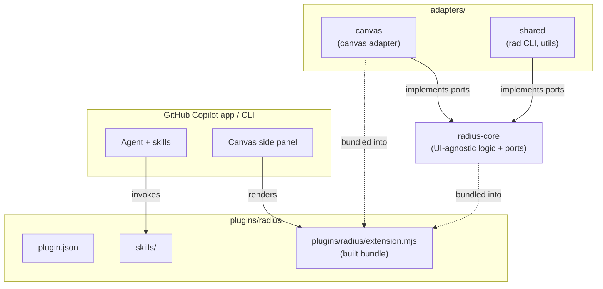
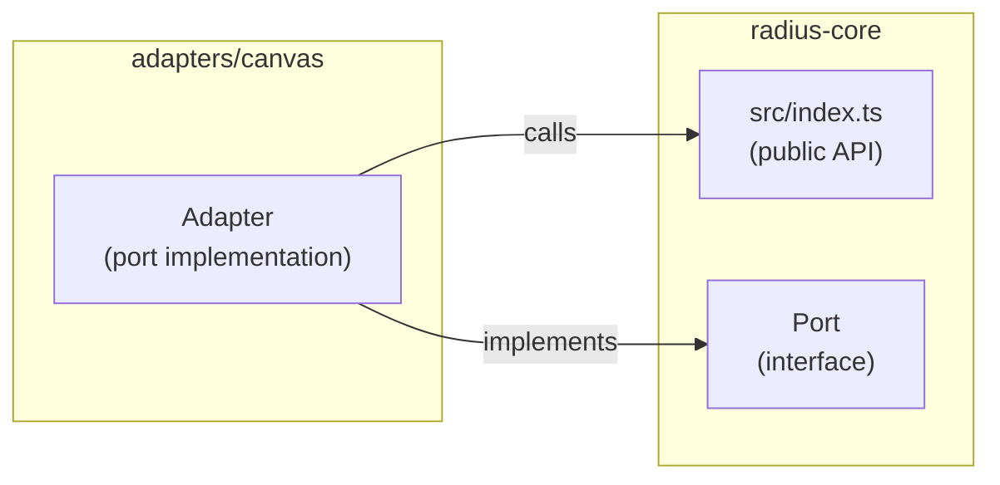
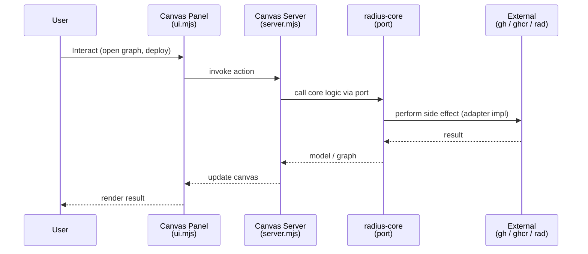
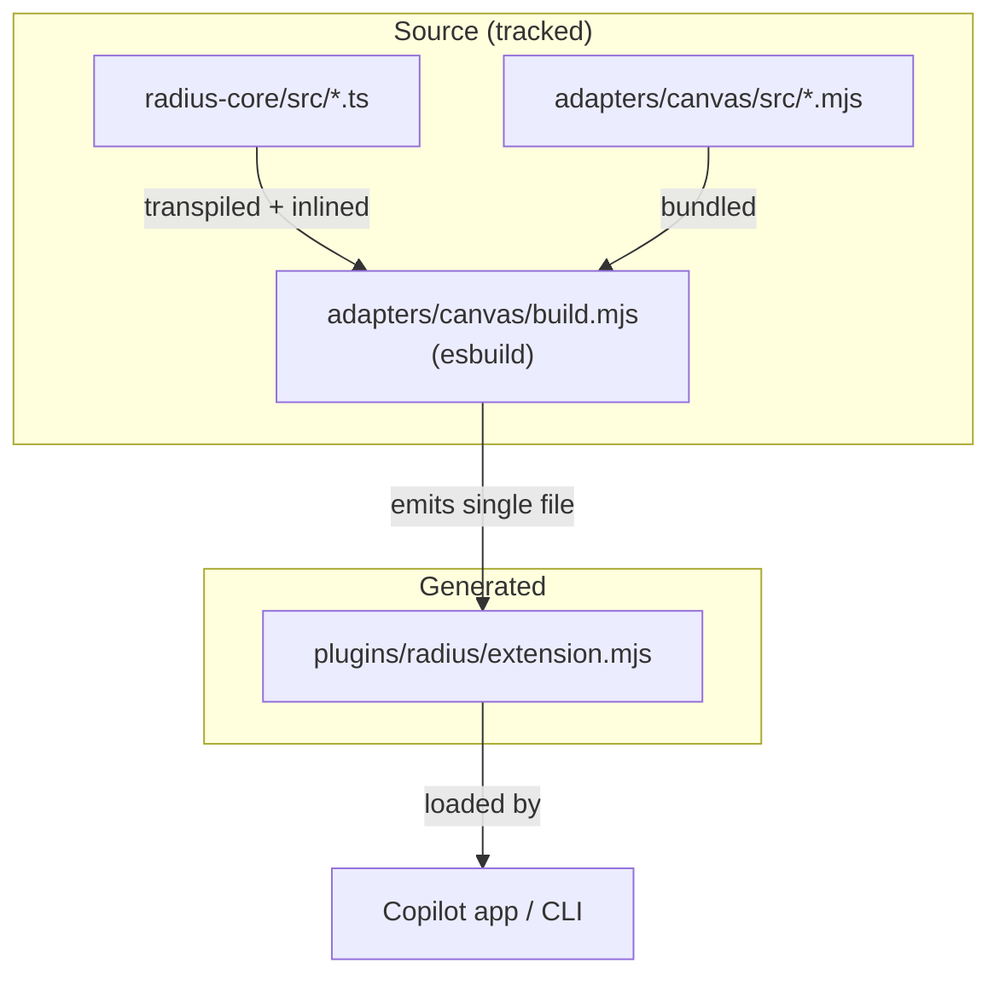
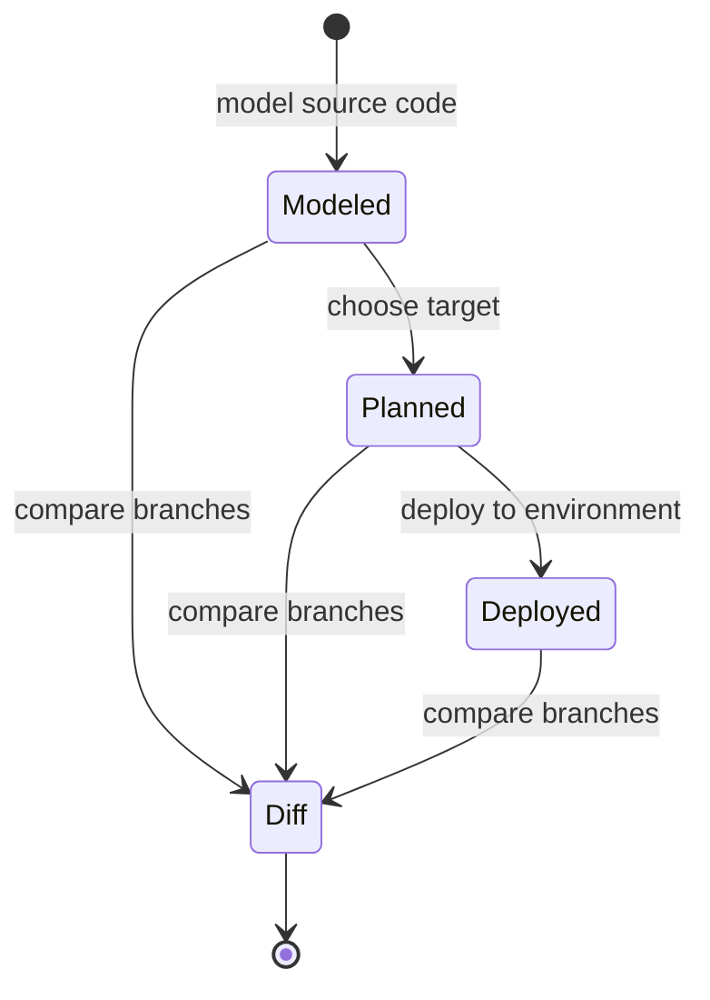

# Mermaid Diagram Patterns

Reusable Mermaid templates for architecture documentation in this repository. Copy and adapt these patterns, replacing the placeholder nodes with the actual packages, modules, and functions from the code you are documenting.

## High-Level System Overview (Top-Down Flowchart)

## Ports-and-Adapters Boundary (Component Diagram)

## Sequence Diagram (Canvas Action Flow)

## Build / Packaging Flow

## State Diagram (Application Graph Views)

## Tips for Effective Diagrams

### Keep It Readable

- **Max ~15 nodes** per diagram. Split complex systems into multiple diagrams.
- Use **subgraphs** to group related components (for example, `radius-core` vs. `adapters/canvas` vs. `plugins/radius`).
- Use **short labels** on arrows — one or two words.
- Prefer **top-down** (`TD`) for hierarchical relationships and **left-right** (`LR`) for data flows.

### Make It Accurate

- Use **actual names** from the code (package names, module file names, function names).
- Show **real relationships** — do not invent connections that do not exist in the code.
- Distinguish **source** from **generated** artifacts (for example, mark the built `extension.mjs` as bundled output).
- Show where a flow **crosses the core/adapter boundary** — that boundary is the most important architectural fact in this repo.

### Sequence Diagram Tips

- Name participants after their **actual role** in the code (for example, "server.mjs" not "Server").
- Use `Note over` to explain non-obvious steps.
- Use `activate`/`deactivate` to show which participant is processing.
- Show **error paths** with `alt`/`else` blocks when they are architecturally significant.

### Class Diagram Tips

- Use `<<interface>>` stereotypes for core ports.
- Show only **architecturally significant** fields and methods, not every field.
- Use composition (`*--`) vs. aggregation (`o--`) vs. dependency (`-->`) appropriately.
