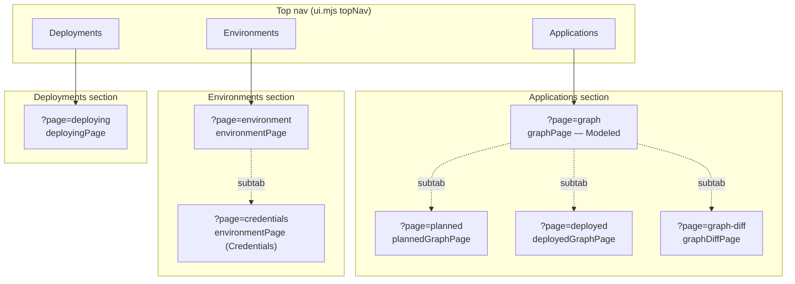
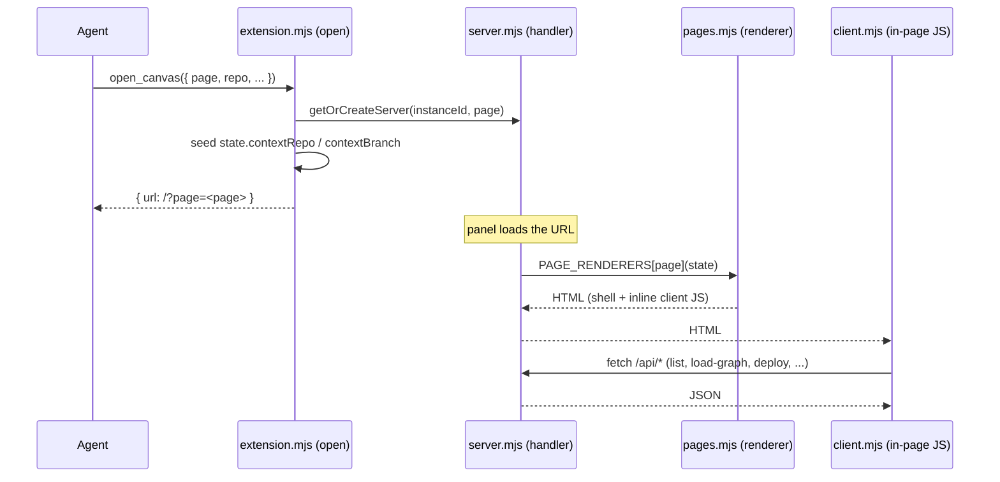

# Canvas pages: Applications, Environments, and Deployments

The Radius canvas is a single-panel web app served by a local loopback server. Its UI is organized under three top-level navigation sections — **Applications**, **Environments**, and **Deployments** — each of which renders one or more server-side HTML pages. This document explains how those sections map to pages, how a page is chosen and rendered, and what each section is responsible for.

## Key components

- **`adapters/canvas/src/ui.mjs` — `topNav(active)`**: Renders the three-tab top navigation. Each tab links to the landing page for its section: Applications → `?page=graph`, Environments → `?page=environment`, Deployments → `?page=deploying`. `active` is one of `applications | environments | deployments`.
- **`adapters/canvas/src/pages.mjs`**: The entire server-side view layer. Each exported `state => html` function renders one page (`graphPage`, `plannedGraphPage`, `graphDiffPage`, `deployedGraphPage`, `environmentPage`, `deployingPage`, `oidcPage`). `pageShell(title, body, activeNav)` wraps every page in the shared HTML shell, and `navFromTitle` infers which top-nav tab to highlight from the page title. There is no I/O or business logic here — only string building.
- **`adapters/canvas/src/server.mjs`**: The local loopback server. It parses the request, dispatches `~21` `/api/*` routes to a `radius-core` use-case or adapter helper, and — for a plain page load — selects a renderer from the `PAGE_RENDERERS` map and returns its HTML.
- **`adapters/canvas/src/extension.mjs` — `open` handler**: Maps the `open_canvas` input (`page`, `repo`, `baseBranch`, `headBranch`) to a server instance, seeds per-instance `state` (repo/branch context from the workspace), and points the panel at `/?page=<page>`.
- **`adapters/canvas/src/client.mjs`, `vendor.mjs`**: Browser-side behavior (fetching `/api/*`, rendering the graph, heartbeat reload) is embedded into each page as inline `<script>` from these modules. The server pages are static HTML; the client scripts make them interactive.

## How a page is chosen and rendered

Pages are selected by a `?page=` query parameter, defaulting to `environment`.

1. **Open**: `open` in `extension.mjs` reads `ctx.input.page` (default `"environment"`), calls `getOrCreateServer(instanceId, page)`, then seeds `entry.state` — most importantly `contextRepo` and `contextBranch`. When the input `repo` matches the workspace repo, the branch is set to the live worktree branch; otherwise it falls back to the input `branch` or `main`. The panel URL becomes `<baseUrl>/?page=<page>`.
2. **Route**: For a page request (no `/api/` prefix), `createRequestHandler` in `server.mjs` reads the `?page=` value (falling back to the instance's remembered page, then `environment`), and looks it up in `PAGE_RENDERERS`.
3. **Render**: The matched renderer is called with the instance `state` and returns a full HTML document. If no renderer matches, the server falls back to `environmentPage`.

The `PAGE_RENDERERS` map is the authoritative page → renderer table:

| `?page=` value | Renderer            | Top-nav section | Purpose                                  |
|----------------|---------------------|-----------------|------------------------------------------|
| `graph`        | `graphPage`         | Applications    | Modeled graph from `.radius/app.bicep`   |
| `planned`      | `plannedGraphPage`  | Applications    | Planned graph for a branch + environment |
| `deployed`     | `deployedGraphPage` | Applications    | Live graph running in an environment     |
| `graph-diff`   | `graphDiffPage`     | Applications    | Graph difference between two branches    |
| `environment`  | `environmentPage`   | Environments    | Environments list (Environments subtab)  |
| `credentials`  | `environmentPage`   | Environments    | Cloud credentials (Credentials subtab)   |
| `deploying`    | `deployingPage`     | Deployments     | Deploy an application; list deployments  |

## Applications

The **Applications** section is the app-graph workspace. Its landing page is `graph` (the **Modeled** view), and `graphHeader(activePage)` renders four sub-tabs shared across the four graph pages: **Modeled** (`graph`), **Planned** (`planned`), **Deployed** (`deployed`), and **Diff** (`graph-diff`). All four visualize the same application graph at different stages:

- **Modeled (`graphPage`)**: The graph as designed. Resolved from `.radius/app.bicep` in the working tree (for the workspace repo/branch) or from the committed file on a remote branch. Populated via `/api/load-graph` and `/api/load-graph-stream`, with the application list from `/api/list-applications`.
- **Planned (`plannedGraphPage`)**: The graph as it will be deployed to a chosen branch + environment. `/api/plan-graph` resolves recipes against the target environment. If a resource type has no recipe, the page reports the unresolved type — a recipe pack must be registered to the environment (recipes are not generated per-type on demand).
- **Deployed (`deployedGraphPage`)**: The graph as it is actually running, read from a live environment via `/api/deployed-graph`, keyed by application + environment.
- **Diff (`graphDiffPage`)**: The difference between two branches' graphs. When `open_canvas` supplies `baseBranch` and `headBranch` (the PR-diff flow), the `open` handler fetches `app.bicep` on each branch, builds both graphs, and calls `computeGraphDiff` so the page opens already comparing. Branch discovery/comparison also runs through `/api/discover-branches` and `/api/diff-branches`.

Two agent-callable actions layer source-code deep links onto these graphs: `get_graph_resources` returns the current resources (optionally only those missing a `codeReference`), and `update_source_refs` attaches references back to the exact graph context.

## Environments

The **Environments** section is served entirely by `environmentPage`, which renders two sub-tabs driven by `state.activeSubtab`:

- **Environments** (`?page=environment`): Lists the repository's Radius-managed environments and lets the user create or delete one. The list comes from `/api/list-environments` (which reads GitHub Actions environments and their variables); creation goes through `/api/create-environment`, deletion through `/api/delete-environment`.
- **Credentials** (`?page=credentials`): Configures cloud identity federation (OIDC) so GitHub Actions can authenticate to Azure or AWS. It uses `/api/oidc`, `/api/verify-azure-login`, `/api/verify-aws-login`, and the credential-profile routes (`/api/credential-profiles`, `/api/save-credential-profile`, `/api/delete-credential-profile`). `oidcPage` provides the standalone OIDC configuration surface used by the `configure_oidc` action.

The server sets `state.activeSubtab` based on which `?page=` value was requested (`credentials` → Credentials, otherwise Environments), so a direct `?page=credentials` load lands on the right subtab.

## Deployments

The **Deployments** section is served by `deployingPage`, which always renders the deploy landing view (`deployLandingView`): an application selector, an environment selector, a **Deploy** button, and a table of existing deployments. Deploying dispatches a GitHub Actions workflow, so it operates on committed/pushed branches (an unpushed worktree-only branch defaults to `main`).

Key routes for this section:

- `/api/list-applications` and `/api/list-deployments` populate the selectors and the deployments table.
- `/api/app-params` reads deployment parameters from `app.bicep`.
- `/api/deploy` dispatches the deployment workflow; `/api/deploy-status` polls progress; `/api/deploy-reset` clears in-flight state.
- `/api/delete-deployment` removes a deployment.

Live deployment progress (streaming graph + logs) is intentionally shown on the **Applications → Deployed** tab, not here — navigating back to Deployments always returns to the listing view. One subtlety: while a deployment is `in_progress`, an *implicit* landing on `environment`/`credentials` (a bare `/` reload with no `?page=`) is redirected to `deploying` so the user rejoins the in-flight run; an *explicit* top-nav click is always honored.

## Notable details

- **State is per-instance and in-memory.** Each canvas instance (`instanceId`, always `radius-panel`) owns one server `entry` with its own `state`. Repo/branch context, graph resources, credentials, and deploy status all live there; there is no shared page-level store.
- **Pages are static HTML; interactivity is client-side.** `pages.mjs` never performs I/O. The dynamic behavior — dropdown population, graph rendering, polling, heartbeat reload — is inline `<script>` from `client.mjs`/`vendor.mjs` that calls the `/api/*` routes.
- **The core/adapter boundary sits behind `/api/*`.** Page renderers and client scripts never call `radius-core` directly. Each `/api/*` route in `server.mjs` is where a request crosses into a `radius-core` use-case (for example, graph building and diffing) or an adapter helper (`gh`, `ghcr`, `rad`, deploy).
- **The session branch is never silently defaulted to `main` for the workspace repo.** The `open` handler binds `contextBranch` to the live worktree branch when the input repo is the workspace repo, and only falls back to `main` for a different repo or for deploy paths that require a pushed branch.
