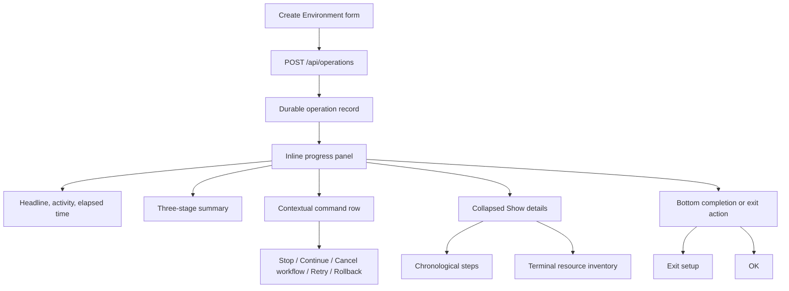
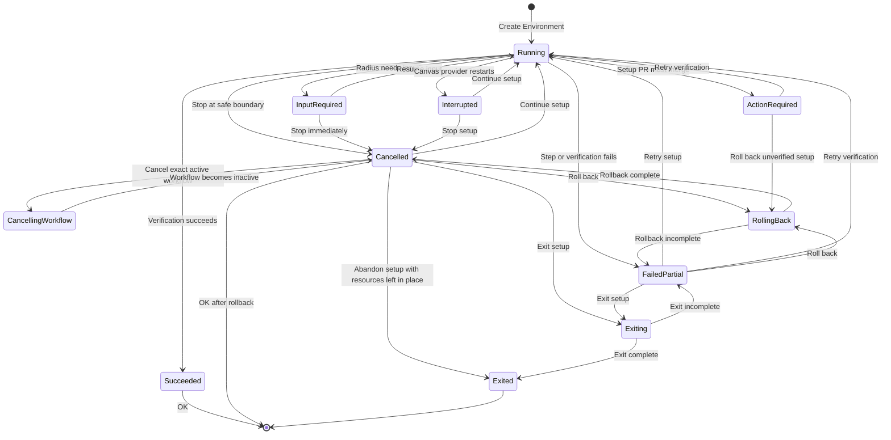
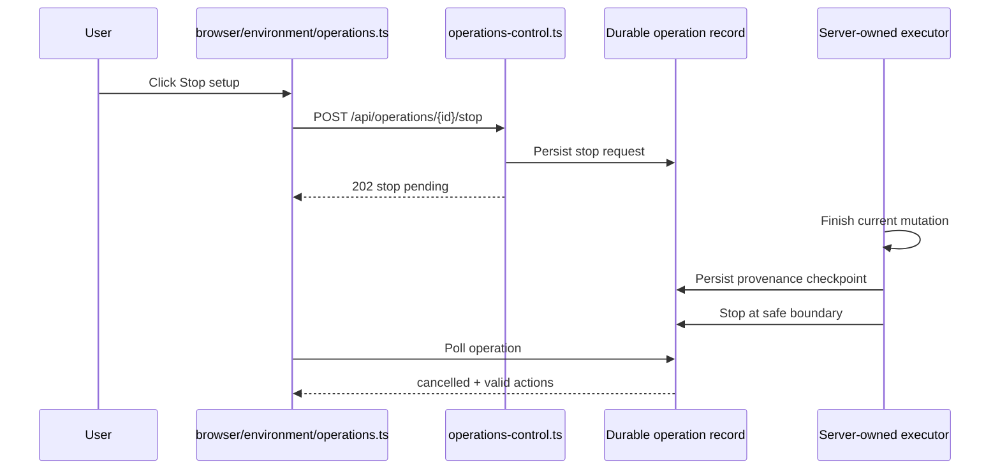

# Draft: Create Environment progress UX

> **Status:** Draft reference for aligning long-running Radius experiences with Create Environment.

Create Environment uses an inline, durable progress panel rather than a blocking modal. The panel separates a concise statement of what Radius is doing from a stable stage summary, a collapsed event history, and context-specific controls for stopping, continuing, retrying, rolling back, or exiting setup.



## Key components

- [`operations.ts`](../../packages/adapter-canvas/src/operations.ts) owns the durable operation model, lifecycle transitions, server-projected actions, headline text, guidance, resource provenance, and browser-safe client view.
- [`operations-control.ts`](../../packages/adapter-canvas/src/server/routes/operations-control.ts) owns the typed Stop, Continue, Cancel workflow, Rollback, Exit, and Retry HTTP routes.
- [`verification-workflow-cancellation.ts`](../../packages/adapter-canvas/src/server/services/verification-workflow-cancellation.ts) reads and cancels only the exact GitHub Actions run recorded by the operation, through the GitHub account that started setup.
- [`server.ts`](../../packages/adapter-canvas/src/server.ts) owns the per-instance executors that continue setup, monitor or retry verification, and run rollback or exit cleanup.
- [`cleanup-commands.ts`](../../packages/adapter-canvas/src/server/services/cleanup-commands.ts) defines which proven-owned resources each rollback, rollback retry, or exit command may remove.
- [`workflow-rollback.ts`](../../packages/adapter-canvas/src/server/services/workflow-rollback.ts) verifies and reverses workflow changes before a post-commit rollback deletes dependent resources.
- [`environments-pane.ts`](../../packages/adapter-canvas/src/pages/environment/environments-pane.ts) defines the server-rendered progress-panel and rollback-dialog markup.
- [`operations.ts`](../../packages/adapter-canvas/src/browser/environment/operations.ts) under `src/browser/environment/` renders operation records, submits controls, polls progress, manages focus, and updates terminal UI.

## UX principles

### Progress is inline and non-blocking

The progress panel appears on the Environments landing page above the environment table. Customers may inspect progress without being trapped in a modal, and a page reload can rejoin the same server-owned operation.

### Progress is durable

The browser does not own the operation. `POST /api/operations` persists an operation record before the server accepts it and schedules background work. The panel polls the record by repository or operation ID, so navigation, reload, and extension restart do not erase the operation's identity or provenance.

### Progress is represented in layers

The panel uses three levels of detail:

1. **Headline:** what Radius is doing or what outcome occurred.
2. **Stage summary:** where the operation is in the stable product journey.
3. **Details:** the chronological steps and, when a terminal decision needs it, the resource inventory.

The layers serve different questions:

- **Headline:** “What is happening now?”
- **Stages:** “How far through the journey are we?”
- **Details:** “Exactly what did Radius do?”

### No percentage is shown

Create Environment has conditional work. Identity setup may be skipped, verification may wait for a pull request, and cleanup may add steps. A percentage would imply a fixed denominator that does not exist. The UI instead shows the current activity, stable stages, and elapsed time.

### The server decides which actions are valid

The browser renders the `actions`, `guidance`, `headline`, and `nextTransition` projected by `toClientView`. It does not reimplement eligibility. This prevents the page from offering a button that the operation model considers unsafe.

### Destructive operations require provenance

Radius removes only resources the operation ledger proves it created. Reused resources are never deleted. Ambiguous resources are listed as manual actions. Post-commit rollback verifies workflow provenance before deleting anything those workflows depend on.

## Panel layout

The progress panel follows this vertical order:

1. Header.
2. Stage summary.
3. Error summary, only for terminal error states.
4. Contextual command row.
5. **Show details** disclosure.
6. Bottom completion or exit row.

```text
┌──────────────────────────────────────────────────────────────────┐
│ ◐  Creating environment "dev" — configure environment…     0:42 │
│    Creating GitHub environment…                                 │
│                                                                  │
│ ✓ Authorize deploy identity — succeeded                         │
│ ◐ Configure environment — running                               │
│ ○ Verify credentials — pending                                  │
│                                                                  │
│ [Stop setup]                                                     │
│ Radius finishes the current safe step before stopping.          │
│                                                                  │
│ ▸ Show details                                                   │
└──────────────────────────────────────────────────────────────────┘
```

### Header

The header contains:

- A status icon.
- A headline.
- A supporting headline note when the state needs explanation.
- The current activity.
- Elapsed time.

The spinner animates only while `terminalState` is `null`. The browser adds `env-progress--active` during active work and removes it for every terminal result, including successful rollback.

### Stage summary

Create Environment exposes three provider-neutral stages:

1. **Authorize deploy identity**
2. **Configure environment**
3. **Verify credentials**

Each stage is `pending`, `running`, `succeeded`, `warning`, `failed`, or `skipped`. The stage list is stable even though the number of detailed steps varies.

### Error summary

The red error panel appears only for terminal `failed` or `failed_partial` states. It contains the safe error summary, cleanup outcome, retry guidance, and any cleanup warnings that require attention.

The error panel is hidden and cleared while work is active. Starting Continue, Retry, Rollback, or Exit removes stale failure presentation.

### Command row

The command row sits above **Show details** and contains choices that continue or recover the operation:

- **Stop setup**
- **Continue setup**
- **Retry setup**
- **Retry verification**
- **Roll back environment setup**
- **Roll back created resources**
- **Retry rollback**
- **Cancel workflow**, after an interrupted setup has been stopped and the exact saved verification run is still active

The row also contains short explanatory copy and any guidance explaining why an expected path is unavailable.

### Show details

The disclosure contains the chronological step list. It is collapsed by default during normal progress and may be opened for failures.

For stopped or partially failed operations that require a resource decision, Details also contains **What exists right now**:

- **Created by Radius and still present**
- **Created by Radius and available to roll back**
- **Reused — Radius does not own these**
- **Removed or already absent**
- **Needs an action from you**

The inventory is hidden during active work, successful environment creation, active rollback, completed rollback, and exited setup.

### Bottom action row

The bottom row appears below **Show details**. It is reserved for leaving or acknowledging the experience:

- **Exit setup** closes an incomplete setup and removes proven-owned disposable artifacts.
- **OK** acknowledges successful environment creation or completed rollback.

Recovery choices remain in the command row. Completion and exit controls remain at the bottom to communicate that they end the current interaction.

## High-level status and detailed progress

The high-level status and detailed progress are deliberately separate.

| Surface   | Purpose                   | Update frequency              | Example                            |
|-----------|---------------------------|-------------------------------|------------------------------------|
| Headline  | State or outcome          | On lifecycle transition       | `Continuing setup…`                |
| Activity  | Current work              | On step progress              | `Creating GitHub environment…`     |
| Stages    | Stable journey            | On stage transition           | `Verify credentials — pending`     |
| Details   | Complete chronology       | On every recorded step        | `Federated credential created`     |
| Inventory | Terminal decision support | On artifact or cleanup change | `Role assignment: Contributor @ …` |

The headline never tries to reproduce the whole step log. Details never replaces the headline. This separation allows customers to scan the panel quickly and inspect exact work only when needed.

## Operation lifecycle



## Starting Create Environment

The page sends one complete request to `POST /api/operations`. The server:

1. Validates the request.
2. Creates the operation and artifact ledger.
3. Enforces one active operation per repository.
4. Persists the record.
5. Returns `202` with the operation ID and status URL.
6. Schedules the server-owned executor.

The browser immediately switches from the form to the progress panel and follows the saved operation.

## Recovery after Refresh Canvas or application restart

Refresh Canvas and restarting the GitHub Copilot application both restart the Radius provider. The durable operation and any external GitHub Actions run survive that boundary. Radius therefore restores unfinished setup as `action_required` with reason `provider-restart-decision` instead of silently resuming work.

The panel presents **Environment setup was interrupted** and offers exactly two initial choices:

- **Continue setup** resumes from the saved phase. When verification was already dispatched, Radius resolves or reuses the exact recorded run and continues monitoring it; it does not dispatch another workflow.
- **Stop setup** durably closes Radius's setup attempt, then reads the status of the exact recorded verification run.

If the run is still active after Stop, the panel offers **Cancel workflow**. Cancellation uses the saved repository, run ID, and GitHub account; it never searches by workflow name, branch, environment, or latest run. If GitHub has accepted cancellation but the run is still settling, the control changes to **Check workflow status**, which reads status without sending another cancellation request.

Destructive rollback remains unavailable while the run is active, cancelling, or has an unknown status. Radius instead offers **Abandon setup**, which closes the operation without deleting resources that external work may still be using. Abandon releases the repository's Create Environment lock, preserves the resource ledger, and returns the user to the environment list so they can attempt Create Environment again. The confirmation lists remaining resources and warns that the next setup may need to reuse or manually remove them.

Once Radius proves the run is inactive, the ordinary provenance-based rollback and Exit cleanup controls become available. Cleanup still fails closed, but external reconciliation never becomes a prerequisite for leaving the operation.

### An earlier rollback is incomplete

A terminal operation may still own resources it can remove. This happens when Rollback, Retry rollback, or Exit was interrupted, or when cleanup finished with retryable warnings. Starting another setup for the repository would let the new setup reuse those resources while the older operation still had authority to delete them.

The durable registry therefore distinguishes active execution from repository admission. A non-terminal operation blocks admission as before. A terminal operation also blocks admission while its ledger still supports a safe first Rollback or Retry rollback against surviving proven-owned artifacts. Reused resources and ambiguous candidates do not block because the earlier operation cannot delete them.

`POST /api/operations` returns `409 previous-cleanup-required` with the earlier operation ID and does not create or persist the new operation. The browser reloads and focuses the earlier operation so the customer can finish **Roll back environment setup**, choose **Retry rollback**, or follow its manual guidance. After manual deletion, **Retry rollback** confirms absence as `not_found`; there is no separate recheck action. The customer submits Create Environment again after the earlier cleanup resolves.

Admission-blocking terminal records are exempt from age and count pruning. Normal retention resumes after no removable target remains. This guard applies within one hydrated Copilot App Session. It does not coordinate independent sessions.

An explicit **Abandon setup** decision relinquishes the earlier operation's automatic cleanup authority and releases admission even when removable resources remain. Radius keeps those resources in the durable ledger for diagnosis, but it will not later delete them after a new setup may have reused them.

## Stop setup

**Stop setup** is cooperative cancellation, not process termination.



Stop rules:

- Radius never kills an Azure CLI, GitHub CLI, or HTTP mutation in flight.
- Radius checks Stop before a mutation and after its provenance checkpoint.
- If Radius is waiting for input, it may cancel immediately because no mutation is active.
- The stop request is durable before the UI reports that it was accepted.
- After stopping, the server projects the valid choices for the saved state.

### Stopped-state rendering

```text
┌──────────────────────────────────────────────────────────────────┐
│ ◐  Environment setup stopped                              0:15 │
│    Radius stopped before the next setup step.                    │
│                                                                  │
│ ✓ Authorize deploy identity — succeeded                         │
│ ✓ Configure environment — succeeded                             │
│ – Verify credentials — skipped                                  │
│                                                                  │
│ [Continue setup] [Roll back created resources]                  │
│                                                                  │
│ ▸ Show details                                                   │
│                                                                  │
│ [Exit setup]                                                     │
└──────────────────────────────────────────────────────────────────┘
```

## Continue and retry

### Continue setup

Continue is the first forward action after an intentional stop. It resumes from the first incomplete safe step and reuses ledger-confirmed resources.

The route is:

```text
POST /api/operations/{operationId}/continue
```

### Retry setup

Retry setup appears after a continuation or interrupted setup fails. It increments the setup attempt and starts again from the first incomplete safe step.

The route is:

```text
POST /api/operations/{operationId}/retry/setup
```

### Retry verification

Retry verification repeats only credential verification. It reuses the exact saved workflow, ref, environment, and cloud identity and never starts deployment.

The route is:

```text
POST /api/operations/{operationId}/retry/verification
```

Retry verification is used for closed, classified cases such as:

- A setup pull request has now merged.
- Azure role assignments may not have propagated yet.
- Verification tracking expired.
- GitHub failed to dispatch the verification workflow.

### Retry rollback

Retry rollback selects only proven-owned resources that produced unresolved warnings during the latest cleanup attempt. Successful and already-absent deletions are not repeated.

The route is:

```text
POST /api/operations/{operationId}/retry/cleanup
```

### Shared retry rules

- Each command uses the existing operation ID.
- Command identity is deterministic from operation, command kind, attempt, and target.
- The command is persisted before work is scheduled.
- Duplicate submissions resolve to the saved command instead of scheduling twice.
- A repository lock prevents another setup from racing the retry.
- A scheduling or persistence failure restores or closes the record explicitly; it never leaves an unresolvable spinner.

## Rollback

Rollback removes only artifacts the operation proves Radius created. It never removes reused resources and never guesses ownership from a display name.

The route is:

```text
POST /api/operations/{operationId}/rollback
```

### Rollback confirmation dialog

The dialog is driven by a server-projected preview. The browser does not reconstruct the deletion set.

```text
┌──────────────────────────────────────────────────────────────────┐
│ Roll back this environment setup?                               │
│                                                                  │
│ Radius will remove                                               │
│ • Workflow file: .github/workflows/radius-verify-credentials.yml │
│ • GitHub environment: owner/repo:dev                             │
│ • Role assignment: Contributor @ /subscriptions/…                │
│                                                                  │
│ Radius will keep                                                 │
│ • App Registration: shared-app (00000000-…)                      │
│ • Service Principal: shared-app (00000000-…)                     │
│                                                                  │
│ Needs an action from you                                         │
│ • GitHub environment: owner/repo:old-dev — ownership unproven    │
│                                                                  │
│                         [Keep resources] [Roll back setup]        │
└──────────────────────────────────────────────────────────────────┘
```

Dialog behavior:

- Uses `role="dialog"` and `aria-modal="true"`.
- Moves focus into the dialog.
- Traps Tab within the controls.
- Escape and **Keep resources** close without acting.
- Focus returns to the rollback trigger after cancellation.
- Confirmation is disabled before the request is sent, preventing duplicate deletion.

### Pre-commit rollback

Before workflow files are committed, rollback removes proven-owned resources in reverse dependency order:

1. GitHub environment.
2. Azure role assignments.
3. Federated credentials.
4. Service Principal.
5. App Registration.

### Post-commit rollback

Successful verification is the environment-completion boundary. If verification has not succeeded, Radius may roll back after workflow commit.

Workflow changes are removed first because cloud resources must not be deleted while installed workflows still reference them.

Radius:

1. Reads the recorded workflow commit and file provenance.
2. Verifies the branch head when a setup branch is still in use.
3. Verifies each workflow file's blob and content digest.
4. Closes and deletes an unchanged, unmerged setup branch, or creates a new commit that restores or deletes each workflow file.
5. Stops without deleting cloud resources if any workflow cannot be proven unchanged.
6. Deletes the GitHub environment and cloud resources only after workflow rollback succeeds.

### Rollback running

```text
┌──────────────────────────────────────────────────────────────────┐
│ ◐  Rolling back created resources…                        0:18 │
│    Removing GitHub environment…                                 │
│                                                                  │
│ ✓ Workflow files reverted                                       │
│ ◐ GitHub environment — removing                                 │
│ ○ Azure role assignments — pending                              │
│                                                                  │
│ ▸ Show details                                                   │
└──────────────────────────────────────────────────────────────────┘
```

During rollback:

- The stale setup-failure banner is hidden.
- The resource inventory is hidden because the deletion set is changing.
- Setup retry and other conflicting controls are hidden.
- The spinner runs until the rollback reaches a terminal outcome.

### Rollback complete

```text
┌──────────────────────────────────────────────────────────────────┐
│ ●  Rollback complete                                      0:31 │
│    Radius removed what it created. Reused resources remain.      │
│                                                                  │
│ ▸ Show details                                                   │
│                                                                  │
│ [OK]                                                             │
└──────────────────────────────────────────────────────────────────┘
```

On completion:

- The spinner stops.
- The resource inventory remains hidden.
- The environment-list cache is invalidated.
- The browser reloads the environment table.
- The rolled-back environment no longer appears as Success.
- A single **OK** button appears below Details.

### Rollback incomplete

If a proven-owned resource could not be removed, the panel shows **Rollback finished with items still present**, the safe warning, and **Retry rollback** when the result is retryable.

If workflow provenance is incomplete or changed, rollback stops before deleting dependent resources and lists the manual action under Details.

## Exit setup

**Exit setup** is not a cosmetic dismissal. It is a server-owned command that closes an incomplete setup and removes disposable artifacts this attempt proved it created.

The route is:

```text
POST /api/operations/{operationId}/exit
```

Exit behavior:

- It appears at the bottom below **Show details**.
- **Retry setup** remains in the recovery command row.
- If Exit would delete created resources, it uses the rollback confirmation preview.
- Reused App Registrations and Service Principals are left alone.
- A created GitHub environment is removed so it does not remain in the environment list.
- The environment-list cache is invalidated and the list is refreshed.
- If no created resources remain, Exit closes the operation without destructive work.
- If cleanup cannot finish, the panel stays actionable and reports what remains.

## Input-required pauses

Some steps require customer input, such as selecting an App Registration or providing a Service Management Reference.

The operation moves to `input_required`, persists the prompt and safe resume request, and releases the executor. The UI shows the prompt-specific interaction and Stop remains available. A submitted answer is bound to the operation ID, prompt code, checkpoint, repository, environment, and provider.

## Terminal states

| Terminal state            | Meaning                                              | Primary UX                                             |
|---------------------------|------------------------------------------------------|--------------------------------------------------------|
| `succeeded`               | Environment verified and ready                       | **OK**                                                 |
| `succeeded_with_warnings` | Environment ready with non-blocking warnings         | **OK**                                                 |
| `action_required`         | Setup needs an external action, such as merging a PR | Open action, retry verification, or rollback when safe |
| `failed`                  | Setup failed without a safe continuation             | Error summary and available cleanup or exit            |
| `failed_partial`          | Setup failed after durable progress                  | Retry, rollback, or exit based on provenance           |
| `cancelled`               | Stop or rollback completed                           | Continue/rollback after Stop, or **OK** after rollback |

Terminal outcomes are latched. Later errors cannot overwrite the first terminal result. Continuation and cleanup attempts preserve previous outcomes in operation history.

## Successful completion

Successful Create Environment uses a minimal final presentation:

```text
┌──────────────────────────────────────────────────────────────────┐
│ ●  Environment "dev" is ready.                            1:39 │
│                                                                  │
│ ✓ Authorize deploy identity — succeeded                         │
│ ✓ Configure environment — succeeded                             │
│ ✓ Verify credentials — succeeded                                │
│                                                                  │
│ ▸ Show details                                                   │
│                                                                  │
│ [OK]                                                             │
└──────────────────────────────────────────────────────────────────┘
```

Success rules:

- No error panel.
- No resource inventory.
- No stale transition or rollback guidance.
- No planned-graph link.
- The spinner is stopped.
- One **OK** button appears below Details.

## Accessibility

- The progress panel is a named `region` and receives focus when an error or command result needs attention.
- The activity line and command status use polite live regions.
- Polling writes command status only when the text changes, so a pending Stop is announced once rather than on every poll.
- Errors use `role="alert"`.
- Stage glyphs are decorative; stage labels include state words.
- Buttons are native controls with disabled states during submission.
- Polling restores focus to the same server-projected command when that command remains available. If the command becomes disabled or disappears, focus moves to the command region.
- Destructive controls declare dialog behavior.
- Rollback confirmation traps keyboard focus and restores it on cancel.
- Confirming rollback moves focus to the stable progress panel before the hidden dialog is removed.
- A successful Exit moves focus to **New environment** before it hides the progress panel.
- Spinner animation honors reduced-motion preferences.
- No state relies on color alone.

## Content and security rules

- Raw CLI output, workflow logs, tokens, secrets, and diagnostic evidence are not included in browser operation records.
- Step labels and resource labels are inserted as text, never trusted HTML.
- The browser receives a safe resource preview, not the private ledger.
- Error messages distinguish created, reused, removed, retained, and ambiguous resources.
- A bare resource identifier is prefixed with its resource type.

### Local diagnostic download

**Download diagnostic snapshot** appears inside the operation's Details disclosure only at stable, non-success decision points: after Stop is requested, while Radius is waiting for input, or after a terminal outcome such as failure, cancellation, or external action required. A successful setup, including success with warnings, does not show the control. Normal forward progress, retry, reconciliation, and cleanup keep the link hidden so the page does not invite snapshots of rapidly changing state. A stalled operation first reaches its durable failed state; a customer who needs support before then can request Stop and download after the request is recorded. The default profile follows `GET /api/operations/{operationId}/diagnostics` as a non-cached local attachment. The browser does not upload either profile or persist another diagnostic record.

The diagnostic builder is independent of both the persisted operation serializer and the browser projection. It selects each output field from a closed schema and emits only the generated operation ID, installed plugin and operation schema versions, lifecycle and stage states, timing, bounded counts, failure classification, cleanup outcomes, provider-recovery statuses, verification-dispatch state, and the allowlisted state of the saved verification workflow. Unknown future enum values become the fixed value `unknown` and increment an omission count.

The review dialog defaults to the `support_safe` profile, which excludes repository and environment names, account and branch context, cloud and GitHub resource identities, persisted inputs, labels, targets, URLs, command lines, environment variables, idempotency keys, stdout, stderr, logs, evidence, messages, and step text. The customer may explicitly choose **Include contextual identifiers**, review the server-built repository, branch, environment, and GitHub login preview, and confirm that review before the `support_safe_with_identifiers` profile becomes downloadable. The preview carries an opaque fingerprint over those four values. The server rebuilds the values at download time and refuses the download if the fingerprint no longer matches. The browser checks the final response before saving the exact returned bytes through a temporary object URL; it never submits identifier values or saves an error response as the diagnostic file. Credential-profile names and worktree paths are never read into either profile. Secret exclusion and prompt-injection handling are tested as separate controls.

## Alignment guidance for other Radius progress experiences

Other long-running Radius experiences should align with these rules:

1. Use an inline, reload-safe progress surface for work that may take more than a few seconds.
2. Keep the headline concise and separate it from the event history.
3. Define a small, stable stage vocabulary and allow variable detailed steps.
4. Avoid percentages when the work graph is conditional.
5. Keep recovery actions above Details and completion or exit actions below Details.
6. Animate the status icon only while work is active.
7. Persist user commands before reporting acceptance.
8. Project valid actions from the server rather than re-deriving them in the browser.
9. Require provenance before destructive cleanup.
10. Preview destructive effects and preserved resources before confirmation.
11. Clear stale failure banners when recovery starts.
12. Refresh affected lists and invalidate caches after successful mutation or cleanup.
13. Give every non-terminal state either an automatic transition or a user action.
14. Use one clear acknowledgement, **OK**, after successful completion.

## Notable details

- Create Environment is scoped to one active operation per repository because concurrent attempts would race on shared identity, workflow, and environment resources.
- Polling is used instead of an event stream because Canvas navigation and reload are normal and polling can resume from the durable operation ID.
- Every terminal path releases the page's Create Environment latch, including Stop, Retry, Rollback, and Exit, so the customer can start another setup without reloading the Canvas.
- The artifact ledger records created versus reused ownership and cleanup results; this distinction drives both copy and deletion eligibility.
- Exit setup is separate from rollback because its product intent is to close the interaction, even when nothing needs deletion.
- Deployment remains user-initiated. Create Environment completion, retry, rollback, and exit never deploy an application.

## Source references

- [`packages/adapter-canvas/src/operations.ts`](../../packages/adapter-canvas/src/operations.ts)
- [`packages/adapter-canvas/src/server/routes/operations-control.ts`](../../packages/adapter-canvas/src/server/routes/operations-control.ts)
- [`packages/adapter-canvas/src/server/services/cleanup-commands.ts`](../../packages/adapter-canvas/src/server/services/cleanup-commands.ts)
- [`packages/adapter-canvas/src/server/services/operation-diagnostic-export.ts`](../../packages/adapter-canvas/src/server/services/operation-diagnostic-export.ts)
- [`packages/adapter-canvas/src/server/routes/operations-status.ts`](../../packages/adapter-canvas/src/server/routes/operations-status.ts)
- [`packages/adapter-canvas/src/server/services/workflow-rollback.ts`](../../packages/adapter-canvas/src/server/services/workflow-rollback.ts)
- [`packages/adapter-canvas/src/server.ts`](../../packages/adapter-canvas/src/server.ts)
- [`packages/adapter-canvas/src/pages/environment/environments-pane.ts`](../../packages/adapter-canvas/src/pages/environment/environments-pane.ts)
- [`packages/adapter-canvas/src/browser/environment/operations.ts`](../../packages/adapter-canvas/src/browser/environment/operations.ts)
