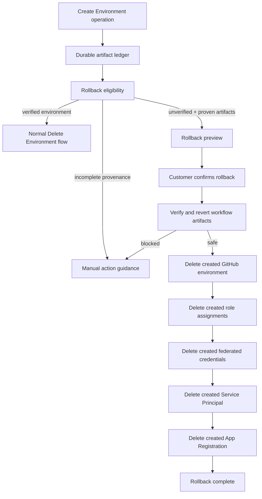
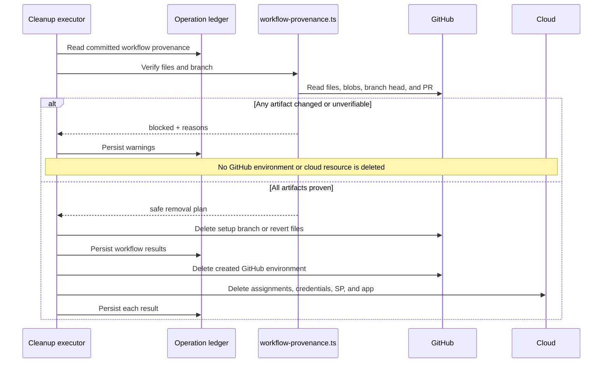

# Create Environment rollback

Create Environment rollback removes the durable artifacts an environment-creation attempt left behind when it never verified its credentials. Radius deletes only the artifacts the operation record proves it created, checks repository artifacts before it changes them, and stops short of destructive work when it cannot prove what it made. Deleting an established environment is a wider job with different rules.



## Key components

- [`operations.ts`](../../packages/adapter-canvas/src/operations.ts) defines the artifact ledger, stable artifact identity, rollback target selection, eligibility, browser-safe preview, cleanup results, and retry state.
- [`operations-control.ts`](../../packages/adapter-canvas/src/server/routes/operations-control.ts) accepts rollback and rollback-retry commands, persists the command before execution, and enforces one active operation per repository.
- [`cleanup-commands.ts`](../../packages/adapter-canvas/src/server/services/cleanup-commands.ts) selects the deletion set for first rollback, rollback retry, and Exit setup.
- [`workflow-provenance.ts`](../../packages/adapter-canvas/src/server/services/workflow-provenance.ts) proves that committed workflow files and setup branches are still exactly what Radius wrote.
- [`workflow-rollback.ts`](../../packages/adapter-canvas/src/server/services/workflow-rollback.ts) safely removes an unmerged setup branch or creates file-revert commits for workflows that reached a repository branch.
- [`server.ts`](../../packages/adapter-canvas/src/server.ts) executes the ordered cleanup pass, persists each result, invalidates the environment-list cache, and closes the operation.

## Rollback compared with Delete Environment

Rollback and Delete Environment have different starting assumptions.

| Concern             | Create Environment rollback                          | Delete Environment in PR #398                                        |
|---------------------|------------------------------------------------------|----------------------------------------------------------------------|
| Starting state      | Environment creation is incomplete or stopped        | Environment was created and appears in the environment list          |
| Completion boundary | Credential verification has not succeeded            | Environment is an established resource                               |
| Source of truth     | Creation operation's artifact ledger                 | Live target plus immutable credential-consumer provenance            |
| Ownership rule      | Delete only artifacts this attempt proves it created | Delete the target; remove only credentials proven safe and exclusive |
| Workflows           | Revert creation-time workflow changes when safe      | Dispatch the committed environment-deletion workflow                 |
| App Registration    | Delete only when this attempt created it             | Always retain; acknowledge with an inline Azure Portal link          |
| Service Principal   | Delete only when this attempt created it             | Retain with the app registration                                     |
| Missing resources   | Record `not_found` and converge                      | Record `not_found` and converge                                      |

The flows share only the lowest safe mutation seams: Azure credential-delete argv and not-found classification, GitHub environment-delete argv, argv-based command execution, and the environment-list cache contract. They must not share an eligibility shortcut or whole executor. Rollback leans on saved creation provenance and durable mutation journaling; Delete Environment combines live discovery with immutable credential-consumer provenance and immediate revalidation.

## Completion boundary

Successful credential verification is the product boundary between rollback and deletion.

- Until verification succeeds, the attempt is an unfinished setup, and Radius can roll it back.
- A failed OIDC or Azure Login verification stays rollback-eligible as long as provenance is complete.
- Once verification succeeds, the environment is established, and Delete Environment takes over.
- Committing the workflow does not finish the setup. Radius can still roll back after the commit when it proves the committed artifacts are unchanged and reverts them first.

## The artifact ledger

The operation ledger records what the attempt created, reused, committed, removed, or could not prove. Radius saves it with the operation and restores it when the extension restarts.

### Azure App Registration

Fields:

- `state`: `not_started`, `created`, `reused`, or `deleted`
- `appId`
- `displayName`
- `serviceManagementReference`

Rollback rule:

- `created`: Radius deletes it after removing everything that depends on it.
- `reused`: rollback never deletes it.
- `deleted`: nothing left to do.
- Missing identity: Radius does not target it.

### Service Principal

Fields:

- `state`
- `origin`
- `appId`
- `objectId`

Rollback rule:

- `created`: Radius deletes it.
- `reused`: rollback never deletes it.
- `created_candidate`: the principal was absent before Radius tried to create it and present afterward, but the create command did not prove ownership. Radius records `origin: unknown`, leaves it in place, and reports a manual action.
- Without a target ID Radius cannot delete precisely, so it records a warning or a manual action.

### Federated credentials

Each entry records:

- Credential `name`
- OIDC `subject`

Rollback rule:

- Every recorded entry is a credential the attempt created, so Radius deletes it.
- Radius deletes these credentials before the Service Principal and the App Registration.
- The stable identity is `name@subject`, not the display label.

### Azure role assignments

Each entry records:

- Role name
- Scope
- Service Principal object ID

Rollback rule:

- Every recorded assignment is one the attempt created.
- Radius deletes assignments before the identity they name.
- Without a principal object ID Radius cannot delete precisely.
- Azure CLI `not found` results count as complete.

### GitHub environment

Fields:

- `state`: includes `created`, `reused`, `created_candidate`, and `deleted`
- Repository
- Environment name

Rollback rule:

- `created`: Radius deletes it.
- `reused`: rollback never deletes it.
- `created_candidate`: Radius cannot prove whether its idempotent request created the environment, so rollback leaves it in place and reports a manual action.
- A pre-create 404, a successful PUT with matching creation evidence, and the mutation checkpoint promote the candidate to `created`. Radius settles the proof before the checkpoint, so a Stop honored by that checkpoint cannot strand a proven creation as a candidate.
- After a successful deletion, Radius invalidates the server environment-list cache and the browser reloads the list.

### Workflow files

For each committed workflow file, Radius records:

- Repository-relative path
- Branch
- Commit mode: default branch or setup pull request
- State: `committed` or `removed`
- Commit SHA
- Blob SHA
- SHA-256 digest of the exact content Radius wrote
- The first pre-Radius blob SHA, or `null` when Radius created the path. A retry that writes the same workflow again updates the current commit, blob, and digest but preserves this original rollback target.
- Whether the pre-write lookup proved that previous state. A non-null saved previous blob already proves the path existed, including in older records. An older null or a failed lookup remains unknown; a later retry cannot turn that unknown state into permission to delete the path.

Radius also records the overall commit state:

- Commit mode
- Setup branch
- Base branch
- Pull request URL
- Last setup-branch head SHA

Rollback rule:

- Radius reverts a committed workflow only while it can prove the file's current state in the repository.
- A removed workflow stays in the ledger as history, and Radius does not target it again.
- Records written before workflow provenance existed fail closed, and Radius refuses post-commit rollback.

### Cleanup results

For every cleanup result, Radius records:

- Cleanup attempt number
- Artifact type
- Human-readable target
- Stable identity when available
- Outcome: `deleted`, `restored`, `not_found`, `warning`, or `skipped`
- Safe detail

Radius keeps results across cleanup attempts. A retry targets only unresolved warnings on proven-owned artifacts, and it repeats no deletion that already succeeded or already found nothing.

## Stable artifact identity

Radius never matches a resource by display text. `cleanupArtifactIdentity` derives stable identities:

| Artifact             | Stable identity                   |
|----------------------|-----------------------------------|
| App Registration     | App ID                            |
| Service Principal    | App ID, falling back to object ID |
| Federated credential | Name and subject                  |
| Role assignment      | Role and scope                    |
| GitHub environment   | Repository and environment name   |
| Workflow file        | Branch and path                   |

The stable identity ties the ledger artifact, the cleanup target, and the cleanup result together. Display labels carry friendly names and annotations, which makes them unsafe as matching keys.

## When rollback is offered

`canStartRollback` offers rollback when:

- The operation is terminal.
- The environment has not reached `succeeded` or `succeeded_with_warnings`.
- The state is stopped, failed, partially failed, or action required.
- No completed cleanup attempt has already claimed the first rollback.
- At least one proven-owned artifact remains.
- If workflow files were committed, their saved provenance is complete.

`canStartRollback` refuses rollback when:

- The environment verified successfully.
- The operation is still active.
- No proven-owned artifacts remain.
- Rollback already ran and only retry or manual work remains.
- A post-commit record lacks file branch, commit, blob, content digest, or setup-branch head provenance.

The server re-evaluates eligibility when the command arrives. The browser preview explains what will happen, and the server decides what runs.

## What rollback will remove

Radius removes the proven-owned set in this order:

1. Workflow files or the setup branch.
2. GitHub environment.
3. Azure role assignments.
4. Federated credentials.
5. Service Principal.
6. App Registration.

This order runs backward along the dependency chain. Radius removes workflow artifacts before the environment and the identity they use, and it removes assignments and credentials before the identity they name.

## What rollback will not remove

Rollback never removes:

- Reused App Registrations.
- Reused Service Principals.
- Reused GitHub environments.
- A `created_candidate` GitHub environment whose creation cannot be proven.
- A resource identified only by name or display label.
- Workflow files changed since Radius committed them.
- A setup branch whose head contains commits Radius did not write.
- Any dependent cloud resource when workflow rollback is blocked.
- An environment that completed credential verification.
- Application deployments. The customer starts a deployment, and its own deletion flow removes it.

Radius also never assumes a resource is safe to delete because it resembles the expected resource or carries a familiar name.

## Rollback preview

Before the customer confirms, the server projects three lists:

- `removes`: proven-owned targets selected for this rollback.
- `keeps`: reused or intentionally retained resources.
- `manualActionRequired`: ambiguous or unprovable resources with a specific reason.

```text
Roll back this environment setup?

Radius will remove
- Workflow file: .github/workflows/radius-verify-credentials.yml on main
- GitHub environment: owner/repo:dev
- Role assignment: Contributor @ /subscriptions/.../resourceGroups/rg
- Federated credential: radius-dev @ repo:owner/repo:environment:dev

Radius will keep
- App Registration: shared-deploy-app (00000000-...)
- Service Principal: shared-deploy-app (00000000-...)

Needs an action from you
- GitHub environment: owner/repo:old-dev — Radius cannot prove it created this environment.

[Keep resources] [Roll back setup]
```

The server builds the preview from the operation ledger and renders it as text. The browser never computes the deletion set.

## Rollback command acceptance

The route is:

```text
POST /api/operations/{operationId}/rollback
```

The server:

1. Loads the exact operation.
2. Checks for a duplicate cleanup command.
3. Re-evaluates rollback eligibility from the ledger.
4. Acquires the repository operation lock.
5. Snapshots the terminal state for recovery.
6. Increments the cleanup attempt.
7. Records a deterministic command identity based on operation, command kind, attempt, and artifact set.
8. Persists the reopened operation.
9. Schedules the instance-owned cleanup executor.
10. Returns `202`.

If persistence or scheduling fails, the route restores the preceding terminal state or closes the operation with an explicit scheduling failure. It never leaves an active record with no runner.

## Workflow rollback

Radius rolls back workflows before it deletes the GitHub environment or the cloud identity.

Rollback creates a pinned executor for the GitHub login saved on the operation. It does not use the process's ambient GitHub credential. Before it treats a file-level 404 as absence, it proves that the selected account can still read the repository; it repeats that repository check after each file, branch, or deletion 404 because GitHub also uses 404 when access to a private repository disappears.



### Unmerged setup pull request

When every workflow sits on the setup branch and the pull request has not merged, Radius:

1. Checks that the branch head still equals the saved head SHA.
2. Closes the pull request, best effort.
3. Deletes the setup branch.
4. Records all workflows as removed.

If the branch head moved, Radius refuses to delete the branch because it contains work the operation did not create.

### Default-branch commit or merged pull request

When workflows already live on a repository branch, Radius:

1. Resolves the branch where each workflow currently lives.
2. Closes an open setup pull request, best effort, when a mixed default/setup-branch write requires individual file reverts.
3. Reads the current file.
4. Compares the current blob SHA and content digest with the saved provenance.
5. Commits a deletion if it created the file.
6. Reads the first pre-Radius blob and commits a restore if it replaced a file.
7. Records deletion as `deleted` and restoration as `restored`.

One file that Radius cannot locate, cannot verify, or finds changed blocks the whole workflow pass before Radius modifies anything. The repository never ends up with half its workflows reverted.

## GitHub environment rollback

Radius deletes the GitHub environment only when its ledger state is `created`.

After a proven deletion or a `not found` response, Radius:

- Marks the environment deleted in the ledger.
- Invalidates the environment-list cache for the repository.
- Refreshes the environment table in the browser, where the rolled-back environment disappears from the list.

For `created_candidate`, Radius records a manual action and leaves the environment in place.

## Azure rollback

Azure cleanup touches only the selected stable keys.

### Role assignments

Radius deletes assignments with:

- Service Principal object ID
- Exact role
- Exact scope

Radius does not pass `--assignee-principal-type` to `az role assignment delete`; that flag belongs to create.

### Federated credentials

Radius deletes each recorded federated credential by App Registration ID and credential name.

### Service Principal

Radius deletes the Service Principal only when the ledger state is `created`.

### App Registration

Radius deletes the App Registration only when the ledger state is `created`, and only after assignments, credentials, and Service Principal cleanup.

Radius treats every `not found` result as convergence: the resource is already gone.

## Persistence during rollback

Radius persists the operation after each meaningful result:

- Workflow pass results.
- GitHub environment deletion.
- Each Azure deletion result.
- Final cleanup state.
- Command completion and terminal result.

If the extension stops mid-rollback, the restored ledger keeps cleanup in the interrupted `running` state. The terminal record offers Rollback again, recomputes the target set from the surviving artifacts, and repeats no deletion or restoration the ledger proved complete.

The restored record also retains repository admission while it can still remove a surviving proven-owned artifact. A new Create Environment request for the same repository receives `409 previous-cleanup-required` and links back to the older operation. This prevents a new setup from reusing a resource that the older rollback could later delete. The older operation may reacquire the lock to finish its own cleanup. Once every removable target is deleted, restored, or confirmed absent, the customer may submit the new Create Environment request again.

Admission-blocking records are not pruned by age or by the terminal-record cap. The protection is scoped to one hydrated Copilot App Session and is not a distributed repository lock across sessions.

## Rollback completion

Rollback completes when every selected target is `deleted`, `restored`, or `not_found`.

The operation moves to `cancelled` with terminal reason `rollback-complete`. The UI:

- Hides stale setup-failure banners.
- Stops the spinner.
- Hides resource inventory.
- Reloads the environment list.
- Shows one bottom **OK** button.

If warnings remain, the operation ends `failed_partial` with a rollback-specific failure, and the UI offers **Retry rollback** for unresolved warnings on proven-owned artifacts.

## Exit setup

Exit setup selects the same proven-owned artifacts as rollback and serves a different purpose: it closes an incomplete setup the customer no longer wants to finish.

The route is:

```text
POST /api/operations/{operationId}/exit
```

Exit runs the cleanup pass when proven-owned artifacts exist. When everything remaining was reused, Exit closes the operation and leaves those resources alone. Exit removes a created GitHub environment so the abandoned attempt does not linger in the environment list.

Exit never deletes reused identities. If cleanup cannot finish, the setup stays visible and actionable instead of claiming it closed.

## Rollback retry

Rollback retry uses:

```text
POST /api/operations/{operationId}/retry/cleanup
```

Retry selects only warning results from the latest cleanup attempt that still map to proven-owned ledger artifacts. It excludes:

- Successful deletions.
- Already-absent resources.
- Skipped ambiguous resources.
- Reused resources.

Results from earlier attempts stay in the ledger, so the final report separates what Radius removed earlier from what remains.

## Failure modes

| Failure                                            | Behavior                                                                        |
|----------------------------------------------------|---------------------------------------------------------------------------------|
| Missing workflow provenance                        | Refuse post-commit rollback                                                     |
| Selected GitHub account unavailable                | Treat repository as unreadable; leave workflows and dependent resources         |
| Repository-hidden GitHub 404                       | Treat repository as unreadable, not as proof that a workflow is absent          |
| Workflow file changed                              | Leave all workflow and dependent resources                                      |
| Setup branch moved                                 | Leave branch and dependent resources                                            |
| GitHub read failed                                 | Record retryable warning; remove nothing dependent                              |
| Workflow revert failed after another file reverted | Record warnings; stop cloud deletion                                            |
| GitHub environment delete failed                   | Preserve warning and continue safe Azure cleanup only when workflow gate passed |
| Azure delete failed                                | Record warning; continue independent deletions                                  |
| Missing precise identity                           | Skip deletion and report manual action                                          |
| Process restart                                    | Restore ledger; recompute surviving target set                                  |
| Duplicate command                                  | Return the existing command; do not schedule twice                              |

## Security and safety invariants

1. **Proven ownership:** Radius deletes only `created` ledger artifacts.
2. **Stable identity:** Radius matches on IDs, paths, branches, roles and scopes, and subjects, never on display text.
3. **Dependency order:** workflows and the environment go before the cloud identity.
4. **All-or-nothing workflow proof:** one unverified workflow blocks dependent cleanup.
5. **Persist-before-progress:** Radius makes accepted commands and deletion outcomes durable before it moves on.
6. **One active repository operation:** cleanup cannot race setup or another cleanup.
7. **No secret exposure:** the browser preview never receives tokens, secret values, CLI output, or diagnostic evidence.
8. **Idempotent convergence:** missing resources count as complete.
9. **No application deployment:** rollback never deploys or deletes deployed applications.
10. **Pinned GitHub identity:** workflow proof, workflow reversion, and GitHub environment deletion use the account saved on the operation, never an ambient account.

## Alignment with PR #398

### Shared mutation seams

- Both flows use `buildFederatedCredentialDeleteArgs` and `isAzResourceNotFound` from `azure-oidc.ts`.
- Both flows use `buildGitHubEnvironmentDeleteArgs` from `github-environment.ts` and invalidate the same environment-list cache after confirmed removal.
- Delete Environment owns the 404-tolerant `deleteGitHubEnvironmentIdempotent` execution classifier. Rollback retains exact-identity reads, durable mutation journaling, and outcome-unknown reconciliation around the shared argv.

### Different identity policy

Rollback deletes an App Registration or Service Principal only when the attempt created it. Delete Environment never deletes either object; it records that the app registration was retained and links to the Azure Portal after a concluded deletion. Keep that distinction explicit:

- Rollback has creation provenance.
- Deletion has live target discovery, immutable credential-consumer provenance, immediate live credential revalidation, and user confirmation.

### Sequencing

Rollback removes workflows before credentials because those workflows reference the identity. PR #398 keeps its own load-bearing order: the environment-deletion workflow needs the federated credential until the Radius environment deletion workflow finishes.

### Progress and recovery

Both flows can align on:

- Durable operation records.
- Stage and step reporting.
- Idempotent `not_found` outcomes.
- Persisting each destructive result.
- Bottom **OK** on successful completion.
- Cache invalidation and environment-list refresh after GitHub environment removal.

Their controls remain flow-specific. Creation can expose **Stop setup**, Continue setup, rollback, and exit actions. An incomplete deletion exposes only **Retry deletion** and resumes the same durable operation; deletion is not pausable.

### Scope boundary

Rollback handles an environment that never verified successfully. PR #398 handles an established environment. The shared low-level seams preserve that product distinction and keep rollback's setup-ledger assumptions from becoming deletion's implicit authority.

## Source references

- [`packages/adapter-canvas/src/operations.ts`](../../packages/adapter-canvas/src/operations.ts)
- [`packages/adapter-canvas/src/server/routes/operations-control.ts`](../../packages/adapter-canvas/src/server/routes/operations-control.ts)
- [`packages/adapter-canvas/src/server/services/cleanup-commands.ts`](../../packages/adapter-canvas/src/server/services/cleanup-commands.ts)
- [`packages/adapter-canvas/src/server/services/workflow-provenance.ts`](../../packages/adapter-canvas/src/server/services/workflow-provenance.ts)
- [`packages/adapter-canvas/src/server/services/workflow-rollback.ts`](../../packages/adapter-canvas/src/server/services/workflow-rollback.ts)
- [`packages/adapter-canvas/src/server/services/workflow-rollback-ports.ts`](../../packages/adapter-canvas/src/server/services/workflow-rollback-ports.ts)
- [`packages/adapter-canvas/src/server.ts`](../../packages/adapter-canvas/src/server.ts)
- [PR #398: Clean up cloud state on environment deletion](https://github.com/radius-project/ai-extensions/pull/398)
