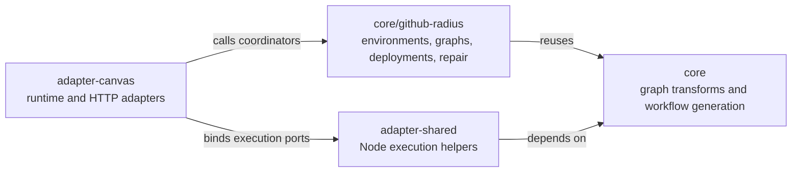
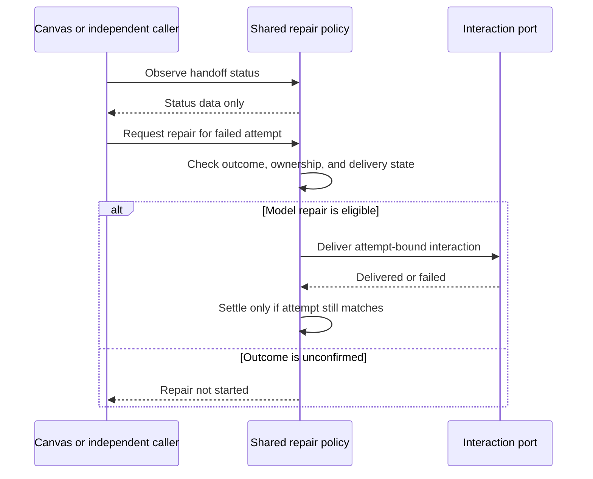

# GitHub Radius library

The GitHub Radius entry point in `@radius-project/core/github-radius` groups shared coordination separately from Canvas transport and presentation. Callers provide execution and interaction ports rather than a Copilot SDK session or an HTTP response.



## Key Components

- `packages/core/src/github-radius/index.ts` exposes the coordination families and repair functions. Family-specific entry points expose narrower APIs.
- `packages/adapter-shared` supplies reusable Node helpers, including managed Radius CLI execution. Shared execution must not import Canvas.
- `packages/adapter-canvas` translates host requests and selected context into coordinator inputs, binds execution and interaction ports, and presents results through existing tools, routes, and pages.
- `packages/adapter-canvas/test/ci/library-boundary.test.ts` bundles the shared public entry and rejects transitive Canvas, SDK, and core-to-Node execution dependencies. Synthetic fixtures verify both accepted and rejected dependency chains.

## How It Works

Each coordinator receives the data and capabilities needed for its workflow. Repository selection, authorized workspace access, user confirmation, and agent delivery are explicit boundaries. A frontend may supply a different presentation without reproducing the workflow's decisions.

Graph reads are distinct from the policy that requests authoring or refresh. Deployment observation is distinct from the policy that requests a repair. Canvas can compose these operations to retain its existing experience, while another caller may choose a read-only interaction.

The repair entry points illustrate the separation. `resolveDeploymentRepair` admits a retry only for the current failed attempt with remaining budget and a confirmed execution outcome. `beginDeploymentAttempt` updates identity and clears stale evidence synchronously using an injected identity generator. `deploymentHandoffStatus` only reads state. `requestDeploymentRepair` and `reportUnconfirmedDeployment` deliberately initiate different interactions through delivery and scheduling ports.

A caller can inspect a failed attempt without starting a server or sending an agent message:

```typescript
import {
  deploymentHandoffStatus,
  resolveDeploymentRepair,
  type DeploymentRepairState
} from "@radius-project/core/github-radius";

const state: DeploymentRepairState = {
  deployStatus: "failed",
  deployAttempt: { id: "attempt-1" },
  deployRepairAttempts: 0
};
const admission = resolveDeploymentRepair(state, "attempt-1", 5);
const delivery = deploymentHandoffStatus(state);
```

Neither call dispatches a workflow or requests a repair. To start a deployment, compose `deployments.createDeployRequestService` with the required credential, source, dispatch, monitoring, and persistence dependencies. Its target and source arguments are explicit; the Canvas tool adapter resolves the selected entry before making that call. `deployments.observeDeployment` projects status without invoking repair. Canvas invokes its repair policy separately.



## Notable Details

GitHub environments and Radius environments are different objects. An authored definition is not proof of deployed resources. An unreadable source is not a missing application. A failed status read is not a confirmed failed deployment, and an uncertain dispatch must not cause an automatic duplicate mutation.

Environment coordinators operate on caller-owned **mutable operation records**, not immutable snapshots. The same live record must be shared by the coordinator, its `OperationDomain` implementation, and the caller's persistence checkpoints. Coordinators may update `verification` and `providerRecovery` fields directly; those writes do not implicitly persist data or announce a transition. Callers persist only at the explicit checkpoint ports. A database-backed adapter must therefore manage a mutable working record and save it at those checkpoints rather than relying exclusively on transition callbacks.

`environments.createEnvironmentOperationDomain` implements the shared journal, stage, step, stop, and terminal transitions. Canvas and independent callers use that same factory with injected clock, digest, diagnostic redaction, and terminal notification ports. Canvas retains its operation registry, serialized versions, legacy quarantine restoration, and persistence implementation; the factory is not a replacement operation store. Canvas also retains acknowledgement-sensitive notification timestamps through its notification adapter. Unknown mutation IDs and invalid statuses do not mutate records, diagnostics for unknown IDs are a no-op, and preparing a mutation preserves an `unrecoverable_legacy` quarantine. This extraction does not introduce exactly-once dispatch, new operation history, or stronger cross-process recovery guarantees. Frontend confirmations do not replace backend authorization or ownership checks.

Structured results and diagnostic data remain separate from HTML and executable browser scripts. Adapters preserve their existing HTTP methods, status codes, stream framing, page state, and tool output contracts.

The build still assembles one loadable extension at `.artifacts/radius/com.github.copilot/extensions/radius/extension.mjs`, published as part of the plugin tree. The Copilot SDK stays external to that bundle. Shared-library conformance and built-extension smoke tests do not substitute for real-host qualification.
