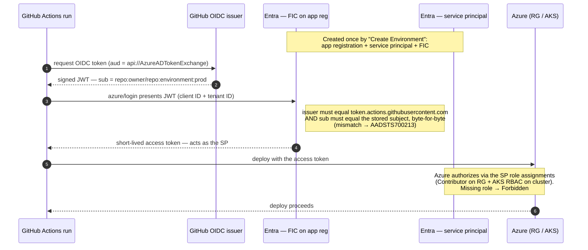
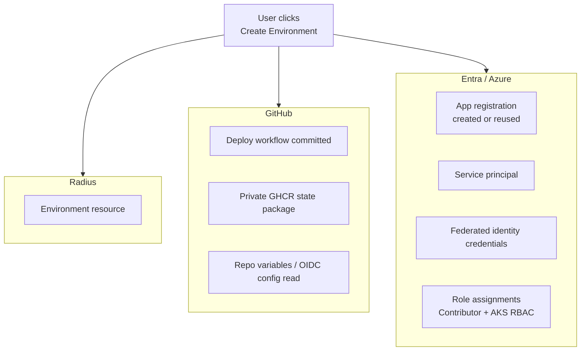

# OIDC: Connecting GitHub to a Cloud Provider, and What "Create Environment" Really Does

This is an **architecture doc**: it describes how the canvas extension connects
GitHub to a cloud provider over OIDC today, and what a Radius "Environment" actually
provisions. It doubles as a **companion primer for the Azure-OIDC-from-enterprise
pull request**, which is large (~4,400 lines across the `packages/core` platform layer
and the canvas adapter) because it makes one deceptively simple action — "create an
Environment and deploy to it from GitHub Actions" — work from a **locked-down
enterprise tenant** (e.g. Microsoft Corpnet) where the naive happy path fails with a
chain of cryptic Azure and GitHub errors.

## Overview

The goal of this document is to let a reviewer (or a future maintainer) read *top to
bottom* and come away understanding three things:

1. **The concepts.** How OIDC lets GitHub deploy to Azure or AWS with no stored
   secret, and what an Entra *application*, a *service principal*, and a *federated
   identity credential* actually are.
2. **What we're really provisioning.** Creating a Radius "Environment" through the
   canvas is not just a Radius object — it also creates or reuses **GitHub**
   components, an **Entra enterprise application**, and **cloud/Entra role
   assignments**. Making that honest and legible is a large part of the PR.
3. **What changed and why.** The specific Radius/canvas components that had to
   change to expose those concepts safely — multiple GitHub accounts, reused
   application names, subject-claim correctness, and the four-step UI redesign that
   followed once these concepts became first-class.

For the deep, error-by-error root-cause analysis (including how the `azd` CLI solves
the same problems upstream), see the companion write-up referenced in
[References](#references). This document is the *conceptual and architectural*
map; that one is the *forensic* map.

## Terms and definitions

| Term                                    | Plain-English meaning                                                                                                                                                                                                                                                                                                                                                                                                                                                                                                                                                                                                                                                                                                                                                                                                                                                                                                                                                                                                                                                                                                                                                                                                                                                        |
|-----------------------------------------|------------------------------------------------------------------------------------------------------------------------------------------------------------------------------------------------------------------------------------------------------------------------------------------------------------------------------------------------------------------------------------------------------------------------------------------------------------------------------------------------------------------------------------------------------------------------------------------------------------------------------------------------------------------------------------------------------------------------------------------------------------------------------------------------------------------------------------------------------------------------------------------------------------------------------------------------------------------------------------------------------------------------------------------------------------------------------------------------------------------------------------------------------------------------------------------------------------------------------------------------------------------------------|
| **OIDC (OpenID Connect)**               | An identity layer on top of OAuth 2.0. Here it lets one system (GitHub Actions) prove "who is running" to another system (Azure/AWS) with a short-lived, signed token instead of a stored password.                                                                                                                                                                                                                                                                                                                                                                                                                                                                                                                                                                                                                                                                                                                                                                                                                                                                                                                                                                                                                                                                          |
| **Entra ID**                            | Microsoft's identity platform, formerly Azure Active Directory (Azure AD).                                                                                                                                                                                                                                                                                                                                                                                                                                                                                                                                                                                                                                                                                                                                                                                                                                                                                                                                                                                                                                                                                                                                                                                                   |
| **App registration**                    | An identity object in Entra ID — "a username for a robot." Globally defines an application and its allowed sign-in methods. Has a **client ID** (`AZURE_CLIENT_ID`).                                                                                                                                                                                                                                                                                                                                                                                                                                                                                                                                                                                                                                                                                                                                                                                                                                                                                                                                                                                                                                                                                                         |
| **Service principal**                   | The *local instance* of an app registration inside a specific tenant. You assign roles (Contributor, etc.) to the service principal, not to the global app.                                                                                                                                                                                                                                                                                                                                                                                                                                                                                                                                                                                                                                                                                                                                                                                                                                                                                                                                                                                                                                                                                                                  |
| **Enterprise application**              | The Entra portal's name for the service principal side of an app registration. When we say "we create the enterprise application," we mean the app registration **plus** its service principal presence in the tenant.                                                                                                                                                                                                                                                                                                                                                                                                                                                                                                                                                                                                                                                                                                                                                                                                                                                                                                                                                                                                                                                       |
| **Federated Identity Credential (FIC)** | A trust rule on an app registration: *"accept a token from issuer `X` whose `subject` claim equals this exact string."* No secret involved. This is what makes secret-less OIDC deploys possible.                                                                                                                                                                                                                                                                                                                                                                                                                                                                                                                                                                                                                                                                                                                                                                                                                                                                                                                                                                                                                                                                            |
| **Subject (`sub`) claim**               | The part of GitHub's OIDC token that describes the run: which repo, branch, or environment. The FIC's stored subject must match it **byte-for-byte**.                                                                                                                                                                                                                                                                                                                                                                                                                                                                                                                                                                                                                                                                                                                                                                                                                                                                                                                                                                                                                                                                                                                        |
| **Service Management Reference (SMR)**  | A governance identifier stamped on an app registration (Entra property `serviceManagementReference`) that links the robot identity back to an internal service catalog / CMDB, so security teams know who owns every app. At **Microsoft** this GUID is a **Service Tree ID**, but SMR is a generic Entra field: any enterprise can enforce *"every new app registration must carry one"* via tenant policy — a pattern already common in banks, government, and healthcare, and one we expect to **spread** as more orgs formalize identity governance. When the policy is on, `az ad app create` fails with `ServiceManagementReference field is required` unless the value is supplied. This is not novel to Radius: **Aspire's Azure path had to solve the exact same problem.** Aspire delegates its Azure identity/pipeline plumbing to the **`azd` CLI** (`Azure/azure-dev`, MIT-licensed), which added a first-class `-m, --applicationServiceManagementReference` flag (plus the `pipeline.config.applicationServiceManagementReference` config key) and re-prompts/retries on the Service-Tree policy error instead of surfacing a raw Graph error (azd CHANGELOG [#4049](https://github.com/Azure/azure-dev/pull/4049)). Radius mirrors that approach — see §C.3. |
| **Workload identity**                   | The runtime, pod-side counterpart to CI OIDC. After deployment, the Radius control-plane pods authenticate to the target cluster/cloud by presenting a **projected, auto-rotated OIDC token** (mounted as `AZURE_FEDERATED_TOKEN_FILE`), not a stored secret — validated against a FIC just like the CI runner's token. See the [AKS vs AKS Automatic note](#a-note-on-aks-vs-aks-automatic) for how this differs from *cluster access*.                                                                                                                                                                                                                                                                                                                                                                                                                                                                                                                                                                                                                                                                                                                                                                                                                                     |
| **GHCR**                                | GitHub Container Registry (`ghcr.io`). Radius stores per-environment control-plane **state** as a private OCI package here.                                                                                                                                                                                                                                                                                                                                                                                                                                                                                                                                                                                                                                                                                                                                                                                                                                                                                                                                                                                                                                                                                                                                                  |
| **EMU**                                 | Enterprise Managed User — a GitHub account fully managed by an enterprise. EMU accounts often **cannot** access resources (like public GHCR content) that a personal account can, which is central to the multi-account handling below.                                                                                                                                                                                                                                                                                                                                                                                                                                                                                                                                                                                                                                                                                                                                                                                                                                                                                                                                                                                                                                      |

## Scope

This doc describes behavior that exists in the code today (`Fixes #161`). It focuses
on the identity concepts the extension depends on, what a Radius Environment
provisions end to end (Radius + GitHub + Entra + cloud), and the components that
implement each capability, so the large diff reads as intentional.

Out of scope: re-deriving every enterprise error (the companion forensic write-up in
[References](#references) does that), the AKS Automatic deploy-time `kubelogin` gap (a
separate `radius-project/radius` deploy-pipeline issue, beyond the credential-setup
RBAC assignment noted in [§C.5](#c5-serverts-apiazure-auto-setup--the-orchestrator)),
and deep AWS parity (AWS OIDC is covered conceptually for contrast; the enterprise-
policy hardening is concentrated on the Azure path).

## Part A — How OIDC connects GitHub to a cloud (no secrets)

### A.1 The problem OIDC solves

To deploy to a cloud from GitHub Actions the old way, you stored a long-lived cloud
secret (a client secret or an access key) in GitHub Secrets. That secret is a
standing liability: it leaks, it rotates, it grants access forever until revoked.

**OIDC removes the stored secret.** When a workflow runs, GitHub *mints* a short-
lived JSON Web Token describing the run. The cloud is pre-configured to *trust*
tokens from GitHub that match a specific description. The token lives for minutes and
never leaves the run. The only thing stored is a **trust rule**, not a credential.

### A.2 The Azure shape: app registration → service principal → FIC

Read the diagram top-to-bottom as **time**. The three Entra objects are created
*once* by "Create Environment" (top note); then *every deploy* performs the handshake
below. The two enterprise failure modes are pinned to the exact step where they occur.

Three Entra objects, three jobs:

- **App registration** — the robot's global identity (client ID).
- **Service principal** — that identity's presence *in your tenant*, which is what
  actually holds role assignments (Contributor on the resource group, and — for AKS
  Automatic — an AKS RBAC role on the cluster).
- **Federated Identity Credential** — the trust rule: *issuer =
  `https://token.actions.githubusercontent.com`* and *subject = the exact string
  GitHub will put in the token's `sub`*.

The deploy works **only if the FIC's stored subject equals the `sub` GitHub actually
mints.** One character off and Azure returns
`AADSTS700213: No matching federated identity record found`. This single fact drives
the most subtle code in the PR (see [§C.1](#c1-packagescoresrcplatformsoidc-subjectts--the-heart-of-the-fix)).

### A.3 Why the subject string is not a constant

Tools historically hard-coded `repo:{owner}/{repo}:{suffix}`. That is no longer safe:

1. **Customized subject claims.** An org/repo can choose which claims compose `sub`
   via `GET /repos/{owner}/{repo}/actions/oidc/customization/sub` →
   `{ use_default, include_claim_keys }`.
2. **Immutable subject claims.** To stop "delete the repo, recreate it with the same
   name to steal its trust," GitHub can embed **numeric IDs**:
   `repo:{owner}@{ownerId}/{repo}@{repoId}:{suffix}`.

Either one makes a hard-coded name-based string wrong. **The only correct approach is
to ask GitHub what the subject will be and build the FIC to match** — and to *fail
loudly* on an unknown claim key rather than silently emit a wrong subject.

### A.4 The AWS shape (for contrast)

AWS expresses the same pattern with different nouns: an **IAM OIDC identity
provider** for `token.actions.githubusercontent.com`, and an **IAM role** whose
**trust policy** conditions on the token's `sub`/`aud`. The workflow calls
`AssumeRoleWithWebIdentity` and gets short-lived credentials. The Radius credential
profile stores only the **role ARN** (see `shared.ts`), never a secret. The canvas
supports both providers; the enterprise-policy hardening is concentrated on Azure
because that is where app-registration governance and immutable subjects bite.

## Part B — What "Create Environment" actually provisions

A reviewer's most important mental-model correction: **an Environment is not one
object.** In Radius, an Environment is a *deployment target* (a Prod vs Test split,
or Azure vs AWS). But standing one up through the canvas, wired for GitHub OIDC
deploys, provisions across **three** systems:

So "Create Environment" is really **"create a Radius Environment, and set up (or
reuse) the GitHub + Entra + cloud plumbing that lets GitHub Actions deploy into it
without a secret."** The old UI hid this; a user thought they were naming one thing
while the tool silently created a robot identity, granted it cloud roles, and
committed a workflow to their repo. The redesign ([Part D](#part-d--the-ui-redesign-and-its-rationale))
makes each of those provisioned pieces visible and attributes them to the correct
side of the connection.

## Part C — The components and how they changed

The change set splits cleanly into a **pure platform layer** (`packages/core`,
provider-agnostic, no I/O, heavily unit-tested) and the **canvas adapter**
(`packages/adapter-canvas`, the HTTP server + UI that performs the I/O). This separation is
deliberate: the tricky identity logic lives in pure functions that are trivial to
test, and the adapter wires them to `az`, `gh`, and the browser.

### C.1 `packages/core/src/platforms/oidc-subject.ts` — the heart of the fix

New pure module. Turns "read, don't assume" into code:

- `OidcSubjectConfig` models GitHub's customization response, including
  `useImmutableSubject` and the verbatim `subClaimPrefix` GitHub reports.
- `buildOidcSubject(...)` constructs the subject from **pre-fetched** inputs
  (canonical `owner/repo`, numeric owner/repo IDs, the customization config, and the
  suffix). It mirrors `azd`'s `BuildOIDCSubject`, layers on the immutable-default
  form, and **throws on an unknown claim key** so the extension is updated rather
  than emitting a silently-wrong subject.
- `buildEnvironmentSuffix(...)` and `buildFederatedCredentialName(...)` produce the
  trailing `environment:<name>` part and a collision-safe FIC name.

This module is why deploy-time login stops failing with `AADSTS700213`. It has a
dedicated 407-line test file (`oidc-subject_test.ts`).

### C.2 `packages/core/src/platforms/azure.ts`

Platform wiring that consumes the subject builder and exposes the Azure platform's
OIDC surface to the adapter (re-exported via `platforms/index.ts` and the package
`index.ts`). Keeps provider specifics out of the canvas server.

### C.3 `packages/adapter-canvas/src/azure-oidc.ts` — Azure decision logic

New adapter module holding the *pure* Azure setup decisions (so they're testable
without hitting `az`), 697 lines of tests alongside:

- **Idempotent app selection.** `selectAppRegistration` / `decideAppSelection` choose
  between reusing an owned app registration, honoring an explicitly wired
  `AZURE_CLIENT_ID`, or creating a new one — filtered to apps the signed-in user
  **owns** so we don't collide with someone else's app of the same name. This is the
  "multiple / reused application names" capability.
- **Governance input.** `buildAppCreateArgs({ appName, serviceManagementReference })`
  adds `--service-management-reference` only when supplied, and
  `isServiceManagementReferenceError` / `SERVICE_MANAGEMENT_REFERENCE_ERROR_IDS`
  detect the tenant-policy rejection so the UI can prompt for an SMR and retry.
- **FIC de-duplication.** `selectMissingFederatedCredentials` computes only the FICs
  that don't already exist, keeping an app under Azure's per-app FIC cap.
- **Input validation at the boundary.** `isUuid`, `isValidRepoSlug`,
  `isAksClusterName`, `isResourceGroupName` validate every value that reaches an
  `az`/`gh` argv.
- **Fail-closed 404 detection.** `isAzResourceNotFound` matches only Graph 404
  markers, so a transient error is never mistaken for "resource absent."

### C.4 `packages/adapter-canvas/src/gh.ts` — GitHub identity & multiple accounts

This is the "which GitHub account are we acting as?" capability. On an enterprise
machine this was the source of a whole *cluster* of confusing, seemingly unrelated
failures — all of which trace back to the tool silently acting as the wrong GitHub
identity:

- **GHCR `403 … Enterprise Managed User cannot access`** when bootstrapping the
  private control-plane state package. An **EMU** account often cannot pull the
  public GHCR content a personal account can, so a push/pull that worked on a laptop
  failed on a corp-managed one.
- **Acting as the wrong account.** A dev commonly has *both* a personal login and an
  EMU login in the `gh` keyring. The old heuristic could pick whichever was "active"
  rather than the one that actually owned the repo/workflow, so setup would commit or
  authenticate as the wrong user.
- **Bare `404` from GitHub** on a repo that clearly exists — the classic symptom of a
  token that lacks access or the right scope, which GitHub deliberately reports as
  "not found" rather than "forbidden." Without identity clarity this looked like a
  bug in Radius rather than a permissions gap.
- **`AADSTS901001` from an agentic session.** A stray `COPILOT_AGENT_SESSION_ID`
  leaked into child `gh`/`az` CLIs and poisoned the auth context; the identity layer
  strips it so the CLIs authenticate cleanly.

The host injects a `GH_TOKEN`, but a machine can also have several keyring logins
(personal + EMU). The previous heuristic could silently act as the wrong one, which
is what produced the symptoms above. The fix makes the acting identity explicit and
testable:

- `decideGhTokenStrategy(...)` is a pure resolver (unit-tested) that picks the token
  vs a keyring account with an explicit precedence: **an explicit user choice wins**;
  otherwise keep the injected token when it carries the `workflow` scope; otherwise
  fall back to a keyring login that has it; otherwise keep the token and let a later
  403 explain the gap.
- `getGitHubIdentity()` / `switchGhAccount(login)` expose the acting account and let
  the user switch (`gh auth switch`); `resetGhIdentityCache()` re-reads after a
  switch while preserving the sticky user preference.
- `getGhPackageCredentials()` pins the **GHCR** push to the *acting* account (via
  `gh auth token --user`) rather than whatever keyring account is active — this is
  what stops the EMU "you cannot access this content" 403 when bootstrapping the
  private state package.

### C.5 `server.ts` `/api/azure-auto-setup` — the orchestrator

The largest single change (`server.ts` grew ~784 lines). The `/api/azure-auto-setup`
handler is the end-to-end Azure setup sequence, in order: validate inputs → resolve
the acting GitHub identity → resolve/create the app registration (owned-first) →
create the missing FICs with the *correct* subjects → assign **Contributor** on the
resource group → assign **Azure Kubernetes Service RBAC Cluster Admin** on the
cluster (best-effort, non-fatal; required for AKS Automatic's Azure-RBAC clusters) →
return the values the environment needs.

Supporting endpoints added/hardened: `/api/verify-azure-login` (non-interactive
session check that also returns the friendly `subscriptionName`),
`/api/list-azure-app-registrations` (the owned-app picker), `/api/github-identity` +
`/api/github-account` (show/switch the acting account), and the credential-profile
CRUD (`/api/save-credential-profile`, `/api/credential-profiles`, …). A
cross-cutting fix strips `COPILOT_AGENT_SESSION_ID` from every child CLI so Azure
CLI's "agentic session" tagging doesn't trigger `AADSTS901001` in locked-down
tenants.

### C.6 `pages.ts` — the four-step UI

The Create Environment dialog was restructured into four numbered steps (see
[Part D](#part-d--the-ui-redesign-and-its-rationale)). `pages.ts` also holds the
owned-app picker, the opt-in "shared identity" pin, the acting-account switcher, and
the provider-aware profile detail. Note the **client-script constraint** captured by
a regression test: the client `<script>` is emitted inside a template literal, so an
escaped apostrophe (`\'`) un-escapes to a raw `'` and halts page init — a `vm.Script`
guard test now compiles every emitted script block.

### C.7 `shared.ts` — credential profiles

A credential profile is a named, verified identity → cloud destination binding
(`name, provider, user, tenantId, tenantName, subscriptionId, subscriptionName,
accountId, region, roleArn`). Profiles persist the **friendly** subscription/tenant
names (captured at verify time) so the UI reads as a name, not a bare GUID, and the
env form can offer a *dropdown of profiles* rather than re-entering identity each
time.

## Part D — The UI redesign and its rationale

Once the concepts above became first-class (an acting GitHub account, a reusable
credential profile, an app-registration identity, and a governance input), the old
one-blob dialog was actively misleading. The redesign reframes the dialog around the
**GitHub ↔ cloud connection it actually creates**, in four numbered steps:

1. **Name this environment.** The Radius Environment itself (placeholder examples:
   `prod`, `test`, `eastus-prod`).
2. **Connect GitHub to a cloud.** Pick the **GitHub account** that will commit the
   workflow and publish the state package, and the **credential profile** (a
   dropdown; selecting one shows its subscription/account and signed-in identity).
   Copy attributes each action to the correct side.
3. **Deploy identity.** The Entra **app registration** GitHub Actions signs in as —
   reuse an owned one or create it — with the SMR input revealed only when tenant
   policy requires it.
4. **Landing zone.** Where deploys land (resource group / cluster, or AWS account /
   region).

The redesign's thesis: **make the invisible provisioning visible.** A user should see
that creating an Environment also connects a specific GitHub identity to a specific
cloud identity and grants it roles — because that is what is happening, and hiding it
is how you get a wrong-account EMU 403 or a mismatched-subject `AADSTS700213` that
the user can't diagnose.

## Part E — The enterprise problems, mapped to components

A one-line index from "symptom" to "where it's handled." The full analysis is in the
companion write-up ([References](#references)).

| Symptom (enterprise)                               | Handled in                                                                     |
|----------------------------------------------------|--------------------------------------------------------------------------------|
| `AADSTS901001` (agentic-session client_session)    | `COPILOT_AGENT_SESSION_ID` stripped from child CLIs (`server.ts`, `gh.ts`)     |
| `ServiceManagementReference field is required`     | `buildAppCreateArgs` + SMR detection (`azure-oidc.ts`), UI prompt (`pages.ts`) |
| GHCR `403 … Enterprise Managed User cannot access` | `getGhPackageCredentials` pins push to the acting account (`gh.ts`)            |
| `AADSTS700213` (subject mismatch)                  | `buildOidcSubject` query-don't-assume + immutable subjects (`oidc-subject.ts`) |
| Wrong GitHub account acting                        | `decideGhTokenStrategy` + account switcher (`gh.ts`, `pages.ts`, `server.ts`)  |
| App-registration sprawl / collisions               | owned-first `decideAppSelection` + FIC dedup (`azure-oidc.ts`)                 |
| Bare `404` from GitHub preflight                   | repo access + admin preflight (`server.ts`)                                    |
| AKS Automatic data-plane `Forbidden`               | AKS RBAC Cluster Admin assignment (`server.ts`)                                |

### A note on AKS vs AKS Automatic

It is easy to hear "OIDC" and assume there is one thing going on. There are actually
**two**, and they answer different questions:

- **Door 1 — "Can this pod get a cloud token?"** (the *workload identity* term) — a
  Radius pod proving who it is to Azure.
- **Door 2 — "Can this client talk to the Kubernetes cluster?"** (the `kubelogin`
  story) — a runner or pod reaching the cluster's API server.

Standard AKS and AKS Automatic treat these two doors very differently, and mixing
them up is the fastest way to misread both this PR and issue #12550. So let's take
them one at a time.

**Door 1 works the same on both.** The projected-token → FIC exchange behaves
identically whether the cluster is standard AKS or AKS Automatic. The only real
difference is convenience: **AKS Automatic turns the machinery on for you** (the OIDC
issuer and the workload-identity webhook are enabled by default), while on standard
AKS you have to opt in first (`--enable-oidc-issuer --enable-workload-identity`)
before the projected token / `AZURE_FEDERATED_TOKEN_FILE` even exists. Nothing about
this door is what broke the deploy.

**Door 2 is where they diverge — and where the deploy actually broke.** This door is
*not* workload identity; it is simply how a client reaches the Kubernetes API. Here
AKS Automatic is much stricter:

| What matters                             | Standard AKS (defaults)                                 | AKS Automatic                                                              |
|------------------------------------------|---------------------------------------------------------|----------------------------------------------------------------------------|
| Local admin accounts                     | Available (`get-credentials --admin` → cert kubeconfig) | **Disabled**                                                               |
| Who you sign in as                       | Local or optional Entra                                 | **Entra required**                                                         |
| Who decides what you can do              | Kubernetes RBAC                                         | **Azure RBAC for Kubernetes**                                              |
| What the kubeconfig looks like           | Often a simple cert, no plugin                          | **Needs the `kubelogin` exec plugin**                                      |
| Must run `kubelogin convert-kubeconfig`? | Only if Entra is enabled                                | **Always** (`-l azurecli` on the runner, `-l workloadidentity` in the pod) |

In plain terms: on **standard AKS** a deploy often "just works," because it can fall
back to a built-in admin certificate and never touch `kubelogin`. On **AKS
Automatic** there is no admin fallback — the kubeconfig insists on the `kubelogin`
plugin, and the deploy pipeline does not install or convert it yet. That is the
`kubelogin not found` failure, tracked as
[`radius-project/radius#12550`](https://github.com/radius-project/radius/issues/12550).

**So where does this PR fit?** It fixes a *different* half of Door 2. AKS Automatic
also requires an **Azure RBAC** role to authorize the identity (otherwise you get a
`Forbidden`), and the credential-setup step in
[§C.5](#c5-serverts-apiazure-auto-setup--the-orchestrator) assigns exactly that
role. The missing `kubelogin` **binary** is the separate, still-open gap in #12550 —
adjacent to this work, but not part of it.

## Reviewer's guide — where to start

Suggested reading order for the diff:

1. `packages/core/src/platforms/oidc-subject.ts` + `oidc-subject_test.ts` — the pure
   core of the correctness fix. Understand this and the rest follows.
2. `packages/adapter-canvas/src/azure-oidc.ts` + `azure-oidc.test.ts` — the pure Azure
   decisions (app selection, SMR, FIC dedup, validation).
3. `packages/adapter-canvas/src/gh.ts` + `gh.test.ts` — multi-account identity and GHCR
   credential pinning; focus on `decideGhTokenStrategy`.
4. `packages/adapter-canvas/src/server.ts` — `/api/azure-auto-setup` as the orchestration
   spine that composes the above.
5. `packages/adapter-canvas/src/pages.ts` — the four-step UI and its client-script guard.
6. `shared.ts` / `deploy.ts` — credential-profile persistence and the deploy path.

The pure modules (1–3) carry the bulk of the test coverage precisely because they
hold the tricky logic; the adapter is intentionally thin glue over them.

## References

- **Companion forensic write-up** (session artifact):
  *"Deploying to Azure from Corporate Environments: What Broke, Why, and How Aspire
  Solves It"* — the error-by-error root-cause analysis and the `azd`/Aspire
  reference implementations.
- GitHub — [Configuring OIDC in Azure](https://docs.github.com/actions/deployment/security-hardening-your-deployments/configuring-openid-connect-in-azure)
- GitHub — [Customizing the subject claim](https://docs.github.com/actions/deployment/security-hardening-your-deployments/using-openid-connect-with-reusable-workflows#customizing-the-subject-claims-for-an-organization-or-repository)
- GitHub — [Configuring OIDC in AWS](https://docs.github.com/actions/deployment/security-hardening-your-deployments/configuring-openid-connect-in-amazon-web-services)
- Microsoft — [Workload identity federation](https://learn.microsoft.com/entra/workload-id/workload-identity-federation)
- Microsoft Graph — `serviceManagementReference` on the Application resource
- Reference implementation — `Azure/azure-dev` `cli/azd/pkg/tools/github/oidc.go`
  (`GetOIDCSubjectConfig`, `BuildOIDCSubject`)
