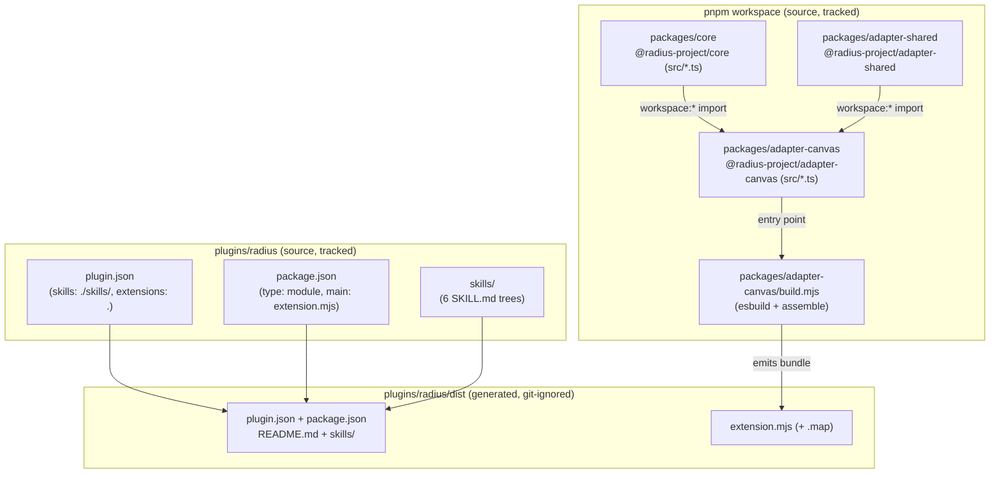
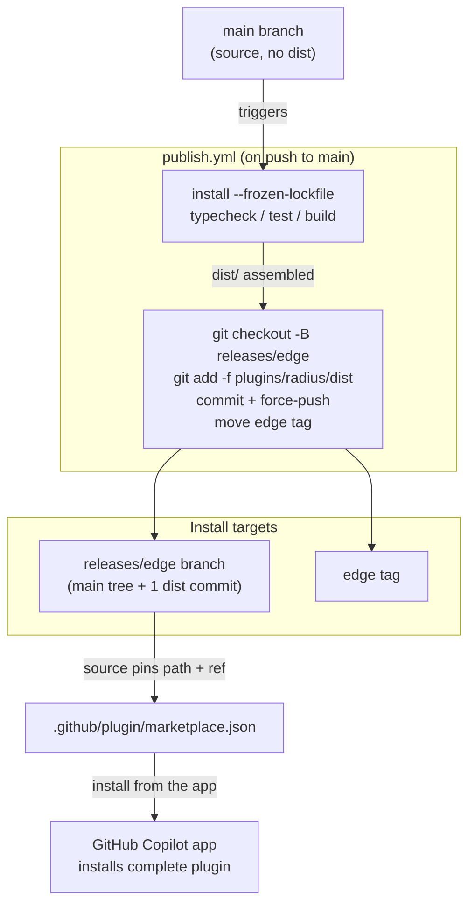

# Plugin packaging and publishing

How the `radius` Copilot plugin is laid out, how its canvas bundle is built from the workspace source, and how CI assembles a complete, installable artifact into `plugins/radius/dist/` and publishes it to a generated `releases/edge` branch without committing build output to `main`.



## Key components

- **`packages/core` (`@radius-project/core`)** — UI-agnostic product logic behind ports. `private`, `main: src/index.ts` (consumed as TypeScript source, not a published package).
- **`packages/adapter-shared` (`@radius-project/adapter-shared`)** — shared adapter utilities (for example, `rad` CLI invocation). Depends on core via `workspace:*`.
- **`packages/adapter-canvas` (`@radius-project/adapter-canvas`)** — the canvas adapter whose entry `src/extension.ts` calls `joinSession` / `createCanvas({ id: "radius" })`. Depends on core and shared via `workspace:*`.
- **`packages/adapter-canvas/build.mjs`** — the esbuild step that bundles the adapter plus its `workspace:*` dependencies into one file, then assembles `plugins/radius/dist/`.
- **`plugins/radius/`** — the tracked plugin source: `plugin.json`, `package.json`, `README.md`, and `skills/`.
- **`plugins/radius/dist/`** — the generated, installable plugin: the tracked source above plus the built `extension.mjs`. Git-ignored on `main`.
- **`.github/plugin/marketplace.json`** — the marketplace manifest whose plugin `source` points installs at `plugins/radius/dist` on `releases/edge`.
- **`.github/workflows/publish.yml`** — the CI workflow that builds the plugin and publishes `dist/` to the `releases/edge` branch and `edge` tag.

## How it works

### 1. The plugin layout: tracked source vs. generated dist

The repository is a [pnpm](https://pnpm.io/) workspace monorepo (`pnpm-workspace.yaml` lists `packages/*` and `plugins/*`). All workspace packages are `private`; the canvas adapter pulls in the core and shared packages through the `workspace:*` protocol rather than from a registry.

The plugin **source** lives at `plugins/radius/`; the **installable** plugin is assembled into `plugins/radius/dist/`, which is git-ignored:

| Path                                | Origin          | Tracked? | Purpose                                                   |
|-------------------------------------|-----------------|----------|-----------------------------------------------------------|
| `plugins/radius/plugin.json`        | source          | yes      | Manifest: `skills: "./skills/"`, `extensions: "."`.       |
| `plugins/radius/package.json`       | source          | yes      | Extension package: `type: module`, `main: extension.mjs`. |
| `plugins/radius/skills/`            | source          | yes      | The six skill trees (`SKILL.md` plus `references/`).      |
| `plugins/radius/README.md`          | source          | yes      | Plugin documentation.                                     |
| `plugins/radius/dist/`              | built           | no       | The complete installable plugin; git-ignored.             |
| `plugins/radius/dist/extension.mjs` | built (esbuild) | no       | The canvas bundle, plus its `.map`.                       |

Because `plugin.json` declares `extensions: "."`, the canvas `extension.mjs` and its `package.json` sit at the **plugin root** — which, for an install, is `dist/`. The build copies the tracked source into `dist/` so those relative paths resolve.

### 2. The build: bundling the workspace, then assembling `dist/`

`pnpm run build` delegates to `packages/adapter-canvas/build.mjs`, which invokes esbuild with:

- **entry** `packages/adapter-canvas/src/extension.ts`,
- **outfile** `plugins/radius/dist/extension.mjs`,
- **format** `esm`, **target** derived from `.node-version`,
- **minify** with `keepNames` and an external source map, and
- **external** `@github/copilot-sdk` (and `/extension`) — the loader resolves the SDK at runtime, so it is never bundled.

esbuild transpiles the TypeScript core and inlines the `workspace:*` dependencies, producing a single self-contained `extension.mjs` (~700 KB minified). This file is the reason a build step is unavoidable: the plugin cannot ship hand-authored source because the canvas imports the **TypeScript** core via `workspace:*`, which must be transpiled and inlined first.

The script then copies `plugin.json`, `package.json`, `README.md`, and `skills/` next to the bundle, so `dist/` is a complete plugin directory. `dist/` is wiped at the start of every run and refreshed after each rebuild in watch mode.

The whole of `dist/` is git-ignored so `main` never carries large generated files that would cause constant merge conflicts.

### 3. The publish: shipping `dist/` on `releases/edge`

Because `dist/` is git-ignored and the marketplace installs only git-tracked files with no build step, it would never ship from `main`. `.github/workflows/publish.yml` closes that gap. It runs on every push to `main` (after a PR merges) and on manual `workflow_dispatch`, with `permissions: contents: write` and a `concurrency` group so only one publish runs at a time.



The publish step is deliberately simple: `git checkout -B releases/edge` **recreates** the branch at the just-built `main` commit, then a single commit force-adds the otherwise-ignored `plugins/radius/dist/`. Because the branch is the `main` tree plus that commit, the tracked sources travel automatically and only `dist/` is added. Finally the `edge` tag is force-moved to the new head.

Both the branch and the tag are recreated on every push, so neither accumulates history — superseded bundles become unreferenced objects rather than permanent repository growth.

### 4. The install: resolving the complete artifact

`.github/plugin/marketplace.json` pins the plugin `source` to the object form:

```json
"source": {
  "source": "github",
  "repo": "radius-project/ai-extensions",
  "path": "plugins/radius/dist",
  "ref": "releases/edge"
}
```

The pinned `ref: releases/edge` means an install resolves the plugin from that branch regardless of which ref the marketplace was added from, so there is no `@ref` suffix to specify, and `path` points at the assembled `dist/` rather than the source directory. Because the Radius canvas can only be hosted by the GitHub Copilot app, the plugin is installed from the app: open app settings, click **Plugins**, add the `radius-project/ai-extensions` marketplace, and install the `radius` plugin.

The installer copies the git-tracked files at `plugins/radius/` from the `release` ref into the app's installed-plugins directory (for example, `~/.copilot/installed-plugins/radius-plugins/radius/`). Because the bundle is committed on `release`, the installed plugin now contains everything: `plugin.json`, `package.json`, `extension.mjs`, and `skills/`.

## Notable details

- **Skills and canvas stay in lockstep.** Both come from the same `main` commit tree that the publish job checked out, so a PR that updates a skill and a PR that updates canvas code both land on `release` together on the next publish. There is no way for the shipped skills to lag the shipped bundle.
- **`release` is generated — never hand-edit it.** The publish job force-recreates the branch every run, so any manual commit to `release` would be overwritten. `main` remains the single source of truth.
- **The publish gates on the same checks as CI.** `typecheck` and `test` run before the bundle is assembled, so a broken build never publishes; on failure, `release` and `latest` keep pointing at the last good artifact.
- **`build.yml` also uploads the bundle as a read-only CI artifact** for per-PR inspection; only `publish.yml` writes to `release`.
- **Canvas activation is a separate concern.** This pipeline guarantees a complete, installable plugin. Whether the installed plugin's `extensions` are auto-discovered and the canvas registered is a GitHub App behavior, tracked outside this packaging/publishing flow. See [`docs/design/2026-07-canvas-bundle-publishing.md`](../design/2026-07-canvas-bundle-publishing.md) for the design and scope.
