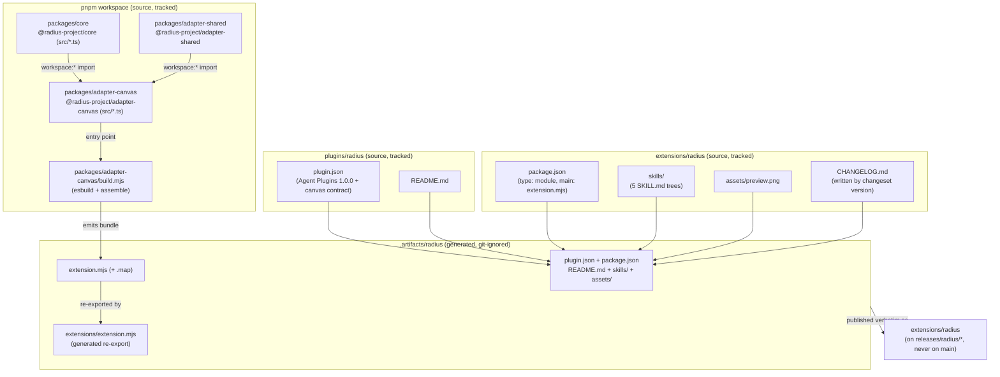
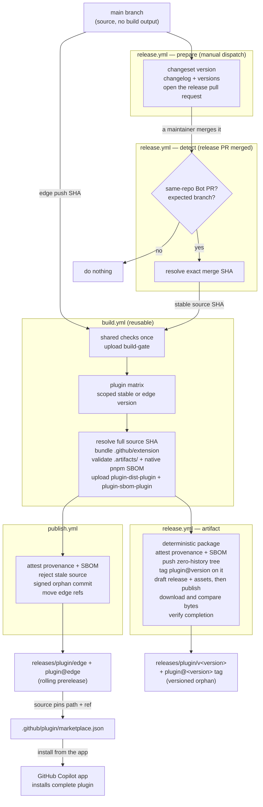

# Plugin packaging and publishing

How the `radius` Copilot plugin is laid out, how its canvas bundle is built from the workspace source, and how CI assembles a complete, installable artifact into `.artifacts/radius/` and publishes it as `extensions/radius/` on generated `releases/*` branches without committing build output to `main`.



## Key components

- **`packages/core` (`@radius-project/core`)** — UI-agnostic product logic behind ports. `private`, `main: src/index.ts` (consumed as TypeScript source, not a published package).
- **`packages/adapter-shared` (`@radius-project/adapter-shared`)** — shared adapter utilities (for example, `rad` CLI invocation). Depends on core via `workspace:*`.
- **`packages/adapter-canvas` (`@radius-project/adapter-canvas`)** — the canvas adapter whose entry `src/extension.ts` calls `joinSession` / `createCanvas({ id: "radius" })`. Depends on core and shared via `workspace:*`.
- **`packages/adapter-canvas/build.mjs`** — the esbuild step that bundles the adapter plus its `workspace:*` dependencies into one file, then assembles `.artifacts/radius/`.
- **`plugins/radius/`** — the tracked plugin source and the discovery anchor: `plugin.json` and `README.md`.
- **`extensions/radius/`** — the tracked canvas extension source: `package.json`, `skills/`, the `assets/` tree the canvas contract requires, and the `CHANGELOG.md` Changesets writes beside the package it versions.
- **`.artifacts/radius/`** — the generated, installable plugin: both tracked source trees above, the built `extension.mjs`, an `extensions/` entry point that re-exports it for canvas discovery, and a complete `workflows/` copy of `.github/extension/`. Git-ignored, wiped and rebuilt on every build, and never present on a published branch under this name.
- **`.github/plugin/marketplace.json`** — the marketplace manifest whose plugin `source` points installs at `extensions/radius` on `radius@edge`.
- **`.changeset/config.json`** — Changesets owns released versions. `privatePackages.version` includes private plugins; `privatePackages.tag` is disabled because the workflow creates one scoped tag on the artifact commit instead of running Changesets' all-package source tag scan.
- **`scripts/plugins.mjs`** — the plugin registry: discovers every directory under `plugins/` that pairs a `plugins/<name>/plugin.json` with an `extensions/<name>/package.json`, and builds every published ref name from it. It is also the one place that names the split, exposing `dir`, `extensionDir`, `distDir` (the local `.artifacts/<name>` build output), `publishDir` (the published `extensions/<name>`), `packageFile`, `manifestFile`, `changelogFile`, and `readmeFile`. The single source of the `releases/<plugin>/<channel>`, `<plugin>@edge`, and `<plugin>@<version>` convention; `--json` feeds the workflow matrices and `--env` hands the names — including `PLUGIN_DIST`, `PLUGIN_EXTENSION_DIR`, and `PLUGIN_PUBLISH_DIR` — to a job.
- **`scripts/version.mjs`** — derives every other version string from `extensions/<name>/package.json`, the version Changesets owns; `--check` fails CI on drift across all plugins, `--set --channel edge` retargets and restamps one plugin's generated edge catalog entry, `--compare` ranks two versions by semver precedence, and `--release-notes` reads that plugin's current Changesets changelog entry. The catalog on `main` is deliberately not derived: only `plugins/<name>/plugin.json` is.
- **`scripts/release-version.mjs`** — invokes Changesets with an argv array for one selected plugin (ignoring the others), then synchronizes all derived manifests. Both stable and snapshot versioning use this boundary.
- **`scripts/release-plan.mjs`** — classifies a merged release PR from git facts: a plugin is released only when its package version changed from the first parent and the matching changelog heading was added in the same diff.
- **`scripts/validate-plugin-dist.mjs`** — validates the generic artifact contract before attestation or push: matching names and versions, the exact source commit, complete workflow assets, README, license, manifest-declared paths, path confinement, and no symlinks. For a plugin keyworded `canvas` it also enforces the two non-spec manifest fields `github/awesome-copilot` requires, and the `assets/` and `extensions/` paths they name.
- **`.github/workflows/build.yml`** — the reusable build: shared checks run once and upload a gate artifact; requested plugins resolve their checked-out full source SHA, bake it into generated workflow fetch/action references and package metadata, then upload disjoint `plugin-dist-<plugin>` artifacts. Publishers require the gate plus their own artifact.
- **`.github/workflows/changesets.yml`** — non-blocking pull request feedback from the Changesets Action v2 `pr-status` and `pr-comment` sub-actions. The read-only status job inspects pull request files; a separate job owns the pull request write token and only publishes the generated comment.
- **`.github/workflows/publish.yml`** — the rolling **edge** channel: on every push to `main`, publishes each plugin's assembled tree to its own `releases/<plugin>/edge` branch and `<plugin>@edge` tag.
- **`.github/workflows/release.yml`** — the **stable** channel: a manual dispatch (optionally naming one plugin) runs `changesets/action` to open a scope-labelled release PR; merging it resolves the exact release plan from the version diff, validates each plugin, publishes its zero-history install branch, places its one `<plugin>@<version>` tag on that branch's commit, cuts the GitHub release and assets from that tag, verifies their downloaded bytes, and requires the whole release to verify. Immutable-release enforcement is opt-in.

## How it works

### 1. The plugin layout: tracked source vs. generated build output

The repository is a [pnpm](https://pnpm.io/) workspace monorepo (`pnpm-workspace.yaml` lists `packages/*` and `extensions/*`). All workspace packages are `private`; the canvas adapter pulls in the core and shared packages through the `workspace:*` protocol rather than from a registry.

Plugin **source** is split in two, the way [`github/awesome-copilot`](https://github.com/github/awesome-copilot) splits it: `plugins/radius/` carries the Agent Plugins manifest and readme, and `extensions/radius/` carries the canvas extension package, its skills, and its assets. `plugins/` stays the discovery anchor — a directory there becomes shippable once both halves exist. The **installable** plugin is assembled from both into `.artifacts/radius/`, which is git-ignored, and reaches users only as `extensions/radius/` on a release branch:

| Path                              | Origin          | Tracked? | Purpose                                                    |
|-----------------------------------|-----------------|----------|------------------------------------------------------------|
| `plugins/radius/plugin.json`      | source          | yes      | [Agent Plugins 1.0.0](https://agent-plugins.org) manifest. |
| `plugins/radius/README.md`        | source          | yes      | Plugin documentation.                                      |
| `extensions/radius/package.json`  | source          | yes      | Extension package: `type: module`, `main: extension.mjs`.  |
| `extensions/radius/skills/`       | source          | yes      | The five skill trees (`SKILL.md` plus `references/`).      |
| `extensions/radius/assets/`       | source          | yes      | `preview.png`, which the canvas contract requires.         |
| `extensions/radius/CHANGELOG.md`  | Changesets      | yes      | Release notes, written beside the package it versions.     |
| `.artifacts/radius/`              | built           | no       | The complete installable plugin; git-ignored.              |
| `.artifacts/radius/extension.mjs` | built (esbuild) | no       | The canvas bundle, plus its `.map`.                        |
| `.artifacts/radius/workflows/`    | copied          | no       | Complete `.github/extension/` templates, actions, scripts. |

The asymmetry is deliberate: on `main`, `extensions/radius/` is canvas **source**; on a release branch the same path is the **assembled install unit**. That is why the build cannot assemble in place, and why `.artifacts/` exists at all.

The manifest targets the [Agent Plugins](https://agent-plugins.org) 1.0.0 schema, which is **closed**: the only permitted fields are `$schema`, `name`, `version`, `description`, `author`, `homepage`, `repository`, `license`, `keywords`, and `extensions`. Components load from fixed locations rather than manifest paths, so skills are discovered from `skills/` without being declared, and `extensions` — if present at all — is an object keyed by a reverse-domain client namespace, never a path. The canvas `extension.mjs` and its `package.json` sit at the **plugin root**, which for an install is the assembled tree; the build copies both tracked source trees into it so those relative paths resolve.

### 2. The build: bundling the workspace, then assembling `.artifacts/`

`pnpm run build` delegates to `packages/adapter-canvas/build.mjs`, which invokes esbuild with:

- **entry** `packages/adapter-canvas/src/extension.ts`,
- **outfile** `.artifacts/radius/extension.mjs`,
- **format** `esm`, **target** derived from `.node-version`,
- **minify** with `keepNames` and an external source map, and
- **external** `@github/copilot-sdk` (and `/extension`) — the loader resolves the SDK at runtime, so it is never bundled.

esbuild transpiles the TypeScript core and inlines the `workspace:*` dependencies, producing a single self-contained `extension.mjs` (~700 KB minified). This file is the reason a build step is unavoidable: the plugin cannot ship hand-authored source because the canvas imports the **TypeScript** core via `workspace:*`, which must be transpiled and inlined first.

The script then uses esbuild's `copy` loader to place `plugin.json` and `README.md` from the plugin directory, and `package.json`, `skills/`, `assets/`, and any `CHANGELOG.md` from the extension directory, next to the bundle; it adds the repository `LICENSE`, and copies the complete `.github/extension/` tree to `.artifacts/radius/workflows/`. It writes the full checked-out source SHA to `package.json#radiusSourceRef` and compiles that same value into the workflow generator: remote template fetches and every first-party composite-action `uses:` resolve the commit that produced the plugin, never `main`, `edge`, or `latest`. Both the Node bundle and nested browser/resolver builds emit esbuild metafiles; their complete input union drives `THIRD-PARTY-NOTICES.txt`, including packages such as `yaml` that do not appear in the browser-only graph. The generic dist validator checks names, versions, the Agent Plugins manifest schema, source SHA, workflow assets, the fixed `skills/` location, README, license, confinement, and symlinks before upload or publication.

The whole of `.artifacts/` is git-ignored so `main` never carries large generated files that would cause constant merge conflicts. Because the tree is wiped and rebuilt on every run, the build first asks `git ls-files` whether anything tracked lives there and refuses to wipe it if so — a build can never delete source.

### 3. The publish: shipping the assembled tree on `releases/*`

Because `.artifacts/` is git-ignored and the marketplace installs only git-tracked files with no build step, it would never ship from `main`. Two workflows close that gap, and both delegate the build to `build.yml` so the artifact they publish came from one run of one set of checks.

| Channel    | Workflow      | Trigger                                    | Version                     | Refs written                                                                                                            |
|------------|---------------|--------------------------------------------|-----------------------------|-------------------------------------------------------------------------------------------------------------------------|
| **edge**   | `publish.yml` | every push to `main`                       | `0.1.0-edge-<short-sha>`    | `releases/<plugin>/edge` + `<plugin>@edge`, force-replaced after rejecting stale reruns.                                |
| **stable** | `release.yml` | manual dispatch, then the release PR merge | whatever Changesets decided | versioned `releases/<plugin>/v<version>` + its one `<plugin>@<version>` tag; rolling `releases/<plugin>/latest` branch. |

Every published ref is namespaced by plugin name — `releases/<plugin>/<channel>` for branches, `<plugin>@edge` for the rolling preview tag, and Changesets' `<plugin>@<version>` for a release. A stable release publishes that one tag and points it at the orphan artifact commit, so the tag, the branch, and the GitHub release cut from it all resolve to the same installable tree. Both workflows fan out over `scripts/plugins.mjs --json`, so a new plugin directory joins the matrix without editing a workflow, and each plugin's refs, GitHub release and dispatch are independent of every other plugin's.

The stable channel follows [Changesets v3](https://changesets.dev/guide/versioning-and-publishing), but it does not run `changeset git-tag`: that command scans every eligible package and is unsafe inside an independent plugin matrix. A maintainer dispatches `release.yml`; `scripts/release-version.mjs` scopes `changeset version`, and the v3-compatible Changesets Action v2 opens the PR through the repository automation GitHub App. A second scope cannot overwrite an open release PR. On merge, `scripts/release-plan.mjs` admits only package versions and changelog headings newly added by that merge. Each publish leg then reproduces Changesets' `<package>@<version>` tag name for that plugin only.

Edge runs are automatic and push-only. `publish.yml` passes the triggering `main` SHA and all discovered plugins to one `build.yml` call. Each build leg adds an ephemeral patch changeset for its plugin and runs the same scoped version wrapper with `--snapshot edge`, so another plugin's pending changesets cannot affect it. `snapshot.prereleaseTemplate` suffixes the calculated version with the seven-character source SHA. Neither synthetic changesets nor snapshot rewrites are committed.

Neither workflow pushes to `main`: its ruleset grants GitHub Actions no bypass. The version bump reaches `main` the same way every other change does — as a reviewed pull request.



Each published branch is an **orphan**: it shares no history with `main` and contains only `extensions/<plugin>/`, `plugins/<plugin>/`, `.github/extension/`, and the marketplace catalog. `extensions/<plugin>/` is the complete install unit; `plugins/<plugin>/` repeats that unit's `plugin.json` and `README.md` so a reader can identify the branch without unpacking the extension. Both copies are published from the same assembled tree, and reuse verification requires them to share a Git blob SHA, so a branch cannot answer the same question two ways. The root extension tree preserves the canonical repository layout on the self-contained artifact branch; `extensions/<plugin>/workflows/` is its byte-identical plugin copy. Generated cross-repository `uses:` paths resolve that canonical path from the immutable source commit recorded by the plugin, not from the orphan commit. [`scripts/verified-git.mjs`](../../scripts/verified-git.mjs) uploads exactly those paths and asks the Commits API for a commit with no parents, so unrelated repository source cannot reach the published tree and there is no history to inherit. Its `commit --path <local>=<published>` form is what bridges the two layouts: the workflows pass `--path "$PLUGIN_DIST=$PLUGIN_PUBLISH_DIR"`, so the locally assembled `.artifacts/<plugin>/` lands on the branch as `extensions/<plugin>/`. Reuse verification requires the two extension trees to have the same file paths and Git blob SHAs, requires `package.json#radiusSourceRef` to equal the source recorded by the commit message, and rejects a parented or unsigned commit. Read-only inspection accepts the fully legacy layout only so the first upgraded stable release can compare and replace an older `latest` branch; a partially migrated layout fails closed.

Nothing is committed or tagged on the runner. A runner holds no signing key, so every commit and ref this pipeline publishes goes through the GitHub API as the repository automation App. GitHub signs the commits, while the Git tag-object API leaves an App-created annotated tag unsigned. The pipeline therefore writes lightweight tag refs only after GitHub verifies their target commit, and verifies that target again before reusing a tag. Existing signed annotated tags are accepted only when both the tag object and its target commit are verified. Reusing an install branch also re-checks its commit, so a branch left by older automation cannot keep publishing an unsigned commit. The cost is that a branch and a tag no longer move in one atomic push: the branch every install reads lands first, and a rerun reconciles a failure in between.

The trade-off is deliberate: a clone of a published branch contains the plugin artifact, its workflow/action assets, and its catalog, but no monorepo source, node_modules, or history. The exact source SHA lives in both the commit message and built package metadata. Because the edge refs are replaced wholesale each run, superseded bundles become unreferenced objects rather than permanent repository growth.

A release publishes one branch, `releases/<plugin>/v<version>`, whose catalog points `source.ref` at itself. The deterministic tarball contains the complete bundled copy under the plugin's `workflows/` directory. Checks, deterministic tar/zip packaging, native pnpm SBOM generation, validation, and attestation finish before the first push. A retry reconstructs the expected orphan tree and reuses an existing versioned branch only when its tree ID, source pin, extension copies, and zero-parent invariant match, then reconciles the release tag, the GitHub release, and its asset bytes. Because the one tag is written before the release is published, completion is proved rather than marked: `verify-completion` must still resolve the branch, the tag on its commit, the published release, and its exact asset set together.

GitHub immutable releases are optional. By default, the release remains mutable and a retry reconciles assets with `gh release upload --clobber`. Setting repository variable `REQUIRE_IMMUTABLE_RELEASES=true` activates two fail-closed checks (before PR creation and before publication), requires Administration read on the GitHub App, and requires the published release response to report `immutable: true`. Both modes use draft-first publication; an immutable retry reuses the published native SBOM rather than regenerating pnpm's run-specific document.

The SBOM is native [`pnpm sbom`](https://pnpm.io/cli/sbom) output filtered to the selected plugin. The plugin declares its build adapter as a workspace `devDependency`, so inlined browser packages are present while pnpm retains ownership of document identity, package IDs, timestamps, licenses, and checksums.

`build.yml` generates it beside the bundle and uploads it as its own artifact, so both channels inventory the same build. Placement is load-bearing rather than incidental: pnpm records the workspace's current version as the SBOM's root package, and for edge that version exists only in the build workspace, stamped there by the snapshot step. Generating the document in a publishing job would inventory the unstamped version and describe something other than the artifact it accompanies. It stays out of the dist artifact because that tree is published verbatim as the install branch, and the SBOM describes the release rather than forming part of what gets installed. Stable uploads it as a release asset; edge has no release to attach it to, so it is recorded as an SBOM attestation over the published files and retrieved with `gh attestation verify`.

### 4. The install: resolving the complete artifact

`.github/plugin/marketplace.json` pins the plugin `source` to the object form:

```json
"source": {
  "source": "github",
  "repo": "radius-project/ai-extensions",
  "path": "extensions/radius",
    "ref": "radius@edge"
}
```

The catalog exposes one plugin identity, `radius`. Its `source.ref` on `main` selects what a plain `marketplace add` installs: it pins the rolling `radius@edge` tag during the preview period and changes to a released `radius@<version>` when stable becomes the default. The edge publisher rewrites its generated catalog copy back to `radius@edge`, while the stable publisher points each generated catalog at its own release branch, so changing the default does not remove either explicit install target. In every case `path` names the assembled tree as published on a release ref, not the canvas source that happens to sit at the same path on `main`. Because the Radius canvas can only be hosted by the GitHub Copilot app, the plugin is installed from the app: open app settings, click **Plugins**, add the `radius-project/ai-extensions` marketplace, and install `radius`.

To pin a specific release instead of tracking edge, add the marketplace at that release's ref — `marketplace add radius-project/ai-extensions#releases/radius/v<version>` or `#radius@<version>`, which name the same orphan commit — whose catalog points `source.ref` at itself.

The installer copies the git-tracked files at `extensions/radius` from the published ref into the app's installed-plugins directory (for example, `~/.copilot/installed-plugins/radius-plugins/radius/`). Because the bundle is committed there, the installed plugin contains everything: `plugin.json`, `package.json`, `extension.mjs`, and `skills/`.

## Notable details

- **Skills and canvas stay in lockstep.** Both come from the same `main` commit tree that the build job checked out, so a PR that updates a skill and a PR that updates canvas code both land on the published branch together. There is no way for the shipped skills to lag the shipped bundle.
- **Published branches are generated — never hand-edit them.** `releases/<plugin>/edge` is force-recreated on every merge; `releases/<plugin>/v<version>` is created once and never moved. `main` remains the single source of truth.
- **Plugin versions are derived everywhere.** Changesets writes each plugin package version and `scripts/version.mjs` derives its manifest. The catalog on `main` is left alone by a release; each publish stamps the version into the throwaway catalog copy it ships. The shared marketplace `metadata.version` is independently managed and is never rewritten by one plugin's release.
- **Release branches are orphaned and retryable.** Every edge and versioned branch points to a GitHub-signed zero-parent commit. Versioned branches and their release tags are never force-pushed; mutable releases reconcile assets, while enforced immutable releases compare protected assets.
- **Every published bundle is attested and inventoried.** [`actions/attest`](https://github.com/actions/attest) records provenance for every edge-tree file. Stable provenance names the deterministic tarball as its subject, and a standard SBOM attestation binds that subject to native pnpm SPDX output. Attestation runs before the first push.
- **The publish gates on the same checks as CI.** `version:check`, `typecheck`, `lint`, `format:check` and `test` all run in `build.yml` before the bundle is assembled, so a broken build never publishes; on failure, the published refs keep pointing at the last good artifact.
- **Ordering is explicit.** Edge queues whole runs with `queue: max` and builds each triggering push SHA, then rejects a manually rerun stale SHA before moving the branch and tag. Stable queues manual dispatches and release-PR merge events, builds the exact merge SHA, and completes the versioned branch, its tag, and the published release with its assets. Nothing about a stable release rolls forward, so ordering between releases is GitHub's own: the release is published with `make_latest: legacy`, which ranks Latest on version and date. Edge ordering comes from queue order and git ancestry, never from version precedence: two edge builds sharing a base version differ only by a commit SHA, which sorts lexically rather than chronologically. Nothing consumes that precedence — installs resolve the moving `edge` ref — so it is deliberately not part of the edge contract.
- **Changeset feedback is non-blocking and privilege-separated.** The status job reads pull request files without executing repository code or receiving write access. The comment job has no checkout and receives only the generated comment body plus `pull-requests: write`; release pull requests are exempt because their changesets have already been consumed. The `pr:no-changeset` label skips the status job and rewrites the comment as a waiver, and `labeled`/`unlabeled` are workflow triggers so applying it takes effect without another push.
- **Release pull requests run CI.** The Changesets version action uses a short-lived token from the repository automation GitHub App rather than `GITHUB_TOKEN`, so its pull request triggers the normal `pull_request` build.
- **`build.yml` also uploads the bundle as a read-only CI artifact** for per-PR inspection; only `publish.yml` and `release.yml` write to the published refs.
- **Canvas activation is a separate concern.** This pipeline guarantees a complete, installable plugin. Whether the installed plugin's `extensions` are auto-discovered and the canvas registered is a GitHub App behavior, tracked outside this packaging/publishing flow. See [`docs/design/2026-07-canvas-bundle-publishing.md`](../design/2026-07-canvas-bundle-publishing.md) for the design and scope.
