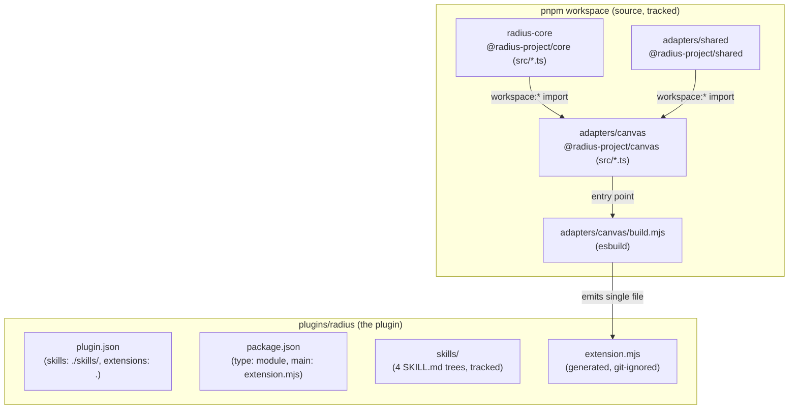
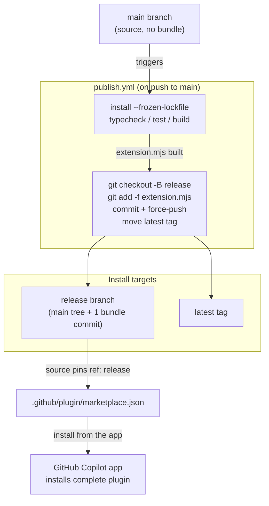

# Plugin packaging and publishing

How the `radius` Copilot plugin is laid out, how its canvas bundle is built from the workspace source, and how CI publishes a complete, installable artifact to a generated `release` branch without committing the bundle to `main`.



## Key components

- **`radius-core` (`@radius-project/core`)** — UI-agnostic product logic behind ports. `private`, `main: src/index.ts` (consumed as TypeScript source, not a published package).
- **`adapters/shared` (`@radius-project/shared`)** — shared adapter utilities (for example, `rad` CLI invocation). Depends on core via `workspace:*`.
- **`adapters/canvas` (`@radius-project/canvas`)** — the canvas adapter whose entry `src/extension.ts` calls `joinSession` / `createCanvas({ id: "radius" })`. Depends on core and shared via `workspace:*`.
- **`adapters/canvas/build.mjs`** — the esbuild step that bundles the adapter plus its `workspace:*` dependencies into one file.
- **`plugins/radius/`** — the plugin that Copilot installs. Contains the tracked `plugin.json`, `package.json`, `README.md`, and `skills/`, plus the generated `extension.mjs`.
- **`.github/plugin/marketplace.json`** — the marketplace manifest whose plugin `source` points installs at the plugin.
- **`.github/workflows/publish.yml`** — the CI workflow that builds the bundle and publishes the whole plugin to the `release` branch.

## How it works

### 1. The plugin layout: tracked source vs. generated bundle

The repository is a [pnpm](https://pnpm.io/) workspace monorepo (`pnpm-workspace.yaml` lists `radius-core` and `adapters/*`). All three workspace packages are `private`; the canvas adapter pulls in the core and shared packages through the `workspace:*` protocol rather than from a registry.

The installable plugin lives at `plugins/radius/`. Everything there is committed **except** the canvas bundle:

| Path                           | Origin          | Tracked? | Purpose                                                   |
|--------------------------------|-----------------|----------|-----------------------------------------------------------|
| `plugins/radius/plugin.json`   | source          | yes      | Manifest: `skills: "./skills/"`, `extensions: "."`.       |
| `plugins/radius/package.json`  | source          | yes      | Extension package: `type: module`, `main: extension.mjs`. |
| `plugins/radius/skills/`       | source          | yes      | The four skill trees (`SKILL.md` plus `references/`).     |
| `plugins/radius/README.md`     | source          | yes      | Plugin documentation.                                     |
| `plugins/radius/extension.mjs` | built (esbuild) | no       | The canvas bundle; git-ignored (`.gitignore`).            |

Because `plugin.json` declares `extensions: "."`, the canvas `extension.mjs` and its `package.json` live at the **plugin root** alongside `skills/`, matching the layout of GitHub's own `awesome-copilot` canvas plugins.

### 2. The build: bundling the workspace into one file

`pnpm run build` runs `node adapters/canvas/build.mjs`, which invokes esbuild with:

- **entry** `adapters/canvas/src/extension.ts`,
- **outfile** `plugins/radius/extension.mjs`,
- **format** `esm`, and
- **external** `@github/copilot-sdk` (and `/extension`) — the loader resolves the SDK at runtime, so it is never bundled.

esbuild transpiles the TypeScript core and inlines the `workspace:*` dependencies, producing a single self-contained `extension.mjs` (~450 KB). This file is the reason a build step is unavoidable: the plugin cannot ship hand-authored source because the canvas imports the **TypeScript** core via `workspace:*`, which must be transpiled and inlined first.

The bundle is intentionally git-ignored so `main` never carries a large generated file that would cause constant merge conflicts.

### 3. The publish: assembling a complete artifact on `release`

Because the bundle is git-ignored and the marketplace installs only git-tracked files with no build step, the bundle would never ship from `main`. `.github/workflows/publish.yml` closes that gap. It runs on every push to `main` (after a PR merges) and on manual `workflow_dispatch`, with `permissions: contents: write` and a `concurrency` group so only one publish runs at a time.



The publish step is deliberately simple: `git checkout -B release` **recreates** the `release` branch at the just-built `main` commit, then a single commit force-adds the otherwise-ignored `extension.mjs`. The result is that `release` equals the entire `main` tree — `plugin.json`, `package.json`, all `skills/`, and `README.md` — **plus** one commit that adds only the bundle. The skills and manifest travel to `release` automatically because the branch is the `main` tree; there is no separate copy step. Finally the `latest` tag is force-moved to the new `release` head.

### 4. The install: resolving the complete artifact

`.github/plugin/marketplace.json` pins the plugin `source` to the object form:

```json
"source": {
  "source": "github",
  "repo": "radius-project/ai-extensions",
  "path": "plugins/radius",
  "ref": "release"
}
```

The pinned `ref: release` means an install resolves the plugin from the `release` branch regardless of which ref the marketplace was added from, so there is no `@ref` suffix to specify. Because the Radius canvas can only be hosted by the GitHub Copilot app, the plugin is installed from the app: open app settings, click **Plugins**, add the `radius-project/ai-extensions` marketplace, and install the `radius` plugin.

The installer copies the git-tracked files at `plugins/radius/` from the `release` ref into the app's installed-plugins directory (for example, `~/.copilot/installed-plugins/radius-plugins/radius/`). Because the bundle is committed on `release`, the installed plugin now contains everything: `plugin.json`, `package.json`, `extension.mjs`, and `skills/`.

## Notable details

- **Skills and canvas stay in lockstep.** Both come from the same `main` commit tree that the publish job checked out, so a PR that updates a skill and a PR that updates canvas code both land on `release` together on the next publish. There is no way for the shipped skills to lag the shipped bundle.
- **`release` is generated — never hand-edit it.** The publish job force-recreates the branch every run, so any manual commit to `release` would be overwritten. `main` remains the single source of truth.
- **The publish gates on the same checks as CI.** `typecheck` and `test` run before the bundle is assembled, so a broken build never publishes; on failure, `release` and `latest` keep pointing at the last good artifact.
- **`build.yml` also uploads the bundle as a read-only CI artifact** for per-PR inspection; only `publish.yml` writes to `release`.
- **Canvas activation is a separate concern.** This pipeline guarantees a complete, installable plugin. Whether the installed plugin's `extensions` are auto-discovered and the canvas registered is a GitHub App behavior, tracked outside this packaging/publishing flow. See [`docs/design/2026-07-canvas-bundle-publishing.md`](../design/2026-07-canvas-bundle-publishing.md) for the design and scope.
