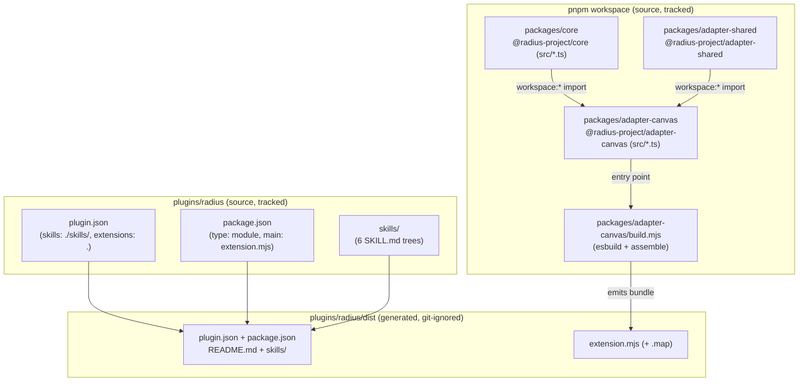
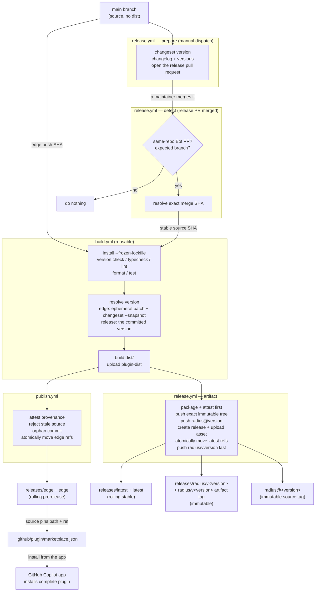

# Plugin packaging and publishing

How the `radius` Copilot plugin is laid out, how its canvas bundle is built from the workspace source, and how CI assembles a complete, installable artifact into `plugins/radius/dist/` and publishes it to generated `releases/*` branches without committing build output to `main`.



## Key components

- **`packages/core` (`@radius-project/core`)** — UI-agnostic product logic behind ports. `private`, `main: src/index.ts` (consumed as TypeScript source, not a published package).
- **`packages/adapter-shared` (`@radius-project/adapter-shared`)** — shared adapter utilities (for example, `rad` CLI invocation). Depends on core via `workspace:*`.
- **`packages/adapter-canvas` (`@radius-project/adapter-canvas`)** — the canvas adapter whose entry `src/extension.ts` calls `joinSession` / `createCanvas({ id: "radius" })`. Depends on core and shared via `workspace:*`.
- **`packages/adapter-canvas/build.mjs`** — the esbuild step that bundles the adapter plus its `workspace:*` dependencies into one file, then assembles `plugins/radius/dist/`.
- **`plugins/radius/`** — the tracked plugin source: `plugin.json`, `package.json`, `README.md`, and `skills/`.
- **`plugins/radius/dist/`** — the generated, installable plugin: the tracked source above plus the built `extension.mjs`. Git-ignored on `main`.
- **`.github/plugin/marketplace.json`** — the marketplace manifest whose plugin `source` points installs at `plugins/radius/dist` on `releases/edge`.
- **`.changeset/config.json`** — Changesets owns the released version. `privatePackages: { version: true, tag: true }` lets it version and tag `radius` even though nothing is published to a registry.
- **`scripts/version.mjs`** — derives every other version string from `plugins/radius/package.json`, the version Changesets owns; `--check` fails CI on drift, `--set --channel edge` restamps only the rolling edge catalog entry, `--compare` ranks two versions by semver precedence, and `--release-notes` reads the current Changesets changelog entry.
- **`.github/workflows/build.yml`** — the reusable build: checks, version resolution, and the `plugin-dist` artifact. Runs directly on pull requests and is called with an immutable source SHA by both publishing workflows so a publish builds exactly once.
- **`.github/workflows/changesets.yml`** — non-blocking pull request feedback from the Changesets Action v2 `pr-status` and `pr-comment` sub-actions. The read-only status job inspects pull request files; a separate job owns the pull request write token and only publishes the generated comment.
- **`.github/workflows/publish.yml`** — the rolling **edge** channel: on every push to `main`, publishes `dist/` to the `releases/edge` branch and `edge` tag.
- **`.github/workflows/release.yml`** — the **stable** channel: a manual dispatch runs `changesets/action` to open the release pull request; merging it validates the exact version commit, has `changesets/action` tag its source as `radius@<version>` and publish the changelog entry as the GitHub release, and publishes the immutable `releases/radius/v<version>` branch and `radius/v<version>` artifact tag plus the rolling `releases/latest` branch and `latest` tag.

## How it works

### 1. The plugin layout: tracked source vs. generated dist

The repository is a [pnpm](https://pnpm.io/) workspace monorepo (`pnpm-workspace.yaml` lists `packages/*` and `plugins/*`). All workspace packages are `private`; the canvas adapter pulls in the core and shared packages through the `workspace:*` protocol rather than from a registry.

The plugin **source** lives at `plugins/radius/`; the **installable** plugin is assembled into `plugins/radius/dist/`, which is git-ignored:

| Path                                | Origin          | Tracked? | Purpose                                                   |
|-------------------------------------|-----------------|----------|-----------------------------------------------------------|
| `plugins/radius/plugin.json`        | source          | yes      | Manifest: `skills: "./skills/"`, `extensions: "."`.       |
| `plugins/radius/package.json`       | source          | yes      | Extension package: `type: module`, `main: extension.mjs`. |
| `plugins/radius/skills/`            | source          | yes      | The six skill trees (`SKILL.md` plus `references/`).      |
| `plugins/radius/README.md`          | source          | yes      | Plugin documentation.                                     |
| `plugins/radius/dist/`              | built           | no       | The complete installable plugin; git-ignored.             |
| `plugins/radius/dist/extension.mjs` | built (esbuild) | no       | The canvas bundle, plus its `.map`.                       |

Because `plugin.json` declares `extensions: "."`, the canvas `extension.mjs` and its `package.json` sit at the **plugin root** — which, for an install, is `dist/`. The build copies the tracked source into `dist/` so those relative paths resolve.

### 2. The build: bundling the workspace, then assembling `dist/`

`pnpm run build` delegates to `packages/adapter-canvas/build.mjs`, which invokes esbuild with:

- **entry** `packages/adapter-canvas/src/extension.ts`,
- **outfile** `plugins/radius/dist/extension.mjs`,
- **format** `esm`, **target** derived from `.node-version`,
- **minify** with `keepNames` and an external source map, and
- **external** `@github/copilot-sdk` (and `/extension`) — the loader resolves the SDK at runtime, so it is never bundled.

esbuild transpiles the TypeScript core and inlines the `workspace:*` dependencies, producing a single self-contained `extension.mjs` (~700 KB minified). This file is the reason a build step is unavoidable: the plugin cannot ship hand-authored source because the canvas imports the **TypeScript** core via `workspace:*`, which must be transpiled and inlined first.

The script then copies `plugin.json`, `package.json`, `README.md`, and `skills/` next to the bundle, so `dist/` is a complete plugin directory. `dist/` is wiped at the start of every run and refreshed after each rebuild in watch mode.

The whole of `dist/` is git-ignored so `main` never carries large generated files that would cause constant merge conflicts.

### 3. The publish: shipping `dist/` on `releases/*`

Because `dist/` is git-ignored and the marketplace installs only git-tracked files with no build step, it would never ship from `main`. Two workflows close that gap, and both delegate the build to `build.yml` so the artifact they publish came from one run of one set of checks.

| Channel    | Workflow      | Trigger                                    | Version                      | Refs written                                                                                                                       |
|------------|---------------|--------------------------------------------|------------------------------|------------------------------------------------------------------------------------------------------------------------------------|
| **edge**   | `publish.yml` | every push to `main`                       | `0.1.0-edge-<utc-timestamp>` | `releases/edge` + `edge`, atomically force-replaced after rejecting stale reruns.                                                  |
| **stable** | `release.yml` | manual dispatch, then the release PR merge | whatever Changesets decided  | `radius@<version>` source tag; immutable `releases/radius/v<version>` + `radius/v<version>`; rolling `releases/latest` + `latest`. |

The stable channel follows [Changesets v3](https://changesets.dev/guide/versioning-and-publishing) in a [publish-git-tags-only](https://changesets.dev/guide/automating#publish-git-tags-only) setup, because this repo ships a git branch rather than an npm package. Versioning is **not** automatic: a maintainer dispatches `release.yml`, which runs `changeset version` through the v3-compatible Changesets Action v2 and opens the release pull request through the repository automation GitHub App so normal PR checks run. When that pull request merges, the `pull_request: closed` half accepts only the same-repository, bot-authored `changeset-release/main` PR, builds its exact merge commit independently of newer pending changesets, and completes every check and attestation before publishing refs.

Edge runs are automatic and push-only. `publish.yml` passes the triggering `main` SHA to `build.yml`, then CI adds an ephemeral `radius` patch changeset before running `changeset version --snapshot edge`. That guarantees a Changesets-calculated next-patch snapshot even when no release changeset is pending; a pending minor or major changeset still determines the larger bump. Neither the synthetic changeset nor the snapshot rewrite is committed.

Neither workflow pushes to `main`: its ruleset grants GitHub Actions no bypass. The version bump reaches `main` the same way every other change does — as a reviewed pull request.



Each published branch is an **orphan**: it shares no history with `main` and contains nothing but `plugins/radius/dist/` and the marketplace catalog. `git checkout --orphan` starts an unborn branch with the previous tree still staged, so the step clears the index (`git rm -rf --cached .`) and re-adds only what ships, producing a single root commit. A guard then fails the publish if `git ls-tree` reports any unexpected path.

The trade-off is deliberate: a clone of a published branch is the artifact and nothing else — no source, no node_modules, no history — and the `main` SHA it was built from lives in the commit message. Because the rolling refs are replaced wholesale each run, superseded bundles become unreferenced objects rather than permanent repository growth.

A release publishes the pinned branch and `releases/latest` from the same `dist/`; they differ only in the catalog's `source.ref`, which each branch points at itself so `marketplace add OWNER/REPO#<branch>` is self-consistent. Checks, packaging, canonical tag verification and attestation all finish before the first push. Rerunning the original failed workflow constructs the expected orphan tree from the rebuilt artifact and reuses an existing immutable branch only when its tree ID matches exactly. It then reconciles the canonical tag, GitHub release and asset before atomically moving the rolling stable refs; a later push cannot perform that recovery because signed provenance records the workflow event SHA. The `radius/v<version>` artifact tag is pushed last as the completion marker. The Changesets `radius@<version>` tag points at the source commit on `main`, while `radius/v<version>` points at the orphan artifact commit.

### 4. The install: resolving the complete artifact

`.github/plugin/marketplace.json` pins the plugin `source` to the object form:

```json
"source": {
  "source": "github",
  "repo": "radius-project/ai-extensions",
  "path": "plugins/radius/dist",
    "ref": "edge"
}
```

The catalog exposes two entries: `radius-edge` pins the rolling `edge` tag and `radius` pins the rolling `latest` stable tag. In both cases `path` points at the assembled `dist/` rather than the source directory. Because the Radius canvas can only be hosted by the GitHub Copilot app, the plugin is installed from the app: open app settings, click **Plugins**, add the `radius-project/ai-extensions` marketplace, and install the desired channel.

To pin a specific release instead of tracking edge, add the marketplace at that release's branch — `marketplace add radius-project/ai-extensions#releases/radius/v<version>` for one exact version, or `#releases/latest` to track stable — whose catalog points `source.ref` at itself.

The installer copies the git-tracked files at `plugins/radius/dist` from the published ref into the app's installed-plugins directory (for example, `~/.copilot/installed-plugins/radius-plugins/radius/`). Because the bundle is committed there, the installed plugin contains everything: `plugin.json`, `package.json`, `extension.mjs`, and `skills/`.

## Notable details

- **Skills and canvas stay in lockstep.** Both come from the same `main` commit tree that the build job checked out, so a PR that updates a skill and a PR that updates canvas code both land on the published branch together. There is no way for the shipped skills to lag the shipped bundle.
- **Published branches are generated — never hand-edit them.** `releases/edge` and `releases/latest` are force-recreated every run, so any manual commit there would be overwritten; `releases/radius/v<version>` is created once and never again. `main` remains the single source of truth.
- **One version, derived everywhere.** No human picks a version: `changeset version` writes `plugins/radius/package.json`, `scripts/version.mjs` derives `plugin.json` plus `metadata.version` and both plugin entries in `marketplace.json`, and `build.yml` runs `--check` on every pull request so they cannot drift. Only the edge publish deviates, restamping its own `radius-edge` entry with the snapshot version in a workspace that is never committed to `main`.
- **Releases are immutable and retryable.** `releases/radius/v<version>` and `radius/v<version>` are never force-pushed. Until the artifact tag is present, a retry requires any existing pinned branch to match the rebuilt artifact tree byte-for-byte and reconciles the remaining refs, release and asset; after the tag is present, ordinary pushes do nothing.
- **Every published bundle is attested.** [`actions/attest`](https://github.com/actions/attest) records signed provenance for `extension.mjs` (and, for a release, the tarball) in the same workflow run that built it, so a consumer can verify the producing workflow, repository and commit with `gh attestation verify`. Attestation runs before the first push, so a failure never leaves an unattested publish.
- **The publish gates on the same checks as CI.** `version:check`, `typecheck`, `lint`, `format:check` and `test` all run in `build.yml` before the bundle is assembled, so a broken build never publishes; on failure, the published refs keep pointing at the last good artifact.
- **Ordering is explicit.** Edge queues whole runs with `queue: max` and builds each triggering push SHA, then rejects a manually rerun stale SHA before atomically moving the branch and tag. Stable queues manual dispatches and release-PR merge events, builds the exact merge SHA, completes the canonical release and asset before atomically moving the rolling stable refs, and pushes the artifact completion tag last.
- **Changeset feedback is non-blocking and privilege-separated.** The status job reads pull request files without executing repository code or receiving write access. The comment job has no checkout and receives only the generated comment body plus `pull-requests: write`; release pull requests are exempt because their changesets have already been consumed. The `pr/no-changeset` label skips the status job and rewrites the comment as a waiver, and `labeled`/`unlabeled` are workflow triggers so applying it takes effect without another push.
- **Release pull requests run CI.** The Changesets version action uses a short-lived token from the repository automation GitHub App rather than `GITHUB_TOKEN`, so its pull request triggers the normal `pull_request` build.
- **`build.yml` also uploads the bundle as a read-only CI artifact** for per-PR inspection; only `publish.yml` and `release.yml` write to the published refs.
- **Canvas activation is a separate concern.** This pipeline guarantees a complete, installable plugin. Whether the installed plugin's `extensions` are auto-discovered and the canvas registered is a GitHub App behavior, tracked outside this packaging/publishing flow. See [`docs/design/2026-07-canvas-bundle-publishing.md`](../design/2026-07-canvas-bundle-publishing.md) for the design and scope.
