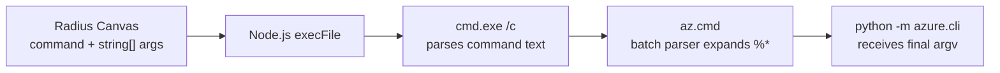

# Windows CLI argument parsing and the Radius Canvas fix

Issue #384 exposes a general Windows process-launching problem through one specific Azure setup failure. The Radius Canvas passes a Microsoft Graph URL and a JSON body to Azure CLI as separate arguments, but its Windows launcher inserts `cmd.exe` between Node.js and Azure CLI. That extra command interpreter applies its own parsing rules, so values that are harmless argv strings on macOS or Linux can become control syntax on Windows.



## The conceptual mismatch: argv versus command text

Application code usually models a process invocation as an executable plus an argument array:

```js
execFile("program", ["first argument", "second argument"]);
```

On Unix-like systems, this maps closely to the kernel API: the child receives an explicit `argv` array, and no shell interprets values unless the caller deliberately starts one. A URL such as `applications(appId='...')` is just data.

Windows process creation instead accepts one command-line string. Node and libuv normally serialize the array and hide that difference, but `.cmd` and `.bat` tools must run through `cmd.exe`. Once `cmd.exe /c` is involved, the string becomes a small command-language program. Characters such as `&`, `|`, `<`, `>`, `^`, `(`, and `)` can be separators, redirections, escapes, or block delimiters. The command interpreter sees syntax, not an array, so argument boundaries survive only if the caller applies the correct quoting policy.

## Why Azure CLI takes this path

GitHub CLI ships a native `gh.exe`, which Radius invokes directly. Azure CLI exposes `az` through `az.cmd`, a batch launcher that locates Azure CLI's bundled Python interpreter and forwards the user's arguments.

A simplified form of the launcher is:

```bat
@IF EXIST "%~dp0\..\python.exe" (
  SET AZ_INSTALLER=MSI
  "%~dp0\..\python.exe" -IBm azure.cli %*
) ELSE (
  echo Failed to load python executable.
  exit /b 1
)
```

The useful body is inside an `IF (...)` block. `%~dp0` is the batch file's directory, and `%*` expands the incoming arguments. Before this fix, Radius used this Windows shape for every non-`gh` CLI:

```js
execFile("cmd.exe", ["/c", command, ...args], options, callback);
```

The array is misleading because the child is `cmd.exe`, not Azure CLI. Node serializes it, then `cmd.exe` parses the result as command text. A value can remain separate in JavaScript while becoming active syntax one layer later.

## The exact failure in issue #384

Radius tags the App Registration it creates so later runs can identify ownership and safely reuse or clean up the resource. It calls Microsoft Graph through Azure CLI with arguments equivalent to:

```text
az rest
  --method PATCH
  --url https://graph.microsoft.com/v1.0/applications(appId='<id>')
  --body {"tags":["radius-managed", "..."]}
```

The URL has no spaces, so the previous construction did not quote it. Its closing parenthesis was interpreted as the end of the `IF (...)` block in `az.cmd`. The parser then encountered `--body` where it expected batch syntax:

```text
--body was unexpected at this time.
```

The request never reached Microsoft Graph, and Azure CLI's Python implementation never received the intended arguments. Retrying cannot help because parsing is deterministic. Radius rolls back the new resources, preventing partial setup, but Windows setup cannot progress.

## Why quoting every token is also wrong

Quoting the executable and every argument protects the URL but creates another failure:

```text
cmd /c az version
```

works, while:

```text
cmd /c "az" "version"
```

can cause the Azure CLI launcher to print `Failed to load python executable.`

The executable token is special under `cmd.exe /c`: its leading quote participates in command-string quote removal. For `az.cmd`, that can disrupt `%~dp0` and prevent the launcher from finding Python. Conversely, an absolute executable path containing spaces must be quoted:

```text
C:\Program Files\Microsoft SDKs\Azure\CLI2\wbin\az.cmd
```

When the command begins with a quoted executable, `cmd.exe /c` also requires outer quotes around the complete command line:

```text
cmd.exe /c ""C:\Program Files\...\az.cmd" "version""
```

The policy is necessarily asymmetric:

1. Leave a simple executable name such as `az` or `aws` unquoted.
2. Quote every argument so the current validated command shapes retain their argument boundaries.
3. Quote the executable only when it contains whitespace, quotes, or `cmd.exe` metacharacters.
4. If the executable is quoted, wrap the entire command line in one additional pair of quotes.
5. Set `windowsVerbatimArguments: true` so Node does not rewrite the already encoded command.

## What the Radius Canvas fix changes

The fix belongs in `packages/adapter-canvas/src/gh.ts`, at the shared `cliExec` adapter boundary. Callers still provide a command and `string[]`; routes do not learn about `cmd.exe`, and the Graph operation does not change. Only the adapter converts structured input into Windows command text.

Conceptually, the new Windows branch constructs:

```text
az "rest" "--method" "PATCH" "--url" "https://...applications(appId='...')" "--body" "{\"tags\":[...]}"
```

The complete string follows `/c`. The parenthesized Graph URL and the current provenance-tag JSON body retain their argument boundaries, while simple `az` stays unquoted. The encoder must also escape embedded quotes and runs of backslashes next to quotes or at the end of a value, which matters for JSON and Windows paths. Because `cmd.exe` remains a command interpreter rather than a true argv transport, callers must continue validating identifiers and other user-derived values instead of treating this encoding as a universal shell-safety boundary.

All Windows non-`gh` calls share this branch: Azure login, discovery, App Registration and OIDC setup, role assignment, AWS identity and discovery, and `kubectl` namespace discovery. The call graph is broad, but the behavior change is narrow. Direct `gh.exe`, macOS/Linux execution, Radius CLI and Bicep spawning, core modeling, HTTP contracts, persisted state, workflows, and cloud semantics are unchanged.

## Why validation still matters

For the current command shapes, quoting preserves the argument boundary needed by the child CLI; validation enforces product rules and limits what reaches the command interpreter. Radius must still validate repository slugs, UUIDs, and resource names. Validation alone is insufficient because legitimate data, including this Graph URL, can contain metacharacters, while quoting alone is not a substitute for validating user-derived values.

## How functional tests can prove the fix

A mocked unit test can verify the generated command string and `windowsVerbatimArguments`, but it cannot prove that real `cmd.exe` and a batch parser reconstruct the arguments.

The strongest deterministic regression is a Windows process-integration test. It should create a temporary `.cmd` fixture shaped like the Azure launcher, including an `IF (...)` block, invoke it through real `cliExec`, and record each received argument. It should cover:

- a plain command such as `version`;
- the parenthesized Microsoft Graph URL followed by `--body` JSON;
- spaces, embedded quotes, and trailing backslashes;
- an executable path containing spaces;
- an ordinary `aws` or `kubectl`-shaped invocation;
- a failing child process, proving exit and stderr propagation remain intact.

One case must use production `buildAppTagPatchArgs()` so the exact issue #384 command crosses the process boundary without contacting Azure. The suite must run on `windows-latest`; changing `process.platform` on Linux cannot reproduce `cmd.exe` quote stripping. Together, encoder unit tests, a real Windows process test, and existing route tests cover the correct layers. Browser or live-Azure tests would be slower and less diagnostic because the relevant external dependency is the Windows command interpreter.

## Notable Details

- `execFile` is shell-free only when the target executable itself is the final program. Starting `cmd.exe` explicitly introduces shell semantics even though Node's `shell` option remains false.
- Windows has more than one parsing layer here: Node/libuv serializes arguments, `cmd.exe` parses command syntax, the batch file expands `%*`, and the Python runtime parses the final command line.
- The executable and its arguments cannot use one universal quoting rule under `cmd.exe /c`.
- The fix corrects the shared adapter boundary rather than special-casing one Graph URL, so the validated Azure, AWS, and Kubernetes argument shapes receive the same boundary preservation.
- Functional confidence requires running real Windows process semantics in CI; mocked calls alone prove construction, not interpretation.
