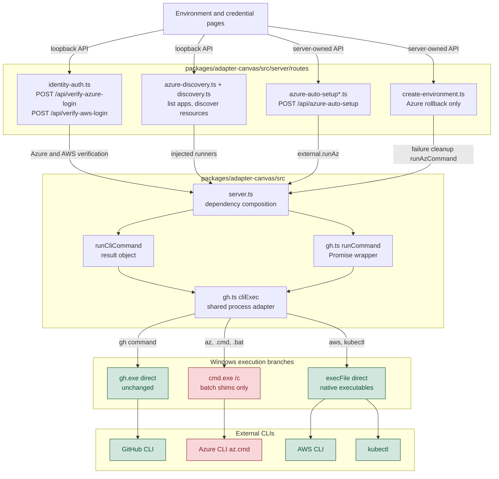
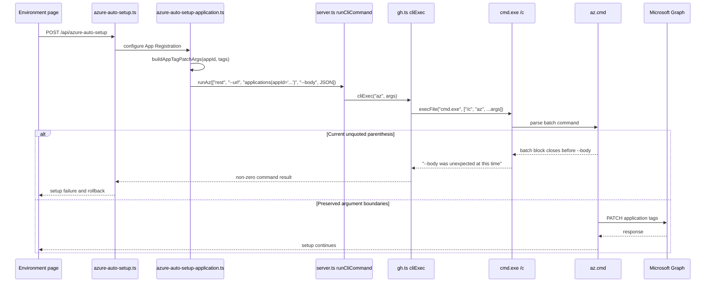
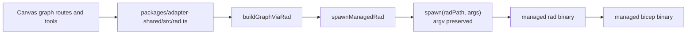

# Windows CLI process call paths

The Radius Canvas has one shared process adapter for GitHub, Azure, AWS, and Kubernetes command-line calls. Issue #384 is confined to the Windows non-`gh` branch of that adapter; the diagram shows every current route family that reaches it and the separate Radius CLI path that bypasses it.

## Key Components

- **`gh.ts cliExec`** is the shared adapter boundary. It strips `COPILOT_AGENT_SESSION_ID`, applies GitHub token selection for `gh`, and calls Node's `execFile`.
- **`server.ts`** injects `runCliCommand`, `runCommand`, or a direct `cliExec` port into route families. The route modules do not spawn processes themselves.
- **Azure auto-setup** performs the largest set of affected calls: account selection, App Registration lookup and creation, ownership, provenance tags, federated credentials, service principals, and role assignments.
- **Azure discovery** uses the same adapter for `az`, plus `kubectl` after AKS credentials are loaded. AWS discovery and credential verification use it for `aws`.
- **Create environment** uses local `az` only on Azure failure-cleanup paths. Its normal GitHub workflow creation path uses `gh`.

## How It Works

The Canvas browser calls loopback routes owned by `server.ts`. The composition root supplies each route with a narrow runner rather than allowing route code to import `node:child_process`.

The affected route families reach `cliExec` through two concrete paths:

1. Identity verification and discovery routes call the injected `runCommand`; Azure application discovery and auto-setup call `runCliCommand`. Both wrappers end at `cliExec`.
2. Azure cleanup from `POST /api/create-environment` calls the injected `runAzCommand`, which is `runCliCommand("az", args)` in `server.ts`.

On Windows, `cliExec` detects `gh` and invokes `gh.exe` directly. Every other command is classified before it is spawned. `az`, and any command named with an explicit `.cmd` or `.bat` extension, run through `cmd.exe /c`; that branch is where argument boundaries can be lost and where the quoting fix applies. A bare name is resolved against `PATH` and `PATHEXT` the way `cmd.exe` would resolve it, and only routes through `cmd.exe` when the winning entry is itself a batch file. Everything else — `aws` and `kubectl` in practice — is launched directly with the original argv array, so no command interpreter ever sees those arguments. On macOS and Linux, `cliExec` invokes the requested executable directly with the original argv array.

Resolving up front rather than retrying a failed direct launch matters for two reasons. It keeps one spawn per call, so the `ChildProcess` returned to callers is always the process that runs the command. And it never hands an unresolvable name to `cmd.exe`, whose search begins in the current directory: these children inherit the open repository as their working directory, so a repository carrying its own `kubectl.cmd` would otherwise be executed on any machine where the real CLI is absent.

The failure reported in issue #384 follows this exact path:

## Outside the Blast Radius

Radius application graph compilation and managed Radius CLI operations use `packages/adapter-shared`, not `gh.ts`.

The planned `gh.ts` change therefore does not alter Radius CLI execution, Bicep compilation, application graph generation, `packages/core`, route contracts, persisted state, generated workflows, or cloud resource semantics. The built `.artifacts/radius/com.github.copilot/extensions/radius/extension.mjs` will contain the adapter fix because it bundles `packages/adapter-canvas`, but no other plugin source or runtime boundary changes.

## Notable Details

- The blast radius of the `cmd.exe` quoting rules is narrower than the shared adapter: only Windows `az` calls and explicitly named batch files reach the command interpreter. Windows `aws` and `kubectl` calls, direct `gh.exe`, and non-Windows execution stay on argv-preserving branches.
- The behavior change is narrower than the call graph: only the Windows command-line construction changes. Direct `gh.exe` and non-Windows execution remain on their existing branches.
- Input validation for UUIDs, repository slugs, and Azure resource names remains necessary defense in depth because `cmd.exe` is still a command interpreter, not a universal argv transport.
- The highest compatibility risk is executable quoting. A plain `az` token must remain unquoted for `az.cmd` to resolve `%~dp0`; an explicit executable path containing spaces requires both executable quoting and whole-command wrapping.
