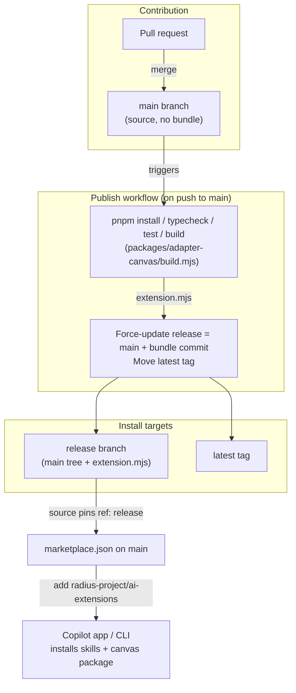

# Publishing the canvas extension bundle via a release branch

- **Author**: Brooke Hamilton (@brooke-hamilton)
- **Date**: 2026-07

> **Superseded in part.** This doc records the design as accepted. The mechanism still stands, but three specifics have since changed: the plugin is assembled into `plugins/radius/dist/` (rather than shipping from the plugin root), the publish branch is `releases/edge` (not `release`), and the moving tag is `edge` (not `latest`). See [`docs/architecture/plugin-packaging-and-publishing.md`](../architecture/plugin-packaging-and-publishing.md) for the current behaviour; read the rest of this doc for the rationale.

## Overview

The `radius` plugin ships two things to GitHub Copilot: agentic **skills** (plain files under `plugins/radius/skills/`) and a **canvas extension** whose runtime entry point is `plugins/radius/extension.mjs`. The skills are committed source, but the canvas entry point is a **build artifact**: it is bundled from TypeScript/ESM source (`packages/adapter-canvas/src` plus the `packages/core` package) by `packages/adapter-canvas/build.mjs` (esbuild) into a single file.

That artifact is intentionally git-ignored, and the Copilot marketplace installs a plugin by copying the **git-tracked** files from the installed ref with **no build step**. As a result the canvas file never ships, and opening the canvas fails with `No canvas "radius" is registered`. The skills install fine because they are tracked; the canvas does not because it is generated and ignored.

This design proposes a **publishing workflow** that keeps `main` free of the compiled artifact while still shipping it. On every merge to `main`, CI rebuilds `extension.mjs` and commits it to a dedicated **`release` branch** (main's tree plus the built bundle), then moves a `latest` tag to that commit. The plugin's `source` in `.github/plugin/marketplace.json` is changed to the **object form that pins a `ref`**, so the plugin is always resolved from the `release` branch — no matter which ref the marketplace was added from. Users therefore install the plugin from the GitHub Copilot app and receive the skills and a correctly-packaged canvas extension (`extension.mjs` + `package.json` at the plugin root). This avoids the merge conflicts and noisy diffs that would come from committing a single large compiled file to `main` on every change.

> **Scope note.** This design covers only how the bundle is **packaged and published** to the install ref. Separately, testing found that the current GitHub App does **not** auto-discover a marketplace plugin's declared `extensions`, so an installed plugin's canvas does not activate on its own (reproduced with GitHub's own `github/awesome-copilot` `accessibility-kanban` canvas plugin). That is a **GitHub App bug**; fixing or working around it is **out of scope** for this design and the accompanying PR. This work is a prerequisite either way — the bundle must ship correctly before any discovery fix can surface the canvas.

## Terms and definitions

- **Canvas extension**: A package (here, the plugin root `plugins/radius/`) that registers an interactive Copilot canvas. Its entry point is `extension.mjs`, which calls `createCanvas({ id: "radius" })`.
- **Bundle / built artifact**: The single `extension.mjs` emitted by esbuild from `packages/adapter-canvas/src` + `packages/core`. Also referred to as "the bundle".
- **Plugin manifest**: `plugins/radius/plugin.json`, which declares `skills` (`./skills/`) and `extensions` (`.`, the plugin root) as repo-relative paths. The canvas `extension.mjs` and its `package.json` live at the plugin root.
- **Marketplace manifest**: `.github/plugin/marketplace.json`, which declares each plugin's `source`. `source` accepts two forms: a **string** repo-relative path (`"./plugins/radius"`, resolved against the ref the marketplace was added from), or an **object** that pins an explicit repo and ref (`{ "source": "github", "repo": "owner/repo", "path": "...", "ref": "..." }`). Both forms are used in the official `github/awesome-copilot` marketplace.
- **Ref**: A git branch, tag, or commit SHA. Adding a marketplace can target a specific ref, and omitting one uses the repository's default branch. A `ref` can also be pinned inside the marketplace manifest's object-form `source`, in which case it wins regardless of which ref the marketplace was added from.
- **`release` branch**: A generated branch that mirrors `main` and additionally contains the committed `extension.mjs`. The plugin `source` pins its `ref` to this branch.
- **`latest` tag**: A moving tag pointing at the current `release` head, usable as a stable install alias.

## Objectives

Fix canvas registration by making a correct `extension.mjs` present on the ref that users install from, without committing the compiled artifact to `main`.

> **Issue Reference:** N/A — investigation was tracked in this session; an issue can be filed to accompany implementation.

### Goals

- Ship a correctly-packaged canvas: installing the `radius` plugin places a valid canvas extension (`extension.mjs` + `package.json`) on the install ref, at the plugin root, so a working canvas can be registered once the GitHub App discovers plugin `extensions` (see Non-goals — that discovery is a separate app bug).
- Keep `main` clean: the compiled `extension.mjs` is **not** committed to `main`, so contributors never hand-resolve conflicts in a generated 450 KB file.
- Automate publishing: the bundle is rebuilt from reviewed source and published by CI, not by hand, so it cannot drift from source.
- Keep skills and canvas in sync: the install ref always contains the skills and a bundle built from the same commit.
- Keep the install experience simple: users install the plugin from the GitHub Copilot app; the manifest redirects the plugin to the published `release` ref, so no ref needs to be specified and the install resolves the same way however the marketplace was added.
- Success is measured by: (1) a fresh install places a valid canvas extension package (`extension.mjs` + `package.json`) on the install ref, and (2) no `extension.mjs` diffs appear in `main` pull requests. (Canvas activation additionally depends on the GitHub App discovery fix noted in Non-goals.)

### Non-goals

- **Fixing GitHub App canvas discovery.** The app not auto-discovering an installed plugin's declared `extensions` is a **GitHub App bug**. This design does not fix it or work around it; it only ensures the bundle is correctly packaged and published so a discovery fix can surface it.
- **Publishing packages to a registry.** `packages/core` and `packages/adapter-canvas` remain `private`; Changesets versioning (see `RELEASING.md`) is unchanged.
- **Changing the bundling strategy.** We keep the single-file esbuild bundle; splitting it into multiple hand-authored files is out of scope (see Alternatives considered).
- **Redesigning the canvas or skills.** This is purely about how the existing artifact is published and discovered.
- **Signing or provenance/attestation for the artifact.** Worth considering later; not required to fix registration.

### User scenarios (optional)

#### User story 1

As a developer, I install the `radius` plugin from the GitHub Copilot app (app settings → **Plugins** → add the `radius-project/ai-extensions` marketplace → install `radius`), and the plugin arrives with its skills and a correctly-packaged canvas extension — no manual build required. Once the GitHub App discovers plugin `extensions` (a separate app fix — see Non-goals), the Radius canvas opens from the app's side panel.

#### User story 2

As a maintainer, I merge a PR into `main` that changes canvas code. CI rebuilds the bundle and publishes it to `release`; the next install picks up my change. My PR diff contains no `extension.mjs` noise.

## User experience (if applicable)

There is **no change to the install flow**. Because the Radius canvas can only be hosted by the GitHub Copilot app, the plugin is installed from the app, and because the plugin `source` in `marketplace.json` pins the `release` ref, that install resolves the plugin (skills + built bundle) from `release`. What users notice is that the plugin now ships a complete canvas extension package; the canvas surfaces once the GitHub App discovers plugin `extensions` (see Non-goals).

**Sample steps** (in the GitHub Copilot app):

1. Open app settings and click **Plugins**.
2. Add the `radius-project/ai-extensions` marketplace.
3. Install the `radius` plugin.

**Sample output:**

The `radius` plugin installs with its skills and a complete, correctly-packaged canvas extension (`extension.mjs` + `package.json` at the plugin root) — the bundle that was previously missing. The canvas registers once the GitHub App discovers plugin `extensions` (a separate app-side fix; see Non-goals).

## Design

### High-level design

Today, `main` carries everything the installer reads **except** the built bundle. The fix has two parts: publish a ref that carries the bundle too (produced automatically from `main` so it can never drift), and **pin the plugin's `source` to that ref** in the marketplace manifest so every install resolves it.

- A **publish workflow** runs on every push to `main` (i.e., after a PR merges).
- It builds the bundle from the just-merged commit and writes `plugins/radius/extension.mjs`.
- It **force-updates the `release` branch** to equal `main` plus one commit that adds the (otherwise ignored) bundle, then **moves the `latest` tag** to that commit.
- The plugin `source` in `marketplace.json` is changed to the **object form that pins `ref: release`**, so the plugin — its `plugin.json`, skills, and the bundle — is always fetched from the `release` ref, whichever ref the user added the marketplace from. The canvas `extension.mjs` and its `package.json` sit at the **plugin root** (`plugin.json` declares `extensions: "."`), so they resolve within the `release` checkout where the bundle exists.
- Because the ref is pinned in the manifest, install docs simply direct users to install the plugin from the app; no ref needs to be specified.

`main` remains the source of truth and stays free of the compiled artifact; `release` is a **generated, force-updated** branch that no one commits to by hand.

### Architecture diagram



### Detailed design

The installer resolves the plugin's `source`, and the extension path, against a **single ref**. So the built `extension.mjs` must physically exist on that ref. Two levers matter: **which ref carries the bundle**, and **how the install is pointed at it** — either by the ref the marketplace was added from, or by the manifest (the object-form `source` that pins a `ref`). The options below differ along both.

#### Option 1: Commit the bundle to `main`

Un-ignore `plugins/radius/extension.mjs`, commit it, and add a CI drift-check that fails a PR if the committed bundle does not match a fresh build. Users keep installing from the default branch.

##### Advantages

- Simplest mental model: install from `main`, everything is there.
- No new branch or tag machinery; the install flow is unchanged.
- A drift-check guarantees the committed bundle matches source.

##### Disadvantages

- Every PR that touches canvas or core code must **rebuild and re-commit** a single ~450 KB minified-ish file. Concurrent PRs conflict on that one file constantly, and the conflicts are unresolvable by hand (generated content).
- Pollutes `main` history and every code review with large, opaque diffs.
- Couples "source change" and "artifact change" in the same commit, making reverts and blame noisier.
- This is precisely the merge-conflict pain this design exists to avoid.

#### Option 2: Publish to a generated `release` branch and pin the manifest to it (proposed)

Keep the bundle git-ignored on `main`. A workflow on every push to `main` builds the bundle and **force-updates** a `release` branch to `main` + one commit adding the bundle, then moves a `latest` tag. In `marketplace.json` on `main`, change the plugin `source` to the **object form that pins `ref: release`**, so every install resolves the plugin from `release` — including the plain, ref-less `add radius-project/ai-extensions`.

##### Advantages

- `main` never contains the compiled artifact, so **no contributor ever resolves a bundle conflict** and code reviews stay clean.
- The bundle is always built by CI from reviewed `main` source, so it cannot drift and is never hand-edited.
- The `release` ref always carries skills **and** a matching bundle (same commit tree), keeping them in sync.
- Because the ref is **pinned in the manifest**, the install flow is unchanged and the plugin resolves the same way however the marketplace was added — users need not know about `release`.
- Reuses the existing `build.yml` steps (install → typecheck → test → build).

##### Disadvantages

- Requires a new workflow with `contents: write` and a force-updated branch/tag (generated history, not human-meaningful).
- Adds one moving part: the pinned `ref: release` in `marketplace.json` must stay correct, and the `release` branch must exist before the manifest is pinned to it (bootstrap ordering).
- Pinning `source` to a **branch** always serves the newest bundle but is not reproducible; pinning to an immutable tag/SHA would be, at the cost of a manifest bump per release (see Option 3).

#### Option 3: Publish only on tagged releases

Build and publish the bundle only when a release tag is cut (aligned with Changesets), rather than on every merge to `main`.

##### Advantages

- Fewer publish runs; artifact changes are batched to releases.
- Install target is an immutable version tag, which is reproducible.

##### Disadvantages

- Canvas changes merged to `main` are not installable until a release is cut, slowing the preview/iteration loop the product is currently in.
- Does not match the requested behavior ("every PR that goes into main triggers a build/commit").
- Can be added **later** as a complement (version tags for reproducibility) without removing Option 2.

#### Proposed option

**Option 2 — publish to a generated `release` branch on every push to `main`, move a `latest` tag, and pin the plugin `source` to `ref: release`.** It directly fixes registration, keeps `main` free of the compiled artifact (eliminating the merge-conflict problem), guarantees the published bundle is CI-built from reviewed source, and — because the ref is pinned in the manifest — leaves the install flow unchanged and consistent however the marketplace was added. Option 3 (version-tag publishing) can be layered on later for reproducible, pinnable installs.

We can move to option 3 later if we want clear release cycles rather than releasing every PR.

Concrete mechanics:

1. Trigger: `on: push: branches: [main]` (runs after a PR merges), plus `workflow_dispatch` for manual re-publish.
2. Build: reuse `build.yml`'s steps — `pnpm install --frozen-lockfile`, `pnpm run typecheck`, `pnpm run test`, `pnpm run build` — producing `plugins/radius/extension.mjs`.
3. Publish:
   - `git checkout -B release` from the current `main` commit.
   - `git add -f plugins/radius/extension.mjs` (force, because the path is git-ignored).
   - Commit with a generated message (for example, `chore(release): publish canvas bundle for <sha>`).
   - `git push --force origin release`.
   - Move the tag: `git tag -f latest && git push --force origin latest`.
4. Permissions: the job requests `contents: write`; no other scopes.
5. Pin the manifest (one-time, on `main`): set the plugin `source` in `.github/plugin/marketplace.json` to `{ "source": "github", "repo": "radius-project/ai-extensions", "path": "plugins/radius", "ref": "release" }`. Do this only after `release` exists (bootstrap ordering).

The `.gitignore` entry stays as-is; the `-f` add is what lets CI include the otherwise-ignored file on `release` only.

### API design (if applicable)

N/A for programmatic APIs. The one contract change is in `marketplace.json`: the plugin `source` moves from the string form (`"./plugins/radius"`) to the **object form** that pins a ref:

```json
"source": {
  "source": "github",
  "repo": "radius-project/ai-extensions",
  "path": "plugins/radius",
  "ref": "release"
}
```

This uses the same object-form `source` shape already used in the official `github/awesome-copilot` marketplace. `plugin.json`'s schema is unchanged. The user-facing install flow does **not** change (see User experience).

### Implementation details

#### Plugin — plugins/radius

- `.github/plugin/marketplace.json`: change the plugin `source` from the string `"./plugins/radius"` to the object form pinning `ref: release` (see API design). This is the change that makes the plain install resolve the bundle.
- `plugin.json`: `extensions` is `"."` (the plugin root), so the canvas `extension.mjs` and its `package.json` are resolved from the plugin root within the `release` checkout where the bundle exists.
- `plugins/radius/README.md` and root `README.md`: install instructions direct users to install the plugin from the GitHub Copilot app; add a short note explaining that the canvas bundle is served from the generated `release` branch (or link this design).

#### Build & packaging

- **New workflow** `.github/workflows/publish.yml` implementing the trigger/build/publish steps above with `contents: write`.
- Keep `.gitignore` line 181 (ignore the bundle) unchanged; CI force-adds it only on `release`.
- Optionally keep the existing `build.yml` artifact upload for PR inspection.
- Pin all actions by commit SHA, matching the convention already used in `build.yml`.
- Changesets/versioning in `RELEASING.md` is unaffected.

### Error handling

- **Build/test failure in the publish job**: the job fails before publishing, so `release` and `latest` keep pointing at the last good bundle. A broken bundle is never published.
- **Push/permissions failure**: the job fails visibly; `release`/`latest` are unchanged. Re-run via `workflow_dispatch`.
- **Force-update races** (two merges to `main` close together): each run rebases `release` onto the latest `main` it observes; the last run wins and reflects the newest `main`. Because `release` is derived, a superseded run causes no data loss. Concurrency control (below) makes this deterministic.
- **Stale client cache on `latest`**: recommend `@release` (branch) as the primary target; `latest` is an alias for users who prefer a tag.

## Test plan

- **Unit/existing CI**: unchanged — `typecheck` and `test` still gate the build in both `build.yml` and the new publish workflow.
- **Publish workflow validation**:
  - On a test merge to `main`, confirm the workflow builds and force-updates `release` with an `extension.mjs` present, and moves `latest`.
  - Confirm the `release` tree equals `main`'s tree plus exactly the bundle file.
- **End-to-end install (packaging)**: from a clean environment, install the plugin from the GitHub Copilot app (app settings → **Plugins** → add the `radius-project/ai-extensions` marketplace → install `radius`); verify the installed plugin dir contains `extension.mjs` and `package.json` at the plugin root alongside `skills/`, all fetched from the pinned `release` ref.
- **Canvas activation**: registering the canvas (`open_canvas({ canvasId: "radius" })`) depends on the GitHub App discovering plugin `extensions`, which is out of scope for this design (see Non-goals). As a manual sanity check that the shipped bundle is loadable, placing the two files in a discovered extensions dir (e.g. `~/.copilot/extensions/radius/`) registers the canvas — confirming the package itself is correct.
- **Drift/sanity**: confirm the published bundle byte-for-byte matches a local `pnpm run build` from the same `main` commit.
- **Testing challenges**: verifying registration requires the Copilot app/CLI runtime (an external host), so end-to-end install is a manual/integration check rather than a unit test.

## Security

- **Elevated permission**: the publish job needs `contents: write` to push the `release` branch and `latest` tag. Scope this to the single workflow/job and request no other permissions; keep the default-branch build (`build.yml`) read-only.
- **Supply chain**: the artifact is generated by CI from reviewed `main` source, not hand-committed, which reduces the risk of a tampered blob slipping in via a large opaque diff. Pin all actions by SHA (existing convention).
- **Branch/tag protection**: protect `release` from direct human pushes (only the workflow updates it) and treat its force-updated history as generated. Consider restricting who can trigger `workflow_dispatch`.
- **No secrets**: publishing uses the workflow's `GITHUB_TOKEN`; no new secrets or credentials are introduced. The bundle contains no secrets (build output of `packages/adapter-canvas/src` + `packages/core`).
- **Future hardening (non-goal here)**: artifact attestation/provenance (for example, build provenance) could be added to let clients verify the bundle.

## Compatibility (optional)

- **Install flow is unchanged**: users keep installing the plugin from the GitHub Copilot app. The manifest's pinned `ref: release` makes the plugin resolve from `release`, so the canvas extension package now ships where it previously did not — a strict improvement, not a regression. (Canvas activation still depends on the GitHub App discovery fix noted in Non-goals.)
- **Manifest change is backward-neutral**: only `marketplace.json`'s `source` moves to the object form (a shape the installer already supports); `plugin.json` is unchanged.
- **Existing installs** continue to work; re-adding or updating picks up the pinned `release` bundle. Anyone who previously added the marketplace and got skills-only gains the canvas after refreshing.

## Monitoring and logging

- **Workflow run history** is the primary signal: a green publish run per merge to `main`, with logs for the build and the branch/tag update.
- **Commit/tag inspection**: `git log origin/release` and the `latest` tag target show what is currently published and from which `main` commit.
- **Failure alerts**: rely on GitHub Actions failure notifications for the publish workflow; a red run means `release`/`latest` were not advanced.

## Development plan

1. **Add the publish workflow** (`.github/workflows/publish.yml`): trigger, build (reusing `build.yml` steps), and the force-update of `release` + `latest`, with `contents: write` and SHA-pinned actions. Add `concurrency` so only one publish runs at a time per branch. *(Checked in first; validated on a scratch branch/tag before pointing docs at it.)*
2. **Create and protect the `release` branch** and configure branch protection so only the workflow updates it.
3. **Pin the manifest**: change the plugin `source` in `.github/plugin/marketplace.json` to the object form with `ref: release`. Keep `README.md` and `plugins/radius/README.md` install instructions directing users to install from the GitHub Copilot app; add a short "how the canvas bundle is published" note (or link this design).
4. **End-to-end verification (packaging)**: perform a clean install from the GitHub Copilot app and confirm the plugin ships `extension.mjs` + `package.json` at the plugin root from the pinned `release` ref. (Canvas activation depends on the separate GitHub App discovery fix — see Non-goals.)
5. **(Optional, later)** Add version-tag publishing (Option 3) aligned with Changesets for reproducible, pinnable installs (pin `source.ref` to the version tag instead of the branch).

Each step is small; the workflow itself is the main work and is estimated at a few hours including validation.

## Open questions

- **Resolved — how do app-UI users get the pinned ref?** The `source` object form in `marketplace.json` pins `repo` + `ref`, and the installer honors it regardless of how the marketplace was added (confirmed against the object-form `source` entries in the official `github/awesome-copilot` marketplace). So no `@ref` suffix and no separate app-UI path is needed. *(Still worth a smoke test in the app UI during verification.)*
- **Q: Pin `source.ref` to the `release` branch or to `latest`/a version tag?** A branch always serves the newest bundle but is not reproducible; a tag is reproducible but needs a bump per publish. Proposed: pin the **branch** now for always-latest during preview; switch to version tags when Option 3 lands.
- **Q: Branch name.** `release` vs. `dist` vs. `canvas-dist`. Proposed: `release`.
- **Q: Publish on every push to `main`, or debounce?** Every merge is requested; confirm the run volume/cost is acceptable, or restrict to pushes that touch `packages/**` or `plugins/**`.
- **Resolved — `path` value in the object-form `source`.** `path` points at the plugin directory (`plugins/radius`). Verified by a fork install: the plugin's `plugin.json`, `skills/`, `extension.mjs`, and `package.json` are all fetched correctly from that path on the `release` ref.
- **Known issue (out of scope) — GitHub App does not discover plugin `extensions`.** A clean install ships the correct canvas package, but the current app does not auto-discover a marketplace plugin's declared `extensions`, so the canvas does not activate on its own (reproduced with `github/awesome-copilot`'s `accessibility-kanban`). This is a GitHub App bug tracked separately; fixing or working around it is out of scope here (see Non-goals).

## Alternatives considered

- **Commit the bundle to `main` with a drift-check (Option 1).** Rejected as the primary approach because it reintroduces exactly the merge-conflict and review-noise problem on a single generated file.
- **Build on install.** Not possible: the marketplace copies git-tracked files and runs no build step, so there is nowhere to run `pnpm build` at install time.
- **Hand-authored, un-bundled multi-file ESM** (the pattern used by `github/awesome-copilot` canvas extensions, which commit `extension.mjs` as source, not compiled output). Rejected because this repo's canvas genuinely needs a build: it imports the **TypeScript** `packages/core` package via the pnpm `workspace:*` protocol, so transpilation and workspace inlining are required.
- **Git LFS or a git merge driver** for the committed bundle. These reduce, but do not eliminate, the downsides of committing the artifact to `main` (LFS still versions a binary per change; a merge driver that rebuilds is more machinery than a generated branch). Rejected in favor of keeping `main` artifact-free.
- **Version-tag-only publishing (Option 3).** Not chosen as the primary mechanism because it delays installability of merged canvas changes; kept as a possible later complement.

## Design review notes

<!-- Record the decisions made during design review. Update this before the design is merged/approved. -->
