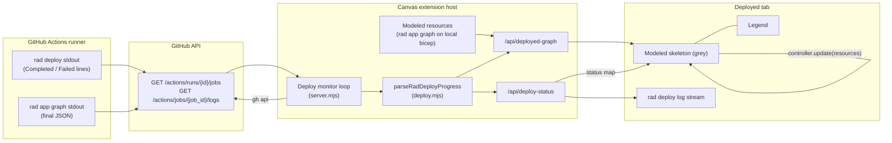

# Deployed application graph

- **Author**: Nithya Subramanian (@nithya)
- **Date**: 2026-07
- **Status**: In review

## Overview

The Radius side panel already renders three views of the application: **Modeled** (the app as authored in `.radius/app.bicep`), **Planned** (Modeled with recipe outputs resolved), and **Diff** (Planned changes between two branches). The fourth tab, **Deployed**, currently reuses the Planned graph shape and paints its nodes with recipe outputs, and it only comes to life mid-deployment.

This design turns **Deployed** into a first-class live view of the application in a target environment. The graph mirrors the **Modeled** topology (one node per Radius resource, no output resources), starts fully greyed the moment the user opens it from **Monitor Graph**, and transitions each node individually through a per-node lifecycle — hourglass while queued or in progress, green check on success, red cross on failure — as the deployment progresses. A legend explains the three states. The live signal is the `rad deploy` step's stdout inside the workflow run, read while the run is still in progress via the GitHub Actions job-log endpoint (`GET /repos/{repo}/actions/jobs/{job_id}/logs`); no upstream Repo Radius change is required.

## Terms and definitions

- **Modeled graph**: The Radius resources declared in `.radius/app.bicep`, produced by `rad app graph` and normalized into `applicationGraphToResources` (radius-core [appgraph.ts](../../radius-core/src/graph/appgraph.ts#L26)). One node per Radius resource. Output resources (the concrete cloud resources a recipe expands to) are carried on each node's `outputResources` array.
- **Planned graph**: The Modeled graph with the primary recipe output projected onto each node's label (`radiusSelectResolvedResource`, [client.mjs](../../adapters/canvas/src/client.mjs#L503)). Same topology as Modeled.
- **Deployed graph (live)**: The Modeled topology annotated with a per-node deployment status: `pending`, `in_progress`, `success`, or `failed`. Rendered while a deploy is in flight and immediately after it finishes.
- **Deployed graph (terminal)**: The application graph that `rad app graph` prints to the same job log at the end of a successful deploy (appended to `rad_commands` in [server.mjs](../../adapters/canvas/src/server.mjs#L3186)). Same shape as Modeled, but reported by the deployed application in the cluster rather than derived from the local model.
- **Output resource**: A concrete cloud resource under a Radius resource (for example an ARM `Microsoft.DBforMySQL/flexibleServers` inside a Radius `mysql` node). Present on `Modeled` resources' `outputResources` field, but **not** rendered as a separate node on the Deployed view.
- **Legend**: The status key drawn beside the graph. Three symbols: hourglass (pending / in progress), green check (success), red cross (failed).
- **Repo Radius**: The GitHub Actions workflows fetched from `radius-project/radius` at the pinned `RADIUS_REF` and committed to a target repo. The `run-rad-commands-*.yml` provider workflows run `rad deploy` followed by `rad app graph` on the runner; both write to the same job's stdout, which GitHub Actions surfaces through the jobs-logs endpoint.

## Objectives

> **Issue Reference:** N/A (feature request from the Radius side panel walkthrough; no issue filed yet).

### Goals

1. Give **Deployed** a stable topology: the Modeled resources (from `rad app graph`), with **no output resources**, so the shape does not shift when a deploy starts or finishes.
2. Show the view as a fully greyed skeleton the moment the user lands on it from a **Monitor Graph** link on the Deployments page — even before any status is known.
3. Drive per-node status live: hourglass while pending or in progress, green check on success, red cross on failure. The badge is the primary status signal; the node fill stays neutral so the icon and label remain readable.
4. Render a legend that maps the three symbols to their meanings, in every state.
5. Guarantee `rad deploy` output keeps arriving under the graph while the run is active, and stops when the run reaches a terminal conclusion. The source of that stream is the workflow job log; the transport to the browser stays the existing `/api/deploy-status?since=N` HTTP long-poll.
6. Preserve today's behaviors: failure surfaces the workflow run URL, the graph tolerates the CDN-loaded React Flow being unavailable, and the graph unmounts cleanly on repo/tab switch (`radiusRenderGraph` teardown in [client.mjs](../../adapters/canvas/src/client.mjs#L549)).

### Non-goals

1. **Rendering output resources on the Deployed view.** Explicitly excluded by the ask. The Modeled view continues to expand outputs; the Deployed view does not.
2. **Streaming `rad deploy` stdout as a single continuous WebSocket.** The existing HTTP long-poll (`?since=N`) already delivers the effect the user asked for ("keep getting updated") and requires no upstream workflow changes.
3. **Real-time status *inside* a Modeled resource** (that is, per output-resource dots on the node card). Status is per Radius resource. `rad deploy` prints one status line per Radius resource, which is the granularity the graph reflects.
4. **Changing the way workflows are dispatched or authored.** `run-rad-commands.yml` and its provider workflows are fetched from upstream and adapted in [infra.mjs](../../adapters/canvas/src/infra.mjs#L192); this design does not modify that pipeline.
5. **Persisting deployment history across sessions.** Deployed status is per-canvas-session state (`entry.state.deployStatus` and friends in [server.mjs](../../adapters/canvas/src/server.mjs#L2985)). Restoring it after a page reload is a follow-up.

### User scenarios

#### User story 1 — Watch a fresh deploy on the greyed Modeled topology

The user just clicked **Deploy** on the Deployments page and it links them to **Monitor Graph**. They open the Deployed tab and immediately see the Modeled application (`app`, `mysql`, `app-image`, `dbCredentials` — the same nodes as the Modeled view) drawn in grey with hourglass badges on every node, plus a legend. Over the next minute, one node flips to green with a checkmark, then the next, then the deploy fails on `mysql`, which turns red with a cross. The legend explains what each badge means, and the workflow's `rad deploy` output streams below the graph the entire time.

#### User story 2 — Return to the Deployed tab after a completed run

The user comes back to the Deployed tab after a successful deploy. The graph shows the Modeled topology with every node green-checked, backed by the terminal `rad app graph` JSON captured from the workflow job log at the end of the run (see Detailed design). Clicking a node still opens the concrete resource in the cloud portal (existing `portalUrl` behavior in [server.mjs](../../adapters/canvas/src/server.mjs#L3032)).

## User experience

The `Applications → Deployments → Monitor Graph` link (built at [pages.mjs](../../adapters/canvas/src/pages.mjs#L3259)) routes to `/?page=deployed&environment=…&application=…`, which loads `deployedGraphPage` ([pages.mjs](../../adapters/canvas/src/pages.mjs#L1130)). The tab renders in three states:

1. **No status yet (fresh open, or between runs).** The Modeled resources for the selected application render fully greyed, each node has an hourglass badge, and the legend shows the three symbols. The header reads "Application: … / Environment: …". No log panel is shown.
2. **A deploy is in flight.** Node fills stay neutral; badges transition per node from hourglass → green check or hourglass → red cross as `rad deploy` prints `Completed <name> <type>` / `Failed <name> <type>` lines to the workflow job log and GitHub Actions step conclusions report the surrounding step transitions. The log panel below the graph streams new `rad deploy` lines every 1.5s. The header sub-line shows the run URL and a "Cancel run" affordance (defer if out of scope; see Open questions).
3. **Terminal (post-run).** Every node carries its final badge. If the run failed, the failed node's popup shows the excerpt of the log that mentions its Radius resource name; if the run succeeded, node popups deep-link to the cloud portal for the resource's primary output (existing behavior).

**Sample input:** The user opens `/?page=deployed&environment=aks-dev&application=todo-list-app`, with a `run-rad-commands.yml` run currently `in_progress`.

**Sample output:** The graph screenshot the user pasted, with all four nodes (`app`, `mysql`, `app-image`, `dbCredentials`) initially grey + hourglass; after ~40s, `app-image` and `dbCredentials` are green + check, `app` shows hourglass, `mysql` shows red + cross; the legend renders at the bottom-left of the graph frame.

**Sample `rad deploy` stdout captured from the job log (drives the per-node badges):**

```text
Building app.bicep...
Deploying template 'app.bicep' for application 'todolist' and environment '/planes/radius/local/resourceGroups/my-group/providers/applications.core/environments/my-env' from workspace 'my-workspace'...

Deployment In Progress...

Completed            todolist        Applications.Core/applications
Completed            postgresql      Radius.Data/postgreSqlDatabases
Completed            frontend        Applications.Core/containers

Deployment Complete

Resources:
   todolist        Applications.Core/applications
   frontend        Applications.Core/containers
   postgresql      Radius.Data/postgreSqlDatabases
```

Each state line is column-oriented: column 1 is the status keyword (`Completed`, `Failed`, or the global markers `Deployment In Progress...` / `Deployment Complete`), column 2 is the Radius resource name (matches the modeled node key), column 3 is the Radius resource type. The parser in Detailed design consumes this shape directly. v1 recognizes `Completed` and `Failed` only; a per-resource `In Progress` keyword can be added later without a caller change.

## Design

### High-level design

Deployed becomes a **projection**: a fixed topology (Modeled) rendered with a per-node status map that is derived live from the deploy-status stream. Topology and status are computed independently, so the graph can render before any status is known and never changes shape once a deploy starts.

Three components change:

1. **`radius-core` / graph model.** A single helper builds the Deployed skeleton from Modeled resources by stripping `outputResources` and initializing every node's `deployStatus` to `pending`. This is the topology the UI mounts on first render.
2. **Canvas server (`adapters/canvas/src/server.mjs`).** `/api/deployed-graph` gains an unambiguous **live vs. terminal** contract: when a run is active for the selected `(app, env)`, it returns the Modeled skeleton with the current `deployStatus` map; when no run is active, it returns the terminal `rad app graph` JSON (captured from the workflow job log at the end of the last run) reduced to the same Modeled shape (outputs stripped) with status `success` (or the last known terminal state). `/api/deploy-status` continues to serve the log stream and per-resource status transitions.
3. **Canvas UI (`adapters/canvas/src/pages.mjs`, `adapters/canvas/src/client.mjs`).** `deployedGraphPage` renders the Modeled skeleton *before* the first `/api/deployed-graph` response comes back, subscribes to `/api/deploy-status?since=N`, calls the existing `controller.update(resources)` on the mounted `radiusRenderGraph` to reflect status changes, and turns on the legend + `deployMode: true` (which the renderer already supports at [client.mjs](../../adapters/canvas/src/client.mjs#L713)).

### Architecture diagram



### Detailed design

#### Option 1 — Reuse the Planned graph shape (today's behavior)

The Deployed view continues to render `entry.state.deployingResources` — a deep-cloned Planned graph with per-output statuses that were originally driven by the Azure activity log on `radius-deploy-status` — and swap in the terminal `rad app graph` output at the end.

##### Advantages

- Zero code change to the rendering path.

##### Disadvantages

- Violates the user requirement: outputs *are* rendered (as extra nodes in the modeled fallback path, and as fill drivers in the planned path).
- The topology depends on whether recipes have been resolved yet; the graph shifts shape between "before deploy" and "during deploy".
- The greyed initial state isn't guaranteed: the view either shows "Nothing deployed yet" or the last successful terminal graph before the run has started.
- The activity-log signal it depended on is no longer being published on the flows we exercise, so this option can no longer color anything mid-run in practice — it degrades to a coarse pre/post view.

#### Option 2 — Modeled projection with a separate status map (proposed)

Deployed always renders the Modeled resources for the selected app. Deployment status is a separate `Map<resourceKey, 'pending'|'in_progress'|'success'|'failed'>` maintained by the deploy monitor. The renderer already supports this via `deployMode: true` and each node's `deployStatus`. Output resources are removed from the Deployed projection before it hits the wire.

##### Advantages

- Matches the ask exactly: Modeled topology, no outputs, greyed at open, per-node status transitions.
- Topology never changes between "no run", "in flight", and "terminal", so React Flow's viewport, layout, and node positions are stable across state transitions.
- Independent of when recipes are resolved; the greyed skeleton renders even before Planned has been computed.
- Cleanly separates topology from status, so a future switch to a push-based transport (WebSocket / SSE) touches only the status stream, not the graph.
- Reuses the existing renderer's `deployMode` styling and `radiusDeployBadgeSvg` badges ([client.mjs](../../adapters/canvas/src/client.mjs#L266)), so there is no new visual language.

##### Disadvantages

- Loses the fine-grained per-output coloring that was previously derived from the Azure activity log on `radius-deploy-status`. Mitigation: `rad deploy` already prints one `Completed <name> <type>` or `Failed <name> <type>` line per Radius resource (see sample output in User experience below), which is exactly the granularity this view renders. The raw `rad deploy` output stays in the log panel below the graph, so nothing is hidden.
- Two nodes with the same Radius `name` but different `id`s (rare in the model, forbidden by `rad app graph`) would collide on the status map key. Mitigation: use `id || name` as the key, matching the existing renderer convention (see `keyOf` in [deploy.mjs](../../adapters/canvas/src/deploy.mjs#L106)).

#### Proposed option

**Option 2.** It is the only option that satisfies the fixed-topology, greyed-at-open, no-output-resources contract, and it consumes a signal — `rad deploy`'s own stdout, read from the GitHub Actions job log — that the workflow already emits with no changes on the upstream side. Losing per-output color fill is acceptable because per-Radius-resource is the level the ask targets, and the raw `rad deploy` output stays visible in the log panel.

### API design

Server contracts change only additively. The public shape of each route is preserved so that any client (including the packaged `plugins/radius/extension.mjs`) that has not been rebuilt continues to work.

#### `GET /api/deployed-graph?repo=<owner/name>&environment=<name>&application=<name>`

Currently accepts `repo` only ([server.mjs](../../adapters/canvas/src/server.mjs#L2213)) and reshapes the terminal `deploy-graph.json` it used to read from `radius-deploy-status`. Extended to accept `environment` and `application`, source the terminal graph from the workflow job log instead, and return the live view when a deploy is active for that pair.

Response (unchanged shape; new `mode` field is additive):

```json
{
  "resources": [ /* Modeled resources with outputResources omitted; each carries deployStatus */ ],
  "repo": "octo/todo-list-app",
  "branch": "main",
  "mode": "live" | "terminal" | "greyed"
}
```

- `mode: "greyed"` — no run has ever been observed for `(app, env)` in this session; every node's `deployStatus` is `pending`.
- `mode: "live"` — a run is currently `in_progress` for `(app, env)`; each node carries its current status from the monitor loop.
- `mode: "terminal"` — the last observed run reached a conclusion; each node carries its final status (`success` or `failed`).

`resources[*].outputResources` is always the empty array on this route (they are stripped server-side). Nodes keep `id`, `name`, `type`, `codeReference`, `definitionFile`, `definitionLine`, `connections`, `icon`, and `deployStatus`, so the popup's "View source code" and cloud-portal links keep working (see [client.mjs](../../adapters/canvas/src/client.mjs#L811)).

#### `GET /api/deploy-status?since=<N>`

Unchanged. Continues to return `{ resources, logsNew, logBase, logTotal, status, error, deployRunUrl, ... }` per [server.mjs](../../adapters/canvas/src/server.mjs#L2242). The Deployed page uses this only for log streaming and status transitions; the graph shape is taken exclusively from `/api/deployed-graph`.

### Implementation details

#### `radius-core` (graph module)

Add a small pure helper in `radius-core/src/graph/`:

```ts
// radius-core/src/graph/deployed.ts (new)
import type { Resource } from "./model.js";
export type DeployStatus = "pending" | "in_progress" | "success" | "failed";
export function projectDeployedGraph(
  modeled: Resource[],
  statusById: Record<string, DeployStatus>,
): Resource[]
```

- Deep-clones each modeled resource, sets `outputResources = []`, and copies `statusById[id || name] || "pending"` onto `deployStatus`.
- Runs the modeled `resources` through `filterGraphVisualizationResources` (existing, [visualization.ts](../../radius-core/src/graph/visualization.ts#L70)) before projection, so containerImages and the ghcr-registry-creds secret are dropped consistently with the Modeled and Planned graphs.
- Unit tests cover: outputs stripped, statuses copied by `id` and by `name`, unknown status → `pending`, container-images filtered.

Export from `radius-core/src/graph/index.ts` and re-export from `radius-core/src/index.ts` (same pattern as `applicationGraphToResources`).

#### Canvas adapter — `adapters/canvas`

##### `server.mjs`

1. Extend the `/api/deployed-graph` handler ([server.mjs](../../adapters/canvas/src/server.mjs#L2213)) to accept `environment` and `application`, and to return the projection:
    - If `entry.state.deployStatus === "in_progress"` for `(app, env)`: build `statusById` from the current `entry.state.deployingResources` (which already carry `deployStatus`), call `projectDeployedGraph(modeled, statusById)`, and return with `mode: "live"`.
    - If the last terminal `rad app graph` JSON captured for this session is present in `entry.state.deployedGraph`: reduce it to the Modeled shape (keep only resources whose `id`/`name` appears in Modeled; always empty `outputResources`), tag every node `deployStatus: "success"`, and return with `mode: "terminal"`.
    - Otherwise: fetch the Modeled resources for the selected app (reuse the same code path `graphPage` uses, `fetchBicepSelection` + `buildGraphViaRad` in [server.mjs](../../adapters/canvas/src/server.mjs#L3070)), project with an empty `statusById`, and return with `mode: "greyed"`.
2. Rewrite the monitor loop's per-tick log fetch. Where it currently calls `fetchLiveDeployLog(repo)` (around L3419), instead: `const jobId = findDeployJobId(detail); const logTxt = await fetchJobLog(repo, jobId);`. Feed the delta (`logTxt.slice(prevLen)`) to the log ring buffer and to `parseRadDeployProgress(logTxt, resources)`. Merge the result into `entry.state.deployingResources` with these rules:
    - `prog.global === "in_progress"` → every resource still in `pending` moves to `in_progress`.
    - `prog.byName[name] === "success"` and current is not `failed` → set `success`.
    - `prog.byName[name] === "failed"` → set `failed` (terminal; never downgraded).
    - **Terminal (workflow `status === "completed"`)**: only resources with a `Completed <name>` line in `rad deploy` stdout are set to `success`; every other resource is set to `failed`. The workflow's own conclusion never converts an unseen resource to green — it only decides the overall run label. `Deployment Complete` is informational.
3. On terminal success, extract the deployed graph from the same job log. The workflow already appends `rad app graph <appName>` after `rad deploy` (`buildAppGraphRadCommand` usage in [server.mjs](../../adapters/canvas/src/server.mjs#L3186)); its JSON block is inline in the job log. Find the last well-formed JSON object at the tail of the log (bounded by the outermost `{`…`}` after the `Resources:` block), parse it, run through `applicationGraphToResources`, and store in `entry.state.deployedGraph`. This replaces the previous `for (let g = 0; g < 6 && !deployed; g++) { deployed = await fetchDeployGraph(repo); ... }` retry loop.
4. Preserve the deploy monitor's role: it continues to write per-Radius-resource status into `entry.state.deployingResources`, which the `/api/deployed-graph` handler snapshots on each request. No new poll loop.
5. Drop `entry.state.deployingResources[*].outputResources[*].deployStatus` mutations under the new API path: outputs are stripped before the wire, and the parser sets status at the Radius-resource level directly. The deploying page's log stream is unaffected.
6. Retire `rewireDeployedGraphChain` and `normalizeDeployedGraph`. They only made sense for the recipe-output-heavy terminal graph shape; the Modeled projection they mutated no longer exists on this route.

##### `deploy.mjs`

Add two helpers and one parser. Delete the five `radius-deploy-status` fetchers and their callers once the new path is in.

- `fetchJobLog(repo, jobId)` — calls `gh api /repos/${repo}/actions/jobs/${jobId}/logs`, returns the plain-text log or `null`. Follows GitHub's 302 to blob storage automatically via `gh`. Works while the job is still running (`--log` on `gh run view` does not).
- `findDeployJobId(detail, stepName = "Deploy Application")` — pure helper over the `detail.jobs` array `getRunDetail` already returns; returns the `job.id` whose `steps[]` contains a step named `stepName`, or `null`. Locates the specific job that runs `rad deploy` inside the multi-job dispatcher workflow.
- `parseRadDeployProgress(logText, resources)` — the column-1 keyword parser for `rad deploy` stdout. Reads:
    - `Deployment In Progress...` → `{ global: "in_progress" }` (caller flips pending nodes to `in_progress`).
    - `Deployment Complete` → `{ global: "complete" }`.
    - `Completed <name> <type>` → `byName[name] = "success"`.
    - `Failed <name> <type>` → `byName[name] = "failed"`.

    Returns `{ global, byName }`. v1 recognizes `Completed` and `Failed` only, per confirmed sample. Pure — no I/O; unit-testable against the sample output above.

The five orphan-branch fetchers (`fetchLiveDeployLog`, `fetchLiveActivityLog`, `fetchLiveControlPlaneLog`, `fetchDeployState`, `fetchDeployGraph`) plus their callers (`pollActivity`, `pollControlPlane`, and the terminal `fetchDeployGraph` retry loop in [server.mjs](../../adapters/canvas/src/server.mjs)) are removed in the same commit that switches the monitor loop over. `applyActivityToResources`, `reduceActivityLog`, `azureTypeFromResourceId`, `rewireDeployedGraphChain`, `normalizeDeployedGraph`, and `deployedResourceCategory` are deleted as dead code in the same PR because their only callers were on that path.

##### `pages.mjs`

Rewrite the initial render of `deployedGraphPage` ([pages.mjs](../../adapters/canvas/src/pages.mjs#L1130)) around three principles:

1. Never call `showNothing("Nothing deployed yet")` when Modeled resources exist for the selected app. Instead, mount the greyed Modeled skeleton immediately and only replace the message when there is truly no `.radius/app.bicep`.
2. Mount `radiusRenderGraph(..., { deployMode: true, showLegend: true, repoUrl, branch })` on first render. Passing `deployMode: true` gates the badges + neutral fill in [client.mjs](../../adapters/canvas/src/client.mjs#L713); passing `showLegend: true` enables the existing legend host.
3. Replace the ad-hoc `loadGraph()` polling with a single subscription: request `/api/deployed-graph` once for the initial topology, then subscribe to `/api/deploy-status?since=N` for both log lines and status updates. When status updates arrive, call `controller.update(newResources)` (already exposed by `radiusRenderGraph`, see [client.mjs](../../adapters/canvas/src/client.mjs#L1257)) so React Flow keeps its viewport.
4. When `status === "success"` or `"failed"`, do one final `GET /api/deployed-graph?environment=…&application=…` to pick up the terminal graph and stop the log poll (existing `stopLogStream` in [pages.mjs](../../adapters/canvas/src/pages.mjs#L1210)).

##### `client.mjs`

Two focused adjustments to `radiusRenderGraph`:

1. **Legend on Deployed.** Extend the legend branch at [client.mjs](../../adapters/canvas/src/client.mjs#L1222) so that `deployMode && !diffMode` shows the *status* legend (hourglass = pending / in progress, green check = success, red cross = failed) rather than the resource-type legend. The category legend remains for the Modeled and Planned views (`!deployMode && !diffMode`).
2. **Skip output children on Deployed.** The block that expands `outputResources` as child nodes at [client.mjs](../../adapters/canvas/src/client.mjs#L868) already skips `plannedMode || deployMode`; no change needed. Confirmed via the existing conditional and locked in by a new test in `client_test.mjs`.

`getNodeColors` at [client.mjs](../../adapters/canvas/src/client.mjs#L710) already returns neutral grey for `deployMode` pending / in-progress, so the fill stays uniform on the initial render.

##### Build & packaging

- `plugins/radius/extension.mjs` is a build artifact (produced by `adapters/canvas/build.mjs`) that inlines the compiled canvas. Verify the build regenerates it and no manual edit is required in `plugins/radius/`.

#### Shared adapter — `adapters/shared`

N/A. This design does not change the Copilot skill surface. `pnpm -F @radius-project/canvas build` output is what the plugin serves.

#### Plugin — `plugins/radius`

N/A beyond the build artifact refresh above.

### Error handling

- **No `.radius/app.bicep` on the selected branch.** `/api/deployed-graph` falls through to the same `needsAppBicep` path Modeled uses ([server.mjs](../../adapters/canvas/src/server.mjs#L3070)). The page shows the existing "Copilot is generating .radius/app.bicep with the Radius app-bicep skill…" message instead of the greyed skeleton.
- **`rad app graph` fails to produce Modeled resources.** Surface the error text under the header and skip the graph mount; do not paint a fake all-red graph.
- **Deploy monitor stalls (no log growth for > 60s while the run is `in_progress`).** The existing heartbeat log line and 25s "flip pending → in_progress" fallback in [server.mjs](../../adapters/canvas/src/server.mjs#L3449) both stay; they now key off `fetchJobLog` growth instead of the orphan-branch file. The Deployed graph reflects whatever the monitor has last written.
- **Jobs endpoint 503 flake.** `getRunDetail` already tolerates a status-only response when the `/jobs` sub-resource is unavailable ([deploy.mjs](../../adapters/canvas/src/deploy.mjs#L37)). While flaking, `findDeployJobId` returns `null` and `fetchJobLog` is skipped for the tick; the next tick recovers. No status regression, only a paused update.
- **CDN unavailable (React Flow global missing).** Existing early return in `radiusRenderGraph` at [client.mjs](../../adapters/canvas/src/client.mjs#L538) draws the recoverable "Graph library failed to load" message. The legend and status stream still render because they are plain DOM.
- **User navigates away mid-run.** `radiusRenderGraph` tears down its React root and event listeners in the `destroy` path ([client.mjs](../../adapters/canvas/src/client.mjs#L1257)); the log poll is already cancelled by `stopLogStream`. Coming back re-mounts against the current status map.

## Test plan

Add tests alongside their subjects and drive them from `pnpm -r test` (root `package.json`).

- `radius-core/src/graph/deployed_test.ts` — new. Cases:
    - Outputs are stripped: `projectDeployedGraph([{outputResources:[...]}]).every(r => r.outputResources.length === 0)`.
    - Status by id: unknown id falls back to `pending`; known id copies through; `name` fallback when `id` is absent.
    - Container-images visualization filter is applied before projection.
- `adapters/canvas/src/server_test.mjs` (or `deploy_test.mjs`) — new. Cases:
    - `/api/deployed-graph` with an active deploy for `(app, env)` returns `mode: "live"` and resources whose `outputResources` are empty.
    - Same route with no active deploy and no captured terminal graph returns `mode: "greyed"` and pending statuses.
    - Same route after a run captured a `rad app graph` JSON block from the job log returns `mode: "terminal"` and all `success`.
- `adapters/canvas/src/pages_test.mjs` — extend. Cases:
    - `deployedGraphPage` HTML includes `deployMode: true` and `showLegend: true` in the mount call.
    - The Deployed HTML no longer contains a "Nothing deployed yet" fallback when a repo is present.
- `adapters/canvas/src/client_test.mjs` — extend. Cases:
    - `deployMode` renders the status legend (hourglass / check / cross) instead of the category legend.
    - `deployMode` never mounts child nodes for `outputResources`.

No new external dependencies; every test runs against the in-process HTTP server + vitest (see [pages_test.mjs](../../adapters/canvas/src/pages_test.mjs#L1)).

## Security

The Deployed view reads two GitHub API endpoints through the same `gh` CLI wrapper the current implementation uses (`cliExec` in [gh.mjs](../../adapters/canvas/src/gh.mjs)): `GET /repos/{repo}/actions/runs/{id}/jobs` and `GET /repos/{repo}/actions/jobs/{job_id}/logs`. Both require the same repo read scope the existing `gh run view` / `gh run list` calls already need, so no new credential is in flight and no new deserialization surface is introduced (the JSON path uses `ghJson`; the log path is treated as opaque text).

Two log-panel considerations already handled remain unchanged:

- The `RADIUS_DEPLOY_PARAMS` secret carries `@secure()` bicep parameters. Provisioning happens over stdin ([server.mjs](../../adapters/canvas/src/server.mjs#L3162)) so values never land in argv or process listings. This design does not touch that path.
- The log stream is displayed as `textContent` in [pages.mjs](../../adapters/canvas/src/pages.mjs#L1196), which auto-escapes; no risk of a log line being interpreted as HTML.

## Compatibility

- **`/api/deployed-graph` response**: the `resources`, `repo`, and `branch` fields keep their shape; `mode` is new and optional for older clients. A client that ignores `mode` sees today's behavior: it renders whatever `resources` came back. Because outputs are stripped even for the terminal branch, an older client that expected child output nodes on the Deployed view will render slightly fewer nodes than before — that is the intended change.
- **Rendered plugin (`plugins/radius/extension.mjs`)**: regenerated from `adapters/canvas/build.mjs` on the next release. The plugin manifest and the marketplace entry are unaffected.
- **Upstream Repo Radius**: no changes required. `rad deploy` in the composite action already prints per-resource `Completed <name> <type>` / `Failed <name> <type>` lines (see sample output in User experience) and `rad app graph` prints its JSON to the same stdout — both of which GitHub Actions surfaces through the jobs-logs endpoint.
- **`radius-deploy-status` branch**: this design *removes* the extension's dependency on that branch entirely. Any content still produced there by upstream is ignored. If upstream stops publishing it, the Deployed view is unaffected.

## Monitoring and logging

- The deploy monitor's existing `addLog` calls remain the tracing signal (they surface in `entry.state.deployLogs` and are visible in the log panel below the Deployed graph).
- Two additive log lines to make the new behavior observable end-to-end:
    - `🗺 Deployed graph (mode=<live|terminal|greyed>) rendered for <app>@<env>` at the top of each `/api/deployed-graph` handling.
    - `  ↻ Status change: <resource> <from> → <to>` when the projection swaps a node's `deployStatus`. Emitted once per transition, not per poll.
- The bounded 4000-line ring buffer in `entry.state.deployLogs` ([server.mjs](../../adapters/canvas/src/server.mjs#L3020)) stays; new lines are conservative to preserve the cap under long deploys.

## Development plan

Deliver incrementally so each commit is independently reviewable and shippable behind the existing `deployedGraphPage`. Every commit ends with tests green. Commits 1–2 already deliver the greyed-view-with-legend user experience end-to-end; commits 3–5 wire the live signal and terminal graph; commits 6–7 delete the orphan-branch code path and land the docs.

### Commit 1 — Deployed graph = greyed Modeled skeleton

**Outcome:** Clicking **Monitor Graph** on the Deployments page opens a greyed Modeled topology (outputs excluded) even when no deploy has ever run.

- `radius-core/src/graph/deployed.ts` (new) — `projectDeployedGraph(modeled, statusById)`; runs `filterGraphVisualizationResources` from [visualization.ts](../../radius-core/src/graph/visualization.ts#L70), strips `outputResources`, initialises every node's `deployStatus` to `pending` (or `statusById[id||name]`). Export via [radius-core/src/graph/index.ts](../../radius-core/src/graph/index.ts) and [radius-core/src/index.ts](../../radius-core/src/index.ts).
- [adapters/canvas/src/server.mjs](../../adapters/canvas/src/server.mjs#L2213) — `/api/deployed-graph` accepts `application` + `environment`. When neither an in-flight run nor a captured terminal graph exists, resolve Modeled via the same `fetchBicepSelection` + `buildGraphViaRad` path `graphPage` uses ([server.mjs](../../adapters/canvas/src/server.mjs#L3070)), pipe through `projectDeployedGraph({})`, respond `{ mode: "greyed", resources, repo, branch }`.
- [adapters/canvas/src/pages.mjs](../../adapters/canvas/src/pages.mjs#L1130) — `deployedGraphPage` stops calling `showNothing("Nothing deployed yet")` when a repo + app are present; mounts `radiusRenderGraph(..., { deployMode: true, showLegend: true, repoUrl, branch })` on first paint.
- **Tests:** `radius-core/src/graph/deployed_test.ts` (outputs stripped; unknown key → pending; container-images filtered). `pages_test.mjs` asserts `deployMode: true` + `showLegend: true`. `server_test.mjs` (or `deploy_test.mjs`) asserts `mode: "greyed"` shape.

### Commit 2 — Status legend on Deployed

**Outcome:** Legend shows hourglass / green check / red cross with labels next to the graph.

- [adapters/canvas/src/client.mjs](../../adapters/canvas/src/client.mjs#L1222) — extend the `options.showLegend && !diffMode` branch so `deployMode` renders the status legend (using `radiusDeployBadgeSvg` from [client.mjs](../../adapters/canvas/src/client.mjs#L266)) instead of the category legend. Modeled/Planned keep the category legend.
- **Tests:** `client_test.mjs` — deployMode + showLegend produces three items with hourglass / check / cross badges.

### Commit 3 — Job-log transport + `rad deploy` parser

**Outcome:** Introduce the new signal source without wiring it up yet, so it can be reviewed as a pure helper module.

- [adapters/canvas/src/deploy.mjs](../../adapters/canvas/src/deploy.mjs) — add:
    - `fetchJobLog(repo, jobId)` — `gh api /repos/${repo}/actions/jobs/${jobId}/logs`.
    - `findDeployJobId(detail, stepName = "Deploy Application")` — pure lookup over `detail.jobs[].steps[]`.
    - `parseRadDeployProgress(logText, resources)` — column-1 keyword parser: `Deployment In Progress...` → `global: "in_progress"`; `Deployment Complete` → `global: "complete"`; `Completed <name> <type>` → `byName[name] = "success"`; `Failed <name> <type>` → `byName[name] = "failed"`.
- **Tests:** `deploy_test.mjs` — feed the exact sample stdout from User experience; assert the resulting `{ global, byName }`. Cases for `Failed` line, unknown keyword ignored, empty input, resource-name-not-in-modeled ignored, `findDeployJobId` returning `null` when no matching step exists.

*No behaviour change on the running system — dead code until commit 4.*

### Commit 4 — Live status projection

**Outcome:** During a deploy, badges transition per-node in the Deployed tab as `rad deploy` prints its lines.

- [adapters/canvas/src/server.mjs](../../adapters/canvas/src/server.mjs) monitor loop (around L3419) — replace `fetchLiveDeployLog(repo)` with `fetchJobLog(repo, findDeployJobId(detail))`. Feed the delta into the log ring buffer, then call `parseRadDeployProgress` and merge into `entry.state.deployingResources` using the merge rules (pending→in_progress on `global`, terminal success/failed by name, `complete`→any in_progress becomes success, run conclusion !== success → pending/in_progress become failed).
- Remove `pollActivity` / `pollControlPlane` calls from this loop (their fetchers stay for now — deleted in commit 6).
- `/api/deployed-graph` handler — when `entry.state.deployStatus === "in_progress"` for the requested `(app, env)`, build `statusById` from `entry.state.deployingResources` and respond `{ mode: "live", resources: projectDeployedGraph(modeled, statusById) }`.
- [adapters/canvas/src/pages.mjs](../../adapters/canvas/src/pages.mjs#L1130) `deployedGraphPage` — subscribe to `/api/deploy-status?since=N`, call `controller.update(resources)` from `radiusRenderGraph` ([client.mjs](../../adapters/canvas/src/client.mjs#L1257)) on each status change; stop polling on a terminal status.
- **Tests:** `server_test.mjs` — synthetic tick with `Completed frontend Applications.Core/containers` flips the matching node to `success`; `Failed mysql …` flips to `failed`; workflow conclusion `failure` after `Completed …` for A but not B → B becomes `failed`, A stays `success`.

### Commit 5 — Terminal graph from the same job log

**Outcome:** After a successful run, the Deployed tab shows the cluster-reported graph, still Modeled-shaped, all green.

- [adapters/canvas/src/deploy.mjs](../../adapters/canvas/src/deploy.mjs) — add `extractAppGraphJson(logText)` that walks the log tail after the `Resources:` marker and returns the last balanced `{…}` block.
- [adapters/canvas/src/server.mjs](../../adapters/canvas/src/server.mjs) — on run conclusion `success`, run `extractAppGraphJson(logTxt)` → `JSON.parse` → `applicationGraphToResources` → `entry.state.deployedGraph`. Replace the `for (let g = 0; g < 6 && !deployed; g++) { deployed = await fetchDeployGraph(repo); … }` retry loop.
- `/api/deployed-graph` — when `entry.state.deployedGraph` is present, reduce to Modeled shape via `projectDeployedGraph`, respond `{ mode: "terminal" }`.
- **Tests:** `deploy_test.mjs` — `extractAppGraphJson` against a synthetic log with the `Resources:` block followed by a valid JSON tail; malformed tail returns `null`. `server_test.mjs` — terminal request returns `mode: "terminal"` and all `success`.

### Commit 6 — Remove the orphan-branch code path

**Outcome:** Delete everything the new path replaces. Pure removal; no behavioural change.

- [adapters/canvas/src/deploy.mjs](../../adapters/canvas/src/deploy.mjs) — delete `fetchLiveDeployLog`, `fetchLiveActivityLog`, `fetchLiveControlPlaneLog`, `fetchDeployState`, `fetchDeployGraph`, `applyActivityToResources`, `reduceActivityLog`, `azureTypeFromResourceId`, `rewireDeployedGraphChain`, `normalizeDeployedGraph`, `deployedResourceCategory`, and the top-of-file comment about the orphan branch.
- [adapters/canvas/src/server.mjs](../../adapters/canvas/src/server.mjs) — drop the corresponding imports, the `pollActivity` / `pollControlPlane` helpers, and any output-resource `deployStatus` mutation on the `/api/deployed-graph` code path.
- Regenerate [plugins/radius/extension.mjs](../../plugins/radius/extension.mjs) via `adapters/canvas/build.mjs`.
- **Tests:** update `deploy_test.mjs` / `server_test.mjs` to remove tests that covered deleted functions.

### Commit 7 — Docs + Changeset

- Update this doc's **Status** from `Draft` → `Approved`; fill in **Design review notes** with the PR outcome.
- `pnpm changeset` describing the user-facing change: "Deployed application graph now renders the Modeled topology with per-node live status from the workflow job log; no dependency on the `radius-deploy-status` branch."

Each commit is one PR; no commit relies on a change to `radius-project/radius`.

## Open questions

1. **How should the Deployed tab behave when the environment picker points at an environment that has never been deployed to?** Current draft: show the greyed Modeled skeleton with a subtle sub-header ("This environment has no deployments yet — click Deploy to run one"). Alternative: keep the existing "Nothing deployed yet" empty state and only switch to the skeleton once a run starts. — Prefer the former; awaiting product review.
2. **Do we surface a "Cancel run" affordance on the header while `status === "in_progress"`?** `gh run cancel` is available; the delete-deployment flow is separate. Out of scope for the MVP unless product asks.
3. **When the workflow conclusion disagrees with the last per-resource line `rad deploy` printed (for example, the run is cancelled after every `Completed …` line was already emitted).** Draft answer: the workflow's terminal conclusion always wins on the graph — a non-success conclusion demotes anything still `pending` or `in_progress` to `failed`, but never overwrites an already-terminal `success` / `failed` set by the parser.
4. **Should we cache the last terminal Deployed graph per `(repo, app, env)` across canvas sessions?** Deferred. The current implementation drops it on process restart; the workflow re-publishes on the next successful deploy.

## Alternatives considered

- **Streaming via WebSocket / SSE.** Rejected for the MVP: the existing `?since=N` HTTP long-poll is already the transport driving the deploying page, and switching transports would touch the shared server plumbing without solving the user's actual pain point (the graph shape and legend).
- **Rendering output resources as child dots inside each Modeled node instead of separate children.** Rejected: the user explicitly excluded output resources from the Deployed view, and the per-output signal is preserved via roll-up + log panel.
- **Driving the graph purely from GitHub Actions step statuses.** Rejected: step granularity is coarse (`Deploy Application` is one step covering N resources), so status per node would be all-or-nothing. Parsing `rad deploy`'s own stdout within the step provides the per-resource resolution the ask requires.
- **Reading the completed run log via `gh run view <id> --log`.** Rejected as the *live* source: the CLI refuses to return logs for a run whose `status !== "completed"`. The design keeps `gh run view --log` only as a fallback for pulling the final combined log after conclusion; the in-flight source is `GET /actions/jobs/{job_id}/logs`, which does grow while the job runs.
- **Continuing to depend on the `radius-deploy-status` orphan branch.** Rejected: upstream Repo Radius no longer publishes to it in the flows we exercise, so `fetchLiveDeployLog` / `fetchDeployGraph` return empty and the view stays greyed forever. The job-log path removes the dependency entirely.

## Design review notes

Implementation of this design landed across seven commits on branch `deployedgraph` (see Development plan section). Reviewer to update the **Status** field above to `Approved` at merge, or record required changes here before requesting a revision.

<!-- Recorded on the PR before merge. -->
