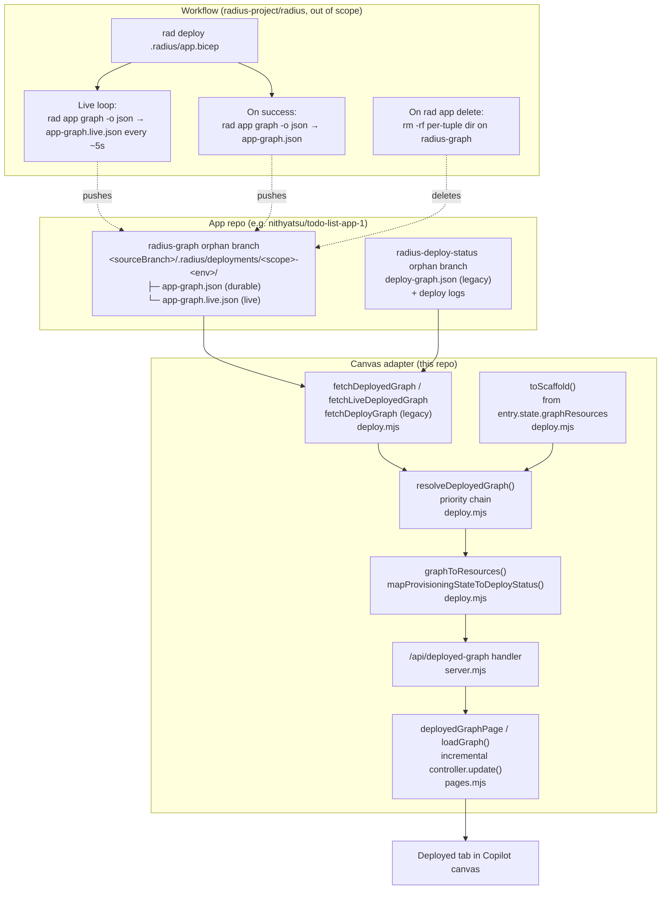

# Deployed-graph live progression

- **Author**: @nithyatsu
- **Date**: 2026-07

## Overview

The canvas has three graph tabs — **Modeled**, **Planned**, and **Deployed**.
The Deployed tab used to be a single terminal snapshot: nothing rendered until
the deploy workflow force-pushed a final `deploy-graph.json` file, and even
then every re-poll re-mounted the React graph root, causing a full-canvas
flash. It also did not show per-resource deploy status; the user could not
tell from the graph whether a specific resource had succeeded, failed, or was
still provisioning.

This design turns the Deployed tab into a **live progression view**:

1. Before any deploy has produced a graph the tab shows the modeled graph as a
   greyed scaffold (all nodes pending) so the user immediately sees the app
   topology.
2. While `rad deploy` is running, the deploy workflow publishes a fresh
   `rad app graph -o json` snapshot on a ~5 s loop. The canvas reads that
   snapshot and re-renders **incrementally** — only the changed nodes' status
   badges and colors animate. Each node's badge is driven by the ARM-style
   `provisioningState` field on the resource.
3. On success the workflow writes a durable final snapshot; readers prefer
   the durable file and stop polling.
4. Live and durable snapshots share **one storage family** on a single orphan
   branch (`radius-graph`), keyed by `(sourceBranch, scope, environment)`, so
   the reader and writer contract is one directory and two filenames.

The reader-side change is complete in this branch. The workflow-side writer
lives in `radius-project/radius/.github/extension/*.yml` and is out of scope
for this repo.

## Terms and definitions

- **Modeled graph** — the graph derived directly from `.radius/app.bicep`
  (what the user wrote). Feeds the Modeled tab and the Deployed tab's
  scaffold fallback.
- **Planned graph** — the modeled graph after recipe-pack resolution
  (each Radius resource type is bound to its concrete Azure / Kubernetes
  resource). Feeds the Planned tab.
- **Deployed graph** — the graph `rad app graph -a "$APP" -o json` returns
  against a live control plane, i.e. the concrete state after `rad deploy`
  reconciles the app. Feeds the Deployed tab.
- **Durable snapshot** — the terminal deployed graph, force-published on
  success. Lives at `app-graph.json`.
- **Live snapshot** — the in-progress deployed graph, overwritten on a
  ~5 s loop while `rad deploy` runs. Lives at `app-graph.live.json`
  next to the durable file.
- **Scaffold** — the modeled resources array, deep-cloned and stamped
  with `deployStatus: 'pending'` so the Deployed tab always shows some
  topology (all grey) before a real deployed graph exists.
- **Priority chain** — the ordered sequence of graph sources the canvas
  reader walks: `durable → live → legacy → session cache → scaffold → none`.
- **deployStatus** — the four-value badge vocabulary the canvas uses on
  node cards: `pending`, `in_progress`, `success`, `failed`.

## Objectives

> **Issue Reference:** N/A — internal branch (`nithya/deployed-graph-live-progression`).

### Goals

- Deployed tab shows the app topology **immediately** — even before any
  deploy has ever run — as a greyed scaffold from Modeled.
- Per-node status badges (⏳ / ✓ / ✗) reflect the concrete
  `provisioningState` `rad app graph -o json` reports, so users can see
  which specific resources are in-flight, done, or failed.
- Updates are **incremental**: the graph doesn't flash on every poll; only
  the changed nodes' status glyph and card color animate.
- Polling **stops** the moment the deploy is done or the durable snapshot
  is published. No forever-tick on scaffold / legacy / session tiers.
- Storage is scoped per `(sourceBranch, scope, environment)` so multi-app,
  multi-env, and feature-branch deploys don't collide.
- Live and durable snapshots use **one** address family (one branch, one
  directory, differing only in filename) so `rad app delete` wipes both
  atomically and readers use one key.

### Non-goals

- **Writer side.** The deploy workflow that produces `app-graph.json` /
  `app-graph.live.json` lives in `radius-project/radius/.github/extension/`
  and is not part of this repo's PR. This branch ships the reader, storage
  contract, and UX only.
- **Session-state persistence across extension restarts.** When Copilot
  reloads the extension mid-deploy, `entry.state.deployingResources` is
  lost. The canvas gracefully falls back to the scaffold; a stale scaffold
  in that case is not a regression we chose to work around by stamping
  fabricated per-node status (see "Alternatives considered").
- **Cross-scope deploys.** Every deploy today targets
  `DEFAULT_RADIUS_SCOPE = "default"`. The path helper already threads
  `scope` through, so a future per-app scope requires no address
  change — only a plumbing change on the deploy workflow.
- **Fixing the pre-recipe-pack `image` / `registryUsername` /
  `registryPassword` workflow-injection bug** — separate follow-up.

### User scenarios

#### User story 1 — Start-of-day monitoring

1. User opens the canvas Deployed tab for `todo-list-app-1` on env `aks-dev`.
2. No deploy has run yet.
3. User immediately sees the greyed modeled topology (todo-list-app-1,
   mysql), all with ⏳ hourglass badges. No blocking spinner or
   "Loading…" banner.

#### User story 2 — Watch a deploy fill in

1. User triggers a deploy from a peer tab.
2. As the workflow provisions each Azure resource, `rad app graph` reports
   each `provisioningState` transition (`Provisioning → Succeeded` or
   `Failed`).
3. On each poll, only the changed nodes' badges + card tints animate; the
   graph does not re-mount and re-fit.
4. When the workflow reports `complete`, polling stops immediately.

#### User story 3 — Delete a deployment

1. User clicks "Delete Deployment".
2. `rad app delete` fires and, in the workflow follow-up, wipes the
   per-tuple directory on `radius-graph`. Both `app-graph.json` and
   `app-graph.live.json` disappear together — one delete, one atomic gone.
3. Deployed tab falls back to the scaffold.

## User experience

Node card, greyed pending scaffold state:

```text
┌──────────────────────────┐
│ 🧊  todo-list-app-1   ⏳ │  ← grey card, hourglass badge (pending)
│     Compute/containers   │
└──────────────────────────┘
```

Node card, mid-deploy in progress:

```text
┌──────────────────────────┐
│ 🧊  todo-list-app-1   ⏳ │  ← yellow badge (in_progress)
│     Compute/containers   │
└──────────────────────────┘
```

Node card, success:

```text
┌──────────────────────────┐
│ 🧊  todo-list-app-1   ✅ │  ← green check (success)
│     Compute/containers   │
└──────────────────────────┘
```

Node card, failed:

```text
┌──────────────────────────┐
│ 🧊  todo-list-app-1   ❌ │  ← red X (failed), pink card
│     Compute/containers   │
└──────────────────────────┘
```

The Deployed tab no longer shows a "Loading deployed application graph…"
banner on every re-poll. The graph animates in place; the banner is only
shown once, on the very first mount.

## Design

### High-level design

- Storage is a single addressing family on the `radius-graph` orphan branch,
  keyed by `(sourceBranch, scope, environment)`. One directory per
  deployment holds both live and durable snapshots.
- The canvas exposes `/api/deployed-graph` on the loopback HTTP host. It
  walks a **priority chain** through injected fetchers, returning both
  `resources` and a `source` tier tag.
- The Deployed tab in `pages.mjs` uses the tier tag to decide whether to
  keep polling. The graph is rendered via a cached React controller so
  subsequent polls call `graphController.update(resources)` — incremental,
  not a re-mount.
- `graphToResources()` is the single choke point every graph source flows
  through. It normalizes flat-vs-`{resources:[…]}` shapes and stamps
  each node's `deployStatus` from its `provisioningState` /
  `provisioningStatus` field — unless the log-parser in `/api/deploy`
  already stamped an explicit `deployStatus` (which wins).

### Architecture diagram



### Detailed design

#### Option 1 — Split branches for live and durable

Live snapshot at `radius-deploy-status:deploy-graph-live.json` (flat, next to
existing log files); durable at `radius-graph:<branch>/.radius/deployments/<scope>-<env>/app-graph.json`.

##### Advantages

- Live signal groups naturally with the other "streaming deploy signal"
  files (`deploy-progress.log`, `deploy-status.txt`) on
  `radius-deploy-status`.
- Zero cost to migrate legacy readers of `radius-deploy-status`.

##### Disadvantages

- The flat top-level path can't distinguish multi-app or multi-env deploys
  in the same repo.
- Two branches, two path shapes: reader, writer, and human debugging all
  have more to remember.
- `rad app delete` has to clean up two different places to fully wipe.

#### Option 2 — Unified `radius-graph` layout (chosen)

Both live and durable snapshots on `radius-graph`, in the same per-tuple
directory:

```text
<sourceBranch>/.radius/deployments/<scope>-<env>/
├── app-graph.json         (durable, terminal)
└── app-graph.live.json    (live, overwritten every ~5s)
```

##### Advantages

- Scoped by `(sourceBranch, scope, environment)`: no multi-app or multi-env
  collisions.
- One branch, one path family. The reader API is symmetric —
  `fetchDeployedGraph(repo, key)` and `fetchLiveDeployedGraph(repo, key)`
  take the same key.
- `rad app delete` removes the directory once and both files vanish
  atomically.
- On success the terminal write can either overwrite `app-graph.json` in
  place or rename `.live.json → .json` — either is a single-directory op.

##### Disadvantages

- Existing repos deployed under the old flat layout keep working only
  because the legacy fetcher (`radius-deploy-status:deploy-graph.json`)
  stays. If we ever drop that fallback, those repos need a redeploy
  before their Deployed tab shows anything durable again.

#### Proposed option

**Option 2**, the unified `radius-graph` layout. It is what
`liveDeployedGraphPath()` and the refactored `fetchLiveDeployedGraph()`
implement in commit `9e4d3b3`. Legacy fallback stays in place until it can
be safely removed in a later PR.

### API design

#### Storage contract (`radius-core`)

New export from `radius-core/src/graph/deployed-graph-path.ts`:

```ts
liveDeployedGraphPath({ sourceBranch, scope, environment }): string
// returns "<sourceBranch>/.radius/deployments/<scope>-<env>/app-graph.live.json"
```

Unchanged export:

```ts
deployedGraphPath({ sourceBranch, scope, environment }): string
// returns "<sourceBranch>/.radius/deployments/<scope>-<env>/app-graph.json"
```

Removed: the `LIVE_GRAPH_FILE = "deploy-graph-live.json"` constant. The live
file now has a keyed path just like its durable sibling.

Constants that remain:
`RADIUS_GRAPH_BRANCH`, `RADIUS_DEPLOY_STATUS_BRANCH`,
`LEGACY_DEPLOY_GRAPH_FILE`, `DEFAULT_RADIUS_SCOPE`.

#### HTTP surface (`/api/deployed-graph`)

Query params:

- `repo` — `<owner>/<name>`.
- `application` — application name (used only to select an entry from the
  session).
- `environment` — GitHub environment name. Required for durable / live
  tiers.
- `branch` — source branch. Falls back to the session's `deployingBranch`,
  `graphBranch`, or `main`.

Response:

```json
{
  "resources": [ /* per-node objects with deployStatus */ ],
  "repo": "<owner>/<name>",
  "branch": "<sourceBranch>",
  "source": "durable | live | legacy | scaffold | none"
}
```

`source` tells the client which tier answered and drives polling policy:
`durable` is terminal; the others warrant more polling **only while a
deploy is in progress**.

#### `provisioningState → deployStatus` mapping

Applied inside `graphToResources()` so every deployed-graph tier (durable,
live, legacy, session cache) passes through the same choke point.

| provisioningState (case-insensitive)                                            | deployStatus  |
| ------------------------------------------------------------------------------- | ------------- |
| `Succeeded` / `Success` / `Ok`                                                  | `success`     |
| `Failed` / `Canceled` / `Cancelled`                                             | `failed`      |
| `Accepted` / `Creating` / `Updating` / `Provisioning` / `Running` / `Deleting`  | `in_progress` |
| everything else (including `NotSpecified`, empty)                               | `pending`     |

An explicit `deployStatus` already set by the log-driven `/api/deploy` path
is preserved — log-based updates win over lagging provisioningState from a
live snapshot.

### Implementation details

#### `radius-core`

- `radius-core/src/graph/deployed-graph-path.ts`
  - Adds `liveDeployedGraphPath()`; refactors the shared per-tuple
    directory into a private `deploymentDir()` helper.
  - Removes `LIVE_GRAPH_FILE` (the old flat `deploy-graph-live.json`
    constant).
  - Updates the module doc to describe the unified layout.
- `radius-core/src/graph/index.ts` + `radius-core/src/index.ts`
  - Add `liveDeployedGraphPath` to the barrel; drop `LIVE_GRAPH_FILE`.
- `radius-core/src/graph/deployed-graph-path_test.ts`
  - Adds a describe block for `liveDeployedGraphPath` (same directory as
    the durable file, same slugging rules, same invalid-input rejections).

#### Canvas adapter — `adapters/canvas`

- `adapters/canvas/src/deploy.mjs`
  - New reader `fetchDeployedGraph(repo, key)` hits
    `radius-graph:<durablePath>`.
  - New reader `fetchLiveDeployedGraph(repo, key)` now takes the same key
    and hits `radius-graph:<livePath>`.
  - Retains `fetchDeployGraph(repo)` reading
    `radius-deploy-status:deploy-graph.json` as the backward-compat
    fallback.
  - New pure exported `mapProvisioningStateToDeployStatus(state)`
    (case-insensitive, tolerant of provider spellings).
  - `graphToResources(graph)` stamps each resource + `outputResources` with
    `deployStatus` from `provisioningState` / `provisioningStatus` unless
    already set.
  - `toScaffold(resources)` deep-clones the modeled array and stamps every
    node `deployStatus: 'pending'`.
  - New pure exported `resolveDeployedGraph({ key, fetchers,
    sessionDeployedGraph, scaffoldResources })` walks the priority chain
    and returns `{ resources, source }`. Every fetcher is injected so the
    resolver is safe to unit-test with no network.
- `adapters/canvas/src/server.mjs`
  - `/api/deployed-graph` wires `resolveDeployedGraph` with concrete
    fetchers; passes the same `key` to `fetchDurable` and `fetchLive`.
  - `/api/list-deployments` includes `sourceRef` (source branch) per row
    so the Deployed tab knows which branch each deployment came from.
  - Post-processing (`rewireDeployedGraphChain`, `normalizeDeployedGraph`,
    `filterGraphVisualizationResources`) is applied uniformly to every
    tier.
- `adapters/canvas/src/pages.mjs`
  - `deployedGraphPage`:
    - Reads `wantBranch` from URL (`?branch=…`).
    - Caches a `graphController`. First render mounts; every subsequent
      render calls `graphController.update(resources)` — no re-mount, no
      re-fit, no flash.
    - Polling policy driven by `st` from `/api/deploy-status`:
      - `in_progress` → poll every 3 s (live path) or 5 s (chain path).
      - `complete` or `failed` → render once, stop.
      - No active deploy → render whatever the chain returned (usually
        scaffold or a durable snapshot) and stop.
      - `source === 'durable'` → always terminal, stop regardless of `st`.
    - `showNothing()` clears the cached controller so the next mount
      binds a fresh React root.
    - The initial "Loading deployed application graph…" banner is hidden
      by default; it is not re-shown on subsequent polls.
  - `deployLandingView`:
    - Monitor Graph link appends `&branch=<sourceRef>` when the row
      exposes one.
- `adapters/canvas/src/client.mjs`
  - `RADIUS_DEPLOY_STATUS_BADGE` map (pending → grey ⏳, in_progress →
    yellow ⏳, success → green ✓, failed → red ✗).
  - `RADIUS_DEPLOY_STATUS_GLYPH_PATHS` — inline SVG path constants.
  - `RadNode` renders `statusBadge` via `h('span', …, h('svg', …,
    h('path', { d: glyphPath })))` — no `dangerouslySetInnerHTML`
    (guarded by an existing test).

#### Shared adapter — `adapters/shared`

N/A. No changes.

#### Plugin — `plugins/radius`

N/A. The canvas extension bundle is rebuilt but no skill / plugin.json
change.

#### Build & packaging

- Bundle: `pnpm build:install` rebuilds `plugins/radius/extension.mjs`
  (674 KB → 675 KB). Copilot picks it up on restart.
- Changesets:
  - `.changeset/deployed-graph-path-helper.md` (core, patch) — commit
    `d5599db`.
  - `.changeset/deployed-graph-readers.md` (canvas, patch) — commit
    `e4e16c3`.
  - `.changeset/deployed-graph-priority-chain.md` (canvas, patch) —
    commit `9491838`.
  - `.changeset/deployed-tab-incremental-render.md` (canvas, patch) —
    commits `af0db2c`, `cbf7ad6`.
  - `.changeset/deployed-graph-unified-layout.md` (core minor, canvas
    patch) — commit `9e4d3b3`.

### Error handling

- **Every fetcher tolerates 404** and returns `null`, letting the resolver
  chain fall through to the next tier. A repo that has never deployed
  falls all the way through to `scaffold`; a repo without a modeled graph
  yet falls through to `none` and the client shows "Nothing deployed yet".
- **Malformed JSON** returns `null` from the fetcher (same effect as 404).
- **`/api/deployed-graph` resolver throws** are caught and logged; the
  handler responds with `{ resources: [], source: 'none' }` so a
  transient GitHub error can never break the Deployed tab.
- **Missing environment**: durable and live tiers need the full
  `(branch, scope, env)` key, so their fetchers are wired to `null` if
  environment is empty; legacy / session / scaffold still run.
- **Session state lost** (Copilot restart mid-deploy): the tab falls back
  to the scaffold from `entry.state.graphResources`. Badges are `pending`
  for all nodes. Not a regression — see "Alternatives considered".

## Test plan

Unit tests (Vitest):

- `radius-core/src/graph/deployed-graph-path_test.ts` — durable path,
  live path, source-branch normalization, slugging, invalid input.
- `adapters/canvas/src/deploy_test.mjs` — every fetcher's URL shape,
  JSON-parse null branches, `resolveDeployedGraph` priority chain,
  `mapProvisioningStateToDeployStatus` table (13 spellings),
  `graphToResources` stamping (top-level + `outputResources`), preservation
  of an explicit `deployStatus`.
- `adapters/canvas/src/client_test.mjs` — status glyphs render via
  `h('svg', …)` (no `dangerouslySetInnerHTML`).

Test totals on this branch:

- `radius-core`: 223 tests pass (up from 220).
- `adapters/canvas`: 227 tests pass (up from 210).

Manual verification (recorded in chat):

1. Fresh Deployed tab on a repo with no `radius-graph` branch → renders
   greyed scaffold. No banner, no endless polling.
2. Deploy in-flight → live path renders `deployingResources` from
   `/api/deploy-status`; badges reflect log-parser statuses; polling stops
   at `st === 'complete'`.
3. `pnpm build:install` produces a valid bundle;
   `pnpm -r test` and `pnpm -r typecheck` both green.

## Security

- The reader talks only to the app repo through the existing gh CLI —
  same auth surface as every other canvas fetch. No new secrets.
- **Path-injection guard.** `normalizeSourceBranch` in `deployed-graph-path.ts`
  forbids `..`, empty segments, backslashes, and leading/trailing `/`;
  `slugSegment` restricts scope + env to `[a-z0-9-]+`. A malicious repo
  metadata value can't smuggle a path outside the per-tuple directory.
- **Failure isolation.** Fetcher and resolver exceptions are caught and
  logged in the `/api/deployed-graph` handler; no error path leaks
  provider-side details to the canvas client.

## Compatibility

- **Backward-compatible for existing users.** Repos deployed under the
  pre-migration flat layout on `radius-deploy-status` (`deploy-graph.json`)
  keep working via the legacy fetcher tier.
- **Breaking for the writer.** Any consumer that used to write
  `deploy-graph-live.json` on `radius-deploy-status` must migrate to the
  keyed path on `radius-graph`. The workflow is the only known writer and
  hasn't shipped this yet — nothing to migrate today.
- **Public API change in `@radius-project/core`.** Removes the
  `LIVE_GRAPH_FILE` export and adds `liveDeployedGraphPath`. Signalled
  as a minor bump in the `.changeset/deployed-graph-unified-layout.md`
  changeset.
- **`fetchLiveDeployedGraph` signature change.** Now takes
  `(repo, key)` rather than `(repo)`. Only in-repo caller
  (`server.mjs`) is updated in the same commit.

## Monitoring and logging

- The `/api/deployed-graph` response's `source` tier tag is the primary
  observability signal — a support diff of "what does your Deployed tab
  say for `source`?" tells you exactly which tier answered.
- Fetcher and resolver errors log via `console.error` on the extension
  process. Nothing new is added to the log-stream API surface.
- The workflow-side loop can `printf` its `PUT` cadence for parity, but
  that lives in `radius-project/radius`.

## Development plan

The reader-side work is done; commit ladder as landed on
`nithya/deployed-graph-live-progression`:

1. `d5599db` — `core: add deployedGraphPath helper for radius-graph
   artifacts`.
2. `e4e16c3` — `canvas: add fetchDeployedGraph +
   fetchLiveDeployedGraph readers`.
3. `9491838` — `canvas: wire /api/deployed-graph to the durable →
   scaffold priority chain`.
4. `07dfa57` — `canvas: /api/list-deployments returns sourceRef per row`.
5. `a26c6da` — `canvas: Deployed tab polls until source is durable`.
6. `cbf7ad6` — `canvas: Monitor Graph link surfaces sourceRef as
   branch=`.
7. `af0db2c` — `canvas: Deployed tab renders incrementally on each poll`.
8. `cafe44b` — `canvas: node cards show a deploy-status badge`.
9. `7b2388b` — `canvas: map provisioningState to deployStatus + stop
   polling when deploy done`.
10. `9e4d3b3` — `core+canvas: co-locate live and durable deployed-graph
    on radius-graph`.

Follow-ups (**not** in this branch):

- **Writer PR** on `radius-project/radius@main` to
  `.github/extension/run-rad-commands-*.yml`:
  - Background loop while `rad deploy` runs:
    `rad app graph -a "$APP" -o json` → base64 →
    `PUT radius-graph:<sourceBranch>/.radius/deployments/default-<env>/app-graph.live.json`
    every ~5 s.
  - On success: same command → `PUT
    radius-graph:<sourceBranch>/.radius/deployments/default-<env>/app-graph.json`.
  - On `rad app delete`: remove the per-tuple directory.
- **Workflow parameter-filtering fix** in
  `radius-project/radius/.github/extension/actions/run-rad-commands/action.yml`
  so `image` / `registryUsername` / `registryPassword` are only appended
  to `rad deploy` when the app's `.radius/app.bicep` actually declares
  them.

## Open questions

- **Live-file cleanup on success**: does the writer overwrite
  `app-graph.json` in place and delete `app-graph.live.json`, or leave the
  live file (readers prefer durable anyway)? Leaning "delete live" for
  tidiness — one-directory-listing == one-current-graph.
- **Live-file cleanup on failure**: when `rad deploy` fails, do we leave
  the last `app-graph.live.json` as a permanent forensic snapshot until
  the next deploy, or delete it? Leaning "leave it" so the user can see
  which resources were mid-flight at failure.
- **Scope value**: `DEFAULT_RADIUS_SCOPE = "default"` matches
  `rad deploy`'s default resource group today. If a future deploy targets
  a non-default group, the workflow needs to thread that through as the
  `scope` segment. Path helper is already ready.
- **When to drop the legacy fallback**: the `deploy-graph.json` reader on
  `radius-deploy-status` is dead code for anyone deploying under the new
  workflow. Safe to remove one release after the workflow-side follow-up
  merges and users have redeployed at least once.

## Alternatives considered

- **Stamp scaffold with `entry.state.deployStatus`** so a scaffold shown
  after an in-session deploy finishes displays green ✓ or red ✗ badges.
  **Rejected**: stamps every node with the same aggregate signal, not
  per-node truth. It would show ✓ on a resource even if only some resources
  succeeded — a lie. Better to keep the scaffold honest (grey) and rely on
  the durable file for real per-node status. Prototyped in an earlier
  edit of `toScaffold`, then reverted in commit `9e4d3b3`'s parent.
- **Persist `entry.state.deployingResources` to disk** so per-node status
  survives a Copilot restart. **Deferred**: real solution is the
  workflow-side durable write. Adding disk state now means one more
  invalidation surface and only helps until the durable file exists.
- **Use GHCR for the live snapshot too** (same storage as
  `radius-state`). **Rejected**: GHCR pulls are heavier (Docker credential
  store setup, blob download) than a `PUT`/`GET` on a Git ref, and the
  live file needs a `~5s` write cadence — Git tolerates that well;
  GHCR would create a hundred blobs per deploy.
- **Poll `rad app graph` directly from the canvas machine** rather than
  going through the workflow-published file. **Rejected**: requires the
  user's machine to have `rad` on PATH and network access to the target
  control plane. The workflow already has both, and Repo Radius is the
  designated per-repo automation surface.

## Design review notes

_To be filled in on the PR._
