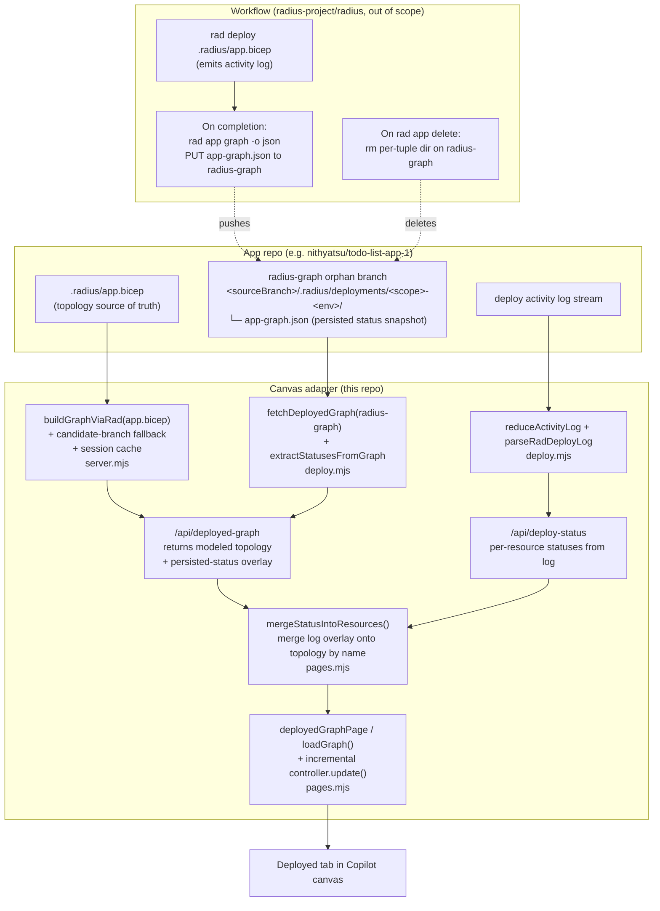

# Deployed-graph live progression

- **Author**: @nithyatsu
- **Date**: 2026-07

## Overview

The canvas has three graph tabs — **Modeled**, **Planned**, and **Deployed**.
The Deployed tab used to be a single terminal snapshot: nothing rendered until
the deploy workflow force-pushed a final `deploy-graph.json` file, and even
then every re-poll re-mounted the React graph root, causing a full-canvas
flash. It also did not show per-resource deploy status; the user could not
tell from the graph whether a specific resource had succeeded, failed, or was
still provisioning.

This design turns the Deployed tab into a **live progression view**:

1. **The topology is always the modeled graph.** The Deployed tab renders the
   same set of top-level resource nodes the Modeled tab shows, built from the
   branch's `.radius/app.bicep` via `buildGraphViaRad`. There is never a
   moment where the tab shows nothing — the modeled scaffold is the base, all
   nodes start with a grey ⏳ pending badge.
2. **Status glyphs are overlaid** on that fixed topology. The node set never
   changes; only the per-node badge does (grey ⏳ → yellow ⏳ → green ✓ /
   red ✗). Two overlay sources feed into the same badges:
   - **In-session activity log.** While `rad deploy` is running, the
     extension parses its activity-log stream on each poll and stamps a
     per-resource `deployStatus`. Fast path during a deploy.
   - **Persisted terminal snapshot.** On deploy completion the workflow
     force-publishes `rad app graph -o json` to the orphan `radius-graph`
     branch. The extension parses that snapshot's per-resource
     `provisioningState` values and overlays them on the modeled topology.
     Covers out-of-session deploys, Copilot restarts, and someone else's
     deploy.
3. **The renderer updates incrementally.** Each poll calls
   `graphController.update(resources)`, which mounts once and animates only
   the changed badges. No re-mount, no flash.
4. **The persisted snapshot is addressed at**
   `<sourceBranch>/.radius/deployments/<scope>-<environment>/app-graph.json`
   on the `radius-graph` orphan branch, keyed by
   `(sourceBranch, scope, environment)` so multi-app / multi-env /
   feature-branch deploys don't collide.

The reader-side change is complete in this branch. The workflow-side terminal
writer lives in `radius-project/radius/.github/extension/*.yml` and is out of
scope for this repo.

## Terms and definitions

- **Modeled graph** — the graph derived directly from `.radius/app.bicep`
  (what the user wrote). Feeds the Modeled tab and the Deployed tab's base
  topology.
- **Planned graph** — the modeled graph after recipe-pack resolution (each
  Radius resource type is bound to its concrete Azure / Kubernetes resource).
  Feeds the Planned tab.
- **Persisted terminal snapshot** — the `rad app graph -o json` output the
  workflow force-publishes on deploy completion. Lives at `app-graph.json`
  on the `radius-graph` orphan branch. Used only as a source of per-resource
  status, not as topology.
- **Scaffold** — the modeled resources array, deep-cloned and stamped with
  `deployStatus: 'pending'` so the Deployed tab always shows the app
  topology (all grey) before any deploy has run.
- **Activity log** — the stream of per-resource lifecycle events emitted by
  `rad deploy` (e.g. `Creating`, `Succeeded`, `Failed`). Parsed by the
  extension to derive a per-resource `deployStatus` mid-deploy.
- **Status overlay** — the merge step in the client that takes the modeled
  topology and stamps a `deployStatus` on each node from an overlay source
  (activity log or persisted snapshot). Matches by top-level resource name.
- **deployStatus** — the four-value badge vocabulary the canvas uses on node
  cards: `pending`, `in_progress`, `success`, `failed`.

## Objectives

> **Issue Reference:** N/A — internal branch
> (`nithya/deployed-graph-clean`).

### Goals

- Deployed tab shows the app topology **immediately** — even before any
  deploy has ever run — as a greyed scaffold from the modeled graph.
- Per-node status badges (⏳ / ✓ / ✗) reflect either the in-session activity
  log or the workflow-published terminal snapshot, whichever is available.
- Updates are **incremental**: the graph doesn't flash on every poll; only
  the changed nodes' status glyph and card color animate.
- Storage for the persisted terminal snapshot is scoped per
  `(sourceBranch, scope, environment)` so multi-app, multi-env, and
  feature-branch deploys don't collide.
- Polling **stops** the moment the deploy is done. No forever-tick.

### Non-goals

- **Mid-deploy graph publishing.** The workflow does not publish
  `rad app graph -o json` snapshots on a loop. Mid-deploy status comes from
  the activity-log parser only.
- **Workflow terminal-write side.** The deploy workflow that publishes the
  `app-graph.json` on completion lives in
  `radius-project/radius/.github/extension/` and is not part of this repo's
  PR. The extension is ready to read it once it lands.
- **Session-state persistence across extension restarts.** When Copilot
  reloads the extension mid-deploy, `entry.state.deployingResources` is
  lost. The Deployed tab still shows the modeled scaffold (all pending
  badges); once the workflow-side publisher ships, the durable snapshot
  covers this case.
- **Cross-scope deploys.** Every deploy today targets
  `DEFAULT_RADIUS_SCOPE = "default"`. The path helper already threads
  `scope` through, so a future per-app scope requires no address change —
  only a plumbing change on the deploy workflow.

### User scenarios

#### User story 1 — Start-of-day monitoring

1. User opens the canvas Deployed tab for `todo-list-app-1` on env
   `aks-dev`. No deploy has ever run.
2. User immediately sees the greyed modeled topology (todo-list-app-1,
   mysql), all with ⏳ hourglass badges. No blocking spinner or
   "Loading…" banner, no "Nothing deployed yet" state.

#### User story 2 — Watch a deploy fill in

1. User triggers a deploy from a peer tab.
2. As `rad deploy` provisions each resource, its activity log stream
   (already fetched by the extension for the log panel) reports each
   transition — `Creating → Succeeded` or `Failed` — per resource name.
3. The extension's log parser maps those events to per-resource
   `deployStatus` and the client overlays them on the modeled topology.
4. On each poll, only the changed nodes' badges + card tints animate;
   the graph does not re-mount and re-fit.
5. When the workflow reports `complete`, polling stops.

#### User story 3 — View a deployment made in another session

1. User opens the Deployed tab in a fresh Copilot session for a
   deployment someone else already ran.
2. There is no in-session activity log, but the workflow published the
   terminal `app-graph.json` to `radius-graph`.
3. The extension fetches that snapshot, extracts the per-resource
   `provisioningState` values, and overlays them onto the modeled
   topology.
4. User sees ✓ / ✗ badges reflecting the last deploy's final outcome.

#### User story 4 — Delete a deployment

1. User clicks "Delete Deployment".
2. `rad app delete` fires and, in the workflow follow-up, deletes the
   per-tuple directory on `radius-graph` so the persisted `app-graph.json`
   disappears.
3. Deployed tab falls back to the modeled scaffold with all pending
   badges.

## User experience

Node card, greyed pending scaffold state:

```text
┌──────────────────────────┐
│ 🧊  todo-list-app-1   ⏳ │  ← grey card, hourglass badge (pending)
│     Compute/containers   │
└──────────────────────────┘
```

Node card, mid-deploy in progress:

```text
┌──────────────────────────┐
│ 🧊  todo-list-app-1   ⏳ │  ← yellow badge (in_progress)
│     Compute/containers   │
└──────────────────────────┘
```

Node card, success:

```text
┌──────────────────────────┐
│ 🧊  todo-list-app-1   ✅ │  ← green check (success)
│     Compute/containers   │
└──────────────────────────┘
```

Node card, failed:

```text
┌──────────────────────────┐
│ 🧊  todo-list-app-1   ❌ │  ← red X (failed), pink card
│     Compute/containers   │
└──────────────────────────┘
```

The Deployed tab does not show a "Loading deployed application graph…"
banner on re-polls. The graph animates in place; a small banner may show
once on the very first mount only.

## Design

### High-level design

- **Topology comes from the modeled graph, always.** The Deployed tab's
  base topology is `buildGraphViaRad(app.bicep)` — the same helper the
  Modeled tab uses. The Deployed tab never swaps topology sources
  mid-flight; the node set is fixed for a given branch's `app.bicep`.
- **Status comes from an overlay layer** on top of that fixed topology.
  Two overlay sources feed the same per-node `deployStatus`:
  - The activity-log parser output (`reduceActivityLog` /
    `parseRadDeployLog` in `deploy.mjs`), served by `/api/deploy-status`.
    Fast path during an in-session deploy.
  - The persisted `app-graph.json` on `radius-graph`, fetched by
    `fetchDeployedGraph` in `deploy.mjs`. Carries per-resource
    `provisioningState` values from the workflow's terminal
    `rad app graph -o json` snapshot; `mapProvisioningStateToDeployStatus`
    projects them to the same four-state vocabulary the log parser emits.
    Fallback when there is no session activity log.
- **The client merges the overlay onto the topology by resource name.**
  `mergeStatusIntoResources` in `pages.mjs` walks the modeled topology,
  finds each node's status in the overlay by matching `name`, and produces
  a shallow-cloned array with `deployStatus` populated. Nodes present in
  the topology but missing from the overlay stay grey pending.
- **The Deployed tab always shows the graph.** As long as the branch's
  `app.bicep` resolves (either directly or via the candidate-branch
  fallback in the scaffold builder), the tab renders it. There is no
  "Nothing deployed yet" state for a repo that has a modeled graph.
- **Rendering is incremental.** The graph is rendered via a cached React
  controller so subsequent polls call `graphController.update(resources)`
  — no re-mount, no re-fit, no flash.
- **Polling stops when the deploy is done.** `st === 'in_progress'` →
  poll every 3s. `complete` / `failed` / no active deploy → stop.

### Architecture diagram



### Detailed design

Two axes of decision:

- **Where does mid-deploy per-resource status come from?** (Options 1 vs 2)
- **How does the tab render "no data yet" state?** (Options 3 vs 4)

#### Option 1 — Mid-deploy status from a workflow-published live graph

Have the deploy workflow run `rad app graph -o json` on a ~5 s loop and
publish each snapshot to an `app-graph.live.json` sibling on `radius-graph`.
The canvas reads that file and stamps each node's `deployStatus` from its
ARM-style `provisioningState`.

##### Advantages

- Status is derived from Radius' own view of each resource, not from
  string-matching activity-log lines.
- Works even for out-of-session deploys mid-flight.

##### Disadvantages

- Requires a workflow-side loop that force-pushes to Git every ~5 s. Even
  at 100 KB per snapshot that's meaningful history churn.
- Ordering / race with the terminal write — the last live snapshot before
  success may lag the terminal one.
- Depends on a workflow-side ship that hasn't happened yet.

#### Option 2 — Mid-deploy status from the deploy activity log (chosen)

The extension already fetches the `rad deploy` activity log stream for the
log panel. `reduceActivityLog` / `parseRadDeployLog` in `deploy.mjs` already
parse it into a per-resource `deployStatus`. Wire that same parsed status
into the Deployed tab's node badges by merging it onto the modeled
topology in the client.

##### Advantages

- Zero new workflow-side machinery for mid-deploy status. The log stream
  and the parser already exist.
- No Git churn during a deploy.
- One code path for the log panel and the graph badges.

##### Disadvantages

- Status comes from string-matching activity-log lines, not from ARM
  ground truth. If Radius changes activity phrasing, the parser needs
  updates.
- Only works while the deploy runs in the extension's session (out-of-
  session deploys don't see mid-deploy badges — but they see the terminal
  snapshot after completion via the persisted `app-graph.json`).

#### Option 3 — Priority chain with a "none" tier (previous design)

The Deployed tab walks a chain (durable → session → scaffold → none) and
shows "Nothing deployed yet" when nothing has data. The scaffold tier only
fires when the modeled graph is already cached in-session.

##### Advantages

- Simple boolean logic per tier.

##### Disadvantages

- Users landing on the Deployed tab first (no Modeled tab cache) see
  "Nothing deployed yet" — a false empty state, because the app.bicep is
  right there. Every fresh session has this bug.
- Complicates the mental model: "which tier answered?" instead of "here's
  the topology, here's the status".

#### Option 4 — Always render modeled topology, overlay status (chosen)

The base is always the modeled graph, resolved on demand from
`.radius/app.bicep` via a candidate-branch fallback (branch → workspace
branch → deploying branch → planned branch → graph branch → `main`). The
first branch that has an `app.bicep` wins. Status is a separate overlay
layer that may or may not be present.

##### Advantages

- Deployed tab always shows the graph — no false empty state.
- Clean separation: topology from `app.bicep`, status from
  activity-log or persisted snapshot. Each source is independently
  testable.
- The candidate-branch fallback covers users on feature-branch worktrees
  who haven't pushed to `main` yet.

##### Disadvantages

- Requires calling `buildGraphViaRad` in the `/api/deployed-graph` handler
  when the cache misses (first Deployed-tab open). Costs one rad
  subprocess. Cached in `entry.state.graphResources` for subsequent polls.

#### Proposed options

- **Option 2** for mid-deploy status: log-based, zero workflow changes.
- **Option 4** for topology: always render the modeled scaffold; overlay
  status separately.

### API design

#### Storage contract (`radius-core`)

Single exported helper from
`radius-core/src/graph/deployed-graph-path.ts`:

```ts
deployedGraphPath({ sourceBranch, scope, environment }): string
// returns "<sourceBranch>/.radius/deployments/<scope>-<env>/app-graph.json"
```

Branch and scope segments are normalized:

- `sourceBranch` preserves internal `/` separators but rejects `..`,
  empty segments, backslashes, and leading/trailing `/`.
- `scope` and `environment` are slugged to `[a-z0-9-]+` so a caller can't
  smuggle path separators through them.

Constants: `RADIUS_GRAPH_BRANCH`, `DEFAULT_RADIUS_SCOPE`.

#### HTTP surface

**`/api/deployed-graph`** — base topology, optionally with the persisted
per-resource status overlaid.

Query params:

- `repo` — `<owner>/<name>`.
- `application` — application name (used only to select an entry from
  the session).
- `environment` — GitHub environment name. Required to fetch the
  persisted snapshot; without it, the tab still renders the scaffold.
- `branch` — source branch. Falls back to the session's
  `deployingBranch`, `workspaceBranch`, `graphBranch`, or `main`.

Response:

```json
{
  "resources": [ /* modeled top-level nodes with deployStatus */ ],
  "repo": "<owner>/<name>",
  "branch": "<sourceBranch>"
}
```

Every node has a `deployStatus` field: `pending` when neither the
persisted snapshot nor the log parser has weighed in yet, or one of
`in_progress` / `success` / `failed` when the persisted snapshot carries
a `provisioningState`.

**`/api/deploy-status`** — unchanged existing endpoint; per-resource
`deployStatus` from the activity-log parser (also carries logs + the
aggregate `entry.state.deployStatus`).

The Deployed tab fetches both endpoints in parallel on each poll. The
activity-log overlay wins over the persisted overlay because the log is
fresher during an in-progress deploy.

#### Status derivation

Two projections both target the same four-state `deployStatus` vocabulary.

**Log parser** — `reduceActivityLog(text)` reduces the log stream to one
entry per resource, keeping the highest-rank status seen (`in_progress`
< `success` < `failed`). `parseRadDeployLog(text, resources)` matches
log lines against the resource name set from the modeled graph.

| Log signal                                                         | `deployStatus`  |
| ------------------------------------------------------------------ | --------------- |
| `Succeeded` / `Completed` / `Resolved`                             | `success`       |
| `Failed` / `Error` / `Cancelled`                                   | `failed`        |
| `Creating` / `Provisioning` / `Updating` / `Accepted` / `Deploying`| `in_progress`   |
| no matching line yet                                               | `pending`       |

**Persisted snapshot** — `mapProvisioningStateToDeployStatus(state)` in
`deploy.mjs` projects the ARM-style `provisioningState` field on each
resource of the persisted `app-graph.json`.

| `provisioningState` (case-insensitive)                                        | `deployStatus`  |
| ----------------------------------------------------------------------------- | --------------- |
| `Succeeded` / `Success` / `Ok`                                                | `success`       |
| `Failed` / `Canceled` / `Cancelled`                                           | `failed`        |
| `Accepted` / `Creating` / `Updating` / `Provisioning` / `Running` / `Deleting`| `in_progress`   |
| everything else (including `NotSpecified`, empty)                             | `pending`       |

### Implementation details

#### `radius-core`

- `radius-core/src/graph/deployed-graph-path.ts`
  - `deployedGraphPath({ sourceBranch, scope, environment })` returns the
    repo-relative path of the persisted snapshot.
  - `RADIUS_GRAPH_BRANCH = "radius-graph"`, `DEFAULT_RADIUS_SCOPE =
    "default"`.
  - Path-injection guards on `sourceBranch` (no `..`, no empty segments,
    no backslashes, no leading/trailing `/`) and `scope`/`environment`
    (slugged to `[a-z0-9-]+`).
- `radius-core/src/graph/index.ts` + `radius-core/src/index.ts`
  - Add the new exports to the barrels.
- `radius-core/src/graph/deployed-graph-path_test.ts`
  - Path builder, branch/scope/env slugging, invalid input rejection.

#### Canvas adapter — `adapters/canvas`

- `adapters/canvas/src/deploy.mjs`
  - `fetchDeployedGraph(repo, { sourceBranch, scope, environment })`
    reads the persisted `app-graph.json` from `radius-graph:<path>`.
    Returns the parsed JSON or `null` on 404 / bad JSON.
  - `mapProvisioningStateToDeployStatus(state)` — case-insensitive
    projection to the four-state vocabulary.
  - `extractStatusesFromGraph(graph)` — walks the top-level resources
    from a persisted graph JSON and returns
    `{ [resourceName]: deployStatus }`.
- `adapters/canvas/src/server.mjs`
  - `/api/deployed-graph` rewrite:
    1. Resolve the modeled scaffold via `buildGraphViaRad` on the
       app.bicep, walking candidate branches (`sourceBranch`,
       `workspaceBranch`, `deployingBranch`, `plannedBranch`,
       `graphBranch`, `main`). Cache the result in
       `entry.state.graphResources` scoped to `(repo, sourceBranch)`.
    2. Stamp every node `deployStatus: 'pending'`.
    3. Try `fetchDeployedGraph` for the persisted snapshot. If present,
       extract per-name statuses via `extractStatusesFromGraph`
       (translated by `mapProvisioningStateToDeployStatus`) and stamp
       them on the scaffold nodes.
    4. Respond `{ resources, repo, branch }`.
- `adapters/canvas/src/pages.mjs`
  - `deployedGraphPage.loadGraph()`:
    - Fetches `/api/deployed-graph` (base topology + persisted overlay)
      and `/api/deploy-status` (activity-log overlay) in parallel.
    - Merges log statuses onto the topology by resource name via
      `mergeStatusIntoResources`. Log wins over persisted (fresher).
    - Caches a `graphController`. First render mounts; every subsequent
      render calls `graphController.update(resources)` — no re-mount,
      no re-fit, no flash.
    - Polling policy: 3 s while `st === 'in_progress'`; stop otherwise.
    - No "Loading…" banner on re-polls.
- `adapters/canvas/src/client.mjs`
  - `RADIUS_DEPLOY_STATUS_BADGE` map (pending → grey ⏳, in_progress →
    yellow ⏳, success → green ✓, failed → red ✗).
  - `RadNode` renders the badge via `h('span', …, h('svg', …,
    h('path', { d: glyphPath })))` — no `dangerouslySetInnerHTML`.
  - `deployMode` skips the `outputResources` expansion so the Deployed
    tab renders one card per top-level Radius resource, matching the
    Modeled and Planned tabs.

#### Shared adapter — `adapters/shared`

N/A. No changes.

#### Plugin — `plugins/radius`

N/A. The canvas extension bundle is rebuilt but no skill / plugin.json
change.

#### Build & packaging

- Bundle: `pnpm build:install` rebuilds `plugins/radius/extension.mjs`.
- Changesets per commit (see Development plan).

### Error handling

- **`fetchDeployedGraph`** tolerates 404 (no persisted snapshot yet) and
  returns `null`. The Deployed tab still shows the modeled scaffold.
- **Malformed persisted JSON** returns `null` from the fetcher.
- **`buildGraphViaRad` failure** (rad not on PATH, malformed bicep):
  falls back to the session's `deployingResources` /
  `plannedResources` if any, otherwise responds with empty `resources`
  and the client shows a minimal "no bicep found" state.
- **Missing environment**: no persisted-snapshot fetch (needs the
  full tuple); the tab still shows the modeled scaffold.

## Test plan

Unit tests (Vitest):

- `radius-core/src/graph/deployed-graph-path_test.ts` — path builder,
  branch normalization, slugging, invalid input.
- `adapters/canvas/src/deploy_test.mjs` — `fetchDeployedGraph` URL shape
  and null branches, `mapProvisioningStateToDeployStatus` spelling
  table, `extractStatusesFromGraph` on realistic graph JSON.
- `adapters/canvas/src/pages_test.mjs` — `mergeStatusIntoResources`
  wins on log, preserves node set, does not mutate the base.

Manual verification:

1. Fresh Deployed tab (no in-session cache, no persisted snapshot) →
   renders the modeled scaffold with all grey ⏳ badges.
2. Deploy in-flight → badges reflect log-parser statuses; polling stops
   at `st === 'complete'`.
3. Fresh Copilot session against a repo with a persisted `app-graph.json`
   → badges reflect the snapshot's per-resource states.
4. `pnpm build:install` produces a valid bundle;
   `pnpm -r test` and `pnpm -r typecheck` both green.

## Security

- The reader talks only to the app repo through the existing gh CLI —
  same auth surface as every other canvas fetch. No new secrets.
- **Path-injection guard.** `normalizeSourceBranch` in
  `deployed-graph-path.ts` forbids `..`, empty segments, backslashes, and
  leading/trailing `/`; `slugSegment` restricts scope + env to
  `[a-z0-9-]+`. A malicious repo metadata value can't smuggle a path
  outside the per-tuple directory.
- **Failure isolation.** Fetcher exceptions in
  `/api/deployed-graph` are caught and logged; no error path leaks
  provider-side details to the canvas client.

## Compatibility

- The old flat `radius-deploy-status:deploy-graph.json` reader is
  removed. Repos deployed under the pre-migration layout will see the
  modeled scaffold with all pending badges until they redeploy under a
  workflow that writes to `radius-graph`. That is the same behavior as
  a fresh repo; no persistent breakage.
- **Public API addition in `@radius-project/core`.** New
  `deployedGraphPath` export and `RADIUS_GRAPH_BRANCH`,
  `DEFAULT_RADIUS_SCOPE` constants. No removals.

## Monitoring and logging

- `/api/deployed-graph` logs one `console.error` line per failed
  scaffold-build or persisted-snapshot fetch. A persistent failure is
  visible in the extension host log.
- No new endpoints instrumented.

## Development plan

Commits on `nithya/deployed-graph-clean`:

1. `core: add deployedGraphPath helper for radius-graph artifacts` —
   pure path math + tests.
2. `canvas: reader + status extractor for the persisted deployed graph`
   — `fetchDeployedGraph`, `mapProvisioningStateToDeployStatus`,
   `extractStatusesFromGraph` + tests.
3. `canvas: /api/deployed-graph always returns the modeled scaffold` —
   candidate-branch scaffold builder + persisted-status overlay + cache.
4. `canvas: Deployed tab overlays log statuses on modeled topology` —
   client-side `mergeStatusIntoResources`, incremental render, polling
   policy, status badge glyphs, deployMode outputResources collapse.
5. `docs: design note for deployed-graph live progression`.

Follow-ups (**not** in this branch):

- **Writer PR** on `radius-project/radius@main` to
  `.github/extension/run-rad-commands-*.yml`:
  - On completion (success or fail): `rad app graph -a "$APP" -o json`
    → base64 →
    `PUT radius-graph:<sourceBranch>/.radius/deployments/default-<env>/app-graph.json`.
  - On `rad app delete`: remove the per-tuple directory on
    `radius-graph`.
- **Workflow parameter-filtering fix** in
  `radius-project/radius/.github/extension/actions/run-rad-commands/action.yml`
  so `image` / `registryUsername` / `registryPassword` are only appended
  to `rad deploy` when the app's `.radius/app.bicep` actually declares
  them.

## Open questions

- **Scope value**: `DEFAULT_RADIUS_SCOPE = "default"` matches
  `rad deploy`'s default resource group today. If a future deploy targets
  a non-default group, the workflow needs to thread that through as the
  `scope` segment.
- **When to publish the persisted snapshot**: on success only, or on
  failure too (so users can see which resources were mid-flight when the
  deploy failed)? Leaning "both" so a failed deploy is diagnosable.

## Alternatives considered

- **Workflow publishes `rad app graph -o json` on a ~5 s loop
  mid-deploy** — rejected in favor of log-based mid-deploy status
  (Option 2 above).
- **Priority chain with a "none" tier** — rejected because it produces
  a false "Nothing deployed yet" state when the modeled graph is
  available (Option 4 above).
- **Stamp scaffold with `entry.state.deployStatus`** so a scaffold shown
  after an in-session deploy finishes displays green ✓ or red ✗ badges.
  **Rejected**: stamps every node with the same aggregate signal, not
  per-node truth. It would show ✓ on a resource even if only some
  resources succeeded — a lie.
- **Persist `entry.state.deployingResources` to disk** so per-node
  status survives a Copilot restart. **Deferred**: the persisted
  `app-graph.json` on `radius-graph` covers this case once the workflow
  ships.
- **Use GHCR for the persisted snapshot** (same storage as
  `radius-state`). **Rejected**: GHCR pulls are heavier than a
  `PUT`/`GET` on a Git ref. A single terminal `PUT` per deploy on
  `radius-graph` is trivial by comparison.
- **Poll `rad app graph` directly from the canvas machine** rather than
  going through the workflow-published file. **Rejected**: requires the
  user's machine to have `rad` on PATH and network access to the target
  control plane. The workflow already has both, and Repo Radius is the
  designated per-repo automation surface.

## Design review notes

_To be filled in on the PR._
