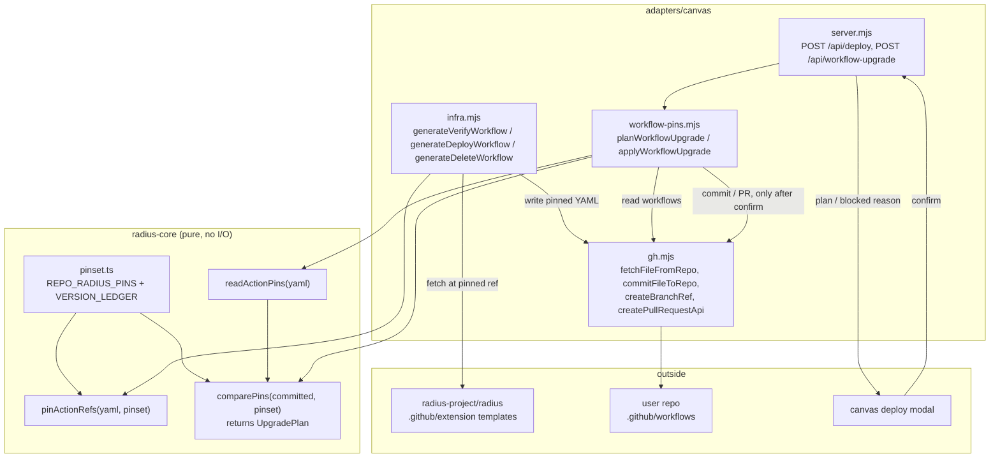
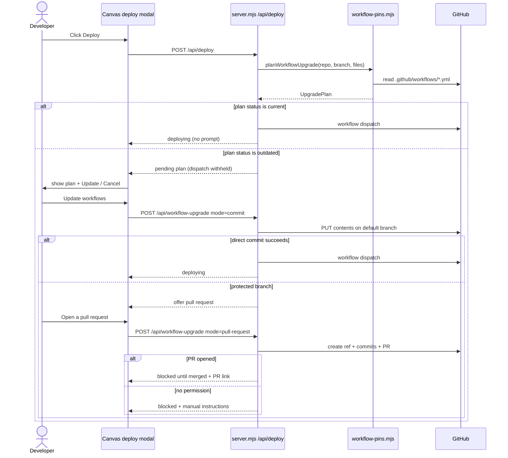

# Keeping Repo Radius workflows pinned and up to date

- **Author**: Dariusz Porowski (@DariuszPorowski)
- **Date**: 2026-07

## Overview

The Radius Canvas extension writes GitHub Actions workflows into the user's repository under `.github/workflows` and dispatches them to verify cloud credentials, deploy applications, and delete applications. Those workflows are the **Repo Radius** runtime: they hold `id-token: write`, assume a cloud role over OIDC, stand up an ephemeral control plane, and run `rad` commands against the user's cloud account. Everything Radius does to a user's cloud goes through them.

Today those workflows are tied to a **moving ref**. `RADIUS_REF` is the string `"main"` ([radius-core/src/workflows/deploy.ts](radius-core/src/workflows/deploy.ts#L7)); the extension fetches the workflow templates from `radius-project/radius/.github/extension/` at that ref at commit time, and the `{{RADIUS_REF}}` placeholder those templates carry is filled with `"main"` as well, so every `uses:` in a committed workflow resolves to whatever `main` happens to point at when the run starts. Worse, the extension keeps them that way *silently*: `syncRepoWorkflows` ([adapters/canvas/src/infra.mjs](adapters/canvas/src/infra.mjs#L338)) re-fetches upstream on a background timer and before every dispatch, byte-compares the committed copy, and commits a replacement straight to the default branch without telling anyone. A user's CI can change underneath them between two deploys, and nothing in the repository history explains why.

This design replaces the moving ref with an **immutable, frontend-declared pinset** and makes every change to a user's workflows explicit. The extension carries a compiled-in manifest of the exact commit SHA it requires for each Repo Radius action; it rewrites `uses:` to that SHA when it writes a workflow; before dispatching a deployment it compares the SHAs already in the repository against the manifest; if they match, the deploy proceeds with no prompt; if they are older, the developer is asked to confirm, and the update lands either as a direct commit to the default branch or — when that branch is protected — as a reviewed pull request. If neither path is available, the deployment is blocked with a message that says exactly what is missing.

## Terms and definitions

- **Repo Radius**: The component that runs each Radius operation as a GitHub Actions workflow in the user's repository and returns results as artifacts. Defined in the [Repo Radius feature specification](https://github.com/radius-project/radius/pull/12078) and already used as a term in [docs/design/2026-07-radius-copilot-app-exception-scenarios.md](docs/design/2026-07-radius-copilot-app-exception-scenarios.md).
- **Frontend**: The Radius Canvas extension shipped from this repository — `adapters/canvas` bundled into `plugins/radius/extension.mjs`, plus the `radius-core` product logic it embeds.
- **Action reference / `uses:` reference**: A GitHub Actions step or job reference of the form `owner/repo[/path]@ref`, where `ref` is a branch, tag, or commit SHA.
- **Pin**: An action reference whose `ref` is a full 40-character commit SHA, so the referenced code cannot change after the fact. The conventional form is `uses: owner/repo@<sha> # <version>`, where the trailing comment records the human-readable version.
- **Pinset**: The manifest, compiled into the frontend, that declares — for every Repo Radius action and for the workflow-template source — the required `{ repo, version, sha }`. The single source of truth for "the versions the current frontend requires".
- **Committed pin**: The pin actually present in a workflow file in the user's repository, discovered by parsing that file.
- **Drift** (existing meaning): A committed workflow file whose bytes differ from the freshly generated upstream template. Detected by `syncRepoWorkflows`.
- **Staleness** (new meaning introduced here): A committed pin whose SHA is older than the pinset's SHA for the same action. This is what triggers a prompt; byte drift alone does not.
- **Pin status**: The result of comparing committed pins against the pinset — `current`, `outdated`, `ahead`, `unpinned`, or `unknown`.

## Objectives

Make every Repo Radius workflow run reproducible, and make every change to a user's workflow files explicit and auditable.

> **Issue Reference:** [radius-project/ai-extensions#106](https://github.com/radius-project/ai-extensions/issues/106) — "Keep Repo Radius action workflows up to date (Repo Radius User Story 4.1)". Related: [radius-project/ai-extensions#177](https://github.com/radius-project/ai-extensions/pull/177).

### Goals

- **Reproducible runs.** Every `uses:` the extension writes into `.github/workflows` resolves to an exact commit SHA, so a workflow run today and the same run next month execute identical action code.
- **Silent when current.** When the committed pins already match what the frontend requires, deployment proceeds with no prompt and no repository writes. This is the common case and it must cost nothing.
- **Nothing changes without consent.** The extension never modifies a user's workflow files without an explicit confirmation. This removes the current silent-commit behavior of `syncRepoWorkflows`.
- **Branch-protection aware.** The upgrade applies through whichever path the repository allows: direct commit to the default branch, else a pull request. The user is told which path was taken and given the link.
- **Fail closed and legibly.** When neither path is available, the deployment does not proceed, and the message names the repository, the branch, the files, and the permission that is missing.
- **Auditable.** The upgrade arrives as a normal commit or a reviewed pull request, with the from-SHA, to-SHA, and version in the message — reviewable by anyone with repository access, with no dependency on the extension.
- **Interoperable with existing supply-chain tooling.** The pin format is the one Dependabot and `zgosalvez/github-actions-ensure-sha-pinned-actions` already understand, so a repository can also be kept current by its own automation without fighting the extension.

Success is measured by: (1) no `uses:` reference written by the extension resolves to a mutable ref; (2) a deploy against an up-to-date repository issues zero write calls to the GitHub API and shows zero prompts; (3) every workflow-file change made by the extension is attributable to a commit or pull request the user approved.

### Non-goals

- **Upgrading the frontend itself.** How the plugin bundle is versioned and shipped is covered by [docs/design/2026-07-canvas-bundle-publishing.md](docs/design/2026-07-canvas-bundle-publishing.md) and `RELEASING.md`. This design consumes the frontend's version; it does not change how the frontend is released.
- **Publishing the Repo Radius actions.** Splitting the composite actions out of `radius-project/radius` into standalone `radius-project/verify-cloud-auth` and `radius-project/run-rad-commands` repositories is upstream work. This design is written so it works with either layout (see [Open questions](#open-questions)).
- **Downgrading.** If a repository is pinned *ahead* of the frontend, the extension leaves it alone. Rolling a user's CI backwards without being asked is exactly the class of silent mutation this design removes.
- **Migrating existing runs.** Workflow runs already in flight against a `@main` pin are unaffected; the check happens before dispatch.
- **Artifact signing / provenance attestation** for the actions themselves. Verifying a SHA against the upstream tag is in scope; Sigstore-style attestation is not.
- **Replacing byte-level template sync.** `syncRepoWorkflows` still has a job — keeping the *body* of the workflow templates current. This design changes when it may write (only under confirmation) and adds the pin check in front of it; it does not delete it.

### User scenarios (optional)

#### User story 1

As a developer, I deploy my application from the Radius side panel. My repository's workflows are already pinned to the SHAs this version of the extension requires, so nothing interrupts me — the deploy starts exactly as it does today.

#### User story 2

As a developer, I updated the Radius plugin last week. I click **Deploy** and the panel tells me my repository's Repo Radius workflows are two versions behind and shows me which files and which actions would change. I click **Update workflows**; the extension commits the new SHAs to `main` and the deploy proceeds. Later I can see the commit in my repository history.

#### User story 3

As a developer on a team whose `main` branch is protected, I click **Deploy**, am told the workflows need updating, and confirm. The extension cannot push to `main`, so it offers to open a pull request instead. I confirm again; it opens the pull request and tells me the deployment cannot run until that pull request is merged, because Repo Radius runs from the default branch. My teammate reviews and merges it, and my next deploy runs clean.

## User experience (if applicable)

The common path is unchanged: **Deploy** starts a deployment.

When the pins are stale, the deploy modal — the same one that renders the tailored `branch-not-pushed` panel in [adapters/canvas/src/pages.mjs](adapters/canvas/src/pages.mjs#L3623) — shows a blocking panel *before* dispatch, with the plan and two buttons.

**Sample input:** the developer clicks **Deploy** for application `webapp` into environment `dev`, on a repository whose `run-rad-commands-azure.yml` is pinned to an older SHA.

**Sample output (update required):**

```text
Repo Radius workflows need updating

This repository's Radius workflows are pinned to an older version of the Repo
Radius actions than this version of the Radius plugin requires. Updating keeps
your deployments reproducible.

  .github/workflows/run-rad-commands-azure.yml
    radius-project/run-rad-commands   v0.3.1  ->  v0.4.0   (a1b2c3d -> 9f8e7d6)
    radius-project/setup-control-plane v0.3.1 ->  v0.4.0   (a1b2c3d -> 9f8e7d6)

  .github/workflows/run-rad-commands.yml
    already up to date

The update will be committed to "main".

  [ Update workflows and deploy ]   [ Cancel ]
```

**Sample output (default branch protected, after confirmation):**

```text
Can't commit to "main"

"main" is protected, so the workflow update can't be committed directly.
Radius can open a pull request with the updated workflows instead.

Repo Radius runs from the default branch, so this deployment can't start
until that pull request is merged.

  [ Open a pull request ]   [ Cancel ]
```

**Sample output (blocked):**

```text
Workflow update blocked

Radius couldn't update the Repo Radius workflows in owner/repo:

  - "main" is protected, so a direct commit was rejected.
  - Your GitHub account can't open a pull request against this repository
    (HTTP 403 creating refs/heads/radius/upgrade-workflows-1753790400000).

Ask someone with write access to apply this change, or apply it yourself:

  .github/workflows/run-rad-commands-azure.yml
    radius-project/run-rad-commands@9f8e7d6…  # v0.4.0

The deployment was not started.
```

**Sample output (committed workflow, after update):**

```yaml
jobs:
  azure:
    uses: radius-project/run-rad-commands/.github/workflows/run.yml@9f8e7d6c5b4a39281706f5e4d3c2b1a09f8e7d6c # v0.4.0
```

## Design

### High-level design

The design has four pieces, three of which are pure functions in `radius-core` and one of which is orchestration in the canvas adapter.

1. **The pinset** — `radius-core/src/workflows/pinset.ts`. A frozen, compiled-in record of every action the Repo Radius workflows reference plus the ref the workflow templates themselves are fetched from, each as `{ repo, path, version, sha }`. It replaces the `RADIUS_REF = "main"` and `DELETE_RADIUS_REF` constants as the frontend's statement of "what I require". It is generated and verified in CI, never hand-edited.

2. **Pin rewriting** — `pinActionRefs(yaml, pinset)`. Given workflow YAML, rewrite every `uses:` reference that matches a pinset entry to `owner/repo[/path]@<sha> # <version>`. It is a **text patch, not a YAML round-trip**: only the `@ref` token and any existing trailing pin comment are replaced, so the committed diff shows exactly the reference lines and nothing else. Re-serializing a parsed YAML document would reformat the whole file — reindenting, dropping blank lines, and dropping the leading document marker — turning a two-line change into a whole-file rewrite.

3. **Pin reading and comparison** — `readActionPins(yaml)` returns the references found in a file; `comparePins(committed, pinset)` classifies each as `current`, `outdated`, `ahead`, `unpinned`, or `unknown` and rolls the file set up into a single `UpgradePlan`. Commit SHAs are not ordered, so "older" cannot be computed from the SHAs themselves; ordering comes from the **version ledger** — a per-repo, append-only list of the `{ version, sha }` pairs the frontend has shipped — with an `unknown` classification (treated as "needs update", never as "ahead") for any SHA not in the ledger.

4. **Confirmed, branch-protection-aware application** — in `adapters/canvas`. The deploy route computes the plan before dispatch. An empty plan dispatches immediately. A non-empty plan short-circuits the dispatch and parks a pending plan on the instance state, which the canvas renders; applying it is a separate, user-initiated request that reuses the existing write helpers in [adapters/canvas/src/gh.mjs](adapters/canvas/src/gh.mjs) — `commitFileToRepo`, `getDefaultBranch`, `getBranchHeadSha`, `createBranchRef`, `createPullRequestApi` — and the existing `isProtectedBranchFailure` classifier from the environment-creation flow ([adapters/canvas/src/server.mjs](adapters/canvas/src/server.mjs#L2011)).

The comparison is deliberately **read-only and cheap**: reading two workflow files from the branch through the already-used contents API, with no template fetch and no write. That is what lets the up-to-date case cost nothing.

### Architecture diagram



Deploy-time control flow:



### Detailed design

#### Option 1: Keep byte-level template sync, add a confirmation prompt

Leave `RADIUS_REF = "main"` and `syncRepoWorkflows` as they are, but make the pre-dispatch pass in `ensureWorkflowsCurrent` ([adapters/canvas/src/server.mjs](adapters/canvas/src/server.mjs#L134)) ask for confirmation instead of committing silently. "Needs update" means "the committed bytes differ from the freshly fetched upstream template".

##### Advantages

- Smallest change. The comparison, generation, and commit machinery already exist and are already tested in [adapters/canvas/src/infra_test.mjs](adapters/canvas/src/infra_test.mjs).
- Satisfies the prompt-and-confirm acceptance criteria on its own.

##### Disadvantages

- **Does not satisfy the pinning criterion at all.** `uses:` still resolves to `@main`, so runs remain irreproducible. Acceptance criterion 1 is untouched.
- **The check is wrong.** Byte equality answers "does this file match upstream `main` right now", not "is this action older than what I require". The moment upstream `main` moves for an unrelated reason — a comment, a whitespace change — every user is prompted. Conversely a repository pinned to an older but byte-identical template looks current.
- **Prompts constantly, so users learn to click through.** A confirmation that fires on cosmetic upstream churn is worse than no confirmation, because it trains the user to approve without reading.
- **Requires a network fetch of every template to answer "is anything wrong?"** — so the common, up-to-date path pays the full template-fetch cost on every deploy.
- Leaves `DELETE_RADIUS_REF` pointing at an unmerged PR branch ([radius-core/src/workflows/delete.ts](radius-core/src/workflows/delete.ts#L12)) with no mechanism to describe that honestly.

#### Option 2: Frontend-declared pinset with in-place `uses:` rewriting (proposed)

Introduce the pinset as the frontend's version contract, rewrite `uses:` to SHAs on write, and compare pins — not bytes — at deploy time.

##### The pinset

`radius-core/src/workflows/pinset.ts`:

```ts
/** One immutable Repo Radius action reference the frontend requires. */
export interface ActionPin {
  /** "owner/repo" of the action. */
  repo: string;
  /** Sub-path within the repo; "" makes the entry repo-wide. */
  path: string;
  /** Human-readable release, recorded as the trailing pin comment. */
  version: string;
  /** Full 40-hex commit SHA. Never a tag, never a branch. */
  sha: string;
}

/** One shipped pin, used to order two SHAs of the same repo. */
export interface LedgerEntry {
  version: string;
  sha: string;
}

export interface Pinset {
  /** Keyed by "owner/repo" (repo-wide) or "owner/repo/path" (exact). */
  actions: Readonly<Record<string, ActionPin>>;
  /** Ref the workflow TEMPLATES are fetched from — pinned for the same reason. */
  templateSource: ActionPin;
  /** Per-repo history of shipped SHAs, oldest first. The only source of ordering. */
  ledger: Readonly<Record<string, readonly LedgerEntry[]>>;
}
```

Three properties matter. First, the pinset covers the **template source ref**, not only the `uses:` references inside the templates: a workflow whose actions are pinned but whose body is fetched from a moving `main` is still irreproducible. `fetchRadiusTemplate` ([adapters/canvas/src/infra.mjs](adapters/canvas/src/infra.mjs#L146)) takes its ref from `templateSource.sha` instead of `RADIUS_REF`. Second, an entry with an empty `path` is **repo-wide**, which is what lets a single entry pin all six composite actions that today live at one ref inside `radius-project/radius` (`setup-control-plane`, `restore-state`, `apply-custom-recipe-packs`, `run-rad-commands`, `teardown`, `delete-resource`) while still allowing per-action entries once they are published separately. Third, the **ledger** supplies ordering. Commit SHAs have no order, so `comparePins` cannot decide "older" from the SHAs alone; it finds each committed SHA's position in the ledger and compares indices. A SHA absent from the ledger classifies as `unknown`, which is treated as "needs update" — never as "ahead" — so an unrecognized or hand-edited pin can never silently suppress the check.

`RADIUS_REF`, `RADIUS_WORKFLOW_REPO`, `RADIUS_WORKFLOW_DIR`, and `DELETE_RADIUS_REF` are replaced by pinset entries and removed from the `radius-core` public surface ([radius-core/src/index.ts](radius-core/src/index.ts#L61)). `DELETE_RADIUS_REF`'s environment-variable escape hatch (`RADIUS_DELETE_REF`) becomes a single development-only override that swaps the whole pinset, so there is one documented way to point the extension at unreleased upstream work rather than one per workflow family.

##### Rewriting on write

```ts
/**
 * Rewrite every `uses:` reference matching a pinset entry to its pinned SHA,
 * preserving the rest of the file byte-for-byte.
 */
export function pinActionRefs(yaml: string, pinset: Pinset): string;

/** Every `uses:` reference in a workflow, with its 1-based line number. */
export function readActionPins(yaml: string): CommittedPin[];
```

`pinActionRefs` runs last in each generator in [adapters/canvas/src/infra.mjs](adapters/canvas/src/infra.mjs) — after `fillTemplate` and after the existing `stripAwsDispatcherJob` / `stripWorkflowRunTrigger` passes, so it sees the final committed text. It matches `uses:` lines with a line-anchored regular expression, looks the `owner/repo[/path]` up in `pinset.actions`, and replaces only the `@ref` token plus any existing `# comment` tail. Lines whose target is not in the pinset — `actions/checkout` and friends — are left alone; pinning third-party actions in the user's repository is upstream's decision, not the extension's.

Deliberately **not** parsing and re-emitting YAML. A `yaml` round-trip is not format-preserving: it reindents, drops blank lines between blocks, and drops a leading `---`, so a two-SHA change would land as a whole-file rewrite that no reviewer can read. Patching the reference token in place keeps the pull request diff to the lines that actually changed, which is what makes criterion 7 ("explicit and auditable") real rather than nominal.

The output form is `uses: owner/repo/path@<40-hex> # <version>`. This is the convention Dependabot emits and consumes, so a repository can additionally run Dependabot against `.github/workflows` and get upgrade pull requests without the two mechanisms fighting: Dependabot's bump produces exactly the text `pinActionRefs` would produce for that version, and `comparePins` reads it back as `ahead` and leaves it alone.

##### Comparing at deploy time

```ts
export type PinStatus = "current" | "outdated" | "ahead" | "unpinned" | "unknown";

export interface UpgradePlan {
  status: "current" | "outdated";
  /** Per-file changes; only files with at least one non-current pin appear. */
  files: {
    path: string;
    changes: { repo: string; from: CommittedPin; to: ActionPin; status: PinStatus }[];
  }[];
}

export function comparePins(
  committed: Record<string, string>,
  pinset: Pinset,
): UpgradePlan;
```

The deploy route calls a thin adapter wrapper, `planWorkflowUpgrade(repo, branch, files)` in a new `adapters/canvas/src/workflow-pins.mjs`, which reads the workflow files with the existing `fetchFileFromRepo` and hands the bodies to `comparePins`. Cost in the common case: two contents reads, no template fetch, no write. It runs against the **default branch**, because that is where Repo Radius runs from, and additionally against the deploy ref when a worktree-consistent deploy targets a different branch — the same two-branch rule `syncRepoWorkflows` already applies and for the same reason.

A file that is absent from the repository is *not* an upgrade: authoring missing workflows belongs to environment creation, exactly as `syncRepoWorkflows` already documents. It is reported as `unpinned` only when the file exists and carries a non-SHA ref, which is precisely the pre-upgrade state of every repository created by today's extension.

##### Applying, with confirmation and a protection-aware fallback

`POST /api/deploy` computes the plan before dispatch. `status === "current"` dispatches immediately — no prompt, no writes, unchanged behavior. `status === "outdated"` **withholds the dispatch**, records the plan on the instance state (`entry.state.pendingWorkflowUpgrade`), and surfaces it through the existing `/api/deploy-status` payload using the established `deployErrorKind` discriminator ([adapters/canvas/src/server.mjs](adapters/canvas/src/server.mjs#L2539)) with a new kind, `workflow-upgrade-required`. The canvas renders it in `showDeployFailed` alongside `branch-not-pushed` ([adapters/canvas/src/pages.mjs](adapters/canvas/src/pages.mjs#L3623)). Reusing that discriminator means no new modal, no new polling channel, and one place where blocking pre-flight outcomes are rendered.

Applying is a separate request — `POST /api/workflow-upgrade { mode }`, against the plan parked on the canvas instance — so the server can never mutate the repository as a side effect of a status poll. `mode` is `"commit"` or `"pull-request"`; each corresponds to a distinct button the user pressed.

Applying **re-pins the committed file in place** rather than regenerating it from the upstream template: the file is re-read, run through `pinActionRefs`, and committed. This keeps the diff to exactly the `uses:` lines, needs no template fetch (so it cannot fail on the network), needs no environment or `app.bicep` context, and preserves any local edit the user made to their own workflow. Because `pinActionRefs` is idempotent and `commitFileToRepo` reuses the existing blob SHA, a retried apply is a no-op rather than a conflict.

`mode: "commit"` writes each changed file to the branches the plan targets with `commitFileToRepo`. On failure it classifies the stderr with `isProtectedBranchFailure`, which distinguishes a protected branch from a missing `workflow` token scope — the latter is a client-side auth problem a pull request cannot fix, and it keeps its existing `gh auth refresh -h github.com -s workflow` guidance. Both classifiers move out of the environment-creation closure into [adapters/canvas/src/gh.mjs](adapters/canvas/src/gh.mjs) so the upgrade path shares them rather than restating the regexes. A protected-branch failure returns `{ status: "needs-pull-request" }` and the canvas offers the second button; it does **not** open a pull request on its own, because opening one is itself a visible action on a shared repository and gets its own confirmation.

`mode: "pull-request"` mirrors the `beginPrFallback` flow already proven in environment creation: `getDefaultBranch` → `getBranchHeadSha` → `createBranchRef` on `radius/upgrade-workflows-<timestamp>` → `commitFileToRepo` per file on that branch → `createPullRequestApi`. On success the response is `{ status: "blocked", reason: "pull-request-open", url }`; the deployment does **not** proceed, because Repo Radius runs from the default branch and the updated workflows are not there yet. Saying so plainly is better than dispatching a run that would execute the old actions.

If `createBranchRef` or `createPullRequestApi` fails, the response is `{ status: "blocked", reason: "no-permission", detail }` carrying the failing operation, its HTTP status, and the file/SHA list so a maintainer can apply the change by hand. The deployment does not proceed.

Two invariants hold throughout. The plan applied is the plan shown: each target branch's head SHA is recorded when the plan is computed and re-read before writing, so a confirmation can never be replayed against a repository state the user did not see. And every write is idempotent: `commitFileToRepo` looks up the existing blob SHA first, so a retried apply updates rather than conflicts.

##### What happens to `syncRepoWorkflows`

It keeps its job — reconciling the workflow *body* with the upstream template — but loses the ability to write at all. Concretely: it becomes a **pure detector**, returning `{ drifted, branches }` with no commit path in the function; the background pass from the Environments listing reports drift into the log; the pre-dispatch pass `ensureWorkflowsCurrent` is replaced by the pin gate so there is exactly one place a deploy can be stopped; and the byte comparison runs against templates fetched at `templateSource.sha` rather than `main`, which makes it stable — a file drifts only when the frontend's pinned template changes, i.e. when the frontend itself was upgraded. That is the change that turns the prompt from noise into signal.

Removing the write path rather than gating it behind a flag is deliberate: a conditional that is never set is dead code that can be re-enabled by accident, whereas a function with no `commitFileToRepo` import cannot silently mutate a repository however it is called.

##### Advantages

- **Satisfies every acceptance criterion**, including the pinning one that Option 1 cannot reach.
- **The check answers the right question.** "Is this SHA older than the one I require" is stable under cosmetic upstream churn, so the prompt fires only on a real version difference and users have reason to read it.
- **The up-to-date path is nearly free** — two file reads, no template fetch, no writes — so the common case gets faster than today, where every deploy pays a template fetch and a byte comparison.
- **Closes a live supply-chain hole.** `@main` in a workflow holding `id-token: write` means anyone who can move `radius-project/radius`'s `main` can execute code against every Radius user's cloud account on their next deploy. Immutable SHAs remove that.
- **Comparison and rewriting are pure functions** in `radius-core` — table-driven unit tests over YAML fixtures, no network, no `gh`.
- **Interoperates with Dependabot** rather than competing with it, because the emitted form is the conventional one.
- **Lets `DELETE_RADIUS_REF` be honest.** An unreleased upstream branch becomes a pinned commit on that branch with a version string that says so, instead of a branch name that silently follows new pushes.

##### Disadvantages

- **The pinset must be maintained.** A frontend release that needs new action behavior must bump SHA, version, and ledger. Mitigated by generating it in CI (see [Implementation details](#build--packaging-if-applicable)) rather than editing by hand.
- **The ledger is an extra artifact** and is only as correct as its generator. Mitigated by classifying anything unrecognized as `unknown` → "needs update", so a gap in the ledger over-prompts rather than under-prompts.
- **More moving parts than Option 1** — a new core module, a new adapter module, a new route, and a new UI state.
- **`git blame` on the user's workflows gets noisier**, one commit per frontend upgrade. This is the intended cost: those commits *are* the audit trail.
- **A repository whose default branch is protected and whose developer cannot open pull requests can no longer deploy** once its pins go stale. That is criterion 6 working as specified, but it is a real workflow change for locked-down repositories.

#### Option 3: Delegate upgrades entirely to Dependabot

Write the workflows pinned once, commit a `.github/dependabot.yml` with a `github-actions` ecosystem entry, and let Dependabot open the upgrade pull requests. The extension checks pins and refuses to deploy when stale, but never writes an upgrade itself.

##### Advantages

- Almost no upgrade code in the extension: pin on write, compare, and block.
- Upgrades arrive through the mechanism the repository's maintainers already review and trust, with their existing review and auto-merge policy applied.
- Naturally branch-protection aware, because Dependabot has always been a pull-request-only mechanism.

##### Disadvantages

- **No direct-commit path**, so acceptance criterion 5 is unmet. Even a solo developer on an unprotected `main` waits for a bot pull request to be raised and merged.
- **Latency is not controllable.** Dependabot runs on its own schedule; a developer who clicks **Deploy** cannot make the upgrade happen now.
- **Requires Dependabot to be enabled**, which is not true of every repository and cannot be turned on from the extension.
- **Dependabot cannot see the pinset.** It upgrades to the newest upstream release, which may be *newer* than the frontend requires — the reverse skew, with no mechanism to hold a version back.
- Adds a file to the user's repository (`dependabot.yml`) with effects well beyond Radius.

#### Proposed option

**Option 2.** It is the only option that satisfies acceptance criterion 1 — the pinning requirement everything else in the issue rests on — and it is the only one whose staleness check is stable enough for the confirmation prompt to be meaningful rather than reflexive. The additional structure it introduces is confined to two pure `radius-core` modules and one adapter module, and it retires more code than it adds by collapsing the two existing sync passes into one gate.

The Dependabot compatibility from Option 3 is kept as a **property**, not an alternative: because `pinActionRefs` emits the conventional `@<sha> # <version>` form, a repository that also runs Dependabot gets bot upgrade pull requests, and `comparePins` reads a Dependabot-bumped pin as `ahead` and leaves it alone. Committing `dependabot.yml` on the user's behalf remains out of scope.

### API design (if applicable)

Two new loopback HTTP routes on the canvas server ([adapters/canvas/src/server.mjs](adapters/canvas/src/server.mjs)), plus one added field on an existing response.

**`GET /api/workflow-upgrade-plan?repo=<owner/repo>&branch=<ref>`** — read-only; computes and returns the plan without touching the repository. Not implemented in the first pass (see [Development plan](#development-plan)); the deploy path computes its plan inline and the Environments listing reports drift through the log instead.

```json
{
  "status": "outdated",
  "branch": "main",
  "headSha": "0f1e2d3c4b5a69788796a5b4c3d2e1f00f1e2d3c",
  "files": [
    {
      "path": ".github/workflows/run-rad-commands-azure.yml",
      "changes": [
        {
          "repo": "radius-project/run-rad-commands",
          "status": "outdated",
          "from": { "ref": "a1b2c3d4e5f60718293a4b5c6d7e8f90a1b2c3d4", "version": "v0.3.1", "line": 24 },
          "to":   { "sha": "9f8e7d6c5b4a39281706f5e4d3c2b1a09f8e7d6c", "version": "v0.4.0" }
        }
      ]
    }
  ]
}
```

**`POST /api/workflow-upgrade`** — applies the plan parked on this canvas instance. Never called implicitly; only from a button press.

```json
{ "mode": "commit" }
```

`mode` is `"commit"` or `"pull-request"`. The plan itself is held server-side against the canvas instance rather than round-tripped through the client, so a caller cannot ask for a rewrite the user was never shown. Each target branch's head must still match the head the plan was computed against; a mismatch returns `409` with `status: "stale-plan"` and the deployment is not started. Responses:

| `status`             | Meaning                                                                         | Deployment       |
|----------------------|---------------------------------------------------------------------------------|------------------|
| `updated`            | Files committed to the branches the plan targeted.                              | Proceeds         |
| `needs-pull-request` | Direct commit rejected by branch protection; PR offered.                        | Withheld         |
| `blocked`            | `reason` is `pull-request-open` \| `no-permission` \| `missing-workflow-scope`. | Does not proceed |
| `stale-plan`         | Branch head moved since the plan was shown.                                     | Does not proceed |

`GET /api/deploy-status` gains no new top-level field: the pending plan is delivered through the existing `errorKind` / `error` pair, with `errorKind: "workflow-upgrade-required"` and the rendered plan carried in a new sibling `errorDetail` object — mirroring how `errorBranch` already accompanies `branch-not-pushed`.

`radius-core`'s public surface ([radius-core/src/index.ts](radius-core/src/index.ts)) gains `Pinset`, `ActionPin`, `LedgerEntry`, `CommittedPin`, `UpgradePlan`, `PinChange`, `UpgradeFile`, `PinStatus`, `REPO_RADIUS_PINSET`, `pinActionRefs`, `readActionPins`, `comparePins`, `classifyPin`, `describePlan`, `resolvePin`, `ledgerIndex`, `isCommitSha`, `isPinsetOverridden`, and `validatePinset`. `RADIUS_WORKFLOW_REPO` and `RADIUS_WORKFLOW_DIR` move from `deploy.ts` to `pinset.ts` and stay exported; `RADIUS_REF` and `DELETE_RADIUS_REF` are removed. Both packages are `private` and unpublished, so this is an internal break only.

### Implementation details

#### radius-core (if applicable)

- **New** `radius-core/src/workflows/pinset.ts` — `Pinset` / `ActionPin` types, the frozen `REPO_RADIUS_PINSET`, and the ledger. Generated; a header comment marks it as such.
- **New** `radius-core/src/workflows/pins.ts` — `pinActionRefs`, `readActionPins`, `comparePins`. Pure; no imports outside `radius-core`. The `uses:` matcher is line-anchored and tolerates a leading list-item dash, arbitrary indentation, quoted and unquoted scalars, and an existing trailing comment.
- **Changed** [radius-core/src/workflows/deploy.ts](radius-core/src/workflows/deploy.ts) — drop `RADIUS_REF`, `RADIUS_WORKFLOW_REPO`, `RADIUS_WORKFLOW_DIR`; `generateDeployWorkflow` stops filling `{{RADIUS_REF}}` and returns text whose references the caller pins. The `{{RADIUS_REF}}` placeholder remains supported for one release so an unmodified upstream template still fills, then is retired.
- **Changed** [radius-core/src/workflows/delete.ts](radius-core/src/workflows/delete.ts) — drop `DELETE_RADIUS_REF` and its `RADIUS_DELETE_REF` override in favour of a pinset entry plus the single whole-pinset development override.
- **Changed** [radius-core/src/index.ts](radius-core/src/index.ts) — re-export the new surface, remove the old constants.

#### Canvas adapter — adapters/canvas (if applicable)

- **New** `adapters/canvas/src/workflow-pins.mjs` — `planWorkflowUpgrade(repo, branches, files)` and `applyWorkflowUpgrade(repo, plan, mode)`. All GitHub access goes through [adapters/canvas/src/gh.mjs](adapters/canvas/src/gh.mjs); no new CLI surface and no new auth path.
- **Changed** [adapters/canvas/src/infra.mjs](adapters/canvas/src/infra.mjs) — `fetchRadiusTemplate` defaults its ref to `REPO_RADIUS_PINSET.templateSource.sha`; the three generators run `pinActionRefs` as their final step; `syncRepoWorkflows` becomes detect-capable (`opts.detectOnly`) and returns the same plan shape.
- **Changed** [adapters/canvas/src/server.mjs](adapters/canvas/src/server.mjs) — `ensureWorkflowsCurrent` is replaced by the pre-dispatch call to `planWorkflowUpgrade`; the deploy route withholds dispatch on `outdated`; the two new routes are added; `isProtectedBranchFailure` and `needsWorkflowScope` are lifted out of the environment-creation closure into module scope so the upgrade path uses the same classifiers rather than a second copy.
- **Changed** [adapters/canvas/src/pages.mjs](adapters/canvas/src/pages.mjs) — `showDeployFailed` grows a `workflow-upgrade-required` panel rendering the per-file change table with **Update workflows** / **Cancel**, and a follow-on protected-branch panel with **Open a pull request** / **Cancel**. Same modal, same wiring as the existing `branch-not-pushed` panel.

#### Shared adapter — adapters/shared (if applicable)

N/A. `adapters/shared` holds the `rad` binary helpers ([adapters/shared/src/rad.mjs](adapters/shared/src/rad.mjs)); nothing here touches the local `rad` CLI.

#### Plugin — plugins/radius (if applicable)

- [plugins/radius/skills/radius-deploy/SKILL.md](plugins/radius/skills/radius-deploy/SKILL.md) — replace the "commits/updates the deploy workflow files if they've changed" description with the pin check, the confirmation, and the two apply paths, so the agent narrates the same model the canvas implements.
- [plugins/radius/skills/radius-environment/SKILL.md](plugins/radius/skills/radius-environment/SKILL.md) — state that committed workflows are SHA-pinned.
- [plugins/radius/skills/radius-delete/SKILL.md](plugins/radius/skills/radius-delete/SKILL.md) — drop the `DELETE_RADIUS_REF` / `RADIUS_DELETE_REF` description in favour of the pinset.

#### Build & packaging (if applicable)

- **New** `scripts/update-pinset.mjs` — resolves each configured `owner/repo@<tag>` to a commit SHA through `GET /repos/{owner}/{repo}/git/ref/tags/{tag}`, dereferencing an annotated tag via `object.type === "tag"` → `GET /repos/{owner}/{repo}/git/tags/{sha}`, and rewrites `pinset.ts` with the resolved SHAs and an appended ledger entry. Run by a maintainer or a scheduled workflow; its output is reviewed on a normal pull request.
- **New** CI check — re-runs the resolution and fails if any `pinset.ts` SHA does not match the tag it claims, if any SHA is not 40 hex characters, or if the ledger is not append-only. This is what makes "a human cannot hand-edit an unverified SHA" true rather than aspirational.
- A Changeset accompanies the change (`.changeset/`, see `RELEASING.md`), following the existing `auto-update-workflow-templates.md` precedent.

### Error handling

| Scenario                                          | Handling                                                                                                                                      | User sees                                                      |
|---------------------------------------------------|-----------------------------------------------------------------------------------------------------------------------------------------------|----------------------------------------------------------------|
| Workflow file absent on the branch                | Not an upgrade; skipped. Environment creation owns authoring.                                                                                 | Nothing; deploy proceeds.                                      |
| Reading a workflow file fails (network, 5xx)      | Fail **open** for the check: log and dispatch. A GitHub outage must not block deploys, and the run is no worse off than today.                | A log line; deploy proceeds.                                   |
| Committed pin is a tag or branch (`unpinned`)     | Treated as `outdated`; the plan shows `main → v0.4.0`. This is the migration path for every existing repository.                              | Standard update prompt, once.                                  |
| Committed SHA absent from the ledger (`unknown`)  | Treated as `outdated`, never `ahead`.                                                                                                         | Standard update prompt.                                        |
| Committed pin newer than the pinset (`ahead`)     | No change, no prompt. Logged.                                                                                                                 | Nothing; deploy proceeds.                                      |
| Direct commit rejected — branch protection        | Classified by `isProtectedBranchFailure`; pull request offered.                                                                               | "Can't commit to main" panel.                                  |
| Direct commit rejected — missing `workflow` scope | Classified by `needsWorkflowScope`; a pull request cannot fix it, so it is **not** offered.                                                   | Existing `gh auth refresh -h github.com -s workflow` guidance. |
| `createBranchRef` / `createPullRequestApi` fails  | `blocked` / `no-permission` with the failing call, HTTP status, and the file/SHA list.                                                        | "Workflow update blocked" panel. Deployment does not start.    |
| Pull request opened successfully                  | `blocked` / `pull-request-open` with the link. Repo Radius runs from the default branch, so the deploy waits for the merge.                   | PR link plus why the deploy is waiting.                        |
| Branch head moved between plan and apply          | `409` / `stale-plan`; the plan is recomputed and re-shown.                                                                                    | Refreshed plan; nothing written.                               |
| Partial apply (file 1 committed, file 2 fails)    | Committed files stay; the plan is recomputed on retry so only the remainder is attempted. `commitFileToRepo` is idempotent per file.          | The failure, plus what did land.                               |
| Template fetch fails during apply                 | Hard error, as today ([adapters/canvas/src/infra.mjs](adapters/canvas/src/infra.mjs#L146)). No partial or fallback content is ever committed. | The underlying fetch error. Deployment does not start.         |

## Test plan

**Unit — `radius-core` (no I/O, the bulk of the coverage).** `radius-core/src/workflows/pins_test.ts`, table-driven over YAML fixtures:

- `pinActionRefs` rewrites `uses:` for pinset entries and leaves `actions/checkout` and other non-pinset references untouched.
- **Line-count and diff-shape assertions**: output line count equals input line count, and exactly the expected line indices differ. This is the regression test that catches an accidental YAML round-trip, which would reformat the whole file.
- Handles `- uses:` list items, arbitrary indentation, single/double-quoted scalars, `job.uses:` at job level, an existing `# v0.3.1` comment, no comment, and a `${{ }}` expression on the same line.
- Idempotence: `pinActionRefs(pinActionRefs(y)) === pinActionRefs(y)`.
- `readActionPins` round-trips what `pinActionRefs` writes, with correct 1-based line numbers.
- `comparePins` covers `current`, `outdated`, `ahead`, `unpinned`, `unknown`, mixed files, and the empty plan.
- Pinset shape: every `sha` is 40 hex; every `version` is in the ledger; the ledger has no duplicates.

**Unit — canvas adapter.** `adapters/canvas/src/workflow-pins_test.mjs`, using the fake-GitHub harness already established in [adapters/canvas/src/infra_test.mjs](adapters/canvas/src/infra_test.mjs) (a `commits` array plus stubbed `fetchFileFromRepo` / `commitFileToRepo`), extended with `createBranchRef` and `createPullRequestApi` stubs:

- Current repository → plan is empty, **zero** write calls recorded.
- Outdated → direct commit path writes exactly the changed files with the expected bodies.
- `commitFileToRepo` rejecting with `HTTP 403 ... protected branch` → `needs-pull-request`, and **no** branch or PR is created without the second call.
- `mode: "pull-request"` → branch created from the resolved head, one commit per changed file on that branch, one PR opened, result `blocked` / `pull-request-open`.
- `createBranchRef` failing → `blocked` / `no-permission`; nothing committed.
- Missing `workflow` scope stderr → classified as scope, **not** offered a PR.
- `headSha` mismatch → `stale-plan`; nothing written.

**Server route tests** ([adapters/canvas/src/server_test.mjs](adapters/canvas/src/server_test.mjs)): `POST /api/deploy` dispatches with no prompt when current; withholds dispatch and sets `errorKind: "workflow-upgrade-required"` when outdated; `POST /api/workflow-upgrade` is the *only* route that writes — asserted by leaving the write stubs unimplemented in the deploy-path test so any write throws.

**Live test** — `radius-core/src/workflows/pinset.live_test.ts`, following the existing opt-in pattern of [radius-core/src/workflows/oidc-environment-contract.live_test.ts](radius-core/src/workflows/oidc-environment-contract.live_test.ts): every pinned SHA exists upstream, is reachable, and matches the tag its `version` names. This is what stops a typo'd or fabricated SHA from shipping.

**Manual verification** against a scratch repository, one pass per branch-protection configuration: unprotected default branch (direct commit), protected default branch with PR permission (PR path), protected default branch without PR permission (blocked), and a repository already current (silent).

**New testing challenge.** Branch protection cannot be simulated offline; unit tests assert on the *classification* of recorded stderr strings (real `gh` output, captured as fixtures the way [adapters/canvas/src/gh_test.mjs](adapters/canvas/src/gh_test.mjs) captures `gh auth status` output), and the end-to-end behavior is covered manually and by the live test.

## Security

This design is primarily a **supply-chain integrity** change (OWASP A08, Software and Data Integrity Failures). The workflows in question request `id-token: write` and exchange that token for cloud credentials, so whoever controls the action code they execute controls the user's cloud account for the duration of the run.

| Threat                                                                                                                                                                                                                                                                                                                    | Today                                                        | Mitigation                                                                                                                                                                                                                                                                 |
|---------------------------------------------------------------------------------------------------------------------------------------------------------------------------------------------------------------------------------------------------------------------------------------------------------------------------|--------------------------------------------------------------|----------------------------------------------------------------------------------------------------------------------------------------------------------------------------------------------------------------------------------------------------------------------------|
| **Mutable-ref code substitution.** `uses: …@main` resolves at run time. Anyone able to push to, force-push to, or move a tag on the upstream repository — including via a compromised maintainer account — executes arbitrary code in every Radius user's workflow on their next deploy, with cloud credentials in scope. | Exposed on every run.                                        | Every `uses:` the extension writes resolves to an immutable 40-hex commit SHA. Upgrading requires a new frontend release **and** the user's confirmation.                                                                                                                  |
| **Silent CI mutation.** `syncRepoWorkflows` commits to the user's default branch unattended and unprompted, so an upstream template change becomes a change to the user's CI with no approval and no notice.                                                                                                              | Exposed continuously (background timer plus every dispatch). | No repository write happens without an explicit confirmation for a plan the user has seen.                                                                                                                                                                                 |
| **Fabricated or typo'd SHA.** A pin that does not correspond to reviewed upstream code.                                                                                                                                                                                                                                   | N/A.                                                         | `scripts/update-pinset.mjs` resolves SHAs from GitHub's tag refs, never by hand; CI re-resolves and fails on mismatch; `pinset.live_test.ts` re-verifies. SHAs come only from the compiled-in pinset — **never** from repository content, user input, or an HTTP response. |
| **Confirmation replay / TOCTOU.** A confirmation applied to a repository state different from the one shown.                                                                                                                                                                                                              | N/A.                                                         | The plan is keyed to the branch head SHA; apply re-reads it and refuses on mismatch (`stale-plan`).                                                                                                                                                                        |
| **Injection through the pin comment.** The `# <version>` tail is written into YAML.                                                                                                                                                                                                                                       | N/A.                                                         | `version` and `sha` are validated against `^[\w.+-]{1,64}$` and `^[0-9a-f]{40}$` at pinset load; nothing else is interpolated into the reference line.                                                                                                                     |
| **Over-broad credentials.** Committing to `.github/workflows` requires the `workflow` token scope.                                                                                                                                                                                                                        | Existing behavior.                                           | Unchanged. The existing `decideGhTokenStrategy` / `needsWorkflowScope` handling in [adapters/canvas/src/gh.mjs](adapters/canvas/src/gh.mjs#L75) applies; the extension never escalates its own scope and never logs a token.                                               |
| **Downgrade.** Rolling a repository back to an older action version.                                                                                                                                                                                                                                                      | N/A.                                                         | `ahead` pins are never rewritten, and `unknown` is never classified as `ahead`, so the extension has no path that lowers a version.                                                                                                                                        |

Request bodies containing base64 file content continue to be fed over stdin rather than argv (`commitFileToRepo`, `createBranchRef`, `createPullRequestApi` in [adapters/canvas/src/gh.mjs](adapters/canvas/src/gh.mjs#L534)), keeping them off the process list. The new routes add no new outbound host, no new credential, and no new CLI.

## Compatibility (optional)

- **Existing repositories** carry `@main` references. Their first deploy after upgrading the plugin classifies them `unpinned` → `outdated` and prompts once. This is the intended migration and needs no separate migration step.
- **Older plugin versions against a pinned repository.** An older extension byte-compares against upstream `main`, sees a difference, and would rewrite the file — reintroducing `@main`. Two frontends of different versions driving one repository will therefore fight. This is the strongest argument for treating pinning as a coordinated release: ship the pin check and the write-confirmation gate together, and note the minimum plugin version in the release notes.
- **`radius-core` exports.** `RADIUS_REF`, `RADIUS_WORKFLOW_REPO`, `RADIUS_WORKFLOW_DIR`, and `DELETE_RADIUS_REF` are removed. Both packages are `private` with no external consumers, so this is internal only.
- **`RADIUS_DELETE_REF`** is removed in favour of a single whole-pinset development override. It is a documented development affordance, not a supported public interface.
- **Upstream templates** keep working unmodified. `pinActionRefs` operates on the final text, so a template that still writes `@{{RADIUS_REF}}` or `@main` is normalized to the pinned SHA at commit time. Upstream can adopt SHA pinning on its own schedule.
- **In-flight runs** are unaffected; the check is pre-dispatch only.

## Monitoring and logging

Following the existing prefixed-`console.error` convention (`[radius workflow-sync]`, `[radius workflow-presync]`) with a new `[radius workflow-pin]` prefix:

- Plan computed: repository, branch, head SHA, status, and the per-file change count. Emitted for `current` too, at one line, so an unexpectedly quiet deploy can be distinguished from a check that never ran.
- Apply requested: mode and the file list. Apply completed: outcome, plus the PR URL when there is one.
- Blocked: the reason code, the failing GitHub call, and its HTTP status.
- `ahead` and `unknown` classifications are logged with the offending SHA, since both usually mean a hand-edit or third-party automation and both are worth seeing when diagnosing.

No SHA, version, repository name, or branch name is sensitive; tokens are never logged, matching the existing `gh.mjs` handling. The GitHub side of the audit trail is the commit or pull request itself, which survives independently of the extension.

## Development plan

Five increments, each independently reviewable and shippable.

1. **Pinset and pure functions.** `pinset.ts`, `pins.ts`, and their unit tests, plus `scripts/update-pinset.mjs` and the CI verification check. No behavior change — nothing calls the new code yet. Deliverable: `radius-core` exports and a green pinset check.
2. **Pin on write.** Run `pinActionRefs` as the last step of the three generators; point `fetchRadiusTemplate` at the pinned template ref; delete `RADIUS_REF` / `DELETE_RADIUS_REF`. Satisfies acceptance criterion 1. Deliverable: newly created environments write SHA-pinned workflows; existing `infra_test.mjs` cases updated for the pinned output.
3. **Detect at deploy time.** `workflow-pins.mjs` `planWorkflowUpgrade`, `GET /api/workflow-upgrade-plan`, and the pre-dispatch call that logs but does not yet gate. `syncRepoWorkflows` switches to detect-only, which removes the silent-write behavior immediately — the highest-value single change in the plan. Deliverables: criteria 2 and 3, plus adapter tests.
4. **Confirm and apply.** `applyWorkflowUpgrade`, `POST /api/workflow-upgrade`, both apply modes, the `workflow-upgrade-required` panels in `pages.mjs`, and dispatch gating. Deliverables: criteria 4, 5, 6, and 7, plus the branch-protection classification tests and the manual matrix.
5. **Documentation and rollout.** Skill updates, the Changeset, `docs/architecture/` note, and the release note recording the minimum plugin version for pinned repositories.

Increments 1–3 are additive and carry no user-visible risk; 4 changes the deploy flow and should land as a single reviewed unit so detection and confirmation ship together.

## Open questions

1. **Where do the Repo Radius actions live?** The issue describes two published actions, `radius-project/verify-cloud-auth` and `radius-project/run-rad-commands`. The code today references composite actions inside `radius-project/radius` at `.github/extension/actions/*` and fetches templates from `.github/extension/`. Is the split a prerequisite for this work, or does the pinset start by pinning `radius-project/radius` and gain the new entries when they are published? The design works either way — `pinset.actions` is keyed by `owner/repo/path` — but the answer determines the initial pinset contents.
2. **Where does the version ledger come from?** GitHub releases on the action repositories is the obvious source, but that requires them to be released rather than branch-tracked. Until then, is a hand-appended, CI-verified ordered list acceptable?
3. **Should a stale pin block deletion and verification too, or only deployment?** The issue specifies deployment. Applying the same gate to `delete-application.yml` is consistent, but blocking a *delete* on a workflow upgrade risks stranding cloud resources. Recommendation: gate deploy only; log for delete.
4. **Should the extension offer to enable Dependabot?** The pin format makes it work, and offering a one-click `dependabot.yml` would keep repositories current between plugin upgrades. It writes a file with effects far beyond Radius, so the default answer is no — but it is worth a decision rather than an omission.
5. **How stale is too stale?** If a repository is several versions behind and the intervening workflow bodies changed shape, is a SHA rewrite sufficient, or must the whole file be regenerated? Proposal: when the committed pin's ledger index is more than N versions behind, regenerate the file body from the pinned template instead of patching references, and say so in the plan. N is unset.
6. **Should the pull-request path offer to enable auto-merge?** It would shorten the protected-branch loop considerably, but it silently commits the user to a merge policy.

## Alternatives considered

- **Pin to tags instead of SHAs** (`uses: …@v0.4.0`). Far more readable, and the comparison becomes trivial semver. Rejected: a git tag is mutable, so it does not close the substitution threat that motivates the work — [GitHub's own hardening guidance](https://docs.github.com/en/actions/security-for-github-actions/security-guides/security-hardening-for-github-actions#using-third-party-actions) is explicit that third-party actions should be pinned to a full commit SHA. The tag survives as the `# <version>` comment, which recovers the readability without the mutability.
- **Vendor the action code into the user's repository.** Maximum reproducibility and no upstream dependency at run time. Rejected: it turns every upgrade into a large, unreviewable diff in the user's repository and makes the user the maintainer of code they did not write.
- **Derive "which version" from the plugin version instead of a pinset.** One number to bump. Rejected: it forces the frontend and every action to be released in lockstep, and it cannot express "this frontend requires v0.4.0 of one action and v0.3.1 of another", which is exactly the situation while the actions are being split out of `radius-project/radius`.
- **Store the required version as a marker file in the user's repository** (for example `.radius/workflow-version`). Cheap comparison — one small file read. Rejected: it is a second source of truth that can disagree with the workflows it describes, and it is trivially falsified by an edit. The workflow files are already the authoritative record; parsing them cannot go out of sync with them.
- **Compare a content hash of the whole workflow file rather than the pins.** Effectively today's behavior with a cheaper comparison. Rejected for the reasons under [Option 1](#option-1-keep-byte-level-template-sync-add-a-confirmation-prompt): it answers a question about bytes, not versions, so it both over-reports (cosmetic churn) and under-reports (a stale pin in an otherwise-matching file).
- **Always use the pull-request path, never a direct commit.** Uniform, always auditable, always branch-protection safe. Rejected: acceptance criterion 5 requires the direct-commit path, and forcing a solo developer on an unprotected `main` through a pull request to change two SHAs is friction with no corresponding safety gain.
- **Auto-update without confirmation when the change is "only a SHA".** Tempting, since the diff is small. Rejected outright: the size of the diff is unrelated to the size of its effect — a SHA change is precisely a change of *which code runs with cloud credentials*. That is the one change that most needs consent.

## Design review notes

<!-- Record the decisions made during design review here before the design is merged. -->
