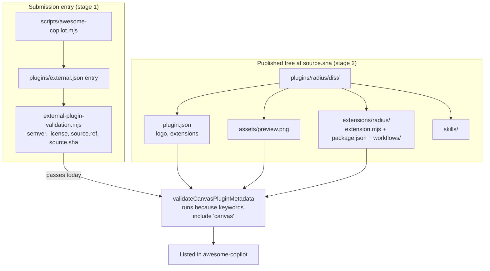

# Canvas plugin layout and the awesome-copilot marketplace listing

- **Author**: Dariusz Porowski (@DariuszPorowski)
- **Date**: 2026-08

## Overview

The `radius` plugin is published to a release branch and installed from
`.github/plugin/marketplace.json`, as designed in
[`2026-07-canvas-bundle-publishing.md`](./2026-07-canvas-bundle-publishing.md) and described in
[`docs/architecture/plugin-packaging-and-publishing.md`](../architecture/plugin-packaging-and-publishing.md).
That gets the plugin installable from **our own** marketplace. Listing it in the community
marketplace, [`github/awesome-copilot`](https://github.com/github/awesome-copilot), is a separate
gate: submissions are checked by an automated intake job before a maintainer sees them.

This design records the outcome of auditing the stable release process against that intake, and
proposes the packaging change needed to pass it. The audit found that the **release process itself
is already correct** — every field the intake validates in the submission entry is produced
correctly by `scripts/awesome-copilot.mjs`. What fails is the **shape of the published plugin
directory**: awesome-copilot requires canvas plugins to place their extension entry point under an
`extensions/` subdirectory alongside an `assets/preview.png`, and we ship the bundle flat at the
plugin root.

The same audit surfaced a second, more valuable observation. The layout awesome-copilot requires is
the layout the GitHub Copilot App actually loads canvases from, which makes it a candidate root
cause for the long-standing canvas-discovery problem that
[`radius-fix-canvas-installation`](../../plugins/radius/skills/radius-fix-canvas-installation/SKILL.md)
exists to work around. This doc proposes the layout change and a way to test that hypothesis, but
deliberately does not assume it is true.

## Terms and definitions

- **Intake**: awesome-copilot's automated submission check,
  `eng/external-plugin-intake.mjs`. It parses the submission issue, validates the entry, then
  inspects the referenced repository contents at a pinned commit.
- **Entry validation**: `eng/external-plugin-validation.mjs`, the schema/consistency check applied
  to a single `plugins/external.json` entry. Purely local — no repository access.
- **Canvas metadata validation**: `validateCanvasPluginMetadata` in `eng/external-plugin-intake.mjs`.
  Applied **only** to plugins whose `keywords` include `canvas`. Inspects the published tree.
- **Plugin root**: the directory named by the submission entry's `source.path`. For us,
  `plugins/radius/dist` — the assembled plugin, not the source directory.
- **Legacy manifest form**: the `plugin.json` shape the Copilot App and awesome-copilot's canvas
  validator understand today — `skills` and `extensions` as **string** paths, `logo` at the top
  level. Used by `microsoft/upgrade-agent-plugins`, and by us.
- **Agent Plugins 1.0.0**: the newer manifest spec at
  `https://agent-plugins.org/schemas/1.0.0/plugin.schema.json`, in which `extensions` is an
  **object** keyed by reverse-domain namespace and there is no top-level `logo` or `skills`.

## Objectives

Make a stable release of the `radius` plugin pass awesome-copilot's automated intake without
weakening the supply-chain guarantees the release process already provides.

> **Issue Reference:** [github/awesome-copilot#2850](https://github.com/github/awesome-copilot/issues/2850)
> — the Radius listing request, whose intake run reported the failures analysed here.

### Goals

- Confirm, with evidence rather than inspection, whether the stable release process emits a
  submission entry that satisfies intake.
- Identify every remaining intake rule a canvas-keyworded plugin must satisfy, including the ones
  intake did not report because it stops at the first failure.
- Package the plugin so the listing can proceed, without changing what the bundle *is* or how it is
  pinned, signed, or verified.

### Non-goals

- **Migrating to Agent Plugins 1.0.0.** As shown below, the 1.0.0 `extensions` object form is
  currently rejected by awesome-copilot's canvas validator, so migrating now would block the very
  listing this work exists to unblock. Tracked as a follow-up.
- **Fixing canvas discovery.** This design makes the layout match what the App loads, which *may*
  remove the need for the `radius-fix-canvas-installation` workaround. Proving that requires an
  end-to-end install test on a real App build and is out of scope here.
- **Changing the release/publish mechanism.** Branches, tags, source-commit pinning, SBOM, and
  attestation are unchanged.
- **Re-submitting the listing.** This design covers making a release *submittable*.

### User scenarios (optional)

#### User story 1

As a Radius user, I search the community marketplace in the GitHub Copilot App, find the Radius
plugin with a preview image, and install it — instead of first having to add a custom marketplace
by URL.

#### User story 2

As a Radius maintainer, I cut a stable release and submit it to awesome-copilot using values
generated by `scripts/awesome-copilot.mjs`, and intake passes on the first attempt.

## User experience (if applicable)

No canvas or CLI surface changes. The user-visible difference is in the marketplace listing and in
the installed directory layout.

**Sample input:** a maintainer generates the submission for a released commit.

```bash
node scripts/awesome-copilot.mjs --out ./out --sha 1e2490f6... --plugin radius
```

**Sample output:** the generated entry, which awesome-copilot's own validator accepts unchanged.

```json
{
  "name": "radius",
  "version": "0.1.0",
  "license": "Apache-2.0",
  "keywords": ["radius", "radapp", "app-modeling", "bicep", "application-graph", "deploy", "canvas"],
  "source": {
    "source": "github",
    "repo": "radius-project/ai-extensions",
    "path": "plugins/radius/dist",
    "ref": "1e2490f6...",
    "sha": "1e2490f6..."
  }
}
```

## Design

### High-level design

Intake runs in two stages. The first stage validates the submission entry in isolation; the second
resolves `source.repo` at `source.sha` and inspects the tree under `source.path`. Our release
process already satisfies stage one. Stage two is where the canvas rules live, and where the
published directory shape matters.

The change is therefore confined to **what `build.mjs` assembles into `plugins/radius/dist/`** and
to the manifest that describes it. No product logic, no workflow generation, and no publishing
mechanism is affected.

The one coupling that makes this more than a file move: `bundledWorkflowDirs()` in
[`packages/adapter-canvas/src/infra.ts`](../../packages/adapter-canvas/src/infra.ts) locates the
bundled workflow templates as a **sibling** `workflows/` directory next to the running bundle.
Moving `extension.mjs` without moving `workflows/` with it would break workflow template
resolution in every installed layout. The existing comment already anticipates multiple install
roots and deliberately keys off the sibling directory's presence rather than any path name, so the
move is safe **provided the pair moves together**.

### Architecture diagram



### Detailed design

The audit result, established by running awesome-copilot's own validator against our generated
entry rather than by reading the rules:

| Reported requirement | Status | Evidence |
| --- | --- | --- |
| `version` is valid semver | Pass | validator returns no errors for the generated entry |
| `source.ref` is a tag or commit SHA | Pass | generator emits the artifact-branch commit SHA |
| `source.sha` is a full 40-char SHA | Pass | same SHA, regex-checked before emit |
| canvas manifest is present | Pass | `plugins/radius/dist/plugin.json` ships on the branch |

The reported run failed because the submission issue was filled in by hand: the commit was the
literal string `TBD`, and `source.path` was `plugins/radius` rather than the assembled
`plugins/radius/dist`. That is why the error text names `plugins/radius/plugin.json`. Nothing in
the release process produced those values.

Because intake returns at its first canvas error, four further rules were never reported. All four
fail against the tree we publish today:

| Canvas rule | Required | Today |
| --- | --- | --- |
| `logo` | must equal `assets/preview.png` | absent |
| `extensions` | omitted, or the string `"extensions"` | `"."` |
| `extensions/` directory | must exist under the plugin root | absent |
| entry point | `extensions/extension.mjs` or `extensions/<name>/extension.mjs` | `extension.mjs` at the root |
| `assets/preview.png` | must exist and be a file | absent |

#### Option 1: Adopt the legacy `extensions/<name>/` layout

Keep the current manifest generation, set `logo`, set `extensions` to `"extensions"`, ship an
`assets/preview.png`, and relocate the bundle and its sibling `workflows/` into
`extensions/radius/`.

##### Advantages

- Matches a **known-good, currently listed** canvas plugin: `microsoft/upgrade-agent-plugins` ships
  `plugins/upgrade-agent/{plugin.json, assets/preview.png, extensions/upgrade-agent-dashboard/{extension.mjs, package.json}}`
  and is listed in `plugins/external.json`.
- Matches the layout the Copilot App demonstrably loads canvases from —
  `~/.copilot/extensions/<name>/{extension.mjs, package.json}` — which is precisely what the
  `radius-fix-canvas-installation` workaround copies files into.
- `bundledWorkflowDirs()` needs no change, because the bundle keeps its sibling `workflows/`.
- Smallest possible change to the release pipeline: assembly only.

##### Disadvantages

- Changes the installed directory layout, so the workaround skill's documented paths must be
  updated in the same change.
- Targets a manifest form that Agent Plugins 1.0.0 will eventually supersede.
- Requires a `preview.png` design asset that does not exist in the repository today.

#### Option 2: Migrate to Agent Plugins 1.0.0

Adopt `$schema`, and express client data as
`extensions: { "com.github.copilot": { "logo": "assets/preview.png" } }`.

##### Advantages

- Targets the forward-looking, formally specified manifest.
- Namespaced client metadata is the direction GitHub's own newer plugins take — for example
  `github/awesome-copilot`'s `accessibility-kanban`.

##### Disadvantages

- **Blocks the listing.** `validateCanvasPluginMetadata` errors unless `extensions` is `undefined`
  or the exact string `"extensions"`; an object satisfies neither.
- The 1.0.0 schema sets `additionalProperties: false` and defines no top-level `skills` or `logo`,
  so our `skills` declaration would have to move into a namespace whose semantics the App's current
  loader is not known to honour.
- Couples a packaging fix to a manifest migration with a much larger blast radius.

#### Proposed option

**Option 1.** It is the only option that unblocks the listing, it is validated by a plugin already
listed under the same rules, and it aligns our layout with what the App loads. Option 2 should be
revisited once awesome-copilot's canvas validator understands the namespaced form; until then it is
strictly blocking.

### API design (if applicable)

N/A. No REST API, CLI argument, or exported TypeScript signature changes. `computeBundledWorkflowDirs`
keeps its current signature and behaviour; only the directory it is called with changes.

### Implementation details

#### Core package — packages/core (if applicable)

N/A. No product logic changes.

#### Canvas adapter — packages/adapter-canvas (if applicable)

- [`packages/adapter-canvas/build.mjs`](../../packages/adapter-canvas/build.mjs): point `outfile` at
  `dist/extensions/radius/extension.mjs`; write the extension `package.json` beside it; retarget
  `copyExtensionAssets()` so the bundled `workflows/` tree lands in the same directory; add
  `assets` to `pluginSources` so the preview image is copied into `dist/`; update `installToLocal()`
  to mirror the new layout.
- `bundledWorkflowDirs()` in [`packages/adapter-canvas/src/infra.ts`](../../packages/adapter-canvas/src/infra.ts)
  is unchanged by design — the sibling invariant is preserved.

#### Shared adapter — packages/adapter-shared (if applicable)

N/A.

#### Plugin — plugins/radius (if applicable)

- `plugins/radius/plugin.json`: add `"logo": "assets/preview.png"`; change `"extensions"` from
  `"."` to `"extensions"`.
- `plugins/radius/package.json`: update `main` to the relocated entry point.
- `plugins/radius/assets/preview.png`: new tracked design asset.
- `plugins/radius/skills/radius-fix-canvas-installation/SKILL.md`: update the documented source
  paths, and copy the `workflows/` directory rather than only two files — the current procedure
  leaves the copied extension without its workflow templates.

#### Build & packaging (if applicable)

- [`scripts/validate-plugin-dist.mjs`](../../scripts/validate-plugin-dist.mjs): resolve the entry point
  through the new layout, and add assertions for `logo`, `assets/preview.png`, and the
  `extensions/` directory so a non-conforming build fails before publish rather than at intake.
- A Changeset is required: this changes the shipped plugin layout.

### Error handling

The failure modes are build-time and publish-time, not runtime, and each is made to fail closed:

- **Bundle and `workflows/` separated by a future edit.** `validate-plugin-dist.mjs` asserts both
  exist in the same directory, so the pipeline fails rather than shipping a plugin whose workflow
  templates silently fall back to walking the user's checkout.
- **Missing preview asset or `logo`.** Caught by `validate-plugin-dist.mjs` in CI, well before a
  submission is generated.
- **Stale installed copy.** Unchanged behaviour: `installToLocal()` already replaces the tree
  atomically.

## Test plan

- **Artifact integration** (`packages/adapter-canvas/test/integration/artifact/built-extension.test.ts`):
  update the assertion that the bundle sits at the dist root; assert the new layout, that the
  bundled `workflows/` tree is byte-identical to `.github/extension` in its new location, and that
  `assets/preview.png` is present and non-empty.
- **Static config** (`packages/adapter-canvas/test/ci/`): add a check that `plugin.json` satisfies
  the canvas contract — `logo` exactly `assets/preview.png`, and `extensions` either absent or
  `"extensions"`. This encodes the external rule so a regression is caught in CI rather than by
  intake.
- **Validator** (`scripts/validate-plugin-dist.mjs`): cover the new failure modes.
- **Workflow resolution**: existing `computeBundledWorkflowDirs` unit tests already cover the
  sibling invariant and should continue to pass unchanged — that is the signal the move is safe.
- **Manual**: install the built plugin and confirm the canvas registers, which also tests the
  discovery hypothesis. New external dependency for tests: none.

## Security

No change to the security model. The supply-chain guarantees added previously are preserved
exactly: the bundle is still stamped with `radiusSourceRef`, workflow assets are still pinned to
the source commit, and SBOM and attestation generation are untouched. The change moves files within
an already-published artifact.

One supply-chain note: `assets/preview.png` is a new **binary** file in the published tree. It is a
static image, never executed, and is covered by the same attestation as the rest of the artifact.
It should be reviewed on introduction like any other binary asset.

## Compatibility (optional)

**This is a breaking change to the installed plugin layout.**

- Existing installs continue to run the copy they already have; the layout change takes effect on
  the next install or update.
- Anything that hardcodes the entry point path breaks. The known instance in this repository is the
  `radius-fix-canvas-installation` skill, updated in the same change. External copies of that
  procedure will need the same update.
- The manifest stays on the legacy form, so no compatibility change for the Copilot App's current
  loader.

## Monitoring and logging

No new instrumentation. Diagnosis relies on existing signals:

- `validate-plugin-dist.mjs` output in the build and publish workflows is the first place a
  malformed layout surfaces.
- `verified-git.mjs` artifact verification continues to compare the published tree against the
  source commit.
- For runtime canvas issues, existing extension logging is unchanged; a missing sibling `workflows/`
  directory manifests as the documented template-resolution fallback.

## Design review notes

<!-- Record the review outcome here before merge. -->

- Status: Draft
