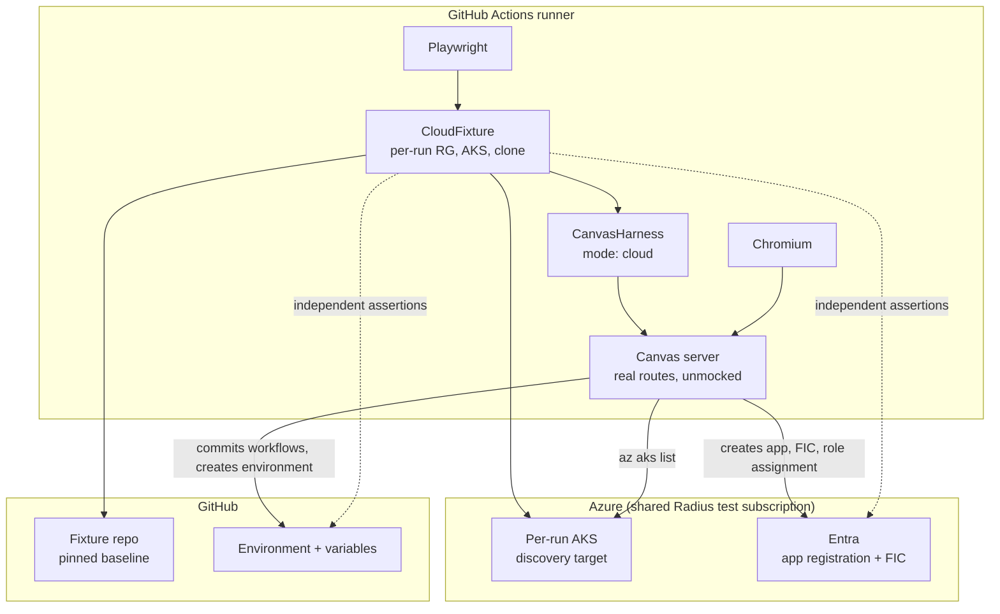

# Cloud end-to-end tests for the environment lifecycle

- **Author**: Nicole James (@nicolejms)
- **Date**: 2026-08

## Overview

The Radius Canvas extension helps a developer model an application and then wires up everything needed to deploy it: it creates an Azure app registration, federates it to GitHub so Actions can authenticate without a stored secret, assigns it a role, creates a GitHub Environment holding the resulting configuration, and commits deployment workflows to the repository. Later it can undo all of that.

Almost every step is an external side effect. Today no test performs any of them for real. Every test layer replaces `gh`, `az`, `rad`, and `kubectl` with a generated fake, so the suite proves the extension *sends* the right commands, never that Azure and GitHub *accept* them or that the resulting credential actually works.

This design adds a twelfth test layer, **Cloud E2E**, that runs the existing browser test harness against real GitHub and real Azure. It is opt-in, never a pull request gate, and reuses the Azure subscription and identity automation the Radius functional tests already use.

No production code changes. The work is a mode switch in the test harness, a fixture that owns per-run cloud resources, a spec directory, and a scheduled workflow.

## Terms and definitions

| Term                       | Definition                                                                                                                                                                                   |
|----------------------------|----------------------------------------------------------------------------------------------------------------------------------------------------------------------------------------------|
| App registration           | An Azure Entra identity. The extension creates one per environment so CI can authenticate to Azure.                                                                                          |
| Federated credential (FIC) | A trust rule letting a specific GitHub Actions job exchange its OIDC token for an Azure token, with no stored secret.                                                                        |
| Bootstrap identity         | The identity the test runner signs in as. It stands in for the signed-in developer the extension expects — not for anything the product creates.                                             |
| Fixture repository         | A dedicated GitHub repository playing the role of the user's application repository during a run.                                                                                            |
| Hermetic                   | A test that touches no network, credential, or mutable external resource. Every layer today is hermetic.                                                                                     |
| Provenance                 | The extension's record of whether it created a credential or found one already there. It decides whether deletion removes or keeps that credential.                                          |
| `wellknown`                | [`radius-project/wellknown`](https://github.com/radius-project/wellknown), the Terraform repository owning Radius test identities and publishing them into repository secrets and variables. |

## Objectives

> **Issue Reference:** [#581](https://github.com/radius-project/ai-extensions/issues/581) — the missing journey coverage for environment deletion. The feature under test is [#303](https://github.com/radius-project/ai-extensions/issues/303).

### Goals

- Prove the create-environment flow works against the real Microsoft Graph, Azure Resource Manager, and GitHub APIs.
- Establish a harness and fixture that the later deploy and deletion stages plug into without redesign.
- Assert cloud state by querying Azure and GitHub directly, never by reading the extension's own status display.
- Reuse Radius's existing test subscription, identity automation, cleanup jobs, and registry instead of building a parallel estate.
- Never run these tests on pull requests, so an Azure or GitHub outage cannot stop anyone from merging.

Success means one thing: a nightly run that fails when the product breaks the cloud contract, and only then.

### Non-goals

- **Testing the agentic modeling flow.** Generating `app.bicep` involves model interaction that is neither deterministic nor cheap. The fixture repository carries a pre-modeled application so the lifecycle stages can be tested in isolation. Modeling keeps its existing hermetic coverage.
- **Making this a required check.** It is slow, costs money, and depends on Azure and GitHub being up. `live-tests.yml` already sets the opt-in, scheduled, non-blocking precedent.
- **Testing AWS.** Azure is where credential provisioning is most involved. AWS follows once the shape is proven.
- **Replacing hermetic tests.** This layer covers only facts that require a real cloud.
- **Deploy and deletion stages.** They ship as follow-up pull requests. Only the environment-deletion stage depends on work that is not yet merged; the deploy and delete-deployment stages do not, for the reasons set out in the development plan.

### User scenarios

#### User story 1

As a maintainer reviewing a change to credential setup, I want evidence that the app registration, federated credential, and role assignment it produces are accepted by Azure and are sufficient for a real workflow to authenticate — not just that the right `az` arguments were assembled.

#### User story 2

As a maintainer reviewing a change to environment deletion, I want evidence that cloud state is genuinely gone, established by querying Azure and GitHub rather than by trusting the extension's completion status.

## User experience (if applicable)

Developer-facing only. The surface is one package script and one environment flag.

**Sample input:**

```bash
# From packages/adapter-canvas. Needs an authenticated `az` session and a GH_TOKEN.
RADIUS_CLOUD_E2E=1 pnpm test:cloud
```

**Sample output:**

```text
Running 1 test using 1 worker
  ✓ [cloud] create environment provisions Azure and GitHub state (214.8s)

  1 passed (3.7m)
```

Without the flag the suite skips rather than fails, so an ordinary `pnpm test` is never broken by absent credentials.

## Design

### High-level design

[`CanvasHarness`](../../packages/adapter-canvas/test/e2e/support/canvas-harness.ts) already owns server lifecycle, temporary directories, credential isolation, `PATH` construction, and `fetch` interception. Going live is therefore not a new harness — it is a switch on the four seams that fake the outside world:

| Seam               | Hermetic mode (today)                                             | Cloud mode (new)                          |
|--------------------|-------------------------------------------------------------------|-------------------------------------------|
| `PATH`             | Prepend a generated fake-CLI directory (`writeFakeCli`, line 222) | Use the real `gh`, `az`, `rad`, `kubectl` |
| `GH_TOKEN`         | A placeholder string (line 1048)                                  | A GitHub App installation token           |
| `globalThis.fetch` | `createHarnessFetch` stubs registry calls (line 785)              | Pass through                              |
| Workspace          | An empty temporary directory (line 1001)                          | A clone of the fixture repository         |

Everything above those seams — browser, renderers, loopback server, route handlers, credential setup — runs unchanged and unmocked. That is what makes this an end-to-end test rather than a second implementation of the product.

A `CloudFixture` sits beside the harness and owns the run's external world: a per-run resource group, a per-run AKS cluster, a repository clone, and the assertions that query Azure and GitHub independently.

### Architecture diagram



### Detailed design

One decision drives everything else: **what is the test fixture allowed to create?**

A cloud test earns its cost only if the state it asserts could not have been true beforehand. If the fixture pre-creates the app registration, credential, or role assignment, then asserting they exist proves nothing — and later asserting they are gone proves the fixture cleaned up, not that the product did.

#### Option 1: Pre-provision cloud state with Terraform

Model the app registration, credential, role assignment, and GitHub Environment in `wellknown` alongside the existing Radius test identities. The test runs the product against known-good infrastructure.

##### Advantages

- Fast and reliable: no Entra propagation delay, no per-run provisioning failures.
- Fits the existing `wellknown` pattern with no new permissions.
- Cheapest possible run.

##### Disadvantages

- It tests nothing that matters. The artifacts the product is responsible for creating already exist, so the assertions are tautologies.
- Deletion assertions become misleading: a passing test is consistent with the product deleting nothing, because the fixture's own teardown removes the same objects.
- A legitimate change to what the extension provisions requires a Terraform change in another repository before the test can go green.

#### Option 2: The fixture provisions only scaffolding

The fixture creates only what the product never creates: a resource group, a cluster for the product to discover, a repository clone, and a bootstrap identity standing in for the signed-in developer. Everything the extension is responsible for is absent at the start, asserted absent, and created solely by the flow under test.

##### Advantages

- Every assertion is a real proof: the artifact was demonstrably absent, then present, and only the product acted in between.
- Deletion assertions stay meaningful in later stages, because the fixture never created what it claims was removed.
- The product's output can change without an infrastructure change in another repository.
- The eventual deploy becomes one high-value assertion: CI authenticates using the credential the product created. A wrong subject, wrong audience, or missing role assignment fails it.

##### Disadvantages

- Slower and less reliable. Entra is eventually consistent; the extension already retries for this reason and the test inherits that latency.
- Needs one new Azure permission, Microsoft Graph `Application.ReadWrite.OwnedBy`, which no Radius test identity holds today.
- A crashed runner can leak Entra objects, requiring cleanup the existing Radius purge does not cover.

#### Proposed option

**Option 2.** Option 1 optimizes run time, which is not the constraint, at the cost of the only thing this tier exists to provide. The new permission is narrow: `OwnedBy` rather than `.All` limits it to applications the identity itself created, which is exactly what each run creates and deletes.

The resulting boundary:

| The fixture creates                               | The product creates — the fixture must not     |
|---------------------------------------------------|------------------------------------------------|
| Per-run resource group `radtest-canvas-<uid>`     | App registration and its service principal     |
| Per-run AKS cluster, purely as a discovery target | Federated credential                           |
| Fixture repository clone at a pinned commit       | Role assignment                                |
| Bootstrap identity                                | The GitHub Environment and its variables       |
| `GH_TOKEN` for the runner                         | Generated workflow files on the default branch |

Two mechanisms enforce it.

**`assertCleanSlate()` runs before the journey starts.** It asserts every right-hand item is absent. This turns later assertions from observations into proofs, and catches a previous run's leaked state before that state silently turns a red test green.

**The bootstrap identity is dedicated, not shared.** The extension repeatedly asks "does the caller already own this application?" — both in the cross-repo picker ([`azure-discovery.ts:71`](../../packages/adapter-canvas/src/server/routes/azure-discovery.ts) runs `az ad app list --show-mine`) and in the ownership checks the setup route makes before reusing an application. If we reused the service principal shared with Radius functional tests, those checks would reason over applications from unrelated repositories. A dedicated identity keeps them scoped to our runs. Note that `--show-mine` is Graph `/me`-backed and so does not apply to a service-principal caller at all; the durable reason for a dedicated identity is the owner comparisons in the setup route, which match against the caller's own object id. The practical consequence is worth stating plainly: under a service-principal caller the cross-repo picker is non-functional, returning `app-list-failed`. It is opt-in and click-only ([`discovery.ts:661`](../../packages/adapter-canvas/src/browser/environment/discovery.ts) is its sole caller, and [`azure-discovery.ts:62`](../../packages/adapter-canvas/src/server/routes/azure-discovery.ts) is a dedicated endpoint that backs nothing else), so the create-new journey never reaches it and the Environment page still renders. This suite therefore says nothing about the picker, and a green cloud run must not be read as evidence that it works.

#### Why a per-run AKS cluster

This is the one place the design departs from Radius practice, so the reasoning is recorded.

No Radius workflow creates an AKS cluster. The cloud functional tests create a **KinD cluster inside the runner** — a Kubernetes distribution that runs locally and costs nothing. The long-running AKS cluster is the only real cluster in the estate; it is Terraform-managed and delete-locked.

Neither pattern works here:

| Pattern                         | Why not                                                                                                                                                                                                                                         |
|---------------------------------|-------------------------------------------------------------------------------------------------------------------------------------------------------------------------------------------------------------------------------------------------|
| KinD in the runner              | Invisible to `az aks list`. [`discovery.ts:140`](../../packages/adapter-canvas/src/server/services/discovery.ts) would find no cluster and the extension would have no name to record. Using KinD means stubbing the discovery code under test. |
| The shared long-running cluster | Long-lived shared state, contention with a 210-minute daily job, and residue indistinguishable from our own during deletion assertions.                                                                                                         |

A per-run cluster is the price of testing the Azure discovery path honestly. The cost is real: roughly 10-12 minutes per run plus a small nightly spend. The smallest node pool suffices, since the cluster is only a deploy target. If that proves too expensive the fallback is a second long-lived cluster dedicated to this suite — trading per-run cost for the shared-state weakness — as a deliberate later decision.

#### The fixture repository

A single long-lived repository, with per-run isolation carried by the Environment name, Kubernetes namespace, and resource group. An ephemeral repository per run would isolate better but requires standing organization-wide rights to create and delete repositories, which is too large a grant for a test tier. The cost of the long-lived choice is honest: the extension commits workflows to the default branch, so a crashed run can leave files behind and cleanup must reset that branch.

Its baseline commit carries a committed `.radius/` directory with `app.bicep`, `bicepconfig.json`, and `app.origin.json` — the set [`app-staging.ts:37`](../../packages/core/src/modeling/app-staging.ts) calls `REQUIRED_STAGED_FILES`.

These are **not** stored in `ai-extensions` and copied in at run time. They are outputs of the modeling flow this suite does not test, so relative to the stages under test they are input, like application source code. Committing them to the fixture repository also tests more:

- The product reads `bicepconfig.json` from the repository's own `.radius/` directory ([`workspace.ts:664`](../../packages/adapter-canvas/src/workspace.ts)), falling back to a built-in default only when none exists. Copying one in from test data would exercise the fallback rather than the path a real user hits.
- `app.origin.json` carries provenance. Fabricating provenance is the one thing this suite must never do, since deletion keys destructive decisions off it.

The cost is cross-repository atomicity: a product change needing an `app.bicep` change cannot land in one pull request. Mitigated by pinning the baseline commit SHA in a single `ai-extensions` constant, so updating the application is a deliberate, reviewable SHA bump — and that SHA doubles as the cleanup reset target. A conformance check asserts the pinned baseline still has the three files and still compiles, so an upstream Radius change cannot silently rot the fixture into an unexplained overnight failure.

##### What the baseline commit contains

| Path                       | Purpose                                                                                                                                                                                                                                                                                                                                                                                                        |
|----------------------------|----------------------------------------------------------------------------------------------------------------------------------------------------------------------------------------------------------------------------------------------------------------------------------------------------------------------------------------------------------------------------------------------------------------|
| `.radius/app.bicep`        | The pre-modeled application. Kept to one container on a publicly pullable image, so the fixture needs no registry credentials and each run stays cheap. It must render at least one Kubernetes Deployment that reaches ready, because the deploy stage asserts `availableReplicas >= 1` — an application that applies cleanly but can never run would fail the suite for a reason that reads as a product bug. |
| `.radius/bicepconfig.json` | Read from the repository itself ([`workspace.ts:664`](../../packages/adapter-canvas/src/workspace.ts)). A file copied in at run time would exercise the built-in fallback instead of the path a user hits.                                                                                                                                                                                                     |
| `.radius/app.origin.json`  | Provenance. Deletion keys destructive decisions off it, so it is committed like source, never fabricated.                                                                                                                                                                                                                                                                                                      |
| `README.md`                | States that the repository is machine-owned, that `ai-extensions` pins its default-branch SHA, and that any commit or open pull request breaks the suite until that pin is bumped.                                                                                                                                                                                                                             |

Nothing else. In particular the baseline carries no `.github/workflows/` — publishing those is the behaviour under test, and a pre-existing copy would let a run pass without the product having done anything — and no `.github/dependabot.yml`.

The fixture repository also needs **no** pre-provisioned GHCR state package, which is worth stating because it is an easy and unsatisfiable thing to add to a prerequisites list. [`stateRegistryForEnvironment`](../../packages/core/src/workflows/state.ts) derives the state repository per environment as `{repo}-radius-state-{env-slug}-{hash}`, hashing the owner, repository, and environment name together — so for a per-run environment the package name does not exist until the run creates it. GHCR brings a repository into being on first push, and the verify step this extension substitutes probes push *permission* by starting a blob upload and requiring HTTP 202 ([`infra.ts:383`](../../packages/adapter-canvas/src/infra.ts)), which is non-destructive and succeeds for a repository that does not yet exist.

##### Repository settings

Two facts drive most of these. The clean-slate probe compares the default-branch head against the pinned SHA, and it treats **any** open pull request as a leak — `pulls?state=open`, unfiltered by author or branch.

| Setting                                 | Value                                 | Why                                                                                                                                                                                                                                                         |
|-----------------------------------------|---------------------------------------|-------------------------------------------------------------------------------------------------------------------------------------------------------------------------------------------------------------------------------------------------------------|
| Default branch                          | `main`, frozen at the pinned baseline | The probe compares its head to the pinned SHA.                                                                                                                                                                                                              |
| Branch protection and rulesets          | **None** on the default branch        | The product commits workflow files straight to it. Protection would divert every run onto the pull-request fallback, so the suite would quietly stop testing the path it claims to cover. Cleanup also resets the branch to the baseline.                   |
| Dependabot version and security updates | **Disabled**                          | One Dependabot pull request makes every run report a leak and fail.                                                                                                                                                                                         |
| Actions                                 | Enabled                               | Deployment dispatches the published workflows. Safe to leave on: the product refuses to publish a workflow triggered by anything but `workflow_dispatch` ([`infra.ts:191`](../../packages/adapter-canvas/src/infra.ts)), so committing them starts nothing. |
| Issues, projects, wiki, discussions     | Disabled                              | Nothing reads them, and they invite human activity the pinned baseline cannot tolerate.                                                                                                                                                                     |
| Merge queue                             | Disabled                              | It creates refs and runs that the probes would report as leaks.                                                                                                                                                                                             |
| Automatically delete head branches      | Enabled                               | Cheap insurance against a leaked `radius/setup-*` fallback branch.                                                                                                                                                                                          |
| Human write access                      | None                                  | A human commit silently breaks every run until someone bumps the pinned SHA.                                                                                                                                                                                |

##### GitHub App permissions

The dedicated App is installed on this repository alone. It needs to commit workflow files, manage the Environment and its variables, poll dispatched runs, and clean up after the fallback path:

| Permission    | Level | Used for                                                                                                   |
|---------------|-------|------------------------------------------------------------------------------------------------------------|
| Contents      | write | Committing workflows to the default branch, and resetting that branch to the baseline during cleanup.      |
| Workflows     | write | Required for any commit touching `.github/workflows/`. Without it the product silently takes the fallback. |
| Environments  | write | Creating and deleting the Environment.                                                                     |
| Variables     | write | Writing the environment variables the journey asserts.                                                     |
| Actions       | read  | Polling dispatched workflow runs.                                                                          |
| Pull requests | write | The fallback path, and closing what it leaves behind.                                                      |

Confirm each name against the REST documentation for the endpoint before creating the App — the table states the capability required, and GitHub has split some of these into separate permissions over time.

#### Two product behaviours the fixture must respect

Both were found by reading the production code, and both would otherwise cause a leaked run to report clean.

**The application name is repository-scoped, so runs must serialize.** [`azure-auto-setup-application.ts:99`](../../packages/adapter-canvas/src/server/routes/azure-auto-setup-application.ts) derives the Entra application name as `radius-deploy-<owner>-<repo>`, with no environment and no unique id. Two runs against one fixture repository therefore contend for a single application. The fixture must not work around this by making the name unique per run — the product owns that derivation, and overriding it in test would exercise something no user ever runs. Runs serialize through a `concurrency` group instead, and cleanup must never delete an application a concurrent run is still using.

**Workflow publication has two paths, and only one touches the default branch.** When the token lacks `workflow` scope the product does not commit to the default branch at all; it creates a `radius/setup-<env>-workflows-<suffix>` branch and opens a pull request ([`create-environment-workflow-committer.ts:230`](../../packages/adapter-canvas/src/server/routes/create-environment-workflow-committer.ts)). So a clean-slate or leak check that compares only the default-branch head to the pinned baseline reports clean while a branch and an open pull request leak; those checks must cover both. It also means the end-to-end GitHub App must hold `workflows: write`. Without it the journey quietly takes the pull-request path and passes without ever testing the committed-workflow path it claims to cover — a green run proving the wrong thing.

The fallback branch name is only partly derivable, so assert its `radius/setup-<env>-workflows-` prefix rather than an exact name. The suffix is the operation id with its `op_` prefix removed and truncated to twelve characters, but it falls back to a timestamp when no mutation-recovery context is present, and a previously recorded branch takes precedence over the derived one ([`create-environment-workflow-committer.ts:211`](../../packages/adapter-canvas/src/server/routes/create-environment-workflow-committer.ts)).

#### What the product writes into the GitHub Environment

Stage one asserts these, so they are recorded here rather than rediscovered per layer. [`create-environment-workflow-publisher.ts:164`](../../packages/adapter-canvas/src/server/routes/create-environment-workflow-publisher.ts) writes seven variables: `AZURE_CLIENT_ID`, `AZURE_TENANT_ID`, `AZURE_SUBSCRIPTION_ID`, `AZURE_RESOURCE_GROUP`, `AZURE_AKS_CLUSTER_NAME`, `AZURE_LOCATION`, and `KUBERNETES_NAMESPACE`.

The cluster variable is `AZURE_AKS_CLUSTER_NAME`, not `AKS_CLUSTER_NAME`. The shorter name is an easy assumption to write and a live run is the only thing that would catch it, which is precisely the feedback this tier is slowest to give.

Those seven are not the whole set, and the omission matters beyond bookkeeping. [`create-environment.ts:723`](../../packages/adapter-canvas/src/server/routes/create-environment.ts) writes four more unconditionally — `RADIUS_MANAGED`, `RADIUS_STATE_BACKEND`, `RADIUS_STATE_REGISTRY`, and `RADIUS_STATE_ARCHIVE` — plus `RADIUS_CREDENTIAL_PROFILE` when the environment was created from a named profile. The three `RADIUS_STATE_*` values form one backend contract and are written in a single mutation attempt for that reason: a backend selected without the registry and archive needed to read it is a broken environment, not a partially configured one.

The deploy and delete workflows **require** that set. Without it `rad startup` fails before it reaches `rad deploy`, so these are not variables stage one merely happens to write — they are a precondition of stages two and three. A journey that asserted only the seven Azure variables would report a healthy environment that cannot deploy.

### API design (if applicable)

No public API change. No route, canvas action, tool, `plugin.json` entry, or `packages/core` export is added or modified. The new surfaces are test-internal:

```ts
// canvas-harness.ts — additions to CanvasHarnessOptions
/** Defaults to "fake", so every existing suite is unaffected. */
readonly mode?: "fake" | "cloud";
/** Cloud mode only: a real clone to run against. */
readonly workspacePath?: string;
```

```ts
// cloud-fixture.ts
export interface CloudFixture {
  readonly uniqueId: string;
  readonly resourceGroup: string;
  readonly clusterName: string;
  readonly environmentName: string;
  readonly workspacePath: string;

  assertCleanSlate(): Promise<void>;
  assertAppRegistrationExists(): Promise<string>;
  assertFederatedCredentialExists(subject: string): Promise<void>;
  assertRoleAssignmentExists(principalId: string): Promise<void>;
  assertGitHubEnvironmentExists(): Promise<void>;
  dispose(): Promise<void>;
}
```

### Implementation details

#### Core package — packages/core (if applicable)

N/A. No change. `REQUIRED_STAGED_FILES` is read by tests but not modified.

#### Canvas adapter — packages/adapter-canvas (if applicable)

No production change. Test-only:

- `canvas-harness.ts` gains `mode` and `workspacePath`. Cloud mode skips fake-CLI generation, the `PATH` prepend, and `fetch` interception, and takes `GH_TOKEN` from the environment. Credential-store isolation stays active in both modes, so a cloud run still never reads a developer's real credentials.
- `test/e2e-cloud/` holds the fixture, the pinned baseline constant, the conformance check, and the specs. Playwright specs there must be named `*.cloud.spec.ts`. `vitest.config.ts` collects `test/e2e-cloud/**/*.test.ts`, so a spec named `.test.ts` is picked up by Vitest, which cannot run it. The two file sets share a directory and are separated only by this naming rule.
- `playwright.cloud.config.ts` mirrors the existing config with its own output directory, `retries: 0` because later stages are destructive, and a longer timeout. Add it to the `lint` script's file list in the same change — that script enumerates config files by name, so a new one is silently unlinted until it is listed.
- `package.json` gains `test:cloud`.

#### Shared adapter — packages/adapter-shared (if applicable)

N/A. No change.

#### Plugin — plugins/radius (if applicable)

N/A. No change.

#### Build & packaging (if applicable)

- `.github/workflows/cloud-e2e.yml`: `schedule` and `workflow_dispatch`, with `merge_group` deliberately deferred rather than adopted (see the open question below). Deliberately not `pull_request_target` — Radius needs it because cloud tests gate its pull requests; ours do not, and omitting it removes the fork supply-chain risk entirely.
- A small cleanup workflow for what the Radius purge cannot cover: leaked Entra applications older than six hours, stale Environments, and resetting the fixture default branch.
- Resource groups are deliberately not swept by us. Radius's purge job already deletes groups matching `^radtest-` older than six hours, twice daily, in this subscription. Naming ours `radtest-canvas-<uid>` makes that our safety net for free. This is a cross-repository dependency and is recorded as one.

The two published Actions variables are consumed differently, and the difference is deliberate:

- `AIEXT_CLOUD_E2E_AZURE_LOCATION` is a real input. The suite reads it through `resolveFixtureLocation()` and falls back to a compiled default when it is unset. The region is validated for shape only — never against an allow-list, because Azure adds regions and a strict rule would fail the nightly run for a reason unrelated to the product.
- `AIEXT_CLOUD_E2E_FIXTURE_REPOSITORY` is **not** an input to the suite. The fixture repository is pinned in source so a mutable Actions variable cannot silently repoint the tests at a different repository; the variable exists as a consistency check against that pin and as the cleanup workflow's signal that there is anything to purge. Changing the suite to read it directly would defeat the pinning, so treat that as a regression rather than a cleanup.

Upstream `wellknown` changes, which gate CI but not local development:

1. Add a dedicated bootstrap identity as a *second instance* of the `entra` submodule, rather than a new key in the shared `github_repositories` map, federating `ai-extensions` on `main` only and holding subscription `Contributor`, `Role Based Access Control Administrator`, and Graph `Application.ReadWrite.OwnedBy`. A separate instance is what keeps the Graph grant off the shared Radius identity, which is the entire point of having a dedicated one. Pull-request and merge-queue federation stay off: this identity holds subscription `Contributor`, RBAC administration, and a Graph grant, and pull-request federation would let a workflow triggered from any pull request mint a token for it.
2. Add `ai-extensions` to the existing additional-secrets map, already used for another repository.
3. Add a matching additional-variables map. Secrets already fan out to extra repositories; variables are hard-bound to one. This is the only genuinely missing capability.

Three prerequisites surfaced while grounding those changes. Each blocks the apply rather than the pull request:

- **The Terraform deploy identity cannot currently grant an app role.** The grant pattern itself is already established — `00-tfbackend` grants five Graph roles to the bootstrap service principal, `Application.ReadWrite.OwnedBy` among them — so this change mirrors an existing file rather than inventing a pattern. But that set omits `AppRoleAssignment.ReadWrite.All`, and the identity that applies `20-functional-tests` is that same service principal, so the new assignment fails with `Authorization_RequestDenied` until the role is added. Adding it is itself a privilege escalation worth reviewing on its own terms, since it permits granting any application permission to any application tenant-wide. The alternative is a tenant admin creating that single assignment out of band and leaving it unmanaged, trading reproducibility for a much smaller blast radius.
- **The GitHub App token used by the Terraform workflow is repository-scoped and excludes `ai-extensions`.** Fanning secrets or variables out to it fails until the repository is added to that list *and* the App is installed on it. Terraform cannot install an App, so that half is manual and will present as a confusing 404 rather than a permission error. Note what the installation costs: managing the OIDC subject-claim template requires `administration:write`, which is repository-settings write on a production repository. That is a deliberate grant, not routine plumbing, and belongs in the same review as the Graph consent.
- **Federating `ai-extensions` changes its repository-wide OIDC subject format.** The `entra` submodule hardcodes subjects of the form `repository_owner_id:<id>:repository_id:<id>:<context>`, and its credentials only match when the customization template is managed for that repository. This is a consequence of reusing the submodule, not a setting we can decline. See the risks table.

### Error handling

| Scenario                         | Handling                                                                                                                                                                                                                                                                                                                                                                |
|----------------------------------|-------------------------------------------------------------------------------------------------------------------------------------------------------------------------------------------------------------------------------------------------------------------------------------------------------------------------------------------------------------------------|
| Credentials absent or flag unset | The suite **skips**, matching the `describe.skipIf` convention in the existing `live-tests.yml` suites. `pnpm test` is never broken.                                                                                                                                                                                                                                    |
| Fixture repository unpublished   | The scheduled workflow **skips and passes** rather than failing. While the upstream prerequisites are outstanding, a nightly failure would be unfixable from inside this repository and would train readers to ignore the alert this tier depends on. A value that is set but malformed still fails, because that is a real mistake rather than an absent prerequisite. |
| `assertCleanSlate()` fails       | Fail immediately, naming the artifact found. This is leaked state, not a product regression, and the message says so to keep triage honest.                                                                                                                                                                                                                             |
| AKS provisioning fails           | Fail fast with the `az` error attached; classified as infrastructure, not a product regression.                                                                                                                                                                                                                                                                         |
| Entra propagation delay          | The product already retries. Fixture assertions poll with a bounded timeout rather than reading once.                                                                                                                                                                                                                                                                   |
| Test crashes mid-run             | `dispose()` runs from an `always()` teardown. If the runner dies outright, the Radius purge reclaims the resource group and the cleanup workflow reclaims Entra and GitHub state.                                                                                                                                                                                       |
| Fixture branch left dirty        | Cleanup resets it to the pinned baseline. Runs serialize through a `concurrency` group with `cancel-in-progress: false`.                                                                                                                                                                                                                                                |
| Token scope silently degraded    | Without `workflows: write` the product takes the pull-request path and the journey passes without ever committing workflows. The spec asserts the files exist **on the default branch**, so this fails loudly instead of passing hollowly.                                                                                                                              |

## Test plan

This design is itself a test plan, so this section covers how the new test code is validated.

- **Harness cloud mode** is unit-tested hermetically: `mode` defaults to `"fake"`, fake mode is unchanged, cloud mode skips fake-CLI generation and `PATH` injection, cloud mode leaves `fetch` alone, `GH_TOKEN` comes from the environment, and credential isolation holds in both modes.
- **The conformance check** asserts the pinned baseline contains the required files and compiles.
- **The fixture's assertions** are thin wrappers over `az` and `gh`, so there is little logic to unit test. Their real risk is a false negative, which `assertCleanSlate()` mitigates by proving each assertion can tell present from absent within a single run.
- **The journey spec** is the deliverable, run nightly and on demand.

New challenges this introduces: live credentials in a browser test, a shared subscription whose quota we consume, eventual consistency in Entra, and a mutable fixture repository. Each is addressed above.

This tier deliberately breaks a rule stated for every change in [the test plan](./2026-08-radius-canvas-test-plan.md): *"Keep tests local and repeatable. Do not use personal credentials, live cloud resources, mutable repositories, or public network assets."* That rule is right for the eleven hermetic layers and is not weakened there. It is scoped to those layers with an explicit carve-out here, so the exception is recorded rather than implied.

## Security

| Threat                                              | Mitigation                                                                                                                                                                                                                                                                                                                                                                                                                                                                                                                                                                                                                      |
|-----------------------------------------------------|---------------------------------------------------------------------------------------------------------------------------------------------------------------------------------------------------------------------------------------------------------------------------------------------------------------------------------------------------------------------------------------------------------------------------------------------------------------------------------------------------------------------------------------------------------------------------------------------------------------------------------|
| Fork pull requests exfiltrating credentials         | No `pull_request_target`. Triggers never run untrusted fork code with secrets, and a repository guard stops forks spending our quota.                                                                                                                                                                                                                                                                                                                                                                                                                                                                                           |
| Long-lived cloud secrets in CI                      | None exist. Azure uses OIDC; GitHub uses a short-lived App installation token, the pattern already used in `release.yml`.                                                                                                                                                                                                                                                                                                                                                                                                                                                                                                       |
| Over-broad GitHub privilege                         | A dedicated App scoped to the fixture repository, rather than broadening the existing org-wide App whose consumers only need read access.                                                                                                                                                                                                                                                                                                                                                                                                                                                                                       |
| Over-broad Azure privilege                          | `Application.ReadWrite.OwnedBy` rather than `.All`, on a dedicated identity so the grant stays off the shared Radius one.                                                                                                                                                                                                                                                                                                                                                                                                                                                                                                       |
| Customized OIDC subject breaking release provenance | Federating `ai-extensions` switches its repository-wide OIDC subject template, and the repository signs build provenance with `actions/attest`. `radius` already runs with this template but does not use `actions/attest`, so the combination is unproven in this organization. Sigstore identifies a workload by `job_workflow_ref`, not by `sub`, so no interaction is expected — that is reasoning, not evidence. Validate by publishing to edge and verifying the attestation before the cloud tier is depended on. Reverting is the removal of one resource and disables only the new federation, never the release path. |
| Runner credentials reaching the fixture repository  | `AZURE_CLIENT_ID` names the bootstrap identity in CI and the product-created application inside the fixture repository. Same name, different repositories, different identities. If the bootstrap value ever reached the fixture Environment, every stage would authenticate as the privileged identity and pass while proving nothing. The journey asserts the Environment's value is the created application and not the bootstrap one.                                                                                                                                                                                       |
| Secrets in test artifacts                           | Traces capture network traffic and upload on failure; existing credential isolation and redaction assertions stay active in cloud mode.                                                                                                                                                                                                                                                                                                                                                                                                                                                                                         |
| Destructive operations against the wrong scope      | Every resource lives in a per-run resource group with a run-derived name. Teardown targets that group by name, never by wildcard.                                                                                                                                                                                                                                                                                                                                                                                                                                                                                               |

## Compatibility (optional)

No product compatibility impact: no production code changes, so nothing reaches users.

Existing tests are unaffected because `mode` defaults to `"fake"` and every current suite omits it.

One compatibility risk is worth naming: if the Radius purge job's prefix list changes, our safety net disappears silently. The design records the dependency, and the resource group name matches an existing prefix rather than adding one that would need an upstream change.

## Monitoring and logging

- Traces, `az` and `gh` logs, and the failing workflow's logs upload as artifacts on failure.
- A failure-to-issue job files an issue when a scheduled run fails, copying the pattern already used in `canvas-functional.yml`, so overnight failures are not found by accident.
- Job timeout is set above the Playwright timeout, so the trace is written before GitHub cancels the job — otherwise the most useful diagnostic is exactly what gets lost.
- Triage separates three classes, because conflating them destroys the signal: product regression, infrastructure failure, and leaked state.

## Development plan

A stack of pull requests, each independently mergeable and leaving the repository green.

1. **Foundation.** This doc, the test-plan amendment, and the twelfth layer in the architecture doc. No code.
1. **Harness cloud mode.** `mode` and `workspacePath`, fully unit-tested. Hermetic; no cloud needed to review.
1. **Cloud fixture.** `cloud-fixture.ts`, `assertCleanSlate()`, the pinned baseline, and the conformance check.
1. **Service-principal identity support.** Teach the setup route to resolve a caller that is a service principal as well as one that is a user, with hermetic tests for both. The only production change in the stack, and a prerequisite for any journey run by a CI runner.
1. **Create-environment journey.** Stage one end to end, plus the Playwright config and script.
1. **CI.** The scheduled workflow, the cleanup workflow, and the runbook.
1. **Deploy and delete-deployment journeys.** Stages two and three.
1. **Delete-environment journey.** Stage four. Deferred until environment-deletion work is merged.

Upstream `wellknown` changes gate step 6 only. Steps 2 through 5 can be developed against a personal subscription, and steps 2 through 4 need no cloud access at all.

Splitting the last step is deliberate, because treating deletion as one unit would defer more than the dependency justifies. Deleting a deployment and deleting an environment are separate route families with separate owners: [`deployments.ts:784`](../../packages/adapter-canvas/src/server/routes/deployments.ts) registers `POST /api/delete-deployment`, and [`environments.ts:864`](../../packages/adapter-canvas/src/server/routes/environments.ts) registers `POST /api/delete-environment`. The pending environment-deletion work changes the environments family and adds two services beneath it, but touches no file in the deployments family. Its only contact with the deploy path is an optional `correlationId` argument added to `findWorkflowRun`, which is inert when omitted. Stages two and three are therefore unblocked; only stage four genuinely waits, because the cloud cleanup it asserts is precisely what that work introduces.

One deliverable of step 3 is deliberately left unwired. `baseline-conformance.ts` is written and unit-tested but no journey calls it, because `compileBaselineWorkspace()` reaches `buildGraphViaRad` and therefore needs a real `rad` binary on the runner — which step 6 concluded was unnecessary and did not install. Recording this as a deferral rather than leaving it to read as an oversight: activating the conformance check is a step 6 change to the runner image before it is a journey change, and any later stage that renders a planned graph inherits the same requirement.

## Open questions

1. **Is `Application.ReadWrite.OwnedBy` enough when the caller is a service principal rather than a user?** Two risks were folded together here. The identity half is resolved; the permission half is now largely answered from documentation and from the product's own code, leaving a narrow timing risk. The *identity* risk is understood: `az ad signed-in-user show` ([`azure-auto-setup-application.ts:161`](../../packages/adapter-canvas/src/server/routes/azure-auto-setup-application.ts)) calls Microsoft Graph `/me`, which does not exist for a service principal, and the route fails closed rather than falling back — so Create Environment aborts with `app-owner-lookup-failed`. Step 4 of the development plan fixes that by resolving the principal type from `az account show` and taking the object id from `az ad sp show` for a service principal. On permission, [Microsoft's note for the grant](https://learn.microsoft.com/en-us/graph/permissions-reference) says it allows the same operations as `Application.ReadWrite.All`, but only on applications and service principals the caller owns, and additionally allows tenant-wide `GET /applications` and `GET /servicePrincipals`. A service principal that creates an application is automatically added as its owner, and the route already assumes exactly that: [`azure-oidc.ts:268`](../../packages/adapter-canvas/src/azure-oidc.ts) records that creating an app commonly auto-assigns the creator as owner, so the explicit owner-add legitimately reports "already exists" and the owner-list check then confirms it. Every later Entra call in the flow (owner add and list, federated-credential list, create, show, update and delete, tag read, app delete) targets that owned application, and the tenant-wide read allowance covers both the reuse-path lookups and `az ad sp show`. What is left is timing rather than authorization: Entra replication for a newly created application. The product already retries propagation lag ([`azure-auto-setup-credentials.ts:599`](../../packages/adapter-canvas/src/server/routes/azure-auto-setup-credentials.ts)), so this is a tuning risk rather than a blocker. Confirm on a personal subscription before proposing the Terraform change.
1. **Should the fixture repository live in `radius-project` or a test-only organization?** `radius-project` keeps the App installation narrow but puts a deliberately mutable repository beside production ones.
1. **What nightly spend is acceptable?** The per-run cluster dominates. If it is too expensive, the second long-lived cluster alternative should be revisited.
1. **Should `merge_group` be a trigger initially?** **Resolved: no.** It gives pre-merge signal but makes the merge queue depend on Azure availability, and an outage would then block merges rather than merely lose a night's signal. Step 6 ships `schedule` and `workflow_dispatch` only. Adding `merge_group` later is a one-line change once the tier has a track record, so the conservative order costs nothing and the reverse would be disruptive.

## Alternatives considered

- **Record and replay live traffic.** Capture real responses once, replay hermetically. Rejected: it proves the extension parses recorded responses, not that the cloud accepts current requests, and recordings rot silently as APIs change. It is a better fake, not an end-to-end test.
- **Test against KinD instead of AKS.** Rejected above: invisible to `az aks list`, so it requires stubbing the code under test.
- **Reuse the long-running cluster.** Rejected: shared state weakens deletion assertions and it is contended by a long daily job.
- **Ephemeral fixture repository per run.** Cleanest isolation, rejected on privilege: it needs standing organization-wide repository administration.
- **Reuse the existing org-wide GitHub App.** Rejected: it would broaden a widely installed App from read scopes to write scopes for one test tier.
- **Reuse the shared Radius service principal.** Rejected on correctness: the setup route's ownership checks would match applications owned by that identity for unrelated repositories.
- **Drive the journey over HTTP instead of a browser.** Faster and less flaky, but it would not close the browser-owned journey gap recorded in [`phase-6-traceability.md`](../../packages/adapter-canvas/test/e2e/phase-6-traceability.md), which is the coverage this work exists to provide.

## Design review notes

<!-- To be completed during design review. -->
