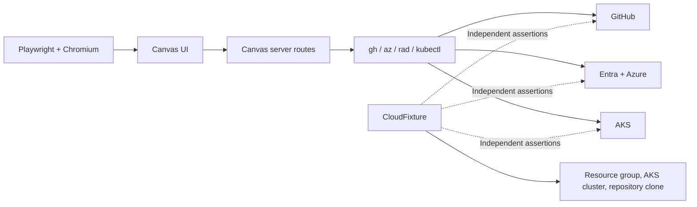

# Cloud end-to-end tests for the environment lifecycle

- **Author:** Nicole James (@nicolejms)
- **Date:** 2026-08
- **Status:** Implementing

## Summary

Radius Canvas creates and deletes infrastructure across GitHub, Microsoft Entra, Azure, and Kubernetes. The existing test layers replace those systems with fakes. They verify that Canvas builds the expected commands, but they cannot verify that the real services accept those commands or that the resulting credentials and workloads function.

The Cloud E2E tier closes that gap. It drives the normal Canvas UI in Chromium, runs the real server routes and command-line tools, and verifies the resulting state through independent Azure, GitHub, and Kubernetes queries.

The tier is intentionally:

- **Narrow:** it covers the environment and deployment lifecycle, not application modeling.
- **Non-blocking:** it runs on a schedule or by manual dispatch, never as a pull request requirement.
- **Serialized:** lifecycle stages share state and include destructive operations.
- **Fail-closed:** missing prerequisites, ambiguous ownership, or unreadable cloud state cannot produce a passing result.

## Why this test layer is needed

Creating an environment has several external side effects:

1. Canvas creates or reuses a repository-scoped Entra application and service principal.
2. Canvas creates environment-scoped federated credentials so GitHub Actions can authenticate to Azure without a stored secret.
3. Canvas assigns the Azure roles needed by deployment workflows.
4. Canvas creates a GitHub Environment, writes its variables, and commits workflow files.
5. A deployment workflow uses that configuration to deploy the application to AKS.

Hermetic tests can verify each command and response-handling branch, but they cannot prove that the complete contract works across service boundaries. For example, a syntactically correct federated credential can still have the wrong subject, and a successful workflow dispatch can still produce no runnable workloads.

Cloud E2E complements rather than replaces the hermetic tests. Decision logic remains unit-tested on every pull request; the cloud tier verifies only behavior that requires real external systems.

## Scope

### Goals

- Prove that Canvas can create an environment against real GitHub and Azure APIs.
- Prove that the generated credentials can deploy a real application to AKS.
- Prove that Canvas refuses to delete an environment while it has an active deployment.
- Prove that deployment deletion removes only deployment-owned state.
- Prove that environment deletion removes only environment-owned state.
- Verify cloud state independently instead of trusting Canvas status messages.
- Reuse the existing Radius test subscription, identity automation, registry, and cleanup conventions.

### Non-goals

- Testing model-driven `app.bicep` generation. The fixture repository contains a pinned, pre-modeled application.
- Testing AWS.
- Replacing unit, integration, component, or hermetic browser tests.
- Running against pull requests or merge queues.
- Proving the optional cross-repository "use an existing application" picker works for a service-principal caller.

## Terms

| Term                       | Meaning                                                                                                                                           |
|----------------------------|---------------------------------------------------------------------------------------------------------------------------------------------------|
| Bootstrap identity         | The Azure identity used by the test runner. It represents the signed-in developer and is not created by Canvas.                                   |
| Cloud fixture              | Test support that provisions scaffolding, owns cleanup, and queries external systems independently of Canvas.                                     |
| Federated credential (FIC) | An Entra trust rule that lets a specific GitHub Actions subject exchange an OIDC token for an Azure token without storing a client secret.        |
| Fixture repository         | A dedicated GitHub repository containing the pinned application baseline used by the test.                                                        |
| Product-owned state        | State Canvas is responsible for creating or deleting, such as the GitHub Environment, workflows, federated credentials, and deployment workloads. |
| Scaffolding                | State the test needs but Canvas does not create, such as the resource group, AKS cluster, repository clone, and repository lease.                 |

## Lifecycle under test

The final journey contains five ordered stages in one serial Playwright suite. A later stage runs only after the earlier state has been observed successfully.

| Stage                                 | User action                                                  | Independent proof                                                                                                                                                                                                                                                   |
|---------------------------------------|--------------------------------------------------------------|---------------------------------------------------------------------------------------------------------------------------------------------------------------------------------------------------------------------------------------------------------------------|
| 1. Create environment                 | Create an Azure environment in Canvas                        | The expected Entra application, service principal, federated credentials, exact role assignments, GitHub Environment, variables, and workflow files exist. The workflow files are present on the default branch rather than only on a fallback pull request branch. |
| 2. Deploy application                 | Deploy the fixture application through Canvas                | The dispatched workflow reaches a successful terminal state; the expected Radius-labelled Kubernetes Deployment and Pods exist and are ready; Canvas lists the deployment.                                                                                          |
| 3. Reject unsafe environment deletion | Try to delete the environment while the deployment is active | Canvas returns HTTP 409 with `app-deployed`; the GitHub Environment and AKS workloads remain.                                                                                                                                                                       |
| 4. Delete deployment                  | Delete the deployment through Canvas                         | Canvas no longer lists the deployment; the Radius-labelled Deployment and Pods are absent; the GitHub Environment, its exact variables, the Entra application, service principal, federated credentials, and role assignments are unchanged.                        |
| 5. Delete environment                 | Delete the now-unused environment through Canvas             | The GitHub Environment and every federated credential observed in stage 1 are absent. The same repository-scoped Entra application and service principal remain, with the complete Contributor and AKS RBAC Cluster Admin assignment inventory unchanged.           |

Stages 2 through 4 are implemented in #665. The stricter stage 5 identity proof is implemented in the stacked #666.

## Architecture

Cloud E2E reuses [`CanvasHarness`](../../packages/adapter-canvas/test/e2e/support/canvas-harness.ts). Cloud mode changes only the seams that make normal tests hermetic:

| Boundary              | Hermetic mode                                    | Cloud mode                                   |
|-----------------------|--------------------------------------------------|----------------------------------------------|
| Commands              | Generated `gh`, `az`, `rad`, and `kubectl` fakes | Real installed tools                         |
| GitHub authentication | Placeholder token                                | Short-lived, fixture-scoped GitHub App token |
| Network               | Selected `fetch` calls are intercepted           | Requests pass through                        |
| Workspace             | Empty temporary directory                        | Clone of the pinned fixture repository       |

The browser, page renderers, loopback server, route handlers, and credential flows are otherwise unchanged.



The cloud-specific decision logic lives in small support modules under [`packages/adapter-canvas/test/e2e-cloud/support`](../../packages/adapter-canvas/test/e2e-cloud/support). Those modules use injected command ports, so their parsing, ownership, timeout, and cleanup branches remain hermetically testable on every pull request.

## Fixture ownership

The fixture follows one rule: **it must not create the state that the test claims Canvas created.**

The fixture creates:

- A uniquely named resource group.
- A one-node AKS cluster for Canvas to discover.
- A clone of the fixture repository at an exact source pin.
- A repository lease that prevents a local run and CI from mutating the fixture concurrently.

Canvas creates:

- The repository-scoped Entra application and service principal.
- Environment-scoped federated credentials.
- Contributor and AKS RBAC Cluster Admin role assignments.
- The GitHub Environment and its variables.
- Deploy and delete workflow files.
- The deployed Radius application and Kubernetes workloads.

Before opening Canvas, `assertCleanSlate()` checks that no product-owned artifact is already present. This absence-before-presence check prevents leaked state from turning a broken create operation into a false pass.

Fixture teardown and product assertions are separate:

- `dispose()` removes only fixture-owned scaffolding.
- `reclaimLeakedProductArtifacts()` is best-effort cleanup for product state left after assertions or failures.
- Cleanup failures are reported rather than hidden.

## Fixture repository baseline

The fixture is the private [`radius-project/ai-extensions-fixture`](https://github.com/radius-project/ai-extensions-fixture) repository, used only by Cloud E2E. It is not an application-modeling sample and does not need application source or a Dockerfile. Its default branch is `main`, GitHub Actions must be enabled, GitHub's default OIDC subject customization must be unchanged, and branch protection must allow the Cloud E2E GitHub App to write the generated workflow files directly to the default branch.

The pinned baseline contains one Radius application, one container, and one managed PostgreSQL database. Application discovery remains unambiguous, while deployment exercises both Kubernetes workload creation and the cloud permissions required to provision a backing service. The container does no useful work; it runs a stable process from an image pinned by digest.

The required baseline layout is:

```text
.
└── .radius/
    ├── app.bicep
    ├── app.origin.json
    └── bicepconfig.json
```

Additional files are allowed, but the three files above are mandatory because they are the base set published by the application-modeling workflow. The live baseline-conformance test checks that all three exist, compiles `.radius/app.bicep` with the committed `.radius/bicepconfig.json`, and rejects a model that compiles to no Radius resources.

The fixture repository's `README.md` is the maintenance authority for changing this baseline. It distinguishes the model provenance values from the final fixture commit used here and gives the exact update and conformance commands.

### `.radius/app.bicep`

```bicep
extension radius

@description('The Radius Environment ID. Injected by the deployment workflow.')
param environment string

@description('The deployment-generated managed PostgreSQL administrator password.')
@secure()
param postgresPassword string = 'Aa1!${newGuid()}'

resource app 'Radius.Core/applications@2025-08-01-preview' = {
  name: 'cloud-e2e'
  location: 'global'
  properties: {
    environment: environment
  }
}

resource postgres 'Radius.Data/postgreSqlDatabases@2025-08-01-preview' = {
  name: 'cloud-e2e-postgres'
  location: 'global'
  properties: {
    application: app.id
    environment: environment
    codeReference: '.radius/app.bicep'
    database: 'cloude2e'
    username: 'cloude2eadmin'
    password: postgresPassword
    size: 'S'
  }
}

resource sleeper 'Radius.Compute/containers@2025-08-01-preview' = {
  name: 'sleeper'
  location: 'global'
  properties: {
    application: app.id
    environment: environment
    codeReference: '.radius/app.bicep'
    containers: {
      main: {
        image: 'ghcr.io/radius-project/mirror/debian@sha256:de6a8f94c0e84f57a8e29769966b9d8c199b0891634280ad75ad804cf9827825'
        command: [
          '/bin/sh'
        ]
        args: [
          '-c'
          'while true; do sleep 3600; done'
        ]
      }
    }
  }
}
```

`Radius.Data/postgreSqlDatabases` keeps the application model provider-neutral; the environment's Recipe selects the cloud implementation. The fixture uses the smallest managed size and generates a secure administrator password for each deployment, so no credential is stored in the repository. Successful deployment proves that the workflow can provision a managed cloud resource, and deployment deletion proves that Radius can remove it. The image digest selects the Linux AMD64 manifest used by the one-node AKS fixture; changing the cluster architecture requires selecting and validating the corresponding manifest.

### `.radius/bicepconfig.json`

```json
{
  "experimentalFeaturesEnabled": {
    "extensibility": true
  },
  "extensions": {
    "radius": "br:biceptypes.azurecr.io/radius:0.60"
  }
}
```

The extension uses a Radius `major.minor` release-channel tag rather than `latest` or `edge`. The committed channel must match the `rad` release installed by the Cloud E2E workflow and must be updated deliberately when that toolchain moves to another release line.

### `.radius/app.origin.json`

This file is provenance for the exact `app.bicep` bytes and must be generated when the repository is initialized rather than copied with placeholder values:

```json
{
  "generatedAt": "<ISO-8601 generation time>",
  "sourceCommit": "<full SHA of the commit before the .radius baseline is added>",
  "skillVersion": "",
  "appBicepHash": "sha256:0f1d046506b0890dae7be0bfd0acc8e45955caff5e4d51639835ad384570ca17"
}
```

`appBicepHash` is calculated after converting CRLF to LF, removing trailing spaces from each line, and removing trailing whitespace from the file. An empty `skillVersion` is intentional for this hand-maintained fixture: it preserves the provenance record without making routine extension releases mark the fixture stale. The source commit may precede the baseline commit because freshness checks ignore changes confined to `.radius`; after committing all three files, the resulting commit becomes `FIXTURE_BASELINE_SHA`.

The initial baseline was prepared in [`radius-project/ai-extensions-fixture#1`](https://github.com/radius-project/ai-extensions-fixture/pull/1), and the managed PostgreSQL resource was added in [`radius-project/ai-extensions-fixture#2`](https://github.com/radius-project/ai-extensions-fixture/pull/2). The current full source pin is `07deb510c0a663047eca085f429e51c8bea384f1`.

Provisioning and later baseline updates follow this order:

1. Create the dedicated repository with `main` as its default branch and make an initial commit.
2. Add the three `.radius` files above, generate `app.origin.json` against the initial commit, and commit them.
3. Record the resulting full 40-character commit SHA and verify that the repository can be reset to it.
4. Install the dedicated Cloud E2E GitHub App only on this repository with `actions: write`, `administration: read`, `contents: write`, `deployments: read`, `environments: write`, `pull requests: write`, `variables: write`, and `workflows: write`.
5. Replace the placeholders in [`fixture-repository.ts`](../../packages/adapter-canvas/test/e2e-cloud/support/fixture-repository.ts) with the repository owner, name, default branch, and baseline SHA.
6. Publish the same `owner/name` value as `AIEXT_CLOUD_E2E_FIXTURE_REPOSITORY`; workflow preflight rejects any disagreement between the published value and the source pin.
7. Run the live baseline-conformance test before enabling the scheduled lifecycle journey.

## Independent assertions

Canvas output is useful for diagnosis but is not proof. Each lifecycle stage checks the authoritative external system:

- GitHub Environment, variables, branches, workflows, deployments, and workflow runs are queried through `gh`.
- Entra applications, service principals, federated credentials, and role assignments are queried through `az`.
- Kubernetes Deployments and Pods are queried through `kubectl`.

Every absence assertion is guarded by a matching observation of presence from the same run. For example, the test refuses to assert that a federated credential was deleted unless stage 1 first observed that exact subject on the expected application.

The final environment-deletion assertion is deliberately ordered:

1. Confirm the exact application ID and object ID still exist.
2. Confirm each environment-scoped federated credential is absent while that application remains observable.
3. Confirm the exact service principal still exists.
4. Confirm the complete expected role-assignment inventory still exists at both Azure scopes.
5. Confirm the application identity again.

Checking the parent identity before and after the FIC checks prevents deletion of the entire application from making credential absence pass vacuously.

## Shared and environment-owned identity

The Entra application name is derived from the repository, not the environment. Multiple environments can therefore share one application, one service principal, and its Azure role assignments.

Deletion must respect that ownership boundary:

| Artifact                                | Owner                      | Expected after deployment deletion | Expected after environment deletion |
|-----------------------------------------|----------------------------|------------------------------------|-------------------------------------|
| Kubernetes workloads                    | Deployment                 | Deleted                            | Deleted                             |
| GitHub deployment record                | Deployment                 | No longer active                   | No longer active                    |
| GitHub Environment and variables        | Environment                | Retained exactly                   | Deleted                             |
| Federated credentials                   | Environment                | Retained                           | Deleted                             |
| Entra application and service principal | Repository                 | Retained exactly                   | Retained exactly                    |
| Azure role assignments                  | Repository-scoped identity | Retained exactly                   | Retained exactly                    |

The fixture reclaims the retained repository-scoped identity only after the lifecycle assertions complete so the next run can start cleanly.

## Execution and safety

The repository exposes the tier through:

```bash
cd packages/adapter-canvas
RADIUS_CLOUD_E2E=1 pnpm test:cloud
```

A local run uses the developer's current `az` session and `GH_TOKEN`, and should target the developer's fixture fork through the supported fixture overrides. CI uses OIDC for Azure and a short-lived GitHub App installation token scoped to the shared fixture repository.

The workflow is scheduled daily and supports manual dispatch. It intentionally has no `pull_request`, `pull_request_target`, or `merge_group` trigger.

The suite uses:

- One Playwright worker and serial tests because each stage consumes state from the previous stage.
- No retries because rerunning a destructive stage against partially changed infrastructure can hide a failure.
- Fresh short-lived credentials at stage boundaries so a long lifecycle does not depend on a token that is about to expire.
- A shared concurrency group for the journey and cleanup workflows because every run targets the same repository-scoped Entra identity.
- Per-stage and global timeouts below the GitHub job timeout so Playwright can save diagnostics before the job is cancelled.

The cleanup workflow handles abandoned runs. It can immediately remove resource groups owned by terminal GitHub Actions runs; less precisely attributable Entra and GitHub state waits for the configured age threshold.

## Failure handling

A red Cloud E2E run belongs to one of three categories:

| Category               | Meaning                                                                                                    | Typical response                                                        |
|------------------------|------------------------------------------------------------------------------------------------------------|-------------------------------------------------------------------------|
| Product regression     | Canvas sent a request that a real service rejected, or the resulting state violated the lifecycle contract | Fix the product and add the narrowest possible hermetic regression test |
| Infrastructure failure | Azure, Entra, GitHub, the runner, or capacity failed independently of Canvas                               | Confirm from diagnostics, then rerun or wait                            |
| Leaked state           | A previous run did not clean up and the clean-slate check refused to continue                              | Run the dedicated cleanup workflow                                      |

The operational triage procedure is documented in [`docs/eng/CLOUD_E2E_RUNBOOK.md`](../eng/CLOUD_E2E_RUNBOOK.md).

## Security

- Cloud credentials are available only to scheduled and manually dispatched workflows in this repository.
- Fork-authored code never runs with cloud credentials because `pull_request_target` is not used.
- The GitHub App token is installation-scoped to the fixture repository and expires after one hour.
- Package publication uses a separate narrowly exposed package credential because GitHub App installation tokens cannot manage the required package lifecycle.
- Command diagnostics pass through the repository's credential redaction before upload.
- The fixture repository and baseline commit are source-pinned and checked against the published repository setting before authentication.
- Destructive cleanup requires exact repository, environment, application, resource-group, and workflow-run ownership evidence.

## Implementation status

| Capability                                                          | Status                                               |
|---------------------------------------------------------------------|------------------------------------------------------|
| Cloud harness mode and hermetic support tests                       | Merged                                               |
| Fixture, clean-slate checks, source pinning, and conformance checks | Merged                                               |
| Service-principal support for CI                                    | Merged                                               |
| Environment creation against real cloud                             | Merged in #624                                       |
| Scheduled journey, cleanup workflow, and runbook                    | Merged in #628                                       |
| Environment deletion and shared-identity retention                  | Merged in #629                                       |
| Deployment, unsafe-deletion refusal, and deployment deletion        | Open in #665                                         |
| Fail-closed environment identity cleanup proof                      | Open in #666, stacked on #665                        |
| Private fixture repository and source pin                           | Prepared in `radius-project/ai-extensions-fixture#1` |
| External identity, credentials, and published variables             | Blocked by #639 and upstream setup                   |

The implementation has extensive hermetic coverage, but the real cloud journey has not run. The fixture repository and source pin now exist; until the remaining secrets, variables, and upstream identity are provisioned, CI exits with an explicit notice rather than reporting a hollow success.

## Compatibility and cost

This work adds test infrastructure and does not change the public extension API. The scheduled run creates a one-node AKS cluster, which dominates runtime and cost. A per-run cluster is intentional: reusing a long-lived cluster would bypass the cluster-discovery path and weaken workload-isolation and cleanup proofs.

## References

- #619 introduced this design and the Cloud E2E test layer.
- #665 adds the deployment lifecycle.
- #666 strengthens environment identity cleanup.
- #398 defines the production environment-deletion ownership behavior.
- #639 tracks fixture provisioning.
