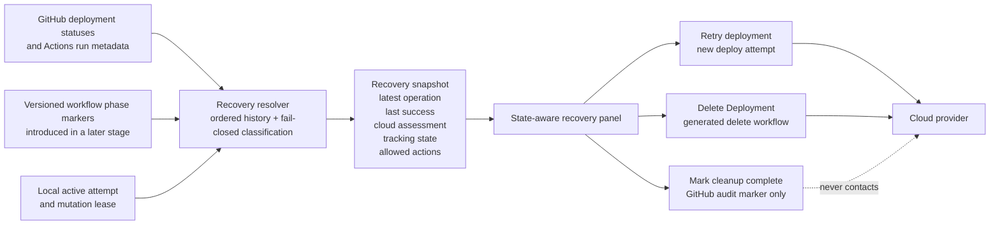
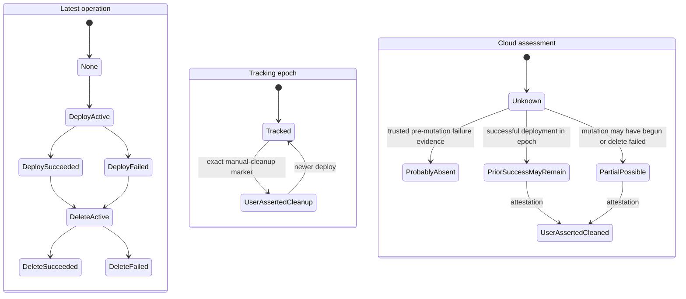

# Deployment recovery

- **Author**: Ryan Waite (@ryanwaite)
- **Date**: 2026-08
- **Status**: Draft

## Overview

Radius Canvas needs one coherent recovery experience for deployments and deletions that do not finish cleanly. Issue [#311](https://github.com/radius-project/ai-extensions/issues/311) exposed the first dead end: a first deployment that fails during Azure authentication can also make the generated Delete workflow fail at the same authentication step. PR [#443](https://github.com/radius-project/ai-extensions/pull/443) attempted to infer that no cloud work was required and skip cloud authentication, but review found that unavailable state could be mistaken for absent state. Shipped `main` preserves the honest meaning of Delete and keeps it reachable after a failed deploy, but it collapses history into one row, skips failed Delete attempts during resolution, and has no audited way to stop tracking after cleanup outside Canvas.

This design proposes work for after the Radius Canvas preview is complete. Deployment Recovery is not part of the preview scope. Once the preview ships, Canvas can evolve from the shipped product to a coherent recovery system without acquiring every signal or every user-interface state in one release. The first post-preview release preserves the existing Delete path, adds an audited way to stop tracking after manual cleanup, and treats every failed deploy or Delete conservatively because current workflows do not report a stable resource-mutation phase. Later releases may add a versioned workflow phase protocol and use that evidence to distinguish failures before resource mutation from failures after it began.

The target design builds recovery out of several independent facts instead of one new terminal deployment status. Canvas resolves the latest operation, the last known successful deployment, the available evidence about cloud-resource risk, and the GitHub tracking state as separate questions. A recovery surface then presents the actions those facts justify, without changing what any action means:

- **Retry deployment** starts a new deploy attempt after the user corrects a repairable problem.
- **Delete Deployment** always attempts cloud teardown through the generated delete workflow.
- **Mark cleanup complete** records the user's explicit attestation that cleanup happened outside Canvas and removes the logical deployment from Canvas tracking. It never authenticates to a cloud, dispatches a workflow, probes cloud state, or claims Canvas verified or performed cleanup.

Unknown, ambiguous, stale, or unavailable history fails closed. Missing phase evidence does not make the whole target unavailable when Canvas can still classify the operation and its history safely; it makes the resource-mutation phase unknown, so Canvas uses the cautious statement that resources may remain. This distinction lets Canvas ship useful recovery before workflow phase markers exist.

## Terms and definitions

- **Application target**: The combination of repository, Radius application, and GitHub environment to which deployment operations apply.
- **Operation**: A user intent such as deploy, delete, or tracking removal.
- **Attempt**: One execution of an operation. A retry is a new attempt, not a mutation of the failed attempt.
- **Latest operation**: The newest classified deploy or delete attempt for the application target, including its workflow kind, status, conclusion, run URL, deployment ID, and time when available.
- **Last known successful deployment**: The newest successful deploy attempt in the current tracking epoch, even when a newer deploy or delete attempt failed.
- **Tracking epoch**: The ordered deployment history after the most recent user-attested manual-cleanup marker. A successful new deploy after that marker starts a new tracked epoch.
- **Cloud-resource assessment**: What Canvas can safely say about possible cloud resources from operation history and trusted phase evidence. It may say that resources are probably absent, may be partial, may remain from an earlier success, were reported as cleaned by the user, or are unknown. Canvas never presents this assessment as a cloud inventory or verification.
- **Resource-mutation boundary**: The first workflow point after which the operation may have created, changed, or deleted application resources. Cloud authentication may happen before this boundary.
- **Workflow phase marker**: A versioned, machine-readable event emitted by a generated workflow and persisted in GitHub. It identifies the operation, attempt, phase, event, and whether resource mutation may have begun. Human-readable step names and unstructured error text are not phase markers.
- **Conservative recovery**: Recovery behavior used when Canvas can classify the operation and history but has no trusted phase marker. It says resources may remain and does not infer that cleanup is unnecessary.
- **Capability stage**: A releasable step in the evolution from the current collapsed deployment row to the target recovery snapshot and phase-aware user experience.
- **Tracking state**: Which of three conditions applies: Canvas tracks the target, a user attestation removed tracking, or tracking cannot be resolved.
- **Recovery snapshot**: The server-owned, immutable response that combines the facts above, the actions currently allowed, and an evidence revision used to reject stale mutations.
- **Active operation**: A deploy or delete attempt that GitHub reports as queued or in progress, or a valid local mutation lease that covers the publication gap before GitHub exposes the new attempt.
- **Mutation lease**: A short-lived, server-held reservation on one application target that blocks a second conflicting Retry, Delete, or tracking-removal request until the first completes, fails, or expires.
- **Tracking-only recovery**: Removing the target from Canvas tracking after manual cleanup without invoking cloud teardown.
- **Manual-cleanup attestation**: The user's typed confirmation that they completed cleanup outside Canvas. It is an assertion by the user, not proof of cloud state.
- **Tombstone**: An exact Canvas-authored GitHub deployment status that changes how older deployment history is resolved.
- **Manual-cleanup marker**: The proposed inactive status description: `Tracking removed in Radius Canvas: user attested external cleanup; Canvas did not verify or perform cleanup.`
- **Fail closed**: Withhold Delete, Retry, and tracking removal when Canvas cannot classify the current target safely. Disabling a button without an actionable explanation does not satisfy this requirement.

## Objectives

> **Issue Reference:** [#311](https://github.com/radius-project/ai-extensions/issues/311) and [PR #443](https://github.com/radius-project/ai-extensions/pull/443)

### Goals

1. Give users a recovery path for failed first deploys, failed redeploys, failed deletes, partial work, transient failures, and cleanup completed outside Canvas.
2. Preserve the semantic contract that **Delete Deployment** means Canvas attempts cloud teardown through the generated delete workflow.
3. Keep normal teardown reachable when the newest deploy failed but an earlier successful deployment may still be live.
4. Keep Retry independent from Delete and tracking removal so a repairable failure does not force cleanup.
5. Permit tracking removal only after explicit typed manual-cleanup attestation and preserve an auditable GitHub record that says the cleanup was user-asserted, not verified or performed by Canvas.
6. Never authenticate to a cloud, synchronize or dispatch a workflow, or claim resource deletion on a tracking-only path.
7. Fail closed when GitHub state, workflow identity, ordering, or application identity is unknown, ambiguous, stale, or unavailable.
8. Make actions easier to choose by keeping action names stable and showing only the actions the resolved facts justify.
9. Make stale pages, active operations, cross-session races, and retries safe through server-side re-resolution, leases, idempotency, and nonce-protected mutation routes. (A nonce here is a one-time token the server issues per page load and checks on every mutation, so a replayed or forged request cannot pass.)
10. Produce actionable errors that state what Canvas could not establish, what did not happen, and what the user can do next.
11. Deliver recovery in stages so the first release depends only on evidence that `main` already exposes and later releases improve precision without changing action meanings.
12. Allow old workflow runs and new workflow runs to coexist. A missing phase marker must produce conservative copy, not a broken page or an unsafe inference.

### Non-goals

1. **Cloud state probing.** Canvas will not call Azure, AWS, the Radius control plane, GHCR state storage, or another provider to decide whether resources exist.
2. **Proving manual cleanup.** The attestation is recorded, not verified.
3. **Changing generated delete-workflow semantics.** Delete continues to dispatch the workflows generated through [`packages/core/src/workflows/delete.ts`](../../packages/core/src/workflows/delete.ts).
4. **Automatically selecting tracking removal after a failed Delete.** Failure never grants implicit permission to stop tracking.
5. **Automatically deleting GitHub Environments, secrets, variables, workflow files, or deployment history.** Deployment recovery concerns the application target's Canvas tracking record.
6. **Adding cloud-specific recovery rules.** The state model and user experience are provider-neutral.
7. **Inferring absence from missing persisted state.** PR #443 demonstrated why an absent or unreadable state source is not proof that no resources exist.
8. **Repairing credentials or configuration automatically.** Retry is available after the user or Copilot fixes the cause, but this design does not implement the repair.
9. **Replacing GitHub deployment history with a new database.** GitHub remains the durable cross-session source; local state only bridges active attempts and caches.
10. **Requiring phase-aware copy in the first release.** The first recovery release treats a classified terminal failure as a state in which resources may remain.
11. **Parsing free-form workflow logs or error messages as proof of phase.** Human-readable logs remain diagnostic. Only an explicit versioned contract may refine the resource assessment.

### User scenarios (optional)

#### Actors

- **Application operator**: Deploys and removes an application through Canvas and can update deployments in the target GitHub repository.
- **External cleaner**: Removes resources outside Canvas. This may be the same person as the operator or another authorized administrator.
- **Radius Canvas browser**: Presents resolved facts and actions but never decides recovery eligibility from a single client-side status string.
- **Radius Canvas loopback server**: The Canvas backend process. It is a "loopback" server because it only accepts connections from the same machine (address `127.0.0.1`). It resolves history, enforces mutation policy, owns local leases, synchronizes or dispatches workflows for Delete, and records tracking-only audit statuses.
- **GitHub**: Persists deployment statuses and workflow history and authorizes deployment-status writes and workflow dispatches.
- **Generated Delete workflow**: Authenticates to the configured cloud and attempts teardown. It is the only recovery action in this design that represents cloud deletion.
- **Cloud provider and Radius control plane**: External systems changed by deploy and Delete workflows, but not queried by the recovery resolver.

#### User story 1

As an operator whose first deploy failed, I can understand that resources may or may not exist, fix the cause and retry, attempt Delete, or attest that I cleaned up outside Canvas without Canvas conflating those choices.

#### User story 2

As an operator whose redeploy failed over a previously successful deployment, I can still reach **Delete Deployment** for the possibly live application while also retrying the failed deployment.

#### User story 3

As an operator whose Delete partially failed, I can retry Delete or finish cleanup outside Canvas and explicitly mark that cleanup complete.

#### User story 4

As a reviewer or incident responder, I can inspect GitHub deployment statuses and distinguish Canvas-performed workflow dispatch from a user's unverified external-cleanup attestation.

## User experience (if applicable)

The first release adds a compact **Deployment recovery** card after a terminal deploy or Delete failure. The normal successful path keeps the existing Deployed-page layout and **Delete Deployment** action. The card states the latest operation, any prior successful deployment, a conservative resource warning, and the tracking state before presenting actions.

The target experience may keep the panel visible for all tracked states once Canvas has a complete recovery snapshot and design review confirms that the extra persistent UI earns its space. This staged approach tests the recovery language and action hierarchy on the exceptional path before replacing the simpler successful-deployment experience.

The stable primary action follows user intent:

- If a tracked deployment may require teardown, **Delete Deployment** is the primary destructive action.
- If there is no known prior success and the latest deploy failed, **Retry deployment** is the primary repair action.
- **Mark cleanup complete** is always secondary, visually separated under **Cleaned up outside Canvas**, and appears only when the recovery snapshot is fully resolved and no operation is active.
- During an active operation, all conflicting actions disappear from the panel instead of staying clickable and being refused by the server.
- During unavailable or ambiguous history, the panel shows **Deployment state unavailable** and a retry-state action only. It shows no Delete, Retry deployment, or tracking-removal action.
- During the first release, a failed operation without trusted phase evidence says that resources may remain. The UI does not claim that the failure occurred before or after resource mutation.

The panel must not use color alone. It uses headings, status text, and distinct action labels. Status updates use `aria-live="polite"`; mutation errors use an assertive alert. Opening a confirmation moves focus into the dialog, Tab and Shift+Tab remain trapped, Escape closes it, and focus returns to the invoking control. Re-rendering the recovery snapshot must preserve focus when the focused action remains available.

**Sample input:**

```text
Latest operation: Redeployment failed
Last successful deployment: Aug 22, 2026
Cloud resources: An earlier deployment may still be running; the failed attempt may also have made partial changes.
```

**Sample output:**

```text
Deployment recovery

The latest deployment failed. An earlier successful deployment is still tracked, so cloud resources may remain.

[Delete Deployment]  [Retry deployment]

Cleaned up outside Canvas?
[Mark cleanup complete]
```

The manual-cleanup confirmation states all of the following before enabling its final action:

1. Canvas will not contact Azure, AWS, or another cloud.
2. Canvas will not run the Delete workflow.
3. The user asserts that cleanup was completed outside Canvas for the named application and environment.
4. GitHub will record that the assertion was not verified or performed by Canvas.
5. Older tracked deployment attempts in the current epoch will no longer appear as an active deployment in Canvas.

The user must type an exact token containing the application and environment. The final token format is an open product question; a concrete implementation candidate is `cleanup complete <application>/<environment>`. Pasting is allowed, password-manager/autocorrect behavior is disabled, matching is exact after trimming leading and trailing whitespace, and Enter submits only after a match.

## Design

### High-level design

Shipped `main` resolves one `DeploymentRow` per environment in [`packages/adapter-canvas/src/server.ts`](../../packages/adapter-canvas/src/server.ts). The row contains an application, environment, provider, one collapsed status, one deployment ID, and one run URL. [`packages/adapter-canvas/src/browser/repositories.ts`](../../packages/adapter-canvas/src/browser/repositories.ts) uses that status to choose one primary button. A failed deploy still leaves **Delete Deployment** reachable on `main`, which the recovery design must preserve.

The shipped implementation does not retain enough independent information for complete recovery:

- A failed newest deploy does not say whether an older successful deploy exists.
- A failed Delete does not say that teardown was attempted and may be partial.
- A generic inactive status does not say whether a whole tracking epoch is closed.
- A failed deploy does not say whether cloud work started unless trusted attempt-phase evidence exists.
- A missing or unidentified record does not mean no deployment exists.

The evolution starts by separating the facts that current GitHub history can already support. It then adds phase evidence as a separate workflow contract. The browser renders the server's decision and does not derive available actions from `deploymentStatus`.

The first release changes these parts of shipped `main`:

| Area                       | Shipped `main`                                                                                   | Required Stage 1 change                                                                                                                        |
|----------------------------|--------------------------------------------------------------------------------------------------|------------------------------------------------------------------------------------------------------------------------------------------------|
| Resolver output            | One collapsed `DeploymentRow` chosen from the first decisive history record                      | One versioned recovery snapshot that preserves the latest operation, last success, tracking state, active operation, evidence, and permissions |
| Failed Delete              | Skipped during resolution, allowing an older deployment row to resurface without failure context | Retained as the latest operation while the resolver separately finds the last successful deploy                                                |
| Browser actions            | One status-driven primary action plus the existing redeploy path                                 | A contextual failure card with stable Delete, Retry, and manual-cleanup actions authorized by the server                                       |
| Tracking-only recovery     | No operation or durable audit marker                                                             | Typed manual-cleanup attestation and an exact GitHub deployment-status marker that closes the tracking epoch                                   |
| Mutation authorization     | Deploy and Delete routes are `legacy-exempt` from page-nonce validation                          | Retry, Delete, and tracking removal all require the same nonce and same-origin checks                                                          |
| Concurrency                | Local deploy/Delete mutation lease plus GitHub active-run evidence                               | Extend the per-target lease to tracking removal and bind all mutations to a fresh evidence revision                                            |
| Resource-mutation evidence | No versioned signal                                                                              | Use conservative copy in Stage 1; add the cross-repository workflow phase protocol only in Stage 2                                             |



### Architecture diagram

No single status can describe recovery. The latest operation, tracking history, and cloud-resource assessment can change independently, so the action rules must consider them together.



No transition to `UserAssertedCleaned` means Canvas observed cleanup. The label means only that the GitHub audit marker contains the user's assertion.

### Evolution strategy

The design separates the safety foundation from the phase-aware target state. Each stage is independently useful and preserves the same meanings for Retry, Delete, and tracking removal.

| Stage                               | Capability                                                                                                                                                                 | User-visible result                                                                                                                | Main engineering change                                                                                                 |
|-------------------------------------|----------------------------------------------------------------------------------------------------------------------------------------------------------------------------|------------------------------------------------------------------------------------------------------------------------------------|-------------------------------------------------------------------------------------------------------------------------|
| 0. Shipped `main`                   | One collapsed deployment row; stable Delete; redeploy through the existing deploy path; failed Delete skipped during resolution                                            | Successful and failed deploys can be deleted; failed Delete can be retried indirectly; no tracking-removal path                    | Baseline                                                                                                                |
| 1. Conservative recovery foundation | Ordered history, latest operation, last success, tracking state, active operation, complete evidence revision, server-authorized actions, typed manual-cleanup attestation | A failure card offers Delete, Retry, and **Mark cleanup complete** when allowed. All classified failures say resources may remain. | Replace the collapsed resolver contract; add the audit mutation; harden mutation authorization and stale-state handling |
| 2. Workflow phase protocol          | Generated deploy and Delete workflows emit versioned events at preparation and resource-mutation boundaries; Canvas validates and persists the evidence                    | Canvas can distinguish a failure known to precede resource mutation from one that may have changed resources                       | Coordinate workflow changes with `radius-project/radius`; add phase retrieval, validation, and compatibility            |
| 3. Phase-aware recovery experience  | Resource assessment uses trusted phase markers; the recovery panel may become the stable action surface for all deployment states                                          | More precise explanations and action emphasis for the ten cases without changing action semantics                                  | Expand panel states, copy, telemetry, and phase-aware tests                                                             |

Stage 1 is the recommended first release. It solves the user dead end without waiting for a cross-repository workflow contract. It also establishes the history and mutation model that later stages need, so Stage 2 adds evidence rather than forcing another resolver rewrite.

Stage 1 deliberately combines cases that current evidence cannot distinguish:

- Cases 1 and 2 both appear as a failed first deployment in which resources may remain. Canvas offers Retry, Delete, and manual-cleanup attestation when history is otherwise complete.
- Cases 5 and 6 both appear as a failed Delete in which resources may remain. Canvas keeps Delete available as a retry and offers manual-cleanup attestation.
- Cases 3, 4, 7, 8, 9, and 10 can be handled from ordered GitHub history, current run metadata, exact audit markers, and local leases without phase evidence.

### Workflow phase protocol

Stage 2 introduces an explicit protocol at the resource-mutation boundary. A workflow emits a marker before the first step that may create, change, or delete application resources. Authentication and preparation have their own phases because cloud authentication can fail before application resources are touched.

A human-readable log may contain events such as:

```text
RADIUS_RECOVERY_PHASE {"version":1,"operation":"deploy","phase":"preparation","event":"started","attemptId":"8421","resourceMutationPossible":false}
RADIUS_RECOVERY_PHASE {"version":1,"operation":"deploy","phase":"cloud_authentication","event":"succeeded","attemptId":"8421","resourceMutationPossible":false}
RADIUS_RECOVERY_PHASE {"version":1,"operation":"deploy","phase":"resource_mutation","event":"started","attemptId":"8421","resourceMutationPossible":true}
```

A Delete that fails before teardown may end with:

```text
RADIUS_RECOVERY_PHASE {"version":1,"operation":"delete","phase":"cloud_authentication","event":"failed","attemptId":"8422","resourceMutationPossible":false}
```

A Delete that fails after teardown begins may end with:

```text
RADIUS_RECOVERY_PHASE {"version":1,"operation":"delete","phase":"resource_teardown","event":"started","attemptId":"8423","resourceMutationPossible":true}
RADIUS_RECOVERY_PHASE {"version":1,"operation":"delete","phase":"resource_teardown","event":"failed","attemptId":"8423","resourceMutationPossible":true}
```

Canvas must not parse these log lines as its durable source because logs may be truncated, expired, or unavailable. The workflow must persist the same semantic event in a versioned GitHub record, such as an exact deployment-status protocol or a bounded recovery artifact associated with the run. Design review must choose that carrier before Stage 2 begins.

The protocol follows these rules:

1. The version, operation, attempt ID, phase, event, and `resourceMutationPossible` value are required.
2. The workflow emits `started` before crossing the resource-mutation boundary. A later failure cannot erase that evidence.
3. Canvas accepts only supported versions and values associated with the classified workflow run and application target.
4. A missing marker or a marker with an unsupported future version produces the conservative Stage 1 assessment when the remaining history is complete. A malformed supported-version marker or contradictory markers make the evidence ambiguous and fail closed.
5. Old workflow runs remain valid history. They use conservative recovery without migration.
6. Human-readable step names and errors may be shown to users but never authorize or suppress an action.

### Detailed design

#### State model

The recovery snapshot contains the following independent facts. Stage 1 populates every field except a precise phase-derived resource assessment. Without a trusted phase marker, a failed operation uses `partial_possible` or `prior_success_may_remain`; it does not use `probably_absent`. Stage 2 may refine the assessment after validating the workflow phase protocol.

| Dimension                  | Values                                                                                                                                      | Resolution rule                                                                                                                                                                                                             |
|----------------------------|---------------------------------------------------------------------------------------------------------------------------------------------|-----------------------------------------------------------------------------------------------------------------------------------------------------------------------------------------------------------------------------|
| `latestOperation`          | `none`, or `{ kind: deploy \| delete, phase, phaseEvidence, outcome, deploymentId: string \| null, runId, runUrl, startedAt, completedAt }` | Newest positively classified Radius deploy/delete record in GitHub, reconciled with a matching valid local active attempt. `phaseEvidence` is `null` until a supported workflow marker is present.                          |
| `lastSuccessfulDeployment` | `null`, or `{ deploymentId, runId, runUrl, completedAt }`                                                                                   | Newest successful deploy in the current tracking epoch, even if newer deploy/delete attempts failed.                                                                                                                        |
| `cloudResourceAssessment`  | `probably_absent`, `partial_possible`, `prior_success_may_remain`, `user_asserted_cleaned`, `unknown`                                       | Derived from trusted workflow kind/outcome and optional phase evidence. A classified failure without phase evidence yields `partial_possible`, not `probably_absent`; incomplete or contradictory history yields `unknown`. |
| `trackingState`            | `tracked`, `removed_user_attested`, `unavailable`                                                                                           | The exact Canvas-authored manual-cleanup description has defined semantics. Generic `inactive` is classified from its workflow; unknown descriptions fail closed.                                                           |
| `activeOperation`          | `null`, or `{ kind: deploy \| delete \| remove_tracking, source: local_lease \| github, startedAt }`                                        | Any unexpired local lease or queued/in-progress GitHub attempt blocks conflicting actions.                                                                                                                                  |
| `evidence`                 | `{ revision, resolvedAt, complete, warnings[] }`                                                                                            | Revision is a stable digest of the ordered records used for the snapshot. Missing pages, failed fan-out, unknown workflow identity, contradictory ordering, or truncation makes `complete=false`.                           |
| `allowedActions`           | `{ retryDeploy, deleteDeployment, markCleanupComplete }`, each with `allowed`, `reasonCode`, and optional `targetDeploymentId`              | Computed only on the server from all dimensions. The browser does not infer permissions.                                                                                                                                    |

`cloudResourceAssessment` is deliberately cautious:

- `probably_absent` requires a trusted marker showing that the failed attempt ended before the resource-mutation boundary and no success exists in the epoch. It still does not prove absence.
- `partial_possible` covers a deploy that crossed the resource-mutation boundary, a failed Delete that crossed the teardown boundary, or any classified failed deploy/Delete whose phase marker is absent.
- `prior_success_may_remain` wins over `probably_absent` whenever the epoch contains a successful deploy.
- `user_asserted_cleaned` comes only from the exact new manual-cleanup marker.
- `unknown` covers unavailable or incomplete history, malformed supported-version markers, contradictory evidence, and unrecognized operation combinations. An absent marker or unsupported future version by itself does not make otherwise complete history unavailable.

The existing local `CanvasState.deployStatus` in [`packages/adapter-canvas/src/shared.ts`](../../packages/adapter-canvas/src/shared.ts) remains useful for the current session's progress feed, but it cannot authorize recovery. It is neither durable across sessions nor expressive enough to represent an older success, a failed Delete, or tracking state.

#### Resolver ordering and history

For one application target, the resolver:

1. Lists all relevant GitHub deployment records newest first, with pagination and an explicit bounded safety policy. Reaching the bound without a decisive epoch marker or complete classification returns unavailable rather than silently truncating history.
2. Reads enough status history to find the latest status, prior run URL, exact descriptions, and workflow identity.
3. Resolves linked Actions runs and classifies them as the generated deploy workflow, generated delete workflow, unrelated, or unknown. Unrelated records are skipped only when identity is positive. Unknown identity fails the entire target closed.
4. Processes records in strict GitHub order. Parallel fetches may gather data, but decisions preserve the original order, matching the ordering discipline already tested in `deployment-resolver.test.ts`.
5. Stops older-history contribution at the newest exact manual-cleanup marker. Newer attempts form a new epoch.
6. Treats a successful Delete as a closed epoch for active tracking, while retaining it in history for audit.
7. Retains a failed Delete as the latest operation and continues searching for the last successful deploy instead of skipping the failure as shipped `main` does.
8. Fails closed on generic `inactive` or other states unless the linked workflow and outcome establish their existing meaning. An exact description is a protocol constant, not substring-matched copy.

This ordering resolves the failed-redeploy bug. A newest failed deploy and an older successful deploy produce:

- `latestOperation = deploy/failed`;
- `lastSuccessfulDeployment = <older success>`;
- `cloudResourceAssessment = prior_success_may_remain`;
- `allowedActions.deleteDeployment = true`;
- `allowedActions.retryDeploy = true`;
- tracking removal available only through manual-cleanup attestation.

Tracking removal writes a whole-epoch marker only after the user asserts that external cleanup covered the application target. The marker prevents older successes from resurfacing because the user has explicitly closed that epoch.

#### Interaction model 1: Two explicit actions

Show Delete and tracking removal as neighboring buttons whenever both are allowed.

##### Advantages

- The operations are visibly distinct.
- Delete remains directly reachable after failed redeploys.
- The browser can extend the existing action surface without introducing a new persistent panel.

##### Disadvantages

- Neighboring destructive-looking controls make cloud teardown and tracking cleanup easy to confuse.
- Similar confirmation dialogs make different consequences easy to miss.
- It gives exceptional bookkeeping cleanup the same visual weight as normal teardown.
- A user must understand product-internal tracking before choosing an action.

#### Interaction model 2: One primary Delete action with contextual recovery

Show only Delete initially and offer tracking removal after Delete fails.

##### Advantages

- Optimizes for normal cloud teardown.
- Keeps the primary surface simple.
- Introduces tracking removal only when teardown has demonstrated a problem.

##### Disadvantages

- Does not solve a first deploy failure unless the user runs a Delete that may predictably fail.
- Couples two operations whose safety contracts must remain separate.
- Makes a failed Delete appear to grant a new cleanup fact even though failure supplies no evidence that resources are gone.
- Adds delay and potentially an unnecessary cloud-authentication attempt before a user who already cleaned up manually can update tracking.

#### Interaction model 3: Deployment Actions menu

Put Retry, Delete, and tracking removal in a menu whose contents vary by state.

##### Advantages

- Keeps the page compact.
- Scales to additional actions without adding buttons.
- Allows each item to retain a distinct label.

##### Disadvantages

- Hides the normal Delete path and critical state explanation behind a generic label.
- Dynamic menu contents still require users to inspect choices and infer why they changed.
- Menus are weaker surfaces for the evidence and warnings needed before a tracking-only action.
- Keyboard and screen-reader behavior is more complex than a persistent panel with ordinary buttons.

#### Interaction model 4: State-aware recovery panel

Show a persistent explanation of the resolved facts with a stable primary action and contextual secondary actions. Put manual-cleanup attestation in a separate subsection rather than beside Delete.

##### Advantages

- Explains why actions are available without requiring users to understand a collapsed status or changing button.
- Keeps Delete visible whenever teardown may be needed, including failed redeploy and failed Delete cases.
- Keeps Retry visible for repairable failures without implying cleanup.
- Separates exceptional tracking removal spatially and semantically from teardown.
- Gives unavailable and ambiguous states enough room for actionable, fail-closed guidance.
- Reuses the repository's established inline operation-panel direction from [`docs/design/2026-08-progress-ux-credentials-environments.md`](./2026-08-progress-ux-credentials-environments.md).

##### Disadvantages

- Uses more vertical space than a button or menu.
- Requires a richer resolver/API contract and more browser states.
- Requires careful copy to avoid presenting an assessment as cloud verification.

#### Proposed option

Adopt **Interaction model 4: State-aware recovery panel** as the target experience, reached through the staged evolution above. Stage 1 uses the same information architecture as a contextual failure card rather than replacing the successful-deployment surface immediately.

This sequence preserves the simple path that works on `main`, exposes recovery only when the user needs it, and lets the team validate the action hierarchy before making the panel persistent. The panel keeps action names stable and moves complexity into a short explanation of known facts. Normal teardown remains the prominent operation whenever resources may exist. Retry remains a repair action. Manual cleanup remains exceptional and is introduced in the user's own language, cleanup completed outside Canvas, rather than the implementation's language of tombstones.

The panel must not become a dashboard of every historical attempt. It shows one latest operation, one last-success fact when relevant, one cloud assessment sentence, and the currently allowed actions. Full history remains in GitHub.

#### Action semantics

##### Retry deployment

- Starts a new deploy attempt using the existing deploy path.
- Does not delete resources or retire history.
- Is available after a terminal deploy failure when no deploy or Delete is active and the recovery snapshot is complete.
- Remains available when an older success exists.
- Requires the latest branch, environment, application, and provider inputs to pass normal deploy validation.
- Uses a new attempt ID and a deploy mutation lease; it cannot reuse a failed attempt's identity.

##### Delete Deployment

- Means Canvas synchronizes the generated Delete workflows and dispatches `delete-application.yml`, as the current [`handleDeleteDeployment`](../../packages/adapter-canvas/src/server/routes/deployments.ts) does.
- May authenticate to the cloud inside the generated workflow.
- Is available after successful deploys, failed deploys where partial resources are possible, failed redeploys with an older success, and failed Deletes.
- A repeated Delete after a failed Delete is a retry of teardown, not a new semantic operation.
- A successful dispatch says only that teardown started. Final copy follows the workflow result and must not say resources were deleted until the workflow succeeds.
- A failed Delete preserves tracking and records `partial_possible` or `prior_success_may_remain`.

##### Mark cleanup complete

- Is tracking-only and requires explicit typed attestation.
- Writes the exact manual-cleanup marker to GitHub as an `inactive` status on the selected anchor deployment, with the latest known run URL when available.
- Never calls cloud CLIs, checks cloud credentials, probes state storage, calls `ensureWorkflowsCurrent`, calls `findWorkflowRun`, or invokes `gh workflow run`.
- Is available only when the snapshot is complete, no operation is active, at least one unresolved tracked deploy/delete record exists in the epoch, and the server can identify the anchor deployment exactly.
- Selects the audit anchor deterministically: use the latest relevant deploy/delete operation's GitHub deployment ID when it has one; otherwise use `lastSuccessfulDeployment.deploymentId`; otherwise use the newest positively classified tracked deploy record in the epoch. If none exists, the action is unavailable. A failed Delete workflow that has no deployment record therefore anchors its marker to the last successful deploy rather than inventing a record or losing the epoch boundary.
- Is not a fallback success from Delete. The user opens it from the separate **Cleaned up outside Canvas?** subsection.
- Closes the current tracking epoch. Later deploys appear normally as a new epoch.
- Returns `already_removed` idempotently when the same exact marker already closes the epoch.
- Success copy is: `Canvas stopped tracking this deployment after you stated that cleanup was completed outside Canvas. Canvas did not verify or perform the cleanup.`

#### Decision table

The table describes the phase-aware target state. Stage 1 uses the same action semantics but combines cases 1 and 2 and combines cases 5 and 6 because current workflow evidence cannot safely distinguish each pair. The table's copy is normative in meaning but may receive editorial changes during design review. “Typed attestation” always includes the five disclosures in [User experience](#user-experience-if-applicable).

| Cases                 | Stage 1 evidence                                                                  | Stage 1 behavior                                                                                                     | Stage 2 refinement                                                                                                                  |
|-----------------------|-----------------------------------------------------------------------------------|----------------------------------------------------------------------------------------------------------------------|-------------------------------------------------------------------------------------------------------------------------------------|
| 1 and 2               | Classified failed first deploy; complete history; no trusted phase marker         | Say resources may remain. Show Retry, Delete, and Mark cleanup complete when no operation is active.                 | A trusted pre-mutation failure may use `probably_absent` and the case 1 action policy; a marker showing mutation began uses case 2. |
| 5 and 6               | Classified failed Delete; complete history; no trusted phase marker               | Say Delete did not finish and resources may remain. Keep Delete available as a retry and show Mark cleanup complete. | A trusted pre-teardown failure uses case 5 copy; a marker showing teardown began uses case 6.                                       |
| 3, 4, 7, 8, 9, and 10 | Existing ordered GitHub history, run state, exact audit markers, and local leases | Implement the target behavior in Stage 1.                                                                            | Phase evidence may improve explanatory copy but does not change action meanings.                                                    |

| Case                                              | Evidence available                                                                                                                                                                                                                                | Actions shown                                                                                                                | Primary action                                                                                          | Confirmation                                                                          | Server behavior                                                                                                                                                                    | Resulting tracking state                                               | Required copy                                                                                                                                |
|---------------------------------------------------|---------------------------------------------------------------------------------------------------------------------------------------------------------------------------------------------------------------------------------------------------|------------------------------------------------------------------------------------------------------------------------------|---------------------------------------------------------------------------------------------------------|---------------------------------------------------------------------------------------|------------------------------------------------------------------------------------------------------------------------------------------------------------------------------------|------------------------------------------------------------------------|----------------------------------------------------------------------------------------------------------------------------------------------|
| 1. First deployment fails before cloud access     | Classified failed deploy; trusted marker says the resource-mutation boundary was not crossed; no success in epoch                                                                                                                                 | Retry deployment; Mark cleanup complete; optional Delete remains an open product decision                                    | Retry deployment                                                                                        | Retry uses normal deploy confirmation if any; tracking removal uses typed attestation | Retry starts a new deploy. Attestation writes only the manual-cleanup marker.                                                                                                      | Tracked after failure/retry; `removed_user_attested` after attestation | `Deployment failed before Canvas observed resource changes. Canvas cannot prove that no resources exist.`                                    |
| 2. First deployment fails after cloud work begins | Failed deploy; trusted marker says the resource-mutation boundary was crossed; no prior success                                                                                                                                                   | Delete Deployment; Retry deployment; Mark cleanup complete                                                                   | Delete Deployment                                                                                       | Delete uses destructive confirmation; attestation uses typed confirmation             | Delete dispatches generated teardown. Retry starts a new deploy. Attestation writes only the marker.                                                                               | Tracked until successful Delete or attestation                         | `Deployment failed after resource changes may have begun. Some resources may remain.`                                                        |
| 3. Redeployment fails after earlier success       | Latest deploy failed; older successful deploy in same epoch                                                                                                                                                                                       | Delete Deployment; Retry deployment; Mark cleanup complete                                                                   | Delete Deployment                                                                                       | Delete and attestation have distinct dialogs                                          | Delete targets the whole application and environment rather than just the failed record. Attestation closes the whole epoch.                                                       | Tracked until successful Delete or attestation                         | `The latest deployment failed. An earlier successful deployment may still be running, and the failed attempt may have made partial changes.` |
| 4. Deployment failure is repairable               | Latest deploy failed; no active operation; complete snapshot; diagnosis may be available but is not required for eligibility; cloud assessment is `probably_absent`, `partial_possible`, or `prior_success_may_remain` from the state-model rules | Retry deployment; plus Delete when the assessment is `partial_possible` or `prior_success_may_remain`; Mark cleanup complete | Retry deployment when no prior success; otherwise Delete Deployment remains primary with Retry adjacent | Normal deploy validation; no cleanup confirmation for Retry                           | Retry creates a new attempt without changing history. In Stage 1, absent phase evidence produces `partial_possible`; incomplete history produces `unknown` and falls into case 10. | Tracked                                                                | `Fix the configuration or credentials, then retry. Retrying does not remove existing resources or deployment history.`                       |
| 5. Delete fails before teardown begins            | Latest Delete failed; trusted marker says the resource-teardown boundary was not crossed; tracked deploy exists                                                                                                                                   | Delete Deployment; Mark cleanup complete; Retry deployment only if deploy policy independently allows it                     | Delete Deployment (semantically a retry of the failed teardown; the label remains stable)               | Destructive Delete confirmation may acknowledge previous failure; attestation typed   | Delete dispatches generated teardown again. Attestation writes only the marker.                                                                                                    | Tracked until successful Delete or attestation                         | `Delete failed before Canvas observed teardown. Existing resources probably remain.`                                                         |
| 6. Delete fails after partial teardown            | Latest Delete failed; trusted marker says teardown began; prior tracked deploy exists. Stage 1 uses this row's cautious actions and copy when phase evidence is absent.                                                                           | Delete Deployment; Mark cleanup complete                                                                                     | Delete Deployment (semantically a retry of the failed teardown; the label remains stable)               | Destructive confirmation; typed attestation for manual completion                     | Delete dispatches generated teardown. Attestation closes epoch only after user assertion.                                                                                          | Tracked until successful Delete or attestation                         | `Delete did not finish. Some resources may have been removed while others may remain.`                                                       |
| 7. Cloud cleanup finishes outside Canvas          | Complete snapshot; no active operation; exact anchor deployment; user initiates manual-cleanup flow                                                                                                                                               | Mark cleanup complete; Delete remains available until attestation is submitted when teardown is otherwise allowed            | Delete Deployment remains primary; Mark cleanup complete is secondary                                   | Typed attestation                                                                     | Writes inactive manual-cleanup marker; retires matching local terminal attempt; invalidates caches; no workflow or cloud call                                                      | `removed_user_attested`                                                | `You state that cleanup was completed outside Canvas. Canvas will record your statement but will not verify it.`                             |
| 8. Deployment succeeds without later failure      | Latest deploy succeeded; last success is latest; no active operation                                                                                                                                                                              | Delete Deployment                                                                                                            | Delete Deployment                                                                                       | Destructive confirmation                                                              | Synchronizes and dispatches generated Delete workflow                                                                                                                              | Tracked, then closed by successful Delete                              | `Delete Deployment runs the generated teardown workflow and may authenticate to your cloud provider.`                                        |
| 9. Deployment or deletion is active               | Local lease or GitHub record says deploy/delete queued or in progress                                                                                                                                                                             | No conflicting recovery or tracking-removal action; link to active run when known                                            | None                                                                                                    | N/A                                                                                   | Polls current operation; rejects stale mutation requests with conflict                                                                                                             | Tracked                                                                | `A deployment is in progress.` or `Deletion is in progress. Wait for it to finish before choosing a recovery action.`                        |
| 10. State is unavailable or ambiguous             | GitHub unavailable, history incomplete, unknown workflow, contradictory marker, missing anchor, stale revision, or classification failure                                                                                                         | Refresh deployment state only; GitHub link when safely known                                                                 | None                                                                                                    | N/A                                                                                   | Returns fail-closed snapshot or structured error; performs no mutation                                                                                                             | `unavailable`                                                          | `Canvas could not establish the current deployment state. No deployment or tracking changes were made. Check GitHub access and retry.`       |

Case 1 intentionally leaves a product question open. The product requirements say the user may retry or remove tracking, while the broader case list says first-deploy failures after resource mutation may use Delete. Offering Delete for a trusted pre-mutation failure is safe in the semantic sense: it would still just attempt teardown. But it may add a predictably failing cloud-authentication path and restore the original #311 dead end. Design review must decide whether Delete should be shown there as an optional secondary action.

#### User-facing terminology

The UI should use plain descriptions of user intent:

| Candidate                         | Evaluation                                                                                                                                                                                                                                                     |
|-----------------------------------|----------------------------------------------------------------------------------------------------------------------------------------------------------------------------------------------------------------------------------------------------------------|
| **Abandon failed deployment**     | Avoid as the default. “Abandon” does not say what is abandoned and can be mistaken for Delete. It also applies poorly to successful deploys and failed Deletes after manual cleanup.                                                                           |
| **Remove deployment from Canvas** | Clear about product scope, but “remove” can still sound like resource deletion and does not state why removal is safe. Suitable as supporting copy, not the preferred button.                                                                                  |
| **Stop tracking deployment**      | Technically accurate and explicitly non-cloud, but “tracking” is implementation-oriented and can suggest monitoring rather than a durable listing/history decision. Suitable as API/domain terminology.                                                        |
| **Mark cleanup complete**         | Recommended user-facing action. It matches the required attestation and works after failed deploys, failed Deletes, and successful deployments cleaned up externally. It must always be followed by copy saying “outside Canvas” and “not verified by Canvas.” |

Recommended labels:

- Panel subsection: **Cleaned up outside Canvas?**
- Action: **Mark cleanup complete**
- Dialog title: **Confirm cleanup completed outside Canvas**
- Final action: **Mark cleanup complete and stop tracking**
- Domain/API operation: `remove_tracking_after_manual_cleanup`

Whether the final button should instead be **Stop tracking deployment** is an open copy decision for product review. The term `abandon` remains valid for the unrelated in-progress environment-setup operation route; this design only rejects it for deployment recovery.

### API design (if applicable)

The existing `GET /api/list-deployments` can remain the collection endpoint, but each row becomes a recovery snapshot rather than a collapsed `DeploymentRow`. A versioned shape prevents an older browser bundle from treating a richer response as the legacy status.

```json
{
  "schemaVersion": 2,
  "deployments": [
    {
      "application": "todo",
      "environment": "prod",
      "provider": "azure",
      "latestOperation": {
        "kind": "deploy",
        "phase": "unknown",
        "phaseEvidence": null,
        "outcome": "failed",
        "deploymentId": "1234",
        "runId": "9876",
        "runUrl": "https://github.com/contoso/todo/actions/runs/9876",
        "startedAt": "2026-08-24T18:00:00Z",
        "completedAt": "2026-08-24T18:08:00Z"
      },
      "lastSuccessfulDeployment": {
        "deploymentId": "1200",
        "runId": "9700",
        "runUrl": "https://github.com/contoso/todo/actions/runs/9700",
        "completedAt": "2026-08-22T14:00:00Z"
      },
      "cloudResourceAssessment": "prior_success_may_remain",
      "trackingState": "tracked",
      "activeOperation": null,
      "evidence": {
        "revision": "sha256:opaque-server-digest",
        "resolvedAt": "2026-08-24T21:32:00Z",
        "complete": true,
        "warnings": []
      },
      "allowedActions": {
        "retryDeploy": {
          "allowed": true,
          "reasonCode": "latest_deploy_failed"
        },
        "deleteDeployment": {
          "allowed": true,
          "reasonCode": "prior_success_may_remain",
          "targetDeploymentId": "1200"
        },
        "markCleanupComplete": {
          "allowed": true,
          "reasonCode": "manual_cleanup_supported",
          "targetDeploymentId": "1234"
        }
      }
    }
  ]
}
```

This example is a valid Stage 1 response. The prior success establishes `prior_success_may_remain`, so missing phase evidence does not prevent recovery. A Stage 2 response may set `phase` to `preparation`, `cloud_authentication`, `resource_mutation`, or `resource_teardown` and add `phaseEvidence` with the supported protocol version and GitHub record that supplied it.

The proposed tracking-only mutation is:

```http
POST /api/deployment-recovery/remove-tracking
Content-Type: application/json
X-Radius-Mutation-Nonce: <page nonce>
```

```json
{
  "repo": "contoso/todo",
  "application": "todo",
  "environment": "prod",
  "evidenceRevision": "sha256:opaque-server-digest",
  "anchorDeploymentId": "1234",
  "attestation": {
    "kind": "manual_cleanup_completed",
    "confirmationToken": "cleanup complete todo/prod"
  }
}
```

The server does not trust `confirmationToken` as authorization or evidence. It validates the expected token for the server-resolved application target, re-resolves the complete snapshot, compares `evidenceRevision` and `anchorDeploymentId`, rechecks action eligibility, acquires the mutation lease, and then writes the GitHub status.

For a failed Delete with no associated GitHub deployment record, `latestOperation.deploymentId` is `null`, `anchorDeploymentId` is `lastSuccessfulDeployment.deploymentId`, and `markCleanupComplete.targetDeploymentId` exposes that same anchor. If both are absent, `markCleanupComplete.allowed` is false with reason `no_audit_anchor`.

Success:

```json
{
  "outcome": "tracking_removed",
  "trackingState": "removed_user_attested",
  "message": "Canvas stopped tracking this deployment after you stated that cleanup was completed outside Canvas. Canvas did not verify or perform the cleanup."
}
```

Idempotent success:

```json
{
  "outcome": "already_removed",
  "trackingState": "removed_user_attested",
  "message": "This deployment was already removed from Canvas tracking after a user attested to external cleanup."
}
```

All deployment mutation routes should converge on nonce-required authorization. Shipped `main` marks the existing deploy and Delete routes as `legacy-exempt` in [`packages/adapter-canvas/src/server/route-table.ts`](../../packages/adapter-canvas/src/server/route-table.ts), while [`validateBrowserMutationRequest`](../../packages/adapter-canvas/src/server/browser-mutation.ts) provides the nonce validation used by newer routes. Implementation must add tracking removal as `nonce-required` and migrate Retry/deploy and Delete to the same host, Origin, Fetch Metadata, and page-nonce validation before shipping this recovery surface.

Structured errors:

| HTTP | Code                                  | Meaning and user action                                                                                                            |
|------|---------------------------------------|------------------------------------------------------------------------------------------------------------------------------------|
| 400  | `invalid_target`                      | Repository, application, environment, or confirmation token is malformed. Reopen the flow from the selected target.                |
| 403  | `stale_or_unauthorized_page`          | Nonce, Origin, host, or same-origin check failed. Reload Canvas.                                                                   |
| 409  | `operation_active`                    | A deploy, Delete, or tracking-removal mutation is active. Wait and refresh.                                                        |
| 409  | `stale_recovery_state`                | Evidence revision or anchor changed. Reload the panel and reconsider the new facts.                                                |
| 409  | `action_not_allowed`                  | Re-resolved state no longer permits the requested action. The response includes a safe reason code, not a success-shaped fallback. |
| 409  | `tracking_already_closed_by_delete`   | A successful Delete closed the epoch before attestation. Refresh; no marker is written.                                            |
| 422  | `manual_cleanup_attestation_required` | The exact typed attestation did not match.                                                                                         |
| 502  | `github_audit_write_failed`           | GitHub did not accept the status. Tracking remains unchanged; no cloud or workflow action occurred.                                |
| 503  | `deployment_state_unavailable`        | Resolver could not establish complete state. Check GitHub connectivity/access and retry.                                           |

The response must always state whether a workflow was dispatched and whether cloud resources were changed when the operation could be confused with Delete. Tracking-only errors use `workflowDispatched: false` and `cloudActionAttempted: false` in server logs and tests; these fields need not be exposed to the browser if the user-facing copy is fixed and unambiguous.

### Implementation details

This section identifies implementation boundaries; this design does not implement them.

#### Core package — packages/core (if applicable)

Stage 1 does not require core product logic. Generated Delete workflows remain owned by [`packages/core/src/workflows/delete.ts`](../../packages/core/src/workflows/delete.ts), and the conservative resolver relies only on existing GitHub history.

Stage 2 requires a coordinated contract with the workflow templates fetched from `radius-project/ai-extensions/.github/extension`. Those templates are the source of truth; `packages/core` fills their placeholders and should test that supported templates retain the phase protocol. The protocol must not depend on prose step names. If the recovery policy later becomes useful to another adapter, the pure state model and allowed-action reducer may move into `packages/core`; GitHub record parsing remains in Canvas because it depends on adapter-specific GitHub APIs and workflow filenames.

#### Canvas adapter — packages/adapter-canvas (if applicable)

- Extract the shipped resolver from [`server.ts`](../../packages/adapter-canvas/src/server.ts) into a dedicated service and replace `DeploymentRow.status` authorization with a pure recovery-snapshot reducer over fully classified records.
- Preserve ordered history, expose failed Delete as the latest operation, find the last success independently, and recognize the exact manual-cleanup marker.
- Add a manual-cleanup tracking-removal service whose dependencies cannot synchronize or dispatch workflows.
- Add the proposed route to [`route-table.ts`](../../packages/adapter-canvas/src/server/route-table.ts) and migrate deploy/Delete mutations from `legacy-exempt` to `nonce-required`.
- Extend `CanvasState.deploymentMutation` with the domain term `remove_tracking`, keeping one lease family for deploy, Delete, and tracking removal.
- Render the recovery panel in [`pages/deployed-graph-page.ts`](../../packages/adapter-canvas/src/pages/deployed-graph-page.ts) and implement its browser behavior in [`browser/pages/deployed-graph-page.ts`](../../packages/adapter-canvas/src/browser/pages/deployed-graph-page.ts).
- Replace the variant-switching destructive dialog in [`browser/delete-dialog.ts`](../../packages/adapter-canvas/src/browser/delete-dialog.ts) with distinct Delete and manual-cleanup confirmation contracts. Shared focus-trap mechanics may remain factored, but content and callbacks must be separate types so a tracking-only handler cannot accidentally call Delete.
- Keep the current short deployment-list cache, but cache the full versioned snapshot. Invalidate it after a successful dispatch reservation, any terminal operation observation that changes the revision, and only after a successful audit-marker write for tracking removal.
- Retire local attempt state only when repository, environment, application, attempt/deployment identity, and the resolved epoch match. Do not erase an older successful deployment merely because the newest failed attempt was retired. After a manual-cleanup marker closes the whole epoch, local terminal state for that target may be removed.
- In Stage 1, assign conservative resource assessments without requesting workflow job steps or parsing logs. In Stage 2, read only the chosen durable phase carrier and validate its version, run, attempt, operation, and target before refining the assessment.

#### Shared adapter — packages/adapter-shared (if applicable)

N/A. The shared adapter runs the Radius CLI and has no GitHub deployment-history or Canvas browser responsibilities.

#### Plugin — plugins/radius (if applicable)

Update the `radius-delete` skill only if its user-facing guidance currently implies that Delete can become local-only. The skill must preserve the contract that Delete runs the generated teardown workflow. No new agent skill should perform tracking removal in the first release; keeping the operation in the nonce-protected Canvas flow preserves explicit, visible attestation.

#### Build & packaging (if applicable)

The source changes will flow through the existing Canvas esbuild pipeline described in [`docs/architecture/plugin-packaging-and-publishing.md`](../architecture/plugin-packaging-and-publishing.md). The implementation requires a package changeset because it changes the shipped Canvas user experience and API behavior. Generated `plugins/radius/dist/` output must not be hand-edited.

#### GitHub audit records and tombstones

The tracking-only service posts a GitHub deployment status with:

- `state=inactive`;
- exact description `Tracking removed in Radius Canvas: user attested external cleanup; Canvas did not verify or perform cleanup.`;
- `log_url` set to the latest known relevant run URL when available;
- the GitHub-authenticated actor and timestamp supplied by GitHub's status record.

The description is intentionally durable, bounded, and unambiguous. Canvas must display it as a user assertion, never as verified cleanup. Telemetry may count the operation but must not rewrite the audit record into “deleted” or “cleaned.”

Tombstone semantics:

- The new exact marker closes all older records in the current application-target epoch.
- A newer deploy after the marker begins a new tracked epoch.
- Generic inactive statuses keep their workflow-specific semantics. Unknown inactive statuses fail closed.
- Description matching is exact. Future versions use a new exact constant and explicit compatibility branch rather than changing the meaning of an old string.

#### Leases, concurrency, and idempotency

- Use one local lease per application target, not merely per Canvas page, with kinds `deploy`, `delete`, and `remove_tracking`.
- Acquire before asynchronous state re-resolution creates a race window; bind the lease to the evidence revision and anchor deployment.
- A valid local lease blocks all conflicting mutations. GitHub queued/in-progress records provide the cross-instance guard after publication.
- Release on every refusal and remote-write failure. Retain deploy/Delete leases through the existing publication gap. A tracking-removal lease can release after GitHub confirms the status and cache invalidation completes.
- Expired leases are recoverable, but expiry alone never changes durable tracking state.
- A repeated tracking-removal request after the exact marker returns `already_removed` without another write.
- A repeated Delete may dispatch only when no active Delete exists; a failed terminal Delete permits an explicit retry.
- Two concurrent tracking-removal requests with the same stale revision result in one write and one idempotent or stale-state response, never two different markers.

#### Cache invalidation and stale pages

- Every recovery response includes `Cache-Control: no-store`; the in-process GitHub fan-out cache remains an optimization.
- The browser sends `evidenceRevision` and the anchor ID on every mutation.
- The server always performs a fresh re-resolution after obtaining the lease and before mutation.
- A mismatch returns `stale_recovery_state`; it never silently applies the old user's choice to a newer operation.
- Browser responses are fenced by the existing page-entry lifecycle so a late request cannot mutate a torn-down page.
- On visibility restoration or loopback restart, the page reloads the full snapshot before restoring actions.
- Cache invalidation happens after the durable GitHub mutation succeeds. A failed audit write must leave the prior cached truth available or force a fresh read; it must never optimistically hide the deployment.

#### Authorization and nonce behavior

- All browser mutations use the same `validateBrowserMutationRequest` checks: loopback host, exact Origin, `Sec-Fetch-Site: same-origin`, and a per-server page nonce.
- The browser never receives a GitHub token or cloud credential.
- The server uses the selected GitHub identity and normal repository authorization to read history, dispatch workflows, and write deployment statuses.
- Tracking removal requires only permission to update the GitHub deployment. It must not request Azure/AWS credentials or GitHub `workflow` scope.
- Delete may use the existing workflow-scope fallback because dispatch is part of its contract.
- The attestation token prevents accidental activation; it is not identity proof. GitHub's authenticated actor is the audit identity.

### Error handling

- **GitHub history read fails**: Return `deployment_state_unavailable`, retain the last rendered facts as visibly stale if available, remove all mutation actions, and offer retry. Copy: `Canvas could not refresh GitHub deployment history. No deployment or tracking changes were made. Check the selected GitHub account and repository access, then retry.`
- **Workflow identity is unknown**: Fail closed. Copy names the record/run link when safe: `Canvas found a deployment record it could not identify. Open the GitHub run, then retry after the history is available.`
- **History is incomplete or ordering is ambiguous**: Fail closed rather than selecting the first recognizable record.
- **Stale page**: Return 403 for nonce failure or 409 for evidence drift. Copy tells the user to reload and review changed state.
- **Active operation**: Return 409 with the operation kind, target, and run URL when known.
- **Delete dispatch fails**: Preserve tracking. State clearly that teardown did not start when dispatch itself failed; when workflow execution failed, state that teardown may be partial.
- **Audit write fails**: Preserve tracking and state that no cloud action or workflow dispatch occurred.
- **Permission failure**: Name the required GitHub permission or `gh auth refresh` scope only when the error positively identifies it. Do not convert generic 404/503 into a permission diagnosis.
- **Local server state unavailable**: Fail closed even if the browser presents an apparently complete snapshot.
- **Confirmation target changes while dialog is open**: Close the dialog, announce the change, and require a fresh confirmation for the new snapshot.
- **Success message lifecycle**: Keep the manual-cleanup result in the panel after reload by resolving the durable marker. Do not rely on a transient inline banner.

## Acceptance criteria

### Stage 1 acceptance criteria

1. The server returns a versioned recovery snapshot that represents latest operation, last successful deployment, cloud-resource assessment, tracking state, active operation, evidence completeness/revision, and allowed actions independently.
2. No browser code authorizes Retry, Delete, or tracking removal from a collapsed `deploymentStatus`.
3. A successful deploy with no later failure preserves the current **Delete Deployment** experience.
4. A classified failed first deploy without phase evidence says resources may remain and offers Delete, Retry, and manual-cleanup attestation when no operation is active.
5. A failed redeploy over an older success keeps **Delete Deployment** reachable, exposes Retry, and does not let the newest failed attempt hide the older success.
6. A repairable failure can be retried without Delete or tracking removal being required.
7. A failed Delete remains the latest operation, preserves the last successful deployment, keeps **Delete Deployment** available under the same label, and says resources may remain.
8. Missing phase evidence alone produces conservative recovery; unknown workflow identity, incomplete history, ambiguous ordering, unavailable GitHub state, and stale evidence fail closed with no destructive or tracking-removal action.
9. Active deploy, Delete, or tracking-removal operations suppress all conflicting recovery actions across local and GitHub evidence.
10. Manual-cleanup tracking removal requires exact typed confirmation tied to the current application/environment and a fresh server-resolved evidence revision.
11. Tracking removal writes the exact inactive GitHub audit description stating that the user attested external cleanup and Canvas did not verify or perform it.
12. Every tracking-removal success, idempotent retry, refusal, and failure provably performs no cloud authentication, cloud/state probe, workflow synchronization, or workflow dispatch.
13. Tracking-removal success copy never says resources were deleted, cleanup was verified, or cleanup was performed by Canvas.
14. Tracking removal closes the current epoch only after the GitHub status write succeeds; failed writes preserve tracking.
15. A failed Delete with no deployment record anchors manual-cleanup audit to the last successful deploy; no action is offered when no exact audit anchor exists.
16. A later deploy after a manual-cleanup marker begins a new tracked epoch.
17. Generic inactive statuses and future unknown exact descriptions do not act as manual-cleanup markers.
18. Retry, Delete, and tracking removal share nonce-required same-origin authorization, per-target concurrency leases, stale-page rejection, and actionable structured errors.
19. Cache invalidation and local attempt retirement occur only after the corresponding durable transition and cannot erase an unrelated or older successful deployment.
20. The recovery card persists auditable manual-cleanup state after reload and does not depend on transient banner copy.
21. Keyboard, focus, screen-reader announcement, responsive layout, lifecycle teardown, stale response, and WCAG requirements pass in real Chromium.

### Stage 2 and target-state acceptance criteria

1. Generated deploy and Delete workflows publish the approved phase protocol before the resource-mutation boundary and associate each marker with the correct operation and attempt.
2. Canvas accepts only supported marker versions and values from the classified workflow run and application target.
3. Missing, expired, or unsupported future-version phase evidence falls back to Stage 1 conservative recovery when the remaining history is complete and never produces `probably_absent`. Malformed supported-version evidence or contradictory evidence fails closed.
4. A failed first deploy with trusted pre-mutation evidence may use case 1 copy and the product-approved case 1 Delete policy.
5. A failed deploy after the resource-mutation boundary uses case 2 copy and actions.
6. A failed Delete with trusted pre-teardown evidence uses case 5 copy; a failed Delete after the teardown boundary uses case 6 copy.
7. Old runs without markers and new runs with markers coexist in one ordered history without migration.
8. The state-aware panel, if made persistent, preserves all Stage 1 action meanings and safety rules.
9. Unit, resolver-ordering, real-loopback HTTP, browser component, Chromium, concurrency, built-artifact, changed-code coverage, phase-protocol compatibility, and no-workflow-dispatch tests described below pass.

## Test plan

The implementation must follow the repository's changed-code coverage goal and use the existing test layers honestly.

### Unit tests

- Recovery reducer: table-driven coverage for all ten cases and every cross-product that changes allowed actions. Stage 1 tests cases 1/2 and 5/6 with identical conservative phase handling; Stage 2 adds the distinctions.
- Resolver: newest failed deploy plus older success; newest failed Delete plus older success; successful Delete; manual-cleanup marker as epoch barrier; later deploy after marker; generic inactive; unrelated workflow; unknown workflow; missing run URL followed through older statuses; pagination; bounded-history refusal; parallel fetch with deterministic original ordering; contradictory records; GitHub failures.
- Cloud assessment: Stage 1 conservative failures, prior-success precedence, and user-attested cleanup wording; Stage 2 trusted pre-mutation evidence, mutation-started evidence, marker validation, and unsupported-marker fallback.
- Tracking-removal service: input validation, typed token, exact marker, actor-independent idempotency, stale revision, changed anchor, active operation, lease acquisition/release on every exit, permission errors, cache invalidation ordering, exact local-attempt retirement, and success copy.
- Browser policy rendering: stable action labels, Delete and Retry together after failed redeploy, failed Delete copy, unavailable-state fail closed, active-state action suppression, persistent user-attested result, and no client-side derivation from a status string.
- Confirmation mechanics: focus placement/return, Tab trap, Escape, exact token, Enter behavior, selector change, teardown cleanup, and separate typed contracts for Delete versus manual cleanup.
- Mutation authorization: nonce, host, Origin, Fetch Metadata, malformed JSON, and old pages.

Changed production code should reach 100% statements, branches, functions, and lines where behaviorally meaningful, following `.github/instructions/code-quality.instructions.md`. Any justified unreachable branch must be documented rather than hidden with broad coverage exclusions.

### Real-loopback HTTP integration

Extend [`packages/adapter-canvas/test/integration/http/deployments.test.ts`](../../packages/adapter-canvas/test/integration/http/deployments.test.ts) through the real route table and OS-assigned loopback server:

- Fetch all ten scenarios through `GET /api/list-deployments`. Before Stage 2, assert that cases 1/2 and 5/6 return the same conservative phase assessment.
- Submit Retry, Delete, and manual-cleanup requests with real nonce/origin headers.
- Prove stale evidence is rejected after a concurrent GitHub-history change.
- Prove active local and GitHub operations block conflicting actions.
- Prove cache invalidation makes the next read observe the marker.
- Prove GitHub write failure leaves tracking visible.
- Prove a failed redeploy still permits Delete and targets the application/environment rather than hiding behind the failed record.
- Prove a failed Delete remains visible and retryable.
- Prove generic inactive and ambiguous records fail closed.

### No-workflow-dispatch and no-cloud proof

For every tracking-only success, refusal, idempotent retry, and error:

- Assert `ensureWorkflowsCurrent` was not called.
- Assert `findWorkflowRun` was not called.
- Assert `runGh` was not called with `workflow run`.
- Assert no `az`, `aws`, `rad`, cloud SDK, GHCR state, or Git-state probe was called.
- Assert the only allowed remote mutation is the single GitHub deployment-status POST.
- At real-loopback and Chromium layers, configure fake cloud executables to fail the test if invoked and inspect the fake GitHub command journal for absence of workflow dispatch.

This proof is mandatory because copy alone cannot enforce the tracking-only safety contract.

### Browser component

Add a real-browser component test for the recovery panel using Vitest Browser Mode:

- Keyboard traversal reaches the primary and secondary actions in a stable order.
- The manual-cleanup disclosure remains associated with its action.
- Focus survives a snapshot refresh when the action remains.
- An action disappearing after a state refresh moves focus to the panel heading and announces the reason.
- Long application/environment names wrap without obscuring controls.
- `aria-live` and alert behavior announce state changes once.

### Chromium critical journeys

Extend [`packages/adapter-canvas/test/e2e/canvas-chromium.test.ts`](../../packages/adapter-canvas/test/e2e/canvas-chromium.test.ts), which uses the real server, route table, page renderer, and compiled browser entries:

1. Successful deployment → Delete confirmation → workflow dispatch.
2. Failed first deploy without a phase marker → conservative resource warning plus Delete, Retry, and manual-cleanup choices, with no cloud/workflow call during attestation.
3. Successful deploy → failed redeploy → Delete remains primary and Retry remains available.
4. Failed Delete → retry Delete and manual-cleanup flow.
5. Manual-cleanup confirmation requires every disclosure and exact typed token; result persists after reload.
6. Active deploy/Delete suppresses conflicting actions.
7. Ambiguous/unavailable history shows no mutation actions.
8. Stale page receives an actionable refusal and refreshes before another attempt.
9. Keyboard focus, Escape, Enter, Tab order, focus return, and selector-change cancellation.
10. Axe WCAG 2.0/2.1/2.2 A and AA checks at every material panel and dialog state.

Stage 2 adds critical journeys for a trusted pre-mutation deploy failure, a deploy failure after resource mutation begins, a trusted pre-teardown Delete failure, a Delete failure after teardown begins, and an unsupported marker that falls back to conservative recovery.

Safety-tagged journeys run with retries disabled, consistent with [`packages/adapter-canvas/test/e2e/phase-6-traceability.md`](../../packages/adapter-canvas/test/e2e/phase-6-traceability.md).

### Concurrency and reliability

- Two concurrent Delete requests.
- Delete racing with Retry.
- Delete racing with tracking removal.
- Retry racing with tracking removal.
- Two Canvas instances sharing GitHub state but not process memory.
- Lease expiry before and after GitHub record publication.
- Marker write succeeds while the client disconnects.
- Cache contains a pre-marker snapshot while another request writes the marker.
- GitHub returns records between page fetches or changes an Actions run conclusion during resolution.
- Resolver fan-out finishes out of order.
- Loopback server restarts with a workflow still active.

Use deterministic fake time and deferred promises. Do not rely on sleeps for ordering assertions.

### Compatibility and artifact checks

- Existing schema-version-1 deployment rows remain readable only during the coordinated browser/server bundle transition; because Canvas ships as one bundle, schema version 2 may otherwise fail closed on mismatch.
- Existing generic inactive delete statuses retain their established semantics.
- Existing workflow runs without phase markers use conservative recovery. They are never rewritten or excluded.
- Supported workflow templates and Canvas agree on the phase protocol version and resource-mutation boundary.
- Built-extension artifact tests prove the new route, panel script, and exact audit constant are present in the generated bundle.
- Manual testing uses disposable GitHub and cloud resources to confirm GitHub records the authenticated actor and description, a failed Delete is classified from a real Actions run, and no cloud authentication prompt appears during tracking removal.

## Security

| Threat                                                                                | Mitigation                                                                                                                                                                    |
|---------------------------------------------------------------------------------------|-------------------------------------------------------------------------------------------------------------------------------------------------------------------------------|
| Cross-site request to a destructive loopback endpoint                                 | Require exact host, Origin, same-origin Fetch Metadata, and per-server nonce for Retry, Delete, and tracking removal.                                                         |
| Stale page removes tracking for a newer deployment                                    | Bind requests to server-generated evidence revision and anchor deployment; re-resolve after acquiring the lease.                                                              |
| Tracking removal is mistaken for deletion                                             | Separate route/service/dependency surface; exact copy; typed attestation; audit marker says Canvas did not verify or perform cleanup; no success-shaped fallback from Delete. |
| Tracking-only path accidentally dispatches or authenticates                           | Service does not receive workflow/cloud dependencies; boundary tests fail on any such call; only deployment-status POST is allowed.                                           |
| Unknown GitHub record hides live resources                                            | Unknown workflow, ordering, inactive description, or incomplete pagination fails closed.                                                                                      |
| Concurrent actions produce contradictory history                                      | Per-target local lease plus durable GitHub active-record check; idempotent marker semantics.                                                                                  |
| Malicious application/environment text injects markup or changes token interpretation | Build DOM with text nodes, validate server-side target identity, and derive the expected token on the server.                                                                 |
| Audit record overstates certainty                                                     | Fixed description says “user attested” and “did not verify or perform”; telemetry uses the same distinction.                                                                  |
| Sensitive cloud or GitHub credentials reach the browser                               | Browser receives only the recovery snapshot and nonce; all credentials remain server-side; tracking removal does not request cloud credentials.                               |
| A user without repository authority removes tracking                                  | GitHub authorizes the deployment-status write; failure preserves tracking. Product review must decide whether an additional repository-role check is required.                |

The recovery resolver consumes workflow logs and status text as untrusted evidence. It classifies fixed workflow paths and GitHub fields; it does not execute content or follow instructions embedded in logs. Stage 2 accepts phase evidence only through the approved structured carrier, version, and schema. A line that merely resembles `RADIUS_RECOVERY_PHASE` in free-form output has no authority.

## Compatibility (optional)

Shipped `main` has no manual-cleanup marker or tracking-removal route. Existing GitHub histories therefore remain ordinary deploy and Delete records and require no tracking-marker migration. The new resolver must classify them with these rules:

1. Existing successful and failed deploy records remain part of the current epoch until a future user-attested marker closes it.
2. Existing successful Delete records retain their established inactive semantics.
3. Existing failed Delete runs become visible as the latest operation instead of being skipped; older successful deploys remain available as `lastSuccessfulDeployment`.
4. Existing generic inactive statuses keep their workflow-specific meanings. Unknown workflow identity or inactive descriptions fail closed.
5. Canvas does not rewrite old deployment statuses automatically.

The new manual-cleanup description is a new protocol constant. Existing GitHub deployment histories continue through classification without bulk migration. Older Canvas bundles do not understand schema version 2 or the new marker, but the plugin ships browser and server code together. If a stale page remains open across an extension restart, nonce and schema checks force reload rather than allowing a mixed-version mutation.

Workflow phase evidence is also versioned for compatibility:

- Runs created before Stage 2 have no phase marker and use the Stage 1 conservative assessment.
- Runs with a supported marker version may refine the assessment.
- Runs with an unsupported future marker version fall back to conservative recovery if the rest of the history is complete.
- Runs with malformed supported-version markers or contradictory markers fail closed because Canvas cannot trust the evidence.
- A future protocol version cannot change the meaning of version 1 fields. Canvas must add an explicit compatibility branch before using it.
- Canvas never rewrites old workflow runs to manufacture phase evidence.

## Monitoring and logging

No cloud-state telemetry or probing is added.

Local structured logs should include:

- target hash or repository/application/environment fields according to existing privacy policy;
- recovery schema version and evidence revision;
- latest operation kind/outcome;
- whether a prior success was found;
- cloud assessment enum;
- tracking state;
- allowed/refused action and reason code;
- lease acquisition, conflict, expiry, and release;
- resolver record count, pagination count, classification failure category, and latency;
- phase evidence source, supported version, last accepted phase, and fallback reason when Stage 2 is enabled;
- mutation outcome;
- `workflowDispatched` and `cloudActionAttempted` booleans, which must both be false for tracking removal.

Product telemetry, if enabled by existing policy, may count panel states, Retry/Delete/manual-cleanup selections, confirmations, cancellations, stale-state refusals, and outcomes. It must distinguish:

- `delete_workflow_succeeded`;
- `delete_workflow_failed`;
- `tracking_removed_user_attested`;
- `tracking_removal_failed`;
- `tracking_already_removed`.

It must never emit “resources deleted” for `tracking_removed_user_attested`. GitHub deployment statuses are the durable audit trail; local logs are diagnostic and may disappear with the session.

## Development plan

### Stage 1: Conservative recovery foundation

1. **Preserve and characterize `main`**: Lock down the existing contract that Delete always dispatches teardown, a failed deploy does not hide Delete, active operations block conflicts, and unavailable history disables mutations.
2. **Introduce the recovery snapshot**: Extract the resolver from `server.ts`, preserve ordered history, retain failed Delete as the latest operation, find the last successful deploy independently, and calculate evidence revisions. Use conservative resource assessments for every classified failure without a trusted phase marker.
3. **Add manual-cleanup attestation**: Implement the narrow tracking-removal service and route, exact GitHub marker, whole-epoch semantics, idempotency, anchor selection, cache invalidation, and local-state retirement. Prove that every path performs no cloud authentication, state probe, workflow synchronization, or workflow dispatch.
4. **Harden mutations**: Move Deploy, Delete, and tracking removal to nonce-required authorization, bind mutations to fresh evidence, and use one per-target lease family.
5. **Ship the contextual recovery card**: Keep the normal successful-deployment experience, add the card after terminal failure, expose stable Delete and Retry actions, separate manual cleanup, and deliver actionable unavailable/active/stale states.
6. **Complete Stage 1 validation**: Add unit, loopback, browser component, Chromium, concurrency, compatibility, built-artifact, and changed-code coverage. Add a changeset and complete disposable-resource manual validation.

Stage 1 is complete when every safely classified current workflow run can use conservative recovery without a phase marker and every Stage 1 acceptance criterion passes.

### Stage 2: Workflow phase protocol

1. **Choose the durable carrier**: Decide whether the versioned phase event lives in GitHub deployment-status history, a bounded run artifact, or another GitHub record with adequate retention and ordering.
2. **Publish the protocol upstream**: Update the generated workflow templates in `radius-project/ai-extensions` to emit and persist preparation, authentication, resource-mutation, and resource-teardown boundaries for Azure and AWS.
3. **Consume the protocol in Canvas**: Validate the version and identity, associate events with the correct run and target, and refine `cloudResourceAssessment` only from trusted markers.
4. **Prove compatibility**: Test old runs without markers, mixed histories, malformed markers, unsupported versions, missing artifacts, retention expiry, and out-of-order retrieval. Missing or unsupported phase evidence falls back to Stage 1 conservative behavior when the remaining history is complete; malformed supported evidence and contradictory evidence fail closed.

### Stage 3: Phase-aware target experience

1. Apply case-specific copy for trusted pre-mutation and post-mutation failures.
2. Decide whether the recovery panel should remain contextual or replace the normal successful-deployment action surface.
3. Add phase-specific telemetry and the remaining ten-case browser journeys.
4. Review whether the added precision justifies exposing any different action emphasis, especially the case 1 Delete decision.

Each stage can merge only if it preserves fail-closed history handling and stable action meanings. The recovery card must not ship against the old collapsed resolver, the tracking-removal route must not ship without no-workflow/no-cloud boundary tests, and phase-aware copy must not ship before both repositories implement and test the versioned protocol.

## Open questions

1. **Q: Should Delete be shown for case 1 after Stage 2 proves that the first deployment failed before resource mutation?** Stage 1 must show Delete because it cannot distinguish cases 1 and 2. Stage 2 could omit it to avoid the predictably failing authentication path described by #311, or retain it for uniformity.
2. **Q: What exact typed token best communicates attestation without becoming unreasonably long?** Candidate: `cleanup complete <application>/<environment>`.
3. **Q: Should the user-facing final action be “Mark cleanup complete and stop tracking” or “Stop tracking deployment”?** The former emphasizes the attestation; the latter is shorter and technically direct.
4. **Q: Is GitHub's authorization to write deployment statuses sufficient, or must Canvas also verify a minimum repository role before accepting manual-cleanup attestation?**
5. **Q: Should the recovery panel expose the identity of the GitHub actor whose prior attestation closed tracking, when GitHub returns it?**
6. **Q: Which GitHub record should carry the workflow phase protocol?** Deployment statuses are durable and ordered but have bounded descriptions; artifacts can hold richer JSON but expire; job outputs are structured but may not be independently durable. Free-form logs are not an acceptable authority.
7. **Q: How many deployment-history records/pages may the resolver inspect before returning unavailable?** The budget must cover realistic redeploy histories without unbounded GitHub fan-out.
8. **Q: Should a manual-cleanup marker close only one application target if a GitHub environment hosts multiple Radius applications in the future?** The current repository model resolves one application from `app.bicep`, but the marker protocol should not preclude future multi-application environments.
9. **Q: Should a successful Delete receive an explicit Canvas-authored audit description distinct from the workflow's existing status, to make epoch closure easier to inspect?** This is not required for the proposed resolver but could improve audit clarity.
10. **Q: Should tracking removal be exposed through an agent tool in a later release?** The initial recommendation is no because visible typed attestation is central to the product decision.
11. **Q: Where exactly is the resource-mutation boundary for deploy and Delete across Azure and AWS?** The workflow owners must identify the first step that may change application resources and emit the marker before it. Canvas cannot infer this boundary from the current step names.
12. **Q: Should Stage 1 ship only the contextual recovery card, or should it immediately replace the successful-deployment surface with the persistent panel?** The current recommendation is the contextual card first.

## Alternatives considered

- **Minimal failed-deployment escape hatch**: This is the smallest change. It could add typed tracking removal to the current failed row without a new snapshot or recovery card. It is not recommended because the latest row still cannot explain failed Delete, find an older success, or bind the mutation to complete evidence without importing much of the resolver work.
- **Stage 1 conservative recovery card only**: This is the recommended first release. It fixes the state model and action contracts, supports manual-cleanup attestation, preserves Delete, and uses cautious copy without coordinating an upstream workflow protocol. It costs more than a button patch but captures most of the safety and product value.
- **Full phase-aware panel in one release**: This reaches the target model immediately and distinguishes all ten cases as precisely as the evidence permits. It is not recommended as the first release because it couples Canvas changes to workflow-template changes in another repository, a durable event carrier, migration behavior, and a broader persistent UI.
- **Force/local-only Delete**: Rejected. PR #443 showed that absence and unavailability are hard to distinguish, and a Delete that reports success while leaving resources is worse than an explicit tracking-only operation.
- **Automatic tracking removal after a failed Delete**: Rejected. A failed Delete provides no cleanup evidence and may be partial.
- **Infer cloud state from GHCR or Git state**: Rejected. This repeats the unavailable-versus-absent ambiguity from PR #443 and expands credentials and failure modes.
- **Always show every action**: Rejected. Active, unavailable, and ambiguous states must fail closed, and irrelevant options make the right choice harder to find.
- **Use only the latest GitHub deployment record**: Rejected. It cannot preserve teardown after failed redeploy or explain failed Delete.
- **Delete GitHub deployment history instead of writing a status**: Rejected. Status history is the audit trail and GitHub deployment records are not safely erasable as a recovery abstraction.

## Design review notes

N/A. This document is a draft. Record review decisions, approved terminology, answers to open questions, and the implementation authorization here before changing production code.
