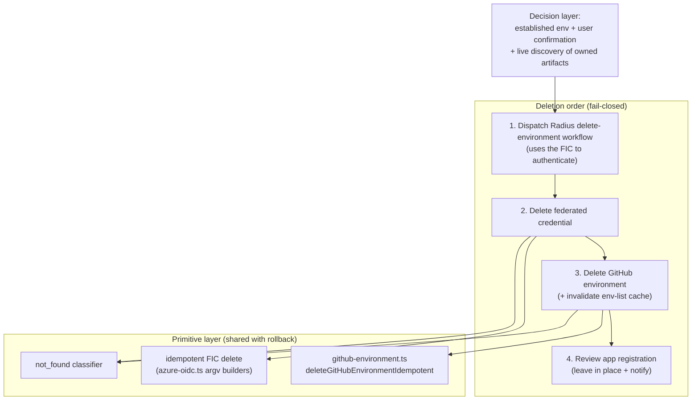
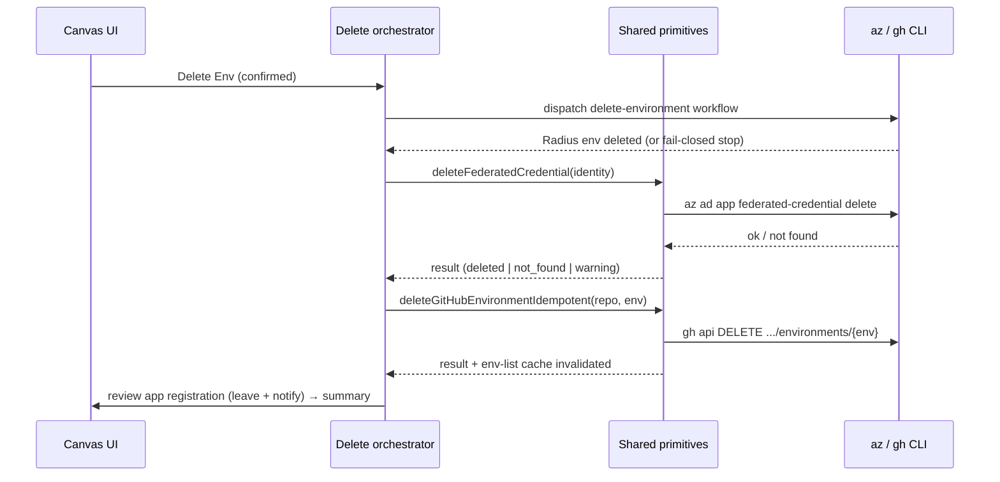

# Environment deletion cloud cleanup

- **Author**: sk593 (@sk593)
- **Date**: 2026-08

## Overview

When a user deletes a Radius environment, Radius must tear down the cloud and
GitHub state that stands behind it — not just drop the environment from the
list. Before this work, Delete Environment removed the environment record but
left cloud artifacts (the GitHub environment, the Azure federated credential
used for OIDC) behind, so repeated create/delete cycles leaked credentials and
eventually hit the per-app federated-credential limit.

This document describes how **Delete Environment** (PR #398, this branch)
cleans up an *established* environment: the stages it runs, the order it runs
them in, why that order is load-bearing, how it stays idempotent and
fail-closed, and why it deliberately leaves the Entra app registration in place
and notifies the user instead of deleting it.

Radius has a second, sibling flow — **Create-Environment rollback** — that tears
down the *half-finished* artifacts of a setup that never succeeded. It is a
different job with different rules, but it does a lot of the *same low-level
work* (delete a GitHub environment, delete a federated credential, treat "not
found" as success, report progress through the same panel). To avoid writing
that work twice, the delete flow's primitives are built to be shareable. The
[Rollback compatibility](#rollback-compatibility) section explains exactly which
pieces are shared, which must stay separate, and why — but the primary subject
of this document is the delete implementation itself.

## Terms and definitions

- **Environment** — a deploy target Radius manages. It maps to a GitHub
  environment plus the Azure identity (app registration, federated credentials)
  used to authenticate deployments.
- **Operation** — a long-running, tracked task (create or delete). Operations
  live in `packages/adapter-canvas/src/operations.ts`, survive an extension
  restart, and drive the progress panel in the canvas.
- **Stage / step** — an operation is a sequence of named stages (for example
  `delete_federated_credential`); each stage records human-readable steps.
- **Federated credential (FIC)** — the OIDC trust entry on an Azure app
  registration that lets a specific GitHub environment authenticate to Azure
  without a stored secret. Named `repo:<owner>/<repo>:environment:<env>`.
- **Idempotent / convergence** — running a delete twice is safe; a resource that
  is already gone ("not found") counts as success, not failure.
- **Fail-closed** — when we cannot prove it is safe to continue, we stop rather
  than guess, and leave the environment in a state a retry can finish.
- **Artifact ledger** — a record, saved on the *create* operation, of every
  cloud/GitHub artifact an attempt **created**, **reused**, or **deleted**.
  Defined as `SetupArtifactLedger` in `operations.ts`. Used by rollback for
  provenance; the delete flow does **not** depend on it (see Non-goals).

## Objectives

> **Issue Reference:** <https://github.com/radius-project/ai-extensions/issues/303>
> (and the related federated-credential-limit report,
> <https://github.com/radius-project/ai-extensions/issues/331>).

### Goals

- When an established environment is deleted, remove the cloud/GitHub artifacts
  it owns so nothing leaks: the Radius environment, the federated credential,
  and the GitHub environment.
- Run the teardown in an order that keeps deletion **fail-closed** — never
  remove a credential a not-yet-confirmed step still needs.
- Make every teardown step **idempotent**, so a re-run after a partial failure
  converges (`not_found` is success) and the user can retry safely.
- Leave the Entra app registration **in place** and tell the user, because it
  can be shared by other environments or callers.
- Report progress, retained artifacts, and warnings through the existing
  operation panel so the user sees exactly what happened.
- Write the delete-side deletion primitives so the sibling rollback flow can
  reuse them without copy-paste drift (see Rollback compatibility).

### Non-goals

- **Deleting the Entra app registration.** Delete Environment never removes the
  app registration; deleting a shared identity from under other environments or
  callers is not worth the risk. It is retained and the user is notified.
- **Deleting role assignments or the service principal.** Those are governed by
  the broader established-environment identity model and are out of scope here.
- **Depending on creation provenance.** Environments created before the artifact
  ledger existed never recorded one, so deletion must keep working from live
  discovery + user confirmation, not from a ledger. Consuming provenance *when
  present* is an open question, not a goal.
- **Merging the delete and rollback flows.** They have different entry
  conditions and opposite credential ordering; sharing primitives is not the
  same as sharing the flow.
- **AWS teardown.** AWS is not a supported provider yet — a user cannot create
  an AWS environment, so the AWS branch is barebones framework only. The delete
  flow surfaces that AWS cleanup is not implemented rather than pretending to
  run it.

### User scenarios (optional)

#### User story 1

A developer has a working `dev` environment and clicks **Delete Env**. Deletion
dispatches the delete-environment workflow (which needs the federated credential
to authenticate to the cluster), then removes the credential and the GitHub
environment. The Entra app registration is **left in place**, and the operation
shows a notification telling the developer it was not deleted and that they can
remove it in Azure themselves if they no longer need it.

#### User story 2

A delete run fails partway — say the federated-credential delete errors. The
developer retries. Because every step is idempotent, the steps that already
finished report "already gone" and the run converges instead of failing on the
already-deleted pieces. The progress panel shows what was torn down before the
failure so the developer knows the current state.

## User experience (if applicable)

Delete Environment runs as a tracked operation with a progress panel. The panel
shows each stage (Radius environment delete, federated-credential delete, GitHub
environment delete, app-registration review), streams human-readable steps, and
on conclusion surfaces a summary of what was removed, what was left in place
(the app registration), and any warnings. A hard fail-closed stop shows the
steps completed so far plus a retry affordance. No new prompts are introduced
beyond the existing delete confirmation.

## Design

### High-level design

The delete flow has two layers:

1. A **decision layer** — "is this an established environment the user confirmed
   deleting, what artifacts does it own, and are we allowed to proceed?"
2. A **primitive layer** — "actually run one `az`/`gh` command to delete one
   thing, idempotently, and record the result."

The decision layer is specific to delete (established environment + live
discovery + explicit confirmation). The primitive layer is generic teardown and
is written to be shared with rollback.

The deletion **order** is the load-bearing design decision. The
delete-environment workflow authenticates to the cluster using the federated
credential, so it must run **first, while the credential still exists**. Only
after the Radius environment is confirmed gone do we remove the federated
credential, then the GitHub environment. If any earlier step cannot be
confirmed, the flow stops before removing the credential and GitHub environment
that a retry would need — this is what "fail-closed" means here.

### Architecture diagram

The sequence below shows the delete orchestrator driving the primitive layer,
with each teardown reported through the operation store:

### Detailed design

#### Deletion stages and order

`packages/adapter-canvas/src/server/services/environment-deletion.ts` builds and
runs the delete stages. The order is deliberate and must not be "unified" with
rollback's opposite order:

1. **Radius environment first.** Dispatch the committed `delete-environment`
   workflow. It authenticates to the cluster with the federated credential, so
   the credential must still exist at this point. If the run cannot be confirmed
   deleted, the flow **stops here** — it does not remove the credential or
   GitHub environment, because a retry needs them.
2. **Federated credential.** Delete the per-environment FIC
   (`repo:<owner>/<repo>:environment:<env>`) with the existing
   `buildFederatedCredentialDeleteArgs` + `runAz`. A `not_found` result is
   success.
3. **GitHub environment.** Delete it via the idempotent
   `deleteGitHubEnvironmentIdempotent` primitive and invalidate the env-list
   cache so the UI no longer lists it. A 404 is treated as `not_found`.
4. **App-registration review.** Record an informational "left in place" step and
   notify the user; never delete it.

#### App-registration policy

The delete flow **never** removes the Entra app registration. It records a
"left in place" step and, on a concluded deletion, surfaces an acknowledgement
that the user can delete it themselves in Azure if it is unwanted. The
registration may back other environments or callers, and stable identities are
easy to mis-match by display name, so speculative deletion is out of scope.

#### Idempotency and fail-closed behavior

Every primitive treats a CLI "not found" as convergence, not failure, so a
re-run after a partial deletion succeeds instead of erroring on already-deleted
artifacts. Conversely, when an earlier step cannot be confirmed (for example the
Radius environment delete), the flow fails closed: it stops before removing the
credential and GitHub environment, surfaces the steps completed so far, and
offers a retry, rather than deleting speculatively and stranding the user.

#### How the primitives are shared (options)

The delete primitives could be kept private to the delete flow, or extracted so
the sibling rollback flow reuses them. This is a real design choice because
rollback is landing separately and does the same low-level teardown.

##### Option 1: Keep delete's primitives private

Each flow keeps its own copy of every primitive (GitHub-environment delete, FIC
delete, not-found handling, progress reporting).

- **Advantages:** zero coupling; each PR ships and evolves on its own.
- **Disadvantages:** the same `gh api DELETE .../environments/{env}` and the same
  idempotent FIC-delete logic get written twice and drift; two different
  "cleanup result" vocabularies make the UI report "deleted / already gone /
  left in place" inconsistently; a CLI phrasing fix must land in two places.

##### Option 2: Extract the primitive layer, keep the decision layer separate

Extract the deletion primitives (and, in a follow-up, the cleanup-result
vocabulary) into shared services. Each flow keeps its own eligibility check,
order, and policy, but calls the shared primitives to do the work.

- **Advantages:** each primitive is written and tested once; one consistent
  cleanup-result vocabulary; safety rules that live *in the primitive*
  (idempotent `not_found`, stable identity matching, cache invalidation) are
  guaranteed identical in both flows.
- **Disadvantages:** needs a little coordination since both PRs touch
  `operations.ts`; a shared service must be scoped so rollback's provenance
  assumptions do **not** leak into deletion's discovery-based flow.

##### Proposed option

**Option 2.** The delete flow ships its GitHub-environment delete as a shared,
port-injected primitive today, and the remaining primitives are extracted in
dependency order as a follow-up. The full sharing story — what is already
shared, what is extracted now, and what must stay separate — is in
[Rollback compatibility](#rollback-compatibility). Keeping delete's teardown in
shareable primitives is a design requirement of this PR, not an afterthought, so
rollback binds to the same code instead of re-authoring it.

### API design (if applicable)

N/A. The delete flow reuses existing operation/route plumbing; it introduces no
new HTTP route, canvas action, tool, or `packages/core` signature. The internal
TypeScript service signatures introduced here (for example
`deleteGitHubEnvironmentIdempotent(repo, env, ports)`) are module-local and not
a public contract.

### Implementation details

#### Core package — packages/core (if applicable)

N/A. All of this lives in the canvas adapter. The primitives call `az`/`gh` and
touch the operation store, which are adapter concerns; `packages/core` stays
UI- and I/O-agnostic.

#### Canvas adapter — packages/adapter-canvas (if applicable)

- `src/server/services/environment-deletion.ts` — the delete orchestrator:
  builds the delete stages, runs them in the fail-closed order above, and
  reports progress. Owns the delete-specific decision layer.
- `src/server/services/github-environment.ts` — the shared cleanup primitive
  module. `deleteGitHubEnvironmentIdempotent(repo, env, ports)` (404-tolerant)
  lives here, co-located with the create-side `ensureGitHubEnvironment`
  primitive. It takes injected `runGh` and `invalidateEnvListCache` ports;
  `server.ts` binds its `gh` runner and `envListCache` to it. Sole owner of the
  `GitHubEnvDeletionOutcome` type, which `environment-deletion.ts` re-exports for
  its callers.
- `src/server/services/delete-env-run-classifier.ts` — classifies a delete
  workflow run outcome; the "az/gh not found ⇒ already gone" rule folds into the
  shared classifier as it is extracted.
- Azure argv builders in `src/azure-oidc.ts` (`buildFederatedCredentialDeleteArgs`,
  `buildFederatedCredentialListArgs`, `parseFederatedCredentials`, and friends)
  are pure functions the delete flow already uses; rollback imports them rather
  than re-authoring `az` commands.

Follow-up extraction (in dependency order, each with unit tests): a
`cleanup-identity.ts` (stable IDs + cleanup-result vocabulary), an
`azure-cleanup.ts` (idempotent FIC delete; rollback-only app delete), and a
shared `not_found` classifier. Each flow keeps its stage inventory and order in
its own orchestrator, not in the primitives.

#### Shared adapter — packages/adapter-shared (if applicable)

N/A. The `runAz` / `runGh` execution ports already exist; no change to
`packages/adapter-shared` is required.

#### Plugin — plugins/radius (if applicable)

N/A for behavior. The static `delete-environment` workflow files are installed
beside the extension, and the generated artifact at
`plugins/radius/dist/extension.mjs` is rebuilt from source as usual; no hand
edits.

#### Build & packaging (if applicable)

The `delete-environment` workflow YAML ships with the plugin (copied into the
install directory by `build.mjs`). No new runtime dependencies. A Changeset
entry (`minor`) documents the feature.

### Error handling

- Every primitive is idempotent: a `not_found` result from `az`/`gh` is recorded
  as convergence (already-gone), never a failure.
- A primitive that genuinely fails records a `warning` and returns it; the
  orchestrator decides whether that warning is fatal. This preserves the
  fail-closed rule: if the Radius-environment delete cannot be confirmed, the
  flow stops before removing the federated credential and GitHub environment
  that a retry needs.
- If deletion stops partway, the progress panel reports **what was deleted
  before the failure** so the user knows the current state, plus a retry
  message. It does **not** claim the environment was fully torn down.
- The app-registration reminder ("left in place — remove it in Azure yourself")
  is surfaced only when the operation **concludes** — `succeeded` or
  `succeeded_with_warnings` (the latter includes retained/shared-FIC cases). On
  a hard fail-closed stop the panel shows completed steps plus a retry message
  and does **not** show the reminder, because nothing was fully torn down and
  the user has not reached the end of a deletion.
- **AWS.** Because AWS environments cannot be created yet, the AWS cleanup path
  is framework only. If it is ever reached, it surfaces that AWS cleanup is not
  implemented instead of silently succeeding.

## Test plan

Per the repository code-quality skill, each service ships with collocated unit
tests and each changed seam keeps its boundary tests:

- **Unit tests** for `github-environment.ts` (deleted / 404-not-found / failed,
  string vs. numeric exit code, and that the env-list cache is invalidated on the
  deleting paths), `environment-deletion.ts` (stage order, fail-closed stop when
  the Radius-environment delete is unconfirmed, app-registration left-in-place
  step), and `delete-env-run-classifier.ts` (not-found convergence).
- **Boundary tests.** HTTP-integration coverage for the operation status the
  browser reads during a delete, and the artifact (built-extension) suite stays
  green after rebuilding `plugins/radius/dist`.
- **No coverage regression.** Changed production paths target 100% line/branch;
  the repo `coverage-baseline.json` floor must hold.

Testing challenges: the primitives do real `az`/`gh` I/O, so they are injected
behind `runAz` / GitHub ports and tested with deterministic fakes — no live
cloud or network access in pull-request tests.

## Security

- **Stable identity, never display text.** Every primitive matches resources by
  stable identity (`repo:env` for the GitHub environment, `name@subject` for the
  FIC), never by friendly name, so a similarly named resource can never be
  deleted by mistake.
- **Fail-closed deletion.** When preconditions or external state cannot be
  established, the primitive records a warning and the orchestrator stops rather
  than deleting speculatively. This matches the repository rule that destructive
  environment operations fail closed.
- **App registration is never touched by the delete flow.** Delete Environment
  leaves the app registration in place and only notifies the user; it has no code
  path that removes an app registration.
- **No secret exposure.** Cleanup results and the browser summary carry only safe
  detail — never tokens, secret values, or raw CLI output.
- **Argv, not shell.** All CLI calls pass an argument array (the existing
  `buildX...Args` builders); no user-controlled value is interpolated into a
  shell string.

## Compatibility (optional)

- **Backward compatible.** Delete Environment keeps working for environments
  created before the artifact ledger existed, because it relies on live
  discovery + user confirmation, not on provenance.
- **AWS not supported.** No AWS environment can be created, so no established
  AWS environment can reach the delete flow; the AWS cleanup branch is inert
  framework until AWS support lands.

### Rollback compatibility

Create-Environment rollback (proposed separately, and specified by the
[durable Create Environment operation controls](./2026-08-environment-operation-controls.md)
design) undoes a setup that never finished. It shares the delete flow's *primitive
layer* but keeps its own *decision layer*. This section records exactly where the
two overlap so the delete implementation stays easy to reuse and neither PR
blocks the other.

**Already shared today (do not re-implement):**

- **Operation framework** — `operations.ts`: stages, steps,
  `requireInput`/`resumeAfterInput`/`canResumeInput`, `finish*`,
  `persistOperations`, restart recovery, `toClientView`, and the
  `OPERATION_KIND_CREATE` / `OPERATION_KIND_DELETE` markers.
- **The artifact ledger** — also in `operations.ts`: `SetupArtifactLedger`,
  `recordCleanupState`, `projectCleanupSummary`. The create flow writes it
  (`server/routes/create-environment.ts`); rollback reads it for provenance.
- **Azure argv builders** — `azure-oidc.ts`: `buildAppDeleteArgs`,
  `buildFederatedCredentialListArgs`, `buildFederatedCredentialDeleteArgs`,
  `parseFederatedCredentials`, `selectMissingFederatedCredentials`, and friends.

**Extracted by this PR so rollback reuses it:**

- **GitHub-environment delete + env-list cache invalidation.** The 404-tolerant
  `deleteGitHubEnvironmentIdempotent(repo, env, ports)` lives in the shared
  `server/services/github-environment.ts` module with injected `runGh` and
  `invalidateEnvListCache` ports. `server.ts` binds the delete flow's ports; the
  rollback runner binds its own ports to the same primitive, so "how a 404
  becomes `not_found`" and "when the env-list cache is invalidated" are identical
  in both flows. Its exit-code check accepts both numeric `0` and string `"0"`
  precisely so the rollback runner's result shape can bind to it unchanged.

**Extracted as a follow-up (dependency order, each with tests):**

1. **Cleanup-result vocabulary + stable identity** (`cleanup-identity.ts`),
   routing delete's outcomes through `recordCleanupState` / `projectCleanupSummary`.
2. **Idempotent federated-credential delete** — both flows call
   `buildFederatedCredentialDeleteArgs` + `runAz` and treat `not_found` as
   success; only the *source* of the identities differs (delete: the
   per-environment pattern; rollback: ledger entries). Extract a shared "delete
   these FIC identities" helper.
3. **Shared `not_found` classifier**, folding in `delete-env-run-classifier.ts`.

**Must stay separate (sharing it would be a safety bug):**

- **Eligibility / entry point.** Rollback = an *unverified* attempt with complete
  provenance (`canStartRollback`). Delete = an *established* environment plus live
  discovery plus explicit confirmation. Sharing an eligibility shortcut would let
  rollback's provenance assumptions leak into deletion.
- **Deletion order.** Rollback deletes backward along the dependency chain
  (workflows → GitHub env → roles → FIC → service principal → app). Delete runs
  the Radius-environment workflow **first, while the FIC still exists**, then the
  FIC, then the GitHub env, and never touches the app. These orders are
  load-bearing and opposite on purpose.
- **Roles + service principal.** Rollback deletes them (it created them); the
  delete flow does not touch them.
- **App-registration policy.** Rollback: provenance-gated auto-delete (only if the
  attempt created it), including a confirm-time recheck. Delete: **never
  touched**. The `az ad app delete` primitive and its recheck therefore belong to
  a shared `azure-cleanup` service but are invoked only by the rollback decision
  layer.

**Coexistence.** Both the rollback PR and PR #398 touch `operations.ts`.
Recommended sequence: land them independently, then rebase one onto the other and
finish the remaining extraction as a follow-up, so neither PR is blocked.

## Monitoring and logging

Each stage appends a human-readable step to the operation (`addStep`) and, as the
cleanup-result extraction lands, persists a structured cleanup result via
`recordCleanupState`. `projectCleanupSummary` exposes the removed / kept /
warning sets the progress panel renders, so an operator can see exactly which
artifact reached which outcome (`deleted`, `not_found`, `warning`, `skipped`).

## Development plan

1. **Ship Delete Environment cleanup (PR #398).** Fail-closed staged teardown
   (Radius env → FIC → GitHub env → app-registration review), idempotent
   primitives, app-registration retention + notification, progress reporting.
2. **Extract the GitHub-environment delete primitive** into the shared
   `github-environment.ts` with injected ports (done in PR #398), so rollback
   binds to it.
3. **Extract the remaining shared primitives** in dependency order —
   `cleanup-identity.ts`, then `azure-cleanup.ts`, then the shared `not_found`
   classifier — each with unit tests.
4. **Route delete through the shared summary.** Map `environment-deletion.ts`
   outcomes onto `recordCleanupState` / `projectCleanupSummary`; update its tests
   and the HTTP-integration coverage.
5. **(Optional, gated on the open question below)** teach delete to consume
   creation provenance when present.

## Open questions

- **Should Delete Environment consume creation provenance when it exists?** It
  could target artifacts precisely from the ledger when a create operation is
  still around, while falling back to live discovery for older environments.
  Attractive, but risks blurring the eligibility boundary — needs review.
- **One cleanup-result type, or a shared base with per-flow extensions?** Roles
  and service principals only appear in rollback. A single shared type keeps
  reporting uniform; a base type avoids rollback-only fields leaking into delete.
- **Where should the shared services live** — under
  `packages/adapter-canvas/src/server/services/` (proposed) or promoted toward
  `packages/adapter-shared` if a future non-canvas adapter needs them? Start in
  the canvas adapter; promote only if a second consumer appears.

## Alternatives considered

- **Drop the environment record without cloud cleanup (the old behavior).**
  Rejected: it leaks federated credentials and eventually hits the per-app FIC
  limit (issue #331).
- **Delete the app registration too.** Rejected: the registration can be shared
  by other environments or callers; removing a shared identity by mistake is far
  worse than leaving an unused one behind. Retain + notify instead.
- **Keep delete's primitives private (Option 1).** Rejected: guarantees drift
  between two copies of the same delete primitives and an inconsistent
  cleanup-result vocabulary across the two UIs.
- **Merge rollback and deletion into a single flow.** Rejected: different entry
  conditions (unverified vs. established), different sources of truth (provenance
  vs. discovery + confirmation), and opposite credential ordering would need so
  many branches that the safety rules would be hard to verify.

## Design review notes

<!-- To be completed during design review. -->
