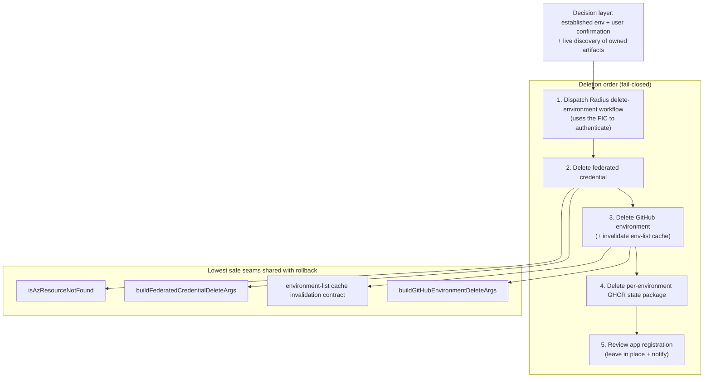
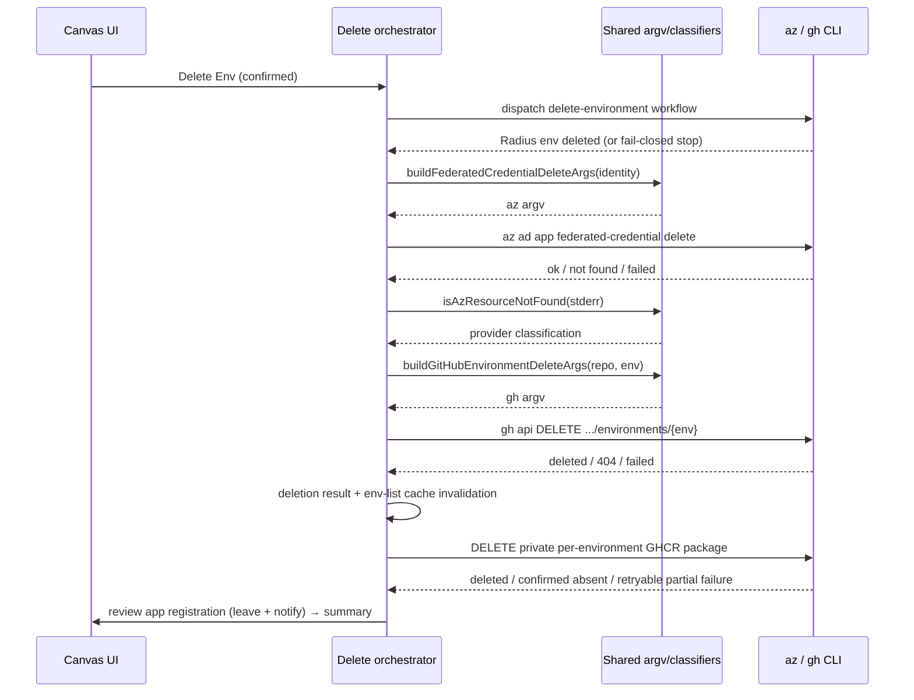

# Environment deletion cloud cleanup

- **Author**: sk593 (@sk593)
- **Date**: 2026-08

## Overview

When a user deletes a Radius environment, Radius must tear down the cloud and
GitHub state that stands behind it — not just drop the environment from the
list. Before this work, Delete Environment removed the environment record but
left cloud artifacts (the GitHub environment, the Azure federated credential
used for OIDC) behind, so repeated create/delete cycles leaked credentials and
eventually hit the per-app federated-credential limit.

This document describes how **Delete Environment** (PR #398, this branch) cleans up an *established* environment: the stages it runs, the order it runs them in, why that order is load-bearing, how it stays idempotent and fail-closed, and why it deliberately leaves the Entra app registration in place and notifies the user instead of deleting it.

Radius has a second, sibling flow — **Create-Environment rollback** — that tears down the *half-finished* artifacts of a setup that never succeeded. It is a different job with different rules, but it does a lot of the *same low-level work* (delete a GitHub environment, delete a federated credential, treat "not found" as success, report progress through the same panel). To avoid writing that work twice, the flows share pure command builders and provider result classifiers while retaining separate safety and recovery adapters. Those shared seams are called out inline; the subject of this document is the delete implementation itself.

## Terms and definitions

- **Environment** — a deploy target Radius manages. It maps to a GitHub
  environment plus the Azure identity (app registration, federated credentials)
  used to authenticate deployments.
- **Operation** — a long-running, tracked task (create or delete). Operations
  live in `packages/adapter-canvas/src/operations.ts`, survive an extension
  restart, and drive the progress panel in the canvas.
- **Stage / step** — an operation is a sequence of named stages (for example
  `delete_federated_credential`); each stage records human-readable steps.
- **Federated credential (FIC)** — the OIDC trust entry on an Azure app
  registration that lets a specific GitHub environment authenticate to Azure
  without a stored secret. Named `repo:<owner>/<repo>:environment:<env>`.
- **Idempotent / convergence** — running a delete twice is safe; a resource that
  is already gone ("not found") counts as success, not failure.
- **Fail-closed** — when we cannot prove it is safe to continue, we stop rather
  than guess, and leave the environment in a state a retry can finish.
- **Artifact ledger** — a record, saved on the *create* operation, of every
  cloud/GitHub artifact an attempt **created**, **reused**, or **deleted**.
  Defined as `SetupArtifactLedger` in `operations.ts`. Used by rollback for
  provenance; the delete flow does **not** depend on it (see Non-goals).

## Objectives

> **Issue Reference:** <https://github.com/radius-project/ai-extensions/issues/303>
> (and the related federated-credential-limit report,
> <https://github.com/radius-project/ai-extensions/issues/331>).

### Goals

- When an established environment is deleted, remove the cloud/GitHub artifacts it owns so nothing leaks: the Radius environment, the federated credential, the GitHub environment, and the private per-environment GHCR state package.
- Run the teardown in an order that keeps deletion **fail-closed** — never
  remove a credential a not-yet-confirmed step still needs.
- Make every teardown step **idempotent**, so a re-run after a partial failure
  converges (`not_found` is success) and the user can retry safely.
- Leave the Entra app registration **in place** and tell the user, because it
  can be shared by other environments or callers.
- Report progress, retained artifacts, and warnings through the existing
  operation panel so the user sees exactly what happened.
- Share the lowest safe command and result-classification seams with rollback without merging the flows' authority, ordering, or recovery policy.

### Non-goals

- **Deleting the Entra app registration.** Delete Environment never removes the
  app registration; deleting a shared identity from under other environments or
  callers is not worth the risk. It is retained and the user is notified.
- **Deleting role assignments or the service principal.** Those are governed by
  the broader established-environment identity model and are out of scope here.
- **Depending on the setup artifact ledger.** Environments created before the ledger existed never recorded one, so deletion does not use it as authority. Credential deletion instead combines live discovery with its separate, immutable credential-consumer provenance and retains credentials when that proof is unavailable.
- **Merging the delete and rollback flows.** They have different entry conditions and opposite credential ordering; sharing low-level mutation seams is not the same as sharing the flow.
- **AWS teardown.** AWS is not a supported provider yet — a user cannot create an AWS environment, so the AWS branch is barebones framework only. The delete flow surfaces that AWS cleanup is not implemented rather than pretending to run it. This scaffolding is not a supported API or compatibility contract and may change or be removed when AWS support is designed.

### User scenarios (optional)

#### User story 1

A developer has a working `dev` environment and clicks **Delete Env**. Deletion dispatches the delete-environment workflow (which needs the federated credential to authenticate to the cluster), then removes the credential, the GitHub environment, and the private GHCR state package dedicated to that environment. The Entra app registration is **left in place**, and the completion acknowledgement links to the Azure Portal so the developer can remove it if it is no longer needed.

#### User story 2

A delete run fails partway — say the federated-credential delete errors. The progress panel offers **Retry deletion**. The durable retry command reopens the same operation, preserves completed stages, and resumes at the first failed, warning, or skipped stage. Because each destructive stage treats a confirmed-missing target as convergence, the run does not fail on already-deleted pieces.

## User experience (if applicable)

Delete Environment runs as a tracked operation with a progress panel. The panel shows each stage (Radius environment delete, federated-credential delete, GitHub environment delete, GHCR state-package delete, app-registration review), streams human-readable steps, and on conclusion surfaces a summary of what was removed, what was left in place (the app registration), and any warnings. A hard fail-closed outcome shows the completed stages and offers **Retry deletion** when unfinished stages remain. Delete operations are not pausable and never show the create flow's **Stop setup**, **Continue setup**, rollback, or exit controls. No new prompts are introduced beyond the existing delete confirmation.

## Design

### High-level design

The delete flow has two layers:

1. A **decision layer** — "is this an established environment the user confirmed
   deleting, what artifacts does it own, and are we allowed to proceed?"
2. A **mutation layer** — build argv through shared provider helpers, execute it through flow-specific safety and recovery adapters, classify the result, and record the operation step.

The decision layer is specific to deletion (established environment + live discovery + explicit confirmation). Deletion and rollback share pure command construction, Azure not-found classification, and the GitHub environment-list cache contract. They do not share whole mutation executors because rollback requires exact-identity proof and durable outcome-unknown reconciliation while deletion uses immutable credential-consumer provenance and immediate live revalidation.

The deletion **order** is the load-bearing design decision. The delete-environment workflow authenticates to the cluster using the federated credential, so it must run **first, while the credential still exists**. Only after the Radius environment is confirmed gone do we remove the federated credential, then the GitHub environment and its dedicated state package. If any earlier step cannot be confirmed, the flow stops before removing the credential and GitHub environment that a retry would need — this is what "fail-closed" means here.

### Architecture diagram

The sequence below shows the delete orchestrator using the shared command seams while retaining deletion-specific execution and result policy. Each teardown is reported through the operation store:

### Detailed design

#### Deletion stages and order

`packages/adapter-canvas/src/server/services/environment-deletion.ts` builds and
runs the delete stages. The order is deliberate and must not be "unified" with
rollback's opposite order:

1. **Radius environment first.** Dispatch the committed `delete-environment`
   workflow. It authenticates to the cluster with the federated credential, so
   the credential must still exist at this point. If the run cannot be confirmed
   deleted, the flow **stops here** — it does not remove the credential or
   GitHub environment, because a retry needs them.
2. **Federated credential.** Delete the per-environment FIC
   (`repo:<owner>/<repo>:environment:<env>`) with the existing
   `buildFederatedCredentialDeleteArgs` + `runAz`. A `not_found` result is
   success.
3. **GitHub environment.** Delete it via the idempotent
   `deleteGitHubEnvironmentIdempotent` primitive and invalidate the env-list
   cache so the UI no longer lists it. A 404 is treated as `not_found`.
4. **GHCR state package.** Derive the dedicated package with `stateRegistryForEnvironment`, validate through the GitHub Packages API that it is private or internal and linked to the target repository, delete it, and confirm it is absent. The existing Delete Environment confirmation covers this environment-exclusive artifact; no second prompt is shown. Missing `delete:packages` access or any ambiguous result ends as a retryable partial failure after the earlier teardown remains complete. Each attempt reloads the active GitHub CLI package credential, so a retry uses the token updated by `gh auth refresh` instead of the credential cached by the failed attempt. The user can grant the scope and retry or delete the package manually; confirmed absence is idempotent success.
5. **App-registration review.** Record an informational "left in place" step and notify the user; never delete it.

#### App-registration policy

The delete flow **never** removes the Entra app registration. It records a "left in place" step and, on a concluded deletion, surfaces an acknowledgement with an inline Azure Portal link so the user can delete it if it is unwanted. The registration may back other environments or callers, and stable identities are easy to mis-match by display name, so speculative deletion is out of scope.

#### Idempotency and fail-closed behavior

Each destructive stage treats a confirmed "not found" as convergence, not failure, so a re-run after a partial deletion succeeds instead of erroring on already-deleted artifacts. Conversely, when an earlier step cannot be confirmed (for example the Radius environment delete), the flow fails closed: it stops before removing the credential and GitHub environment, surfaces the steps completed so far, and offers a retry, rather than deleting speculatively and stranding the user.

#### How deletion and rollback share teardown code

Deletion and creation rollback share the lowest safe mutation seams while retaining different decision layers:

| Concern                     | Shared implementation                                                                                                   | Flow-specific policy                                                                                                                                                                                                                              |
|-----------------------------|-------------------------------------------------------------------------------------------------------------------------|---------------------------------------------------------------------------------------------------------------------------------------------------------------------------------------------------------------------------------------------------|
| Federated credential delete | `buildFederatedCredentialDeleteArgs` and `isAzResourceNotFound` in `azure-oidc.ts`                                      | Deletion requires immutable consumer provenance plus immediate live revalidation. Rollback requires proof that the setup attempt created the credential and wraps the mutation in its durable cleanup journal.                                    |
| GitHub environment delete   | `buildGitHubEnvironmentDeleteArgs` in `github-environment.ts` and the same environment-list cache invalidation contract | Deletion uses the idempotent `deleteGitHubEnvironmentIdempotent` result classifier. Rollback retains exact-identity reads, outcome-unknown reconciliation, and durable mutation journaling before it classifies an artifact as deleted or absent. |
| Command execution           | Injected argv-based `runAz` and selected `gh` executors                                                                 | Each orchestrator owns its operation steps, recovery state, warnings, and terminal status.                                                                                                                                                        |

The whole executors are deliberately not unified. A GitHub 404 is sufficient for deletion's idempotent convergence, but rollback must distinguish absence from a permission-masked read and reconcile a mutation whose outcome was not recorded. Likewise, deletion must remove the Radius environment before its credential, while rollback follows the reverse dependency order of artifacts created by setup. Sharing those policy layers would weaken both flows rather than reduce meaningful duplication.

### API design (if applicable)

N/A. The delete flow reuses existing operation/route plumbing; it introduces no
new HTTP route, canvas action, tool, or `packages/core` signature. The internal
TypeScript service signatures introduced here (for example
`deleteGitHubEnvironmentIdempotent(repo, env, ports)`) are module-local and not
a public contract.

### Implementation details

#### Core package — packages/core (if applicable)

N/A. All of this lives in the canvas adapter. The services call `az`/`gh` and touch the operation store, which are adapter concerns; `packages/core` stays UI- and I/O-agnostic.

#### Canvas adapter — packages/adapter-canvas (if applicable)

- `src/server/services/environment-deletion.ts` — the delete orchestrator:
  builds the delete stages, runs them in the fail-closed order above, and
  reports progress. Owns the delete-specific decision layer.
- `src/server/services/github-environment.ts` — the shared cleanup primitive module. `buildGitHubEnvironmentDeleteArgs(repo, env)` supplies the mutation argv to deletion and rollback. The 404-tolerant `deleteGitHubEnvironmentIdempotent(repo, env, ports)` is deletion's port-injected execution and result-classification layer. It takes injected `runGh` and `invalidateEnvListCache` ports; `server.ts` binds its `gh` runner and `envListCache` to it. Rollback shares the builder and cache contract but wraps execution in its stronger identity and mutation-journal rules.
- `src/server/services/delete-env-run-classifier.ts` — classifies the committed delete-workflow run outcome. Azure and GitHub command outcomes remain classified by their shared provider-specific helpers.
- Azure argv builders in `src/azure-oidc.ts` (`buildFederatedCredentialDeleteArgs`, `buildFederatedCredentialListArgs`, `parseFederatedCredentials`, and friends) are pure functions used by both deletion and rollback rather than re-authored `az` commands. Both flows also use `isAzResourceNotFound`; their surrounding safety proofs and durable recovery remain flow-owned.

#### Shared adapter — packages/adapter-shared (if applicable)

N/A. The `runAz` / `runGh` execution ports already exist; no change to
`packages/adapter-shared` is required.

#### Plugin — plugins/radius (if applicable)

N/A for behavior. The static `delete-environment` workflow files are installed
beside the extension, and the generated artifact at
`plugins/radius/dist/extension.mjs` is rebuilt from source as usual; no hand
edits.

#### Build & packaging (if applicable)

The `delete-environment` workflow YAML ships with the plugin (copied into the
install directory by `build.mjs`). No new runtime dependencies. A Changeset
entry (`minor`) documents the feature.

### Error handling

- Deletion classifies a `not_found` result from `az`/`gh` as convergence (already-gone), never as a failure.
- A failed mutation records an explicit failed or warning step according to its stage policy; the orchestrator decides whether cleanup may continue. This preserves the fail-closed rule: if the Radius-environment delete cannot be confirmed, the flow stops before removing the federated credential and GitHub environment that a retry needs.
- If deletion stops partway, the progress panel reports **what was deleted
  before the failure** so the user knows the current state, plus a retry
  message. It does **not** claim the environment was fully torn down.
- The app-registration reminder ("left in place — remove it in Azure") is surfaced only when the operation **concludes** — `succeeded` or `succeeded_with_warnings` (the latter includes retained/shared-FIC cases). On a hard fail-closed stop the panel shows completed steps plus a retry message and does **not** show the reminder, because nothing was fully torn down and the user has not reached the end of a deletion.
- **AWS.** Because AWS environments cannot be created yet, the AWS cleanup path is framework only. If it is ever reached, it surfaces that AWS cleanup is not implemented instead of silently succeeding. Its current types, markers, and behavior are implementation scaffolding and are subject to change.

## Test plan

Per the repository code-quality skill, each service ships with collocated unit
tests and each changed seam keeps its boundary tests:

- **Unit tests** for `github-environment.ts` (deleted / 404-not-found / failed,
  string vs. numeric exit code, and that the env-list cache is invalidated on the
  deleting paths), `environment-deletion.ts` (stage order, fail-closed stop when
  the Radius-environment delete is unconfirmed, app-registration left-in-place
  step), and `delete-env-run-classifier.ts` (not-found convergence).
- **Boundary tests.** HTTP-integration coverage for the operation status the browser reads during a delete; real-loopback coverage drives the accepted delete through the background runner and observes both shared command shapes, cache invalidation, and the refreshed environment listing. The rollback integration case separately proves its journaled adapter uses the shared GitHub delete argv and invalidates the same cache. The artifact (built-extension) suite stays green after rebuilding `plugins/radius/dist`.
- **No coverage regression.** Changed production paths target 100% line/branch;
  the repo `coverage-baseline.json` floor must hold.

Testing challenges: the production adapters do real `az`/`gh` I/O, so they are injected behind `runAz` / GitHub ports and tested with deterministic fakes — no live cloud or network access in pull-request tests.

## Security

- **Stable identity, never display text.** Credential cleanup matches immutable tenant, application-object, federated-credential-object, and repository IDs plus the recorded subject configuration. GitHub cleanup targets the confirmed repository and environment identity. Friendly display text never authorizes a destructive mutation.
- **Fail-closed deletion.** When preconditions or external state cannot be established, the flow records an explicit failure or warning and stops rather than deleting speculatively. This matches the repository rule that destructive environment operations fail closed.
- **App registration is never touched by the delete flow.** Delete Environment
  leaves the app registration in place and only notifies the user; it has no code
  path that removes an app registration.
- **No secret exposure.** Cleanup results and the browser summary carry only safe
  detail — never tokens, secret values, or raw CLI output.
- **Argv, not shell.** All CLI calls pass an argument array (the existing
  `buildX...Args` builders); no user-controlled value is interpolated into a
  shell string.

## Compatibility (optional)

- **Backward compatible.** Delete Environment does not depend on the setup artifact ledger, so established environments created before rollback provenance existed can still be removed. Federated credentials without immutable credential-consumer provenance are retained with a warning rather than deleted speculatively.
- **AWS not supported.** No AWS environment can be created, so no established AWS environment can reach the delete flow; the AWS cleanup branch is inert framework until AWS support lands. Nothing in that branch is a supported compatibility surface, and it may change or be removed.

## Monitoring and logging

Each stage appends human-readable mutation, observation, or warning steps to the durable deletion operation and persists after meaningful transitions. `toClientView` projects those stages, steps, warnings, failure evidence, and terminal status for the progress panel. A retry reopens the same operation, preserves succeeded stages, resets unresolved stages, and resumes through the same idempotent runner.

## Implementation status

1. **Fail-closed staged teardown is implemented.** The runner removes the Radius environment, proven-safe federated credential, and GitHub environment in that order, then records the retained app registration.
2. **Durable retry is implemented.** An incomplete operation exposes only **Retry deletion**; successful stages are preserved and unresolved stages are resumed. Delete operations never expose Stop setup, Continue setup, rollback, or exit controls.
3. **Restart recovery is implemented.** Persisted typed request inputs rehydrate an in-progress deletion and schedule the same runner.
4. **The safe overlap with rollback is implemented.** Both flows use the Azure credential-delete builder and not-found classifier, the GitHub environment-delete builder, argv-based executors, and the environment-list cache contract. Their authority, ordering, identity proof, journaling, and recovery remain separate.
5. **Boundary coverage is implemented.** Real-loopback HTTP integration drives the accepted delete through the background runner, observes Azure and GitHub mutation argv, and verifies the refreshed environment list. Unit and built-extension suites cover the lower seams and packaged artifact.

## Alternatives considered

- **Drop the environment record without cloud cleanup (the old behavior).**
  Rejected: it leaks federated credentials and eventually hits the per-app FIC
  limit (issue #331).
- **Delete the app registration too.** Rejected: the registration can be shared
  by other environments or callers; removing a shared identity by mistake is far
  worse than leaving an unused one behind. Retain + notify instead.
- **Keep all delete command construction private.** Rejected: duplicated Azure and GitHub argv construction would drift. Only the lowest safe seams are shared; flow-specific result and recovery policies remain separate.
- **Merge rollback and deletion into a single flow.** Rejected: different entry conditions (unverified vs. established), different sources of truth (setup-ledger provenance vs. live discovery + credential-consumer provenance), and opposite credential ordering would need so many branches that the safety rules would be hard to verify.

## Design review notes

<!-- To be completed during design review. -->
