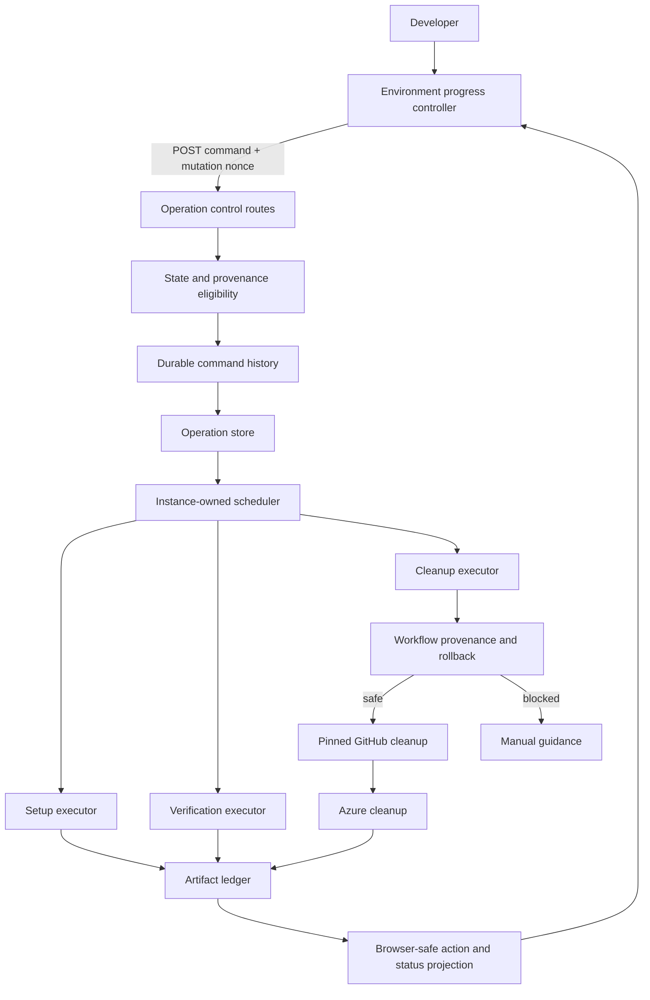

# Durable Create Environment operation controls

- **Author**: Ryan Waite (@ryanwaite)
- **Date**: 2026-08
- **Status**: In review

## Overview

Create Environment changes Azure identity, GitHub environment settings, repository workflows, and credential verification over several minutes. A user may close the Canvas, lose a response, encounter a permission delay, or stop after Radius has created only part of the environment. The durable operation record introduced by issues [#304](https://github.com/radius-project/ai-extensions/issues/304) and [#305](https://github.com/radius-project/ai-extensions/issues/305) lets the server survive those events, but durability alone does not tell Radius how to stop, continue, retry, or remove partial work.

This design adds a durable command model to the server-owned operation. Stop waits for the current external mutation to finish and takes effect at the next safe boundary. Continue and Retry resume from saved state. Rollback removes only resources the artifact ledger proves this operation created. Exit closes an incomplete setup and removes the same disposable resources when needed. The server projects the actions the browser may show, so the Canvas never guesses whether a destructive command is safe.

Successful credential verification is the completion boundary. Before that point, the operation remains an unfinished setup and may be retried or rolled back. After that point, the established environment uses the normal Delete Environment flow. No control in this design starts an application deployment.

This note builds on [Progress UX for credential and environment creation](./2026-08-progress-ux-credentials-environments.md). The accompanying architecture references describe the resulting [progress UX](../architecture/create-environment-progress-ux.md) and [rollback behavior](../architecture/create-environment-rollback.md) in operational detail.

## Terms and definitions

| Term                       | Definition                                                                                                                                          |
|----------------------------|-----------------------------------------------------------------------------------------------------------------------------------------------------|
| **Operation**              | One durable attempt to create and verify a Radius environment for a repository.                                                                     |
| **Command**                | A persisted user decision such as Stop, Continue, Retry, Rollback, or Exit.                                                                         |
| **Safe boundary**          | A point before or after an external mutation where Radius may stop without interrupting that mutation or losing its provenance.                     |
| **Artifact ledger**        | The server-only record of Azure, GitHub, and workflow artifacts created, reused, removed, or left ambiguous by the operation.                       |
| **Proven-owned**           | An artifact whose saved identity and origin prove that the current operation created it and may delete it.                                          |
| **Created candidate**      | An artifact that appeared during the operation but whose API semantics or failed create response do not prove ownership. Radius leaves it in place. |
| **Completion boundary**    | Successful credential verification. Before it, setup controls apply. After it, Delete Environment applies.                                          |
| **Attempt**                | A numbered setup, verification, or cleanup pass within the same operation.                                                                          |
| **Idempotency key**        | The deterministic identity of a command or retried mutation, derived from saved operation facts rather than time or randomness.                     |
| **Pinned GitHub executor** | A GitHub command runner bound to the account and credential selected for the operation.                                                             |
| **Terminal latching**      | The rule that the first terminal outcome remains authoritative and later errors cannot replace it.                                                  |
| **Action projection**      | The server-built list of controls, guidance, previews, and next transitions that the browser renders.                                               |

## Objectives

> **Issue Reference:** [#306: Environment Creation Hardening: Add cancellation, resume, and retry controls](https://github.com/radius-project/ai-extensions/issues/306). The implementation is [PR #358](https://github.com/radius-project/ai-extensions/pull/358).

### Goals

1. Let a user stop Create Environment without killing an Azure CLI, GitHub CLI, or HTTP mutation in flight.
2. Let a user stop immediately while Radius is waiting for input, because no mutation is active at that point.
3. Resume input and setup against the same durable operation and artifact ledger.
4. Retry only the failed class of work: setup, verification, or unresolved cleanup.
5. Give every non-terminal state either an automatic transition or a user action.
6. Preserve one active operation per repository across Stop, Continue, Retry, Rollback, Exit, reload, and restart.
7. Latch terminal outcomes and preserve command history across later attempts.
8. Report created, reused, removed, retained, and manually actionable resources truthfully.
9. Remove only artifacts whose stable identity and provenance prove that the operation created them.
10. Revert workflow changes before deleting the GitHub environment or cloud identity those workflows use.
11. Bind GitHub setup and rollback to the account the user selected.
12. Make duplicate clicks, lost responses, and retries converge on saved command identities.
13. Keep deployment user-initiated after environment creation and verification.
14. Present progress and recovery controls in an accessible inline panel that survives navigation and reload.

The design succeeds when a user can stop at any safe point, return after a reload or extension restart, choose a valid forward or cleanup path, and reach a terminal result without waiting for stale-record expiry. It also succeeds when Radius refuses destructive work whenever identity, ownership, repository access, or workflow provenance is uncertain.

### Non-goals

- **Killing an external command midway.** Stop is cooperative. Radius finishes the active mutation and stops before the next one.
- **The complete external-integration fault matrix from issue #307.** This design handles the failures required by the control paths but does not classify every GitHub, Azure, GHCR, network, or host fault.
- **Release-readiness work from issue #308.** Packaging, qualification, and release policy remain separate.
- **Automatic application deployment.** Create Environment controls never dispatch a deployment.
- **Deleting an established environment.** A verified environment follows the Delete Environment design, which starts from current state rather than creation provenance.
- **Deleting reused or ambiguous resources.** Radius preserves them and explains why.
- **A general workflow engine for every Radius operation.** This design establishes patterns that later operations may reuse, but it changes only Create Environment.
- **New providers or cloud resource types.** The control model remains provider-neutral, but this work does not add a provider.
- **Percentage-complete estimates.** Create Environment has conditional stages and no fixed denominator.

### User scenarios

#### User story 1: Stop and continue

A developer starts Create Environment, sees that Radius has created the App Registration, and clicks **Stop setup**. Radius finishes the current mutation, persists its result, stops before the next mutation, and shows **Continue setup**, **Roll back created resources**, and **Exit setup** when those actions are safe. Continue starts from the first incomplete step and reuses the recorded App Registration.

#### User story 2: Stop while Radius waits for input

Radius finds more than one eligible App Registration and asks the developer to choose one. The operation enters `input_required`, persists the prompt and resume request, and releases its executor. The developer may answer the prompt or stop immediately. A late answer cannot revive a terminal operation.

#### User story 3: Retry verification after an external condition changes

Radius commits workflows to a setup branch and asks the developer to merge a pull request. After the merge, the developer returns and clicks **Retry verification**. Radius dispatches the saved verification workflow on the saved ref for the saved environment. A similar retry covers positively identified Azure access propagation. OIDC configuration failures keep their own explanation rather than being mislabeled as propagation.

#### User story 4: Roll back partial setup

Setup fails after Radius creates Azure identity resources and a GitHub environment. The developer reviews the rollback preview and confirms. Radius removes workflow changes first when they exist, then deletes the GitHub environment, role assignments, federated credentials, Service Principal, and App Registration in reverse dependency order. Reused resources remain.

#### User story 5: Leave an incomplete setup

The developer no longer wants to finish the environment. **Exit setup** appears below **Show details**. It closes the operation and removes proven-owned disposable resources. If nothing owned remains, it closes without destructive work. If cleanup cannot finish, the operation stays visible with Retry rollback or manual guidance.

#### User story 6: Recover from reload, restart, or duplicate input

The developer reloads the Canvas, the extension restarts, or a command response is lost. The browser reloads the same operation. The registry reconciles persisted state, keeps proven cleanup results, and closes abandoned execution as an explicit terminal outcome. A repeated command resolves to the saved command rather than scheduling a second mutation.

## User experience

Create Environment uses the inline progress panel defined by [Progress UX for credential and environment creation](./2026-08-progress-ux-credentials-environments.md). The panel separates its headline from the stage summary and the detailed event history. Recovery actions sit above **Show details**. **Exit setup** and terminal **OK** sit below it.

**Sample input:**

```text
Create Environment

Profile: azure-prod
Environment: dev
Repository: contoso/store
Branch: feature/cart
Resource group: rg-prod
AKS cluster: aks-prod

[Create Environment]
```

**Sample output while Stop is pending:**

```text
Creating environment "dev"                                  0:42
Creating GitHub environment...

✓ Authorize deploy identity - succeeded
● Configure environment - running
○ Verify credentials - pending

[Stopping after the current step...]

▸ Show details
```

**Sample output after Stop:**

```text
Environment setup stopped                                   0:45
Radius stopped before the next setup step.

✓ Authorize deploy identity - succeeded
✓ Configure environment - stopped safely
- Verify credentials - skipped

[Continue setup] [Roll back created resources]

▸ Show details

[Exit setup]
```

**Sample rollback confirmation:**

```text
Roll back this environment setup?

Radius will remove
- Workflow file: .github/workflows/radius-verify-credentials.yml on main
- GitHub environment: contoso/store:dev
- Role assignment: Contributor @ /subscriptions/.../resourceGroups/rg-prod
- Federated credential: radius-dev @ repo:contoso/store:environment:dev

Radius will keep
- App Registration: shared-deploy-app (00000000-...)

Needs an action from you
- Service Principal: Radius cannot prove this attempt created it.

[Keep resources] [Roll back setup]
```

The server supplies every action and preview. The browser submits the projected route, shows accepted-command status in a polite live region, and disables controls while the command is in flight. Polling preserves focus on an unchanged command. If the command disappears, focus moves to a visible heading or panel. Confirmation traps focus; cancellation returns to the trigger; successful Exit moves focus to **New environment** before the panel closes.

## Design

### High-level design

The durable operation record is the source of truth for setup progress and control. It stores lifecycle state, attempts, commands, input prompts, verification identity, resource provenance, cleanup results, and terminal history. The repository registry treats a non-terminal record as the one-active-operation lock.

A control route loads the record, checks eligibility, records a deterministic command, changes the operation state, persists the record, and then schedules an instance-owned executor. The executor performs one setup, verification, or cleanup pass. It persists every resource mutation before starting the next one. The browser polls the record and renders the server's action projection.

Rollback reads the artifact ledger and selects only proven-owned artifacts. Workflow rollback gates all later deletion. The GitHub rollback runner uses the account saved on the operation, proves repository access, verifies workflow blobs and content, and rechecks access after a 404 before it treats an artifact as absent. Azure cleanup runs only after that gate passes.

### Architecture diagram



### Detailed design

#### Option 1: Browser-owned cancellation and retry

The browser would keep the active request, abort it when the user clicks Stop, and resend the Create Environment request for Retry.

##### Advantages

- Small change to the existing page code.
- No new command routes or persisted command model.
- Familiar request and response flow.

##### Disadvantages

- Aborting the browser request does not prove whether an external mutation succeeded.
- Navigation, reload, or host restart loses the control state.
- Resending the full request can duplicate cloud resources or overwrite repository files.
- The browser cannot safely decide what to delete.
- A lost response can leave the repository locked until stale timeout.

#### Option 2: Durable operation with coarse terminal retry

The server would keep the durable operation and expose a general Retry button that restarts setup from the beginning. Stop would mark the record terminal after the current request returns. Cleanup would remain a separate best-effort failure path.

##### Advantages

- Preserves operation identity across reload and restart.
- Keeps external work on the server.
- Requires fewer routes than separate commands.

##### Disadvantages

- A general Retry cannot distinguish setup, verification, and cleanup.
- Restarting from the beginning can repeat mutations whose outcomes are already known.
- A terminal flag does not record the user's command or make duplicate input idempotent.
- Cleanup cannot remove resources safely without an artifact ledger and stable identity.
- Verification handoff and input-required pauses remain special cases.

#### Proposed option: Durable commands over a provenance ledger

Radius records each user decision as a command on the existing operation. The command kind, attempt number, and logical target determine a stable command ID. The control route persists the reopened operation before it schedules work. The executor reads the retained artifact ledger and performs only the selected work.

This option costs more code because it models the real states instead of hiding them behind one Retry button. It gives every state an owner, makes duplicate input converge, and lets destructive work fail closed. It also preserves the server-owned execution and operation durability established by issues #304 and #305.

#### Operation record and schema

[`packages/adapter-canvas/src/operations.ts`](../../packages/adapter-canvas/src/operations.ts) owns the schema. Schema version 4 stores:

- Setup, verification, and cleanup attempt counters.
- Stop request and honored boundary.
- Command history with accepted, running, and finished states.
- Input-required prompt and safe resume request.
- Verification workflow, ref, environment, run ID, and run URL.
- Artifact ledger and cleanup results.
- Workflow commit, blob, content digest, previous blob, and proof that the previous path state was observed.
- Terminal outcomes and prior attempt history.

Versions 1 through 3 load into the version 4 shape. Missing provenance remains missing. A legacy null previous blob does not become permission to delete a workflow merely because a later retry writes the file again. A non-null prior blob still proves that the path existed.

#### Command acceptance and idempotency

[`packages/adapter-canvas/src/server/routes/operations-control.ts`](../../packages/adapter-canvas/src/server/routes/operations-control.ts) follows one acceptance sequence:

1. Load the operation and parse the command target.
2. Return the saved command for a duplicate submission.
3. Re-evaluate eligibility from the durable record.
4. Acquire the repository through the non-terminal operation state.
5. Save a snapshot of the preceding terminal state.
6. Increment the appropriate attempt counter.
7. Record the deterministic command.
8. Position the operation at the correct stage or cleanup state.
9. Persist.
10. Schedule the executor.

If persistence fails, the route restores the snapshot. If scheduling fails, it restores the terminal record or closes the promised retry with an explicit failure. The route never returns success while leaving a non-terminal record with no executor.

The command ID has this logical shape:

```text
{operationId}:{commandKind}:{attempt}:{target}
```

Cleanup commands include a digest of the exact artifact keys selected for deletion. A duplicate click, reload, or lost response therefore resolves to the same command.

#### Cooperative Stop

The Stop route persists the request and returns `202`. It never kills a child process. Setup checks Stop before a mutation and after the checkpoint that records the preceding mutation. Azure identity setup, GitHub environment creation, workflow commits, and verification dispatch use these boundaries.

When the operation waits for input, Stop may finish immediately because no external mutation is active. When an executor is active, Stop remains pending until the executor reaches a boundary. The operation records the boundary that honored the request.

#### Input resume

An input-required operation persists the prompt code, checkpoint, candidates, default selection, request time, and safe resume request. The browser submits the answer to the prompt-specific resume route with the operation ID, repository, environment, provider, and checkpoint. The server rejects stale prompts and answers for terminal operations.

The operation does not hold the host process alive while waiting indefinitely for a person. It does retain the one-active-operation lock because a second setup would race the paused artifacts.

#### Targeted retries

Setup retry resumes from `nextIncompleteSetupStep`. It reuses ledger-confirmed resources and refuses to proceed when a mutation may have succeeded without saved ownership.

Verification retry uses the saved workflow, ref, environment, and identity. It covers a merged setup pull request, positive Azure access propagation evidence, expired tracking, and a failed dispatch. A failed OIDC claim, workflow syntax problem, or runner fault keeps its own classification and copy.

Cleanup retry selects warning results from the latest cleanup attempt that still map to proven-owned ledger artifacts. It excludes successful deletion, restoration, `not_found`, skipped ambiguity, and reused resources.

#### One active operation and terminal latching

The registry uses a repository's non-terminal operation as its lock. Continue and Retry reopen the same operation; another operation for the same repository receives a conflict.

The first terminal result latches. Later errors cannot overwrite it. A terminal transition closes any accepted or running command so a stale command cannot absorb the next user action.

Restart reconciliation handles each saved state:

- A saved Stop finishes at the restart boundary.
- An input prompt returns to `input_required`.
- A complete verification identity returns to verification tracking.
- An interrupted cleanup remains marked `running` on the terminal record, which allows the user to start Rollback again against the surviving ledger.
- Other interrupted work becomes `failed_partial` with a safe retry or cleanup path.

Stale-record reconciliation never terminalizes an in-memory operation while its executor is active.

#### Artifact ledger and ownership

The ledger distinguishes presence from origin. `state` answers whether this operation may remove the artifact. `origin` explains where the artifact came from.

| Artifact             | Saved identity                       | Ownership rule                                                                           |
|----------------------|--------------------------------------|------------------------------------------------------------------------------------------|
| App Registration     | App ID                               | Delete only when this operation created it.                                              |
| Service Principal    | App ID and object ID                 | Delete only when creation succeeded and was recorded. A create race remains a candidate. |
| Federated credential | Name and subject                     | Every recorded entry was created by this operation.                                      |
| Role assignment      | Role, scope, and principal object ID | Every recorded entry was created by this operation.                                      |
| GitHub environment   | Repository and environment name      | Promote to created only after absence, PUT evidence, and checkpoint align.               |
| Workflow file        | Branch and path                      | Revert only with complete commit, blob, content, and previous-state provenance.          |

Provenance is monotonic for the same identity. A later lookup that finds a created resource does not downgrade it to reused. A different identity does not inherit ownership.

GitHub environment creation needs special proof because the PUT API is idempotent. Radius records a candidate, compares the returned creation time with the request, promotes a matching candidate, and persists that promotion in the mutation checkpoint before it honors Stop.

#### Workflow provenance

For each workflow write, Radius saves the target branch, commit SHA, blob SHA, content SHA-256, previous blob SHA, and whether the pre-write lookup proved the prior path state. A retry updates the current commit, blob, and digest.

Radius preserves the original pre-setup blob only when the new write proves it replaced the blob from Radius's preceding write. If another actor edits the workflow between Radius writes, the next record saves that intervening blob as the version rollback must restore. If the prior state was never observed, rollback refuses the file.

#### Rollback

Rollback is available only before successful credential verification. The server builds the preview and selection from stable ledger keys. The browser displays the preview but never derives the target set.

Pre-commit rollback removes:

1. GitHub environment.
2. Azure role assignments.
3. Federated credentials.
4. Service Principal.
5. App Registration.

Post-commit rollback first removes workflow changes:

1. Create a pinned executor for the GitHub account saved on the operation.
2. Prove that account can read the repository.
3. Read the setup pull request, branch head, and every workflow.
4. Recheck repository access after any file, branch, or deletion 404 before treating it as absence.
5. Refuse the whole workflow pass if one file changed or cannot be verified.
6. Delete an unchanged unmerged setup branch, or commit per-file deletes and restores.
7. Record `deleted`, `restored`, `not_found`, `warning`, or `skipped`.
8. Delete the GitHub environment and Azure identity only after the workflow pass succeeds.

This order prevents an installed workflow from losing the credentials and environment it references.

#### Exit setup

Exit and Rollback use the same proven-owned cleanup selection. Their intent differs. Rollback tells the user that Radius is undoing setup. Exit tells the user that Radius is closing an incomplete interaction.

Exit appears at the bottom of the panel. It confirms destructive cleanup when needed. An operation that owns nothing closes without deletion. An incomplete cleanup remains visible and actionable.

#### GitHub identity and credential selection

Create Environment pins one [`SelectedGhExecutor`](../../packages/adapter-canvas/src/gh.ts) to the selected login and credential source. The executor verifies the acting login before it runs commands. Setup, workflow publication, GHCR credential reporting, workflow rollback, and GitHub environment deletion use that identity.

The credential resolver distinguishes `GH_TOKEN` and `GITHUB_TOKEN` from stored `oauth_token` and keyring entries by exact source. It reads scopes from the credential it selected, even when the same login appears twice. A whitespace-only `GH_TOKEN` does not hide a valid `GITHUB_TOKEN`. Account-qualified keyring lookup uses GitHub CLI multi-account support and a bounded timeout.

Workflow-scope fallback runs only after a positive missing-scope response and never after a timeout with unknown outcome. User guidance names the credential that actually failed. Radius does not tell a user to refresh an injected session token that GitHub CLI cannot change.

#### Action projection and browser behavior

`toClientView` projects:

- Headline and supporting text.
- Current and terminal state.
- Safe stage and step labels.
- Cleanup inventory and manual actions.
- Valid controls and their placement.
- Confirmation copy and rollback preview.
- Guidance for unavailable paths.
- The next automatic transition.

[`packages/adapter-canvas/src/browser/environment/operations.ts`](../../packages/adapter-canvas/src/browser/environment/operations.ts) parses this narrow contract. It does not receive tokens, secret values, raw CLI output, workflow logs, or private failure evidence.

The browser keeps the high-level headline separate from detailed steps. It rebuilds projected controls as state changes while preserving keyboard focus when the same action remains. Live-region status changes only when the message changes. Every terminal path releases the page's Create Environment latch, including verification fallback and timeout paths.

#### Environment-list consistency

Rollback and Exit invalidate the repository-scoped environment-list cache before the operation becomes terminal. The browser reloads the table after GitHub environment removal. A cache generation counter prevents an older in-flight listing from repopulating stale data after invalidation.

### API design

These routes are loopback Canvas APIs. Mutation routes require `X-Radius-Mutation-Nonce`.

| Method | Path                                               | Purpose                                                      |
|--------|----------------------------------------------------|--------------------------------------------------------------|
| `POST` | `/api/operations`                                  | Start and persist a server-owned environment operation.      |
| `GET`  | `/api/operations?repo={repo}`                      | Read the current operation for a repository.                 |
| `GET`  | `/api/operations/{operationId}`                    | Read one operation.                                          |
| `POST` | `/api/operations/{operationId}/stop`               | Persist a cooperative Stop request.                          |
| `POST` | `/api/operations/{operationId}/continue`           | Continue an intentionally stopped setup.                     |
| `POST` | `/api/operations/{operationId}/resume/{code}`      | Supply input for a persisted prompt.                         |
| `POST` | `/api/operations/{operationId}/retry/setup`        | Retry the unfinished setup step.                             |
| `POST` | `/api/operations/{operationId}/retry/verification` | Retry the saved verification target.                         |
| `POST` | `/api/operations/{operationId}/rollback`           | Start proven-owned cleanup.                                  |
| `POST` | `/api/operations/{operationId}/retry/cleanup`      | Retry unresolved proven-owned cleanup warnings.              |
| `POST` | `/api/operations/{operationId}/exit`               | Close incomplete setup and clean disposable owned artifacts. |

Example accepted command response:

```json
{
  "operationId": "op_123",
  "commandId": "op_123:rollback:1:cleanup#7ed8b4d1326b3c90",
  "attempt": 1,
  "state": "accepted",
  "statusUrl": "/api/operations/op_123"
}
```

The operation read response contains the browser-safe projection rather than the private ledger. The exact action list changes with state.

### Implementation details

#### Core package: packages/core

N/A. The controls govern Canvas orchestration and external adapter mutations. No UI-agnostic core API changes.

#### Canvas adapter: packages/adapter-canvas

- [`src/operations.ts`](../../packages/adapter-canvas/src/operations.ts) owns schema version 4, commands, attempts, lifecycle rules, artifact provenance, rollback selection, action projection, persistence normalization, restart reconciliation, and repository locking.
- [`src/operation-store.ts`](../../packages/adapter-canvas/src/operation-store.ts) persists operation envelopes.
- [`src/server/routes/operations-control.ts`](../../packages/adapter-canvas/src/server/routes/operations-control.ts) owns Stop, Continue, Rollback, Exit, and Retry routes.
- [`src/server/routes/create-environment.ts`](../../packages/adapter-canvas/src/server/routes/create-environment.ts) adds safe checkpoints and GitHub environment ownership proof.
- [`src/server/routes/azure-auto-setup-application.ts`](../../packages/adapter-canvas/src/server/routes/azure-auto-setup-application.ts) and [`azure-auto-setup-credentials.ts`](../../packages/adapter-canvas/src/server/routes/azure-auto-setup-credentials.ts) record identity origin and stop between Azure mutations.
- [`src/server/routes/create-environment-workflow-committer.ts`](../../packages/adapter-canvas/src/server/routes/create-environment-workflow-committer.ts) records commit and previous-path provenance.
- [`src/server/services/cleanup-commands.ts`](../../packages/adapter-canvas/src/server/services/cleanup-commands.ts) defines cleanup command selections.
- [`src/server/services/workflow-provenance.ts`](../../packages/adapter-canvas/src/server/services/workflow-provenance.ts) verifies workflow and branch identity.
- [`src/server/services/workflow-rollback.ts`](../../packages/adapter-canvas/src/server/services/workflow-rollback.ts) chooses branch deletion or per-file reversion.
- [`src/server/services/workflow-rollback-ports.ts`](../../packages/adapter-canvas/src/server/services/workflow-rollback-ports.ts) maps pinned GitHub commands into fail-closed reads and mutations.
- [`src/server/services/github-environment-provenance.ts`](../../packages/adapter-canvas/src/server/services/github-environment-provenance.ts) proves GitHub environment ownership.
- [`src/server/services/environment-listing-cache.ts`](../../packages/adapter-canvas/src/server/services/environment-listing-cache.ts) prevents stale listings after cleanup.
- [`src/gh.ts`](../../packages/adapter-canvas/src/gh.ts) selects, verifies, pins, and describes the effective GitHub credential.
- [`src/server.ts`](../../packages/adapter-canvas/src/server.ts) composes per-instance executors and runs ordered cleanup.
- [`src/pages/environment/environments-pane.ts`](../../packages/adapter-canvas/src/pages/environment/environments-pane.ts) renders progress and confirmation markup.
- [`src/browser/environment/operations.ts`](../../packages/adapter-canvas/src/browser/environment/operations.ts) renders the operation, sends controls, polls, manages focus, and applies terminal results.
- [`src/browser/environment/page.ts`](../../packages/adapter-canvas/src/browser/environment/page.ts) owns the Create Environment latch and supplies the terminal reset.

#### Shared adapter: packages/adapter-shared

N/A. The design does not change managed Radius or Bicep execution.

#### Plugin: plugins/radius

The plugin manifest, Canvas ID, action surface, and tool surface do not change. The generated `plugins/radius/dist/extension.mjs` includes the Canvas adapter changes after the normal build.

#### Build and packaging

The build continues to emit one loadable extension bundle with the Copilot SDK externalized. Three Changesets describe operation controls, GitHub credential selection, and post-commit rollback. No runtime dependency or lockfile change is required.

### Error handling

| Failure                                      | Result                                                                      |
|----------------------------------------------|-----------------------------------------------------------------------------|
| Operation persistence fails before mutation  | Return failure and change no external resource.                             |
| Command persistence fails                    | Restore the preceding terminal snapshot.                                    |
| Command scheduling fails                     | Restore or terminalize explicitly; leave no active record without a runner. |
| Stop arrives during mutation                 | Persist Stop and honor it after the mutation checkpoint.                    |
| Input answer is stale                        | Reject it; do not revive or change the operation.                           |
| Setup ownership is ambiguous                 | Refuse setup retry or automatic deletion.                                   |
| Verification pull request has not merged     | Keep `action_required`; retry only after merge.                             |
| Azure access may not be effective            | Offer classified verification retry with accurate guidance.                 |
| OIDC, syntax, or runner verification failure | Keep the actual failure classification and run URL.                         |
| Workflow provenance is incomplete            | Refuse post-commit rollback.                                                |
| Workflow file changed                        | Block the whole workflow pass and dependent deletion.                       |
| Repository access is lost                    | Treat reads and 404s as unreadable; keep dependent resources.               |
| Setup branch head moved                      | Refuse branch deletion.                                                     |
| GitHub environment ownership is unproven     | Leave it and report manual action.                                          |
| Azure or GitHub deletion returns not found   | Record convergence as `not_found`.                                          |
| Independent Azure deletion fails             | Record warning and continue safe independent deletions.                     |
| Cleanup is interrupted by restart            | Keep proven results, recompute survivors, and offer Rollback again.         |
| Browser poll fails                           | Keep the current panel and retry polling.                                   |
| Verification tracking expires                | Stop the local poll, release Create, and tell the user to inspect the run.  |

## Test plan

Every external system sits behind a controlled port or fake. Pull-request tests use no personal credential, live cloud resource, mutable repository, or public network dependency.

### Unit tests

- Operation state transitions, terminal latching, one-active-operation locking, command identity, duplicate submission, migration, restart, stale reconciliation, and action projection.
- Artifact provenance for Azure identity, Service Principals, GitHub environments, workflows, and cleanup results.
- Workflow commit chains, intervening customer edits, legacy unknown previous state, branch identity, file digest verification, and restore versus delete.
- Pinned GitHub credential selection, duplicate login entries, injected-token precedence, keyring lookup, scope reporting, timeout handling, and error redaction.
- Browser parsing, command submission, focus preservation, live-region stability, terminal reset, confirmation, preview rendering, and environment-list refresh.
- Route template matching and shadow rejection in either declaration order.

### HTTP integration

- Start, Stop, Continue, input resume, setup retry, verification retry, Rollback, rollback retry, and Exit through a real loopback server.
- Mutation nonce enforcement, malformed input, duplicate commands, persistence failure, scheduling failure, and repository conflict.
- GitHub environment ownership checkpoint and cache invalidation.
- Post-commit rollback acceptance and refusal.

### Runtime and artifact integration

- Real Canvas runtime composition with a fake SDK session.
- Production bundle load, registration, startup, and shutdown.

### Browser tests

- Importable browser modules retain full statement, function, and line coverage.
- Browser component tests run the extracted browser behavior in Chromium.
- Canvas Chromium tests cover server-owned setup across navigation, GitHub identity selection, keyboard focus, destructive confirmation, branch selection, and heartbeat recovery.

### Validation gates

The pull request runs frozen install, typecheck, lint, formatting, Markdown lint, full Vitest coverage, build, runtime integration, HTTP integration, artifact integration, browser component tests, and Canvas Chromium. Changed production lines and branches target full coverage.

## Security

### Destructive cleanup

**Threat:** Radius deletes a customer-owned or shared resource.

**Mitigation:** Cleanup selects only artifacts marked `created` with stable identity. Reused and candidate resources remain. Missing identity or provenance blocks deletion. The browser cannot add targets because the server rebuilds the selection when the command arrives.

### Workflow and credential dependency

**Threat:** Radius leaves a workflow installed but deletes the environment or identity it needs.

**Mitigation:** Workflow proof and reversion gate all dependent deletion. One changed or unreadable workflow blocks the pass. Radius rechecks repository access after each 404.

### Wrong GitHub account

**Threat:** Ambient GitHub CLI state causes setup or rollback to act as another user.

**Mitigation:** The operation saves the selected login. A pinned executor obtains an account-qualified credential, verifies the acting login, and runs setup and rollback. Exact source parsing keeps stored `oauth_token` entries distinct from injected tokens.

### Duplicate mutation

**Threat:** Double click, lost response, timeout, or restart repeats a cloud or repository mutation.

**Mitigation:** Commands and retried mutations use deterministic identities. The record persists before scheduling. A timeout with unknown GitHub outcome does not authorize credential fallback.

### Cross-site local mutation

**Threat:** Another page posts a destructive command to the loopback server.

**Mitigation:** Every control route requires the Canvas mutation nonce and validates its operation and path parameters.

### Secret exposure

**Threat:** The Canvas displays or persists credentials, workflow logs, or raw CLI errors.

**Mitigation:** The browser receives a narrow projection. The ledger stores identifiers and safe outcomes, not tokens or secret values. GitHub command errors redact injected and credential-shaped tokens.

### Repository races

**Threat:** Another actor changes a workflow or setup branch between Radius writes and rollback.

**Mitigation:** Radius saves commit, blob, content, and previous-state provenance. A recommit preserves the original customer blob only when the blob chain proves uninterrupted Radius ownership. Otherwise it restores the intervening customer edit or refuses if prior state is unknown.

## Compatibility

- Operation schema version 4 reads versions 1 through 3 and fills missing fields with safe defaults.
- Older records without workflow or previous-state proof remain visible but refuse unsafe post-commit rollback.
- The control routes add loopback API paths without changing public Canvas actions, tools, or plugin metadata.
- The browser accepts missing optional projection fields and falls back to safe empty values.
- GitHub CLI 2.40 or later is required for account-qualified multi-account token lookup. Older clients receive a specific error rather than falling through to the active account.
- Existing final states and stage names remain available to the progress design.
- The extension still builds as one `plugins/radius/dist/extension.mjs`.

## Monitoring and logging

The operation record is the primary diagnostic. It carries timestamps, stage and step history, attempts, commands, input prompt identity, safe resource identifiers, cleanup results, terminal outcome, and recovery state.

The server reports operation-store and best-effort persistence failures through the existing operation diagnostic reporter. Cleanup persists each meaningful result before the next deletion. The browser shows safe summaries and links to GitHub runs but never raw logs or private evidence.

The shared session timeline may announce operation completion. It does not drive state or repair. Troubleshooting starts with the operation ID, command ID, failure code, current stage, and artifact ledger.

No new telemetry service, metric backend, or trace exporter is part of this design.

## Development plan

The work is large because safe control depends on durable state, execution ownership, provenance, API contracts, and browser behavior. The delivery order keeps each invariant testable before destructive controls appear.

1. **Durable command model and migration (large).** Add control history, attempts, eligibility, idempotency, action projection, schema migration, and restart reconciliation in `operations.ts`, with model and persistence tests.
2. **Typed control routes and executors (large).** Add Stop, Continue, Retry, Rollback, and Exit routes; persist before scheduling; compose server-owned executors; add HTTP tests.
3. **Safe boundaries and input resume (medium).** Add checkpoints around Azure, GitHub environment, workflow, and verification mutations; bind prompt answers to the operation; test Stop at every boundary.
4. **Artifact provenance and rollback (large).** Track Azure and GitHub ownership, add workflow commit provenance, implement workflow-first cleanup and retry, and test every fail-closed refusal.
5. **GitHub credential correctness (medium).** Pin the selected account, distinguish injected and stored credentials, report effective scopes and package credentials, and test multi-account collisions.
6. **Progress and recovery UX (large).** Add server-projected controls, confirmation, partial-state inventory, terminal placement, focus, live regions, and Create-latch recovery.
7. **Cache consistency and documentation (small).** Add generation-based listing invalidation and update the progress and rollback architecture references.
8. **Qualification (medium).** Run the complete repository gates, build and install the Canvas, test manually, sign commits, and move the pull request to review.

PR #358 contains these slices as separate commits where practical, followed by focused hardening and refactoring.

## Open questions

### Should other long-running Radius operations reuse this command model?

The command history, action projection, cleanup result vocabulary, and focus conventions fit Delete Environment and deployment repair. Reuse should preserve each operation's own completion and ownership rules rather than turn `operations.ts` into an untyped general workflow engine.

### How much operation history should the store retain?

The current store retains a bounded set of terminal operations. Support and audit needs may justify longer retention or an export, but that choice changes privacy, storage, and lifecycle policy.

### Should the Canvas add a dedicated critical journey for Stop, Continue, Rollback, and Exit?

Unit and HTTP tests cover the state machine and destructive boundaries, and the current Chromium gate covers related environment behavior. A dedicated browser-and-server journey would test the full visible recovery sequence and focus movement in one scenario.

### Should created candidates support later ownership proof?

The current design leaves an ambiguous Service Principal or GitHub environment in place. A later proof protocol could adopt a candidate, but it must rely on authoritative immutable evidence rather than timing or naming.

### Should verification retry expose more failure classes?

The design recognizes the production cases required by issue #306. Issue #307 may add a wider fault vocabulary. New classes should remain closed and evidence-based.

## Alternatives considered

### Kill the active process

Rejected because a terminated CLI or HTTP request has unknown external outcome. Radius could retry a mutation that already succeeded or lose the provenance needed to clean it up.

### Roll back automatically after every failure

Rejected because users may want to fix a permission or merge a setup pull request, and because automatic deletion is unsafe for reused or ambiguous resources.

### Treat workflow commit as successful environment creation

Rejected because committed workflows can still fail credential verification. Successful verification marks the environment ready.

### Delete resources by expected name

Rejected because names are not ownership proof. Shared and pre-existing resources may match Radius naming conventions.

### Let the browser decide which actions are valid

Rejected because browser state can be stale and cannot see the private ledger. The server must re-evaluate every command.

### Use the ambient GitHub CLI account for rollback

Rejected because setup may have used another selected account. GitHub also returns 404 when a credential cannot see a private repository, which can look like absence.

### Rely on stale timeout to release the repository

Rejected because a quiet record can retain created resources and block the user with no visible recovery. Every non-terminal state needs an action or automatic transition.

### Restore the first pre-setup workflow blob after every recommit

Rejected when the blob chain breaks. Another actor may have edited the file between Radius writes. Rollback restores the immediately overwritten customer edit in that case.

## Design review notes

Draft for review. The implementation in [PR #358](https://github.com/radius-project/ai-extensions/pull/358) informed this note and remains subject to design review. Record accepted decisions, requested changes, and follow-up issues here before the design note merges.
