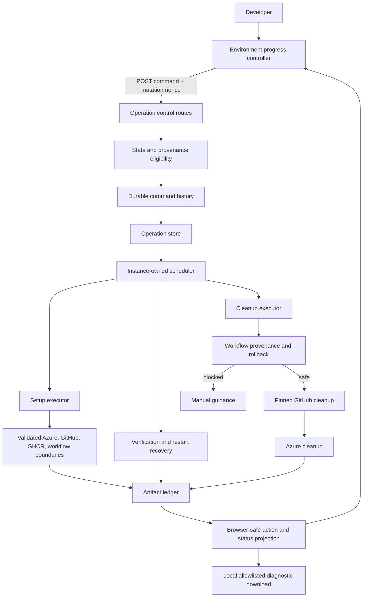

# Durable Create Environment operation controls

- **Author**: Ryan Waite (@ryanwaite)
- **Date**: 2026-08
- **Status**: In review

## Overview

Create Environment changes Azure identity, GitHub environment settings, repository workflows, and credential verification over several minutes. A user may close the Canvas, lose a response, encounter a permission delay, or stop after Radius has created only part of the environment. The durable operation record introduced by issues [#304](https://github.com/radius-project/ai-extensions/issues/304) and [#305](https://github.com/radius-project/ai-extensions/issues/305) lets the server survive those events, but durability alone does not tell Radius how to stop, continue, retry, or remove partial work.

This design adds durable commands and provider-mutation journals to the server-owned operation. Stop waits for the current external mutation to finish and takes effect at the next safe boundary. Continue and Retry resume from saved state. Rollback removes only resources selected from the artifact ledger and rechecks their provider identities before deletion. Exit closes an incomplete setup and uses the same cleanup machinery when disposable resources remain. The server projects the actions the browser may show, so the Canvas never guesses whether a destructive command is safe.

Successful credential verification is the completion boundary. Before that point, the operation remains an unfinished setup and may be retried or rolled back. After that point, the established environment uses the existing Delete Environment flow, which discovers current state rather than relying on creation-time provenance. No separate Delete Environment design exists in this repository, and no control in this design starts an application deployment.

This note builds on [Progress UX for credential and environment creation](./2026-08-progress-ux-credentials-environments.md). The accompanying architecture references describe the resulting [progress UX](../architecture/create-environment-progress-ux.md) and [rollback behavior](../architecture/create-environment-rollback.md) in operational detail.

## Terms and definitions

| Term                          | Definition                                                                                                                                                                                                                                                                                                      |
|-------------------------------|-----------------------------------------------------------------------------------------------------------------------------------------------------------------------------------------------------------------------------------------------------------------------------------------------------------------|
| **Operation**                 | One durable attempt to create and verify a Radius environment for a repository.                                                                                                                                                                                                                                 |
| **Command**                   | A persisted user decision such as Stop, Continue, Retry, Rollback, or Exit.                                                                                                                                                                                                                                     |
| **Safe boundary**             | A point before or after an external mutation where Radius may stop without interrupting that mutation or losing its provenance.                                                                                                                                                                                 |
| **Artifact ledger**           | The server-only record of Azure, GitHub, and workflow artifacts created, reused, removed, or left ambiguous by the operation.                                                                                                                                                                                   |
| **Proven-owned**              | An artifact whose saved identity and origin prove that the current operation created it and may delete it.                                                                                                                                                                                                      |
| **Created candidate**         | An artifact that appeared during the operation but whose API semantics or failed create response do not prove ownership. Radius leaves it in place.                                                                                                                                                             |
| **Completion boundary**       | Successful credential verification. Before it, setup controls apply. After it, Delete Environment applies.                                                                                                                                                                                                      |
| **Attempt**                   | A numbered setup, verification, or cleanup pass within the same operation.                                                                                                                                                                                                                                      |
| **Command identity**          | The deterministic key for one accepted user command, derived from the operation, command kind, attempt, and logical target.                                                                                                                                                                                     |
| **Mutation journal**          | A durable record written before an external provider request and settled only after an acknowledged result or exact provider-state reconciliation.                                                                                                                                                              |
| **Pinned GitHub executor**    | A GitHub command runner bound to the account and credential selected for the operation.                                                                                                                                                                                                                         |
| **Provider restart decision** | A durable pause after the Radius provider restarts, requiring the user to continue or stop before setup resumes.                                                                                                                                                                                                |
| **Exact workflow run**        | The GitHub Actions run identified by the immutable run ID and URL returned by dispatch or recovered from operation-specific evidence.                                                                                                                                                                           |
| **Diagnostic export**         | A local, allowlisted JSON summary. Its default profile excludes contextual identifiers; its optional profile adds only fingerprint-bound repository, branch, environment, and GitHub login values after explicit review. Resource identities, inputs, labels, targets, URLs, logs, and secrets remain excluded. |
| **Terminal latching**         | The rule that the first terminal outcome remains authoritative and later errors cannot replace it.                                                                                                                                                                                                              |
| **Action projection**         | The server-built list of controls, guidance, previews, and next transitions that the browser renders.                                                                                                                                                                                                           |

## Objectives

> **Issue Reference:** [#306: Environment Creation Hardening: Add cancellation, resume, and retry controls](https://github.com/radius-project/ai-extensions/issues/306). Native stack 517 ordered the merged implementation as [PR #508](https://github.com/radius-project/ai-extensions/pull/508), [PR #511](https://github.com/radius-project/ai-extensions/pull/511), [PR #515](https://github.com/radius-project/ai-extensions/pull/515), and [PR #516](https://github.com/radius-project/ai-extensions/pull/516). Follow-on work is in [PR #544](https://github.com/radius-project/ai-extensions/pull/544) for integration boundaries, [PR #580](https://github.com/radius-project/ai-extensions/pull/580) for diagnostics and readiness evidence, [PR #599](https://github.com/radius-project/ai-extensions/pull/599) for restart decisions and workflow cancellation, and [PR #600](https://github.com/radius-project/ai-extensions/pull/600) for verification dispatch identity. These follow-on pull requests are still in review.

### Goals

1. Let a user stop Create Environment without killing an Azure CLI, GitHub CLI, or HTTP mutation in flight.
2. Let a user stop immediately while Radius is waiting for input, because no mutation is active at that point.
3. Resume input and setup against the same durable operation and artifact ledger.
4. Retry only the failed class of work: setup, verification, or unresolved cleanup.
5. Give every non-terminal state either an automatic transition or a user action.
6. Preserve one active operation per repository within a hydrated Copilot App session across Stop, Continue, Retry, Rollback, Exit, reload, and restart.
7. Latch terminal outcomes and preserve the latest 20 commands plus bounded attempt outcomes across later attempts.
8. Report created, reused, removed, retained, and manually actionable resources truthfully.
9. Remove only artifacts whose saved provenance authorizes cleanup and whose current immutable provider identity still matches.
10. Revert workflow changes before deleting the GitHub environment or cloud identity those workflows use.
11. Bind GitHub setup and rollback to the account the user selected.
12. Make duplicate clicks converge on saved command identities, and make lost provider responses converge through durable mutation journals and exact reconciliation rather than blind replay.
13. Keep deployment user-initiated after environment creation and verification.
14. Present progress and recovery controls in an accessible inline panel that survives navigation and reload.
15. Validate external response shapes, retry only bounded transient failures, and reject generated workflows that violate the expected trigger and composition contract.
16. Pause after a provider restart so the user explicitly chooses whether to continue setup or stop it.
17. Track the exact verification run and block destructive cleanup while that run is active or its status is unknown.
18. Let the user download a local allowlisted diagnostic summary without exposing resource identities, request values, logs, or secrets.

The design succeeds when a user can stop at any safe point, return after a reload or extension restart, choose a valid forward or cleanup path, and reach a terminal result without waiting for stale-record expiry. It also succeeds when Radius refuses destructive work whenever identity, ownership, repository access, workflow provenance, or provider mutation outcome is uncertain. This durability guarantee currently depends on a writable operation store; [issue #506](https://github.com/radius-project/ai-extensions/issues/506) tracks the unresolved no-op store fallback.

### Non-goals

- **Killing an external command midway.** Stop is cooperative. Radius finishes the active mutation and stops before the next one.
- **Production-readiness approval from issue #308.** PR #580 adds the repository-owned diagnostic, support, and evidence surfaces, but it deliberately leaves live, human, and release gates blocked or not run.
- **Automatic application deployment.** Create Environment controls never dispatch a deployment.
- **Deleting an established environment.** A verified environment follows the existing Delete Environment flow, which starts from current state rather than creation provenance.
- **Deleting reused or ambiguous resources.** Radius preserves them and explains why.
- **A general workflow engine for every Radius operation.** This design establishes patterns that later operations may reuse, but it changes only Create Environment.
- **New providers or cloud resource types.** The control model remains provider-neutral, but this work does not add a provider.
- **Percentage-complete estimates.** Create Environment has conditional stages and no fixed denominator.
- **AWS environment creation.** Boundary validation remains provider-aware, but the implemented Create Environment path and diagnostic provider vocabulary are Azure-only.

### User scenarios

#### User story 1: Stop and continue

A developer starts Create Environment, sees that Radius has created the App Registration, and clicks **Stop setup**. Radius finishes the current mutation, persists its result, and stops before the next mutation. The server projects **Continue setup** only when the saved request and ledger support a safe forward step, **Roll back created resources** only when at least one proven-owned target is removable and no provider outcome remains unresolved, and **Exit setup** for any unfinished terminal attempt that the user has not already exited. Continue starts from the first incomplete step and reuses the recorded App Registration.

#### User story 2: Stop while Radius waits for input

Radius finds more than one eligible App Registration and asks the developer to choose one. The operation enters `input_required`, persists the prompt and resume request, and releases its executor. The developer may answer the prompt or stop immediately. If nobody answers for 60 minutes, stale reconciliation terminalizes the prompt as `failed_partial` with `operation-input-expired`, which releases the active lock while preserving any cleanup authority. A late answer cannot revive a terminal operation.

#### User story 3: Retry verification after an external condition changes

Radius commits workflows to a setup branch and asks the developer to merge a pull request. After the merge, the developer returns and clicks **Retry verification**. Radius reacquires the saved GitHub account within a persisted 45-minute acquisition window, proves the merge with that executor, establishes a workflow-run baseline, and dispatches the saved workflow, ref, environment, event, and operation marker. It adopts only the run whose exact identity matches. A similar retry covers positively identified Azure access propagation. OIDC configuration failures keep their own explanation rather than being mislabeled as propagation.

#### User story 4: Roll back partial setup

Setup fails after Radius creates Azure identity resources, a GitHub environment, and environment variables. The developer reviews the rollback preview and confirms. Radius removes workflow changes first when they exist, restores or deletes unchanged environment variables, then deletes the GitHub environment, role assignments, federated credentials, Service Principal, and App Registration in reverse dependency order. Reused resources and user-modified variables remain.

#### User story 5: Leave an incomplete setup

The developer no longer wants to finish the environment. **Exit setup** appears below **Show details**. Exit is a product decision to close the incomplete interaction; Rollback is the explicit destructive recovery choice to undo setup. Exit invokes the same cleanup executor only when proven-owned disposable resources remain. If nothing owned remains, it closes without destructive work. If cleanup cannot finish, the operation stays visible with Retry rollback or manual guidance and is not marked exited.

#### User story 6: Recover from reload, restart, or duplicate input

The developer reloads the Canvas, the extension restarts, or a command response is lost. The browser reloads the same operation. The registry restores persisted state, reopens unresolved provider or cleanup journals for reconciliation, keeps proven cleanup results, and terminalizes only after it can state what happened or hand the ambiguity to the user. A repeated command resolves to the saved command rather than scheduling a second mutation.

#### User story 7: Choose what happens after a provider restart

The Radius provider restarts while Create Environment or verification is unfinished. The restored operation becomes `action_required` with reason `provider-restart-decision` rather than silently resuming. **Continue setup** resumes from the saved owner and monitors the exact saved verification run without dispatching another one. **Stop setup** closes the Radius attempt, then reads that exact run through the saved GitHub account. If it is active, the panel offers **Cancel workflow**; Rollback and Exit remain unavailable until the run is proved inactive.

#### User story 8: Download safe diagnostics

The user or support engineer expands **Show details** and downloads `radius-environment-operation-diagnostics.json`. The server builds the file from closed allowlists and aggregate counts rather than serializing the operation record. The file names lifecycle state, stages, attempt counts, command counts, cleanup outcomes, recovery status, timing, and whether verification was dispatched, while excluding repository and environment names, provider identities, persisted inputs, resource labels and targets, URLs, commands, raw evidence, logs, and secrets. The browser downloads the file locally and does not upload or retain another copy.

## User experience

Create Environment uses the inline progress panel defined by [Progress UX for credential and environment creation](./2026-08-progress-ux-credentials-environments.md). The panel separates its headline from the stage summary and the detailed event history. Recovery actions sit above **Show details**. **Exit setup** and terminal **OK** sit below it.

**Sample input:**

```text
Create Environment

Profile: azure-prod
Environment: dev
Repository: contoso/store
Branch: feature/cart
Resource group: rg-prod
AKS cluster: aks-prod

[Create Environment]
```

**Sample output while Stop is pending:**

```text
Creating environment "dev"                                  0:42
Creating GitHub environment...

✓ Authorize deploy identity - succeeded
● Configure environment - running
○ Verify credentials - pending

[Stopping after the current step...]

▸ Show details
```

**Sample output after Stop:**

```text
Environment setup stopped                                   0:45
Radius stopped before the next setup step.

✓ Authorize deploy identity - succeeded
✓ Configure environment - stopped safely
- Verify credentials - skipped

[Continue setup] [Roll back created resources]

▸ Show details

[Exit setup]
```

**Sample rollback confirmation:**

```text
Roll back this environment setup?

Radius will remove
- Workflow file: .github/workflows/radius-verify-credentials.yml on main
- Environment variable: contoso/store:dev variable RADIUS_STATE_REGISTRY
- GitHub environment: contoso/store:dev
- Role assignment: Contributor @ /subscriptions/.../resourceGroups/rg-prod
- Federated credential: radius-dev @ repo:contoso/store:environment:dev

Radius will keep
- App Registration: shared-deploy-app (00000000-...)

Needs an action from you
- Service Principal: Radius cannot prove this attempt created it.

[Keep resources] [Roll back setup]
```

The server supplies every action and preview. The browser submits the projected route, shows accepted-command status in a polite live region, and disables controls while the command is in flight. Polling preserves focus on an unchanged command. If the command disappears, focus moves to a visible heading or panel. Confirmation traps focus; cancellation returns to the trigger; successful Exit moves focus to **New environment** before the panel closes.

## Design

### High-level design

The durable operation record is the source of truth for setup progress and control. It stores lifecycle state, attempts, the latest 20 commands, input prompts, verification and external-work state, provider-mutation journals, resource provenance, cleanup results, and bounded terminal history. The registry treats a non-terminal record as active admission and also retains admission for a terminal record that can still execute cleanup against a proven-owned artifact.

A control route loads the record, checks eligibility, records a deterministic command, changes the operation state, persists the record, and then schedules an instance-owned executor. The executor performs one setup, verification, reconciliation, or cleanup pass. Before each external mutation it persists a journal entry containing the operation-scoped mutation identity, logical target, intended provider state, and provider idempotency key when supported. The integration adapter validates current provider identity immediately before the request and records artifact provenance in the same durable settle that confirms success. It settles uncertain responses only after exact provider-state reconciliation. The browser polls the record and renders the server's action projection.

Rollback reads the artifact ledger and selects only proven-owned artifacts. Workflow rollback gates all later deletion. The GitHub rollback runner uses the account saved on the operation, proves repository access, verifies workflow blobs and content, and rechecks access after a 404 before it treats an artifact as absent. Each provider deletion verifies the current immutable identity, journals one delete, and reconciles an uncertain response without replaying the delete. Azure cleanup runs only after the workflow gate passes.

#### Durability precondition and unresolved store gap

The safety model requires a writable operation store. The normal store writes under the verified Copilot session directory with a temporary-file-and-rename update. When the extension cannot resolve that directory or initialize the file store, it currently installs `disabledOperationStore()`. That fallback returns success from `save()` without writing anything, so Create, Stop, Retry, Rollback, Exit, provider journals, and cleanup journals can appear durable even though no record will survive restart.

This is an unresolved safety defect, not a supported durability mode. [Issue #506](https://github.com/radius-project/ai-extensions/issues/506) tracks a capability contract and fail-closed route behavior. Until it is fixed, the extension logs `operation-store-unavailable`, but mutating routes do not reliably reject the operation. Read-only Canvas features may continue, while durable environment mutation should eventually return a precise unavailable response before contacting a provider.

### Architecture diagram



### Detailed design

#### Option 1: Browser-owned cancellation and retry

The browser would keep the active request, abort it when the user clicks Stop, and resend the Create Environment request for Retry.

##### Advantages

- Small change to the existing page code.
- No new command routes or persisted command model.
- Familiar request and response flow.

##### Disadvantages

- Aborting the browser request does not prove whether an external mutation succeeded.
- Navigation, reload, or host restart loses the control state.
- Resending the full request can duplicate cloud resources or overwrite repository files.
- The browser cannot safely decide what to delete.
- A lost response can leave the repository locked until stale timeout.

#### Option 2: Durable operation with coarse terminal retry

The server would keep the durable operation and expose a general Retry button that restarts setup from the beginning. Stop would mark the record terminal after the current request returns. Cleanup would remain a separate best-effort failure path.

##### Advantages

- Preserves operation identity across reload and restart.
- Keeps external work on the server.
- Requires fewer routes than separate commands.

##### Disadvantages

- A general Retry cannot distinguish setup, verification, and cleanup.
- Restarting from the beginning can repeat mutations whose outcomes are already known.
- A terminal flag does not record the user's command or make duplicate input idempotent.
- Cleanup cannot remove resources safely without an artifact ledger and stable identity.
- Verification handoff and input-required pauses remain special cases.

#### Proposed option: Durable commands over a provenance ledger

Radius records each user decision as a command on the existing operation. The command kind, attempt number, and logical target determine a stable command ID. The control route persists the reopened operation before it schedules work. The executor reads the retained artifact ledger and performs only the selected work.

This option costs more code because it models the real states instead of hiding them behind one Retry button. It gives every state an owner, makes duplicate input converge, and lets destructive work fail closed. It also preserves the server-owned execution and operation durability established by issues #304 and #305.

#### Operation record and schema

[`packages/adapter-canvas/src/operations.ts`](../../packages/adapter-canvas/src/operations.ts) owns the schema. Merged `main` uses schema version 5. PR #544 advances the target schema to version 6 and still reads versions 1 through 5. The target schema stores:

- Setup, verification, and cleanup attempt counters.
- Stop request and honored boundary.
- The latest 20 commands with accepted, running, and finished states.
- Input-required prompt and safe resume request.
- Verification workflow, ref, environment, event, operation marker, baseline run ID, exact run ID, run URL, workflow activity state, acquisition deadline, and tracking deadline.
- Provider-mutation journal entries with deterministic mutation ID, kind, target, status, intent, provider idempotency key when supported, immutable provider ID, reconciliation attempts, and safe evidence.
- Artifact ledger and cleanup results, including GitHub environment variable predecessor state introduced by PR #544.
- Workflow commit, blob, content digest, previous blob, and proof that the previous path state was observed.
- Terminal outcomes and prior attempt history.

Versions 1 through 5 load into the target version 6 shape. Missing provenance remains missing. A legacy null previous blob does not become permission to delete a workflow merely because a later retry writes the file again. A non-null prior blob still proves that the path existed. A pre-version-5 non-terminal record interrupted without a mutation journal cannot prove what external request was in flight, so restart recovery quarantines it as `unrecoverable_legacy` and disables automatic forward or destructive work. Records upgraded from version 5 have no GitHub environment variable predecessor entries, so rollback never invents them.

#### Command acceptance and idempotency

[`packages/adapter-canvas/src/server/routes/operations-control.ts`](../../packages/adapter-canvas/src/server/routes/operations-control.ts) follows one acceptance sequence:

1. Load the operation and parse the command target.
2. Return the saved command for a duplicate submission.
3. Re-evaluate eligibility from the durable record.
4. Acquire the repository through the non-terminal operation state.
5. Save a snapshot of the preceding terminal state.
6. Increment the appropriate attempt counter.
7. Record the deterministic command.
8. Position the operation at the correct stage or cleanup state.
9. Persist.
10. Schedule the executor.

If persistence fails, the route restores the snapshot. If scheduling fails, it restores the terminal record or closes the promised retry with an explicit failure. The route never returns success while leaving a non-terminal record with no executor.

The command ID has this logical shape:

```text
{operationId}:{commandKind}:{attempt}:{target}
```

Cleanup commands include a digest of the exact artifact keys selected for deletion. A duplicate click or reload while that attempt remains current therefore resolves to the same command. A later deliberate retry increments the attempt and creates a new command; external-mutation safety comes from the separate provider journal.

#### Provider mutation identity and reconciliation

[`packages/adapter-canvas/src/server/services/provider-mutation-recovery.ts`](../../packages/adapter-canvas/src/server/services/provider-mutation-recovery.ts) persists each external mutation as `prepared` before the request. An acknowledged result settles it as `confirmed` or `not_applied`. A timeout, killed process, network loss, or response that cannot be trusted settles it as `outcome_unknown` and triggers exact provider-state reconciliation. Radius does not issue the mutation again while the outcome remains unresolved.

Reconciliation compares the saved intent and immutable provider identity with current provider state. It adopts only an exact match, records conclusive absence as not applied or not found according to the operation, and marks ambiguity as `manual_required`. Unreadable provider state retries at most 12 times; the final handoff names the resource and forbids automatic replay or deletion.

Cleanup deletion uses the same journal through [`cleanup-deletion-journal.ts`](../../packages/adapter-canvas/src/server/services/cleanup-deletion-journal.ts). The journal keys a delete by exact immutable identity, verifies that a reusable name still resolves to that identity before sending one delete, and reconciles an uncertain response by reading the exact target. A present or unreadable target after an uncertain delete requires manual action rather than a second delete.

PR #544 tightens the journal boundary in two places. `validateBeforeMutation` rechecks provider identity after the intent is durable but immediately before the request; a failed recheck settles the journal as `not_applied`. `onConfirmed` records artifact provenance before the confirmed journal entry is persisted, so a crash cannot save provider success without the ledger entry needed for recovery or rollback.

#### Integration boundary validation

PR #544 treats every Azure, GitHub, GHCR, and generated-workflow response as untrusted input:

- Azure account, App Registration, Service Principal, federated credential, and role-assignment reads must match their expected JSON or identifier shape. Authorization and other terminal failures are not retried. Recognized propagation, `429`, and transient `5xx` or network failures use bounded attempts and honor short `Retry-After` values; a delay beyond the remaining budget fails rather than sleeping indefinitely.
- GitHub environment and variable reads validate the requested identity and response fields. Variable writes save the environment provider ID, value digest, and predecessor value before they can become rollback authority.
- GHCR requests have per-request and total bootstrap deadlines. Redirect locations stay on the expected registry origin, digest headers must be valid SHA-256 values, and a manifest or blob is reused only when its exact digest matches. Idempotent reads retry a bounded number of transient or rate-limited responses; non-idempotent uploads are not blindly repeated.
- Generated verification, deployment, and deletion workflows must parse as YAML, contain no unresolved template placeholders, expose only their required manual or reusable trigger, include the expected jobs and workflow references, and omit unsupported AWS paths and unsafe automatic triggers.

#### Cooperative Stop

The Stop route never kills a child process. It returns `200` when it can cancel an idle input prompt immediately or the operation is already stopped, `202` when active setup or verification must reach a safe boundary, `409 operation-cleanup-not-stoppable` while Rollback, Retry rollback, or Exit cleanup is active, `409 operation-already-terminal` after another terminal result, and `500 operation-stop-persist-failed` when the request cannot be saved.

Setup checks Stop before every external mutation and after the checkpoint that records the preceding mutation. Azure identity setup, GitHub environment creation and configuration, GHCR bootstrap, workflow writes, pull-request creation, and initial or retried verification dispatch use these boundaries. When an executor is active, Stop remains pending until the executor reaches one, and the operation records which boundary honored the request. If a provider response is already uncertain, read-only reconciliation finishes or hands the ambiguity to the user before Stop becomes terminal; the operation reports `provider-reconciliation-pending` rather than stranding an open journal entry.

Rollback, Retry rollback, and Exit cleanup are different. Each runs as one durable cleanup pass with no Stop boundary between deletions. The UI therefore offers no Stop action while cleanup runs, and the Stop route returns `409 operation-cleanup-not-stoppable` without recording a request. The customer waits for cleanup to finish; warnings then offer Retry rollback or manual guidance.

#### Recovery after a provider restart

PR #599 changes restart from automatic continuation to an explicit user decision. An unfinished restored operation becomes terminal `action_required` with reason `provider-restart-decision`. The panel shows **Environment setup was interrupted** and initially projects only **Continue setup** and **Stop setup**.

Continue reopens the same operation and resumes from the saved owner. If verification was already dispatched, it monitors the exact saved run instead of dispatching another workflow. Stop closes Radius's setup attempt, then resolves the state of the saved run. An active run produces **Cancel workflow**; an accepted cancellation that is still settling produces **Check workflow status**. Both controls use `POST /api/operations/{operationId}/cancel-workflow`.

Workflow status and cancellation use only the saved repository, immutable run ID, and selected GitHub account. They never infer a run from workflow filename, branch, environment, recency, or “latest” ordering. Cancellation persistence must succeed before GitHub is contacted. The route returns `200 workflow-cancelled` when the run is inactive, `202 workflow-cancellation-pending` while cancellation settles, `500 workflow-cancel-persist-failed` when the request cannot be saved, and `502` for unreadable status or an unconfirmed cancellation.

Rollback and Exit remain unavailable while the exact verification run is active, cancelling, or unknown. They become eligible only after Radius durably proves the run inactive. This prevents cleanup from deleting an environment or identity that a surviving GitHub Actions job may still use.

The restart decision does not turn an unresolved dispatch into a resumable run. Under PR #600, a restored dispatch journal in `prepared` or `outcome_unknown`, or a confirmed dispatch without both persisted run ID and URL, terminalizes as `failed_partial` with manual GitHub Actions guidance. Radius neither guesses a run nor dispatches another one. When the run identity is complete, PR #599 can safely offer Continue, Stop, status, and cancellation against that exact run.

#### Input resume

An input-required operation persists the prompt code, checkpoint, candidates, default selection, request time, and safe resume request. The browser submits the answer to the prompt-specific resume route with the operation ID, repository, environment, provider, and checkpoint. The server rejects stale prompts and answers for terminal operations.

The operation does not hold the host process alive while waiting for a person. It retains active admission because a second setup would race the paused artifacts. After 60 minutes without an answer, stale reconciliation ends the operation as `failed_partial` with `operation-input-expired`, releases active admission, and retains cleanup admission only when removable proven-owned artifacts remain.

#### Canonical environment identity

PR #462 resolves the GitHub environment before Azure identity setup. GitHub may canonicalize the requested environment name; Radius persists the returned name on the operation and uses it for OIDC subjects, App Registration provenance, environment variables, verification, and cleanup. A continuation or prompt answer must match that canonical identity. This prevents one operation from creating Azure credentials for one spelling while configuring or deleting another GitHub environment.

#### Targeted retries

Setup retry resumes from `nextIncompleteSetupStep`. It reuses ledger-confirmed resources and routes first to any outstanding mutation owner. It refuses unrelated forward writes while provider reconciliation or rollback is pending.

Verification retry uses the saved workflow, ref, environment, event, operation marker, and GitHub login. Before contacting GitHub, the route persists a 45-minute selected-executor acquisition deadline. The selected account is retained through pull-request merge proof, workflow-run baseline, dispatch, exact-run discovery, and monitoring; missing or unavailable identity fails closed with account-specific guidance. The retry covers a merged setup pull request, positive Azure access propagation evidence, expired tracking, and a failed dispatch. A failed OIDC claim, workflow syntax problem, or runner fault keeps its own classification and copy.

PR #600 replaces separate initial and retry dispatch logic with one `verification-dispatch.ts` service. It raises the GitHub CLI prerequisite to 2.87 because `gh workflow run` can then return the created run URL directly. Radius validates that the output contains exactly one HTTPS run URL for the expected host and repository and persists its run ID and URL in the same confirmed journal transition. A malformed success response becomes an uncertain outcome rather than success.

Only explicit workflow-registration rejections may be retried, at most twice, and only when the operation proves it just committed that exact workflow and ref. Timeouts, thrown transports, malformed success output, and other ambiguous outcomes are never redispatched. The service first tries bounded exact-marker reconciliation; if no single exact run appears, it records separate initial and final bounded diagnostics, terminalizes the operation as `failed_partial`, and directs the user to GitHub Actions.

Cleanup retry selects warning results from the latest cleanup attempt that still map to proven-owned ledger artifacts. It excludes successful deletion, restoration, `not_found`, skipped ambiguity, and reused resources.

#### One active operation and terminal latching

Within one hydrated Copilot App session and process, the registry uses a repository's non-terminal operation as active admission. Continue and Retry reopen the same operation. A terminal operation also retains cleanup admission while its ledger contains an executable first-Rollback or Retry-rollback target. A new setup receives `409 previous-cleanup-required` with the earlier operation ID until those targets are deleted, restored, or proved absent. Independent Copilot sessions do not share this registry or operation file and can still race on the same repository.

The first terminal result latches. Later errors cannot overwrite it. A terminal transition closes any accepted or running command so a stale command cannot absorb the next user action.

Restart reconciliation handles each saved state:

- A saved Stop finishes at the restart boundary.
- An unexpired input prompt returns to `input_required`.
- A complete verification identity returns to verification tracking.
- An interrupted cleanup or provider mutation reopens for journal reconciliation before any new mutation.
- A settled interrupted cleanup remains available for Rollback or Retry rollback against surviving ledger targets.
- Other interrupted work becomes `failed_partial` with a safe retry or cleanup path.

Stale-record reconciliation never terminalizes an in-memory operation while its executor is active.

#### Artifact ledger and ownership

The ledger distinguishes presence from origin. `state` answers whether this operation may remove the artifact. `origin` explains where the artifact came from.

| Artifact                    | Saved cleanup identity                                                       | Ownership and deletion rule                                                                                                                 |
|-----------------------------|------------------------------------------------------------------------------|---------------------------------------------------------------------------------------------------------------------------------------------|
| App Registration            | App ID                                                                       | Delete only when this operation created it and the current App ID still matches.                                                            |
| Service Principal           | Provider object ID with App ID context                                       | Delete only when creation succeeded, was journaled, and the current provider object still matches. A create race remains a candidate.       |
| Federated credential        | Provider object ID with App ID, name, and subject                            | Delete only a journaled creation whose current provider ID still matches.                                                                   |
| Role assignment             | Assignment resource ID, role, scope, principal                               | Delete only a journaled creation whose exact assignment resource ID still matches.                                                          |
| GitHub environment          | GitHub environment ID, repository, and name                                  | Promote after bounded creation inference; delete only when the current environment ID still matches and the selected account proves access. |
| GitHub environment variable | Environment ID, repository, environment, name, value digest, and predecessor | Restore or delete only when the environment ID and configured value still match and the predecessor state was saved.                        |
| Workflow file               | Branch, path, blob, content digest, and prior blob                           | Revert only with complete commit and previous-state provenance and an unchanged current file.                                               |

Provenance is monotonic for the same identity. A later lookup that finds a created resource does not downgrade it to reused. A different identity does not inherit ownership.

GitHub environment creation needs special handling because the PUT API is idempotent. Radius records a candidate, requires a preflight absence result, compares the returned creation time with the request, captures GitHub's environment ID, promotes a matching candidate, and persists that promotion in the mutation checkpoint before it honors Stop. This is bounded inference rather than perfect ownership proof: another actor can create the same environment name between the lookup and PUT and still fall inside the timestamp tolerance. The design accepts this low-likelihood residual race, while cleanup independently refuses deletion if the current environment ID differs or repository access cannot be proved.

#### GitHub environment variable provenance

PR #544 advances the artifact ledger to schema version 6 so setup can undo GitHub environment variable writes without deleting the whole environment. For each variable Radius saves the repository, canonical environment name, GitHub environment provider ID, variable name, SHA-256 digest of the value it wrote, predecessor value, and whether the predecessor lookup was conclusive. The ledger stores the predecessor value server-side because GitHub's variable API offers no immutable version ID.

Rollback verifies that the environment provider ID still matches and the variable still contains the digest Radius wrote. It restores a known prior value or deletes a path proved absent before setup. If the environment was replaced, the prior state is unknown, the variable changed, or the read is malformed or inaccessible, Radius leaves the current value untouched and reports manual guidance. The restoration or deletion is itself journaled and is never blindly repeated after an uncertain response.

#### Workflow provenance

For each workflow write, Radius saves the target branch, commit SHA, blob SHA, content SHA-256, previous blob SHA, whether the pre-write lookup proved the prior path state, and a journal entry for the provider mutation. A retry reconciles any unresolved write before it considers another mutation, then updates the current commit, blob, and digest.

Radius preserves the original pre-setup blob only when the new write proves it replaced the blob from Radius's preceding write. If another actor edits the workflow between Radius writes, the next record saves that intervening blob as the version rollback must restore. If the prior state was never observed, rollback refuses the file.

#### Rollback

Rollback is available only before successful credential verification. The server builds the preview and selection from stable ledger keys. The browser displays the preview but never derives the target set.

Pre-commit rollback removes:

1. GitHub environment variables.
2. GitHub environment.
3. Azure role assignments.
4. Federated credentials.
5. Service Principal.
6. App Registration.

Post-commit rollback first removes workflow changes:

1. Create a pinned executor for the GitHub account saved on the operation.
2. Prove that account can read the repository.
3. Read the setup pull request, branch head, and every workflow.
4. Recheck repository access after any file, branch, or deletion 404 before treating it as absence.
5. Refuse the whole workflow pass if one file changed or cannot be verified.
6. Delete an unchanged unmerged setup branch, or commit per-file deletes and restores.
7. Restore or delete unchanged GitHub environment variables before deleting their environment.
8. Before every provider deletion, prove that the current immutable identity still matches the ledger and persist one cleanup-journal entry.
9. Record `deleted`, `restored`, `not_found`, `warning`, or `skipped`.
10. Delete the GitHub environment and Azure identity only after the workflow and variable passes succeed.

This order prevents an installed workflow from losing the credentials and environment it references.

#### Exit setup

Exit and Rollback use the same proven-owned cleanup selection but are separate commands. Rollback is an explicit destructive recovery choice to undo an unfinished setup and leaves the terminal operation available for acknowledgement. Exit expresses that the user is done with the incomplete interaction; it runs cleanup as a consequence only when disposable targets remain, and it marks the setup exited only after that cleanup succeeds.

Exit appears at the bottom of the panel. It confirms destructive cleanup when needed. An operation that owns nothing closes without deletion. An incomplete cleanup remains visible and actionable.

#### GitHub identity and credential selection

Create Environment pins one [`SelectedGhExecutor`](../../packages/adapter-canvas/src/gh.ts) to the selected login and credential source. The executor verifies the acting login before it runs commands. Setup, workflow publication, GHCR credential reporting, verification retry and monitoring, workflow rollback, and GitHub environment deletion use that identity.

The credential resolver distinguishes `GH_TOKEN` and `GITHUB_TOKEN` from stored `oauth_token` and keyring entries by exact source. It reads scopes from the credential it selected, even when the same login appears twice. A whitespace-only `GH_TOKEN` does not hide a valid `GITHUB_TOKEN`. Account-qualified keyring lookup uses GitHub CLI multi-account support and a bounded timeout. Merged `main` checks the GitHub CLI 2.40 prerequisite when Radius first needs account-specific token resolution. PR #600 moves the target check to selected-executor creation and requires 2.87 so verification dispatch returns its run identity directly.

Workflow-scope fallback runs only after a positive missing-scope response and never after a timeout with unknown outcome. User guidance names the credential that actually failed. Radius does not tell a user to refresh an injected session token that GitHub CLI cannot change.

#### Action projection and browser behavior

`toClientView` projects:

- Headline and supporting text.
- Current and terminal state.
- Safe stage and step labels.
- Cleanup inventory and manual actions.
- Valid controls and their placement.
- Confirmation copy and rollback preview.
- Guidance for unavailable paths.
- The next automatic transition.
- Exact verification workflow activity as `active`, `inactive`, `cancelling`, or `unknown` when restart recovery needs a decision.

[`packages/adapter-canvas/src/browser/environment/operations.ts`](../../packages/adapter-canvas/src/browser/environment/operations.ts) parses this narrow contract. It does not receive tokens, secret values, raw CLI output, workflow logs, or private failure evidence.

The browser keeps the high-level headline separate from detailed steps. It rebuilds projected controls as state changes while preserving keyboard focus when the same action remains. Live-region status changes only when the message changes. A provider-restart decision displays its own interrupted headline and does not reuse failure copy. Every terminal path releases the page's Create Environment latch, including verification fallback and timeout paths.

#### Local diagnostic download

PR #580 adds **Download diagnostics** inside **Show details**. `GET /api/operations/{operationId}/diagnostics` returns a non-cached attachment named `radius-environment-operation-diagnostics.json`. The browser follows the local download URL but never reads, transforms, uploads, or separately stores the file.

The diagnostic builder uses closed allowlists rather than the persisted serializer or browser projection. Schema version 1 contains product and diagnostic versions, operation ID, recognized lifecycle and stage state, timing, attempt counts, Stop flags, aggregate command counts, aggregate cleanup outcome counts, recovery mutation-status counts, verification-dispatched state, and an `unrecognizedValueCount`. Unknown enum values become `unknown`; malformed operation IDs fail the export.

The export deliberately excludes repository and environment names, provider resource identities, operation requests and resume inputs, artifact labels and targets, URLs, command IDs, journal diagnostics and evidence, raw CLI output, logs, tokens, and secrets. It creates no remote telemetry sink and no second retained diagnostic record.

#### Environment-list consistency

Rollback and Exit invalidate the repository-scoped environment-list cache before the operation becomes terminal. The browser reloads the table after GitHub environment removal. A cache generation counter prevents an older in-flight listing from repopulating stale data after invalidation.

### API design

These routes are loopback Canvas APIs. Mutation routes require `X-Radius-Mutation-Nonce`. The retry handler is registered as one template route, `/api/operations/{operationId}/retry/{retryKind}`, where `retryKind` is `setup`, `verification`, or `cleanup`. The workflow-cancellation route is proposed by PR #599, and the diagnostic route is proposed by PR #580.

| Method | Path                                              | Purpose                                                             |
|--------|---------------------------------------------------|---------------------------------------------------------------------|
| `POST` | `/api/operations`                                 | Start and persist a server-owned environment operation.             |
| `GET`  | `/api/operations?repo={repo}`                     | Read the current operation for a repository.                        |
| `GET`  | `/api/operations/{operationId}`                   | Read one operation.                                                 |
| `POST` | `/api/operations/{operationId}/stop`              | Persist a cooperative Stop request.                                 |
| `POST` | `/api/operations/{operationId}/continue`          | Continue an intentionally stopped setup.                            |
| `POST` | `/api/operations/{operationId}/resume/{code}`     | Supply input for a persisted prompt.                                |
| `POST` | `/api/operations/{operationId}/abandon`           | Legacy input-required cancellation; current browser flows use Stop. |
| `POST` | `/api/operations/{operationId}/retry/{retryKind}` | Retry setup, verification, or cleanup.                              |
| `POST` | `/api/operations/{operationId}/cancel-workflow`   | Cancel or recheck the exact saved verification run after Stop.      |
| `POST` | `/api/operations/{operationId}/rollback`          | Start proven-owned cleanup.                                         |
| `POST` | `/api/operations/{operationId}/exit`              | Close incomplete setup and clean disposable owned artifacts.        |
| `GET`  | `/api/operations/{operationId}/diagnostics`       | Download the local allowlisted diagnostic attachment.               |

Example accepted command response:

```json
{
  "operationId": "op_123",
  "commandId": "op_123:rollback:1:cleanup#7ed8b4d1326b3c90",
  "attempt": 1,
  "statusUrl": "/api/operations/op_123",
  "operation": {
    "operationId": "op_123",
    "state": "running"
  }
}
```

The accepted response has no top-level command `state`; command state is part of the browser-safe `operation` projection. The operation read response contains the same narrow projection rather than the private ledger. The exact action list changes with state.

### Implementation details

#### Core package: packages/core

N/A. The controls govern Canvas orchestration and external adapter mutations. No UI-agnostic core API changes.

#### Canvas adapter: packages/adapter-canvas

- [`src/operations.ts`](../../packages/adapter-canvas/src/operations.ts) owns the operation schema, commands, attempts, lifecycle rules, provider-recovery state, artifact provenance, rollback selection, action projection, persistence normalization, restart reconciliation, and session-scoped repository admission. PR #544 advances the schema from version 5 to version 6.
- [`src/operation-store.ts`](../../packages/adapter-canvas/src/operation-store.ts) persists operation envelopes.
- [`src/server/routes/operations-control.ts`](../../packages/adapter-canvas/src/server/routes/operations-control.ts) owns Stop, Continue, Rollback, Exit, Retry, and PR #599's exact-run cancellation route.
- [`src/server/routes/create-environment.ts`](../../packages/adapter-canvas/src/server/routes/create-environment.ts) orchestrates GitHub setup, provider journals, provenance checkpoints, reconciliation routing, and safe boundaries.
- [`src/server/routes/azure-auto-setup-application.ts`](../../packages/adapter-canvas/src/server/routes/azure-auto-setup-application.ts) and [`azure-auto-setup-credentials.ts`](../../packages/adapter-canvas/src/server/routes/azure-auto-setup-credentials.ts) record identity origin and stop between Azure mutations.
- [`src/server/routes/create-environment-workflow-committer.ts`](../../packages/adapter-canvas/src/server/routes/create-environment-workflow-committer.ts) records commit and previous-path provenance.
- [`src/server/routes/operations-status.ts`](../../packages/adapter-canvas/src/server/routes/operations-status.ts) owns operation reads, creation, prompt resume, legacy prompt abandonment, and PR #580's stable-state diagnostic preview and download route.
- [`src/server/services/cleanup-commands.ts`](../../packages/adapter-canvas/src/server/services/cleanup-commands.ts) defines cleanup command selections.
- [`src/server/services/provider-mutation-recovery.ts`](../../packages/adapter-canvas/src/server/services/provider-mutation-recovery.ts) journals external writes and reconciles lost or uncertain responses.
- [`src/server/services/cleanup-deletion-journal.ts`](../../packages/adapter-canvas/src/server/services/cleanup-deletion-journal.ts) journals one exact-identity provider deletion and prevents destructive replay.
- `src/server/services/github-environment-variable-rollback.ts` in PR #544 verifies and restores or deletes environment variables without overwriting later user changes.
- [`src/server/services/verification-retry.ts`](../../packages/adapter-canvas/src/server/services/verification-retry.ts) owns selected-account acquisition and tracking deadlines.
- [`src/server/services/verification-retry-runner.ts`](../../packages/adapter-canvas/src/server/services/verification-retry-runner.ts) keeps the selected executor through merge proof, dispatch, exact run discovery, and monitoring.
- `src/server/services/verification-dispatch.ts` in PR #600 shares exact-run dispatch, bounded registration retry, and uncertain-outcome handling between initial setup and verification retry.
- `src/server/services/verification-workflow-cancellation.ts` in PR #599 reads and cancels only the exact saved verification run.
- `src/server/services/operation-diagnostic-export.ts` in PR #580 builds the allowlisted local support artifact, the bounded contextual preview, and the fingerprint that binds review to download.
- [`src/server/services/workflow-provenance.ts`](../../packages/adapter-canvas/src/server/services/workflow-provenance.ts) verifies workflow and branch identity.
- [`src/server/services/workflow-rollback.ts`](../../packages/adapter-canvas/src/server/services/workflow-rollback.ts) chooses branch deletion or per-file reversion.
- [`src/server/services/workflow-rollback-ports.ts`](../../packages/adapter-canvas/src/server/services/workflow-rollback-ports.ts) maps pinned GitHub commands into fail-closed reads and mutations.
- [`src/server/services/github-environment.ts`](../../packages/adapter-canvas/src/server/services/github-environment.ts) classifies GitHub environment creation evidence and captures the provider ID.
- [`src/server/services/environment-absence.ts`](../../packages/adapter-canvas/src/server/services/environment-absence.ts) distinguishes proved absence from an access-hidden GitHub 404.
- [`src/server/services/environment-listing-cache.ts`](../../packages/adapter-canvas/src/server/services/environment-listing-cache.ts) prevents stale listings after cleanup.
- [`src/ghcr.ts`](../../packages/adapter-canvas/src/ghcr.ts) is hardened by PR #544 with bounded requests, rate-limit handling, origin checks, and digest verification.
- [`src/infra.ts`](../../packages/adapter-canvas/src/infra.ts) is hardened by PR #544 with structural validation of generated workflows before repository writes.
- [`src/gh.ts`](../../packages/adapter-canvas/src/gh.ts) selects, verifies, pins, and describes the effective GitHub credential.
- [`src/server.ts`](../../packages/adapter-canvas/src/server.ts) composes per-instance executors and runs ordered cleanup.
- [`src/server/services/operation-stop-boundary.ts`](../../packages/adapter-canvas/src/server/services/operation-stop-boundary.ts) centralizes persist-and-honor Stop behavior between provider mutations.
- [`src/pages/environment/environments-pane.ts`](../../packages/adapter-canvas/src/pages/environment/environments-pane.ts) renders progress and confirmation markup.
- [`src/browser/environment/operations.ts`](../../packages/adapter-canvas/src/browser/environment/operations.ts) renders the operation, sends controls, polls, manages focus, applies terminal results, and drives PR #580's identifier-review dialog.
- [`src/browser/environment/page.ts`](../../packages/adapter-canvas/src/browser/environment/page.ts) owns the Create Environment latch and supplies the terminal reset.

#### Shared adapter: packages/adapter-shared

N/A. The design does not change managed Radius or Bicep execution.

#### Plugin: plugins/radius

The plugin manifest, Canvas ID, action surface, and tool surface do not change. The generated `plugins/radius/dist/extension.mjs` includes the Canvas adapter changes after the normal build.

#### Build and packaging

The build continues to emit one loadable extension bundle with the Copilot SDK externalized. Each behavior slice carries a patch changeset. The follow-on work adds no runtime dependency; PR #544 uses the repository's existing YAML parser and PRs #580, #599, and #600 use existing runtime and browser facilities.

### Error handling

| Failure                                                  | Result                                                                                                                                                                              |
|----------------------------------------------------------|-------------------------------------------------------------------------------------------------------------------------------------------------------------------------------------|
| Durable store is disabled                                | The current fallback can report successful saves that do not survive restart; issue #506 tracks fail-closed route behavior.                                                         |
| Operation persistence fails before mutation              | Return failure and change no external resource.                                                                                                                                     |
| Command persistence fails                                | Restore the preceding terminal snapshot.                                                                                                                                            |
| Provider journal persistence fails before mutation       | Do not contact the provider.                                                                                                                                                        |
| Provider journal persistence fails after mutation        | Stop further provider work; keep the operation reserved and report the unresolved recovery record.                                                                                  |
| Provider response is malformed                           | Reject the response; do not derive ownership, identity, or success from partial fields.                                                                                             |
| Transient Azure, GitHub, or GHCR read fails              | Retry only recognized transient or rate-limited failures within the operation-specific attempt and time budget.                                                                     |
| Generated workflow violates its trusted shape            | Refuse the repository write and report the exact trigger, placeholder, job, or workflow-reference violation.                                                                        |
| Command scheduling fails                                 | Restore or terminalize explicitly; leave no active record without a runner.                                                                                                         |
| Stop arrives during mutation                             | Persist Stop, finish and journal the mutation, then honor Stop at the next boundary.                                                                                                |
| Stop arrives with provider outcome unresolved            | Keep reconciliation non-terminal; do not cancel or replay until exact provider state is known or handed off.                                                                        |
| Stop arrives during cleanup                              | Return `409 operation-cleanup-not-stoppable`; record no Stop request.                                                                                                               |
| Input prompt receives no answer for 60 minutes           | Terminalize as `failed_partial` with `operation-input-expired`; release active admission and retain cleanup admission when required.                                                |
| Input answer is stale                                    | Reject it; do not revive or change the operation.                                                                                                                                   |
| Setup ownership is ambiguous                             | Refuse setup retry or automatic deletion.                                                                                                                                           |
| Verification pull request has not merged                 | Keep `action_required`; retry only after merge.                                                                                                                                     |
| Selected GitHub account cannot be acquired               | Fail closed with account-specific guidance; a rate-limited acquisition retries within its persisted 45-minute deadline.                                                             |
| Provider restarts during unfinished setup                | Pause as `action_required` with `provider-restart-decision`; do not silently resume provider work.                                                                                  |
| Saved verification run remains active after Stop         | Offer exact-run cancellation and block Rollback and Exit until the run is proved inactive.                                                                                          |
| Workflow cancellation cannot be saved                    | Do not contact GitHub; return `500 workflow-cancel-persist-failed`.                                                                                                                 |
| Workflow status or cancellation is unconfirmed           | Keep cleanup blocked and return a retryable `502` response rather than assuming the run stopped.                                                                                    |
| Verification dispatch returns no valid run URL           | Treat the result as uncertain; use bounded exact-marker reconciliation and never redispatch an ambiguous outcome.                                                                   |
| Verification workflow registration is not ready          | Retry only a recognized `404` or `422` registration rejection, at most twice, and only with fresh exact workflow provenance.                                                        |
| Azure access may not be effective                        | Offer classified verification retry with accurate guidance.                                                                                                                         |
| OIDC, syntax, or runner verification failure             | Keep the actual failure classification and exact run URL.                                                                                                                           |
| Workflow provenance is incomplete                        | Refuse post-commit rollback.                                                                                                                                                        |
| Workflow file changed                                    | Block the whole workflow pass and dependent deletion.                                                                                                                               |
| Saved repository is renamed, deleted, or inaccessible    | Continue addressing the saved repository slug; do not adopt another repository identity. Treat unreadable results and access-hidden 404s as unresolved and provide manual guidance. |
| Setup branch head moved                                  | Refuse branch deletion.                                                                                                                                                             |
| GitHub environment ownership is unproven                 | Leave it and report manual action.                                                                                                                                                  |
| Provider proves the exact deletion target is absent      | Record convergence as `not_found`.                                                                                                                                                  |
| GitHub returns a bare 404 without readable absence proof | Treat it as unreadable or unresolved because 404 can also mean missing permission.                                                                                                  |
| Cleanup journal persistence fails                        | Abort the cleanup pass before another deletion; record a warning if that result itself can be saved.                                                                                |
| Independent provider deletion is conclusively rejected   | Record warning and continue only deletions that are independent and still safe.                                                                                                     |
| Cleanup is interrupted by restart                        | Reopen journal reconciliation, preserve proven results, and recompute survivors before any further delete.                                                                          |
| Browser poll fails                                       | Keep the current panel and retry polling.                                                                                                                                           |
| Verification tracking expires                            | Stop local tracking, preserve truthful expiry evidence and exact run identity when known, and release or retain admission according to cleanup state.                               |
| Diagnostic operation ID or state is malformed            | Return a safe export error or substitute `unknown`; never serialize the raw operation as a fallback.                                                                                |

## Test plan

Every external system sits behind a controlled port or fake. Pull-request tests use no personal credential, live cloud resource, mutable repository, or public network dependency.

### Unit tests

- Operation state transitions, terminal latching, session-scoped admission, retained-cleanup blocking, command identity, 20-command retention, migration, restart, stale input expiry, and action projection.
- Provider-mutation journal transitions, provider-specific idempotency keys, strict failure classification, bounded reconciliation, immutable provider-ID matching, legacy quarantine, and fail-closed persistence.
- Schema-version-6 GitHub environment variable provenance, predecessor restoration, user-change refusal, environment replacement detection, uncertain rollback reconciliation, and compatibility loading.
- Azure and GitHub response-shape validation, transient versus terminal failure classification, `Retry-After` budgets, GHCR digest and redirect checks, and generated-workflow trust validation.
- Artifact provenance for Azure identity, Service Principals, GitHub environments and variables, workflows, cleanup journals, and cleanup results.
- Workflow commit chains, intervening customer edits, legacy unknown previous state, branch identity, atomic fallback writes, file digest verification, and restore versus delete.
- Pinned GitHub credential selection, duplicate login entries, injected-token precedence, keyring lookup, scope reporting, bounded selected-executor acquisition, exact verification-run identity, timeout handling, restart recovery, and error redaction.
- Provider-restart decision projection, exact-run status and cancellation, cancellation persistence failure, active-run cleanup blocking, and recovered verification monitoring without redispatch.
- Diagnostic allowlists, aggregate counts, malformed and hostile input, unknown enum handling, forbidden fields, and stable schema version.
- Browser parsing, command submission, focus preservation, live-region stability, terminal reset, confirmation, diagnostic download, preview rendering, and environment-list refresh.
- Route template matching and shadow rejection in either declaration order.

### HTTP integration

- Start, every Stop response class, Continue, input resume, setup retry, selected-account verification retry, Rollback, rollback retry, and Exit through a real loopback server.
- Provider-restart Continue and Stop decisions, exact-run cancellation and status recheck, cancellation failures, and cleanup refusal while external work may still be active.
- Local diagnostic download response headers, filename, unknown operation, malformed operation ID, safe failure, and hostile-record redaction.
- Mutation nonce enforcement, malformed input, duplicate commands, store and journal persistence failure, scheduling failure, active-operation conflict, and retained-cleanup conflict.
- GitHub environment and variable creation inference, provider-ID checks, predecessor rollback, proved absence, access-hidden 404 handling, and cache invalidation.
- Provider response loss, restart reconciliation, reconciliation exhaustion, cleanup replay refusal, and post-commit rollback acceptance or refusal.

### Runtime and artifact integration

- Real Canvas runtime composition with a fake SDK session.
- Production bundle load, registration, startup, and shutdown.

### Browser tests

- Importable browser modules retain full statement, function, and line coverage.
- Browser component tests run the extracted browser behavior in Chromium.
- Canvas Chromium tests cover server-owned setup across navigation, GitHub identity selection, keyboard focus, destructive confirmation, branch selection, provider-restart decisions, exact workflow cancellation, diagnostic download, redaction, and heartbeat recovery.

### Validation gates

The merged control stack ran frozen install, typecheck, lint, formatting, Markdown lint, full Vitest coverage, build, runtime integration, HTTP integration, artifact integration, browser component tests, and Canvas Chromium. Each follow-on pull request carries its own evidence while in review. PR #544 reports the complete repository gates. PR #580 reports focused diagnostic and Chromium coverage but keeps live and human readiness gates blocked or not run. PR #599 reports the complete repository gates for restart recovery. PR #600 reports 850 focused tests, 141 dispatch-focused tests, and the build and artifact gates; its local full-coverage and Chromium notes distinguish pre-existing environment failures from the new dispatch behavior. No draft evidence is treated as production approval.

## Security

### Destructive cleanup

**Threat:** Radius deletes a customer-owned or shared resource.

**Mitigation:** Cleanup selects only artifacts marked `created`, then verifies the current immutable provider identity and journals one deletion before sending it. Reused and candidate resources remain. Missing identity, changed identity, unresolved provider outcome, or incomplete provenance blocks deletion. The browser cannot add targets because the server rebuilds the selection when the command arrives.

### Workflow and credential dependency

**Threat:** Radius leaves a workflow installed but deletes the environment or identity it needs.

**Mitigation:** Workflow proof and reversion gate all dependent deletion. One changed or unreadable workflow blocks the pass. Radius rechecks repository access after each 404.

### Wrong GitHub account

**Threat:** Ambient GitHub CLI state causes setup or rollback to act as another user.

**Mitigation:** The operation saves the selected login. A pinned executor obtains an account-qualified credential, verifies the acting login, and remains in use through setup, verification retry, monitoring, workflow rollback, and GitHub environment deletion. Exact source parsing keeps stored `oauth_token` entries distinct from injected tokens.

### Duplicate mutation

**Threat:** Double click, lost response, timeout, or restart repeats a cloud or repository mutation.

**Mitigation:** Commands use deterministic identities, while external mutations use a separate durable journal keyed by operation, kind, and target. The journal persists before the request. A lost or uncertain response triggers exact reconciliation, and destructive cleanup never replays an uncertain delete. A timeout with unknown GitHub outcome does not authorize credential fallback.

### Cross-site local mutation

**Threat:** Another page posts a destructive command to the loopback server.

**Mitigation:** Every control route requires the Canvas mutation nonce and validates its operation and path parameters.

### Secret exposure

**Threat:** The Canvas displays or persists credentials, workflow logs, or raw CLI errors.

**Mitigation:** The browser receives a narrow projection. The ledger stores identifiers and safe outcomes, not tokens or secret values. GitHub command errors redact injected and credential-shaped tokens.

### Repository races

**Threat:** Another actor changes a workflow or setup branch between Radius writes and rollback.

**Mitigation:** Radius saves commit, blob, content, and previous-state provenance. A recommit preserves the original customer blob only when the blob chain proves uninterrupted Radius ownership. Otherwise it restores the intervening customer edit or refuses if prior state is unknown.

### Cross-session concurrency

**Threat:** Two Copilot App sessions create or clean the same repository at the same time.

**Mitigation:** Each hydrated session prevents conflicts within its own registry and retains cleanup admission until removable targets are resolved. There is no distributed repository lock across independent sessions. Exact provider identities and workflow provenance reduce destructive risk, but they do not prevent concurrent setup. This remains a documented residual risk.

### Diagnostic privacy

**Threat:** A support artifact exposes repository names, environment names, resource identities, workflow URLs, provider diagnostics, raw logs, or secrets.

**Mitigation:** The diagnostic export has an independent schema and closed allowlists. It emits aggregate states and counts rather than serializing or redacting the operation record. The browser downloads it locally and Radius does not upload or retain a second copy.

### External workflow still running

**Threat:** Rollback deletes an environment or identity while an interrupted verification workflow is still using it.

**Mitigation:** Restart recovery pauses for an explicit decision. Stop resolves the exact saved run through the saved GitHub account. Rollback and Exit remain blocked while the run is active, cancelling, or unknown; cancellation targets only the saved run ID and must become durably inactive first.

### Untrusted integration output

**Threat:** A malformed, redirected, stale, or partial provider response is mistaken for success or ownership.

**Mitigation:** Boundary adapters parse closed response shapes, verify provider IDs and digests, constrain redirects, distinguish terminal failures from bounded transient reads, and validate generated workflow structure before any repository write.

## Compatibility

- Merged `main` uses operation schema version 5. PR #544 advances the target to version 6 and reads versions 1 through 5 with safe defaults.
- Older records without workflow or previous-state proof remain visible but refuse unsafe post-commit rollback.
- A pre-version-5 record interrupted without provider journal evidence is quarantined as `unrecoverable_legacy`; Radius does not infer the missing mutation outcome.
- A version-5 record has no GitHub environment variable predecessor ledger. Upgrade leaves that list empty and never invents rollback authority.
- The control routes add loopback API paths without changing public Canvas actions, tools, or plugin metadata.
- The browser accepts missing optional projection fields and falls back to safe empty values.
- Merged `main` requires GitHub CLI 2.40 for account-qualified multi-account token lookup. PR #600 raises the target prerequisite to 2.87 so `gh workflow run` returns the created run URL. The check occurs when Radius creates the selected-account executor, not at extension startup, and fails before that executor performs GitHub setup mutations.
- Existing final states and stage names remain available to the progress design.
- The extension still builds as one `plugins/radius/dist/extension.mjs`.

## Known limitations and residual risks

- **Disabled operation store:** `disabledOperationStore().save()` is a successful no-op. A mutation can therefore proceed without restart-safe state when the verified session directory is unavailable. Issue #506 must make mutating routes fail closed; documentation cannot make this fallback safe.
- **Concurrent GitHub environment creator:** the GET-absent, idempotent PUT, creation-time tolerance, and returned provider ID cannot distinguish another actor who creates the same name in the narrow interval before Radius's PUT. This race is accepted as low likelihood. Cleanup still requires the current provider ID to match.
- **Session-scoped admission:** one-active-operation and retained-cleanup admission apply within one hydrated Copilot App session and process. Independent sessions do not coordinate.
- **Repository rename or deletion:** the operation persists the repository slug it started with and does not adopt a renamed repository automatically. Reads and mutations continue against the saved slug. If GitHub does not resolve it under the selected account, Radius treats the resource as unreadable or unresolved and provides manual guidance rather than interpreting a bare 404 as absence.
- **Bounded command history:** the operation keeps the latest 20 command records. Attempt outcomes and artifact or provider journals retain the safety facts needed for recovery, but the operation is not an unbounded audit log.
- **GitHub CLI prerequisite timing:** the target 2.87 check happens when the selected executor is created, not when the extension starts. Read-only Canvas use can begin on an older client, but selected-account environment execution fails before its GitHub mutations.
- **Follow-on integration:** PRs #544, #580, #599, and #600 are still in review and do not yet share one merged head. This design records their intended combined contract; any rebase that changes schema, routes, exact-run handling, or diagnostic vocabulary must update this note before approval.

## Monitoring and logging

The operation record remains the primary internal diagnostic. It carries timestamps, stage and step history, attempts, the latest 20 commands, input prompt identity, verification acquisition and tracking deadlines, safe resource identifiers, provider journals, cleanup results, terminal outcome, and recovery state. PR #580 adds a separate customer-downloadable diagnostic schema that reveals only allowlisted aggregate facts.

The server reports operation-store diagnostics and best-effort announcement or recovery-snapshot failures through the existing diagnostic reporter. Provider and cleanup journal writes are required safety gates: failure before a request prevents the mutation, and failure after a request stops further mutations while preserving an unresolved recovery state when possible. Cleanup persists each meaningful result before the next deletion. The browser shows safe summaries and links to exact GitHub runs but never raw logs or private evidence.

The shared session timeline may announce operation completion. It does not drive state or repair. Troubleshooting starts with the operation ID, command ID, failure code, current stage, and artifact ledger.

No new telemetry service, metric backend, or trace exporter is part of this design.

## Delivery status

The core work was split into native stack 517 so each safety layer could be reviewed and merged independently:

1. **[PR #508](https://github.com/radius-project/ai-extensions/pull/508), merged.** Durable commands, action projection, artifact provenance, workflow-first rollback, selected credential fixes, cleanup Stop rejection, retained-cleanup admission, and browser recovery UX.
2. **[PR #511](https://github.com/radius-project/ai-extensions/pull/511), merged.** Schema version 5, provider and cleanup journals, exact immutable identity and absence proof, bounded reconciliation, fail-closed journal persistence, and restart recovery.
3. **[PR #515](https://github.com/radius-project/ai-extensions/pull/515), merged.** Selected-account verification recovery, persisted acquisition and tracking deadlines, exact run identity, and restart-safe monitoring.
4. **[PR #516](https://github.com/radius-project/ai-extensions/pull/516), merged.** Cooperative per-mutation Stop boundaries, direct recovery routing, `provider-reconciliation-pending`, bounded prerequisite failures, and atomic workflow fallback behavior.

The original [PR #358](https://github.com/radius-project/ai-extensions/pull/358) is closed and superseded. Issue #306 is closed. Issue #506 is a separate required follow-up for unavailable durable storage.

### Follow-on work in review

| Pull request                                                     | State at this review              | Design effect                                                                                                                                                                           |
|------------------------------------------------------------------|-----------------------------------|-----------------------------------------------------------------------------------------------------------------------------------------------------------------------------------------|
| [#544](https://github.com/radius-project/ai-extensions/pull/544) | Merged                            | Advances the operation schema to version 6, journals GitHub environment variable predecessors, validates Azure/GitHub/GHCR/generated-workflow boundaries, and bounds transient retries. |
| [#580](https://github.com/radius-project/ai-extensions/pull/580) | Draft, rebased on merged controls | Adds the local allowlisted diagnostic download, reviewed contextual profile, support guidance, and readiness evidence without claiming production approval.                             |
| [#599](https://github.com/radius-project/ai-extensions/pull/599) | Merged                            | Pauses restored setup for an explicit Continue or Stop decision, monitors the exact saved run, and gates cleanup on exact-run inactivity or cancellation.                               |
| [#600](https://github.com/radius-project/ai-extensions/pull/600) | Merged                            | Raises the GitHub CLI prerequisite to 2.87, captures the returned run ID and URL, centralizes initial and retry dispatch, and narrows redispatch to proved registration failures.       |

PR #580 is rebased onto the merged contract. It retains schema-version-6 environment variable outcomes, includes #599's `cancel_workflow` command and saved workflow state in its diagnostic allowlist, preserves #600's exact run identity, and keeps #544's boundary validation, variable rollback, and journal hooks.

### Other recent related pull requests reviewed

- [PR #333](https://github.com/radius-project/ai-extensions/pull/333) established server-owned environment execution.
- [PR #391](https://github.com/radius-project/ai-extensions/pull/391) made credential verification, rather than workflow commit or dispatch, the completion boundary.
- [PR #418](https://github.com/radius-project/ai-extensions/pull/418) pinned the selected GitHub account.
- [PR #455](https://github.com/radius-project/ai-extensions/pull/455) clarified retained and reused Entra applications.
- [PR #462](https://github.com/radius-project/ai-extensions/pull/462) canonicalized GitHub environment identity before Azure setup.
- PRs #387 and #404 changed Windows argument and test portability without changing the operation contract.
- PRs #465 and #514 concern deployment teardown and deployment recovery, outside Create Environment control scope.
- PR #543 removed a dead deployment-discovery fallback; PRs #562 and #569 restored and aligned the environment planning action. None changes the Create Environment operation state machine or cleanup authority.

## Open questions

### Should other long-running Radius operations reuse this command model?

The command history, action projection, cleanup result vocabulary, and focus conventions fit Delete Environment and deployment repair. Reuse should preserve each operation's own completion and ownership rules rather than turn `operations.ts` into an untyped general workflow engine.

### How much operation history should the store retain?

The current store retains the latest 20 commands per operation and a bounded set of ordinary terminal operations. Admission-blocking cleanup records bypass terminal age and count pruning until their executable cleanup authority is resolved. Support and audit needs may justify longer retention or an export, but that choice changes privacy, storage, and lifecycle policy.

### Should the Canvas add a dedicated critical journey for Stop, Continue, Rollback, and Exit?

The merged tests cover the state machine and destructive boundaries. PR #599 adds restart-functional and Chromium journeys for the interrupted Continue or Stop decision, exact-run cancellation, cleanup gating, keyboard focus, and accessibility. PR #580 adds a separate Chromium journey for keyboard diagnostic download and downloaded-file redaction. Live provider qualification remains part of the readiness evidence rather than browser automation.

### Should created candidates support later ownership proof?

The current design leaves an ambiguous Service Principal or GitHub environment in place. A later proof protocol could adopt a candidate, but it must rely on authoritative immutable evidence rather than timing or naming.

### Should verification retry expose more failure classes?

PR #544 expands the integration fault vocabulary for malformed provider output, authorization failures, bounded transient reads, rate limits, GHCR integrity, and generated-workflow trust. PR #600 narrows dispatch retries to explicit workflow-registration failures with fresh provenance. New classes should remain closed, evidence-based, and tied to a distinct recovery action.

## Alternatives considered

### Kill the active process

Rejected because a terminated CLI or HTTP request has unknown external outcome. Radius could retry a mutation that already succeeded or lose the provenance needed to clean it up.

### Roll back automatically after every failure

Rejected because users may want to fix a permission or merge a setup pull request, and because automatic deletion is unsafe for reused or ambiguous resources.

### Treat workflow commit as successful environment creation

Rejected because committed workflows can still fail credential verification. Successful verification marks the environment ready.

### Delete resources by expected name

Rejected because names are not ownership proof. Shared and pre-existing resources may match Radius naming conventions.

### Let the browser decide which actions are valid

Rejected because browser state can be stale and cannot see the private ledger. The server must re-evaluate every command.

### Use the ambient GitHub CLI account for rollback

Rejected because setup may have used another selected account. GitHub also returns 404 when a credential cannot see a private repository, which can look like absence.

### Rely on stale timeout to release the repository

Rejected because a quiet record can retain created resources and block the user with no visible recovery. Every non-terminal state needs an action or automatic transition.

### Restore the first pre-setup workflow blob after every recommit

Rejected when the blob chain breaks. Another actor may have edited the file between Radius writes. Rollback restores the immediately overwritten customer edit in that case.

## Design review notes

Draft for review. Native stack 517 supersedes the closed PR #358, and PRs #508, #511, #515, and #516 are merged. This revision also records the in-review contracts from PRs #544, #580, #599, and #600; those branches must converge before their combined behavior can be treated as shipped. The design accepts the narrow concurrent GitHub environment creator race and records the session-scoped admission limit. Issue #506 remains a difficult unresolved safety gap because the disabled operation store can acknowledge writes that will not survive restart.
