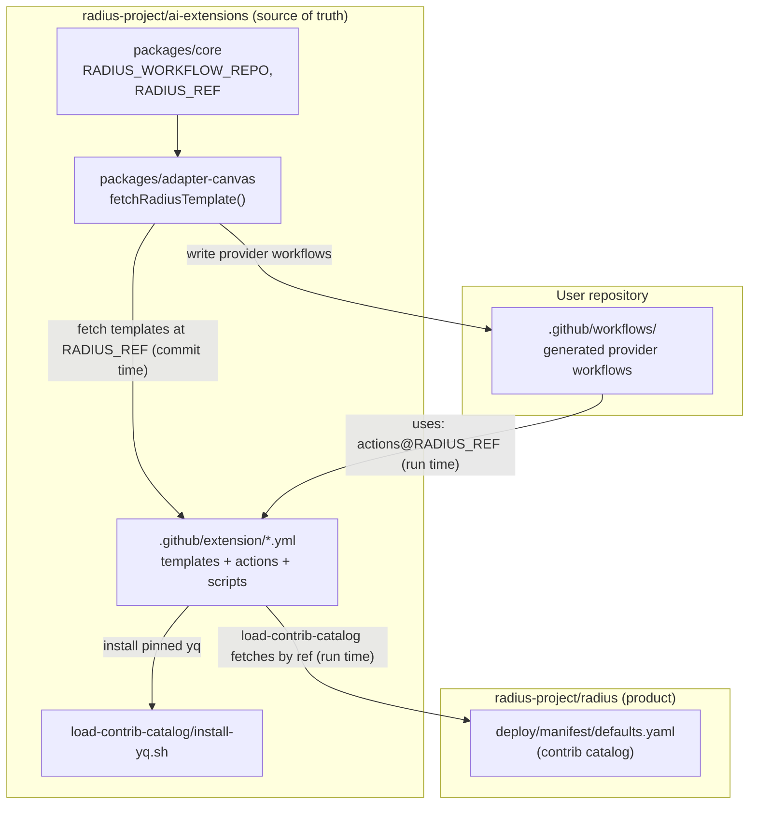

# Port Repo Radius extension workflows to ai-extensions

- **Author**: Shruthi Kumar (@sk593)
- **Date**: 2026-08
- **Status**: In review

## Overview

The Radius Copilot extension deploys, verifies, and deletes applications by generating GitHub Actions workflows into a user's repository. Those generated workflows are assembled from a set of **workflow templates**, **composite actions**, and **shell scripts** that, until now, lived in `radius-project/radius` under `.github/extension/`. `packages/core` fetched them at commit time from that repo, and the committed provider workflows referenced the composite actions in place from `radius-project/radius` by ref.

Hosting this workflow contract in `radius-project/radius` split ownership: the extension product (this repository, `radius-project/ai-extensions`) owns the code that generates and consumes the workflows, but the workflows themselves lived in the core Radius repo. This design moves the workflow assets to `radius-project/ai-extensions` so this repository is the single source of truth for the workflow contract, and rewires the extension to fetch and reference them from here.

A complication surfaced during the port: the composite actions are **not self-contained**. The `load-contrib-catalog` action read a Radius-owned catalog file (`deploy/manifest/defaults.yaml`) and ran a `make install-yq` target by walking up from its own checkout to the repository root. That only works while the action is co-located in `radius-project/radius`. This design also covers how the action is made self-contained in `ai-extensions` without vendoring the catalog, by fetching the single catalog file from `radius-project/radius` by ref at runtime.

## Terms and definitions

- **Workflow template** — a `.yml` file under `.github/extension/` (for example `run-rad-commands-azure.yml`, `verify-azure.yml`, `delete-azure.yml`) that the extension fetches and writes into a user repository's `.github/workflows/`.
- **Composite action** — a reusable GitHub Actions action under `.github/extension/actions/<name>/action.yml` that the provider workflows reference via `uses:` and that holds the provider-agnostic deploy phases.
- **Contrib catalog** — `deploy/manifest/defaults.yaml`: a Radius-owned file that pins the `resource-types-contrib` commits and recipe-pack refs Radius ships as defaults. Kept in sync and validated by Radius CI.
- **`{{RADIUS_REF}}`** — a template placeholder the generator fills with the ref the provider workflows pin their composite-action `uses:` clauses to. Defaults to `RADIUS_REF` (`"main"`), see `packages/core/src/workflows/deploy.ts`.
- **`GITHUB_ACTION_PATH`** — the runner-provided path to a running composite action's directory inside the checkout GitHub makes for a remote action.

## Objectives

> **Issue Reference:** [radius-project/ai-extensions#420](https://github.com/radius-project/ai-extensions/issues/420)

### Goals

- Make `radius-project/ai-extensions` the single source of truth for the verify/deploy/delete workflow templates, composite actions, and scripts.
- Rewire the extension (`packages/core`, `packages/adapter-canvas`) so templates are fetched from `radius-project/ai-extensions` and the committed provider workflows reference the composite actions from `radius-project/ai-extensions`.
- Keep generated user-repo deploys working end to end, including the `load-contrib-catalog` step, without depending on files that exist only in `radius-project/radius`.
- Leave the Radius product's own concerns (the catalog data, the `rad` CLI release binary, `install.sh`) owned by `radius-project/radius`.

### Non-goals

- **Migrating the resource-type contrib catalog subsystem** (`defaults.yaml`, `built-in-providers/` manifests, `sync-resource-types.sh`, the `verify-contrib-consumers` tooling) into `ai-extensions`. The catalog remains a Radius product artifact; only the single `defaults.yaml` file is *read* by ref at runtime. Migrating catalog ownership is a much larger, separate change.
- **Relocating the `rad` CLI download or `install.sh`.** Those still point at `radius-project/radius` (see `packages/adapter-shared/src/rad.ts` and the `setup-control-plane` action), which remains the home of the Radius product.
- **Removing the duplicated `.github/extension/` folder from `radius-project/radius`.** That is tracked separately and is blocked on the catalog-ownership discussion; this doc records the coupling but does not action the removal.

### User scenarios (optional)

#### User story 1

As a Radius maintainer, when I change how a deploy workflow behaves, I edit the templates and actions in `radius-project/ai-extensions` — the same repo that owns the code generating them — and reviewers see the whole contract in one PR.

#### User story 2

As an extension user, I click **Deploy** in the canvas. The extension writes provider workflows that reference `radius-project/ai-extensions` composite actions, and the deploy runs successfully — including the catalog step — with no awareness that the catalog data itself is sourced from `radius-project/radius`.

## User experience (if applicable)

N/A — no user-facing surface changes. The canvas Deploy/Verify/Delete flows are unchanged; only the origin of the fetched templates and the referenced composite actions moves. Generated provider workflows differ only in the `uses:` owner (`radius-project/ai-extensions` instead of `radius-project/radius`).

## Design

### High-level design

The extension keeps its existing runtime shape: at commit time, `packages/adapter-canvas/src/infra.ts` calls `fetchRadiusTemplate` to download each template from `RADIUS_WORKFLOW_REPO/RADIUS_WORKFLOW_DIR/<file>` at `RADIUS_REF`, fills the `{{RADIUS_REF}}` placeholder, and writes the provider workflows into the user's repo. The only change to that path is the value of the constants: `RADIUS_WORKFLOW_REPO` becomes `radius-project/ai-extensions`.

The provider workflows reference composite actions with `uses: radius-project/ai-extensions/.github/extension/actions/<name>@{{RADIUS_REF}}`. When such a workflow runs in a user's repo, GitHub checks out the **entire** `ai-extensions` repo at that ref into its actions cache, so an action's `GITHUB_ACTION_PATH` points inside that checkout.

That checkout is where the coupling bites. The old `load-contrib-catalog` action computed `RADIUS_REPO_ROOT="$(cd "${GITHUB_ACTION_PATH}/../../../.." && pwd)"` and read `${RADIUS_REPO_ROOT}/deploy/manifest/defaults.yaml` plus ran `make -C "$RADIUS_REPO_ROOT" install-yq`. In `radius`, that root has both files. In `ai-extensions`, it has neither — so a real deploy would fail at that step.

This design makes `load-contrib-catalog` self-contained: it fetches `defaults.yaml` from `radius-project/radius` by ref over HTTPS (one ~4.5 KB file, no clone) and installs the pinned `yq` from a generic script co-located with the action. Everything the action needs now lives beside it in `ai-extensions` or is fetched by ref; nothing is read from the repository root.

### Architecture diagram

### Detailed design

The change is where the composite action obtains its two runtime dependencies — the catalog file and `yq`.

#### Option 1: Copy `defaults.yaml` (and install tooling) into ai-extensions

Vendor `deploy/manifest/defaults.yaml` plus a root `Makefile` with `install-yq`/`install-jq` targets and the install scripts into `ai-extensions`, and keep the action's repo-root walk-up (now resolving to the `ai-extensions` checkout).

##### Advantages

- The action is fully self-contained with no runtime network dependency on `radius-project/radius`.
- Minimal change to the action body — only the artifacts move.

##### Disadvantages

- `ai-extensions` becomes the owner of the pinned catalog. `defaults.yaml` is kept correct by Radius CI (`sync-resource-types.sh`, `verify-contrib-consumers.sh`) against radius's `built-in-providers/` manifests; a copy here would drift or force migrating that verification too.
- Introduces a root `Makefile` and a `deploy/` tree into a TypeScript monorepo that has neither, for one file's sake.
- Duplicates a Radius product concern, increasing — not reducing — coupling.

#### Option 2: Fetch `defaults.yaml` from radius by ref at runtime

Change `load-contrib-catalog` to `curl` the single catalog file from `radius-project/radius` at a ref, and install `yq` from a generic script co-located with the action. No repo-root walk-up, no `deploy/` tree, no `Makefile` in `ai-extensions`.

##### Advantages

- The catalog stays a Radius-owned artifact, validated by Radius CI; there is no copy to keep in sync.
- The action is self-contained in `ai-extensions` — `install-yq.sh` sits beside `action.yml` and the catalog helper resolves relative to `GITHUB_ACTION_PATH`.
- Mirrors the existing pattern: templates are already fetched by ref at commit time; the catalog is fetched by ref at run time.
- Confirmed feasible: at runtime, `contrib-catalog.sh` reads only `$RADIUS_DEFAULTS_YAML`, and `defaults.yaml` is a static list of pins — the recipe packs and resource types it names are fetched from `resource-types-contrib`, never from radius.

##### Disadvantages

- Adds a runtime network dependency on `raw.githubusercontent.com/radius-project/radius`. Mitigated by `curl --retry` and a pinnable `catalog-ref`.
- The catalog ref and the action ref are conceptually distinct (radius ref vs. `ai-extensions` ref); defaulting `catalog-ref` to `main` preserves prior behavior but is a floating ref unless pinned.

#### Proposed option

**Option 2.** It delivers the goal — self-contained actions in `ai-extensions` — while keeping catalog ownership and validation in `radius-project/radius`, which is where the `resource-types-contrib` release process already maintains it. Option 1 would drag a Radius product subsystem into this repo for a single file and create a drift/maintenance liability. Option 2 also matches the repository's existing "fetch the contract by ref" pattern and was validated end to end (the raw fetch returns the identical 4486-byte file).

### API design (if applicable)

The `load-contrib-catalog` composite action gains three optional inputs (`.github/extension/actions/load-contrib-catalog/action.yml`):

- `catalog-repo` — default `radius-project/radius`. Repository hosting `deploy/manifest/defaults.yaml`.
- `catalog-ref` — default `main`. Git ref of `catalog-repo` to fetch the catalog from.
- `yq-version` — default `v4.53.3`. Pinned `yq` installed to read the catalog (matches the version pinned in radius's `build/tools.yaml`).

The action's exported environment contract is unchanged: it still writes `RADIUS_DEFAULTS_YAML` and `RADIUS_CONTRIB_CATALOG_HELPER` to `GITHUB_ENV` for later steps and `scripts/contrib-catalog.sh` to consume.

### Implementation details

#### Core package — packages/core (if applicable)

`packages/core/src/workflows/deploy.ts` — `RADIUS_WORKFLOW_REPO` is `radius-project/ai-extensions`; `RADIUS_WORKFLOW_DIR` (`.github/extension`) and `RADIUS_REF` (`main`) are unchanged. `delete.ts` and `verify.ts` error strings and comments reference `radius-project/ai-extensions`.

#### Canvas adapter — packages/adapter-canvas (if applicable)

`packages/adapter-canvas/src/infra.ts` — `fetchRadiusTemplate`, `generateDeployWorkflow`, and `generateDeleteWorkflow` are unchanged in shape; they now resolve `RADIUS_WORKFLOW_REPO` to `radius-project/ai-extensions`. Comment references updated. `server.ts` and the `fixtures/README.md` producer-contract note updated to reflect the same-repo producer.

#### Shared adapter — packages/adapter-shared (if applicable)

N/A for the workflow move. `packages/adapter-shared/src/rad.ts` deliberately still downloads the `rad` CLI release from `radius-project/radius`.

#### Plugin — plugins/radius (if applicable)

Skill docs (`radius-deploy`, `radius-environment`, `radius-delete` `SKILL.md`) updated to reference `radius-project/ai-extensions`, preserving historical Radius PR notes.

#### Build & packaging (if applicable)

- `.github/extension/` — the full 25-file tree ported from radius, with `uses:` refs rewritten to `radius-project/ai-extensions` and executable bits preserved on the shell scripts.
- New `.github/extension/actions/load-contrib-catalog/install-yq.sh` — byte-for-byte the generic installer from radius `build/scripts/install-yq.sh` (verified by SHA-256).
- `load-contrib-catalog/action.yml` — rewritten to fetch the catalog by ref and install `yq` from the co-located script (no repo-root walk-up).
- A Changeset (`.changeset/port-extension-workflows-to-ai-extensions.md`, `"radius": patch`) records the move; `core`/`adapter` packages are ignored by the changeset config.

### Error handling

- **Catalog fetch fails** — `curl --proto '=https' --tlsv1.2 -fsSL --retry 5 --retry-connrefused` rides out transient failures and fails the step on a hard error (for example a bad `catalog-ref`); `test -s "$DEFAULTS_YAML"` guards against an empty download. The deploy stops before any `rad` command runs.
- **`yq` install fails** — `install-yq.sh` verifies the download's SHA-256 (supplied or read from the release's published checksums) and fails closed.
- **Catalog helper missing** — `test -f "$CATALOG_HELPER"` fails the step with a clear signal if the co-located `scripts/contrib-catalog.sh` is absent.

## Test plan

- **Unit (Vitest)** — `packages/core` and `packages/adapter-canvas` tests assert the constants and generated `uses:`/error strings now reference `radius-project/ai-extensions`: `deploy.test.ts`, `verify.test.ts`, `infra.test.ts`, `server.test.ts`, `deploy-artifacts.test.ts`, `oidc-environment-contract.live.test.ts`.
- **Action shell tests** — the ported `*_test.sh` files (`compute-build-platforms_test.sh`, `deploy-parameters_test.sh`, `publish-deploy-status_test.sh`) continue to exercise the action scripts; `load-contrib-catalog` has no dedicated test file and its script is validated by `shellcheck` and YAML parse.
- **Manual / functional** — a real Azure and AWS deploy from a user repo, confirming the `load-contrib-catalog` step fetches the catalog and later steps resolve recipe sources. The runtime fetch of `defaults.yaml` was validated out-of-band (identical 4486-byte response from `raw.githubusercontent.com`).
- **Testing challenge** — build/test could not run in the authoring environment (npm registry unreachable; corepack cache owned by root). Validation relied on static checks (YAML parse, `shellcheck`, byte-identical file comparison, path resolution). CI on the PR is the authoritative gate.

## Security

- **Supply chain** — the catalog is fetched over `https` with TLS 1.2 enforced from a Radius-owned repository; `install-yq.sh` verifies `yq`'s SHA-256 before use. `curl` drops the `Authorization` header on cross-host redirects, so no token leaks to a download CDN.
- **Ref pinning** — `catalog-ref` and the composite-action ref default to `main` (floating). Pinning both to immutable commits is available via the action input and the `{{RADIUS_REF}}` mechanism and is recommended for reproducible, tamper-resistant deploys (see Open questions).
- No new secrets are introduced; the catalog file is public data.

## Compatibility (optional)

- Generated provider workflows change only the composite-action `uses:` owner. Existing user repos regenerate on the next commit-time fetch; already-committed workflows referencing `radius-project/radius` continue to work as long as that repo retains `.github/extension/` (it does, pending the separate removal).
- No breaking change to the action's exported `GITHUB_ENV` contract.

## Monitoring and logging

The `load-contrib-catalog` step logs the catalog URL fetch and `install-yq` progress in the GitHub Actions run log. Failures surface as a failed step with the `curl`/checksum error. No new metrics or traces are added; troubleshooting is via the Actions run log for the deploy workflow.

## Development plan

1. Port `.github/extension/` from radius and rewrite `uses:` refs — checked in.
1. Rewire `packages/core` and `packages/adapter-canvas` constants/comments and update tests — checked in.
1. Make `load-contrib-catalog` self-contained (co-locate `install-yq.sh`, fetch catalog by ref), update README/Changeset — checked in (commit `2b538a2a`, PR [#424](https://github.com/radius-project/ai-extensions/pull/424)).
1. Validate on CI (build, Vitest, lint) once the PR runs in the hosted environment.
1. Separately: decide catalog ownership and, if agreed, remove the duplicated `.github/extension/` from `radius-project/radius`.

## Open questions

1. **Should `catalog-ref` be pinned rather than `main`?** Floating `main` preserves prior behavior but is not reproducible. Pinning to the commit the `ai-extensions` templates were validated against is safer — do we thread a pinned radius catalog ref through the generator alongside `{{RADIUS_REF}}`?
1. **Long-term catalog ownership.** Is fetching `defaults.yaml` from radius the permanent boundary, or should the catalog (and its verification) eventually move to `ai-extensions` or a dedicated repo?
1. **Radius duplicate removal.** Removing `.github/extension/` from radius requires reworking radius's `verify-resource-types-manifest` CI, which `find`s that folder and runs `verify-contrib-consumers.sh`. What is the agreed scope and timing?

## Alternatives considered

- **Keep the composite actions in `radius-project/radius`** and host only the top-level workflow templates in `ai-extensions` (revert the `uses:` rewrite). Rejected: it contradicts the goal that the workflow contract live in `ai-extensions` only, and splits the actions from the templates that reference them.
- **Bundle the catalog into the generated user-repo workflow** at commit time (write `defaults.yaml` next to the workflows). Rejected: it would duplicate the catalog into every user repo and pin it at generation time with no easy update path, and the action already has a clean per-run fetch point.

## Design review notes

<!-- To be completed during design review. -->
