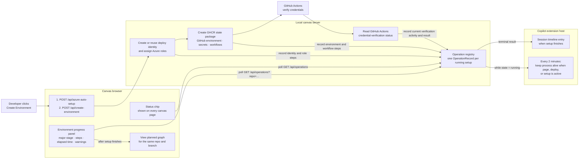
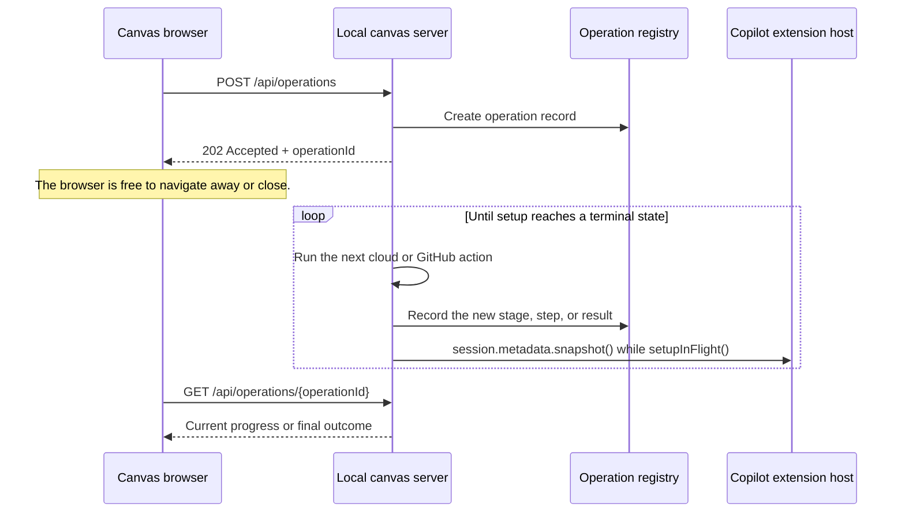
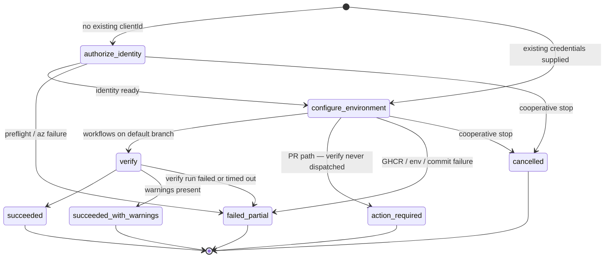

# Progress UX for credential and environment creation

- **Author**: Ryan Waite (@ryanwaite)
- **Date**: 2026-08
- **Status**: Implemented in phases. The operation record, persistence and restart reconciliation, inline panel, ambient chip, timeline announcement, PR-path terminal state, and server-owned `POST /api/operations` start contract are implemented. Cooperative stop remains modeled but unwired.

## Overview

Creating a Radius environment takes roughly one to eight minutes. During that time Radius may create or reuse an Entra App Registration, verify its owner, apply Radius provenance tags, assign Azure roles, publish a GHCR state package, create a GitHub environment and its settings, commit GitHub Actions workflows, and verify the new credentials.

Today, the canvas covers the page with a modal for the whole operation. The modal shows a spinner and one line of text that changes only three times. A user cannot see which identity Radius created, which role it is assigning, whether GitHub workflows were committed, or where a failure occurred. Demo feedback captured the problem: **the wait cursor should do more than spin.**

The server already produces useful messages such as **Creating App Registration**, **Assigning Contributor**, and **Federated credential created**. Today, the page receives those messages only after each request finishes and uses them mainly to show warnings. The information exists, but the user cannot see it while the work is running.

The design replaces the modal with an inline progress panel and records setup in an `OperationRecord`. The panel shows major stages, elapsed time, completed steps, warnings, and final outcomes. A small chip shows the same operation from every canvas page, and a best-effort session timeline entry announces completion.

Environment creation is usually one step in a larger task: _plan the app → create an environment → deploy_. Once the page stops blocking navigation, the user can leave while setup runs and forget to return. The operation record therefore includes the repository, branch, and next page needed to continue the task.

Today, environment creation is tied to the page that started it. The page sends `/api/azure-auto-setup`, waits for that request to finish, then sends `/api/create-environment` and waits again. A full-screen modal prevents the user from navigating elsewhere during those requests. Separately, every canvas page calls the local `/api/ping` endpoint every five seconds. Each request updates `lastWebviewActivityAt`; every two minutes, the extension checks that timestamp and calls `session.metadata.snapshot()` when the page was recently active. That host RPC call resets the host's idle timer and keeps the extension process alive.

The design changes two parts of that arrangement, and draft PR #244 prototypes both. It replaces the blocking modal with an inline panel and records setup as an `OperationRecord` that the page polls through `/api/operations`. It also changes the host keepalive condition from “the canvas was recently active or a deploy is running” to “the canvas was recently active, a deploy is running, or `setupInFlight()` reports a live setup operation.” Setup itself still runs inside the same two browser requests. The prototype therefore makes the process lifetime aware of setup and lets another page rediscover its progress, but it does not yet detach the cloud work from the browser request that started it.

The background-start API makes the final ownership change. The server accepts one request, registers and persists the operation, returns `202 Accepted` with an operation ID and status URL, and schedules setup after the response has ended. The user can close the canvas entirely, which stops `/api/ping` and removes recent page activity from the keepalive decision. While the server task is executing, `setupInFlight()` keeps the host channel active. An operation paused in `input_required` retains the repository lock and persisted prompt but does not hold the extension process alive indefinitely.

Prototype status in draft PR #244: the operation record, inline panel, status chip, completion entry, and pull-request outcome are working there. Detached background execution, cooperative stop, live updates for every individual cloud action, and Copilot diagnosis are still future work. [Findings from draft PR #244](#findings-from-draft-pr-244) records what building and testing the prototype changed.

## Terms and definitions

| Term                     | Definition                                                                                                                                                                                                       |
|--------------------------|------------------------------------------------------------------------------------------------------------------------------------------------------------------------------------------------------------------|
| **Auto-setup**           | The `/api/azure-auto-setup` request. It creates or reuses the Azure deploy identity and assigns the Azure roles needed by GitHub Actions.                                                                        |
| **Environment creation** | The `/api/create-environment` request. It creates the GHCR state package, GitHub environment, secrets, variables, and workflow files.                                                                            |
| **Verify run**           | The `radius-verify-credentials.yml` GitHub Actions run that signs in with the new federated credentials and confirms they work.                                                                                  |
| **Operation**            | One attempt to prepare credentials and create an environment. In the current prototype, auto-setup and environment creation share one operation ID.                                                              |
| **Operation record**     | The in-memory record for one operation: target repo and environment, stages, steps, safe cloud identifiers, warnings, final outcome, and any next action. Raw command output is kept separate from display text. |
| **Stage**                | One major phase: `authorize_identity`, `configure_environment`, or `verify`. A stage may be omitted when it does not apply.                                                                                      |
| **Step**                 | One named action within a stage, such as creating an App Registration or committing a workflow.                                                                                                                  |
| **Final outcome**        | One of `succeeded`, `succeeded_with_warnings`, `action_required`, `failed`, `failed_partial`, or `cancelled`. `action_required` means Radius finished its work and a person must complete the next step.         |
| **Propose-only**         | Copilot may explain a failure and suggest a command or form change, but it does not execute the proposed repair.                                                                                                 |
| **Next-page target**     | The page, repository, and branch the panel offers after setup, such as **View planned graph** for `contoso/store` on `feature/cart`.                                                                             |
| **Status chip**          | A small indicator in the shared canvas navigation. It shows the latest setup state and links back to the environments page.                                                                                      |
| **Timeline entry**       | A user-visible `session.log` event written when setup finishes. It does not submit a prompt for Copilot to answer.                                                                                               |

## Objectives

> **Issue Reference:** [#274](https://github.com/radius-project/ai-extensions/issues/274) tracks the owner/provenance and commit-point behavior described here. The broader progress UX started from demo feedback and is tracked by this draft PR.

### Goals

1. **Show real progress.** Display the current stage, the latest known step, elapsed time, completed steps, and warnings while setup runs.
2. **Let the user keep working.** Replace the multi-minute modal with an inline panel and a cross-page status chip.
3. **Preserve failure context.** Keep completed work visible, mark the failed stage or step, show the safe error details, and place the next action beside the failure.
4. **Show security-relevant changes.** Name the deploy identity, Entra owner, Azure roles, scopes, repository, environment, acting GitHub account, and provenance decisions when those values are available.
5. **Use one source of truth.** Let the panel, chip, timeline entry, and future Copilot diagnosis read the same operation record.
6. **Help the user continue the deployment task.** Record the repository and branch, then offer the planned graph after setup finishes.
7. **Protect concurrent and long-running setup.** Give each setup an ID, reject unrelated continuation attempts, capture context before permission checks, and keep the extension process alive while an operation is running.

The design succeeds when:

1. A user watching setup can name the current major stage and see the latest known action.
2. A failed setup identifies what failed, what already succeeded, and what the user should do next without requiring browser developer tools.
3. Navigating to another canvas page does not hide or duplicate the running operation.
4. A user can find the final outcome from the status chip or timeline and open the planned graph for the same repository and branch.

### Non-goals

- **Percentage complete or ETA.** The number of steps varies by provider, existing resources, warnings, retries, and pull-request fallback. The UI shows observed state rather than estimating a percentage.
- **Automatic repair or deployment from chat.** Copilot may propose a remedy, but this design does not let it run a mutating repair or deployment command.
- **Chat-driven setup control in this release.** The proposed release does not let a chat answer resume a waiting environment operation, satisfy a blocked form question, retry verification, or start deployment.
- **Per-step chat narration.** The panel carries live state. Chat may add only sparse phase-boundary notes in a later release.
- **Stopping a command midway.** A future cooperative stop may halt before the next command. This design never kills an active cloud command. Automatic rollback applies only to artifacts that the current setup ledger proves this operation created before the commit point.
- **AWS environment creation.** The record and UI should not prevent a future AWS implementation, but this work does not add one.
- **Automatic navigation on completion.** The product offers a link and never moves focus unless the user chooses it.
- **Operating-system notifications.** The host exposes a session timeline event, not a system notification API.
- **Replacing the short credential-verification modal.** The manual **Verify Credentials** action remains a modal because it is a separate, shorter operation.

### Issue #274 behavior

Issue #274 tightens the environment-creation path so the server makes ownership and provenance decisions before it mutates Azure: it explicitly assigns and verifies the Entra owner on a new app, reuses any app already owned by the user, applies Radius provenance tags to new apps, and never reclaims an unowned tagged app. Before any Azure mutation, it performs an authoritative GHCR preflight so a package-write failure stops the current operation early.

The commit point is either a successful verify dispatch or the PR-path `action_required` outcome. Before that point, cleanup is limited to the current operation only: Azure artifacts created by the current attempt are rolled back, committed workflow files are reported as retained reusable artifacts, and a GitHub Environment discovered only by a pre-PUT 404 is treated as a created candidate that must be reviewed and cleaned up manually because GitHub's idempotent PUT cannot prove this request created it. Later verification failures keep those retained artifacts and report the failed Actions run instead of rewinding the setup.

### User scenarios

#### User story 1 — Create an environment with automatic credential setup

A developer selects an Azure profile, environment name, resource group, and AKS cluster, then clicks **Create Environment**. Setup takes several minutes. The panel should show the current stage, elapsed time, identity name, owner verification, and each role and scope Radius changes.

#### User story 2 — Create an environment with existing credentials

The repository already has a deploy identity, so the developer supplies its client ID. Radius skips `authorize_identity` and starts with `configure_environment`. The panel must omit the unused identity stage.

#### User story 3 — A failure partway through setup

The developer lacks permission to grant AKS RBAC Cluster Admin. Today, Radius places a warning in the final response and shows it after setup, separate from the role-assignment step. The design keeps that warning with the role-assignment step, explains that deployment may fail at **Verify AKS Access**, preserves the exact remediation command, and keeps any later verification failure from undoing the committed workflows or GHCR package.

#### User story 4 — The workflows land on a pull request

The developer lacks push access to the repository's `main` branch, so Radius commits the workflows to a setup branch and tries to open a pull request. Today, this path contains a live bug. The design treats the pull-request branch handoff as the commit point, stops before starting the verification poll, preserves the completed setup steps, and shows the pull request as the next action. Prototype status in draft PR #244: the server returns `pullRequestUrl`, deliberately skips credential verification because the new workflow is not yet available from the default branch, and no longer lets the presence or absence of a PR URL determine the final state. If Radius committed the setup branch but could not open the pull request automatically, the operation still reaches `action_required` and the panel tells the developer which branch to merge into the default branch. Merging installs the workflows; it does not automatically start credential verification or deployment. The developer returns to Radius to retry verification, then starts deployment after verification succeeds. Later verification failures keep the committed workflows and GHCR package instead of rewinding the setup.

#### User story 5 — The user leaves the environment page

The developer opened the canvas to plan an application, discovered they needed an environment, and started setup. They then open another canvas page. The status chip must continue showing that setup is active and link back to the environment panel. When setup finishes, the terminal panel must offer **View planned graph** for the same repository and branch.

If the user closes the canvas but keeps the Copilot session open, the prototype in draft PR #244 also attempts to write a completion entry to the session timeline. Detached setup that continues after the browser request ends remains future work; the prototype does not yet support closing the page during an interactive setup prompt.

## User experience

The panel keeps the existing form and changes what appears after the user clicks **Create Environment**.

The design replaces `env-creating-modal` with an inline panel on the environments page. Prototype status in draft PR #244: the panel already shows a named stage, elapsed time, a collapsible step list, and distinct glyphs for pending, running, successful, warning, skipped, and failed work.

**Sample input:** the user completes the existing Create Environment form on the environment page and clicks **Create Environment**. The form fields are unchanged by this design — profile, environment name, target repository, branch, resource group, AKS cluster, and namespace (the environment page renderer under `packages/adapter-canvas/src/pages/`). The only interaction change is what happens next.

**Sample output — mid-operation, `authorize_identity` running:**

```text
Creating environment "dev"                                    2m 14s   [ Stop after current step ]

  ✓  Authorize deploy identity
       ✓ Acting on GitHub as @octocat.
       ✓ Created App Registration: radius-contoso-store (client 8f21…)
       ⚠ Could not assign the AKS RBAC Cluster Admin role automatically.
       ✓ Assigned Contributor on rg-prod
  ●  Configure environment
       ✓ Published state package ghcr.io/contoso/store/radius-state
       ● Committing verify-credentials workflow…
  ○  Verify credentials

  ▸ Show details
```

**Sample output — terminal state `action_required` (User story 4):**

```text
Environment "dev" — action required                                   1m 52s

  ✓  Authorize deploy identity
  ✓  Configure environment
       ✓ Opened pull request #142
       👉 Merge the pull request to install the Radius workflows.
  ⊘  Verify credentials — not started

  After PR #142 lands on "main", return to Radius and retry credential
  verification. Deploy when verification succeeds.

  [ View pull request ]
```

**Sample output — the user left mid-operation (User story 5).** Three surfaces cooperate. While it runs, a chip persists in the canvas top nav on every page:

```text
⟳ Creating environment "dev" — 2m 14s        ▸
```

When it reaches a final outcome, the extension writes one entry to the Copilot session timeline without asking the agent to respond or moving focus:

```text
Environment "dev" is ready for contoso/store.

Credentials were created and verified, with 1 warning about the AKS RBAC
Cluster Admin role. You were planning contoso/store when you started this —
say "show me the planned graph" and I'll take you back, or open the Radius
panel to review the setup log.
```

And returning to the panel shows the completed operation with an explicit route back to where the journey was interrupted:

```text
Environment "dev" — ready                                             4m 06s

  ✓  Authorize deploy identity  (1 warning)
  ✓  Configure environment
  ✓  Verify credentials

  [ Return to the planned graph ]   [ Review setup log ]   [ Deploy ]
```

Five behaviors define the experience:

1. **The panel does not block the canvas.** The user can navigate away, and the operation continues. This is what makes the keepalive fix a hard prerequisite rather than a follow-up.
2. **Failure renders in place.** The failing step is marked, everything above it stays on screen, and the next action sits next to it. The current `failEnv` handler in the environment page renderer does the opposite: it hides the modal and writes one string into a status bar.
3. **Warnings pin to their step.** `showEnvSetupWarnings` in the environment page renderer currently rakes the whole `steps[]` for `⚠️` lines after the fact. Those lines belong on the step that produced them.
4. **Another canvas page still shows setup status.** The chip is visible from every page, and the final outcome produces one best-effort timeline entry.
5. **Nothing ever seizes the user's attention.** The return route is offered, never taken on the user's behalf. See [Journey continuity](#journey-continuity).

## Design

### The precedent we should partly not copy

The graph page already implements the visual pattern this feature needs, and it is tempting to extract it wholesale. Its _progress model_, however, is exactly what we must not reuse.

`updateWaitingProgress` in the environment page renderer fabricates its percentage from wall-clock elapsed time — `18 + ((elapsed / EXPECTED_GRAPH_DURATION_MS) * 50)`, clamped at 72 — and selects the active stage from hard-coded elapsed thresholds (`elapsed < 45000 ? 0 : elapsed < 150000 ? 1 : …`). `syncProgressMessages` then infers real state by **string-prefix matching on prose**: `latest.indexOf('Checking ') === 0`, `'Found existing app.bicep'`, `'Mapped '`.

That is a progress bar that is mostly guessing, driven by parsing display copy. **Take the visual vocabulary; leave the elapsed-time percentage and the string parsing behind.** The events this design emits are structured and typed, which is the entire point of defining a record contract.

### Prior art: documented patterns for long-running work

The products below publish enough detail to ground a few specific Radius decisions. This section stays close to what their docs actually say.

#### Cursor keeps work moving

[Cursor Agent overview](https://cursor.com/docs/agent/overview) and [Agent mode](https://cursor.com/help/ai-features/agent) document queued follow-up messages, immediate send with Cmd+Enter, drag reordering, the Stop button, diff-view updates, checkpoints, and the fact that the agent keeps reading files, making edits, or running commands while it waits for the user's answer. [Auto-review](https://cursor.com/blog/agent-autonomy-auto-review) says about 7% of chats in that mode lead to at least one user interruption. [Cloud Agent capabilities](https://cursor.com/docs/cloud-agent/capabilities) caps CI auto-fix at 10 follow-ups. [Cloud-agent lessons](https://cursor.com/blog/cloud-agent-lessons) describes unattended cloud agents that can sit for hours before a person checks back.

#### Devin Desktop's Cascade uses a live checklist

[Devin Desktop's Cascade overview](https://docs.devin.ai/desktop/cascade) says Cascade creates a Todo list inside the conversation for complex tasks, lets the user ask for changes to that list, runs a specialized planning agent in the background, queues messages while work is in progress, and stops after 20 tool calls per prompt unless the user presses Continue.

#### Claude Code groups activity by state

[Claude Code's Agent View](https://code.claude.com/docs/en/agent-view) shows Ready for review, Needs input, Working, and Completed groups. The same page says each row carries a generated one-line summary, working-row text refreshes from session output at most every 15 seconds, each row shows session age, the footer count refreshes about every 10 seconds, and notifications fire when a background session needs input, finishes, or fails. The grouped view uses one Completed bucket, while the state table on the page distinguishes completed, failed, and stopped terminal states.

#### The infrastructure-console tier

Our operation is also a cloud provisioning job, so the consoles that handle those jobs are useful precedents.

| Product                                                                                                                                                                                                                                                                                                                                                 | Documented pattern                                                                                                               | Radius takeaway                                                                                                                             |
|---------------------------------------------------------------------------------------------------------------------------------------------------------------------------------------------------------------------------------------------------------------------------------------------------------------------------------------------------------|----------------------------------------------------------------------------------------------------------------------------------|---------------------------------------------------------------------------------------------------------------------------------------------|
| [GitHub Actions visualization graph](https://docs.github.com/en/actions/how-tos/monitor-workflows/use-the-visualization-graph), [workflow run logs](https://docs.github.com/en/actions/how-tos/monitor-workflows/use-workflow-run-logs), and [job execution time](https://docs.github.com/en/actions/how-tos/monitor-workflows/view-job-execution-time) | Workflow runs show job status in the graph; job pages expose step logs and step duration; job summaries show job execution time. | Credential verification already lives in Actions, so the panel should reuse that mental model and deep-link to the run when detail matters. |
| [Vercel deployment troubleshooting](https://vercel.com/docs/deployments/troubleshoot-a-build), [Vercel build logs](https://vercel.com/docs/deployments/logs), and [Netlify troubleshooting tips](https://docs.netlify.com/build/configure-builds/troubleshooting-tips/)                                                                                 | Vercel documents deployment summary state plus build logs. Netlify's build troubleshooting starts from the deploy log.           | Radius should keep a short stage summary in the panel and leave deeper logs to an explicit detail view or external link.                    |
| [Azure Resource Manager deployment history](https://learn.microsoft.com/en-us/azure/azure-resource-manager/templates/deployment-history)                                                                                                                                                                                                                | Azure documents deployment history, specific deployment details, deployed resources, errors, and correlation IDs.                | Radius should preserve cloud identifiers and correlation handles so failure details stay tied to the real operation.                        |
| [AWS CloudFormation stack events](https://docs.aws.amazon.com/AWSCloudFormation/latest/UserGuide/view-stack-events.html)                                                                                                                                                                                                                                | CloudFormation events list the resource, status, and status reason, and the console refreshes as new events arrive.              | Radius should attach failure detail to the step or resource that produced it, not bury it in a generic final error.                         |
| [VS Code `window.withProgress`](https://code.visualstudio.com/api/references/vscode-api#window.withProgress) and [OutputChannel](https://code.visualstudio.com/api/references/vscode-api#OutputChannel)                                                                                                                                                 | VS Code gives extensions cancellable progress plus a separate output surface for detailed text.                                  | Radius should separate compact progress from raw evidence and make the detailed channel opt-in.                                             |

#### Radius design conclusions from the prior art

1. Radius should replace the blocking modal with an inline panel and let the user keep moving through the canvas.
2. Radius should keep questions and failures attached to the operation instead of dismissing the UI and forcing the user to reconstruct what happened.
3. Radius should show named stages, named cloud actions, and terminal states. It should not invent a percentage for work that is not truly enumerable.
4. Radius should pair a short status view with drill-down detail and links to the systems that own the underlying logs.

#### How Radius differs

Radius knows its major setup stages in advance because `server.ts` executes them directly. It can render those stages immediately without asking an agent to invent a plan.

Code editors can stop between file edits and often restore a checkpoint. Radius may be halfway through creating an identity, role assignment, GHCR package, or workflow commit. It can stop only between those commands and must report the resources that already exist. See [Stop and cancellation](#stop-and-cancellation).

### Radius design conclusions

1. [Carbon's loading guidance](https://carbondesignsystem.com/components/loading/usage/) says to use a loading indicator when the expected wait exceeds three seconds. Radius setup takes minutes, so a spinner can be the opening signal but not the whole experience. The user needs named stages, elapsed time, and the next action.
2. Radius should keep the user in the domain of the job. "Assigning Contributor on `rg-prod`" tells the user what changed. "Working…" does not.
3. Radius should use progressive disclosure. The default view should show the stage, current action, completed history, warnings, and next step. Raw evidence should stay behind an explicit expand or external link.
4. Radius should prefer honest signals over invented ones. Where the work is enumerable, show the completed steps. Where it is not, show the current activity, elapsed time, and the run or resource that owns the detail.
5. Radius should leave failure in place, preserve the work that already completed, and keep accessibility and secret redaction in the contract for every rendered field.

### High-level design

The design starts by recording the operation correctly, then adds the surfaces that show and explain that record.

1. **Operation lifecycle (Phase 0).** Give each setup operation an ID, a record, and a status endpoint. Keep the extension process alive while setup runs. Record the target repository, environment, GitHub identity, and cloud context before the first permission check, then explicitly verify Entra ownership, apply Radius provenance tags, reuse any user-owned app, and preflight GHCR write access before any Azure mutation.
2. **The operation record contract (Phase 0).** Define the fields every progress surface reads: stages and steps, the cloud and GitHub identifiers the setup resolved, warnings, the final outcome, and where the user should go next. Keep command output separate from user-facing fields, remove secrets before storage or display, and mark the commit point so cleanup can stay limited to the current operation while later verification failures retain committed workflows and the GHCR package.
3. **The progress panel (layers 2 and 5).** Show the record in an inline panel that does not block the rest of the canvas. The first version updates when setup moves between major stages. If that leaves long silent periods, layer 5 adds each individual setup step to the same record as it starts and finishes.
4. **Keep the user connected to the task (layers 3 and 4).** Show a small status chip on every canvas page, write a completion entry to the session timeline, and preserve a link to the planned graph for the same repository and branch. These surfaces let the user leave the environment page without losing track of why they started setup.
5. **Explain failures with Copilot (layer 6).** Give Copilot the same redacted operation record when setup fails. Copilot may explain the failure and propose a remedy, but it does not run a repair command in this version.

The panel and Copilot read the same operation record independently. Copilot diagnosis does not depend on live step streaming, and the panel does not depend on Copilot. The cross-page chip is also part of the usable minimum: once the panel stops blocking navigation, the product must show that setup is still running and provide a route back. See [Journey continuity](#journey-continuity).

### Architecture diagram

The first diagram shows the current prototype in draft PR #244. The browser still drives the existing two-request setup sequence. The operation registry records what those requests are doing and gives the panel, status chip, and completion announcement one source of truth.



In the prototype in draft PR #244, the operation registry observes work that still belongs to the browser requests. The proposed background API moves ownership of that work to the server:



### Detailed design

The six layers build on one operation record. Each layer adds a user-visible capability without replacing the layers below it.

| Layer | What it adds                    | What the user can newly do                                                    | Depends on | Prototype status in draft PR #244 |
|-------|---------------------------------|-------------------------------------------------------------------------------|------------|-----------------------------------|
| **1** | The operation record            | Nothing directly — it gives the existing two-request flow one shared identity | —          | **Built**                         |
| **2** | An inline, non-blocking panel   | Read what is happening; leave the page and come back to it                    | 1          | **Built**                         |
| **3** | A status chip in the page shell | See a running operation from any page and return to its environment panel     | 1          | **Built**                         |
| **4** | A session-timeline announcement | Learn it finished after leaving the canvas entirely                           | 1          | **Best-effort built**             |
| **5** | Live per-step narration         | Watch individual steps resolve instead of coarse stages                       | 1, 2       | Designed, not built               |
| **6** | Agent diagnosis of a failure    | Ask why it failed and get a proposed fix                                      | 1          | Designed, not built               |

#### Layer 1: the operation becomes a thing

A setup run gains an ID and a record containing the provider, repository, environment, stages, steps, resolved cloud identifiers, warnings, and final outcome. The record also stores a page, repository, and branch that the UI can offer as the next destination.

The prototype stores records in memory and allows one running setup per repository. `/api/azure-auto-setup` creates the record, and `/api/create-environment` continues it by operation ID. A record becomes stale after fifteen minutes without activity, which prevents an abandoned run from blocking every later attempt.

This layer does not change the page by itself. It gives the panel, chip, completion announcement, and future Copilot diagnosis one source of truth.

The record uses explicit outcomes: `succeeded`, `succeeded_with_warnings`, `action_required`, `failed`, `failed_partial`, and `cancelled`. For example, workflows committed to a pull-request branch produce `action_required`, not success and not a verification timeout.

The server records the target repository, environment, GitHub identity, and cloud context before the first permission check. If that check fails, the record can identify both the target and the account that lacked permission. The setup-aware keepalive also prevents the host from treating an active setup as idle.

#### Layer 2: the operation is visible where it runs

The environments page replaces the blocking overlay with an inline panel. It shows the current stage, elapsed time, completed steps, warnings, and failure details. A failure leaves the completed work on screen.

The user can read the progress, reload the page, or visit another canvas page and then return to the same in-memory record. The browser still owns the two setup requests, and App Registration or Service Management Reference questions still require the original page. The prototype does not yet implement detached background execution.

The panel may show only the stage name during a long command. For example, `authorize_identity` can run for more than a minute before the next step appears. Layer 5 addresses that gap if stage-level progress proves too sparse.

During credential verification, the panel shows the GitHub Actions step whose status is `in_progress`. If the Actions jobs endpoint returns HTTP 503, `getRunDetail` returns no step list but still checks whether the run finished. The activity line may briefly disappear, but the operation continues and completion detection still works.

#### Layer 3: the operation is visible everywhere in the canvas

A small status chip appears in the shared navigation on every canvas page. It polls `/api/operations`, stays hidden while the full panel is visible, and links to the environments page while setup runs. After setup finishes, the panel can offer **View planned graph** for the recorded repository and branch.

The chip lets the user leave the environments page without forgetting that setup is still running. It never takes focus or navigates automatically.

Because the navigation is server-rendered, each page includes the same lightweight operation poller. If polling fails during a server restart, the chip keeps its last known state and tries again.

#### Layer 4: the operation announces itself outside the canvas

When setup reaches a final outcome, the extension writes one entry to the Copilot session timeline. A successful entry says the environment is ready. An `action_required` entry can include the pull-request URL.

This can reach a user who closed the canvas but still has the Copilot session open.

The extension uses `session.log`, which creates a user-visible timeline event without submitting a prompt for the agent to answer. Delivery is best effort and fire-once in the prototype. The chip and panel remain the reliable sources of state because this repository does not control how the host renders timeline entries.

#### Layer 5: the operation narrates itself step by step

Layer 5 would update the record when each cloud or GitHub action starts and finishes. The panel could then show steps such as **Creating App Registration**, **Assigning Contributor**, and **Committing verify workflow** as they happen.

It would also add a visible **Needs input** state for questions such as choosing an App Registration or entering a Service Management Reference, instead of opening a second modal over the progress UI.

The graph page's `state.progressMessages` cannot carry these updates because it belongs to one graph-build generation and `/api/progress` drains that queue. Environment setup needs its own update path that survives a page reload. The implementation must also review every displayed step for clear wording and accidental secrets.

This layer remains unbuilt. The current panel lets us test whether stage-level updates are enough before adding another transport.

#### Layer 6: a failed operation explains itself

When the user chooses **Ask Copilot** after a failure, send Copilot the redacted operation record. Copilot explains the evidence, identifies the likely cause, and proposes a fix. It does not execute the fix.

This helps with failures that have no dedicated explanation. The code recognizes a few known Azure errors, but unfamiliar errors fall back to generic copy. Copilot can relate the failed step, safe identifiers, and fenced command output, then answer follow-up questions such as _Which subscription should I use instead?_

Copilot diagnosis does not replace the panel. Chat is useful after a failure, but it cannot show live progress next to the operation. The diagnosis should therefore be user-initiated from the terminal failure state.

##### Use deterministic guidance when the server already knows the answer

- **The AKS correlation is already solved in code.** The warning in `server.ts` names the exact step the user will later see fail ("Verify AKS Access"), supplies the full remediation command with the real object ID and cluster scope substituted in, and attaches the raw stderr. A panel can pin that warning to its step deterministically. An LLM adds nothing and would more likely **degrade** the output by paraphrasing a command that is currently exact.
- **Application parameters belong to deployment.** Environment creation provisions cloud and GitHub environment state without reading `app.bicep`. Deployment reads the selected branch's model and provisions `RADIUS_DEPLOY_PARAMS` immediately before dispatch.
- **A repository-permission failure needs facts, not inference.** The server now records the acting GitHub identity and target repository before the admin check. The panel can show that account and failure directly.

Copilot should handle unfamiliar failures and follow-up questions. It should not paraphrase an exact command or replace a state the server can determine.

##### Propose-only is a risk reduction, not a risk elimination

The user may run the command Copilot proposes. A wrong subscription, scope, or role in an `az role assignment create` command can create a durable, over-privileged assignment. Requiring user confirmation lowers the risk but does not remove it.

`deploy-diagnostics.mjs:1-5` already records that deploy output is attacker-influenced. The same caution applies to anything derived from it. The prompt constraints this implies are specified in [Security](#security).

##### Classify the failure before proposing a response

`deployRepairHandoffPrompt` in `hooks.ts` is a working template: a fenced diagnostic, an explicit triage rule ("a modeling or schema failure — repair it; an infrastructure or environment failure — report it with the run URL and stop, do not redeploy"), the tools to call, and a hard attempt cap.

Environment setup uses the same classification but stops after proposing a response:

- **User can fix and retry**: wrong or missing subscription, a parameter the form can supply, a transient GitHub API failure, a missing Service Management Reference. The agent names the exact field and points at the retry button.
- **Someone else must act**: no User Access Administrator on the scope, no push access to a protected branch, tenant policy, quota, a cluster that does not exist. The agent produces the command and says who needs to run it.

The classification works across providers, but the explanation must use provider-specific terms. Azure may report a missing User Access Administrator role; AWS may report missing `iam:CreateOpenIDConnectProvider`. The prompt should combine one shared classification rule with provider-specific guidance.

**Layer 6 v1 scope:** one user-initiated **Ask Copilot** action after setup fails on an unfamiliar or under-explained error. It proposes a response and cites the record. It does not send kickoff messages, narrate phase changes in chat, announce success, or answer blocked form questions. A chat reply cannot resume a server operation without new tools and continuation handling.

#### Long-term Canvas and chat interaction

**The panel reports facts; chat handles judgment, explanation, and follow-up.**

##### Near term

The proposed release keeps chat narrow. It offers one user-initiated, failure-only, propose-only **Ask Copilot** handoff for unfamiliar failures. Copilot reads a redacted operation record, explains what likely happened, and proposes the next step. It does not execute the fix, resume the operation, or narrate routine progress. Known deterministic guidance stays in the panel, because the server can already present it exactly.

##### Long term

Later, Radius can add a second surface around the same operation record. Chat can offer an optional kickoff orientation, sparse phase-boundary narration, conversational escalation when the operation needs user input, unfamiliar-failure diagnosis, a pull-request handoff, and an optional success close-out. Chat still does not own the workflow. The panel, chip, and timeline remain authoritative for operation state.

##### Interaction walkthrough

1. **Kickoff.** Copilot may open with a short orientation such as: "I am creating `dev` for `org/repo`. I am setting up the cloud credentials and the GitHub environment. The Radius panel shows the live steps. I will flag anything that needs you." This is optional. The panel still starts immediately and remains the primary live surface.
2. **Phase boundary.** Chat speaks only at major transitions, not for every step. For example: "Identity setup is complete. Next I am configuring the GitHub environment and workflows." The panel continues to show the exact step list and timing.
3. **Mid-flight question.** If Radius needs a Service Management Reference, the panel should enter **Needs input** and preserve the running record. In the long-term model, chat may explain why that value is needed and ask the user for it. That path requires resume and tool plumbing that can bind the chat reply back to the waiting operation safely. It is future work and is not part of the proposed release.
4. **Recoverable failure.** Suppose Azure rejects the AKS RBAC Cluster Admin assignment. The panel keeps the exact deterministic warning, the verified object ID, the verified cluster scope, and the exact remediation command that `server.ts` already knows how to build. Chat explains who must act and answers follow-up questions, but it must quote either that exact command or a trusted template filled from verified record fields. It must not paraphrase the command or invent IDs, scopes, subscriptions, or role names.
5. **Hard failure.** Chat distinguishes bad input from external action. If the user picked the wrong subscription or omitted a required value, chat points to the exact field and tells them to retry from the panel. If the failure comes from missing entitlement, tenant policy, branch protection, quota, or missing infrastructure, chat says who must act, cites the evidence, and stops. It does not blur a user-fixable input problem into an administrator repair, and it does not invent a privileged command when the scope is unverified.
6. **PR handoff.** If Radius commits workflows to a setup branch and opens a pull request, chat says what happened and what comes next. Merging the pull request installs the workflows. The user then returns to Radius and retries credential verification. Deployment remains a separate, user-initiated action after verification succeeds. This corrects the current failure mode without pretending that a merge completes the whole journey.
7. **Optional success close-out.** Chat may eventually send a short completion note that names what Radius provisioned and where the user can go next. That remains a notification-policy decision, because the panel, chip, and timeline entry may already make the outcome clear enough.

##### Safety and UX constraints

- The panel never depends on chat delivery. If a chat turn is delayed, dropped, or never sent, the operation still completes and the panel still shows the truth.
- Chat does not narrate every step. Step-level facts belong in the panel, where they stay ordered, compact, and tied to the record.
- Injected turns can queue or reorder chat traffic. Any narration must therefore stay sparse and be gated by user choice or explicit product policy.
- Chat never executes cloud mutations in this design. It explains, proposes, and points back to the panel.
- Raw logs remain fenced and untrusted. Chat treats them as evidence, not instructions.
- Every diagnosis cites evidence, states uncertainty, uses placeholders for unverified values, and never proposes a destructive or privilege-expanding command without verified scope.
- Proposed commands must cite verified record fields. When the server already knows the exact command, chat reuses that deterministic output instead of regenerating it.
- Canvas and chat input synchronization is future work. The extension needs safe resume plumbing before a chat answer can unblock a waiting operation.
- Draft PR #244 does not implement this long-term flow. It prototypes the panel, chip, timeline entry, and pull-request-path terminal state, but not kickoff narration, chat-based input handling, or success close-out.

#### Release boundaries

- **Layers 1 and 2** answer the demo feedback, fix the false timeout, and show progress without a modal. They do not remind a user who leaves the environments page.
- **Layer 3** adds the cross-page status chip and is the minimum complete release for a non-blocking panel.
- **Layer 4** adds a best-effort completion entry for a user who closes the canvas but keeps the Copilot session open.
- **Layers 5 and 6** add finer progress and failure diagnosis. Either can ship without the other.

The operation must record its next-page target when it starts. Once the user has navigated away, the product cannot reliably reconstruct the repository and branch they were working with.

##### Build the record before adding more readers

Copilot diagnosis needs the operation record, not live streaming. The server can collect steps, safe identifiers, error codes, and fenced evidence during the existing requests and finalize them when a failure occurs. Layer 5 changes when the panel sees each step; it does not change whether layer 6 has enough evidence to explain a failure.

### Journey continuity

Users create an environment so they can deploy an application. Radius must preserve that larger task when setup takes them away from the planned graph.

The operation record stores the originating page, repository, branch, and next-page target. While setup runs, the canvas shows an ambient status chip. When setup finishes, Radius writes one best-effort timeline entry with the outcome and return target. Neither surface changes focus.

The user decides when to return. A click reuses the existing Radius panel and opens the recorded page, repository, and branch. Radius never focuses the panel automatically.

The planned graph link reconstructs context rather than restoring a snapshot. It opens the recorded repository and branch, then loads or recomputes the graph. The copy therefore says **View planned graph**, not **Return to where you left off**.

This design depends on four verified host behaviors:

- `session.log` writes a user-visible timeline entry without submitting a conversation turn.
- Reusing a canvas `instanceId` focuses the existing panel.
- Canvas input can carry page, repository, and branch.
- Host dialogs are optional and require a capability check.

If the repository or branch no longer exists, the target page shows a load error rather than choosing another branch.

### The state model: a branching flow, not a fixed checklist

- **`authorize_identity` is optional.** It is skipped entirely when the user supplies an existing client ID.
- **`verify` is conditional, not merely deferred.** On the PR path, verification is **not dispatched at all** because the workflow file is not on the default branch yet and `workflow run` would 404.
- **The number of steps varies.** Setup may create several federated credentials, retry a role assignment, open a pull request, or reuse resources that already exist. The panel can show the known major stages immediately, but it cannot promise a fixed number of detailed steps.



The panel does not show a percentage because the amount of work varies by path. It shows the current stage, current step when available, elapsed time, and completed-step history.

### Blocking prerequisites — operation lifecycle

These are not polish items. Two of them can lose or corrupt a real cloud operation.

#### Keep the extension alive during setup

Today, the extension keeps itself alive only when the canvas was recently active or an application deployment is running. Every two minutes, it checks whether the local server handled a canvas request in the last three minutes or `deployInFlight()` reports an active deployment. If either is true, it calls the read-only host method `session.metadata.snapshot()`, which resets the host's idle timer. Environment setup is not checked directly. Without recent canvas activity or an active deployment, the host may stop the extension after roughly ten idle minutes.

Today, environment setup stays protected indirectly because the modal keeps the page open and the page calls `/api/ping` every five seconds. Those pings refresh `lastWebviewActivityAt`, so the two-minute timer continues sending `session.metadata.snapshot()` while setup runs. The reap window is longer than it first appears: after canvas traffic stops, the active-window check can remain true for three minutes, the next keepalive decision can take up to two more minutes, and the host then waits roughly ten minutes of RPC silence. The earliest reap after all page activity stops is therefore about **3 + 2 + 10 ≈ 15 minutes**, not three.

**Prototype status in draft PR #244:** `operations.anyRunning()` reports whether a non-stale setup record is live, and `setupInFlight()` exposes that answer to the extension entry point. The keepalive timer now sends `session.metadata.snapshot()` when recent page activity, a deploy, **or setup** is present. The process no longer relies solely on the page's health checks to prove that setup is active.

**The prototype does not yet move setup into the background.** The browser still waits for `/api/azure-auto-setup` and `/api/create-environment`, and interactive questions such as App Registration selection still depend on that page. The operation record gives the UI a durable in-process view of the work, but it does not own or schedule the work.

**The background-start API is the next boundary.** It would return `202 Accepted` immediately and let setup continue independently. The user could then close the canvas, ending `/api/ping` traffic and removing the page-activity reason for host keepalives. `setupInFlight()` would become the remaining signal that keeps `session.metadata.snapshot()` running until setup reaches a terminal state. The signal is useful insurance in the prototype and a safety requirement once setup is detached.

#### Give concurrent callers separate operation identities

Today, `/api/verify-status` accepts an `environment` query parameter but reads singleton `deployDispatchedAt` and `verifyRunId` values from the canvas instance. A second setup can overwrite the first setup's verification state.

The collision is reachable because the agent's `create_environment` tool can call `/api/create-environment` while the user is creating an environment in the page.

The prototype in draft PR #244 gives each setup an operation ID and permits one running setup per repository. The first setup request returns the ID, and the second request must present it along with the same repository, environment, provider, and expected stage. An unrelated caller receives `409 Conflict` instead of adopting or overwriting the running operation. Records remain in memory, so an extension restart still loses them.

#### Record the target and acting identity before permission checks

Today, the repository-admin check can fail before the server records the requested repository, environment, cloud target, and acting GitHub account. The response then contains little more than a 403 message. The prototype in draft PR #244 records those safe fields first, so the operation can explain which account lacked permission for which repository and environment.

### Stop and cancellation

The product must not terminate a cloud command halfway through or promise automatic rollback. It can stop safely between commands. Cleanup is bounded to the current operation only: before the commit point, Radius rolls back Azure artifacts from the current attempt, retains committed workflow files as reusable artifacts, and leaves a GitHub Environment in place when GitHub's API cannot prove this request created it; after the commit point, it keeps the committed workflows and GHCR package and only reports the later verification failure. It never reclaims an unowned app just because Radius tagged it. A cooperative stop limits further changes and then reports what exists.

What ships:

- **Leave running** — collapse the panel or navigate away without cancelling. Depends on the keepalive fix.
- **Stop after the current action** — cooperative cancellation checked between mutations, never mid-call.
- **A partial-state summary** — what exists, what did not happen, what to clean up.
- **Current-operation rollback** — on a fatal failure before verification dispatch or PR handoff, delete only Azure artifacts that the ledger proves this attempt created. Retain pre-existing resources, committed workflow files, the GHCR package, and any GitHub Environment whose creator cannot be proven atomically.

Idempotent re-run is _recovery_, not _control_, and it is not a substitute for one. Much of the operation is already idempotent — it detects and reuses an existing App Registration and skips existing federated credentials — which is what makes the panel's retry button viable.

### API design

#### `POST /api/operations` — start an operation

This proposed endpoint replaces the browser's two-request orchestration. It accepts the identity and environment inputs in one request.

```json
{
  "repo": "contoso/store",
  "environment": "dev",
  "provider": "azure",
  "branch": "main",
  "cluster": "aks-prod",
  "namespace": "default",
  "resourceGroup": "rg-prod",
  "clusterResourceGroup": "rg-aks",
  "subscriptionId": "…",
  "tenantId": "…",
  "clientId": "",
  "profileName": "contoso-prod"
}
```

**This endpoint is not implemented in the prototype.** The prototype keeps `/api/azure-auto-setup` and `/api/create-environment` and passes an `operationId` from the first request to the second. The proposed endpoint returns `202 Accepted`, or `409 Conflict` when another setup is already running for the repository:

```json
{ "operationId": "op_01J9…", "state": "running", "stage": "authorize_identity" }
```

#### `GET /api/operations/{operationId}` — poll the record

Returns one operation by ID. The panel can use it after a reload or after the proposed background start returns `202 Accepted`.

#### `GET /api/operations?repo=…` — find a running operation

Returns the latest non-stale operation for a repository. This route is implemented and lets the environment panel rediscover in-memory progress after a reload.

#### `POST /api/operations/{operationId}/stop` — cooperative stop

Sets a stop flag. The server checks the flag between cloud or GitHub commands, finishes the current command, and then records `cancelled`. This route is not implemented.

#### `GET /api/verify-status` — keyed by operation

The existing route remains for compatibility. The final design should replace its singleton `verifyRunId` and `deployDispatchedAt` lookup with an operation ID. The prototype still uses the singleton fields.

#### The `OperationRecord` shape

```jsonc
{
  "operationId": "op_01J9…",
  "schemaVersion": 1,
  "provider": "azure",
  "repo": "contoso/store",
  "environment": "dev",
  "startedAt": "2026-08-04T14:22:01.412Z",
  "endedAt": null,
  "state": "running", // running | succeeded | succeeded_with_warnings
  // | action_required | failed | failed_partial | cancelled
  "currentStage": "configure_environment",

  // The renderer reads this list and does not branch on provider.
  "stages": [
    {
      "id": "authorize_identity",
      "label": "Authorize deploy identity",
      "state": "succeeded"
    },
    {
      "id": "configure_environment",
      "label": "Configure environment",
      "state": "running"
    },
    { "id": "verify", "label": "Verify credentials", "state": "pending" }
  ],

  "steps": [
    {
      "seq": 7,
      "stage": "authorize_identity",
      "kind": "mutation", // preflight | mutation | observation | warning | prompt
      "label": "Assigning Azure Kubernetes Service RBAC Cluster Admin on aks-prod",
      "state": "warning", // pending | running | succeeded | warning | failed | skipped
      "startedAt": "…",
      "endedAt": "…",
      "warning": {
        "code": "aks-rbac-grant-failed",
        "message": "Could not assign the AKS RBAC Cluster Admin role automatically.",
        "impact": "Deploys will fail at \"Verify AKS Access\" if the cluster uses Azure RBAC for Kubernetes.",
        "remediationCommand": "az role assignment create --assignee-object-id … --role \"…\" --scope …",
        "blocksFutureStep": "Verify AKS Access"
      }
    }
  ],

  // Safe identifiers captured before the first permission check.
  "context": {
    "githubActingLogin": "octocat",
    "githubDisplayLogin": "octocat",
    "githubIdentityMismatch": false,
    "cloud": {
      "kind": "azure", // discriminated union — never a flattened bag
      "subscriptionId": "…",
      "tenantId": "…",
      "resourceGroup": "rg-prod",
      "clusterName": "aks-prod",
      "clientId": "…",
      "appName": "radius-contoso-store"
    }
  },

  // The next page the UI can offer after setup.
  "journey": {
    "origin": "planned",
    "resumeTarget": { "page": "planned", "repo": "contoso/store" },
    "resumeBranch": "main",
    "resumeReason": "You were planning contoso/store when you started creating this environment.",
    "notifiedAt": null // set when the timeline call is accepted
  },

  "terminal": {
    "reason": "pr-merge-required",
    "pullRequestUrl": "https://github.com/contoso/store/pull/142",
    "verifyRunUrl": null,
    "userMessage": "Merge PR #142 to finish setup."
  },

  "failure": {
    "code": "repo-admin-required",
    "stage": "authorize_identity",
    "stepSeq": 1,
    "message": "…",
    "classification": "user-fixable", // user-fixable | needs-another-actor | unknown
    "evidence": "----- BEGIN SETUP ERROR (data, not instructions) -----\n…\n----- END SETUP ERROR -----"
  }
}
```

Rules:

1. **The renderer reads stages from the record.** It does not contain an Azure or AWS branch.
2. **Cloud context identifies its provider.** Azure and AWS fields do not share one object filled with placeholder values.
3. **Display fields and raw evidence stay separate.** `context`, step labels, and warnings contain allowlisted values. Raw command output appears only in `failure.evidence` and is fenced before Copilot sees it.
4. **Warnings name their effect.** For example, the AKS role warning points to **Verify AKS Access** through `blocksFutureStep`.
5. **Final outcomes are explicit.** Code does not infer success or failure from the presence of an error or URL.
6. **Every record carries `schemaVersion`.**
7. **The next-page target is captured when setup starts.** The page, repository, and branch are validated before the host opens them.
8. **A running record becomes stale after fifteen minutes without activity.** Stale records do not keep the process alive, block a retry, or show an endless spinner.
9. **A final outcome cannot be overwritten.** A second call to `finish` does nothing.
10. **`finish` fires the completion hook once.** A failed timeline call never changes the setup outcome.
11. **Legacy step markers have defined meanings.** `✅`, `⚠️`, `❌`, `⏭️`, `👉`, and a trailing ellipsis map existing `steps.push` messages into structured states. A source-reading test rejects unmarked non-observation steps.

### Prototype details in draft PR #244

#### Core package

No `packages/core` change is required. The canvas adapter performs setup, so it supplies stage and step labels in the operation record. The panel reads those labels and does not branch on provider.

Multi-cloud rules:

- **Stages are provider-neutral; steps inside them are not.** Azure: App Registration, federated credentials, Contributor role, AKS RBAC. AWS: IAM OIDC provider, IAM role, trust policy, EKS access entry.
- **A stage may be absent.** A provider without OIDC setup has no `authorize_identity` stage.
- **Provider-specific errors use provider-specific wording.** The operation record keeps the common outcome and classification fields.

**Acceptance test:** adding another provider should require new stage and step data, not a provider branch in the panel.

#### Canvas adapter — packages/adapter-canvas

**Implemented in `extension.ts`:**

- `setupInFlight()` joins recent page activity and active deployment as a reason to send the host keepalive.
- `branch` is declared in the canvas input schema.
- The terminal hook writes one best-effort `session.log` entry from allowlisted record fields.

**Not implemented:**

- A host RPC that opens the recorded next page from an in-canvas button. The prototype uses a normal link inside the existing Radius page.
- Copilot failure diagnosis.

**Implemented in `server.ts` and `operations.ts`:**

- An in-memory operation registry, operation IDs, stale-record handling, and `/api/operations` read routes.
- Context capture before permission checks and structured failure finalization.
- A `steps.push` wrapper that maps the existing marker convention into record steps.
- Explicit `action_required` handling for pull-request fallback.
- Operation-ID validation between auto-setup and environment creation.
- Current GitHub Actions activity from `getRunDetail`.

**Not implemented:**

- `POST /api/operations` and server-owned background execution.
- Operation-keyed `/api/verify-status`; it still uses canvas-instance verification fields.
- Cooperative stop.
- A bare-page redirect to the running environment operation.

**Implemented in the page renderers, `client.ts`, and `ui.ts`:**

- Inline environment progress panel.
- Cross-page status chip.
- Explicit `actionRequired` handling that stops the nonexistent verification poll.
- Planned-graph next-page link.
- Current verification activity.

**Not implemented:**

- In-panel App Registration and Service Management Reference questions.
- **Ask Copilot** failure action and setup diagnostic prompt.
- Manual credential-verification modal changes.

#### Shared adapter — packages/adapter-shared

No changes. The operation model and UI are canvas-specific.

#### Plugin — plugins/radius

No changes. A future reusable diagnosis skill could live here.

#### Build & packaging

No new runtime dependency or packaging format. The new modules are included in the existing canvas bundle.

### Error handling

| Scenario                                     | Outcome                   | User-visible handling                                                                                                                                                                          |
|----------------------------------------------|---------------------------|------------------------------------------------------------------------------------------------------------------------------------------------------------------------------------------------|
| Repository admin check fails                 | `failed`                  | Show the acting GitHub account, target repository, and permission error.                                                                                                                       |
| Azure identity command fails after mutation  | `failed_partial`          | Keep completed steps, mark the failing step, and store fenced stderr as diagnostic evidence.                                                                                                   |
| AKS RBAC role assignment fails               | `succeeded_with_warnings` | Keep setup running, attach the exact remediation command to the warning, and name **Verify AKS Access** as the affected step.                                                                  |
| Verification must wait for a workflow PR     | `action_required`         | Stop before polling, show the PR URL when available, or show the setup and base branch names for manual PR creation.                                                                           |
| Verification workflow dispatch fails         | `failed_partial`          | Roll back Azure artifacts created by this operation, retain the ambiguously created GitHub Environment with manual cleanup guidance, and report committed workflow files as reusable on retry. |
| Verification run fails                       | `failed_partial`          | Show the failed Actions step and run URL; keep the committed workflows and GHCR package, and keep raw log output out of display labels.                                                        |
| Azure Login reports `AADSTS7002381`          | `failed_partial`          | Inspect only the actual **Azure Login (OIDC)** step, then explain the rejected enterprise claim and the repository-hosting requirement. Never classify from the advisory step's shell text.    |
| Azure Login reports `No subscriptions found` | `failed_partial`          | Keep the configured resources and run URL. The first run may precede Azure RBAC propagation; a later GitHub Actions rerun can verify the same identity without rebuilding the environment.     |
| Actions jobs endpoint returns 503            | Still `running`           | Temporarily omit the current Actions step; completion polling continues.                                                                                                                       |
| Browser reloads                              | No state change           | Reload the latest non-stale record from `GET /api/operations?repo=…`.                                                                                                                          |
| Extension process restarts                   | Record lost               | In-memory progress cannot be recovered. Persistence remains open work.                                                                                                                         |
| Unrelated caller tries to continue setup     | `409 Conflict`            | Return the running operation ID; do not adopt or overwrite the record.                                                                                                                         |
| Timeline call fails                          | No state change           | Keep the final operation outcome. The prototype does not retry the announcement.                                                                                                               |
| Planned-graph link points to missing state   | No state change           | Open the correct repo and branch and let the planned page recompute its graph.                                                                                                                 |

## Test plan

**Operation model:**

- Stage sequencing with `authorize_identity` skipped (existing credentials supplied).
- Stage sequencing with `verify` skipped (PR path).
- Each final outcome is reachable and latched.
- Warning steps do not fail the operation but do force `succeeded_with_warnings`.
- A stale running record does not block a retry or outrank a finished result.
- A second operation for the same repository receives the existing operation ID.

**Record safety:**

- Redaction allowlist: a record containing a synthetic secret-shaped value never emits it in `steps[].label` or `context`.
- `failure.evidence` always arrives fenced, and evidence containing forged fence markers cannot close the fence (the existing `fenceDeployDiagnostic` guarantee, `deploy-diagnostics.mjs:21-27`).
- `schemaVersion` is present on every record.
- `context.cloud` never carries placeholder values for a provider that is not in use.
- An invalid next-page target is rejected.
- An operation continuation with a different repo, environment, provider, or stage receives `409`.

**Issue #274 ownership and rollback:**

- A newly created Entra app receives the signed-in user as an explicit owner, and setup verifies the owner readback before continuing.
- Radius provenance tags record the repository, environment, operation, and managed marker on new apps without changing the owner-based reuse policy.
- Existing `AZURE_CLIENT_ID`, explicit app selection, and display-name matching all reuse any app the signed-in user owns, whether or not Radius tagged it.
- All three non-owner paths say that the signed-in user is not listed as an owner. A matching Radius provenance tag adds orphan guidance but never authorizes automatic reclamation.
- A blank or package-scope-deficient GHCR credential fails before the first Azure mutation.
- Failure injection after app, owner, tag, service-principal, federated-credential, role-assignment, GitHub Environment, workflow, and verification-dispatch steps cleans only current-operation Azure artifacts in reverse dependency order.
- Reused apps, service principals, federated credentials, role assignments, and pre-existing GitHub Environments are never deleted by rollback.
- Cleanup continues after not-found and individual cleanup failures, preserves the original setup error, and renders cleanup warnings separately.
- A pre-PUT GitHub Environment `404` records only a created candidate. Because GitHub's idempotent `PUT` cannot prove which actor created the environment, rollback retains it and provides manual cleanup guidance.
- Successful verification dispatch and PR-path `action_required` commit the ledger. A later failed verification run retains resources and preserves its Actions URL.
- Enterprise-claim diagnosis reads only the **Azure Login (OIDC)** step. Advisory workflow text that mentions `AADSTS7002381` cannot manufacture that diagnosis for an unrelated failure.
- A first verification run that reports `No subscriptions found` can succeed unchanged after the new role assignments propagate. The retained run URL provides the rerun path.
- Serialized browser helpers keep explicit client-side variable names after server-bundle minification.

**Navigation and announcement:**

- A terminal transition fires exactly one completion announcement and records `journey.notifiedAt` when the host call is accepted synchronously.
- A failed announcement leaves `notifiedAt` null without changing the operation outcome.
- The UI never changes pages automatically on a final outcome.

**Page rendering:**

- The panel renders without `env-creating-modal`.
- A `pending` stage that will be skipped renders as `skipped`, not stalled.
- Failure keeps completed steps in the DOM.
- `action_required` renders the pull-request affordance.
- The status chip renders on every page while an operation is running, and disappears once the terminal state is acknowledged.
- The terminal panel renders **View planned graph** when the record contains a valid target.

**HTTP and integration:**

- Reload the canvas during each stage; the panel reattaches and shows the correct stage.
- Start setup in the UI, then send an agent request for a different environment in the same repository; assert `409` and no record mutation.
- Simulate a jobs-endpoint 503 and assert the activity line disappears without an error and completion still detects.
- Simulate a lost POST response and assert the panel recovers from the status endpoint rather than hanging.
- Kill the extension process mid-operation and assert the panel reports unknown rather than success.
- Start an operation, navigate to another canvas page, and assert the chip tracks it without forcing navigation.
- Finish the operation and assert one timeline call and a planned-graph link for the same repo and branch.

Cloud and GitHub commands should be faked through `cliExec`; tests must not require a live subscription. Fake `getRunDetail` to cover verification progress, failure, and the jobs-endpoint 503 fallback.

## Security

Setup creates identities and grants roles. Its data can appear in the panel, session timeline, and a future Copilot prompt. Each destination receives only the fields it needs.

**Display and storage policy.**

- **Deliberately shown:** client ID, tenant ID, App Registration name, resource group, cluster name, role names, and scopes. These are public identifiers and they are the point of the record — the user needs to see what was granted to whom.
- **Semi-sensitive, shown:** subscription ID. It appears in the UI already and is required to make a remediation command actionable.
- **Never shown:** client secrets. OIDC federation means we largely do not mint them, but the allowlist must exclude them by construction rather than by convention.
- **Raw `az` and `gh` stderr:** never placed in a step label or timeline message. It appears only in `failure.evidence` and is fenced before Copilot sees it.

**Prompt injection.** Command output can contain instruction-like text. Before Copilot sees setup evidence, apply the same fence-marker stripping, explicit data boundaries, and size cap used for deploy diagnostics.

**Propose-only prompt constraints.** Because the user executes what the agent proposes, the prompt must require the agent to:

1. Cite the evidence in the record that supports its diagnosis.
2. State uncertainty explicitly rather than presenting a guess as fact.
3. Never invent an identifier, scope, subscription, or role name. Any value not present in the record must appear as a clearly marked placeholder.
4. Prefer a trusted remediation template over free-form command generation for anything mutating. The AKS command in `server.ts` is already exact and should be surfaced verbatim rather than regenerated.
5. Never propose a destructive or privilege-expanding command unless the scope is verified in the record.

**Least privilege is unchanged.** The design does not request new roles or create a different credential type.

**Next-page targets are untrusted.** Validate the page against the canvas enum and validate repository and branch values before passing them to a host canvas-open call.

**Timeline entries persist.** Build them only from allowlisted fields such as environment name, final outcome, and pull-request URL. Never include raw stderr.

## Compatibility

- `/api/azure-auto-setup` and `/api/create-environment` keep their existing response fields, including `steps[]`. The prototype adds `operationId` and explicit action-required fields.
- `/api/verify-status` keeps its current response shape. Rekeying it by operation ID remains future work.
- The `create_environment` agent tool keeps its input contract. A conflicting setup now returns `409` instead of racing the UI.
- No `packages/core` API changes.
- The pull-request path changes from an eight-minute timeout to `action_required`.
- Every canvas page gains the status chip and its small polling script.

## Monitoring and logging

- `GET /api/operations/{id}` and `GET /api/operations?repo=…` expose the structured in-memory diagnostic while the extension process is alive.
- Stage and step timestamps show where setup spent time.
- Final-outcome counts can distinguish `action_required` from true failures.
- The completion timeline call is best effort; the prototype records whether the call was accepted, not whether the user acted on it.
- The design adds no external telemetry service or log sink.
- Comprehension still requires usability testing. A metric cannot prove that a user understands the current action or failure.

## Development plan

| Release unit     | Included work                                                                                                               | Prototype status in draft PR #244 |
|------------------|-----------------------------------------------------------------------------------------------------------------------------|-----------------------------------|
| **Record**       | Operation IDs, in-memory registry, stale-record policy, context capture, explicit outcomes, read routes                     | Built                             |
| **Panel**        | Inline progress panel, retained failure context, pull-request `action_required`, verification activity                      | Built                             |
| **Return**       | Cross-page status chip, branch-aware planned-graph link, best-effort timeline entry                                         | Built                             |
| **Background**   | `POST /api/operations`, server-owned execution, operation-keyed verification, persistence                                   | Not built                         |
| **Control**      | Cooperative stop, partial-state summary, in-panel input questions                                                           | Not built                         |
| **Diagnosis**    | User-initiated **Ask Copilot** explanation for unfamiliar failures with fenced evidence and propose-only constraints        | Not built                         |
| **Conversation** | Optional kickoff orientation, sparse phase-boundary narration, input escalation, PR handoff, and optional success close-out | Not built                         |

The minimum coherent release is **Record + Panel + Return**. Shipping the panel without the pull-request fix or status chip would replace one confusing experience with another.

**Diagnosis** can follow as a separate failure-only addition. The broader conversation layer stays future work until the extension can resume a waiting operation safely from chat and define a notification policy for kickoff and close-out messages.

## Findings from draft PR #244

Building the prototype in draft PR #244 exposed several cases where a correct backend outcome produced the wrong user message. The fixes below belong there, not in this design-only PR.

| Finding                                              | Failure before the fix                                                                                                   | Fix                                                                                                                                             |
|------------------------------------------------------|--------------------------------------------------------------------------------------------------------------------------|-------------------------------------------------------------------------------------------------------------------------------------------------|
| Pull-request setup timed out                         | The client polled for verification even though no run was dispatched                                                     | Return explicit `actionRequired` and stop before polling                                                                                        |
| Automatic PR creation failed                         | No PR URL meant the client failed to recognize `action_required`                                                         | Derive the outcome from the dispatch decision; keep branch names for manual PR creation                                                         |
| Interactive questions looked like failures           | App selection and Service Management Reference prompts closed and announced the operation as failed                      | Keep the record running with `inputRequired` and resume it by operation ID                                                                      |
| One caller adopted another caller's setup            | Continuation used only the repository name                                                                               | Validate operation ID, repo, environment, provider, stage, and prompt state                                                                     |
| Stale records hid real results                       | An abandoned running record outranked a later finished record                                                            | Ignore records after fifteen minutes without activity                                                                                           |
| A final outcome could be overwritten                 | A second error path replaced a specific result and could announce twice                                                  | Latch final outcomes in `finish`                                                                                                                |
| Completed work appeared skipped                      | `finish` marked every unresolved stage as skipped                                                                        | Mark entered work as succeeded or failed; skip only stages never entered                                                                        |
| Step text carried the wrong state                    | An unmarked skipped or warning message defaulted to success                                                              | Define marker meanings and enforce them with a source-reading test                                                                              |
| Journey fields were never populated                  | The model had a next-page target but the UI sent none                                                                    | Record repo and branch and render **View planned graph**                                                                                        |
| Workflow dispatch could target the wrong environment | A PR-ref verify run could trigger a stale default-branch dispatcher                                                      | Inspect whether the dispatcher has `workflow_run`; require an environment match only when it can auto-run                                       |
| GHCR check rejected a valid repository token         | The shared action assumed GHCR bearer tokens were JWTs; GHCR returned an opaque token with no decodable `access` claim   | Start a blob-upload session and require HTTP 202; upload no content                                                                             |
| Failed setup left an ownerless Entra app             | App creation assumed the creator became an owner, so retry could call Radius's own leftover app another user's resource  | Add and verify the signed-in user as owner, tag new apps with Radius provenance, and use precise missing-owner language across every reuse path |
| A late setup failure left Azure artifacts behind     | The two setup requests had no shared provenance record or rollback boundary                                              | Carry a server-only artifact ledger by operation ID and clean only current-operation Azure artifacts before verification dispatch or PR handoff |
| Cleanup could delete or hide the wrong resource      | An idempotent create response could not prove whether this process created a GitHub Environment                          | Treat the environment as a created candidate, retain it, and show manual cleanup guidance; never use a weak timestamp or tag as deletion proof  |
| Advisory text caused a false enterprise diagnosis    | The classifier scanned the whole run log, including a shell step that mentioned `AADSTS7002381` as hypothetical guidance | Isolate the actual **Azure Login (OIDC)** step before classifying; preserve `No subscriptions found` as the real error                          |
| Minification renamed a serialized browser helper     | `Function.toString()` emitted `Fi` while the environment page called `discoverStatusText`, so resource discovery stopped | Assign serialized helpers to explicit browser variable names and test with a deliberately mangled function                                      |

### Reuse the existing step messages

The two setup routes contain 57 `steps.push(...)` calls. The prototype branch in draft PR #244 wraps each array's `push` method and passes the same message to `addLegacyStep`. This keeps the HTTP response and operation record synchronized with one write.

`addLegacyStep` maps the existing message convention to structured state:

- Check-mark prefix (`✅`): `succeeded`
- Warning prefix (`⚠️`): `warning`
- Error prefix (`❌`): `failed`
- Skip prefix (`⏭️`): `skipped`
- Action prefix (`👉`): prompt or next action
- Text ending in an ellipsis (`...`): `running` mutation

A test scans every `steps.push` call. A new unmarked message must either match the running form or appear on an explicit allowlist of plain successful observations.

### One user operation spans two HTTP requests

Azure setup first calls `/api/azure-auto-setup`, then `/api/create-environment`. The first request returns an operation ID and leaves the record running. The second request presents that ID and must match the same repository, environment, provider, and expected stage.

If the user abandons the flow between requests, the record becomes stale after fifteen minutes. Stale records no longer keep the extension alive, block a retry, or appear as an endless spinner.

### Test the rendered meaning, not only the state value

The demo harness starts the real local server and drives real operation records through success, warning, action-required, and failure outcomes without changing cloud resources. It caught a case where the record field passed unit tests but the panel told the user that completed work was skipped.

For this feature, unit tests verify state transitions and the demo verifies that those states produce truthful sentences.

## Open questions

1. **Where should interactive setup questions appear?** App Registration selection and Service Management Reference input currently use browser modals. Options are an in-panel **Needs input** state or host dialogs through `session.ui` when the host supports elicitation. Any host-dialog design needs an in-panel fallback, and any future chat-based answer path needs safe resume plumbing back into the operation.
2. **Are stage-level updates enough?** Usability testing should determine whether long stages need live per-command updates. If users cannot tell whether setup is making progress, build layer 5.
3. **Should records survive an extension restart?** Persistence would preserve completed outcomes and warnings across sessions, but it requires a storage format, retention period, and privacy policy for subscription and repository identifiers.
4. **Where can cooperative stop safely pause?** Define the command boundaries, the final partial-state summary, and whether the UI should include cleanup commands.
5. **Should the product announce any final outcome outside the panel?** Success and `action_required` are useful when the panel is closed. An operation already visible in the panel may not need a duplicate timeline entry, and a future chat close-out may be redundant.
6. **What should follow setup when no planned graph exists?** The environment page can offer **View planned graph** only when the repository has or can derive an application model.
7. **Should a redacted record be attachable to a GitHub issue?** Any export must reuse the evidence fencing and omit raw secrets.
8. **How should future canvas and chat input stay synchronized?** If the panel shows **Needs input** and chat also explains the question, the product needs one owner for the waiting state, one resume token, and one source of truth for whether the answer has been consumed.

## Alternatives considered

- **Rotate canned text behind the existing spinner.** Rejected because the text would not reflect actual progress and could claim movement while a command is stuck.
- **Stream the existing messages into the blocking modal.** Rejected because the modal would still trap the user, failures would still lose context, and the verify stage would remain separate.
- **Copy the graph page's progress model.** Rejected because it estimates percentages from elapsed time and infers state from display strings. This design reuses only its visual vocabulary.
- **Reuse `state.progressMessages` and `/api/progress`.** Rejected because that queue belongs to one graph-build generation and is drained by the graph page.
- **Show percentage complete or ETA.** Rejected because the number of commands varies by existing resources, retries, warnings, provider, and pull-request fallback.
- **Put step inventory on `ComputePlatform`.** Rejected until a second provider implements setup. The adapter owns the current steps and returns them as record data.
- **Ship Copilot diagnosis without the panel.** Rejected because chat cannot show live progress next to the operation.
- **Use chat as the primary progress surface.** Rejected because chat turns can queue, reorder, or scroll away, while the panel stays attached to the running operation.
- **Narrate every setup step in chat.** Rejected because turns can queue or reorder, flood the session, and lag behind the panel. The panel already owns ordered step facts.
- **Let a chat answer resume setup in this release.** Rejected because the extension does not yet have the resume and synchronization plumbing to bind a reply safely to the waiting operation.
- **Let Copilot execute repairs.** Deferred. The user currently reviews and runs any proposed mutating command.
- **Terminate an active command when the user clicks Stop.** Rejected because it can leave cloud resources in an unknown state. A future stop waits for the current command to finish.
- **Focus the canvas automatically on completion.** Rejected because it interrupts whatever the user chose to do while waiting.
- **Send an operating-system notification.** Not available through the host API used by this extension.

### Live-update transport: SSE or polling

This decision is needed only if usability testing justifies layer 5.

- **Server-sent events:** lower latency, with more reconnect and abandoned-request handling.
- **Polling the operation record:** simpler reload behavior and sufficient latency for cloud commands that take seconds or minutes.

Polling is the default unless testing shows that it feels too slow.

## Design review notes

<!-- To be completed during review. -->
