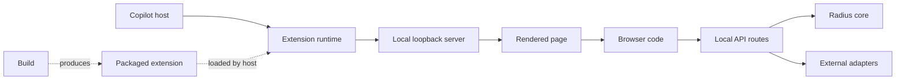

# Radius Canvas test architecture

- **Author**: Nicole James (@nicolejms)
- **Date**: 2026-08
- **Status**: Draft
- **Tracking issue**: [#334](https://github.com/radius-project/ai-extensions/issues/334)
- **Design PR**: [#282](https://github.com/radius-project/ai-extensions/pull/282)

## Overview

Radius Canvas is the visual part of the Radius Copilot extension. It opens a panel where a developer can inspect an application graph, compare branches, configure cloud credentials, create a Radius environment, and deploy or delete an application. The host talks to the extension through the Copilot SDK; the extension starts a private HTTP server on `127.0.0.1`; that server renders one of seven pages; and browser code on the page calls the declared local API routes to read or change state.

The extension is built as one generated, loadable file at `plugins/radius/dist/extension.mjs`. The test architecture must preserve that packaging contract and the existing server-rendered interface.

### A normal request

1. A user asks Copilot to open a Radius view or invokes a Radius tool.
2. The Copilot host sends the request to the extension runtime.
3. The runtime resolves the repository, branch, page, and canvas instance, then starts or reuses that instance's loopback server.
4. The server returns HTML for the requested page. Inline browser code renders and updates the interface.
5. The page calls a local API route for graph, credential, environment, deployment, or operation data.
6. The route calls Radius core logic or an external adapter for GitHub, GHCR, the filesystem, or a command-line tool, then returns a result to the page.

- **Copilot host** discovers the extension, opens the panel, and routes actions and tools.
- **Extension runtime** declares the canvas, two actions, six tools, hooks, and instance lifecycle.
- **Local loopback server** owns per-instance HTTP state and serves only on `127.0.0.1`.
- **Rendered page** is server-produced HTML for one of the seven Radius views.
- **Browser code** handles forms, polling, graph interaction, navigation, focus, and status updates.
- **Local API routes** parse HTTP requests and translate results into stable responses.
- **Radius core** supplies deterministic graph and modeling behavior.
- **External adapters** access GitHub, GHCR, cloud and Radius command-line tools, credentials, and the workspace.
- **Build and packaged extension** produce the single runtime artifact with the Copilot SDK left external.

## Approved decision

Incrementally extract four testable boundaries—runtime, server, pages, and browser code—while preserving behavior through compatibility records, temporary forwarding modules, and side-by-side comparison tests. Keep the single packaged artifact. Do not rewrite the interface as a client application.

Each extraction lands with its unit tests and the smallest higher-level test that crosses the changed boundary. Existing import paths may temporarily forward to extracted code, but those forwarding modules must contain no separate behavior and must be removed or clearly documented when migration finishes.

This decision is approved as the direction of work. The companion [test plan](./2026-08-radius-canvas-test-plan.md) defines the phases, requirements, inventories, CI gates, and current delivery status.

## Current implementation status

The approved architecture describes a target, not the current contents of `main`.

| Phase | Current state                                                                                       | Evidence                                                                                                                                                                                                 |
|-------|-----------------------------------------------------------------------------------------------------|----------------------------------------------------------------------------------------------------------------------------------------------------------------------------------------------------------|
| 0     | Complete: recorded compatibility and coverage, then removed four legacy action/tool pairs           | [#318](https://github.com/radius-project/ai-extensions/pull/318)                                                                                                                                         |
| 1     | Complete: extracted runtime factories and added unit, runtime-integration, and artifact checks      | [#288](https://github.com/radius-project/ai-extensions/pull/288), [#318](https://github.com/radius-project/ai-extensions/pull/318)                                                                       |
| 2     | Complete: assigned all 40 local API routes to named owners and removed the legacy fallback          | [#339](https://github.com/radius-project/ai-extensions/pull/339) through [#382](https://github.com/radius-project/ai-extensions/pull/382)                                                                |
| 3     | Complete: extracted the shared page shell and page renderers while preserving all seven page values | [#379](https://github.com/radius-project/ai-extensions/pull/379)                                                                                                                                         |
| 4     | Complete: extracted browser behavior into tested TypeScript and removed duplicate behavior sources  | [#393](https://github.com/radius-project/ai-extensions/pull/393), [#394](https://github.com/radius-project/ai-extensions/pull/394), and [#395](https://github.com/radius-project/ai-extensions/pull/395) |
| 5     | Complete: consolidate the complete Node integration and built-extension suites                      | [#334](https://github.com/radius-project/ai-extensions/issues/334)                                                                                                                                       |
| 6     | Complete: add required Chromium behavior, journey, accessibility, and keyboard gates                | [#334](https://github.com/radius-project/ai-extensions/issues/334)                                                                                                                                       |
| 7     | Complete: add reviewed visual baselines and extended resilience coverage                            | [#334](https://github.com/radius-project/ai-extensions/issues/334)                                                                                                                                       |
| 8     | Not started: qualify the controlled real-host suite and require it before release                   | [#334](https://github.com/radius-project/ai-extensions/issues/334)                                                                                                                                       |

The current accepted runtime surface is two actions, `get_graph_resources` and `update_source_refs`, and six tools: `radius_generate_app`, `radius_generate_pr_diff_markdown`, `radius_publish_custom_type_extension`, `radius_publish_recipe`, `radius_deploy`, and `radius_deploy_status`. The authoritative Phase 2 inventory contains 40 local API routes with no legacy fallback.

## Objectives

### Goals

- Make the runtime, loopback server, page renderers, and browser behavior independently testable without changing supported behavior.
- Make failures identify an owning module instead of one large source file.
- Replace checks for source-code substrings with checks of behavior.
- Protect branch selection, stale source-reference rejection, path confinement, credential handling, destructive fail-closed operations, external-error propagation, and resumable setup state with named scenarios.
- Add real Chromium coverage for browser behavior, keyboard operation, automated WCAG 2.2 A/AA checks, and a small set of stable screenshots.
- Keep pull-request tests deterministic, secret-free, and independent of live GitHub, Azure, AWS, GHCR, and public asset availability.
- Track aggregate and per-package coverage without allowing percentage targets to replace safety scenarios.
- Prove that the build still emits one loadable `plugins/radius/dist/extension.mjs`.

### Non-goals

- Reorganizing `packages/core` or `packages/adapter-shared`.
- Replacing server-rendered HTML and inline scripts with React, JSX, or another client application.
- Changing canvas IDs, page values, retained actions or tools, route paths, schemas, status codes, or response shapes.
- Running live cloud provisioning, modifying live repositories, or publishing packages from pull-request tests.
- Testing browsers other than Chromium, which matches the host renderer.
- Adding performance, soak, or load suites beyond bounded hang and cleanup checks.
- Introducing Storybook, Chromatic, Cypress, or a second component catalog.

## Why the original structure resisted testing

The problem was not TypeScript or package layout. It was where work happened.

1. **Importing the extension started a session.** [`extension.ts`](../../packages/adapter-canvas/src/extension.ts) called `joinSession()` as soon as it was imported. A test could not inspect the real canvas declaration or handlers without connecting to a host session.
2. **The server hid state and I/O.** [`server.ts`](../../packages/adapter-canvas/src/server.ts) kept instance maps, caches, callbacks, and clocks in module-level state and imported GitHub, GHCR, command-line, filesystem, and credential code directly. Tests had no narrow place to supply controlled behavior, especially failures.
3. **Browser behavior was stored as strings.** [`client.ts`](../../packages/adapter-canvas/src/client.ts) and page templates held executable JavaScript as text. Tests could check syntax or search for words, but they could not import the behavior, drive it, or observe real DOM results.

At the design baseline, most behavior was concentrated in `extension.ts`, `server.ts`, `pages.ts`, and `client.ts`. Those historical measurements motivated the work; this design does not treat old line counts as current facts.

## Target architecture

### Runtime boundary

`src/runtime/` constructs the canvas declaration, retained actions, retained tools, hooks, open and close behavior, and shutdown behavior from explicit dependencies. `extension.ts` remains the build entry and the only production path that calls `joinSession()`.

Phase 1 implemented this boundary. Tests can now build the real runtime with a fake SDK session while artifact checks still prove production registration.

### Server boundary

`src/server/` contains an instance-scoped server container, request parsing and dispatch, one route table, eight API ownership families, page routing, and services for multi-stage workflows. State and caches have an explicit scope. External behavior is supplied through narrow typed interfaces; missing behavior fails during construction rather than returning a success-shaped default.

A route adapter should parse input, call a service, and serialize the result. Azure setup, environment, deployment, graph-build, operation, cache, and workflow state machines belong behind narrow services rather than inside route files. API families assign ownership but do not require one large file per family.

Phase 2 landed incrementally. While old and new paths coexisted, each pull request recorded the exact residual fallback inventory, ran the same request through both paths where practical, and started the real loopback server for focused HTTP checks. The final slice removed the fallback after its inventory reached zero.

### Page boundary

`src/pages/` splits the shared document shell from graph, credential/environment, and deployment renderers. Renderers accept typed state and retain URLs, stable IDs, escaping, serialized initial state, theme tokens, operation progress, and resume behavior.

Renderer compatibility compares meaningful markup and state, not entire-page snapshots. Phase 3 preserved browser behavior for the separate Phase 4 extraction.

### Browser boundary

`src/browser/` holds importable TypeScript for graph interaction, forms, navigation, heartbeat, polling, focus, timers, and status updates. Each entry has an explicit initializer and receives controlled browser services such as fetch, navigation, timers, and external link opening.

The same TypeScript is used in tests and production. A build helper compiles each browser entry in memory into a self-contained inline script. Generated JavaScript is not committed, the extension's own browser modules are not fetched at runtime, and the packaged extension remains one file. The separate decision about whether to keep fetching pinned vendor libraries from unpkg remains open.

### Existing code that stays in place

Already testable modules such as `operations.ts`, `verification-plan.ts`, `bicep.ts`, `deploy.ts`, `gh.ts`, `ghcr.ts`, `workspace.ts`, and `source-refs.ts` remain where they are. The new runtime and server boundaries receive them as production implementations. This is a targeted extraction, not a repository-wide file move.

## Test architecture

### Layers

| Layer                 | What it proves                                                                                | Main boundary                                      |
|-----------------------|-----------------------------------------------------------------------------------------------|----------------------------------------------------|
| Unit                  | Rules, parsing, state transitions, escaping, serialization, and error propagation             | One production module with controlled dependencies |
| Runtime integration   | Real canvas and tool registration, lifecycle, branch context, callbacks, and keepalive        | Real runtime with a fake SDK session               |
| HTTP integration      | Methods, paths, bodies, status, headers, streaming, caches, cleanup, and fail-closed behavior | Real server on an OS-assigned loopback port        |
| Built-extension smoke | Registration, bundle completeness, SDK externalization, startup, and shutdown                 | Real production build in a subprocess              |
| Browser component     | One browser unit in a real DOM                                                                | Vitest Browser Mode in Chromium                    |
| Browser functional    | A page fragment or interaction across browser modules                                         | Chromium with controlled network responses         |
| Critical journey      | A supported workflow across page, browser, HTTP, and server state                             | Playwright with real renderers and loopback HTTP   |
| Accessibility         | Automated WCAG 2.2 A/AA semantics in material states                                          | Playwright and axe                                 |
| Keyboard              | Pointer-free operation, focus movement, and announcements                                     | Playwright                                         |
| Visual                | Selected stable layout, theme, graph, and status states                                       | Reviewed Playwright screenshots                    |
| Real-host             | Installation, discovery, panel lifecycle, focus, and reconnect                                | A controlled supported Copilot host                |

Higher-level tests complement unit tests; they do not replace them. A policy belongs in a unit test, its HTTP representation belongs in HTTP integration, and a critical journey is added only when the failure can escape across the interface and server boundary.

### Regression classes and prevention

| Gate class                | Regressions stopped                                                                                                                   | Prevention layers                                                                      |
|---------------------------|---------------------------------------------------------------------------------------------------------------------------------------|----------------------------------------------------------------------------------------|
| Required PR gates         | Unsafe deletion, wrong branch, path escape, leaked credentials, false success, contract drift, lifecycle races, missing packaged code | Unit, runtime integration, HTTP integration, built-extension smoke                     |
| Required browser gates    | Broken forms, stale polling, duplicate handlers, lost resume state, graph or source-link errors, inaccessible controls, focus loss    | Unit, browser component, browser functional, critical journey, accessibility, keyboard |
| Extended regression gates | Layout drift, cache expiry, repeated-polling leaks, partial responses, timeouts, and platform-specific paths                          | Visual checks plus targeted unit, HTTP, browser, and Windows/macOS runs                |
| Release qualification     | Extension discovery, panel embedding, host focus, close, reopen, and reconnect failures                                               | Built-extension smoke followed by real-host qualification                              |

Required browser and higher-level gates begin only when their test boundary exists, but an affected pull request must add the focused evidence required by its phase. Safety, branch, and destructive-operation scenarios are never retried into acceptance or quarantined.

### Framework choices

| Need                                      | Choice                                       | Reason                                                                     |
|-------------------------------------------|----------------------------------------------|----------------------------------------------------------------------------|
| Unit and Node integration                 | Vitest                                       | Existing repository runner and V8 coverage                                 |
| Browser component and functional          | Vitest Browser Mode with Playwright Chromium | Tests import the same modules in a real browser                            |
| DOM interaction                           | Testing Library DOM and `user-event`         | User-observable queries and realistic events                               |
| Controlled browser HTTP                   | Mock Service Worker                          | Controls network outcomes without replacing fetch internals                |
| Journeys, keyboard, accessibility, visual | Playwright Test                              | One Chromium stack for fixtures, traces, screenshots, and server lifecycle |
| Automated accessibility                   | `@axe-core/playwright`                       | Repeatable WCAG-tagged checks                                              |

## Compatibility and packaging

Phase 0 recorded the stable canvas metadata, seven page values, retained action and tool schemas, 37 route methods and paths, selected markup, branch behavior, and artifact imports before extraction.

The only approved public-surface change was the Phase 0 removal of four legacy pairs: `configure_oidc`/`radius_configure_oidc`, `create_environment`/`radius_create_environment`, `render_graph`/`radius_render_graph`, and `render_graph_diff`/`radius_render_graph_diff`. The supported alternatives already existed through `open_canvas`, the retained source-reference actions, or purpose-built tools.

Every later slice is behavior-preserving. A request-body limit, new `413`, global JSON `500`, centralized error envelope, or other response change is a separate hardening decision with before-and-after HTTP tests; it must not appear as a side effect of moving a route.

The build continues to use Node 24, pnpm 11.19.0, and esbuild. The Copilot SDK remains external, Markdown skill content remains bundled as text, and the output remains `plugins/radius/dist/extension.mjs`.

## Error handling

- Construction reports a specific missing dependency instead of installing a silent success fallback.
- External failures remain failures through services, routes, browser state, and user-visible status.
- Destructive environment and deployment operations fail closed when required state cannot be established.
- Server-sent event streams send their defined terminal error or completion frame and close once, even after headers have been sent.
- Browser initializers surface errors through existing status UI and remove listeners, timers, requests, and polling loops on teardown.
- Harnesses close servers, streams, subprocesses, browser contexts, and workspaces on success and failure.
- Artifact and host harnesses report infrastructure failure separately from product failure.

## Cancellation and abandoned work

- Every long-running workflow declares who owns it and what closing the page, canvas instance, session, or process means: cancel the work or leave a durable operation running.
- Browser teardown cancels timers, polling, and browser requests and ignores late callbacks. It does not claim that server or external work stopped.
- Instance-scoped work receives a cancellation request when its instance closes or the extension shuts down. Work may continue after close only when it has a persisted operation identity, can be resumed safely, and is shown as continuing rather than cancelled.
- GitHub, cloud, command-line, and filesystem adapters receive a cancellation signal when they support one. When an external call cannot be interrupted, its late result is fenced off and cannot start another mutation or overwrite newer state.
- Multi-step mutations check for cancellation before each irreversible step and after each awaited external call. If earlier work cannot be undone, the operation records the partial result and reports cancellation separately from success or failure.
- Command cancellation targets the specific child process tree, waits for exit within a bounded deadline, and never uses a name-wide process kill.
- Instance generation, operation identity, and graph context tokens prevent work from a closed, reopened, or superseded context from committing late results.
- Completion, cancellation, close, and shutdown may race, but cleanup runs once and every caller observes the same terminal outcome.

Cancellation is a cross-cutting contract, not a separate rollout phase. Phase 5 owns runtime, server, adapter, subprocess, and HTTP cancellation checks. Phase 6 owns browser abort, teardown, navigation, and stale-result checks. Phase 7 repeats bounded race, timeout, and cleanup cases that add resilience beyond the required pull-request gates. Phase 8 confirms close, reopen, and reconnect behavior in a supported host.

## GitHub CLI authentication

The adapter treats `gh` as the credential broker and does not read an operating-system keychain or `hosts.yml` directly. Production can receive a host-injected `GH_TOKEN` or `GITHUB_TOKEN`, use accounts stored by `gh auth login`, or have both available. Tests cover the identity, scope, and precedence rules rather than merely proving that one authenticated command succeeds.

- `GH_TOKEN` and `GITHUB_TOKEN` are tested independently, including their documented precedence when both are present.
- An injected token with the required scopes remains the acting identity. A token missing `workflow` may fall back to a stored `gh` account with that scope; without a better account, the later permission failure remains visible.
- With no injected token, the active stored account is used. Explicit account selection overrides the automatic choice, including multi-account and enterprise-managed-user cases.
- Package authentication requests the acting login's stored token with `gh auth token --user` before falling back to the injected token. Missing `read:packages` or `write:packages` scopes produce actionable failure rather than an identity switch or success-shaped fallback.
- Missing, expired, revoked, malformed, or unrecognized credentials; `gh auth status`, token, or switch failure; command timeout; and absent scopes are distinct test outcomes.
- GitHub.com behavior is tested separately from unsupported GitHub Enterprise Server package paths. Clearing `GH_HOST` for GitHub.com package operations must not silently redirect another host.
- Tokens are passed only through controlled environment or standard input, never command arguments, logs, snapshots, reports, or failure messages.

Pull-request tests use a fake `gh` executable, controlled status/token output, placeholder tokens, and an isolated `GH_CONFIG_DIR`; they never inspect or change a developer's real credential store. Phase 5 owns the token-selection, account, scope, command-environment, redaction, and failure matrix. Phase 6 verifies the identity and account-selection UI without exposing tokens. Phase 7 runs the fake-credential matrix across supported operating systems. Phase 8 alone may exercise a real `gh` secure credential store, using disposable test accounts and mandatory cleanup.

## Security

- Pull-request tests use no personal credentials, inherited tokens, live cloud resources, mutable repositories, or live publication.
- Servers bind to `127.0.0.1` on OS-assigned ports in tests.
- HTTP tests cover cross-site mutation protection, malformed input, path traversal, workspace confinement, and destructive fail-closed behavior.
- Publish-tool and source-open paths are checked against workspace confinement.
- Controlled fakes throw on unexpected calls.
- Fixtures use obvious non-secret placeholders; logs, traces, screenshots, and reports redact credential-bearing data and inherited environment values.
- Tests inject pinned vendor content and never depend on unpkg.
- Browser and host harnesses isolate storage and clean up installed extensions, processes, contexts, and workspaces.

## Coverage, diagnostics, and compatibility policy

Phase 0 measured aggregate and per-package V8 coverage and records accepted no-regression thresholds in version-controlled configuration. Newly extracted modules target at least 80% line, 80% function, and 70% branch coverage. Generated bundle text, vendored libraries, and fixtures are excluded.

Coverage reports include console text, `coverage/coverage-summary.json`, and `coverage/lcov.info`; aggregate and per-package values and baseline deltas appear in the CI summary. Coverage cannot substitute for named branch, safety, path, error, or destructive-operation scenarios.

Unit, runtime-integration, and HTTP-integration tests do not retry. Chromium tests may retry once for diagnosis, but the first failure remains visible and a retry-only pass is tracked as a flake. Quarantine requires a linked issue, owner, narrow scope, and expiry condition and may not hide a safety scenario.

## Rollout

| Phase | Delivery                                                                                                   |
|-------|------------------------------------------------------------------------------------------------------------|
| 0     | Record compatibility and coverage; remove approved legacy action/tool pairs                                |
| 1     | Extract and test the runtime boundary                                                                      |
| 2     | Add server scaffolding, then migrate route families and heavy services until the legacy inventory is empty |
| 3     | Extract page shell and renderer groups                                                                     |
| 4     | Extract browser modules and inline-bundle generation                                                       |
| 5     | Consolidate complete Node integration and built-extension suites                                           |
| 6     | Add required Chromium behavior, journey, accessibility, and keyboard gates                                 |
| 7     | Add reviewed visual baselines and extended resilience coverage                                             |
| 8     | Qualify and require the controlled real-host suite before release                                          |

Each pull request is independently green and includes tests, controlled data, harness changes, and a command or CI job that runs the new gate. Focused tests introduced during extraction are promoted into permanent suites rather than duplicated.

## Alternatives considered

- **Test the original large files in place.** This minimizes production edits but retains import side effects, broad mocks, string assertions, and poor failure localization. It could raise coverage while leaving the risky behavior unreachable.
- **Rewrite the interface as a client application.** This would create conventional front-end boundaries but unnecessarily reopens rendering, theme, content-security, and packaging decisions and breaks the single-artifact constraint.
- **Use jsdom as the main browser.** It is acceptable for narrow DOM helpers but cannot represent Chromium focus, layout, iframe behavior, or React Flow faithfully.
- **Use Cypress, Storybook, or Chromatic.** These duplicate roles already covered by the selected Vitest and Playwright stack.
- **Use live GitHub or cloud systems in pull requests.** This is mutable, credential-dependent, slow, and unsafe for destructive cases.
- **Rely on full-page snapshots or coverage percentages.** Neither identifies the policy or safety behavior that matters.

## Open decisions

1. Should production continue fetching pinned vendor assets from unpkg, or should a later design bundle them? Tests remain network-independent either way.
2. What request-body limit and centralized HTTP error shape, if any, should be approved after route parity?

## Design review findings

An early Phase 2 checkpoint produced green tests but route files of roughly 1,400–1,900 lines and a handler dependency object with about 60 members. The review rejected that shape. API families remain ownership labels, while multi-stage Azure, environment, deployment, and graph workflows move into smaller services that receive only the operations they use. Any production server file above 750 lines triggers an explicit decomposition review and requires a recorded exception.

The review also established that Phase 2 had to land as several green slices, with one route table, an exact residual fallback inventory, side-by-side contract tests during migration, focused real-loopback tests, and no incidental HTTP hardening. The completed sequence from #339 through #382 followed that model and ended with 40 owned routes and no fallback.
