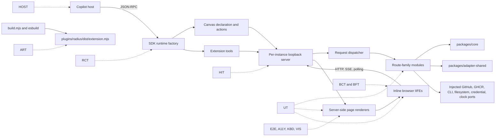

# Radius Canvas test architecture

- **Author**: Nicole James (@nicolejms)
- **Date**: 2026-08
- **Status**: Draft

## Overview

The Radius Canvas adapter ships a Copilot SDK extension, a per-instance loopback HTTP server, server-rendered HTML pages, and inline browser JavaScript as `plugins/radius/dist/extension.mjs`. It has real unit coverage — 40 test files across the three workspace packages — but that coverage stops at the boundaries where the product is most likely to break. Four files concentrate most of the risk: [`server.ts`](../../packages/adapter-canvas/src/server.ts) is 8,461 lines and owns all 37 loopback routes plus process-global maps and caches, [`pages.ts`](../../packages/adapter-canvas/src/pages.ts) is 5,032 lines and owns all seven page renderers, [`extension.ts`](../../packages/adapter-canvas/src/extension.ts) is 1,837 lines and calls `joinSession()` at module load, and [`client.ts`](../../packages/adapter-canvas/src/client.ts) is 1,588 lines of browser behavior held as JavaScript strings that are only ever asserted as source text.

This document is the **architecture and technical-decisions half** of a two-part design. It covers why the current structure resists testing, what the testability goals are, which areas of the codebase need componentization, which testing approaches and frameworks were considered, and the recommended path forward. It deliberately stays at the level of decisions and trade-offs.

The companion document, [Radius Canvas test plan](./2026-08-radius-canvas-test-plan.md), is the **detailed test design**. It specifies the action, tool, and route inventories; the file-by-file componentization map; the per-increment test identifiers; the testability matrix; and the CI and functional-test infrastructure with a run schedule per test type. Read this document first for the *why* and the *what*; read the test plan for the *how* and the *how much*.

Both documents supersede the external [Radius Canvas Test Design Specification RCTD-001 v0.5 and its incremental implementation plan](https://gist.github.com/nicolejms/a00e5bab0fb1079a1c82bf3efe888d41), which predates this repository's completed package relocation and TypeScript migration. That specification's paths (`adapters/canvas`, `*.mjs` sources, `*_test.mjs` tests), its runtime entry point, and its contract inventories are all out of date; its analysis, risk model, and test taxonomy are not, and are carried forward here.

## Terms and definitions

| Term            | Definition                                                                                                                                                                                                                      |
|-----------------|---------------------------------------------------------------------------------------------------------------------------------------------------------------------------------------------------------------------------------|
| A11Y            | Accessibility tests: automated WCAG 2.2 A/AA checks with `@axe-core/playwright`.                                                                                                                                                |
| ART             | Artifact smoke tests that load the built `plugins/radius/dist/extension.mjs` in a subprocess against an SDK registration stub.                                                                                                  |
| BCT             | Browser component tests: one isolated browser-side unit in real Chromium.                                                                                                                                                       |
| BFT             | Browser functional tests: a complete page fragment or cross-module browser interaction in real Chromium.                                                                                                                        |
| E2E             | Playwright journeys through real rendered pages and the real loopback server, with external systems replaced by deterministic fakes.                                                                                            |
| HIT             | HTTP integration tests against the real Node loopback server on an ephemeral `127.0.0.1` port.                                                                                                                                  |
| HOST            | Smoke tests that run the built extension inside a supported, real Copilot host.                                                                                                                                                 |
| IIFE text       | Browser TypeScript compiled by esbuild into a self-contained immediately-invoked function expression, returned as a string and injected into an inline `<script>`. It is generated, never committed, and exposes no global API. |
| KBD             | Keyboard UX tests: keyboard-only operation and focus behavior.                                                                                                                                                                  |
| Loopback server | The per-canvas-instance HTTP server created by [`server.ts`](../../packages/adapter-canvas/src/server.ts), bound to `127.0.0.1` on a derived port.                                                                              |
| RCT             | Runtime contract tests for canvas registration, actions, tools, lifecycle, and SDK routing, using a fake session.                                                                                                               |
| UT              | Node unit tests for pure or dependency-injected behavior.                                                                                                                                                                       |
| VIS             | Visual regression tests: selected deterministic Playwright screenshots.                                                                                                                                                         |

## Objectives

> **Issue Reference:** N/A. This design refreshes and splits an external test specification against the current repository. An implementation issue should be opened per phase after design approval.

### Goals

- Make the SDK runtime, loopback server, page renderers, and browser behavior independently testable **without changing their public behavior**.
- Componentize the four concentration points — `server.ts`, `pages.ts`, `extension.ts`, `client.ts` — along responsibility boundaries, so a failure names its owning layer instead of pointing at a multi-thousand-line file.
- Replace source-string assertions with behavior assertions. The current [`client.test.ts`](../../packages/adapter-canvas/src/client.test.ts) and [`extension.test.ts`](../../packages/adapter-canvas/src/extension.test.ts) verify that implementation text exists, which cannot detect a runtime regression.
- Audit the six canvas actions and ten extension tools before freezing them as permanent compatibility contracts, remove approved legacy bridges, and add explicit coverage for the retained surface.
- Protect the highest-consequence behavior with scenario gates rather than percentage gates: worktree branch selection, stale source-reference rejection, destructive fail-closed operations, resumable long-running setup state, path confinement, credential handling, and external-error propagation.
- Add real Chromium coverage for DOM behavior, keyboard operation, WCAG 2.2 A/AA automated checks, and a small set of stable visual baselines.
- Track code coverage in CI on the existing V8 setup with text, JSON summary, and LCOV reports, an accepted no-regression baseline, higher thresholds for newly extracted modules, and machine-readable artifacts retained on every run.
- Verify that [`build.mjs`](../../packages/adapter-canvas/build.mjs) still emits exactly one loadable `plugins/radius/dist/extension.mjs` with the Copilot SDK externalized.
- Keep pull-request tests deterministic, secret-free, and independent of live GitHub, Azure, AWS, GHCR, and unpkg availability.

### Non-goals

- Reorganizing [`packages/core`](../../packages/core) or [`packages/adapter-shared`](../../packages/adapter-shared). Their layouts and unit suites remain authoritative for their own behavior, and this work does not absorb domain logic into the canvas adapter.
- Migrating sources from `.mjs` to TypeScript. That migration is already complete; only [`build.mjs`](../../packages/adapter-canvas/build.mjs) remains JavaScript because it is the build script.
- Replacing server-rendered HTML and inline browser scripts with a client application or a React/JSX source tree.
- Changing canvas IDs, page names, retained action/tool names, route paths, schemas, or response shapes. Removing the explicitly identified legacy action/tool bridges is in scope and requires compatibility review.
- Running live cloud provisioning, mutating live GitHub repositories, or publishing live packages in pull-request tests.
- Cross-browser testing beyond Chromium, which matches the canvas host rendering engine.
- Performance, soak, and load testing beyond bounded checks that detect hangs and resource leaks.
- Storybook, Chromatic, Cypress, or a second component catalog.

### User scenarios (optional)

#### User story 1

As a contributor, I change a canvas action, a route, a renderer, or a browser interaction and receive a focused failure at the owning boundary — not a passing source-string assertion, and not a manual round trip through the Copilot host.

#### User story 2

As a maintainer, I gate pull requests on deterministic, secret-free suites that cover safety-critical behavior, and separately qualify the built extension in a real Copilot host before release.

#### User story 3

As a reviewer, I see coverage percentages and their delta from the accepted baseline in the workflow job summary of every run, so a coverage regression is visible during review rather than discovered later.

## User experience (if applicable)

Supported canvas workflows do not change. Canvas pages, inputs, URLs, rendered behavior, and the retained agent-facing actions and tools remain compatible.

The one user-visible change is the removal of four unused action/tool pairs after compatibility review. Current skills already reach the same outcomes through `open_canvas`, the retained source-reference actions, or the retained purpose-built tools, so no supported workflow loses a capability.

**Sample input:**

N/A. This proposal adds no user-facing input.

**Sample output:**

N/A. This proposal adds no user-facing output. The only new operator-facing output is the CI coverage job summary described under **Monitoring and logging**.

## Design

### High-level design

The architecture rests on one observation: the barriers to testing this codebase are **structural seams**, not missing types and not package organization. Three specific structures block testing.

1. **Module-load side effects.** [`extension.ts`](../../packages/adapter-canvas/src/extension.ts) calls `joinSession()` when imported. Any test that imports it joins a session, so the canvas declaration and its action handlers cannot be constructed and inspected in isolation.
2. **Process-global ownership.** [`server.ts`](../../packages/adapter-canvas/src/server.ts) owns the server map, per-instance state, environment and deployment caches, handoff callbacks, and the activity clock as module-level state, and imports GitHub, GHCR, `rad`, cloud CLI, filesystem, and credential-persistence behavior directly. There is no seam at which a test can substitute a deterministic implementation, so route tests either mock whole modules — which silently returns success for unmodeled operations — or do not exist.
3. **Behavior held as text.** Browser logic lives in the `CLIENT_REPO_BRANCH_JS`, `CLIENT_GRAPH_JS`, `CLIENT_HEARTBEAT_JS`, and `CLIENT_OPCHIP_JS` string exports of [`client.ts`](../../packages/adapter-canvas/src/client.ts) and in inline scripts inside `pages.ts`. Strings can be checked for syntax and substrings; they cannot be imported, invoked, or driven.

The response is to introduce four responsibility-oriented seams inside `packages/adapter-canvas/src/`, each with an injectable dependency boundary, and to add test levels outward from the cheapest and most deterministic to the most expensive:

```text
runtime/   factories for the canvas, tools, hooks, and extension composition
server/    instance-scoped container, request dispatcher, route-family modules
pages/     shared shell plus graph, environment/credential, deployment renderers
browser/   importable TypeScript entries and helpers, compiled to inline IIFEs
```

`extension.ts` remains the esbuild entry point and the only module that calls `joinSession()`. The browser modules become the single source of browser behavior: Vitest Browser Mode imports them directly, and a shared esbuild helper compiles the same modules in memory (`write: false`) into IIFE text that the page renderers inject inline. There is no second behavior source, no new runtime HTTP request, and the shipped output remains one file.

Order of work runs innermost first: record contracts and the coverage baseline, enable coverage reporting, extract runtime, then server, then pages, then browser, then add P0 Node boundaries (RCT/HIT/ART), then P1 Chromium (BCT/BFT/E2E/A11Y/KBD), then P2 visual and resilience, then P3 real host. Each structural phase must pass its exit gate before the next begins, because each later seam depends on the earlier one.

Unit tests stay collocated with production modules using the canvas `*.test.ts` convention configured by [`packages/adapter-canvas/vitest.config.ts`](../../packages/adapter-canvas/vitest.config.ts). Every non-unit suite lives under `packages/adapter-canvas/test/`. There is no `test/unit/` directory.

### Architecture diagram

System under test, and which test level owns each boundary:



Test boundaries and their default treatment:

| Boundary                      | Contract under test                              | Default treatment                           |
|-------------------------------|--------------------------------------------------|---------------------------------------------|
| Copilot runtime to provider   | Registration, schemas, open/action/close routing | Fake SDK session, real runtime factory      |
| Provider to loopback server   | Per-instance creation, state, URL, cleanup       | Real server on an ephemeral loopback port   |
| Browser to loopback server    | HTML, HTTP, SSE/polling, navigation, errors      | Real Chromium and real HTTP                 |
| Adapter to `packages/core`    | Input, output, and error propagation             | Real core for deterministic pure behavior   |
| Adapter to GitHub, cloud, CLI | Commands, API contracts, failure handling        | Typed deterministic fakes at injected ports |
| Build to shipped artifact     | Bundle completeness and SDK externalization      | Real esbuild output plus registration stub  |
| Extension to Copilot host     | Discovery, panel, iframe, focus and reopen       | Real controlled host, conditional suite     |

### Detailed design

The central technical decision is whether to test around the current structure or to change the structure first.

#### Option 1: Add tests around the current monoliths

Leave `extension.ts`, `server.ts`, `pages.ts`, and `client.ts` structurally intact. Export more helpers, lean on module mocks, keep source-text assertions for browser code, and reach the remaining behavior through full-process tests.

##### Advantages

- Smallest immediate production diff, and no compatibility risk from moving code.
- Preserves every current import path and file owner.
- Additional pure helpers can gain isolated coverage quickly.
- No new build step and no compatibility facades to retire.

##### Disadvantages

- Importing `extension.ts` still calls `joinSession()`, so the assembled canvas declaration and action handlers remain unreachable from a test.
- Route tests stay coupled to an 8,461-line handler with direct GitHub, GHCR, CLI, filesystem, credential, operation-registry, cache, and workflow dependencies. Broad module mocks are the only lever, and they return success for operations the test never modeled — precisely the failure mode that lets an external error be presented as success.
- Browser tests keep asserting implementation text. A refactor that changes a string while breaking behavior still passes; a behavior fix that changes a string fails for no reason.
- Failures do not localize. The first practical place to exercise real behavior becomes HTTP or full-process tests, which makes the slowest and most flake-prone level carry the most responsibility.
- Coverage percentages rise without the safety-critical scenarios actually being reachable, which is worse than a known gap.

#### Option 2: Incrementally extract testable seams, then add non-unit suites

Split the four concentration points into responsibility-oriented modules behind typed dependency boundaries, keep compatibility facades at the current import paths during migration, ship collocated unit tests with each extraction, and introduce non-unit frameworks only once the unit seams are stable.

##### Advantages

- Tests instantiate real runtime, route, renderer, and browser behavior with narrow typed dependencies, so a fake implements an explicit contract and can throw on unspecified calls.
- Unit failures identify the owning layer before integration tests exist, and each later suite covers only what the level below genuinely cannot.
- The same TypeScript browser modules feed both direct browser tests and the inline production bundle, so behavior has one source.
- Work lands in bounded, independently reviewable increments with explicit exit gates.
- Safety-critical scenarios become directly expressible, which is what the coverage policy actually depends on.

##### Disadvantages

- Requires production refactoring before the full test suite can exist, so value arrives later than in Option 1.
- Temporary compatibility facades exist during migration and must be deliberately retired, not forgotten.
- Refactoring `server.ts` and `pages.ts` while preserving HTTP contracts and rendered markup demands compatibility fixtures recorded up front and disciplined review.
- Browser IIFE generation adds a build step that itself needs unit and artifact coverage.

#### Option 3: Rewrite the UI as a client application

Replace server-rendered HTML and inline scripts with a React/JSX source tree and a conventional client build, then test it with the mainstream component-testing stack.

##### Advantages

- Aligns with the largest body of front-end testing practice and tooling.
- Component boundaries are explicit by construction rather than extracted.

##### Disadvantages

- Discards working, shipped UI and re-opens every rendering, theming, CSP, and packaging decision at once.
- Breaks the single-artifact, inline-delivery, no-runtime-fetch properties that the plugin format depends on.
- Couples a testability problem to a product rewrite, so neither can be reviewed on its own merits.
- Delivers no coverage until the rewrite is substantially complete.

#### Proposed option

**Option 2.** The repository state confirms the barriers are structural seams, not language or package organization: the TypeScript migration and the move to `packages/` are already done, and coverage is still blocked by module-load side effects, process globals, and behavior stored as text. Option 1 would raise coverage numbers while preserving exactly the blind spots the current source-based assertions demonstrate. Option 3 solves a problem this proposal does not have, at the cost of the artifact contract.

Each extraction must preserve behavior and ship with its collocated unit tests in the same change. Compatibility facades may remain temporarily but must contain no independent behavior. A structural phase may require several independently green pull requests when one reviewable change cannot express the whole seam safely; every intermediate state must remain production-valid, and temporary migration adapters must have an explicit route inventory and deletion gate. Non-unit dependencies are added only in the phase that uses them.

#### Componentization areas

Four areas need componentization. The detailed file-to-target and route-to-target maps are in the [test plan](./2026-08-radius-canvas-test-plan.md); the rationale is here.

| Area                                                                                    | Current state                                                                                               | Why it must be split                                                                                                                               | Target seam                                                                            |
|-----------------------------------------------------------------------------------------|-------------------------------------------------------------------------------------------------------------|----------------------------------------------------------------------------------------------------------------------------------------------------|----------------------------------------------------------------------------------------|
| Runtime — [`extension.ts`](../../packages/adapter-canvas/src/extension.ts), 1,837 lines | `joinSession()` at module load; canvas, six actions, ten tools, hooks, operation-aware keepalive all inline | Nothing can be constructed without joining a session, so no declaration or handler is independently assertable                                     | `src/runtime/` factories; `extension.ts` becomes the composition root                  |
| Server — [`server.ts`](../../packages/adapter-canvas/src/server.ts), 8,461 lines        | 37 routes, process-global maps and caches, operation-registry access, direct external imports               | No injection point for GitHub, GHCR, CLI, filesystem, credential, or operation behavior; destructive paths cannot be driven to their failure modes | `src/server/` container and dispatcher, route ownership modules, and use-case services |
| Pages — [`pages.ts`](../../packages/adapter-canvas/src/pages.ts), 5,032 lines           | Seven renderers plus a shared shell, operation progress UI, and inline page scripts                         | Renderer state variants are reachable only through whole-page output; executable behavior is mixed into markup                                     | `src/pages/` shell and three renderer groups                                           |
| Browser — [`client.ts`](../../packages/adapter-canvas/src/client.ts), 1,588 lines       | Four `CLIENT_*_JS` string exports, including shared operation polling, plus scripts embedded in `pages.ts`  | Behavior cannot be imported or invoked; only syntax and substrings are checkable                                                                   | `src/browser/` entries and helpers, compiled to inline IIFE text                       |

The split is **by responsibility, not one module per endpoint or per page**. Eight API route families assign every route to one ownership namespace, while page routing remains a ninth server responsibility. These ownership families are not a ceiling on component granularity and do not require one production file per family. A route handler is an HTTP adapter that parses input, calls a use case, and serializes its outcome. Multi-stage Azure setup, environment, deployment, graph-build, operation, cache, or workflow behavior moves behind independently testable use-case services when keeping it in the route module would create a replacement monolith. Files that are already independently testable — including [`operations.ts`](../../packages/adapter-canvas/src/operations.ts), [`verification-plan.ts`](../../packages/adapter-canvas/src/verification-plan.ts), [`bicep.ts`](../../packages/adapter-canvas/src/bicep.ts), [`gh.ts`](../../packages/adapter-canvas/src/gh.ts), [`ghcr.ts`](../../packages/adapter-canvas/src/ghcr.ts), [`workspace.ts`](../../packages/adapter-canvas/src/workspace.ts), [`source-refs.ts`](../../packages/adapter-canvas/src/source-refs.ts), and their peers — stay where they are and become production defaults supplied at the runtime or server composition root. The operation helpers do not create a fifth migration target, but their runtime keepalive, HTTP status, page-state, and browser-polling integrations migrate and gain boundary tests with the corresponding four phases rather than being deferred until the end. This is a surgical testability refactor, not a repository-wide file shuffle.

#### Action and tool surface cleanup

The canvas currently exposes six actions and ten tools. Four action/tool pairs date from the initial refactored-canvas commit and have no current supported caller: each either instructs the agent to call `open_canvas`, instructs the agent to invoke its paired action, or provides a second programmatic path around the canonical page and loopback route.

| Current action        | Current tool                | Recommendation | Reason                                                                                                                                                                                                                                            |
|-----------------------|-----------------------------|----------------|---------------------------------------------------------------------------------------------------------------------------------------------------------------------------------------------------------------------------------------------------|
| `configure_oidc`      | `radius_configure_oidc`     | Remove         | The tool ignores its `provider` argument and only instructs the agent to open the environment page. The [`radius-environment`](../../plugins/radius/skills/radius-environment/SKILL.md) skill opens the credentials or environment page directly. |
| `create_environment`  | `radius_create_environment` | Remove         | The tool ignores its arguments and only instructs the agent to open the environment page. The action duplicates the wizard's `/api/create-environment` path and has no current skill caller.                                                      |
| `render_graph`        | `radius_render_graph`       | Remove         | The tool only asks the agent to invoke the paired action with arbitrary resources. The canonical flow opens the graph page and builds from branch-aware `.radius/app.bicep` through the managed `rad` path.                                       |
| `render_graph_diff`   | `radius_render_graph_diff`  | Remove         | The tool computes a diff and asks the agent to invoke the paired action, duplicating graph-diff open behavior that already fetches explicit base/head models and computes the same core diff.                                                     |
| `get_graph_resources` | N/A                         | Keep           | The [`radius-app-graph`](../../plugins/radius/skills/radius-app-graph/SKILL.md) skill invokes it for stable resource IDs and a graph context token during source-reference discovery.                                                             |
| `update_source_refs`  | N/A                         | Keep           | It is the context-token-protected write half of the source-reference workflow and reloads the active canvas after applying references.                                                                                                            |

The six retained tools are `radius_generate_app`, `radius_generate_pr_diff_markdown`, `radius_publish_custom_type_extension`, `radius_publish_recipe`, `radius_deploy`, and `radius_deploy_status`. Each has a current owner: `radius_generate_app` backs graph and deploy handoffs and bundles the authoritative app-bicep skill for standalone installs where sibling plugin skills are unavailable; `radius_generate_pr_diff_markdown` produces the non-canvas Mermaid artifact in the PR hook flow; the two publish tools enforce managed-binary, workspace-confinement, and GHCR target policy for custom resource types; and the two deploy tools preserve attempt identity across the deploy repair handoff.

Removal happens in Phase 0, **before** runtime extraction, so tests never freeze obsolete declarations as public contracts. If review finds an external consumer, that surface is retained with a deprecation note and a focused contract test rather than removed silently.

#### Test levels and ownership

| Level | Runner                                            | Owns                                                                  | External boundary                  |
|-------|---------------------------------------------------|-----------------------------------------------------------------------|------------------------------------|
| UT    | Vitest Node                                       | Pure functions, factories, route handlers, renderers, browser state   | All I/O replaced at injected ports |
| RCT   | Vitest Node                                       | Real runtime composition, schemas, actions, open/reopen/close         | Fake SDK session, fake adapters    |
| HIT   | Vitest Node                                       | Real ephemeral loopback server and real HTTP contracts                | Injected external-service fakes    |
| ART   | Vitest plus a Node subprocess                     | Built bundle registration, contents, startup, shutdown                | SDK registration stub              |
| BCT   | Vitest Browser Mode, Playwright Chromium provider | One isolated browser unit in a real DOM                               | MSW or injected browser ports      |
| BFT   | Vitest Browser Mode, Playwright Chromium provider | A complete page fragment or cross-module browser interaction          | MSW                                |
| E2E   | Playwright Test                                   | Critical multi-boundary journeys through real pages and loopback HTTP | Deterministic server adapters      |
| A11Y  | Playwright plus `@axe-core/playwright`            | WCAG 2.2 A/AA automated checks                                        | Same E2E fixtures                  |
| KBD   | Playwright Test                                   | Keyboard-only operation and focus behavior                            | Same E2E fixtures                  |
| VIS   | Playwright screenshots                            | Selected stable, high-value visual states                             | Same E2E fixtures                  |
| HOST  | Supported host automation                         | Discovery through iframe panel lifecycle in a real host               | Real controlled Copilot host       |

Unit tests remain the default for pure logic. A behavior is tested at the cheapest level that can genuinely represent it, and E2E is reserved for journeys that cross boundaries no lower level spans.

#### Regression classes and prevention priority

Tests detect regressions; required gates prevent detected regressions from merging or releasing. Priority expresses the consequence and the earliest boundary at which the regression must be stopped, not the amount of engineering value in a test type. P0 regressions must be blocked in the pull request that can introduce them. P1 regressions must be blocked once the affected browser or journey seam exists. P2 regressions receive targeted or scheduled gates because they are important but less likely to justify blocking every unrelated pull request. P3 regressions can only be represented in a real Copilot host and therefore block release rather than routine pull requests.

| Priority | Regression class                                            | Likely examples                                                                                                                                                                                 | Primary prevention layers                                                                                                                                                                                              | Gate                                                                                                              |
|----------|-------------------------------------------------------------|-------------------------------------------------------------------------------------------------------------------------------------------------------------------------------------------------|------------------------------------------------------------------------------------------------------------------------------------------------------------------------------------------------------------------------|-------------------------------------------------------------------------------------------------------------------|
| P0       | Safety, security, destructive behavior, and error integrity | Deleting an active environment, dispatching against the wrong repository or branch, accepting cross-site mutation, path traversal, exposing credentials, presenting external failure as success | UT for decision logic and validation; RCT for runtime identity and branch context; HIT for real HTTP, streaming, and fail-closed behavior; focused E2E only where the safety decision crosses UI and server boundaries | Non-negotiable on every pull request that can affect the behavior; no retry or quarantine for the safety scenario |
| P0       | Public contract, lifecycle, and shipped-artifact integrity  | Action or tool schema drift, an unowned route, duplicate server instances, truncated SSE, shutdown races, missing bundled modules or assets, SDK imports accidentally bundled                   | UT plus compatibility fixtures; RCT for runtime registration and lifecycle; HIT for route contracts and cleanup; ART for the built extension                                                                           | Non-negotiable on the introducing pull request and all later affected pull requests; ART also blocks publishing   |
| P1       | User-workflow and browser-behavior correctness              | Broken form transitions, stale polling overwriting current state, duplicate event binding, lost operation resume state, incorrect graph interactions or source links                            | UT for state transforms; BCT and BFT for real-DOM behavior; HIT for server-backed states; E2E for critical cross-page journeys                                                                                         | Required for affected browser and journey changes once the Chromium seam exists                                   |
| P1       | Accessibility and keyboard operability                      | Unreachable controls, focus loss, missing announcements, validation errors not associated with fields, diff status conveyed only by color                                                       | Semantic UT where possible; BFT with accessible queries; A11Y and KBD in real Chromium                                                                                                                                 | Non-negotiable for affected UI states once the Chromium accessibility gate exists                                 |
| P2       | Visual, resilience, timing, and platform variance           | Layout drift, clipped focus, cache-expiry bugs, repeated polling leaks, partial responses, Windows or macOS path errors, CDN-dependent flakes                                                   | VIS for selected stable states; fake-clock UT; HIT and BFT resilience cases; platform-matrix UT/RCT/HIT; deterministic vendor fixtures                                                                                 | Blocking when a path filter identifies direct risk; otherwise scheduled or on-demand with tracked failures        |
| P3       | Real-host discovery and embedding                           | Plugin not discovered, panel not opened or reused, iframe readiness failure, focus or reconnect behavior differing from harness assumptions                                                     | ART as the earliest packaging proxy; HOST for installation, discovery, panel, iframe, focus, close, and reconnect                                                                                                      | Mandatory release gate on a qualified controlled runner; never replaced by an emulated pass                       |

The layers are intentionally cumulative. A P0 route regression is not assigned only to HIT: pure policy stays in UT, the actual HTTP contract stays in HIT, and a destructive multi-boundary journey may additionally require E2E. Conversely, a broad E2E test does not replace the faster test that identifies the owning rule. Every regression class is assigned to the cheapest faithful test first, then to the smallest higher-level test needed to cover the boundary where the failure could still escape.

#### Framework decisions

| Decision                          | Selected                                                               | Rationale                                                                                                    |
|-----------------------------------|------------------------------------------------------------------------|--------------------------------------------------------------------------------------------------------------|
| Unit, runtime, integration runner | Vitest                                                                 | Already the repository runner across all three packages, with ESM, mocking, coverage, and workspace projects |
| Browser component runner          | Vitest Browser Mode with the Playwright provider                       | Runs the same modules in real Chromium without adding a second assertion ecosystem                           |
| DOM query and interaction         | Testing Library DOM with `user-event`                                  | Accessible queries and realistic events assert user-observable semantics                                     |
| Browser network mocking           | MSW                                                                    | Network-level behavior shared across browser tests without replacing `fetch` internals                       |
| E2E runner                        | Playwright Test                                                        | Chromium, tracing, screenshots, fixtures, web-server lifecycle, and accessibility and visual integration     |
| Accessibility engine              | `@axe-core/playwright`                                                 | Repeatable WCAG-tagged automated checks against rendered pages                                               |
| Visual engine                     | Playwright screenshots                                                 | One browser stack, no external visual SaaS dependency                                                        |
| Coverage provider                 | V8, already configured in [`vitest.config.ts`](../../vitest.config.ts) | Native, already present, and needs reporters and thresholds rather than a new tool                           |

Chromium alone is required because the canvas host is Chromium-based. Windows and macOS both remain supported development environments; platform-specific filesystem, process, managed-binary, and source-link behavior gets explicit cases at the unit and integration levels rather than a duplicated browser matrix.

#### Testability design requirements

- **Browser modules.** Behavior moves out of `CLIENT_*_JS` into `src/browser/`. Each module exposes an explicit initialization function and narrow ports for network, navigation, clock, external-open, and DOM access. Production delivery stays inline and CSP-safe.
- **Runtime factory.** The canvas declaration, actions, tools, hooks, `open`, and `onClose` move into factories that accept dependencies. `extension.ts` keeps `joinSession()` and becomes the composition root.
- **Server container.** An instance-scoped container owns the server map, per-instance state, caches, handoff and source-open handlers, and the activity clock. A complete typed dependency object supplies production defaults for GitHub, GHCR, `rad`, cloud CLI, filesystem, credential-persistence, and clock behavior at the composition root. Route families receive narrowed views of that object, and heavy use-case services receive only their explicit ports and state. Route modules never import a global server map or production adapter. Missing dependencies fail at construction rather than defaulting silently. One route table owns both matching metadata and the handler reference so route declaration and dispatch cannot drift.
- **Vendor assets.** Production may keep inlining the current pinned versions from [`vendor.ts`](../../packages/adapter-canvas/src/vendor.ts). Tests must not depend on unpkg; deterministic fixture content is supplied at the server dependency boundary.
- **Core and shared.** [`packages/core`](../../packages/core) and [`packages/adapter-shared`](../../packages/adapter-shared) stay structurally unchanged and keep their dependency rules. Their suites run as workspace regression gates. Canvas tests use real core functions where deterministic and never duplicate core's own unit tests.

### API design (if applicable)

This proposal removes four legacy actions and four legacy tools after compatibility review. The following remain compatibility contracts and are recorded as fixtures in Phase 0 before any extraction:

- Canvas ID `radius`.
- The seven page input values: `credentials`, `graph`, `planned`, `graph-diff`, `deployed`, `environment`, `deploying`.
- The two retained canvas action names and schemas.
- The six retained extension tool names and schemas.
- All 37 `/api/*` paths, methods, request bodies, response bodies, polling and streaming behavior, and status codes.
- The `plugins/radius/dist/extension.mjs` output path and single-file runtime entry artifact.

New factory, dependency, and port types are internal package APIs, exported only from their owning modules unless another workspace package demonstrates a need. Per-route request, state, and response types are internal to `src/server/`.

The [test plan](./2026-08-radius-canvas-test-plan.md) enumerates the full action, tool, and route inventories with their required contract cases.

### Implementation details

#### Core package — packages/core (if applicable)

No structural change. The graph, modeling, platform, port, and workflow suites under [`packages/core/src`](../../packages/core/src) remain authoritative. No browser, SDK, HTTP, Playwright, Testing Library, MSW, or axe dependency is added to core. Its `*.test.ts` convention is unchanged.

#### Canvas adapter — packages/adapter-canvas (if applicable)

All four new seams live here, alongside the existing helper modules that stay in place. New and migrated unit tests remain collocated as `*.test.ts` per [`packages/adapter-canvas/vitest.config.ts`](../../packages/adapter-canvas/vitest.config.ts); every non-unit suite lives under `packages/adapter-canvas/test/`. The root [`vitest.config.ts`](../../vitest.config.ts) continues to aggregate the three package projects. The full target layout is in the [test plan](./2026-08-radius-canvas-test-plan.md).

#### Shared adapter — packages/adapter-shared (if applicable)

No structural change. [`rad.ts`](../../packages/adapter-shared/src/rad.ts) remains the Node-only owner of managed `rad`/Bicep execution and graph building, and its suite stays authoritative for binary selection, version checks, downloads, process execution, and graph commands. Canvas runtime and server tests inject it at their dependency boundaries.

#### Plugin — plugins/radius (if applicable)

No manifest or runtime-layout change. The build still emits `plugins/radius/dist/extension.mjs` as the loadable entry inside the assembled `plugins/radius/dist/` package. Skill prose that references a removed tool — notably the `radius_render_graph_diff` data-flow reference — is corrected in Phase 0. Skills and marketplace packaging are otherwise outside this work.

#### Build & packaging (if applicable)

- Keep [`build.mjs`](../../packages/adapter-canvas/build.mjs) as the Node 24 esbuild entry, with `@github/copilot-sdk` and `@github/copilot-sdk/extension` external and Markdown skill content bundled as text.
- Add in-memory browser IIFE compilation (`write: false`) shared by the production build and the page and E2E fixture builds. No runtime browser asset files are created and no generated JavaScript is committed.
- Extend [`build.yml`](../../.github/workflows/build.yml) in phases as suites stabilize. The existing typecheck, lint, format, unit test, build, and artifact upload steps remain required.
- Extend [`publish.yml`](../../.github/workflows/publish.yml) so the same deterministic required suites run before the `release` branch is updated.
- Use the existing root `coverage` script and V8 provider. Once gating is enabled, CI runs `pnpm run coverage` in place of a duplicate `pnpm run test`, because the coverage command executes the same Vitest projects.
- Configure reporters for console text, `coverage/coverage-summary.json`, and `coverage/lcov.info`; upload the machine-readable reports on **every** run so history stays comparable.
- Write aggregate and per-package line, function, statement, and branch percentages plus baseline deltas to the job summary. This keeps regressions visible without granting workflow permission to post or edit pull-request comments.

### Error handling

- Factory and container construction fails with a specific missing-dependency error rather than installing a success-shaped default.
- Route handlers preserve current status codes and response contracts while surfacing validation, external-service, and serialization failures.
- Destructive environment and deployment operations fail closed when preconditions or external state cannot be established.
- Test fakes throw on unexpected calls so an incomplete scenario is visible rather than silently green.
- Browser initializers surface errors through the existing page status UI and clean up listeners, timers, requests, and polling loops on teardown.
- Integration harnesses always close servers, streams, child processes, browser contexts, and temporary workspaces, including after a failure.
- Artifact and host harnesses distinguish infrastructure and setup failure from product failure, so a broken runner never reads as a product regression.

## Test plan

This document defines the strategy; the [Radius Canvas test plan](./2026-08-radius-canvas-test-plan.md) defines the tests. In summary:

- **Levels.** UT, RCT, HIT, and ART run in Node. BCT, BFT, E2E, A11Y, KBD, and VIS run in Chromium. HOST runs against a real, controlled Copilot host.
- **Rollout.** P0 Node boundaries first (destructive fail-closed behavior, deploy status and repair, worktree versus remote branch selection, plan resolution, path confinement, credential failures, streaming and cleanup, artifact registration). Then P1 Chromium behavior and critical journeys with accessibility and keyboard gates. Then P2 visual baselines and resilience cases. Then P3 real-host qualification.
- **Coverage policy.** Measure the existing baseline before introducing thresholds. Aggregate and per-package coverage must not decrease from the accepted baseline, recorded in version-controlled Vitest configuration so a change is a reviewed code change. Newly extracted modules target at least 80 percent line, 80 percent function, and 70 percent branch coverage. Generated bundle text, vendored libraries, and fixtures are excluded.
- **Scenario gates.** Worktree branch selection, stale source-reference rejection, external-error propagation, path confinement, and destructive fail-closed behavior require explicit tests regardless of percentages.
- **Flake policy.** UT, RCT, and HIT do not retry. Browser and E2E suites may retry once in CI for diagnostics, and a retry-only pass is reported and tracked as a flake. Quarantine requires a linked issue, a named owner, narrow isolation, and an expiry condition, and may never cover a safety, branch, or destructive-action requirement.
- **Accessibility and visual.** Primary pages and their material loading, empty, error, and success states target WCAG 2.2 Level A and AA with zero axe violations for the configured tags, supplemented by explicit keyboard and focus tests. Visual baselines are limited to modeled graph, graph details, unresolved planned graph, full-status graph diff, credentials and environment forms, and deploy success/failure, captured on Playwright-managed Chromium at a canonical 900 by 900 viewport with deterministic data, fonts, locale, timezone, and reduced motion.

## Security

- Pull-request tests use no personal credentials, inherited tokens, live cloud resources, mutable GitHub repositories, or live package publication.
- Servers bind only to `127.0.0.1`, and tests use OS-assigned ports.
- HIT explicitly covers the existing cross-site mutation protection in [`server.ts`](../../packages/adapter-canvas/src/server.ts), path traversal, workspace confinement, malformed and oversized input, and destructive fail-closed behavior.
- Paths passed to source opening and to the publish tools are tested for traversal and workspace confinement.
- Fixtures, logs, traces, screenshots, and reports use obvious non-secret placeholders and redact credential-bearing request or response data. Tests never print inherited environment secrets.
- Tests do not depend on unpkg; [`vendor.ts`](../../packages/adapter-canvas/src/vendor.ts) receives deterministic fixture content at the server dependency boundary.
- Browser and host harnesses isolate storage and clean up temporary workspaces, server processes, browser contexts, and installed test extensions.
- New testing dependencies are pinned through the lockfile and introduced only in the phase that uses them, keeping the supply-chain surface aligned with delivered value.

## Compatibility (optional)

Except for the approved removal of four unused legacy action/tool pairs, structural refactor slices are behavior-preserving. Phase 0 records compatibility fixtures for canvas metadata, page values, retained action and tool schemas, route methods and paths, selected HTML markers, branch-selection behavior, and artifact imports before any extraction begins. Temporary facades remain at current import paths until all callers move and ART proves the built bundle is complete. A bounded request body or centralized error response changes the HTTP contract and therefore lands only as a separately identified hardening slice after route parity, with an approved limit or response shape and explicit before-and-after HIT coverage; neither may be introduced incidentally while moving a route.

Windows and macOS remain supported development environments, and platform-specific filesystem, process, managed-binary, and source-link behavior receives focused coverage on both. CI continues to use Node 24 and pnpm 11.19.0 as declared by the root and package manifests, with Chromium suites on `ubuntu-latest`.

## Monitoring and logging

No new production telemetry is required. Tests use existing injected and session logging where available and capture bounded server, runtime, workflow, browser, and host diagnostics.

CI writes coverage percentages and baseline deltas to every run's job summary and uploads machine-readable coverage artifacts on success and failure alike. Test reports, traces, screenshots, and visual diffs are uploaded only on failure. Logs omit secrets and cap deploy and process output. The HOST harness reports infrastructure failures separately from extension failures.

## Development plan

Phases are stated here as scope and exit criteria; per-phase test identifiers, ordered implementation steps, and the CI schedule are in the [test plan](./2026-08-radius-canvas-test-plan.md).

| Phase | Scope                                                                                  | Exits when                                                                                                                                                                         |
|-------|----------------------------------------------------------------------------------------|------------------------------------------------------------------------------------------------------------------------------------------------------------------------------------|
| 0     | Baseline, compatibility fixtures, action/tool cleanup, coverage reporting and baseline | The updated `build.yml` sequence passes, coverage and deltas are visible, and fixtures describe the approved contracts                                                             |
| 1     | `src/runtime/` extraction; `extension.ts` reduced to the composition root              | Runtime unit tests, all existing canvas tests, workspace typecheck, and the production build pass                                                                                  |
| 2     | `src/server/` container, dispatcher, route ownership, and heavy use-case services      | Every route has exactly one owner; temporary legacy dispatch is gone; heavy workflows have narrow service seams; destructive, error, cache, stream, and state branches are covered |
| 3     | `src/pages/` shell and renderer groups                                                 | Renderer output is behaviorally equivalent and state, escaping, serialization, and semantic assertions pass                                                                        |
| 4     | `src/browser/` entries, helpers, and the in-memory IIFE build helper                   | IIFEs are deterministic and inline-safe, no duplicate browser behavior source remains, and the artifact shape is unchanged                                                         |
| 5     | P0 RCT, HIT, and ART suites, added to PR and publish CI                                | They pass without live external access and produce bounded, secret-safe diagnostics                                                                                                |
| 6     | P1 Chromium: BCT, BFT, critical E2E, A11Y, KBD                                         | Deterministic Chromium CI passes and failure artifacts are available                                                                                                               |
| 7     | P2 selected visual baselines and non-duplicative resilience cases                      | Repeated clean runs show stable baselines and retry-only passes are tracked as flakes                                                                                              |
| 8     | P3 real-host harness qualification and smoke cases                                     | The harness self-test and all real-host cases pass; emulated, skipped, or unavailable results do not satisfy the gate                                                              |

Structural phases 1 through 4 land sequentially because each seam depends on the one below it. A phase may contain multiple ordered pull requests when its production seam cannot be reviewed safely as one change; Phase 2 is explicitly delivered as independently green scaffolding, route-family migration, use-case extraction, and legacy-removal slices. No pull request carries an intentionally red intermediate state, and no WIP extraction-and-revert pair appears in review history. Once the production seams exist, independent non-unit suites may be split across separate pull requests. Each pull request carries a file-mapping, residual legacy-route inventory, and coverage note so reviewers can compare it against the componentization maps.

Non-unit evidence begins with the seam it protects rather than waiting for all four structural phases. A runtime migration adds a focused RCT through the real factory and fake session; a server-family migration adds real-loopback HIT for the migrated routes with deterministic external fakes; each structural phase adds or extends an ART smoke that imports or starts the built bundle and proves the facade still exposes the expected surface. These focused migration gates grow into the complete P0 suites in Phase 5. Differential compatibility tests may run the legacy and extracted path against the same input and fake ports while both paths exist, but they are deleted or converted to permanent contract assertions when the legacy path is removed.

## Open questions

1. **Should HOST block every release, or run on a scheduled and manual controlled runner with an explicit release approval check?** This design requires it before release but not on every pull request, because desktop-host infrastructure is not a deterministic PR gate.
2. **Should production keep fetching pinned vendor assets from unpkg at startup, or should a later design bundle them into the plugin?** This work only removes network dependence from tests; the production decision is out of scope here.
3. **Which measured baseline establishes the repository no-regression coverage floor?** Phase 0 records it before thresholds are enabled, and design review should confirm the accepted numbers rather than inheriting whatever the first run produces.
4. **Does the current Copilot host expose supported automation hooks for every HOST lifecycle case?** If not, the missing capability is an infrastructure blocker and must not be replaced with an emulated pass.
5. **Do any external consumers depend on the four action/tool pairs recommended for removal?** No repository skill, hook, or documented workflow invokes them; review should confirm there is no supported external dependency before deletion.
6. **What request-body limit and centralized HTTP error envelope, if any, should be approved after route parity?** Both are useful hardening measures but are observable contract changes and cannot be chosen implicitly inside the structural refactor.

## Alternatives considered

- **jsdom as the primary browser environment:** rejected because it does not represent Chromium layout, focus, iframe and webview behavior, or React Flow rendering. It remains acceptable for narrow pure-DOM helpers where browser fidelity is irrelevant.
- **Cypress:** rejected because Playwright already provides the selected browser provider, E2E, accessibility integration, traces, and screenshots, and adding it would duplicate that role.
- **Storybook or Chromatic:** rejected because the server-rendered UI has no component-catalog requirement and Playwright supplies the selected visual gate without an external service.
- **Live GitHub or cloud integration in pull requests:** rejected as credential-dependent, mutable, slow, and unsafe for destructive scenarios.
- **Source-string assertions as the primary browser and runtime strategy:** rejected because they assert implementation text rather than behavior. Narrow build guards remain appropriate for generated-artifact invariants.
- **One large refactor-and-test pull request:** rejected because it would combine four high-churn seams with several new frameworks and make behavioral drift effectively unreviewable.
- **Committing generated browser bundles as a second source tree:** rejected because it creates two sources of browser behavior and invites hand edits to generated output.
- **Percentage coverage thresholds as the primary safety gate:** rejected as the sole mechanism. Percentages do not distinguish a covered destructive path from a covered getter, so safety-critical behavior is gated by named scenarios and percentages guard against silent erosion.

## Design review notes

Phase 2 design review resolved route-family granularity after an implementation checkpoint produced individually green but unreviewable 1,400- to 1,900-line route files and a roughly 60-member handler dependency surface. Route families remain the route-ownership contract, while multi-stage Azure, environment, deployment, and graph workflows split into use-case services with narrow ports. Phase 2 lands as multiple green slices rather than one directory-wide pull request. Record the remaining approved framework choices, phase gates, accepted coverage baseline, host-gate policy, action/tool removal decision, HTTP hardening decisions, and any deferred scope here before implementation resumes.
