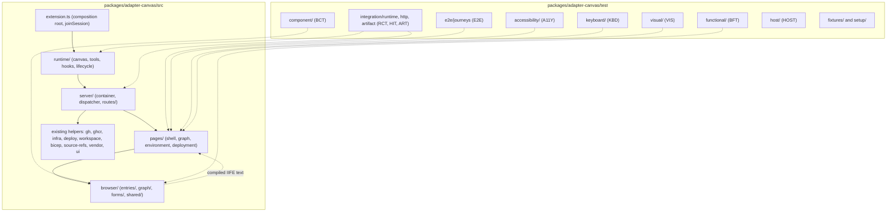

# Radius Canvas test plan

- **Author**: Nicole James (@nicolejms)
- **Date**: 2026-08
- **Status**: Draft

## Overview

This is the detailed test design for the Radius Canvas adapter. It is the companion to [Radius Canvas test architecture](./2026-08-radius-canvas-test-architecture.md), which establishes the problem, the testability goals, the framework selection, and the recommended path forward. That document answers *why* and *what*; this one answers *how* and *how much*.

Specifically, this document enumerates the canvas action, extension tool, page, and loopback route inventories that tests must cover; maps every large source file to the modules it will be broken into; lists the tests to be written for each increment and each non-unit priority; records the testability matrix that ties every requirement to an owning test level; and defines the CI and functional-test infrastructure with an explicit run schedule per test type.

Everything here is grounded in the repository as it stands: `packages/adapter-canvas` exposes 6 canvas actions and 10 extension tools from [`extension.ts`](../../packages/adapter-canvas/src/extension.ts), serves 7 pages and 35 `/api/*` routes from [`server.ts`](../../packages/adapter-canvas/src/server.ts) and [`pages.ts`](../../packages/adapter-canvas/src/pages.ts), and builds to a single `plugins/radius/extension.mjs` through [`build.mjs`](../../packages/adapter-canvas/build.mjs). It merges and refreshes the external [Radius Canvas Test Design Specification RCTD-001 v0.5 and its incremental implementation plan](https://gist.github.com/nicolejms/a00e5bab0fb1079a1c82bf3efe888d41) against that current state.

## Terms and definitions

Test-level abbreviations — UT, RCT, HIT, ART, BCT, BFT, E2E, A11Y, KBD, VIS, HOST — are defined in [the architecture document](./2026-08-radius-canvas-test-architecture.md#terms-and-definitions) and used unchanged here.

Requirement and test identifier prefixes used in this document:

| Prefix | Meaning                                  |
|--------|------------------------------------------|
| `BU`   | Browser-increment unit test (Phase 4)    |
| `CA`   | Canvas action requirement                |
| `HOST` | Real-host smoke case                     |
| `J`    | Critical user journey                    |
| `LC`   | Lifecycle, state, and branch requirement |
| `PG`   | Page requirement                         |
| `PU`   | Pages-increment unit test (Phase 3)      |
| `QR`   | Quality risk                             |
| `RF`   | Route-family requirement                 |
| `RU`   | Runtime-increment unit test (Phase 1)    |
| `SU`   | Server-increment unit test (Phase 2)     |
| `TL`   | Extension tool requirement               |
| `VI`   | Visual baseline                          |

## Objectives

> **Issue Reference:** N/A. Implementation issues should be opened per phase after this plan and the architecture document are approved.

### Goals

- Give every canvas action, extension tool, page, loopback route, lifecycle behavior, and critical journey a named requirement with an owning test level, so coverage gaps are visible as unassigned rows rather than inferred from percentages.
- Specify how each oversized source file is broken into modules, and which tests each new module carries, so a reviewer can compare an increment against a stated contract.
- Define the concrete test inventory per phase: RU-01 through RU-19 for runtime, SU-01 through SU-15 for server, PU-01 through PU-12 for pages, BU-01 through BU-13 for browser, then the risk-ranked P0 through P3 non-unit suites.
- Define the fixture and fake strategy precisely enough that tests are deterministic, secret-free, and independent of network access.
- Define the CI infrastructure — jobs, runners, caching, artifacts — and a run schedule for every test type, including which suites block a pull request, which run nightly, and which gate a release.
- Define entry and exit criteria so completion is a checkable condition rather than a judgement call.

### Non-goals

- Restating the architectural rationale, framework comparison, or option analysis. Those live in [the architecture document](./2026-08-radius-canvas-test-architecture.md).
- Prescribing exact file names beyond the layer boundaries. Names may change during implementation provided the boundaries, the conservative move policy, and the traceability in this document are preserved.
- Specifying test code. This plan states what must be covered and at which level, not the assertions themselves.
- Adding coverage for `packages/core` or `packages/adapter-shared` internals. Their suites remain authoritative and are not duplicated in canvas tests.

### User scenarios (optional)

#### User story 1

As an implementer starting Phase 2, I read the route-to-module map and the SU test list, and I know exactly which routes my increment owns and which behaviors must be covered before its exit gate.

#### User story 2

As a reviewer, I compare a pull request against the file-to-target map and the testability matrix and can tell whether a route, page, action, tool, or browser entry has been left without an owner.

## User experience (if applicable)

N/A. This plan describes tests and test infrastructure and introduces no user-facing behavior. The action and tool removals that do affect the agent-facing surface are specified and justified in [the architecture document](./2026-08-radius-canvas-test-architecture.md#action-and-tool-surface-cleanup).

**Sample input:**

N/A.

**Sample output:**

N/A.

## Design

### High-level design

Work proceeds in four structural increments followed by four test-priority increments. Each structural increment takes exactly one immediate subdirectory of `packages/adapter-canvas/src/`, in a fixed order, and no increment begins until the previous one passes its exit gate:

1. `src/runtime/` — remove module-load side effects and make the SDK surface constructible.
2. `src/server/` — replace process globals and direct imports with an instance container, a dispatcher, and route families.
3. `src/pages/` — split renderers by page responsibility.
4. `src/browser/` — move browser behavior out of strings into importable modules compiled to inline IIFE text.

Non-unit testing begins only after all four pass. It is then added in risk order: P0 Node boundaries, P1 Chromium behavior and journeys, P2 visual and resilience, P3 real host.

Every increment must preserve public behavior, schemas, exports, routes, rendered markup, and the single-file artifact; move only code owned by that increment's responsibility; keep a compatibility facade at the old import path until all callers migrate; ship its collocated unit tests and the focused boundary test appropriate to that seam in the same change; and run its targeted tests, the full existing canvas suite, workspace typecheck, and the production build before it is considered complete.

### Architecture diagram

Target layout of `packages/adapter-canvas`, showing which modules are new and where each test type lives:



Collocated `*.test.ts` unit files sit beside their production modules inside `src/` and are not shown above. Full target tree:

```text
packages/adapter-canvas/
  src/
    extension.ts                       # Thin composition root; only caller of joinSession()
    runtime/
      create-radius-extension.ts       # Composes canvas, tools, hooks, shutdown
      create-radius-canvas.ts          # Declaration, schemas, actions, open, onClose
      create-radius-tools.ts           # Tool declarations and handlers
      canvas-lifecycle.ts              # Reopen and reload helper
      hooks.ts                         # Session hooks and host-channel behavior
    server/
      create-canvas-server.ts          # Per-instance lifecycle, state, caches, clock
      create-request-handler.ts        # URL/method/body parsing, dispatch, serialization
      dependencies.ts                  # Complete production dependency composition
      ports.ts                         # Narrow family and use-case port contracts
      routes/
        liveness-source.ts
        identity-credentials.ts
        azure-discovery.ts
        repositories.ts
        graphs-planning.ts
        environments.ts
        deployments.ts
      services/
        azure-auto-setup.ts             # Multi-stage setup orchestration
        environments/                   # Create, list, status, and fail-closed delete
        deployments/                    # Dispatch, status, reset, and delete
        graphs/                         # Build, plan, diff, progress, and stream outcomes
    pages/
      shell.ts                         # pageShell, tokens, nav, vendor injection, feedback
      graph-pages.ts                   # graph, planned, graph-diff, deployed
      environment-pages.ts             # credentials, environment
      deployment-pages.ts              # deploying
    browser/
      entries/                         # repo-branch, graph, heartbeat, credentials, environment, deploying
      graph/                           # Graph transforms, layout, diff status, detail popup
      forms/                           # Validation, submission, status-state helpers
      shared/                          # Injected fetch, navigation, timer, focus, DOM ports
    client.ts                          # Temporary facade, removed after Phase 4
    server.ts                          # Temporary facade
    pages.ts                           # Temporary facade
    bicep.ts  deploy.ts  gh.ts  ghcr.ts  infra.ts  navicons.ts
    pr-diff-markdown.ts  publish-targets.ts  remote-rad-artifacts.ts
    shared.ts  skill.ts  source-refs.ts  ui.ts  vendor.ts  workspace.ts
  test/
    component/  functional/
    integration/{runtime,http,artifact}/
    e2e/journeys/  accessibility/  keyboard/  visual/  host/
    fixtures/{graphs,pages,services,workspaces}/  setup/
  build/
    browser-bundles.mjs                # Shared in-memory esbuild IIFE helper
  build.mjs  playwright.config.ts  vitest.config.ts
```

### Detailed design

#### File-to-target componentization map

The policy is conservative: files that are already independently testable stay where they are and become production defaults supplied to the new dependency container. Only the four seams that cannot be tested cleanly are moved.

| Current file                                                                                                                             | Lines | Target                                                                                                                     | Treatment and reason                                                                                                                                                                                                                                           |
|------------------------------------------------------------------------------------------------------------------------------------------|-------|----------------------------------------------------------------------------------------------------------------------------|----------------------------------------------------------------------------------------------------------------------------------------------------------------------------------------------------------------------------------------------------------------|
| [`server.ts`](../../packages/adapter-canvas/src/server.ts)                                                                               | 6,830 | `server/create-canvas-server.ts`, `create-request-handler.ts`, `dependencies.ts`, `ports.ts`, `routes/*.ts`, `services/**` | Replace process globals and direct imports with a typed instance container and injected dependencies; assign the 35 routes to the seven RF ownership families below; move multi-stage workflows behind narrow use-case services. Keep `server.ts` as a facade. |
| [`pages.ts`](../../packages/adapter-canvas/src/pages.ts)                                                                                 | 4,045 | `pages/shell.ts`, `graph-pages.ts`, `environment-pages.ts`, `deployment-pages.ts`                                          | Split by page responsibility while preserving markup, URLs, theme tokens, and embedded script strings byte-for-byte. Browser extraction is deferred to Phase 4.                                                                                                |
| [`extension.ts`](../../packages/adapter-canvas/src/extension.ts)                                                                         | 1,716 | `extension.ts` plus `runtime/create-radius-*.ts`                                                                           | Keep the esbuild entry as a small `joinSession()` composition root; move declarations, actions, tools, and hooks into factories testable without a real session.                                                                                               |
| [`client.ts`](../../packages/adapter-canvas/src/client.ts)                                                                               | 1,419 | `browser/entries/*`, `browser/graph/`, `browser/forms/`, `browser/shared/`, temporary facade                               | Replace string-source ownership with importable behavior and compiled inline bundles.                                                                                                                                                                          |
| Inline scripts inside `pages.ts`                                                                                                         | —     | `browser/entries/credentials.ts`, `environment.ts`, `deploying.ts`, shared form helpers                                    | Extract executable behavior; renderers keep markup and serialized initial state only.                                                                                                                                                                          |
| [`deploy.ts`](../../packages/adapter-canvas/src/deploy.ts)                                                                               | 1,044 | Unchanged                                                                                                                  | Already an adapter helper with focused tests; its external calls are injected at the server dependency boundary.                                                                                                                                               |
| [`gh.ts`](../../packages/adapter-canvas/src/gh.ts)                                                                                       | 971   | Unchanged                                                                                                                  | Stays as the canvas implementation of GitHub and shell I/O; supplies production defaults to `server/dependencies.ts`.                                                                                                                                          |
| [`ghcr.ts`](../../packages/adapter-canvas/src/ghcr.ts)                                                                                   | 759   | Unchanged                                                                                                                  | GHCR adapter helper with existing unit tests.                                                                                                                                                                                                                  |
| [`azure-oidc.ts`](../../packages/adapter-canvas/src/azure-oidc.ts)                                                                       | 644   | Unchanged                                                                                                                  | Already the most heavily tested adapter module; injected, not moved.                                                                                                                                                                                           |
| [`infra.ts`](../../packages/adapter-canvas/src/infra.ts)                                                                                 | 613   | Unchanged                                                                                                                  | Canvas wrapper over core platform and workflow behavior.                                                                                                                                                                                                       |
| [`workspace.ts`](../../packages/adapter-canvas/src/workspace.ts)                                                                         | 410   | Unchanged                                                                                                                  | Workspace and filesystem adapter logic with current tests; a key injected port.                                                                                                                                                                                |
| [`shared.ts`](../../packages/adapter-canvas/src/shared.ts)                                                                               | 286   | Unchanged initially                                                                                                        | Avoid unrelated churn. Split HTML escaping from credential persistence only if dependency injection requires it.                                                                                                                                               |
| [`hooks.ts`](../../packages/adapter-canvas/src/hooks.ts)                                                                                 | 268   | `runtime/hooks.ts`                                                                                                         | Move with its collocated test; it is a runtime concern, not a general source-root concern.                                                                                                                                                                     |
| [`canvas-lifecycle.ts`](../../packages/adapter-canvas/src/canvas-lifecycle.ts)                                                           | 52    | `runtime/canvas-lifecycle.ts`                                                                                              | Move with its collocated test; behavior is already isolated.                                                                                                                                                                                                   |
| [`vendor.ts`](../../packages/adapter-canvas/src/vendor.ts)                                                                               | 95    | Unchanged in production                                                                                                    | Tests replace network loading with deterministic asset content at the server dependency boundary.                                                                                                                                                              |
| `bicep.ts`, `navicons.ts`, `pr-diff-markdown.ts`, `publish-targets.ts`, `remote-rad-artifacts.ts`, `skill.ts`, `source-refs.ts`, `ui.ts` | —     | Unchanged                                                                                                                  | Independently testable helpers with existing suites; no reason to move them.                                                                                                                                                                                   |
| Existing `*.test.ts`                                                                                                                     | —     | Beside unchanged modules, or beside moved modules                                                                          | Preserve working tests; a test moves only when its production module moves.                                                                                                                                                                                    |

#### Route-to-module map

All 35 `/api/*` routes plus the page route are assigned to exactly one ownership family. A family may contain more than one route or service module when its workflows require separate state-machine boundaries. Each route adapter receives a request context containing instance state, request and URL helpers, response serializers, and a narrowed dependency view; it parses HTTP input, calls a use-case service when the operation is multi-stage, and serializes the outcome. The complete production dependency object exists only at the composition root. No route or service module imports a global server map or production adapter. A single route table holds the method, path, matching rules, body policy, and handler reference so declaration and dispatch cannot diverge.

| Route module                | Routes                                                                                                                                                                                                                                | Count |
|-----------------------------|---------------------------------------------------------------------------------------------------------------------------------------------------------------------------------------------------------------------------------------|-------|
| `liveness-source.ts`        | `/api/ping`, `/api/open-source`                                                                                                                                                                                                       | 2     |
| `identity-credentials.ts`   | `/api/oidc`, `/api/verify-azure-login`, `/api/verify-aws-login`, `/api/azure-cli-assist`, `/api/github-identity`, `/api/github-account`, `/api/credential-profiles`, `/api/save-credential-profile`, `/api/delete-credential-profile` | 9     |
| `azure-discovery.ts`        | `/api/azure-auto-setup`, `/api/list-azure-app-registrations`, `/api/azure-app-serves-repos`, `/api/discover`                                                                                                                          | 4     |
| `repositories.ts`           | `/api/user-repos`, `/api/repo-branches`, `/api/discover-branches`                                                                                                                                                                     | 3     |
| `graphs-planning.ts`        | `/api/load-graph`, `/api/load-graph-stream`, `/api/progress`, `/api/deployed-graph`, `/api/plan-graph`, `/api/diff-branches`                                                                                                          | 6     |
| `environments.ts`           | `/api/app-params`, `/api/create-environment`, `/api/list-environments`, `/api/delete-environment`, `/api/verify-status`                                                                                                               | 5     |
| `deployments.ts`            | `/api/list-applications`, `/api/list-deployments`, `/api/deploy`, `/api/deploy-status`, `/api/delete-deployment`, `/api/deploy-reset`                                                                                                 | 6     |
| `create-request-handler.ts` | `GET /?page=…` page routing and dispatch for all of the above                                                                                                                                                                         | 1     |

#### Page and browser split

`pages.ts` becomes four modules: `shell.ts` owns the document shell, design tokens, inline vendor injection from [`vendor.ts`](../../packages/adapter-canvas/src/vendor.ts), top navigation from [`ui.ts`](../../packages/adapter-canvas/src/ui.ts), the feedback widget, and heartbeat placement; `graph-pages.ts` owns the `graph`, `planned`, `graph-diff`, and `deployed` renderers; `environment-pages.ts` owns `credentials` and `environment`; `deployment-pages.ts` owns `deploying` and its server-owned initial-state serialization.

`client.ts` becomes `browser/`. The three current string exports map as follows: `CLIENT_REPO_BRANCH_JS` to `browser/entries/repo-branch.ts` plus `browser/shared/`; `CLIENT_GRAPH_JS` to `browser/entries/graph.ts` plus `browser/graph/`; `CLIENT_HEARTBEAT_JS` to `browser/entries/heartbeat.ts`. Scripts currently embedded in page templates become `browser/entries/credentials.ts`, `environment.ts`, and `deploying.ts` plus shared helpers in `browser/forms/`.

The TypeScript files under `browser/` are the sole source of browser behavior, used two ways: Vitest Browser Mode imports them directly for BCT and BFT, and `build/browser-bundles.mjs` invokes esbuild with `write: false` and returns compiled IIFE text that `pages/` injects inline. The helper is shared by the production build and the page and E2E fixture builds. Generated JavaScript is never hand-edited and never committed. During migration `client.ts` may re-export compiled bundle strings so existing callers stay valid; it is removed only once all renderers use the helper directly.

#### Test file placement rules

- Every new or migrated unit test is collocated beside the production module it owns, using the canvas `*.test.ts` convention from [`packages/adapter-canvas/vitest.config.ts`](../../packages/adapter-canvas/vitest.config.ts). There is no `test/unit/` directory.
- A refactor move includes its unit test in the same destination directory — for example `server/routes/deployments.ts` with `server/routes/deployments.test.ts`, `server/services/deployments/dispatch.ts` with `dispatch.test.ts`, and `browser/graph/model.ts` with `browser/graph/model.test.ts`.
- Every non-unit test lives under `packages/adapter-canvas/test/`. No component, functional, integration, artifact, E2E, accessibility, keyboard, visual, or host test is collocated with production code or placed in a top-level `e2e/` directory.
- `test/component/` holds isolated real-Chromium UI tests; `test/functional/` holds page-level tests that cross multiple browser units; `test/integration/` holds runtime, real HTTP, and built-artifact boundary tests; `test/e2e/journeys/` holds multi-page journeys; `test/accessibility/`, `test/keyboard/`, `test/visual/`, and `test/host/` hold their respective suites.
- `test/fixtures/` holds reusable data and fake service implementations. Production code never imports from it. `test/setup/` holds shared non-unit harness setup.
- `packages/core` unit tests are never duplicated in the canvas package. Canvas tests cover adapter *use* of core and consume core-owned public fixtures and functions.

### API design (if applicable)

These inventories are the compatibility surface that tests must pin. They are recorded as Phase 0 fixtures before any extraction.

#### Canvas actions

Declared in [`extension.ts`](../../packages/adapter-canvas/src/extension.ts) from line 247.

| ID    | Action                | Input schema                                                                                                                                                                    | Disposition | Contract cases                                                                                                        | Levels        |
|-------|-----------------------|---------------------------------------------------------------------------------------------------------------------------------------------------------------------------------|-------------|-----------------------------------------------------------------------------------------------------------------------|---------------|
| CA-01 | `configure_oidc`      | `provider` (azure/aws), `tenantId`, `tenantName`, `subscriptionId`, `subscriptionName`, `clientId`, `clientName`, `accountId`, `accountName`, `region`                          | Remove      | Record schema as a Phase 0 fixture; verify no supported caller before deletion                                        | Phase 0 audit |
| CA-02 | `render_graph`        | `resources` (ApplicationGraphResource array)                                                                                                                                    | Remove      | Record schema; confirm the graph page and `rad` path fully replace it                                                 | Phase 0 audit |
| CA-03 | `render_graph_diff`   | `baseResources`, `headResources`, `repo`, `baseBranch`, `headBranch`                                                                                                            | Remove      | Record schema; confirm graph-diff open computes the same core diff                                                    | Phase 0 audit |
| CA-04 | `create_environment`  | `name`, `provider`, `repo`, Azure `clientId`/`tenantId`/`subscriptionId`/`resourceGroup`/`location`, AWS `roleArn`/`accountId`/`region`/`cluster`, optional `vpcId`/`subnetIds` | Remove      | Record schema; confirm the wizard's `/api/create-environment` path is the only caller                                 | Phase 0 audit |
| CA-05 | `get_graph_resources` | `missingOnly` (bool, default true), `view` (graph/planned/diff)                                                                                                                 | Keep        | Not ready; active versus explicit view; missing-only versus all; application filtering; context-token issuance        | UT, RCT       |
| CA-06 | `update_source_refs`  | `refs` (array of `{ id, codeReference }`), `contextToken`                                                                                                                       | Keep        | Missing token or refs; stale context rejection; update, queue, and skip results; page selection; same-instance reload | UT, RCT, E2E  |

#### Extension tools

Declared in [`extension.ts`](../../packages/adapter-canvas/src/extension.ts) between lines 868 and 1277.

| ID    | Tool                                   | Line | Disposition | Required contract                                                                                                  | Levels        |
|-------|----------------------------------------|------|-------------|--------------------------------------------------------------------------------------------------------------------|---------------|
| TL-01 | `radius_configure_oidc`                | 868  | Remove      | Record declaration as a Phase 0 fixture; it ignores `provider` and only instructs an `open_canvas` call            | Phase 0 audit |
| TL-02 | `radius_generate_app`                  | 886  | Keep        | Workspace analysis and authoritative bundled skill content, including standalone installs without sibling skills   | UT, RCT       |
| TL-03 | `radius_render_graph`                  | 903  | Remove      | Record declaration; it only instructs invocation of the paired action                                              | Phase 0 audit |
| TL-04 | `radius_render_graph_diff`             | 927  | Remove      | Record declaration; duplicates graph-diff open behavior                                                            | Phase 0 audit |
| TL-05 | `radius_generate_pr_diff_markdown`     | 983  | Keep        | Correct repo, base, and head inputs; base/head fetch failure; Mermaid and summary markdown result and error paths  | UT, RCT, HIT  |
| TL-06 | `radius_create_environment`            | 1082 | Remove      | Record declaration; it ignores its arguments and only instructs an `open_canvas` call                              | Phase 0 audit |
| TL-07 | `radius_publish_custom_type_extension` | 1104 | Keep        | Workspace path confinement, managed `rad` invocation, manifest and target defaults, output and error propagation   | UT, RCT       |
| TL-08 | `radius_publish_recipe`                | 1154 | Keep        | Workspace path confinement, GHCR target validation against the repo slug, publish output and error propagation     | UT, RCT       |
| TL-09 | `radius_deploy`                        | 1209 | Keep        | Attempt identity, environment/repo/branch/provider mapping, dispatch, repeat-last-deploy behavior, dispatch errors | UT, RCT, HIT  |
| TL-10 | `radius_deploy_status`                 | 1277 | Keep        | State reporting for in-progress, success, and failure; `logLines` bounds; workflow URL; diagnostics                | UT, RCT, HIT  |

Every retained tool receives UT or RCT coverage. Tools that reach a loopback API also receive HIT coverage. Path confinement and error propagation are mandatory for both publish tools.

#### Loopback route families

| ID    | Family                    | Required contract coverage                                                                                                                                                                                                                                 |
|-------|---------------------------|------------------------------------------------------------------------------------------------------------------------------------------------------------------------------------------------------------------------------------------------------------|
| RF-01 | Liveness and source       | Instance identity, safe-path confinement, unavailable handler, success, and surfaced failure                                                                                                                                                               |
| RF-02 | Identity and credentials  | Azure and AWS verification success, failure, and malformed input without interactive login; identity switch; profile list, save, update, delete, isolation by repo, and persistence errors                                                                 |
| RF-03 | Azure setup and discovery | Auto-discovery results, app-registration listing, subject and repo-serving validation, infrastructure discovery, and partial or failed responses                                                                                                           |
| RF-04 | Repositories              | Empty, auth-error, and failure states; sorting and default selection; branch values; workspace branch preference                                                                                                                                           |
| RF-05 | Graphs and planning       | Workspace versus remote selection, streaming and progress lifecycle, missing `app.bicep`, parse and build errors, plan resolution, missing recipe pack, unsupported service, base/head diff loading, removed-resource source branch                        |
| RF-06 | Environments              | Parameter parsing, creation validation and provider mapping, list cache and TTL, workflow synchronization throttling, credential status, active-application guard, and fail-closed delete                                                                  |
| RF-07 | Deployments               | Full state matrix (queued, pending, in progress, success, failure, cancelled, timed out, deleting, deleted, unrelated workflow), branch-consistent dispatch, missing workflow publication, reset, cache invalidation, and surfaced command or API failures |
| RF-08 | Page routing              | Default page, every explicit page value, unknown page, active graph-view update, and deploying redirect while a deploy is in progress                                                                                                                      |

Every route receives at least one HIT success contract plus all applicable validation and error contracts. Destructive routes require explicit fail-closed coverage.

#### Pages

| ID    | Page          | Required states and behavior                                                                    | Levels                        |
|-------|---------------|-------------------------------------------------------------------------------------------------|-------------------------------|
| PG-01 | `credentials` | Azure and AWS profile list, verify, save, delete, error states, keyboard and focus              | BFT, HIT, E2E, A11Y, KBD, VIS |
| PG-02 | `graph`       | Workspace load, empty and missing `app.bicep`, resources, details popup, source links, errors   | BFT, HIT, E2E, A11Y, KBD, VIS |
| PG-03 | `planned`     | Environment selection, resolving, resolved, unresolved recipe pack, unsupported service, errors | BFT, HIT, E2E, A11Y, KBD, VIS |
| PG-04 | `graph-diff`  | Base and head discovery; added, removed, modified, and unchanged resources and edges            | BFT, HIT, E2E, A11Y, KBD, VIS |
| PG-05 | `deployed`    | Deployed topology, progress and activity, success, failure, pending                             | BFT, HIT, E2E, A11Y           |
| PG-06 | `environment` | Environment list, create, delete, profile selection, safety errors, subtab state                | BFT, HIT, E2E, A11Y, KBD, VIS |
| PG-07 | `deploying`   | Application list, deploy, status polling, reset, delete, fail-closed states                     | BFT, HIT, E2E, A11Y, KBD, VIS |

#### Lifecycle, state, and branch requirements

| ID    | Requirement                                                                              | Levels            |
|-------|------------------------------------------------------------------------------------------|-------------------|
| LC-01 | Default open displays the expected default page                                          | RCT               |
| LC-02 | Every valid page input opens the matching page                                           | RCT, E2E          |
| LC-03 | Invalid canvas input is rejected before provider dispatch                                | RCT               |
| LC-04 | The same `instanceId` reuses its server and port and preserves domain state              | RCT, HIT          |
| LC-05 | Different instance IDs isolate transient server and UI state                             | RCT, HIT          |
| LC-06 | Reopen and focus preserve the supplied page input                                        | RCT               |
| LC-07 | Provider rehydrate and open are idempotent                                               | RCT, ART          |
| LC-08 | `onClose` removes the instance and closes its server                                     | RCT, HIT          |
| LC-09 | Process shutdown closes every remaining server exactly once                              | RCT               |
| LC-10 | Session-repository graph and planned views use the current worktree branch, never `main` | RCT, HIT, E2E     |
| LC-11 | A different repository or branch uses committed remote `.radius/app.bicep`               | HIT, E2E          |
| LC-12 | Graph-diff compares explicit committed base and head branches                            | RCT, HIT, E2E     |
| LC-13 | Missing `app.bicep` triggers the handoff once per repo and branch context                | RCT, HIT          |
| LC-14 | Browser heartbeat detects interruption and recovers the same page                        | BFT, E2E          |
| LC-15 | External errors are surfaced; no success-shaped fallback is returned                     | UT, RCT, HIT, E2E |
| LC-16 | Deploy repair handoff preserves attempt identity across tool invocations                 | RCT, HIT          |

#### Critical user journeys

| ID   | Journey                                           | Primary assertions                                                                  |
|------|---------------------------------------------------|-------------------------------------------------------------------------------------|
| J-01 | Open the modeled graph for the session repository | Current worktree branch used, graph renders, source opens locally                   |
| J-02 | Open a repository without `app.bicep`             | Clear de-duplicated handoff state; no fabricated graph, type, or recipe             |
| J-03 | Plan an application in an environment             | Profile and environment selection, resolved outputs, unresolved recipe-pack message |
| J-04 | Compare application branches                      | Explicit base and head; correct diff nodes, edges, and source branches              |
| J-05 | Create and manage a credential profile            | Verify, save, select, validation, delete, focus and error behavior                  |
| J-06 | Create an environment                             | Required fields, progress and result, workflow and credential fixture calls         |
| J-07 | Deploy an application                             | Branch-consistent dispatch; pending, success, failure, and retry behavior           |
| J-08 | Delete a deployment or environment safely         | Active-application conflict, deleting state, API failure closes safely              |
| J-09 | Recover a loopback interruption                   | Recovery UI, same selected view, no duplicated action                               |
| J-10 | Update graph source references                    | Context token honored, stale token rejected, same-panel reload, link behavior       |

### Implementation details

#### Core package — packages/core (if applicable)

No structural change and no new test dependency. Its existing `*_test.ts` suites run as workspace regression gates in the Node CI job for every phase.

#### Canvas adapter — packages/adapter-canvas (if applicable)

Carries all four structural increments and every non-unit suite, plus `playwright.config.ts` and `build/browser-bundles.mjs`. Its [`vitest.config.ts`](../../packages/adapter-canvas/vitest.config.ts) gains a Browser Mode project in Phase 6; the Node project's `src/**/*.test.ts` include pattern is unchanged.

#### Shared adapter — packages/adapter-shared (if applicable)

No structural change. Its suite runs as a workspace regression gate. It is injected into canvas runtime and server tests at the dependency boundary rather than mocked as a module.

#### Plugin — plugins/radius (if applicable)

No manifest change. ART loads the built `plugins/radius/extension.mjs` from this directory. Phase 0 corrects skill prose that references a removed tool.

#### Build & packaging (if applicable)

- `build/browser-bundles.mjs` compiles each `browser/entries/*.ts` with esbuild `write: false` and returns IIFE text. It is deterministic, network-free, and shared by the production build and the page and E2E fixture builds.
- [`build.mjs`](../../packages/adapter-canvas/build.mjs) keeps its Node 24 target, ESM format, external Copilot SDK imports, Markdown-as-text loader, and single `plugins/radius/extension.mjs` output.
- Coverage runs through the existing root `coverage` script and the V8 provider in [`vitest.config.ts`](../../vitest.config.ts), with text, `coverage/coverage-summary.json`, and `coverage/lcov.info` reporters.

### Error handling

- Fakes throw on unspecified operations. No broad module mock may return success for an operation the test did not model.
- Failure fixtures model status code, stderr or message, timeout, malformed data, and partial response independently, so a test can target one failure mode at a time.
- Every harness closes servers, streams, child processes, browser contexts, and temporary workspaces on both success and failure paths.
- ART and HOST harnesses run a self-test that distinguishes infrastructure failure from product failure before reporting a result.
- Failure artifacts are bounded in size and reviewed for secret-bearing request or response content before upload.

## Test plan

### Testability matrix

Each row is an area of the system, the seam that makes it testable, and the levels that own it. A row with no owner at a level means that level deliberately does not cover it.

| Area                           | Seam that enables testing                                | UT | RCT | HIT | ART | BCT/BFT | E2E | A11Y/KBD | VIS | HOST |
|--------------------------------|----------------------------------------------------------|----|-----|-----|-----|---------|-----|----------|-----|------|
| Canvas declaration and schemas | `runtime/create-radius-canvas.ts` factory                | ✓  | ✓   |     | ✓   |         |     |          |     | ✓    |
| Retained canvas actions        | Factory instantiation with a fake session                | ✓  | ✓   |     |     |         | ✓   |          |     |      |
| Retained extension tools       | `runtime/create-radius-tools.ts` factory                 | ✓  | ✓   | ✓   |     |         |     |          |     | ✓    |
| Hooks, keepalive, shutdown     | `runtime/hooks.ts` with injected process hooks           | ✓  | ✓   |     | ✓   |         |     |          |     | ✓    |
| Instance lifecycle and state   | `server/create-canvas-server.ts` container               | ✓  | ✓   | ✓   |     |         | ✓   |          |     | ✓    |
| Request dispatch and parsing   | `server/create-request-handler.ts`                       | ✓  |     | ✓   |     |         |     |          |     |      |
| Route families RF-01…RF-08     | Thin route adapters plus independently testable services | ✓  |     | ✓   |     |         | ✓   |          |     |      |
| Destructive fail-closed paths  | Narrow service ports with deterministic failure fakes    | ✓  |     | ✓   |     |         | ✓   |          |     |      |
| Branch and worktree selection  | Injected workspace port                                  | ✓  | ✓   | ✓   |     |         | ✓   |          |     |      |
| Page renderers PG-01…PG-07     | `pages/*.ts` split by responsibility                     | ✓  |     | ✓   |     | ✓       | ✓   | ✓        | ✓   |      |
| Escaping and serialized state  | Renderer modules with typed state input                  | ✓  |     |     |     |         |     |          |     |      |
| Browser transforms and state   | `browser/graph/`, `browser/forms/`, `browser/shared/`    | ✓  |     |     |     | ✓       |     |          |     |      |
| Browser entries and binding    | `browser/entries/*.ts` initialization functions          | ✓  |     |     |     | ✓       | ✓   | ✓        |     |      |
| Graph layout and React Flow    | Real Chromium only                                       |    |     |     |     | ✓       | ✓   | ✓        | ✓   |      |
| Focus, keyboard, announcements | Real Chromium only                                       |    |     |     |     | ✓       | ✓   | ✓        |     |      |
| Inline IIFE generation         | `build/browser-bundles.mjs`                              | ✓  |     |     | ✓   |         |     |          |     |      |
| Built artifact completeness    | Real esbuild output plus registration stub               |    |     |     | ✓   |         |     |          |     | ✓    |
| Host discovery and panel       | Real controlled Copilot host                             |    |     |     |     |         |     |          |     | ✓    |

### Quality risks

| ID    | Risk                                                                     | Impact | Primary controls                                   |
|-------|--------------------------------------------------------------------------|--------|----------------------------------------------------|
| QR-01 | Browser script strings compile but fail in a real DOM                    | High   | BCT, BFT, and loopback E2E                         |
| QR-02 | The current branch is replaced by `main` for the session repository      | High   | LC-10 at RCT, HIT, and E2E                         |
| QR-03 | The same `instanceId` creates duplicate servers or loses state           | High   | LC-04, LC-05 at RCT and HIT                        |
| QR-04 | External failure is presented as success or permits a destructive action | High   | Fail-closed route tests and E2E error journeys     |
| QR-05 | Graph links open the wrong branch or file, or fail silently              | High   | BCT and E2E local and remote source tests          |
| QR-06 | The planned graph invents recipes or types for unresolved resources      | High   | Planned-state fixtures and content assertions      |
| QR-07 | Deployment or environment deletion and state transitions are unsafe      | High   | RF-06, RF-07 state matrix and J-08                 |
| QR-08 | Inaccessible controls, focus loss, or keyboard traps                     | High   | Testing Library, KBD, and axe                      |
| QR-09 | CSS or graph rendering regresses unnoticed                               | Medium | Selected VIS baselines                             |
| QR-10 | CDN or network variance makes CI flaky                                   | Medium | Deterministic vendored asset fixtures              |
| QR-11 | Unit tests pass but the built plugin omits required code or assets       | High   | ART built-artifact smoke                           |
| QR-12 | Loopback tests are mistaken for host integration coverage                | Medium | Separate HOST suite and separate reporting         |
| QR-13 | A removed legacy action or tool still has an unknown external consumer   | Medium | Phase 0 audit, recorded fixtures, deprecation path |

### Phase 1 tests — `src/runtime/`

Objective: move SDK declaration and lifecycle behavior out of module-load side effects so every runtime contract can be instantiated and unit tested without joining a real session or opening a real server.

Ordered steps: migrate `canvas-lifecycle.ts` and `hooks.ts` into `runtime/` with their tests; extract immutable schema and declaration builders for the canvas, the retained actions, and the retained tools; extract `createRadiusCanvas(dependencies)` covering metadata, schemas, action handlers, `open`, and `onClose`; extract `createRadiusTools(dependencies)`; extract `createRadiusExtension(dependencies)` composing canvas, tools, hooks, host-channel behavior, and shutdown; reduce `extension.ts` to dependency construction, `joinSession()`, and process-lifecycle wiring. Server, page, and browser modules stay at their current paths and are supplied as dependencies.

| ID    | Unit behavior                                                                                                        |
|-------|----------------------------------------------------------------------------------------------------------------------|
| RU-01 | Canvas ID, display name, description, seven-value page enum, repo/base/head fields, and schema immutability          |
| RU-02 | Retained action names, descriptions, required fields, enums, and reserved-name exclusion                             |
| RU-03 | Retained tool names, schemas, descriptions, and unique-name guarantees                                               |
| RU-04 | Removed action and tool declarations are absent, and Phase 0 fixtures record their prior shape                       |
| RU-05 | `get_graph_resources` not-ready, active versus explicit view, missing-only versus all, filtering, and context fields |
| RU-06 | `update_source_refs` missing token or refs, stale context, update/queue/skip results, page selection, reload         |
| RU-07 | `radius_generate_app` workspace analysis and bundled skill content, including standalone-install fallback            |
| RU-08 | `radius_generate_pr_diff_markdown` repo/base/head mapping, fetch failure, and markdown result                        |
| RU-09 | `radius_publish_custom_type_extension` path confinement, defaults, invocation, and error propagation                 |
| RU-10 | `radius_publish_recipe` path confinement, GHCR target validation, and error propagation                              |
| RU-11 | `radius_deploy` attempt identity, input mapping, dispatch, repeat-last-deploy, and dispatch failure                  |
| RU-12 | `radius_deploy_status` state reporting, `logLines` bounds, workflow URL, and diagnostics                             |
| RU-13 | Default and every explicit page open, active graph-view state, and stable returned title and URL                     |
| RU-14 | Session repo uses the workspace branch; different-repo fallback and explicit branch behavior are preserved           |
| RU-15 | Graph and planned `app.bicep` resolution, and graph-diff explicit base/head preload behavior                         |
| RU-16 | Missing `app.bicep` handoff de-duplicates by repo and branch context and never blocks open                           |
| RU-17 | Same instance reuses its server; different instances remain distinct                                                 |
| RU-18 | `onClose` closes one instance; shutdown closes every remaining instance exactly once                                 |
| RU-19 | Hooks: additional context, permission and session callbacks, host keepalive, and failure behavior                    |
| RU-20 | Production composition calls `joinSession` once with the factory result and never executes in factory unit tests     |

Tests use explicit fake sessions, fake server entries, fake workspace state, fake core functions, fake fetch, fake clocks, and fake process hooks. They must not bind a port, spawn a CLI, reach GitHub, or mutate user storage.

Exit gate: RU-01 through RU-20 pass; existing lifecycle, hook, action, and tool tests are migrated without reducing behavioral assertions; all existing canvas tests, workspace typecheck, and the production build pass; `extension.ts` is demonstrably a thin composition root; no server, pages, or browser structural move is included.

### Phase 2 tests — `src/server/`

Objective: replace the monolithic global loopback host with an instance-scoped container, injected dependencies, route ownership modules, and independently testable use-case services while preserving the existing HTTP contract through every structural slice.

Phase 2 is delivered as ordered, independently green slices:

1. Add the typed production dependency composition, narrow port contracts, instance state, `create-canvas-server.ts`, and request and response primitives. Keep `server.ts` as the production facade and use a temporary legacy fallback for routes that have not migrated; the fallback is internal migration scaffolding, not a dependency port exposed to new code.
2. Add a single route table and boundary test that record the exact owner of every method and path. The table dispatches migrated handlers and records the exact residual legacy route set after every slice.
3. Migrate route families smallest first — `liveness-source`, `repositories`, `identity-credentials`, then `graphs-planning` — with collocated unit tests, legacy-versus-new differential contract cases while both implementations exist, focused real-loopback HIT for the migrated routes, and a green workspace gate after each family.
4. Migrate `azure-discovery`, `environments`, and `deployments` as thin HTTP adapters backed by use-case services. Azure auto-setup, environment create/list/status/delete, deployment dispatch/status/reset/delete, and other multi-stage workflows receive typed domain input, explicit state, and only the ports they use.
5. Remove each route from the temporary fallback when its new owner passes compatibility fixtures and focused HIT. Delete the fallback when its inventory is empty, then prove facade equivalence and the built artifact.
6. Evaluate bounded request bodies and a centralized HTTP error envelope only after structural parity. If approved, land them as a separately identified hardening slice with explicit contract fixtures and HIT coverage; the structural migration does not silently introduce a new `413`, JSON `500`, stream truncation, or response shape.

| ID    | Unit behavior                                                                                                                                                       |
|-------|---------------------------------------------------------------------------------------------------------------------------------------------------------------------|
| SU-01 | Production dependency defaults, narrow family and use-case port views, override precedence, missing-dependency diagnostics, and no broad success fallback           |
| SU-02 | Per-instance initial state, reuse, isolation, start/stop/stop-all idempotence, loopback binding, and the activity clock                                             |
| SU-03 | Request parsing, page aliases, active-view updates, unknown route or page, method mismatch, malformed body, single route-table dispatch, and response serialization |
| SU-04 | RF-01 liveness and source: safe path, line parsing, unavailable handler, success, and surfaced failure                                                              |
| SU-05 | RF-04 repository discovery, listing, branch sorting, empty/auth/error states, default selection, and workspace preference                                           |
| SU-06 | RF-02 Azure and AWS OIDC and login verification success, failure, and malformed input without interactive login                                                     |
| SU-07 | RF-02 credential profile list, save, update, delete, validation, persistence calls, repo isolation, and persistence errors                                          |
| SU-08 | RF-03 Azure auto-setup, app-registration listing, repo-serving validation, and infrastructure discovery results and errors                                          |
| SU-09 | RF-05 graph workspace versus remote selection, missing `app.bicep`, handoff de-duplication, stream and progress, filtering, build errors, and source provenance     |
| SU-10 | RF-05 planning resolved outputs, existing-type-without-recipe-pack state, unsupported Azure service error, and no fabricated singleton recipe                       |
| SU-11 | RF-05 branch discovery and graph-diff base/head loading, removed-resource source branch, missing model, and partial or failed responses                             |
| SU-12 | RF-06 app-parameter parsing, environment creation validation, provider mapping, workflow and state calls, cache invalidation, and errors                            |
| SU-13 | RF-06 environment list cache and TTL, workflow synchronization throttling, credential status, active-deployment guard, and fail-closed delete                       |
| SU-14 | RF-07 deployment list and status state matrix: queued, pending, in progress, success, failure, cancelled, timed out, deleting, deleted, unrelated workflow          |
| SU-15 | RF-07 deploy and delete dispatch branch consistency, workflow pre-sync, missing workflow publication, reset, cache invalidation, and surfaced failures              |
| SU-16 | RF-08 page routing: default, every explicit page, unknown page, active-view update, and deploying redirect                                                          |
| SU-17 | Facade preserves prior exports; runtime callers receive equivalent entries, URLs, and state                                                                         |

Each route unit test calls its handler directly with a fake request context, state, narrowed dependencies, and a response recorder. Each heavy service test calls the use case directly with typed input, explicit state, and only its required fake ports. Fakes throw on unspecified operations; a repository or liveness test does not construct credential, deployment, page, or cloud behavior it cannot call. Real HTTP is deliberately deferred to HIT.

Phase 2 semantic gates:

- Structural slices preserve the current route methods, status codes, headers, payloads, stream framing, and fallthrough behavior. A global JSON `500` is not added as an incidental dispatcher fallback.
- A request-body limit is an explicit HTTP-contract decision. Before approving one, measure legitimate graph and deployment payloads, select and document the limit, and add boundary HIT cases; no arbitrary limit is introduced during extraction.
- A streaming handler that fails after sending headers emits the route's terminal error or completion frame and closes once; centralized error handling never converts it to a truncated stream or a second response.
- Environment and deployment list caches, workflow synchronization throttles, callbacks, and activity state retain their documented container-wide or per-instance scope. Tests use two instances to distinguish the scopes.
- Route ownership metadata and dispatch have one source of truth. The boundary test fails on duplicate routes, unowned routes, handlerless declarations, and any residual legacy route not present in the migration inventory.
- A route-family file that still contains a multi-stage setup, environment, deployment, graph-build, or workflow state machine is not complete merely because its unit tests pass. Those workflows require service seams; any production server file above 750 lines requires an explicit decomposition review and recorded exception rather than an automatic pass.

Exit gate: SU-01 through SU-17 pass including all success, validation, error, cache, stream, and destructive fail-closed branches; every route in the route-to-module map is owned by exactly one handler in the single route table; the residual legacy route inventory is empty and the fallback is deleted; route adapters contain HTTP translation rather than multi-stage workflows; heavy services accept narrow ports; route and service modules import neither a global server map nor production external adapters directly; existing canvas, core, and shared suites, typecheck, and build pass after every slice; runtime and HTTP behavior are unchanged through the facade except for separately approved hardening changes; no page or browser move is included.

### Phase 3 tests — `src/pages/`

Objective: split server-side HTML rendering by page responsibility without changing markup, injected initial state, URLs, theme-token use, or browser behavior.

| ID    | Unit behavior                                                                                                      |
|-------|--------------------------------------------------------------------------------------------------------------------|
| PU-01 | Shell document, title, theme, vendor injection, nav, feedback, and heartbeat composition, with safe title and body |
| PU-02 | HTML, JavaScript-string, URL, and serialized-state escaping against injection and premature tag closure            |
| PU-03 | PG-02 modeled graph: initial, loading, resources, missing-app, and error states, plus workspace provenance         |
| PU-04 | PG-03 planned graph: empty, resolving, resolved, unresolved, and error states, plus recipe-pack guidance           |
| PU-05 | PG-04 graph-diff: selector, preloaded, empty, and error states, plus repo, base, head, and source-link context     |
| PU-06 | PG-05 deployed graph: pending, success, failure, activity, and progress states                                     |
| PU-07 | PG-01 credentials: Azure and AWS profile empty, list, form, verified, and error states, plus active subtab         |
| PU-08 | PG-06 environment: list, create, result, error, and delete-conflict states, plus credential-profile selection      |
| PU-09 | PG-07 deploying: application empty, list, pending, success, failure, deleting, and retry states                    |
| PU-10 | Shared navigation links, page query values, form actions, IDs, roles, names, disabled states, and status semantics |
| PU-11 | Existing removed-token and singleton-recipe guards remain enforced                                                 |
| PU-12 | The `pages.ts` facade re-exports every prior renderer with equivalent output                                       |

Tests favor semantic fragments and explicit serialized-state assertions. Small snapshots are acceptable for stable structural fragments, but broad full-page snapshots cannot replace state and escaping tests.

Exit gate: PU-01 through PU-12 pass; existing `pages.test.ts` coverage is migrated without losing state branches; rendered output remains behaviorally equivalent and any intentional semantic accessibility adjustment is separately identified; existing suites, typecheck, and build pass; no browser behavior is rewritten yet.

### Phase 4 tests — `src/browser/`

Objective: make browser behavior importable and unit-testable while preserving the server-rendered React and React Flow UI and inline, CSP-safe delivery.

Ordered steps: add `build/browser-bundles.mjs`; add `browser/shared/` injected fetch, navigation, timer, external-open, DOM lookup, focus, and event helpers; add `browser/forms/`; add `browser/graph/`; add entries in the order `repo-branch`, `heartbeat`, `graph`, `credentials`, `environment`, `deploying`; switch renderers to inject compiled IIFE strings; retire `client.ts` once all script exports and artifact guards are represented by bundle output. Vitest Browser Mode is **not** added in this phase — real Chromium begins at P1.

| ID    | Unit behavior                                                                                                                         |
|-------|---------------------------------------------------------------------------------------------------------------------------------------|
| BU-01 | Bundle helper determinism, entry isolation, syntax validity, inline safety, no external runtime asset, and build-error propagation    |
| BU-02 | Repository and branch normalization, workspace default, remote branch loading, stale response and error handling, selector state      |
| BU-03 | Heartbeat timing, single in-flight request, interruption and recovery transitions, page preservation, teardown, timer cleanup         |
| BU-04 | Graph resource normalization, hidden-resource filtering, IDs, labels, icons, source and definition paths, Windows path conversion     |
| BU-05 | Graph layout inputs, connection mapping, diff node and edge status, removed-source base branch, no arrow or minimap regressions       |
| BU-06 | Details popup open, toggle, close; single handler binding; focus restoration; local versus remote link selection; external fallback   |
| BU-07 | Credential field validation, provider switching, verify/save/delete request and result transitions, secret-safe error rendering       |
| BU-08 | Environment profile selection, required-field state, create and delete flow, active-application conflict redirect, fail-closed errors |
| BU-09 | Deploy parameter and state derivation, deploy/delete/reset requests, pending/success/failure/deleting transitions, retry availability |
| BU-10 | Navigation query generation and page and state preservation                                                                           |
| BU-11 | Event-binding idempotence, teardown, disabled behavior, status updates, and error presentation for every entry initializer            |
| BU-12 | Generated IIFEs expose only intended globals, and production renderers inject the expected entries exactly once                       |
| BU-13 | Legacy `CLIENT_*_JS` source-string tests are replaced by behavior tests plus narrow build-contract guards                             |

These tests must not depend on layout geometry or claim to prove real browser focus, React Flow rendering, iframe behavior, or accessibility. Those gaps are explicit inputs to the non-unit plan.

Exit gate: BU-01 through BU-13 pass; `client.ts` is removed or retained solely as a documented facade with no independent behavior; no executable browser logic remains embedded in page templates; production pages still receive inline scripts with no new runtime network request; all suites, typecheck, and build pass.

### Migration-level verification gates

Each migration adds the cheapest non-unit evidence that crosses the boundary it changes. These focused tests run with the increment and later become part of the complete P0 suite rather than being rewritten.

| Increment                                | Additional gate beyond collocated unit tests                                                                                                                                                                                      |
|------------------------------------------|-----------------------------------------------------------------------------------------------------------------------------------------------------------------------------------------------------------------------------------|
| Runtime factory or declaration migration | Focused RCT constructs the real runtime with a fake SDK session and exercises declaration serialization, open or close behavior, callbacks, and facade equivalence without importing the production `joinSession()` side effect.  |
| Server scaffolding                       | Focused HIT starts the real container on an ephemeral `127.0.0.1` port and proves binding, page fallback, shutdown, instance reuse and isolation, and facade-equivalent URL and state behavior.                                   |
| One server route-family migration        | Differential contract cases feed the legacy and extracted paths the same requests and deterministic ports while both exist; focused HIT covers success plus applicable validation, failure, stream, cache, and fail-closed cases. |
| Page renderer migration                  | Facade contract cases render the same typed fixture through the legacy export and extracted renderer and compare status-relevant markup, serialized state, escaping, stable IDs, and required markers.                            |
| Browser entry migration                  | Generated-IIFE contract smoke parses and executes the compiled entry in an isolated fixture, proving initialization and intended globals while behavioral unit tests exercise the importable source.                              |
| Completion of each structural phase      | Targeted ART builds the production bundle and checks syntax, importability or SDK registration as applicable, expected facade or module presence, and absence of test-only paths or generated runtime assets.                     |

Differential tests are temporary migration tools, not permanent duplicate suites. When a legacy path is deleted, each differential case becomes a permanent contract assertion at UT, RCT, HIT, or ART level according to the boundary it exercises. A differential pass does not excuse an unsafe shared fake: both paths use explicit ports whose unexpected calls throw.

Structural refactor completion requires all RU, SU, PU, and BU tests; all focused migration-level RCT, HIT, and ART gates; all pre-existing unit tests; unchanged structure in `packages/core` and `packages/adapter-shared` unless an approved exception is documented; workspace typecheck and the canvas build; one built extension artifact with SDK imports externalized; documented facades with no duplicate behavior; no unowned route, page, action, tool, or browser entry; and no Playwright downloads, reports, traces, credentials, machine-specific paths, or generated release bundle in the refactor diff. Phase 5 consolidates and completes the P0 suites; it does not introduce the first cross-boundary tests.

### Per-phase pull-request test payload

Every phase pull request checks in the test source, deterministic fixtures, fakes or harness changes, and the explicit command or CI job that runs the new gate. A design claim that is represented only by a manual validation note does not satisfy the phase exit gate. The table lists the required checked-in evidence in addition to the phase's collocated unit tests.

| Phase | Required tests and gates checked in with the phase pull request beyond unit tests                                                                                                                                                                                                            | Required PR result                                                                                                                                                    |
|-------|----------------------------------------------------------------------------------------------------------------------------------------------------------------------------------------------------------------------------------------------------------------------------------------------|-----------------------------------------------------------------------------------------------------------------------------------------------------------------------|
| 0     | Compatibility-fixture assertions for canvas metadata, actions, tools, route methods and paths, selected markup, branch behavior, and artifact imports; coverage-report generation and job-summary fixture or workflow validation                                                             | Compatibility fixtures pass; coverage reports and baseline deltas are produced deterministically; the existing Build job remains green                                |
| 1     | Focused RCT through the real runtime factory with a fake SDK session; focused ART that builds and imports the production bundle against an SDK registration stub and proves exactly one `joinSession` path                                                                                   | RU-01 through RU-20, focused RCT, artifact registration or import smoke, full existing suites, typecheck, and build pass                                              |
| 2     | Per-slice legacy-versus-new differential contracts; focused real-loopback HIT for every migrated route family including applicable validation, external failure, cache, stream, state, and destructive fail-closed cases; facade and built-artifact smoke when scaffolding or exports change | The slice's SU cases, differential contracts, focused HIT, route-ownership inventory, full existing suites, typecheck, and build pass; the phase-closing ART passes   |
| 3     | Legacy-versus-extracted renderer and facade contracts for stable markup, serialized state, escaping, IDs, and required markers; focused HIT that serves each migrated page through the real loopback host; phase-closing ART proving all renderers are present in the bundle                 | The slice's PU cases, renderer compatibility contracts, focused page HIT, full existing suites, typecheck, and build pass; the phase-closing ART passes               |
| 4     | Generated-IIFE contracts that parse and execute each compiled browser entry in an isolated fixture; renderer-to-entry wiring assertions; phase-closing ART proving deterministic inline bundles, intended globals, CSP-safe delivery, and no test-only or external runtime assets            | The slice's BU cases, generated-IIFE and wiring contracts, full existing suites, typecheck, and build pass; the phase-closing ART passes                              |
| 5     | Complete P0-A RCT, P0-B real-loopback HIT, and P0-C built-artifact suite under `test/integration/`, consolidating the focused tests introduced in Phases 1 through 4 and filling the remaining cross-boundary matrix cases                                                                   | The dedicated Node integration job passes without live external access and becomes required for pull requests and publishing                                          |
| 6     | P1-A BCT and BFT in real Chromium; P1-B critical Playwright E2E journeys; P1-C axe A11Y and keyboard-only KBD suites; deterministic browser/server fixtures and trace or screenshot failure capture                                                                                          | The required Chromium job passes all selected functional, journey, WCAG 2.2 A/AA, and keyboard gates without public-CDN or personal-authentication dependence         |
| 7     | P2-A reviewed VIS baselines and update procedure; P2-B resilience cases for malformed or partial data, cache expiry, polling, multi-instance cleanup, platform paths, and external timeouts; flake reporting for retry-only passes                                                           | Visual diffs are intentional and reviewed; resilience gates pass on demand and in their scheduled job; retry-only passes are recorded rather than silently accepted   |
| 8     | HOST harness self-test plus HOST-01 through HOST-07 against a controlled real Copilot host, including installation, discovery, open, action, reopen, close, reconnect, logs, isolated workspace, and cleanup fixtures                                                                        | Harness qualification and all HOST scenarios pass on the controlled runner; unavailable, skipped, emulated, or cleanup-incomplete results do not satisfy release gate |

For a phase delivered through multiple pull requests, each pull request includes the subset of this payload that covers its changed seam; the final pull request for the phase runs and checks in any remaining phase-closing tests. Tests are promoted rather than duplicated: a focused Phase 2 HIT becomes part of P0-B in Phase 5, and its prior assertions are retained unless the permanent suite demonstrably exercises the same contract at equal or stronger fidelity.

### P0 — runtime, HTTP safety, branch, and artifact contracts

Prioritized first because these paths cross parsing, state, cache, dispatch, and external ports, where a regression can be destructive or misleading, and because the runtime composition is newly extracted.

**P0-A runtime contracts** (`test/integration/runtime/`, Vitest Node, fake SDK session, real factory): declaration serialization and schema validation boundary; `open`, action invoke, same-instance reopen, close, rehydrate, and provider failure routing; session-repository worktree branch behavior; explicit graph-diff base and head behavior; source-reference reload through the same instance.

**P0-B real loopback HTTP** (`test/integration/http/`, real server on an ephemeral `127.0.0.1` port with deterministic fakes), covered in this order: environment and deployment delete fail-closed behavior; deploy status and retry state matrix; session-workspace versus remote graph and branch selection; plan resolution, missing recipe pack, and unsupported service errors; source path confinement and the local editor-open bridge; credential verification and profile persistence errors; SSE, progress, and heartbeat response lifecycle and server cleanup; cross-site mutation protection, malformed bodies, and any approved request-size boundary.

**P0-C built-artifact smoke** (`test/integration/artifact/`, real build loaded in a subprocess against an SDK registration stub): exactly one `joinSession` registration; the expected canvas, retained actions, retained tools, and hooks; SDK imports still external; all browser IIFEs and page, server, and runtime modules present; no source-only path, test dependency, or missing dynamic asset; clean startup and shutdown.

Exit gate: P0-A through P0-C pass without live GitHub or cloud access; failures produce bounded, secret-free logs; P0 becomes required in pull-request and publish validation before P1 begins.

### P1 — real Chromium functional and journey coverage

**P1-A component and functional** (`test/component/` for isolated units, `test/functional/` for cross-unit page interaction; Vitest Browser Mode with the Playwright Chromium provider, Testing Library, `user-event`, MSW), in priority order: graph source links, details popup, diff status, and event-binding idempotence; credential verification, save, delete, validation, and error states; environment create and delete-conflict behavior; deploy pending, failure, retry, and delete behavior; repository and branch selection and heartbeat recovery; planned unresolved recipe-pack and unsupported-service messaging.

**P1-B critical journeys** (`test/e2e/journeys/`, real renderers and real loopback server with deterministic fixtures): J-01 modeled graph on the worktree branch with node inspection and local source open; J-04 explicit base/head comparison including removed-source behavior; J-03 planning with resolved resources and with an existing type missing its recipe pack; J-05 credential profile verify, save, select, and delete; J-06 environment creation with validation and external failure plus unsafe-deletion prevention; J-07 and J-08 deploy through pending, success, failure, retry, and safe deletion; J-09 loopback interruption and recovery without duplicate actions; J-10 source-reference update with a valid and a stale context token.

**P1-C accessibility and keyboard** (`test/accessibility/`, `test/keyboard/`): axe with WCAG 2.2 A/AA tags on every primary page and every material success, error, empty, and loading state used by P1 journeys, reporting zero violations. Keyboard and focus assertions cover logical tab order; visible, unclipped focus; pointer-free operation of buttons, links, tabs, form controls, graph detail controls, and destructive confirmations; focus movement into and restoration out of popups and dialogs; Escape closing dismissible overlays; disabled controls being inoperable and semantically exposed; validation errors associated with their controls and announced; status semantics for loading and result updates; graph cards exposing meaningful names independent of color or icon; and diff status never conveyed by color alone.

Exit gate: critical Chromium journeys, WCAG 2.2 A/AA checks, and keyboard flows pass deterministically in CI; no test depends on a public CDN, personal authentication, or a mutable repository; P1 becomes a required Chromium job with traces and screenshots on failure.

### P2 — visual and extended regression coverage

**P2-A visual baselines** (`test/visual/`), Playwright-managed Chromium on `ubuntu-latest`, canonical 900 by 900 viewport, 600 by 900 for narrow behavioral assertions, deterministic fixture data, locale, timezone, reduced motion, fonts and assets, and explicitly set host theme tokens:

| ID    | State                                      | Theme          |
|-------|--------------------------------------------|----------------|
| VI-01 | Modeled graph with details closed          | Light and dark |
| VI-02 | Modeled graph details popup                | Light          |
| VI-03 | Planned graph unresolved recipe-pack state | Light and dark |
| VI-04 | Graph diff with all statuses               | Light and dark |
| VI-05 | Credentials profile list and form          | Light          |
| VI-06 | Environment list and create form           | Light and dark |
| VI-07 | Deploying success and failure states       | Light          |

Dynamic timestamps, random ports, run identifiers, and animated progress are replaced by deterministic fixtures or narrowly masked. Broad masking and loose pixel thresholds are prohibited because they hide regressions. A baseline update requires a reason tied to an intended UI change, review of the rendered diff, and staging only the expected baseline files.

**P2-B extended resilience**: empty repositories and no-branch or no-environment states; malformed graph and vendor payloads; cache expiry and repeated polling; partial GitHub or CLI responses and timeouts; multiple canvas instances and cleanup; Windows and macOS path and source-reference fixtures at the integration level plus Chromium link behavior.

Exit gate: baselines are deterministic, reviewed, and narrowly masked; extended tests add unique regression value rather than duplicating P0 or P1; failure artifacts are retained only on failure.

### P3 — real Copilot host smoke

HOST is a separate real-host suite and a release-level gate. It is not satisfied by an unavailable, skipped, emulated, or contract-only result.

Prerequisites that must be provisioned before the suite can run: a supported Copilot desktop or CLI host binary suitable for automation; a stable extension installation and discovery fixture; non-personal test authentication; supported automation hooks for chat and tool invocation and canvas panel state; an isolated, disposable test workspace with a cleanup API; and host, runtime, provider, renderer, and loopback server logs. A harness self-test must distinguish infrastructure failure from product failure, and cleanup must demonstrably restore the runner to a known state.

| ID      | Case                                                                         |
|---------|------------------------------------------------------------------------------|
| HOST-01 | Discover and register the Radius provider, canvas, and tools                 |
| HOST-02 | Open `canvasId: radius` with `instanceId: radius-panel`                      |
| HOST-03 | Confirm iframe readiness and loopback page rendering                         |
| HOST-04 | Invoke one read-only canvas action through runtime routing                   |
| HOST-05 | Reopen the same instance and confirm focus and reload without a second panel |
| HOST-06 | Close the panel and confirm provider and server cleanup                      |
| HOST-07 | Reload and reconnect the provider and restore the open instance              |

Exit gate: harness qualification passes on its controlled runner; HOST-01 through HOST-07 pass without personal credentials; failure artifacts are captured and secret-safe. If a prerequisite cannot be obtained, the repository reports HOST as unavailable and release remains blocked rather than complete.

### Test data and fixture strategy

Fixtures are deterministic, minimal, readable, and immutable by default. Tests require no personal credentials, no local CLI login, and no internet access. Each test owns its server, temporary workspace, and mutable state, uses repository-relative synthetic paths and platform-neutral assertions, and represents secrets only with obvious non-secret placeholders.

| Fixture set                 | Contents                                                                                     |
|-----------------------------|----------------------------------------------------------------------------------------------|
| `repo-session`              | `octo/app`, worktree branch `feature/test`, workspace `.radius/app.bicep`                    |
| `repo-remote`               | A different repository with committed `main` and feature models                              |
| `graph-small`               | Container, gateway, datastore, secret, with connections and source references                |
| `graph-diff`                | Added, removed, modified, and unchanged nodes plus added and removed edges                   |
| `planned-resolved`          | Built-in resource types with registered recipe-pack outputs                                  |
| `planned-unresolved-recipe` | An existing type with no registered recipe pack                                              |
| `planned-unsupported`       | A service not provisionable on Azure, with an explicit error                                 |
| `credentials-azure`, `-aws` | Verified and unverified profile records with placeholder identifiers                         |
| `deploy-states`             | Queued, in progress, success, failure, cancelled, timed out, deleting                        |
| `external-errors`           | GitHub 401/403/404/500, missing CLI, timeout, malformed JSON, `rad` failure, replication lag |

Fakes implement explicit ports for GitHub contents, refs, branches, workflows, environments, deployments, and packages; GHCR state-package bootstrap; `rad`, `az`, `aws`, `git`, and `gh` execution; workspace filesystem and repository identity; credential persistence; and clock and polling. Tests assert both outputs and the calls made to these ports.

### CI and functional test infrastructure

Today [`build.yml`](../../.github/workflows/build.yml) runs a single **Build** job on `ubuntu-latest` with Node 24 and pnpm 9.15.9: checkout, install pnpm, setup Node with pnpm cache, `pnpm install --frozen-lockfile`, `pnpm run typecheck`, `pnpm run lint`, `pnpm run format:check`, `pnpm run test`, `pnpm run build`, and upload of `plugins/radius/extension.mjs`. That sequence remains required and is extended in place.

Target job topology:

| Job                | Runner                           | Contains                                                     | Notes                                                                                          |
|--------------------|----------------------------------|--------------------------------------------------------------|------------------------------------------------------------------------------------------------|
| Build (existing)   | `ubuntu-latest`, Node 24         | Install, typecheck, lint, format, UT, build, artifact upload | `pnpm run test` becomes `pnpm run coverage` once gating is on; both run the same projects      |
| Node integration   | `ubuntu-latest`, Node 24         | RCT, HIT, ART                                                | Needs the built artifact; no browser download; consumes the Build job's output                 |
| Chromium           | `ubuntu-latest`                  | BCT, BFT, E2E, A11Y, KBD, VIS                                | Installs only Playwright Chromium plus system dependencies; reuses deterministic built assets  |
| Platform matrix    | `windows-latest`, `macos-latest` | UT, RCT, and platform-specific HIT cases                     | Covers path, process, managed-binary, and source-link behavior on both supported dev platforms |
| Host qualification | Controlled self-hosted runner    | HOST-01 through HOST-07                                      | Requires a real host binary, non-personal auth, isolated workspace, and cleanup                |

Infrastructure requirements: pnpm store and Playwright browser caches keyed on the lockfile and the Playwright version; a Chromium install limited to the single browser rather than the full set; an ephemeral-port allocation strategy so parallel HIT workers cannot collide; a fixture web server started and stopped by the Playwright configuration; bounded artifact retention; and a controlled runner for HOST with host, runtime, provider, renderer, and loopback logs collected. Sharding is introduced only if measured duration justifies it.

Run schedule per test type:

| Suite           | Trigger                                                                                | Job                | Blocking                                                   | Retries                      |
|-----------------|----------------------------------------------------------------------------------------|--------------------|------------------------------------------------------------|------------------------------|
| UT              | Every push and pull request                                                            | Build              | Required                                                   | None                         |
| RCT             | Every pull request and push to `main`                                                  | Node integration   | Required from Phase 5                                      | None                         |
| HIT             | Every pull request and push to `main`                                                  | Node integration   | Required from Phase 5                                      | None                         |
| ART             | Every pull request and push to `main`, and every publish run                           | Node integration   | Required from Phase 5                                      | None                         |
| BCT, BFT        | Every pull request                                                                     | Chromium           | Required from Phase 6                                      | One CI retry, flake tracked  |
| E2E             | Every pull request                                                                     | Chromium           | Required from Phase 6                                      | One CI retry with trace      |
| A11Y, KBD       | Every pull request                                                                     | Chromium           | Required from Phase 6                                      | One CI retry                 |
| VIS             | Every pull request                                                                     | Chromium           | Required from Phase 7                                      | One CI retry                 |
| Platform matrix | Nightly scheduled, plus pull requests that touch path, process, or managed-binary code | Platform matrix    | Required when triggered by a path filter; advisory nightly | None                         |
| P2-B resilience | Nightly scheduled, plus on-demand by label                                             | Chromium           | Advisory; failures open an issue                           | One CI retry                 |
| HOST            | Weekly scheduled and manual dispatch, plus mandatory before release                    | Host qualification | Release gate, never a pull-request gate                    | At most one diagnostic retry |
| Coverage report | Every run of the Build job                                                             | Build              | Threshold failure blocks                                   | None                         |

Focused migration-level RCT, HIT, and ART tests become required in the pull request that introduces their seam, even before the dedicated Node integration job is established. They may run as explicit Vitest commands in the Build job initially. Phase 5 moves the accumulated tests into the dedicated Node integration job and fills the remaining P0 coverage; “required from Phase 5” in the schedule refers to the complete suite and dedicated job, not permission to defer an already relevant boundary test.

Timeouts and retry policy by level: UT 5 seconds; BCT and BFT 10 seconds; RCT and HIT 15 seconds; ART 30 seconds; E2E, A11Y, KBD, and VIS 30 seconds per test with one CI retry that keeps the original failure visible; HOST as defined by its harness with at most one diagnostic retry. Tests use condition-based waits, web assertions, fake clocks where appropriate, and bounded polling. Fixed sleeps are prohibited except when validating timer behavior itself.

A test that passes only on retry is a flake and must be tracked. Quarantine requires a linked issue, a named owner, narrow test-level isolation, and an expiration or remediation condition, and may never silently cover a safety, branch, or destructive-action requirement.

Artifacts: coverage `coverage-summary.json` and `lcov.info` upload on **every** run with bounded retention. On failure only, CI uploads the Playwright HTML report, the trace for the first retry, failure screenshots, visual expected/actual/diff images, machine-readable results, and relevant extension and server logs with secrets redacted.

Rollout order for CI: add P0 Node gates; add P1 Chromium component and functional tests; add P1 journeys, axe, and keyboard gates; stabilize across repeated clean runs; add P2 visual and resilience coverage; provision and qualify the host harness and require HOST before release. Each step introduces only the dependencies it needs, runs locally and in its intended CI environment first, and updates the traceability matrix and test documentation. Assertions, thresholds, accessibility rules, and visual tolerances are never weakened to stabilize a test.

### Coverage policy

- Measure the existing baseline for `packages/core`, `packages/adapter-shared`, and `packages/adapter-canvas` before introducing any threshold.
- Record accepted aggregate and per-package baselines in version-controlled Vitest coverage configuration so a baseline change is a reviewed code change, not mutable CI state.
- Aggregate and per-package coverage must not decrease from the accepted baseline; threshold failures block pull requests and publishing.
- Newly extracted runtime, route, renderer, and browser modules target at least 80 percent line, 80 percent function, and 70 percent branch coverage.
- Safety-critical requirements are scenario gates, not percentage gates: LC-10 through LC-16, destructive route failures, path confinement, and all retained CA and TL contracts require explicit tests.
- Generated bundle text, vendored libraries, and test fixtures are excluded from coverage calculations.
- Node UT, RCT, and HIT contribute to one V8 report; Browser Mode coverage merges in when Phase 6 lands. Playwright E2E, A11Y, KBD, VIS, and HOST are tracked through the testability matrix rather than JavaScript instrumentation.
- Baseline increases accompany tested production changes. Lowering a baseline requires explicit justification in the pull-request description and design-review approval. CI never updates thresholds automatically.

### Entry and exit criteria

Entry: this plan and the architecture document are approved; the action and tool removal decision is recorded; existing tests, build, and the coverage baseline are captured.

Exit: every PG, CA, TL, RF, LC, and J requirement maps to an implemented, passing test or an approved deferral; required pull-request and publish gates pass; no live credentials or external mutations are required; the accessibility gate passes for all selected states; visual baselines are reviewed and deterministic; the real-host harness is qualified and HOST-01 through HOST-07 pass; the built extension remains one loadable `plugins/radius/extension.mjs`; and repository documentation records the commands, taxonomy, fixture policy, and baseline update procedure.

## Security

The security posture is defined in [the architecture document](./2026-08-radius-canvas-test-architecture.md#security) and applies unchanged. Plan-specific obligations:

- HIT explicitly covers the cross-site mutation protection in [`server.ts`](../../packages/adapter-canvas/src/server.ts), path traversal, workspace confinement, malformed bodies, and any approved request-size boundary as named cases, not incidental coverage.
- RU-09 and RU-10 make path confinement a required unit contract for both publish tools.
- Failure artifacts are reviewed for secret-bearing request and response content before upload, and the `external-errors` fixture set uses placeholder credentials exclusively.
- The host qualification runner uses non-personal authentication and an isolated, disposable workspace, and proves cleanup restores a known state.

## Compatibility (optional)

Phase 0 records the compatibility fixtures this plan depends on: canvas metadata, the seven page values, all action and tool declarations including the four recommended for removal, all 35 route methods and paths, selected HTML markers, branch-selection behavior, and artifact imports. Those fixtures are what later increments assert against, so an unintended contract change surfaces as a fixture mismatch rather than a silent behavioral drift.

Windows and macOS are both supported development environments and both appear in the platform matrix job. Facades at `client.ts`, `server.ts`, and `pages.ts` remain at their current import paths until every caller has moved and ART proves the built bundle is complete.

## Monitoring and logging

CI publishes aggregate and per-package coverage percentages and baseline deltas to every run's job summary, and uploads machine-readable coverage on every run. Test reports, traces, screenshots, and visual diffs upload only on failure. HOST reports infrastructure failures separately from product failures so a broken runner is never recorded as a regression. Flake tracking records every retry-only pass with its suite, test identifier, and linked issue.

## Development plan

The phase scope and exit criteria are in [the architecture document](./2026-08-radius-canvas-test-architecture.md#development-plan). This plan supplies each phase's test inventory: Phase 1 delivers RU-01 through RU-20, Phase 2 delivers SU-01 through SU-17, Phase 3 delivers PU-01 through PU-12, Phase 4 delivers BU-01 through BU-13, Phase 5 delivers P0-A through P0-C, Phase 6 delivers P1-A through P1-C, Phase 7 delivers P2-A and P2-B, and Phase 8 delivers P3-A and P3-B.

Delivery model: each review increment is one branch, one focused change set, and one pull request containing only one independently green seam, its necessary import and build adjustments, and its collocated unit tests. Phases 1, 3, and 4 may fit one review increment; Phase 2 explicitly does not. Phase 2 uses ordered scaffolding, route-family migration, heavy-service extraction, hardening if approved, and legacy-removal pull requests, each based on the previously accepted slice. Each pull request carries a file mapping, test-coverage note, and exact residual legacy-route inventory so reviewers can compare it against the componentization maps in this document. At most one structural seam is active at a time; no preparatory edits, dependency additions, or test scaffolding for a later layer happen while the current seam is in review. Review fixes for the open seam take precedence over starting the next. Behavior drift is repaired before moving on and is never deferred to a later integration or E2E phase. Analysis checkpoints and reverted WIP extractions remain local references and do not appear in review history.

## Open questions

1. **Should `identity-credentials.ts` (9 routes) split further into identity verification and profile persistence?** The route ownership family stays shared, but separate handler or service modules are allowed if the implementation demonstrates distinct dependency or state boundaries.
2. **Should the platform matrix job block pull requests that touch path or process code, or remain advisory and nightly only?** This plan proposes a path filter for blocking and advisory nightly runs otherwise.
3. **What retention period should coverage artifacts use** so history is long enough for baseline comparison without unbounded storage?
4. **Should P2-B resilience failures open an issue automatically or only report?** Automatic issue creation is proposed to prevent silent nightly decay.
5. **Which controlled runner hosts the HOST suite, and who owns its provisioning and credential rotation?** This is an infrastructure ownership question that must be answered before Phase 8 can start.
6. **Do the recorded Phase 0 fixtures for the four removal candidates need to persist after removal**, as a record of the deleted contract, or be deleted with the code?
7. **What maximum request-body size and centralized HTTP error envelope should be approved, if any?** These are deferred contract-hardening decisions, not assumptions of the structural server migration.

## Alternatives considered

- **One route module per endpoint:** rejected because 35 modules of a few dozen lines each would obscure shared state and cache behavior that genuinely belongs together. The seven families remain ownership namespaces, while heavy workflows split by use case rather than mechanically by endpoint.
- **A `test/unit/` directory instead of collocated unit tests:** rejected because it diverges from the existing canvas, core, and shared conventions and separates a test from the module it owns.
- **Introducing all non-unit frameworks at Phase 0:** rejected because unused dependencies expand the supply-chain and maintenance surface before any suite consumes them, and because framework choices should be validated against a stable seam.
- **Running HOST on every pull request:** rejected because desktop-host infrastructure is not deterministic enough to gate routine changes; it is a scheduled and pre-release gate instead.
- **Cross-platform browser matrix:** rejected because the canvas host is Chromium-based; platform differences are covered by Node-level path, process, and managed-binary cases on the Windows and macOS matrix job instead.
- **Full-page snapshots as the primary renderer test:** rejected because they pass or fail wholesale and cannot express the state, escaping, and semantic assertions the PU list requires. Small structural snapshots remain acceptable as a supplement.
- **Deferring the action and tool audit until after extraction:** rejected because it would freeze four obsolete declarations into runtime contract tests and make their later removal a test-breaking change.

## Design review notes

Phase 2 implementation review resolved the route-family question: families own routes but are not final file boundaries; heavy Azure, environment, deployment, and graph workflows use service seams with narrow ports. Phase 2 is delivered as several independently green review increments, not one directory-wide pull request. The initial all-at-once checkpoint demonstrated passing behavior but produced 1,400- to 1,900-line route modules, a roughly 60-member handler dependency surface, duplicate routing truth, and an unreviewable change set; it remains analysis evidence rather than implementation history. Record the remaining platform-matrix, coverage-retention, HOST-runner, removal-fixture, and HTTP-hardening decisions here before their dependent work begins.
