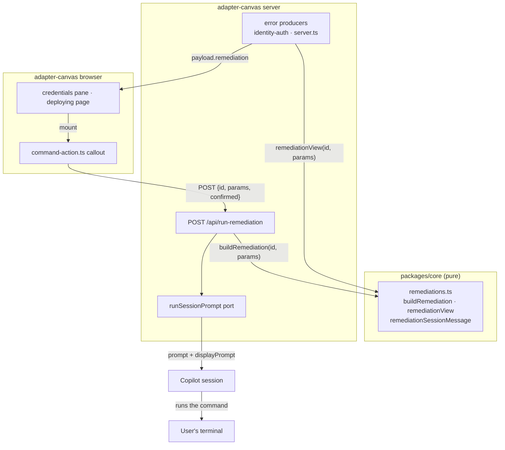

# Run-command actions on canvas warnings and suggestions

- **Author**: Will Tsai (@willtsai)
- **Date**: 2026-08

## Overview

Several Radius canvas surfaces stop and tell the user to go run a terminal
command: sign in to Azure CLI, sign in to AWS CLI, grant the GitHub CLI a
missing token scope, push the current branch. Today that instruction is prose
inside an error string. Two surfaces offer a **Copy command** button; none offer
to run anything. The user has to leave the canvas, find a terminal, paste, run,
come back, and re-check — for a command the canvas already knows verbatim.

This design turns those instructions into an action. It introduces a
**remediation**: a stable identifier plus structurally validated parameters that
resolve, through a single registry in `packages/core`, to the command to show,
the argv to run, an impact classification, confirmation copy, and the message
handed to the Copilot session. Warning surfaces attach a remediation to their
existing error payload, and a shared browser callout renders the command with
**Copy** and **Run with Copilot**.

The canvas never runs these commands itself. Every one of them is an interactive
CLI flow, and the loopback server would block for as long as the user took to
finish it. Execution is delegated to the Copilot session, which already owns the
terminal the user is working in.

## Terms and definitions

| Term             | Definition                                                                                                                                                                    |
|------------------|-------------------------------------------------------------------------------------------------------------------------------------------------------------------------------|
| Remediation      | A suggested terminal command, identified by a stable `RemediationId` and a validated parameter set, that the canvas can offer to run.                                         |
| Registry         | `packages/core/src/remediations.ts`: the single source of truth resolving an id plus parameters into a command, argv, impact, copy, and session message.                      |
| Remediation view | The flat, UI-agnostic projection of a remediation that travels in an error payload and drives the callout. Carries `runnable: false` plus a reason when the registry refuses. |
| Callout          | The shared browser affordance (`src/browser/command-action.ts`) rendering a command with Copy and Run with Copilot.                                                           |
| Impact           | `low` or `high`. High means the command mutates state beyond the click: a machine-wide active account, a granted token scope, or a remote write.                              |
| Hand-off         | Asking the Copilot session to run the command. The canvas owns the hand-off; it does not own the run.                                                                         |

## Objectives

> **Issue Reference:** [radius-project/ai-extensions#215](https://github.com/radius-project/ai-extensions/issues/215)

### Goals

- Every canvas warning or suggestion that names a terminal command offers to run
  it, without the user leaving the canvas.
- The command a user runs is rebuilt server-side from an identifier the server
  trusts, never from text a browser supplied.
- The affordance states honestly what it knows. The canvas cannot observe an
  exit status it did not produce, so it must not claim a success it did not see.
- A command that changes state the user did not ask about in this click takes an
  explicit second confirmation, and the server independently refuses without it.
- Copy keeps working everywhere, including when running is unavailable.

### Non-goals

- **Running commands in the canvas server.** Rejected on the same grounds
  recorded on `/api/verify-azure-login`: an interactive `az login` would block
  the loopback server indefinitely. Delegation is the design, not a shortcut.
- **Reporting the command's exit status.** The agent owns the terminal; the
  canvas has no channel to observe it. Surfaces that already re-check (Verify
  Credentials, GHCR Retry) are offered as the follow-up instead.
- **A general command runner.** Only the eight enumerated remediations exist. A
  new suggestion is a new registry entry with its own validation and copy.
- **Changing the prose.** Existing error strings keep naming their command, so a
  client that ignores the new field behaves exactly as before.
- **New canvas actions or tools.** No runtime declaration changes.

### User scenarios

#### User story 1

A user creates an Azure credential profile and clicks **Verify Credentials**.
Azure CLI is installed but has no session. Instead of only reading
`az login --use-device-code --tenant …`, the user sees the command with **Run
with Copilot**, clicks once, and watches the device-code flow appear in chat.
When it finishes, the callout points back at **Verify Credentials**.

#### User story 2

A user deploys from a branch that was never pushed. The deploying page shows
`git push -u origin feature-branch`. Because a remote write is high impact, the
first click asks again in place, naming what will change. The second click hands
it off. **Cancel** leaves the branch untouched and says so.

## User experience

**Sample input:** the user clicks **Run with Copilot** on the GHCR access
warning in the credentials pane.

**Sample output:** the callout replaces its run label with the confirmation
label and shows, in an alert region:

```text
gh auth switch --hostname github.com --user octocat && gh auth refresh --hostname github.com --scopes write:packages

  [ Copy ]  [ Switch and grant access ]  [ Cancel ]

  Switching the active GitHub CLI account changes it machine-wide for every
  tool that uses gh.
```

After the second click:

```text
  [ Copy ]  [ Ask again ]

  Copilot was asked to run this command. Follow it in the chat. Once it
  finishes, return to the Radius canvas and click Retry.
```

The states the callout can show are exactly the ones it owns: `idle`,
`confirming`, `sending`, `sent`, `failed`, `cancelled`. There is no "running"
and no "succeeded", because neither is observable from here.

## Design

### High-level design

An error producer no longer needs to know how a command is spelled. It names a
remediation. The registry resolves it. The route rebuilds it. The callout shows
it. Four components, one direction of trust.

### Architecture diagram



The browser sends `{ id, params, confirmed }` and nothing else that matters. The
route ignores any command text in the body.

### Detailed design

#### Option 1: extend `/api/azure-cli-assist` per surface

Copy the existing one-off — a bespoke route, a bespoke modal, a bespoke prompt —
for each new suggestion.

##### Advantages

- No new abstraction; each surface reads standalone.
- Smallest possible change for any single surface.

##### Disadvantages

- Eight commands means eight routes, eight modals, and eight prompt strings that
  drift. The command shown and the command run can diverge silently, which is
  precisely the class of bug a security-relevant path must not have.
- Validation is re-implemented per route, so one weak spot is enough.
- The impact distinction lives nowhere, so a remote write and a device-code
  login get the same single click.

#### Option 2: a browser-authored command sent to a generic runner

The browser posts the command text it rendered; the server runs whatever arrives.

##### Advantages

- Trivially extensible: a new suggestion needs no server change at all.
- One route, one component, no registry.

##### Disadvantages

- The server executes attacker-controllable text. A cross-site scripting foothold
  or a compromised page becomes arbitrary local command execution. Disqualifying
  on its own.
- Impact classification and confirmation copy would also be client-authored, so
  the guard rail moves to the side of the boundary that cannot be trusted.

#### Proposed option

A registry keyed by id, as diagrammed above.

**The registry (`packages/core/src/remediations.ts`).** Pure: no I/O, no DOM, no
process. `REMEDIATION_IDS` enumerates the eight commands the canvas knows:
`azure-cli-install`, `azure-cli-login`, `azure-subscription-set`,
`aws-cli-login`, `github-cli-login`, `github-packages-scope`,
`github-workflow-scope`, `git-push-branch`. `buildRemediation(id, params)`
returns a discriminated `{ ok: true, remediation }` or `{ ok: false, reason }`;
there is no partially valid result. Each remediation carries `displayCommand`
(presentation only), `argv` (a list of argument arrays — nothing is ever
composed into a shell string for execution), `cwd`, `impact`, confirmation copy,
and a follow-up sentence.

`remediationSessionMessage(remediation)` pairs the agent-facing `prompt` with
its timeline stand-in `displayPrompt` in one place, so the two cannot be swapped
or drift at a call site.

`remediationView(id, params)` is the projection that travels to a UI. When the
registry refuses, it still returns a complete view with `runnable: false` and
`unsupportedReason` set, so a surface never has to decide what a refusal looks
like and never renders an enabled button over a command that cannot be built.

Core is reached from the browser through a new `./remediations` export subpath.
The package barrel cannot be used: `assertBrowserSafe` in
`src/browser/build.ts` rejects a browser entry that transitively reaches Node
globals, and the barrel does.

**Parameter validation.** Parameters are structural identifiers only: a GUID for
tenant and subscription, the GitHub login grammar for an account, and git branch
safety for a ref. Free text never reaches an argv, and a credential value never
reaches a remediation at all. Optional parameters degrade rather than fail where
the command is still correct without them — an unreadable tenant yields
`az login --use-device-code`, which is the right command for that user. A
required parameter that fails validation refuses the whole remediation; an
unpushable branch name produces a disabled action with a stated reason rather
than a `git push` with a guessed ref.

**The route (`POST /api/run-remediation`).** Declared under a new `RouteOwner`
with the default `nonce-required` mutation policy. It parses `{ id, params,
confirmed }`, rebuilds through `buildRemediation`, refuses a high-impact
remediation whose `confirmed` is not exactly `true`, and hands
`remediationSessionMessage` to the injected `runSessionPrompt` port.

**The callout (`src/browser/command-action.ts`).** Split into a pure
`commandActionView()` projecting state onto exactly what the DOM shows, a
`commandActionSpecs()` producing element specs, and `createCommandAction()`
mounting them through the existing `dom.ts` builders and the browser ports.
Buttons are returned as separate specs rather than nested, because several
callouts can share a page and looking them up by document id would be ambiguous.
The handle exposes `render`, `state`, and `dispose`; `dispose` clears the
copy-reset timer, empties the host, and makes a late response a no-op, so a
surface teardown cannot leak a timer or repopulate a torn-down host.

The high-impact second confirmation is rendered **in place**, not in a modal.
`context.dialogs.confirm` fails closed in a host that sandboxes the canvas
without `allow-modals`, which would silently make the affordance unusable
exactly where it is riskiest.

### API design

`POST /api/run-remediation`

```json
{
  "id": "git-push-branch",
  "params": { "branch": "feature-branch" },
  "confirmed": true
}
```

| Status | Meaning                                            | Body                                                      |
|--------|----------------------------------------------------|-----------------------------------------------------------|
| `200`  | Handed to the session.                             | `{ "success": true, "id", "command", "message" }`         |
| `400`  | Malformed body, unknown id, or refused parameters. | `{ "error", "code": "remediation-unavailable" }`          |
| `409`  | High impact requested without `confirmed: true`.   | `{ "error", "code": "confirmation-required", "command" }` |
| `502`  | The session rejected the prompt.                   | `{ "error" }`                                             |
| `503`  | No session hook is registered.                     | `{ "error" }`                                             |

The `502`/`503` split is written from the session outcome rather than hard-coded,
matching `/api/azure-cli-assist`. Collapsing them would hide whether the canvas
could not reach Copilot at all or Copilot declined the turn.

Error payloads gain an optional `remediation` field holding a remediation view.
The prose in `error` is unchanged, so a client that ignores the field is
unaffected.

### Implementation details

#### Core package — packages/core

- New `src/remediations.ts` and collocated tests.
- New `./remediations` export subpath in `package.json`, re-exported from the
  barrel for server consumers. The subpath pin in the package-boundary
  functional test is updated alongside it.

#### Canvas adapter — packages/adapter-canvas

- New `src/server/routes/remediations.ts`, a new `RouteOwner`, a new entry in
  `SERVER_ROUTE_DECLARATIONS`, and composition-root wiring beside
  `createIdentityAuthRoutes`.
- `/api/azure-cli-assist` re-implemented on the registry with byte-identical
  request and response payloads.
- Producers attach `remediation`: the Azure login-required response in
  `server.ts`, the AWS verify error in `src/server/routes/identity-auth.ts`.
- New `src/browser/command-action.ts`.
- `src/browser/environment/credentials.ts` mounts a callout for the GHCR access
  warning and for Azure and AWS verify errors, replacing the bespoke copy row.
  `src/browser/deploying/page.ts` mounts one for the unpushed branch.
- `src/pages/environment/credential-form.ts` provides empty host elements
  (`cred-verify-action`, and the former GHCR command row) that the browser
  fills; `src/pages/deploying-page.ts` serializes `mutationNonce` into the
  deploying page state, which only the environment page carried before.

#### Committing generated files before a push — issue #478

`git-push-branch` is the one remediation whose advice was incomplete rather than
merely inert. A push publishes commits, not the working tree, so when the
generated Radius model is still uncommitted the branch that reaches the remote is
one the deploy workflow can check out but cannot read a model from.

The registry therefore accepts an optional `paths` parameter. When it is present
the remediation emits three argv arrays instead of one — `git add`, `git commit`,
`git push` — and a newline-joined `displayCommand`, and
`remediationSessionMessage` renders any remediation with more than one argv as a
fenced console block with an explicit instruction to stage only the named paths.
The branch is on `argv.length`, not on the id, so a future multi-command
remediation inherits the rendering.

When no paths are pending, the emitted command, wording, and prose are unchanged.
Naming a commit step for a clean tree would be wrong advice, not merely noisy.

Detection is server-side. `uncommittedGeneratedPaths()` in
`src/workspace.ts` asks `git status --porcelain -uall` about one generated root at
a time; a combined invocation would require column-parsing porcelain output, whose
significant leading space the shared git helper trims away. `deploy-dispatch`
receives it as an injected port and threads the result through `CanvasState` and
the deploy-status payload to the deploying page, which passes it back as the
`paths` parameter.

`paths` is validated differently from every other parameter. The others are
checked by shape — a GUID, a GitHub login, a branch — but a `git add` pathspec is
the one place a remediation names the filesystem, so `paths` is checked by closed
membership in `GENERATED_MODEL_PATHS`. A traversal, a glob, `.`, or a source path
has nothing to escape into because it is not in the set. Unrecognized entries are
dropped rather than refusing the remediation: the result degrades to a plain push,
which is still correct advice. Only a bad `branch` refuses outright, because that
is the one input the remediation cannot proceed without.

#### Build and packaging

No bundle, dependency, or plugin-packaging change. `plugins/radius/dist/extension.mjs`
is rebuilt from source as usual.

### Error handling

| Scenario                              | Behavior                                                                                                                                                                                    |
|---------------------------------------|---------------------------------------------------------------------------------------------------------------------------------------------------------------------------------------------|
| Registry refuses the id or parameters | The producer emits `runnable: false` with a reason; the callout renders Run disabled with that reason as its status and title, and Copy still works. The route independently answers `400`. |
| High impact without confirmation      | The callout asks in place and sends nothing. A client that skipped the step gets `409`.                                                                                                     |
| No Copilot session                    | `503` with the server's message, shown verbatim in the callout status, and Run becomes **Try again**.                                                                                       |
| Session rejects the prompt            | `502`, handled identically.                                                                                                                                                                 |
| Network unreachable                   | The callout logs through the logger port and reports that it could not reach the Radius server.                                                                                             |
| Response lands after teardown         | Dropped by the disposed callout; the host stays empty.                                                                                                                                      |
| The command itself fails              | Not observable here. The follow-up sentence names the canvas control that re-checks.                                                                                                        |

## Test plan

| Layer                  | Coverage                                                                                                                                                                     |
|------------------------|------------------------------------------------------------------------------------------------------------------------------------------------------------------------------|
| Unit (`packages/core`) | Every id, every parameter validator, the refusal path, view projection, and both message halves. 100%.                                                                       |
| Unit (route)           | Body parsing, refusal, the confirmation gate, and each dynamic status.                                                                                                       |
| Unit (browser)         | The pure view for every phase and the non-runnable case; the mounted handle's copy, run, confirm, cancel, failure, and dispose behavior. `src/browser/**` is pinned at 100%. |
| HTTP integration       | `test/integration/http/remediations.test.ts` against a real loopback server, plus the unchanged `/api/azure-cli-assist` contract.                                            |
| Browser component      | `test/component/run-command.test.ts` in real Chromium through the production `resolveBrowserContext`.                                                                        |
| Visual                 | VI-05 and VI-07 baselines.                                                                                                                                                   |

Two testing notes worth stating plainly rather than implying:

- **Mock Service Worker is not used at the component layer.** `msw` is not a
  dependency of this repository and the component configuration has never
  installed a worker. The network boundary is intercepted at the scope's own
  `fetch`, which is the same outward edge, and every request is asserted, so a
  request that escaped the callout fails the suite. Adopting `msw` repository-wide
  is a separate change.
- **The visual baselines are owned by the pinned Ubuntu runner.** The traceability
  note in `test/visual/phase-7-traceability.md` records that a local macOS or
  Windows comparison is expected to fail on rasterization alone, and it does here
  for untouched baselines too. The affected VI-05 and VI-07 PNGs must be
  regenerated through the **Canvas Functional Tests** workflow and reviewed;
  committing macOS renders would corrupt the reviewed set. The full visual suite
  passes locally under `--ignore-snapshots`, so the semantic guards still hold.

## Security

| Threat                                                                | Mitigation                                                                                                                                                                      |
|-----------------------------------------------------------------------|---------------------------------------------------------------------------------------------------------------------------------------------------------------------------------|
| A tampered or injected client names an arbitrary command              | The route rebuilds from the id through the registry and ignores command text in the body. Only the eight enumerated remediations can be produced.                               |
| A parameter smuggles shell metacharacters                             | Parameters are validated to structural identifier shapes before reaching an argv, and commands are argv arrays, never composed shell strings.                                   |
| A client smuggles an arbitrary `git add` pathspec                     | `paths` is validated by closed membership in `GENERATED_MODEL_PATHS`, not by shape. Traversals, absolute paths, globs, `.`, and source paths are dropped before reaching argv.  |
| A credential value leaks into a prompt or the UI                      | No remediation accepts a credential parameter. Prompts, display prompts, and callout text are built from the registry entry and validated identifiers only.                     |
| A destructive command runs on consent that was never obtained         | High impact fails closed server-side on `confirmed !== true`, independent of the UI, and the UI confirmation is rendered in place so a modal-suppressing host cannot bypass it. |
| Cross-origin or replayed mutation                                     | The route uses the default `nonce-required` mutation policy and requires `X-Radius-Mutation-Nonce`.                                                                             |
| A misleading affordance invites a user to trust an unverified outcome | The callout reports only hand-off states and never claims the command succeeded.                                                                                                |

## Compatibility

Additive. Error payloads gain an optional field; the prose is unchanged, so an
older client renders exactly what it did before. `/api/azure-cli-assist` keeps
its request and response byte-for-byte and is guarded by a contract test. The
deploying page's serialized state gains `browserMutationNonce`, which the
environment page already carried. No runtime declaration, tool, or action
changes, so the artifact registration inventory is untouched.

## Monitoring and logging

The callout reports transport failure through the existing logger port, which
reaches the host console. The route's distinct statuses are the diagnostic
surface: `400` means the registry refused, `409` means the confirmation gate
held, `502` means Copilot declined, and `503` means no session was reachable.
The hand-off itself is visible in the chat timeline as the `displayPrompt`, so a
user can always see what the canvas asked for on their behalf.

## Development plan

1. The registry in core, with its tests.
2. The route, its unit tests, and the HTTP integration suite.
3. `/api/azure-cli-assist` re-implemented on the registry behind its contract test.
4. Producers attach remediation views.
5. The browser callout.
6. Wiring the credentials pane and the deploying page.
7. The Chromium component suite.
8. Visual baselines, regenerated on the canonical runner.

Each step is independently reviewable and leaves the canvas working.

## Open questions

**Q: Should the workflow-scope and unpushed-branch remediations be threaded
through the server error strings that mention them?**
A: No, for now. Those commands are fully determined by information the browser
already holds — the scope is constant and the branch is in page state — so the
browser derives the view from the registry directly. Threading a structured
field through several layers of deep error strings would add coupling for no
additional trust: the route still rebuilds from the id either way. If those
strings later become parameterized, revisit.

**Q: Should the canvas poll for the command's outcome?**
A: Not in this change. The follow-up controls that already exist (Verify
Credentials, Retry) are the honest re-check. A polling design needs a channel
back from the agent that does not exist today.

**Q: Should `msw` be adopted for the component layer?**
A: Worth doing, but as its own change across the whole suite rather than
introduced by one test.

## Alternatives considered

Both alternatives are covered in Detailed design above. In summary: per-surface
one-off routes (Option 1) multiply the number of places where the command shown
and the command run can diverge, and put no impact distinction anywhere;
browser-authored commands (Option 2) hand arbitrary local execution to the least
trustworthy side of the boundary and are disqualifying regardless of ergonomics.

## Design review notes

- Confirmed with the requester: execution is always delegated to the Copilot
  agent. The canvas server never runs a remediation itself.
- Confirmed: every surface listed in the issue is wired, not a subset.
- Confirmed: the registry is keyed server-side by id, and command text supplied
  by a client is ignored.
