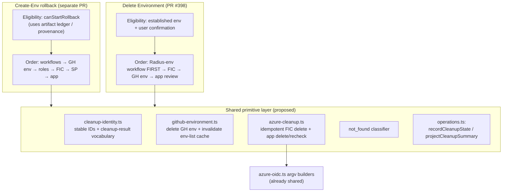
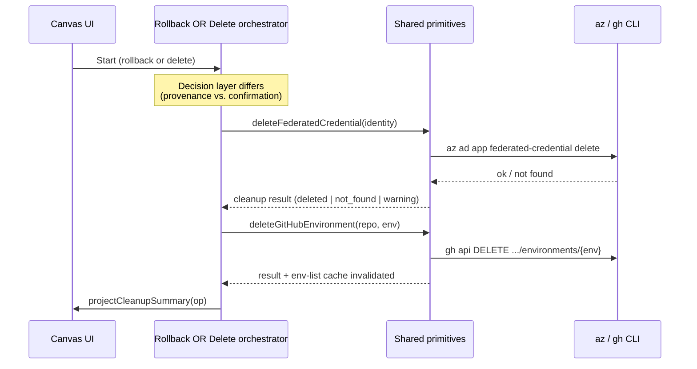

# Shared cleanup primitives for environment rollback and deletion

- **Author**: sk593 (@sk593)
- **Date**: 2026-08

## Overview

Radius has two flows that tear down the cloud and GitHub state behind an environment, and they were designed independently:

- **Create-Environment rollback** (proposed in a separate PR, and specified by the [durable Create Environment operation controls](./2026-08-environment-operation-controls.md) design) undoes a *setup that never finished*. If you start creating an environment and its credential verification never succeeds, rollback removes the things that half-finished attempt created.
- **Delete Environment** (PR #398, this branch) tears down an *established* environment — one that finished setup and shows up in your environment list.

These are genuinely different jobs with different rules, so we are keeping both. But they do a lot of the *same low-level work*: delete a GitHub environment, delete an Azure federated credential, delete an Azure app registration, treat a "not found" result as success, and report progress through the same operation panel. Today that shared work is written twice (or is about to be), in slightly different ways.

This document explains exactly where the two flows overlap, which pieces are safe to share, which pieces must stay separate, and a low-risk plan to converge on shared building blocks without merging the two flows into one.

## Terms and definitions

- **Environment** — a deploy target Radius manages. It maps to a GitHub environment plus the Azure identity (app registration, federated credentials) used to authenticate deployments.
- **Operation** — a long-running, tracked task (create or delete). Operations live in `packages/adapter-canvas/src/operations.ts`, survive an extension restart, and drive the progress panel in the canvas.
- **Stage / step** — an operation is a sequence of named stages (e.g. `delete_federated_credential`); each stage records human-readable steps.
- **Artifact ledger** — a record, saved on the *create* operation, of every cloud/GitHub artifact the attempt **created**, **reused**, or **deleted**. Defined as `SetupArtifactLedger` in `operations.ts`.
- **Provenance** — proof of *who created a resource*. Rollback uses the ledger as provenance: it only deletes artifacts the attempt proved it created.
- **Federated credential (FIC)** — the OIDC trust entry on an Azure app registration that lets a specific GitHub environment authenticate to Azure without a stored secret. Named `repo:<owner>/<repo>:environment:<env>`.
- **Idempotent / convergence** — running a delete twice is safe; a resource that is already gone ("not found") counts as success, not failure.
- **Fail-closed** — when we cannot prove it is safe to delete something, we stop rather than guess.

## Objectives

> **Issue Reference:** <https://github.com/radius-project/ai-extensions/issues/303>

### Goals

- Identify the exact code both flows can share, so we write each deletion primitive **once**.
- Keep the two flows' *decision-making* separate, because they answer different questions ("did this attempt create it?" vs. "is this an established environment the user confirmed deleting?").
- Land both PRs without one blocking the other, then converge in a follow-up.
- Preserve every existing safety rule (order of deletion, fail-closed behavior, user confirmation, `not_found` convergence).

### Non-goals

- **Merging the two flows into one.** Rollback and deletion have different entry conditions and are triggered from different UI states. Sharing primitives is not the same as sharing the flow.
- **Changing the deletion order of either flow.** The two orders differ on purpose (see Detailed design); this work must not "unify" them.
- **Adding role-assignment or service-principal deletion to Delete Environment.** That is governed by the established-environment deletion design and is out of scope here.
- **Making Delete Environment depend on creation provenance.** Older environments never recorded a ledger, so deletion must keep working without one. Consuming provenance *when present* is listed as an open question, not a goal.

### User scenarios (optional)

#### User story 1

A developer starts creating an environment. Credential verification fails. They click **Roll back setup**. Rollback deletes only the app registration, federated credential, and GitHub environment *that attempt created*, and leaves anything it reused alone.

#### User story 2

A developer has a working `dev` environment and clicks **Delete Env**. Deletion dispatches the delete-environment workflow (which needs the federated credential to authenticate), then removes the credential and the GitHub environment. The Entra app registration is **left in place** — it can be shared by other environments or callers — and the operation shows a notification telling the developer it was not deleted and that they can remove it in Azure themselves if they no longer need it.

## User experience (if applicable)

N/A — this is an internal refactor. Both user-facing flows keep their current behavior, progress panels, prompts, and messages. The only observable change is that both flows report cleanup outcomes through the same summary shape, so the wording of "deleted / already gone / left in place" becomes consistent between them.

## Design

### High-level design

Think of each flow as two layers:

1. A **decision layer** — "what should we delete, and are we allowed to?"
2. A **primitive layer** — "actually run the `az`/`gh` command to delete one thing, idempotently, and record the result."

The decision layer is where the two flows genuinely differ and must stay separate. The primitive layer is nearly identical and should be shared.

### Architecture diagram

The sequence below shows the primitive layer being the same calls in both flows, wrapped by different decision layers:

### Detailed design

The heart of this proposal is: **which layer does each piece of code belong to?** Below are the two realistic options for how much to share, followed by the recommendation.

#### Option 1: Keep the two flows fully independent

Leave rollback and deletion with their own copies of every primitive (GitHub-environment delete, FIC delete, not-found handling, progress reporting). App-registration delete lives only in rollback — the delete flow never removes the app registration.

##### Advantages

- Zero coupling; each PR ships and evolves on its own.
- No merge coordination between the two PRs.

##### Disadvantages

- The same `gh api DELETE .../environments/{env}` (now the shared `github-environment.ts:deleteGitHubEnvironmentIdempotent`) and the same idempotent FIC-delete logic would otherwise be written twice, and could drift.
- Two different "cleanup result" vocabularies means the UI reports "deleted / already gone / left in place" inconsistently between the flows.
- Bug fixes (e.g. a new "not found" phrasing from the CLI) must be applied in two places.

#### Option 2: Share the primitive layer, keep the decision layer separate

Extract the deletion primitives and the cleanup-result vocabulary into shared services. Each flow keeps its own eligibility check, its own deletion order, and its own policy, but calls the shared primitives to do the actual work and to report results.

##### Advantages

- Each primitive is written and tested once.
- One consistent cleanup-result vocabulary and summary across both flows, reusing the ledger machinery that already exists in `operations.ts` (`recordCleanupState`, `projectCleanupSummary`).
- Safety rules that live *in the primitive* (idempotent `not_found`, stable identity matching, cache invalidation) are guaranteed identical in both flows.

##### Disadvantages

- Requires a follow-up refactor and a little coordination, since both PRs touch `operations.ts`.
- A shared service must be carefully scoped so rollback's provenance assumptions do **not** leak into deletion's discovery-based flow.

#### Proposed option

**Option 2.** Share the primitive layer; keep the decision layer separate. This is also what the rollback proposal itself recommends: *share progress conventions and deletion primitives, but not an eligibility shortcut.*

Concretely, the following is **already shared today** and must not be re-implemented:

- **Operation framework** — `packages/adapter-canvas/src/operations.ts`: stages, steps, `requireInput`/`resumeAfterInput`/`canResumeInput`, `finish*`, `persistOperations`, restart recovery, `toClientView`, and the `OPERATION_KIND_CREATE` / `OPERATION_KIND_DELETE` markers.
- **The artifact ledger** — also in `operations.ts`: `SetupArtifactLedger` and friends, `recordCleanupState`, `projectCleanupSummary`. The create flow already writes this ledger (`server/routes/create-environment.ts`).
- **Azure argv builders** — `packages/adapter-canvas/src/azure-oidc.ts`: `buildAppDeleteArgs`, `buildFederatedCredentialListArgs`, `buildFederatedCredentialDeleteArgs`, `buildAppTagShowArgs`, `parseFederatedCredentials`, `federatedCredentialListUnreadable`, `selectMissingFederatedCredentials`. These are pure functions the delete flow already uses; rollback should import them rather than re-author `az` commands.

The following is **duplicated today (or about to be) and should be extracted**:

1. **Cleanup-result vocabulary + stable identity.** Delete (`server/services/environment-deletion.ts`) currently reports through its own `DeletionCommandResult` and free-text steps, and never feeds `recordCleanupState`. Rollback introduces a `cleanupArtifactIdentity` helper (stable IDs: app→appId, service principal→appId/objectId, FIC→`name@subject`, role→`role@scope`, GH env→`repo:env`, workflow→`branch:path`) and a cleanup-result record. Extract one `cleanup-identity.ts` and route the delete flow's outcomes through `recordCleanupState` / `projectCleanupSummary`.

2. **GitHub-environment delete + env-list cache invalidation.** *Extracted in PR #398.* The 404-tolerant `deleteGitHubEnvironmentIdempotent(repo, env, ports)` now lives in the shared `server/services/github-environment.ts` module (alongside the create-side `ensureGitHubEnvironment` primitive), taking an injected `runGh` and `invalidateEnvListCache` port. `server.ts` binds its `gh` runner and `envListCache` to it; the rollback runner binds its own ports to the same primitive so the "how a 404 becomes `not_found`" and "when the env-list cache is invalidated" rules are guaranteed identical.

3. **Idempotent federated-credential delete.** Both delete recorded/derived FICs with `buildFederatedCredentialDeleteArgs` + `runAz`, treating `not_found` as success. Only the *source* of the identities differs (delete: the per-environment `repo:...:environment:<env>` pattern; rollback: ledger entries). Extract a shared "delete these FIC identities" helper.

4. **App-registration delete + last-second recheck (rollback-only).** Only rollback runs `az ad app delete` via `buildAppDeleteArgs`, and only rollback re-lists the app's federated credentials *at confirm time* to catch "a credential was added while the prompt was open." The delete flow does **not** delete the app registration at all — it leaves it in place and notifies the user (see the deletion order below). This primitive therefore belongs to the shared `azure-cleanup` service but is invoked only by the rollback decision layer; extracting it keeps rollback's copy in one tested place without giving delete a code path to remove an app registration.

5. **`not_found` convergence classifier.** Delete has `server/services/delete-env-run-classifier.ts` plus `commandSucceeded` / `listNotReadable`. Rollback reimplements "az/gh not found ⇒ already gone." Extract one classifier.

The following **must stay separate** — sharing it would be a safety bug:

- **Eligibility / entry point.** Rollback = an *unverified* attempt with complete provenance (`canStartRollback`). Delete = an *established* environment plus live discovery plus explicit user confirmation. Sharing an eligibility shortcut would let rollback's provenance assumptions leak into deletion.
- **Deletion order — opposite for credentials.**
  - Rollback: workflows → GitHub environment → role assignments → federated credentials → service principal → app registration (backward along the dependency chain).
  - Delete: the Radius-environment delete workflow runs **first, while the federated credential still exists**, because the workflow authenticates to the cluster with that credential; only then is the credential removed, then the GitHub environment. The app registration is left in place (never reviewed or deleted). These orders are load-bearing and different on purpose.
- **Role assignments + service principal.** Rollback deletes them (it created them); established-environment delete does not touch them.
- **Workflow provenance / revert** (rollback-only: `workflow-provenance.ts`, `workflow-rollback.ts`). Delete *dispatches* the committed `delete-environment` workflow rather than reverting workflow files.
- **App-registration policy.** Rollback: provenance-gated auto-delete (delete only if the attempt created it). Delete: **never touched** — Radius records an informational "left in place" step and reminds the user (via an acknowledgement dialog on success) to remove it themselves in Azure if unwanted. Deleting a shared identity from under other environments or callers is never worth the risk.

### API design (if applicable)

N/A for the shared-primitive extraction — no HTTP route, canvas action, tool, or `packages/core` signature changes. The rollback flow introduces its own routes (`POST /api/operations/{operationId}/rollback`, `.../exit`, `.../retry/cleanup`) in its own PR; those are outside this document. The internal TypeScript service signatures introduced here (for example `deleteGitHubEnvironmentIdempotent(repo, env, ports)` and `cleanupArtifactIdentity(artifact)`) are module-local and not a public contract.

### Implementation details

#### Core package — packages/core (if applicable)

N/A. All of this lives in the canvas adapter. The primitives call `az`/`gh` and touch the operation store, which are adapter concerns; `packages/core` stays UI- and I/O-agnostic.

#### Canvas adapter — packages/adapter-canvas (if applicable)

New shared services under `src/server/services/`:

- `cleanup-identity.ts` — `cleanupArtifactIdentity(artifact)` returning the stable identity, plus the shared cleanup-result type. Delete's outcomes are mapped onto `recordCleanupState` / `projectCleanupSummary` (already in `operations.ts`).
- `github-environment.ts` — `deleteGitHubEnvironmentIdempotent(repo, env, ports)` (extracted in PR #398), co-located with the create-side `ensureGitHubEnvironment` primitive. `environment-deletion.ts` (via `server.ts` wiring) calls it today; the rollback runner binds its own `runGh` / `invalidateEnvListCache` ports to the same function.
- `azure-cleanup.ts` — idempotent FIC delete, plus a rollback-only app-registration delete + last-second recheck, built on the existing `azure-oidc.ts` builders and a `runAz` port. The delete flow calls only the FIC-delete primitive; the app-registration delete is invoked solely by the rollback runner.
- A shared `not_found` classifier, folding in `delete-env-run-classifier.ts`.

Refactor `environment-deletion.ts` and (in its PR) the rollback runner to call these services. Keep each flow's stage inventory (`buildDeleteStages` vs. the create/rollback stages) and order in the orchestrator, not in the primitives.

#### Shared adapter — packages/adapter-shared (if applicable)

N/A. The `runAz` / `runGh` execution ports already exist; no change to `packages/adapter-shared` is required.

#### Plugin — plugins/radius (if applicable)

N/A for behavior. The generated artifact at `plugins/radius/dist/extension.mjs` is rebuilt from source as usual; no hand edits.

#### Build & packaging (if applicable)

N/A. No new dependencies, exports, or bundle changes. A Changeset entry (`patch`) documents the internal refactor.

### Error handling

- Every primitive is idempotent: a `not_found` result from `az`/`gh` is recorded as convergence (already-gone), never a failure.
- A primitive that genuinely fails records a `warning` on its cleanup result and returns it; the orchestrator decides whether that warning is fatal. This preserves delete's current fail-closed rule: if the Radius-environment delete cannot be confirmed, the flow stops before removing the federated credential and GitHub environment that a retry needs.
- The rollback-only app-registration recheck fails closed: if re-listing credentials fails, or a credential reappeared while the prompt was open, the app is **left in place** with a warning rather than deleted. The delete flow always leaves the app registration in place regardless, so it never reaches this recheck.
- Because both flows report through `projectCleanupSummary`, a partial failure surfaces the same way in both UIs (a retryable partial-failure state).
- The delete flow's app-registration reminder ("left in place — remove it in Azure yourself") is surfaced when the operation **concludes** — `succeeded` or `succeeded_with_warnings` (the latter includes retained/shared-FIC cases). On a hard fail-closed stop (for example the Radius-environment delete could not be confirmed), the panel shows the steps completed so far plus a retry message and does **not** show the app-registration reminder, because nothing was fully torn down and the user has not reached the end of a deletion.

## Test plan

Per the repository code-quality skill, each extracted service ships with its own collocated unit tests, and each changed seam keeps its boundary tests:

- **Unit tests** for `cleanup-identity.ts` (identity for each artifact type, including missing-ID cases), `github-environment.ts` (deleted / 404-not-found / failed, and that the env-list cache is invalidated on the deleting paths), and `azure-cleanup.ts` (FIC delete idempotency; the rollback-only app delete gated on the recheck; recheck detects a credential added during the prompt).
- **Reuse existing tests.** `environment-deletion.test.ts`, `delete-env-run-classifier.test.ts`, and the `operations` tests already cover the delete flow's stages and `recordCleanupState`; the refactor must keep them green and move any relocated logic's tests with it.
- **Boundary tests.** Because the delete flow now reports through `recordCleanupState` / `projectCleanupSummary`, add/extend HTTP-integration coverage for the operation status the browser reads, and keep the artifact (built-extension) suite green after rebuilding `plugins/radius/dist`.
- **No coverage regression.** Changed production paths target 100% line/branch; the repo `coverage-baseline.json` floor must hold.

Testing challenges: the primitives do real `az`/`gh` I/O, so they are injected behind `runAz` / GitHub ports and tested with deterministic fakes — no live cloud or network access in pull-request tests.

## Security

- **Stable identity, never display text.** Every primitive matches resources by stable identity (app ID, `name@subject`, `repo:env`), never by friendly name, so a similarly named resource can never be deleted by mistake.
- **Fail-closed deletion.** When ownership, preconditions, or external state cannot be established, the primitive records a warning and the orchestrator stops rather than deleting speculatively. This matches the repository rule that destructive environment operations fail closed.
- **No secret exposure.** Cleanup results and the browser summary carry only safe detail — never tokens, secret values, or raw CLI output.
- **Argv, not shell.** All CLI calls pass an argument array (the existing `buildX...Args` builders); no user-controlled value is interpolated into a shell string.
- **App registration is never touched by the delete flow.** Delete Environment leaves the app registration in place and only notifies the user; it has no code path that removes an app registration. The `az ad app delete` primitive and its confirm-time recheck are exercised only by rollback, whose provenance ledger proves the attempt created the app.

## Compatibility (optional)

- **Backward compatible.** Delete Environment must keep working for environments created before the artifact ledger existed, so it continues to rely on live discovery + confirmation, not on provenance.
- **Coexisting PRs.** Both the rollback PR and PR #398 modify `operations.ts`. Recommended sequence: land them independently, then rebase one onto the other and finish the remaining extraction as a follow-up, so neither PR is blocked. PR #398 already extracts the shared GitHub-environment delete primitive (see Detailed design item 2), so rollback binds to it rather than re-authoring it.

## Monitoring and logging

Each primitive appends a human-readable step to the operation (`addStep`) and persists a structured cleanup result via `recordCleanupState`. `projectCleanupSummary` exposes the removed / kept / warning sets that the progress panel renders, so an operator can see exactly which artifact reached which outcome (`deleted`, `not_found`, `warning`, `skipped`) for both flows.

## Development plan

1. **Land both flows independently.** Delete Environment (PR #398) and the rollback PR ship on their own; they already share the operation framework, ledger, and Azure builders.
2. **Extract shared primitives.** In dependency order: `cleanup-identity.ts`, then `github-environment.ts` (delete primitive **done in PR #398**), then `azure-cleanup.ts`, then the shared `not_found` classifier. Each lands with unit tests.
3. **Route delete through the shared summary.** Map `environment-deletion.ts` outcomes onto `recordCleanupState` / `projectCleanupSummary`; update its tests and the HTTP-integration coverage.
4. **Refactor both orchestrators** to call the primitives, keeping order, eligibility, and policy in each flow. Rebuild `plugins/radius/dist` and keep the artifact suite green.
5. **(Optional, gated on the open question below)** teach delete to consume creation provenance when present.

## Open questions

- **Should Delete Environment consume creation provenance when it exists?** It could target artifacts precisely from the ledger when a create operation is still around, while falling back to live discovery for older environments. This is attractive but risks blurring the eligibility boundary — needs review.
- **One cleanup-result type, or a shared base with per-flow extensions?** Roles and service principals only appear in rollback. A single shared type keeps reporting uniform; a base type avoids rollback-only fields leaking into delete.
- **Where should the shared services live** — under `packages/adapter-canvas/src/server/services/` (proposed) or promoted toward `packages/adapter-shared` if a future non-canvas adapter needs them? Start in the canvas adapter; promote only if a second consumer appears.

## Alternatives considered

- **Merge rollback and deletion into a single flow.** Rejected: they have different entry conditions (unverified vs. established), different sources of truth (provenance vs. discovery + confirmation), and opposite credential ordering. A single flow would need so many branches that the safety rules would be hard to verify.
- **Do nothing (Option 1).** Rejected: guarantees drift between two copies of the same delete primitives and an inconsistent cleanup-result vocabulary across the two UIs.

## Design review notes

<!-- To be completed during design review. -->
