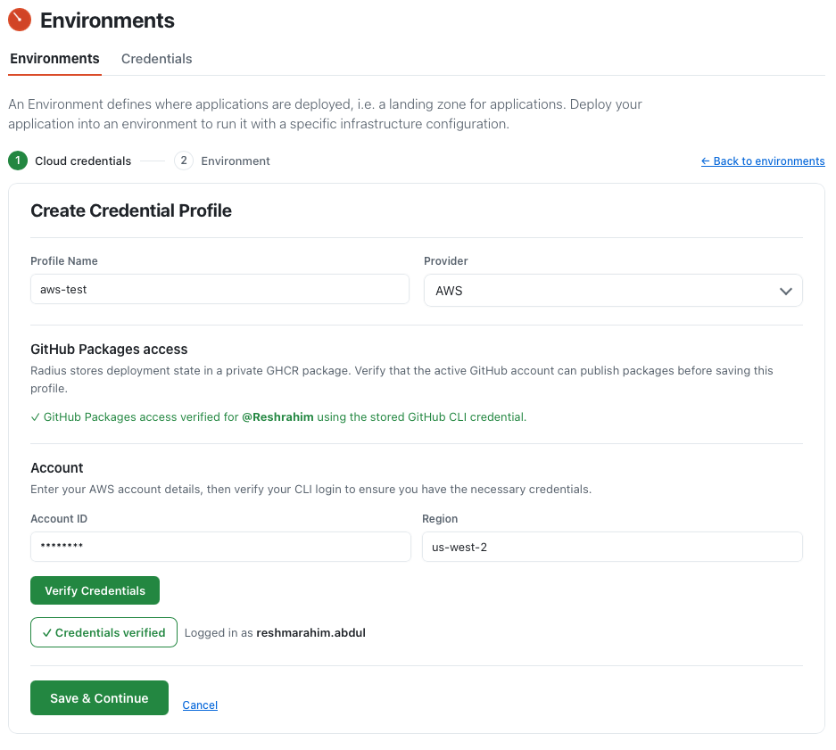
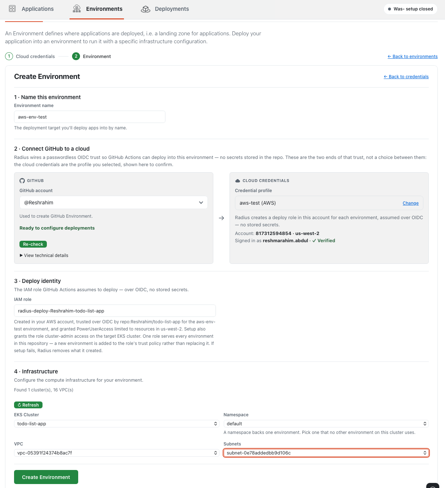

# Functional Spec : AWS support for the Radius Canvas extension

- **Author**: Reshma Abdul Rahim (@reshrahim)
- **Date**: 2026-09
- **Status**: Draft

## Overview

The Radius Canvas extension gives a developer a guided path from source code to a running application: connect a cloud account, create an environment, model the application, deploy it through GitHub Actions, inspect the resulting application graph, and tear it down. That path is available today for Azure and AKS.

This spec defines the equivalent capability for **AWS and Amazon EKS**. A developer whose platform runs on AWS completes the same journey, through the same screens, using AWS-native concepts: an AWS account and region instead of a subscription, an IAM role instead of an Entra app registration, an EKS cluster with a VPC and subnets instead of a resource group and AKS cluster, and AWS managed services instead of Azure ones.

Three principles shape the design.

**Passwordless by default.** No AWS credential is ever stored in the repository or in the extension. Discovery and verification run against the developer's own `aws` CLI session on their machine. Deployments authenticate through GitHub OIDC and short-lived role assumption. This matches the trust model already established for Azure.

**Recipe-driven provisioning.** AWS resources are provisioned by Radius recipes, published as an AWS recipe pack built in `radius-project/resource-types-contrib`. The deploy workflow applies that pack, and the application graph resolves against it. Where an application depends on a service the pack does not cover, modeling generates a resource type and recipe that live in the developer's own repository and are reviewed with the application.

**The canvas tells the truth.** Whatever the interface shows — the resource types in a planned graph, the console links on a deployed node, the consequences listed in a delete confirmation — matches what actually happens in the user's AWS account.

This document specifies the AWS capability functionally. [User experience](#user-experience) is the specification of what a developer sees, step by step, with a **Parity with Azure** inventory beside each screen stating what an Azure developer gets today and what the AWS experience requires. How it is built is out of scope here.

The screenshots are captures of a working AWS path built while writing this specification. They illustrate the requirements below; they do not define them.

## Terms and definitions

| Term            | Definition                                                                                                                                                                                                                              |
|-----------------|-----------------------------------------------------------------------------------------------------------------------------------------------------------------------------------------------------------------------------------------|
| Access entry    | The EKS object that grants an IAM principal access to the Kubernetes API. Without one, a role may see a cluster in AWS but cannot operate against it.                                                                                   |
| Auth mode       | An EKS cluster setting deciding who may grant access to it. Radius can grant the deploy role access on a cluster in `API` or `API_AND_CONFIG_MAP` mode; on a `CONFIG_MAP` cluster only its owner can, through the `aws-auth` ConfigMap. |
| Deploy identity | The identity GitHub Actions assumes when deploying. On Azure this is an Entra app registration, which spans every subscription in its tenant; on AWS it is an IAM role, which cannot leave its account.                                 |
| IRSA            | IAM Roles for Service Accounts. The EKS mechanism for granting pods an IAM identity through a projected token.                                                                                                                          |
| Projected token | The OIDC token mounted into the Radius control-plane pods so they can assume the AWS deploy role during a workflow run.                                                                                                                 |
| Recipe pack     | A `Radius.Core/recipePacks` resource mapping each Radius resource type to the recipe that provisions it. It determines whether a resource becomes an AWS managed service or a Kubernetes workload.                                      |
| Target cluster  | The user's own cluster that applications run on, distinct from the ephemeral k3d cluster hosting the Radius control plane during a workflow run.                                                                                        |

## Objectives

> **Issue Reference:** [#83 — Feature: Add support for deployment of resources to AWS](https://github.com/radius-project/ai-extensions/issues/83)

### Goals

1. **Zero-console onboarding.** A developer reaches a first deployment without opening the AWS console or hand-authoring IAM, whether the canvas creates the deploy role or the developer selects one their platform team prepared.
2. **Accurate representation.** Planned and deployed graphs show real AWS resource types, and resource nodes link to the AWS console.
3. **Complete lifecycle.** Environments and deployments can be deleted from the canvas, and cleanup removes what Radius created without disturbing what it did not.
4. **Parity with Azure.** The organizing principle behind the goals above. Every capability the canvas offers an Azure developer has an AWS equivalent, expressed in AWS-native concepts, or a recorded and justified reason it does not. The **Parity with Azure** table closing each step in [User experience](#user-experience) sets that step's capabilities against what an Azure developer gets today and what the AWS experience requires.
5. **No regression for Azure.** Azure behavior, copy, and workflows are unchanged.

**Definition of done.** Automated AWS cloud end-to-end coverage proves both identity paths. With a new role, it creates an environment, verifies credentials, deploys and deletes the reference application, deletes the environment, and confirms that no IAM role, access entry, or provisioned resource remains. With a selected existing role, it completes the same journey, confirms that the role remains, and confirms that only trust, permissions, and cluster access no remaining environment needs were removed. Catalog coverage deploys every shared Kubernetes type and every Tier 1 type to its AWS outcome, and generates and deploys a custom type for a service outside the catalog. A deployment is confirmed to resolve against the pack commit pinned in the repository manifest, not the newest published one.

### Non-goals

None of the following is needed for Azure parity, so none is in scope.

- Wiring an application to a backing service automatically, the AWS analogue of Azure workload-identity connections, would give each pod's service account an IAM role through IRSA. It is deferred on sequencing, not rejected.
- Adding services beyond the Tier 1 catalog to the built-in AWS pack. Dependencies outside the catalog remain deployable through custom resource-type generation where AWS can provision them.
- Compute outside EKS, such as ECS or Fargate, has no Radius execution model to target. Radius runs containers on Kubernetes and Azure Container Instances.
- Creating or reconfiguring infrastructure. The canvas discovers clusters and networks; it does not create EKS clusters, VPCs, or subnets, and does not change how an existing cluster is configured. Azure is the same — it does not create AKS clusters either.
- Editing a saved credential profile is out, since profiles are create-and-delete on Azure too. Region is the field most likely to justify changing that, and it changes for both clouds at once or not at all.
- Long-lived AWS access keys as a credential option are out. They regress the Azure baseline, which stores no cloud secrets.

### User scenarios

**MVP**

**Scenario 1 — Self-service onboarding.** Priya is a developer whose team runs on EKS and who holds IAM permissions in a development account. She opens the canvas in a repository containing a Dockerfile, creates an AWS credential profile from her existing CLI session, and runs the environment wizard. The canvas discovers her clusters, VPCs, and subnets, shows her exactly what it will create in her AWS account, creates the deploy role and cluster access, and deploys her application. She does not open the AWS console.

**Scenario 2 — Decommissioning.** Priya deletes her deployment, then her environment. The environment confirmation states what will be removed from AWS and what will be retained. A role Radius created is deleted when no other environment uses it. A role she selected from her account remains, while the trust, permissions, and cluster access Radius added for this environment are removed unless another environment still needs them.

**Scenario 3 — Platform-governed identity.** Sam works in an organization where only the platform team creates IAM roles. In the deploy identity section he chooses an existing role from the credential profile's AWS account. Before he confirms, the canvas shows the repository trust, AWS permissions, and EKS cluster access it will add. The role remains owned by his platform team: deleting the environment removes only what Radius added for that environment and never deletes the role.

### Dependencies

| Dependency                                                              | Nature                                                                                                                                                       | Impact if unmet                                                                                                                                                                                |
|-------------------------------------------------------------------------|--------------------------------------------------------------------------------------------------------------------------------------------------------------|------------------------------------------------------------------------------------------------------------------------------------------------------------------------------------------------|
| AWS CLI 2.15.3 or later on the developer's machine, with a live session | Required for discovery, verification, and identity setup. EKS access entries, which the canvas uses to grant cluster access, were added to the CLI in 2.15.3 | Reported when the profile is verified, so a profile is never saved that cannot go on to create an environment. The message names the installed version, the required one, and the upgrade link |
| A target EKS cluster the canvas is allowed to grant access to           | Required to set up an environment on that cluster                                                                                                            | The cluster cannot be chosen. It is listed as unusable at the point of selection, with the reason and the command its owner runs                                                               |
| A GitHub IAM identity provider in the AWS account                       | Required for passwordless role assumption. One provider serves every repository in the account. Environment creation creates it when absent                  | Only when the developer cannot create it: setup stops in `Authorize deploy identity` and hands over the `aws iam create-open-id-connect-provider` command for an IAM administrator to run      |
| Published AWS recipe pack in `radius-project/resource-types-contrib`    | Provides the Tier 1 and Kubernetes resource-type catalog, applied by the deploy workflow                                                                     | Deployment is unavailable; environment creation is unaffected, since the pack is applied at deploy                                                                                             |

## User experience

A developer arrives with source code in a repository and no environment. What follows is every screen between that and a running application on AWS, in the order they meet them.

1. **Model the application** — turn what is in the repository into an application definition.
2. **Connect an AWS account** — create and verify a credential profile.
3. **Create an environment** — name it, pick the cluster and network, name the deploy identity, and watch setup run.
4. **Review the application graph** — what the recipes will create, and what they did.
5. **Deploy** — through GitHub Actions, over OIDC.
6. **Delete** — the deployment, then the environment, with cleanup stated before it happens.

The AWS experience follows the canvas's existing information architecture. The top-level navigation remains **Applications**, **Environments**, and **Deployments**. Provider-specific behavior appears only where the underlying cloud concepts genuinely differ.

Every quoted string is copy the product renders, not a paraphrase. A **Parity with Azure** table closes each step, stating what an Azure developer gets today and what the AWS experience requires; [Deliberate non-parity](#deliberate-non-parity) collects the cases where the two clouds should differ, with the reason.

### Step 1 · Model the application

The developer starts with a repository and no environment. The canvas reads it and produces the model — the containers to run and the services they depend on.

Nothing here is AWS-specific. A dependency resolves to a **Radius resource type** — `Radius.Data/mySqlDatabases`, not Amazon RDS. Which cloud service ends up behind that type is decided later, by the environment. Everything generated lands in the repository beside the application definition and is reviewed in the same pull request.

| Dependency found in the application                     | What the developer gets                                                                   |
|---------------------------------------------------------|-------------------------------------------------------------------------------------------|
| Shared Kubernetes type                                  | The shared Radius type, deployed through the same Kubernetes recipe on both clouds        |
| Tier 1 backing service                                  | The standard Radius type, resolved at deploy to the cloud service in the catalog          |
| A service AWS can provision                             | A generated custom type whose recipe provisions the managed AWS service                   |
| A service AWS cannot provision, but the cluster can run | A generated custom type whose recipe runs the service on the cluster, labeled self-hosted |
| Anything else                                           | Named during modeling, with nothing generated for it                                      |

A dependency outside the catalog does not wait to be added to it. Modeling generates a custom type holding only the properties the application uses, with a recipe built on a published, versioned module where one matches the service and authored where none does. The developer is never asked to choose this path; it follows from the dependency found in their own source.

Where the cloud has no service to provision, the cluster is the fallback, and the result is never presented as a managed one: the graph, the generated recipe, and the pull request all state that the service runs on the cluster, so backups, availability, storage, and upgrades visibly belong to the developer. Two cases produce no artifact at all — a dependency needing durable storage the cluster cannot provide, and one neither cloud nor cluster can run. Both are named during modeling, and because the answer cannot change on a second run the developer is told it is permanent rather than offered a retry. Modeling stops for that resource, not for the whole application.

**Parity with Azure**

| Capability                                   | Azure today                                                                           | What AWS requires                                           |
|----------------------------------------------|---------------------------------------------------------------------------------------|-------------------------------------------------------------|
| Dependency outside the built-in catalog      | Generates a custom type, with an Azure Verified Module where one matches              | The same, with a published Terraform module                 |
| Service the cloud cannot provision           | RabbitMQ alone resolves to a Kubernetes recipe, as a catalog entry rather than a rule | The same fallback for any such service, labeled self-hosted |
| Dependency neither cloud nor cluster can run | Named during modeling, reported as permanent rather than retried                      | The same outcome                                            |

The fallback and its label are defined for both clouds, not for AWS alone. Azure reaches this outcome today only for RabbitMQ and does not say the service is self-hosted; it adopts the general rule and the label alongside AWS.

### Step 2 · Connect an AWS account

An environment has to deploy into some AWS account, in some region, and Radius has to know the developer can actually sign in to it. That is what a credential profile records. Cloud accounts are managed on the **Credentials** sub-tab, described as `Configure and manage the credentials needed to connect to your cloud account. Each environment requires credentials to deploy infrastructure.` Profiles are listed as `Profile Name | Provider | Status | Actions`, and each row offers **Create Env** and **Delete Profile**. An AWS profile shows the account's alias there, as an Azure profile shows the subscription's name, so the list reads as names rather than digits. The same form is reachable from step 1 of the New Environment wizard, with identical fields and only the footer buttons differing.

Choosing **AWS** reveals the AWS panel, which asks for two values — **Account ID** and **Region** — just as the Azure panel asks for a tenant and a subscription:

A profile says where resources live, not who may create them: it carries no deploy identity, exactly as an Azure profile records a tenant and subscription but never a client ID. Who may deploy is settled when an environment is created, and one identity serves the whole repository — as on Azure, where one app registration is reused across a repository's environments.

**Verify Credentials** confirms the developer is signed in, showing `Verifying authentication to AWS…` while it runs and `✓ Credentials verified` with the signed-in principal on success — the same pill and the same wording Azure uses, because it is the same check. It proves only that a session exists; whether that session can reach a cluster and deploy is answered when an environment is created. The button stays unavailable until both fields are filled, as Azure's does without a tenant and subscription, and if the session belongs to a different account than the one typed the developer is told so rather than discovering it later. With no session at all, the canvas offers `Sign in to AWS CLI`, which runs `aws sso login` on confirmation and notes that a machine using static credentials should run `aws configure` instead.

Saving unlocks only once both the cloud session and GitHub Packages access are verified; until then the form reads `Verify your credentials above to continue profile setup.`

### Step 3 · Create an environment

An environment is the deployment target: the cluster the application runs on, the network its services sit in, and the identity allowed to create them. Creating one is a two-step wizard of its own. Wizard step 1, `Cloud credentials`, is provider-neutral: the developer selects a verified profile from the **Credential profile** menu, or creates one inline.

Wizard step 2, `Environment`, has four sections. Sections 1 and 2 are identical across clouds; sections 3 and 4 are AWS-specific.

Section 1 takes the environment name, under `The deployment target you'll deploy apps into by name.`

Section 2, `Connect GitHub to a cloud`, is unchanged from Azure and states the model rather than offering a choice: `Radius wires a passwordless OIDC trust so GitHub Actions can deploy into this environment — no secrets stored in the repo. These are the two ends of that trust, not a choice between them: the cloud credentials are the profile you selected, shown here to confirm.` The GitHub side names the account (`Used to create GitHub Environment.`) and reports readiness; the cloud side confirms the selected profile, its account and region, and the signed-in identity.

#### Section 3 · Deploy identity

GitHub Actions cannot deploy into AWS without an identity it is allowed to assume. Section 3 is where the developer chooses that identity — a role Radius creates for the repository, or one a platform team already owns — and agrees to what it will be able to do. Azure's equivalent section names the app registration; the lead-in follows the provider — `The IAM role GitHub Actions assumes to deploy — over OIDC, no stored secrets.` It is one labeled field, **IAM role**, above help text stating the terms: Radius creates the role in the developer's account, trusts this repository and environment over OIDC, grants it permission to manage AWS resources in the selected region, and grants it administrative access to the target cluster. For an existing role, those same changes are previewed and applied without transferring ownership of the role to Radius.

The terms are stated in help text below the field, filled in with the repository, environment, and region as the developer enters them: `Created in your AWS account, trusted over OIDC by repo:<owner>/<repo> for the <environment> environment, and granted PowerUserAccess limited to resources in <region>. Setup also grants the role cluster-admin access on the target EKS cluster. One role serves every environment in this repository — a new environment is added to the role's trust policy rather than replacing it. If setup fails, Radius removes what it created.`

That text sets the developer's expectation: the role creates and manages resources across AWS services in its region, not only the ones this application declares, and its cluster access is administrative over the whole cluster, not the environment's namespace. A role that provisions databases and queues on a developer's behalf is disclosed where the choice is made, not in a confirmation that follows it.

The help text states two further facts. The region boundary exempts global services — IAM, STS, Route 53, and CloudFront — which the role reaches from any region. And an additional environment widens the role to another region and another cluster, not only to another trusted subject.

The default is a new role proposed as `radius-deploy-<owner>-<repo>`. The name is editable and a typed name is never overwritten — the field re-proposes only while it is empty or still holds the previous proposal. Because the name carries the repository and not the environment, editing the environment name leaves the role name alone.

The developer can instead pick an existing role from the profile's account. The picker lists roles the signed-in identity can inspect, identifies the repositories each already trusts, and pins the choice by ARN rather than by its editable name. Selecting a role is explicit consent to add this repository and environment to its trust, grant the AWS permissions the environment needs, and grant access to the selected EKS cluster; the canvas shows those changes before confirmation, and stops on any the signed-in identity cannot make, providing the action for the role's owner. Choosing a role disables the name field and is reversible until the environment is created.

*Selection, not name, authorizes reuse.* Typing the name of a role that already exists is never consent to modify it. Azure sets the precedent: it stops setup rather than rewriting an app registration encountered only because its name collides, and offers a `use an existing application…` link that pins the chosen one, disables the name field, is reversible through `Use a per-repo identity instead`, and warns that `Sharing one identity across repositories means every wired repository can use its Azure permissions. Only do this for repos that belong to the same product.` AWS applies the same rule to IAM roles.

**How far it reaches.**

| Cloud     | Deploy identity  | Belongs to | Environments are separated by         |
|-----------|------------------|------------|---------------------------------------|
| **Azure** | App registration | A tenant   | Subscription                          |
| **AWS**   | IAM role         | An account | Account, though several may share one |

Azure's identity sits one level above the boundary between environments: an app registration belongs to a tenant, a tenant contains every subscription, and environments are separated by subscription, so one registration reaches dev, staging, and production alike. An IAM role belongs to an account and cannot leave it. AWS's own guidance is an account per environment, which makes a role per environment the common shape — but several environments may share an account, and then they share a role: automatically for a Radius-created role, and by deliberate selection for any other. A second environment in the same account shows the role the repository already uses there rather than inviting a new name, so a repository never acquires a second role by accident. This is the one piece of parity AWS cannot deliver; everything Azure does *with* its identity carries over unchanged.

*One environment never disturbs another.* On Azure this is free, because each subscription holds its own role assignment and a new environment has nothing to displace. A shared AWS role instead carries the sum of what its environments need, recorded on the role itself — every repository subject trusted to assume it, every region it may act in, every cluster it can reach — so an operator reading the role in the console can see which environments depend on it and why.

| What the role carries  | Added                                              | Removed                                                  |
|------------------------|----------------------------------------------------|----------------------------------------------------------|
| An environment's trust | When that environment is set up                    | When that environment is deleted                         |
| Permission in a region | When an environment needing a new region is set up | When no environment on the role still names that region  |
| Access to a cluster    | When an environment on a new cluster is set up     | When no environment on the role still names that cluster |
| The role               | With the first environment in the account          | With the last, and only when Radius created it           |

A developer with `dev` in `us-west-2` who adds `staging` in `us-east-1` finds both still deploying: a second environment on a cluster another already uses finds the access it needs in place, deleting either leaves it for the other, and two environments set up at the same time both end up working.

#### Section 4 · Infrastructure

The environment needs somewhere to run and a network its services can reach. Section 4 reports what discovery found, as `Found 1 cluster(s), 16 VPC(s)`, and offers **↻ Refresh**. Cluster, namespace, VPC, and subnet selectors populate from the profile's account and region, and each accepts a typed value instead.

**EKS Cluster**, **Namespace**, **VPC**, and **Subnets** are all required. The namespace field carries `A namespace backs one environment. Pick one that no other environment on this cluster uses.`

Not every cluster in the account can be used. Some are configured so that only their owner can grant anyone access to them, and an environment cannot be set up on those from the canvas. Such a cluster still appears in the list, marked unusable and stating why, with the command its owner runs to change it. The developer meets this while choosing a cluster rather than after creating an environment, and can hand the command to whoever administers the cluster.

**VPC** and **Subnets** have no Azure counterpart. Most AWS managed data and messaging services are VPC-bound: Amazon RDS, ElastiCache, MSK, and DocumentDB are each created inside a VPC and need a subnet group spanning at least two availability zones, so their recipes need a VPC and subnets the canvas has nowhere else to get. The equivalent Azure services provision with public access and take every parameter from recipe context, which is why the Azure wizard asks for no network at all — [deliberate non-parity](#deliberate-non-parity), not a gap. Requiring both here keeps a VPC-bound service from failing mid-deployment, far from the field that caused it. Whether the wizard should ask for them at all, or derive them from the selected cluster, is [Q1](#step-3--creating-an-environment).

Four rules govern them.

- **The VPC defaults to the cluster's own.** A managed service is reached by the workloads that use it, so the cluster's VPC is the selection that works. Another VPC can be chosen, and the form says plainly that reaching it needs network routing the canvas does not create.
- **Subnets come from the selected VPC, and at least two availability zones.** A subnet group spanning two zones is what VPC-bound AWS services require, so two subnets in one zone is as incomplete as one subnet. The form states each subnet's zone, and does not accept a selection that resolves to a single zone.
- **Each subnet says whether it is public.** A database placed in a public subnet is a mistake a developer cannot see at selection time, so the form names it at the point of choosing rather than leaving it to be discovered later.
- **A typed value is checked the same way a chosen one is.** Typing a VPC or subnet covers the case where discovery has not returned, not a way around the rules above — an identifier from another account, region, or VPC is rejected at the field.

#### What happens when you click Create Environment

**Create Environment** is the only action the developer takes. The deploy identity, the GitHub environment, the committed workflow, and verification all follow from it, with the canvas reporting progress as it goes — no further prompt, and no step completed by hand.

Progress is reported through the canvas's existing three stages — `Authorize deploy identity`, `Configure environment`, and `Verify credentials`. `Authorize deploy identity` runs for both paths: it creates a new role or applies the confirmed changes to the selected role. Within that stage the developer sees, in order:

- The CLI version confirmed.
- The account's GitHub identity provider found, or created when the account has none.
- The subject the role will trust.
- The IAM role created or selected.
- The deploy permission policy attached, and the region restriction applied.
- The target cluster checked, and cluster access granted.

Two AWS objects carry the deploy identity, and only one of them belongs to this repository. The **IAM role** is created per repository and trusts this repository's workflows. The **identity provider** is the account-level object that makes AWS willing to accept a GitHub token at all — one per account, shared by every repository in it, and named as the principal in the role's trust policy. A role cannot be created before it exists.

Environment creation creates the provider when the account has none, rather than stopping to hand the developer a command. It is created once per account and is never deleted, because a later repository's role may come to depend on it. Deleting an environment says so: the provider is reported as retained, with that reason. Where the signed-in identity is not permitted to create it — the governed-account case — setup stops and hands over the command for an IAM administrator, as it does for a denied role creation.

`Configure environment` then commits `run-rad-commands-aws.yml`, and `Verify credentials` runs last.

A second environment in the same repository **and the same account** reports the shared role instead, as `Reusing the Radius-managed IAM role radius-deploy-contoso-storefront`, followed by `Keeping 1 subject(s) already trusted by this role` when the existing trust policy is widened rather than replaced.

Failures reuse the established pattern: a summary card titled `Setup didn’t finish`, resources grouped as created, retained, reused, cleaned, and requiring manual action, and an offer to roll back. A new role appears under created resources. A selected existing role appears under reused resources, and rollback covers only the trust, permissions, and cluster access Radius added during this setup.

#### Parity with Azure · creating an environment

| Capability                              | Azure today                                                                        | What AWS requires                                                                                                                |
|-----------------------------------------|------------------------------------------------------------------------------------|----------------------------------------------------------------------------------------------------------------------------------|
| What the wizard discovers for you       | Resource groups, AKS clusters, namespaces                                          | EKS clusters, namespaces, VPCs, subnets                                                                                          |
| Narrowing one choice by another         | Clusters filtered by resource group                                                | Subnets filtered to the selected VPC                                                                                             |
| Fields that take more than one value    | No equivalent input                                                                | Subnets, where more than one is required                                                                                         |
| What you must fill in before continuing | Resource group, cluster, and namespace                                             | Cluster, namespace, VPC, and subnets, all required                                                                               |
| What is created or changed in the cloud | App registration when needed, federated credential, and scoped role assignments    | IAM role when needed, repository trust, regional permissions, and EKS cluster access                                             |
| How many identities a repository gets   | One per repository, spanning every subscription in the tenant                      | One per repository **per account**; an IAM role cannot span accounts, so an account per environment means a role per environment |
| Adding an environment                   | Adds a federated credential to the same app, and cannot disturb the others         | Widens the shared role to the sum of what its environments need, rather than replacing what is there                             |
| Deleting an environment                 | Removes only that subscription's permissions                                       | Narrows the shared role to what the remaining environments still use                                                             |
| How a failure is summarized             | Created, retained, reused, cleaned, manual                                         | The same groups, populated with AWS artifacts                                                                                    |
| What can be rolled back                 | What setup added; a newly created app may be removed, while a selected app remains | What setup added; a newly created role may be removed, while a selected role remains                                             |
| What the GitHub environment records     | 7 values including location                                                        | 7 values including VPC and subnets                                                                                               |
| Minimum CLI version                     | None required                                                                      | AWS CLI 2.15.3 or later, checked before anything is created, because EKS access entries need it                                  |

### Step 4 · Review the application graph

Before deploying, a developer wants to know what will be created in their AWS account. The application graph answers that through `Modeled`, `Planned`, and `Diff` views, and the type on a node depends on which one. The matching question afterwards — what is actually running — is answered by the `Deployed` view, which only means anything once a deployment exists and so is described with deployment in Step 5. `Modeled` shows the Radius type the developer declared — `Radius.Data/mySqlDatabases` — the same on either cloud. `Planned` shows what the recipe resolves that to, per resource type rather than by a single rule: a database backed by Amazon RDS appears as `aws_db_instance`, a cache backed by ElastiCache or a stream backed by MSK as its own AWS type. Azure behaves the same way, showing `Microsoft.DBforMySQL/flexibleServers`. The graph is therefore where an application stops being portable in the abstract and becomes a specific set of AWS resources.

A recipe that provisions several AWS resources — an RDS instance alongside its subnet group and security group — shows the one the application depends on, and the rest appear in the node's details rather than as siblings. Every recipe names which of its resources that is, including a generated one.

The developer picks the application, branch, and environment, then deploys from this view. `The planned deployment is current.` confirms the graph reflects the branch as it stands. Planned nodes are drawn with a dashed border and deployed nodes with a solid, badged one, exactly as they are for Azure.

**Parity with Azure**

The renderer, the icon set, and the `Diff` views are provider-neutral and need no AWS-specific work — the icons already cover names such as `rds`, `ecr`, and `sqs`. Three things differ.

| Capability                            | Azure today                                                      | What AWS requires                                      |
|---------------------------------------|------------------------------------------------------------------|--------------------------------------------------------|
| Where the console link points         | Built from Azure resource IDs and types, with a cluster fallback | Built from the ARN                                     |
| Cloud resources in the details drawer | Only IDs starting `/subscriptions/`                              | ARNs recognized, so AWS resources appear in the drawer |

### Step 5 · Deploy

Deploying is the same act on either cloud. The developer deploys from the application view, sees `Deploying <app> to environment <env>` with `Track progress in the deployments list below.`, and tracks the run in the deployments list, where each row offers `Monitor Graph`, `View Run`, and `Delete Deployment`.

On success the log closes with `🎉 Deployment complete! Application deployed to AWS.` followed by `Click on deployed resources to view them in the AWS Console.`

Once a deployment finishes, the `Deployed` view shows the application as it now runs in that environment, introduced as `The deployed application graph depicts the selected application as it is currently deployed and running in a given environment.` Before a first deployment there is nothing to show, and the view says so — `Not deployed yet — showing the modeled application.` — then renders the modeled topology so the developer sees what they are about to deploy rather than an empty panel.

The distinction matters more on AWS than it looks. The types in that fallback are resolved from the recipe pack rather than read from the account, so the database below is typed `aws_db_instance` before any database exists. The notice is what keeps that honest: the same node means *this is what the recipe will create* under the notice and *this exists in your account* without it. A node in the fallback carries no console link, because there is nothing yet to link to.

Deployed AWS resources link to the AWS console from both the node and the details drawer. The drawer link reads `View in AWS console` and a node's accessible label reads `Open <resource> in AWS console`, mirroring the Azure portal links available today — the console is derived from the destination URL rather than from a provider field, so the right name follows the right link automatically.

AWS resources identified only by an ARN appear as cloud rows in the details drawer. A resource the canvas can place in the console links straight to it; one it cannot links to the console's resource search, carrying the ARN. A link is never fabricated, because a link that lands on the wrong page is worse than no link.

AWS deployments require no new controls, and failures caused by identity or cluster access name their specific cause rather than reporting a generic workflow failure. What a deployment can *contain* is not provider-neutral, and is set out below.

**Parity with Azure**

| Capability                              | Azure today                                                                                         | What AWS requires                                                                                      |
|-----------------------------------------|-----------------------------------------------------------------------------------------------------|--------------------------------------------------------------------------------------------------------|
| The workflow that runs                  | `run-rad-commands-azure.yml`                                                                        | `run-rad-commands-aws.yml`                                                                             |
| How the workflow reaches the repository | Published during setup                                                                              | The AWS workflow published the same way                                                                |
| Watching the run                        | Provider-neutral                                                                                    | The same views, unchanged                                                                              |
| The closing message                     | `🎉 Deployment complete! Application deployed to Azure.`                                            | `🎉 Deployment complete! Application deployed to AWS.`                                                 |
| When identity has drifted               | Names the federated credential or role assignment                                                   | Names the trust policy or permissions                                                                  |
| What verification proves                | Proves login, subscription visibility, and diagnoses enterprise-claim mismatch (`verify-azure.yml`) | Login, EKS access, and GHCR push proven separately, with cluster access asserted only once established |
| A deployment that outlives its token    | Token refreshed by the Azure login action                                                           | The projected token refreshed, so a long deployment does not fail on an expired token                  |

#### Dependency · what each type deploys to

The recipe pack decides which AWS service stands behind each Radius type. The pack is not attached to the environment when the environment is created; the deploy workflow applies it, so the pack and the Radius environment resource are established on the first deploy and re-applied on every one after it.

Which version applies is pinned by the repository, not by the environment: the branch records the pack version it was validated against. Two developers deploying the same branch therefore get the same infrastructure, and a new pack release cannot change a running application until that record is updated and reviewed like any other change to the repository.

The [ranked resource-type catalog](https://github.com/Reshrahim/radius/blob/1b537e91f7d3e0c4f934c8ee48825acc317506a6/eng/design-notes/extensibility/2026-05-radius-resource-types-recipes/resource-type-ranked-catalog.md#tier-1-build-first) names the ten backing services included in the first release.

| Rank | Developer dependency | Radius resource type              | Azure outcome                | AWS outcome           |
|------|----------------------|-----------------------------------|------------------------------|-----------------------|
| 1    | PostgreSQL           | `Radius.Data/postgreSqlDatabases` | PostgreSQL Flexible Server   | Amazon RDS PostgreSQL |
| 2    | Redis                | `Radius.Data/redisCaches`         | Azure Managed Redis          | Amazon ElastiCache    |
| 3    | Object storage       | `Radius.Storage/objectStorage`    | Storage Account              | Amazon S3             |
| 4    | LLM inference API    | `Radius.AI/models`                | Azure OpenAI                 | Amazon Bedrock        |
| 5    | MongoDB              | `Radius.Data/mongoDatabases`      | Cosmos DB, Mongo API         | Amazon DocumentDB     |
| 6    | MySQL                | `Radius.Data/mySqlDatabases`      | MySQL Flexible Server        | Amazon RDS MySQL      |
| 7    | Kafka                | `Radius.Messaging/kafka`          | Event Hubs, Kafka-compatible | Amazon MSK            |
| 8    | Search               | `Radius.AI/search`                | Azure AI Search              | Amazon OpenSearch     |
| 9    | RabbitMQ             | `Radius.Messaging/rabbitMQ`       | Kubernetes recipe            | Amazon MQ             |
| 10   | SQL Server           | `Radius.Data/sqlServerDatabases`  | Azure SQL Database           | Amazon RDS SQL Server |

The shared Kubernetes set is `Radius.Compute/containers`, `containerImages`, `persistentVolumes`, `routes`, and `Radius.Security/secrets`. These resolve through the same Kubernetes recipes on both clouds, so an application using only these types moves between AKS and EKS unchanged, subject to what each cluster provides — a route needs an ingress controller, a volume needs a storage class.

**Parity with Azure**

| Capability                        | Azure today                                      | What AWS requires                                  |
|-----------------------------------|--------------------------------------------------|----------------------------------------------------|
| Built-in backing-service coverage | Every Tier 1 Radius type                         | Every Tier 1 Radius type                           |
| Pack distribution                 | One published, versioned Azure pack              | One published, versioned AWS pack                  |
| When the pack is applied          | By the deploy workflow, on every deploy          | The same                                           |
| Which version a deploy uses       | The commit pinned in the repository's manifest   | The same, pinning the AWS pack                     |
| Shared Kubernetes types           | Containers, images, volumes, routes, and secrets | The same types through the same Kubernetes recipes |

### Step 6 · Delete

A developer tearing down work needs to know what leaves their AWS account and what stays behind. Deleting a deployment uses the existing three-step confirmation — intent, acknowledged effects, and typing `<app>/<environment>` to confirm — preceded by a list of resources to be deleted. It is provider-neutral and unchanged, and benefits from the same accurate resource types as the graph. Where resources are left in a non-terminal state, force delete remains available with its existing warning about orphaned external resources.

Deleting an environment states the AWS consequences before the developer confirms. It names the cluster the environment is removed from, the trust removed from the role, any region or cluster access no remaining environment needs, and whether the role itself is deleted or retained. If applications remain in the environment, deletion is blocked and names the applications the developer deletes first.

Deleting an environment removes it from the role, then narrows what the role carries to what the environments still on it need — the region and the cluster access go only if no remaining environment names them. The role itself is deleted only when Radius created it *and* removing this environment leaves no environment on it at all, from this repository or any other. A role selected through the picker is never deleted, however many environments remain. The account's GitHub identity provider is always retained, including one Radius created, because every repository in the account depends on it. Where ownership or shared use cannot be established, the object is retained and reported as requiring manual action rather than removed on an assumption.

**Parity with Azure**

| Capability                                  | Azure today                                    | What AWS requires                                                                                                               |
|---------------------------------------------|------------------------------------------------|---------------------------------------------------------------------------------------------------------------------------------|
| The workflow that deletes an application    | `delete-azure.yml`                             | `delete-aws.yml`                                                                                                                |
| The workflow that deletes an environment    | `delete-environment-azure.yml`                 | `delete-environment-aws.yml`                                                                                                    |
| Deleting an environment that still has apps | Blocked until the applications are deleted     | The same guard, unchanged                                                                                                       |
| What happens to the deploy identity         | Deletes the environment's federated credential | Removes what this environment added; deletes a Radius-created role only when unused, and never deletes a selected existing role |
| What you are told afterwards                | Names the federated credential removed         | A message conditional on what was actually removed, rather than a fixed statement of retention                                  |

### Deliberate non-parity

| Azure capability                       | Why AWS does not mirror it                                                                                                              |
|----------------------------------------|-----------------------------------------------------------------------------------------------------------------------------------------|
| Resource group as a grouping scope     | AWS has no equivalent container. Region and VPC carry the equivalent meaning and are already surfaced.                                  |
| Workload-identity connections          | Radius has no AWS equivalent, and an access-key pattern would contradict the passwordless principle.                                    |
| Enterprise app-registration governance | Immutable subjects and service-management references are Entra-specific. AWS governance is expressed by permissions boundaries instead. |

The reverse case — where AWS asks for something Azure does not — occurs once, and is equally deliberate.

| AWS input       | Why Azure has no equivalent                                                                                                                                                                                                                                                                                                             |
|-----------------|-----------------------------------------------------------------------------------------------------------------------------------------------------------------------------------------------------------------------------------------------------------------------------------------------------------------------------------------|
| VPC and Subnets | AWS managed data and messaging services are VPC-bound and need a subnet group spanning at least two availability zones, so their recipes require a VPC and subnets the canvas cannot infer. The Azure equivalents provision with public access and take no network input. See [Section 4 · Infrastructure](#section-4--infrastructure). |

## Error handling

Each condition carries its own remediation rather than being folded into a generic failure, and they are grouped by where in the journey the developer meets them. Several are not the developer's to fix: where a permission they do not hold is required, the message names the command and is written to be handed to whoever does.

**Step 1 · Modeling the application**

| Condition                                                    | What the developer is told                                                          |
|--------------------------------------------------------------|-------------------------------------------------------------------------------------|
| A dependency AWS cannot provision and the cluster cannot run | Named, with nothing generated for it, and reported as permanent rather than retried |
| Nothing deployable is found in the repository                | Said plainly, rather than producing an empty model                                  |

**Step 2 · Connecting an AWS account**

| Condition                                          | What the developer is told                                                                                                                                                                   |
|----------------------------------------------------|----------------------------------------------------------------------------------------------------------------------------------------------------------------------------------------------|
| No AWS CLI session                                 | `No active AWS CLI session. Run "aws configure" (or "aws sso login") in your terminal, then click Verify again.` The `Sign in to AWS CLI` remediation offers to run `aws sso login` for them |
| Signed-in account differs from the profile account | Reported on the credential form before the developer proceeds, naming both accounts                                                                                                          |
| Account ID or region is not a valid value          | Named at the field, before verification runs                                                                                                                                                 |
| A profile is deleted while environments use it     | Deletion names those environments and does not proceed; deleting a profile never touches anything in AWS                                                                                     |

**Step 3 · Creating an environment**

Most failures land here, because this is where Radius first writes to the developer's account.

| Condition                                                           | What the developer is told                                                                                                                                                                                                                             |
|---------------------------------------------------------------------|--------------------------------------------------------------------------------------------------------------------------------------------------------------------------------------------------------------------------------------------------------|
| AWS CLI older than 2.15.3                                           | `AWS CLI 2.7.31 is installed, which cannot grant the deploy role access to an EKS cluster. Radius needs AWS CLI 2.15.3 or newer, the first release with EKS access entries.` alongside `Upgrade the AWS CLI, then retry:` and the install link         |
| AWS CLI cannot be run                                               | `Could not run the AWS CLI:` followed by the CLI's own output, and the same upgrade link                                                                                                                                                               |
| Identity provider creation denied by IAM                            | Names the account, states that the GitHub identity provider is missing and could not be created by the signed-in identity, and hands over the `aws iam create-open-id-connect-provider` command for an IAM administrator to run                        |
| Identity provider created concurrently by another setup             | The existing provider is used and setup continues. Two environments created at the same time in one account never collide over it                                                                                                                      |
| Cluster grants access through `aws-auth` rather than access entries | `Cluster <name> uses CONFIG_MAP authentication, which does not support access entries. Radius grants cluster access through an access entry, so it cannot authorize the deploy role on this cluster.` with the `aws eks update-cluster-config` command |
| Role of the expected name is not Radius-managed                     | Names the matching role, says that no change was made, and offers the two valid paths: select that role explicitly through the picker or choose a different name                                                                                       |
| Ownership of a same-named role cannot be established                | Named, with what could not be established, and setup stops rather than guessing whether Radius created it                                                                                                                                              |
| Identity creation denied by IAM                                     | `The signed-in AWS identity is not permitted to create IAM roles.` with a choice to return and select an existing role or hand the denied action to an IAM administrator                                                                               |
| Selected role cannot be updated                                     | Setup names the trust, permission, or cluster-access change that was denied and leaves the role as it was before setup began                                                                                                                           |
| Two environments are set up at the same time                        | Both finish, and neither displaces the other on the shared role                                                                                                                                                                                        |
| Identity creation partially succeeds                                | The existing partial-state summary, with rollback offered; created objects are named rather than silently retained                                                                                                                                     |
| Discovery is denied, or returns nothing                             | Each list says whether it is empty because the account holds none or because the signed-in identity cannot read them, and offers a typed value meanwhile                                                                                               |
| No two subnets in different availability zones                      | Named against the chosen VPC, since a VPC-bound service cannot be placed in it as it stands                                                                                                                                                            |
| A typed cluster, VPC, or subnet does not fit the selection          | Rejected at the field, naming whether it belongs to another account, another region, or another VPC                                                                                                                                                    |
| Namespace already backs another environment                         | Named at the field with the environment already using it                                                                                                                                                                                               |
| The GitHub environment or workflow cannot be written                | Named as the stage that failed, separately from anything created in AWS, so it is clear which cloud the failure is in                                                                                                                                  |
| Any setup stage fails for a reason Radius does not recognize        | The stage is named alongside AWS's own output — `Failed to update the role's trust policy:`, `Failed to attach the deploy permission policy:`, `Failed to create the cluster access entry:` — rather than a generic setup failure                      |

**Step 4 · Reviewing the application graph**

| Condition                                                | What the developer is told                                                                                                                                                                        |
|----------------------------------------------------------|---------------------------------------------------------------------------------------------------------------------------------------------------------------------------------------------------|
| The branch carries no model yet                          | `No application model exists yet.` with the offer to create one, rather than an empty graph                                                                                                       |
| The model does not compile                               | `Application model compilation failed.` with the compiler's own output, so the failure is attributable to a line in the repository rather than to the environment                                 |
| The repository cannot be modeled at all                  | `The repository cannot be modeled.` — the permanent outcome from modeling, repeated here rather than presented as a graph error                                                                   |
| The graph cannot be drawn                                | `The application graph could not be rendered. Reload the graph to try again.` and `The graph library failed to load. Reload the graph to try again.`, separating a data failure from a client one |
| A recipe in the pack has no known AWS resource behind it | Reported as a note on the graph naming the unmapped recipes, so a node shown without a concrete AWS type is explained rather than silently generic                                                |
| The deployed view cannot be read from the environment    | Named as a failure to read deployment state, and the view falls back to the modeled topology under its notice rather than claiming nothing is deployed                                            |

**Step 5 · Deploying**

| Condition                              | What the developer is told                                                                                             |
|----------------------------------------|------------------------------------------------------------------------------------------------------------------------|
| Projected token expires mid-deployment | Attributed to token expiry rather than a generic permission error, naming the stage it reached                         |
| A recipe fails part way through        | Names the resource and leaves what was provisioned visible in the graph rather than reporting only that the run failed |
| Identity has drifted since setup       | Named as the trust, permission, or cluster access that is now missing, rather than as a generic denial                 |

**Step 6 · Deleting**

| Condition                                             | What the developer is told                                                                    |
|-------------------------------------------------------|-----------------------------------------------------------------------------------------------|
| Ownership of an identity object cannot be established | The object is named under manual actions, with what could not be established                  |
| Cleanup partly fails                                  | What was removed and what remains are listed separately, with the remainder offered for retry |
| The role is already gone                              | Reported as already absent and deletion continues                                             |

However a step fails, three rules hold.

- **Nothing is created until every check that can fail for free has passed.** A developer acting on a refusal never has to undo something Radius made on the way to it.
- **What Radius cannot prove it owns, it does not touch.** It names the object and says what it could not establish, rather than modifying or deleting it on an assumption.
- **A refusal hands back what it was about to do.** Where a policy would have been written, the policy is returned; where a command resolves the problem, the command is given. Nobody is asked to reconstruct Radius's intent from a description of it.

**Parity with Azure**

| Capability             | Azure today                      | What AWS requires                                                     |
|------------------------|----------------------------------|-----------------------------------------------------------------------|
| CLI not signed in      | `azure-cli-login`                | `aws-cli-login`, which runs `aws sso login`                           |
| CLI not installed      | `azure-cli-install`              | An AWS CLI install remediation                                        |
| CLI too old            | Not applicable                   | An upgrade remediation, since AWS alone carries a minimum CLI version |
| Wrong scope selected   | `azure-subscription-set`         | A region and profile selection remediation                            |
| Identity misconfigured | Diagnosed by the verify workflow | Access-entry and trust-policy remediations                            |

## Open questions

Each question below changes something the developer sees. They are grouped by where in the journey that happens.

### Step 3 · Creating an environment

- **Q1.** Should the wizard ask for **VPC** and **Subnets** at all, or derive them from the selected cluster? The two halves resolve differently, which is why it stays open.
  - **VPC — derivable.** Co-locating a managed service in the cluster's own VPC is the recommended pattern, and the cluster reports its VPC directly.
  - **Subnets — not safely derivable.** A cluster reports *all* its subnets, and common layouts register public and private subnets together, so naive derivation risks placing a database in a **public** subnet. Deriving correctly means identifying private subnets by route table and saying so clearly when a VPC has none.

  Dropping the VPC field while still asking for subnets is one possible middle position.

- **Q2.** Creating the account's GitHub identity provider removes this obstacle for a developer who holds IAM permissions, but not for one who does not: they still complete the wizard, click **Create Environment**, and only then learn the account is missing an object an IAM administrator must supply. Whether the canvas should check for it earlier — when the credential profile is verified, where the AWS account is already known — is open. Checking earlier costs a call on every profile verification and reports a problem most developers never hit.

### Step 6 · Deleting

- **Q3.** An environment is deleted outside the canvas, or its AWS objects are removed by hand, and Radius never sees it. Deleting a sibling environment stays safe — the role is read rather than remembered, so a stale trust subject holds its region and cluster access in place — but the developer is not told that the environments list and the role have diverged. Whether the list should surface that, and how, is open.
