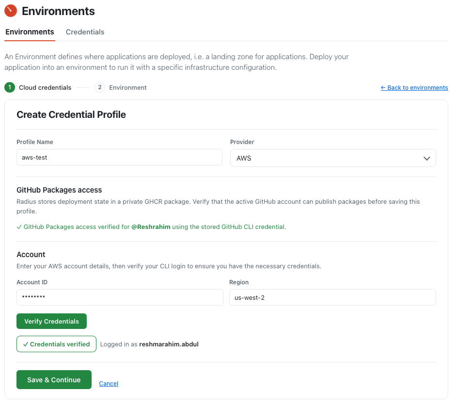
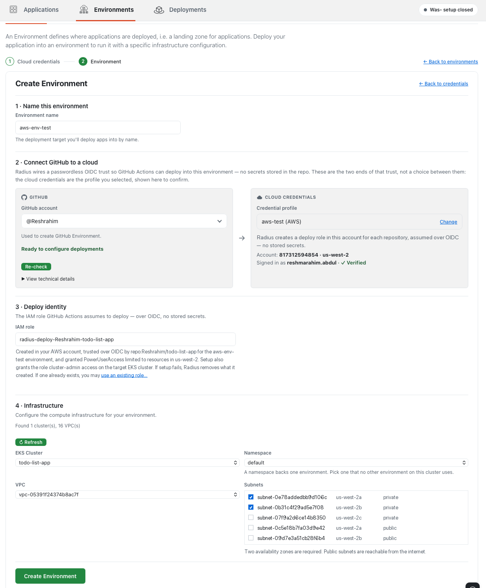
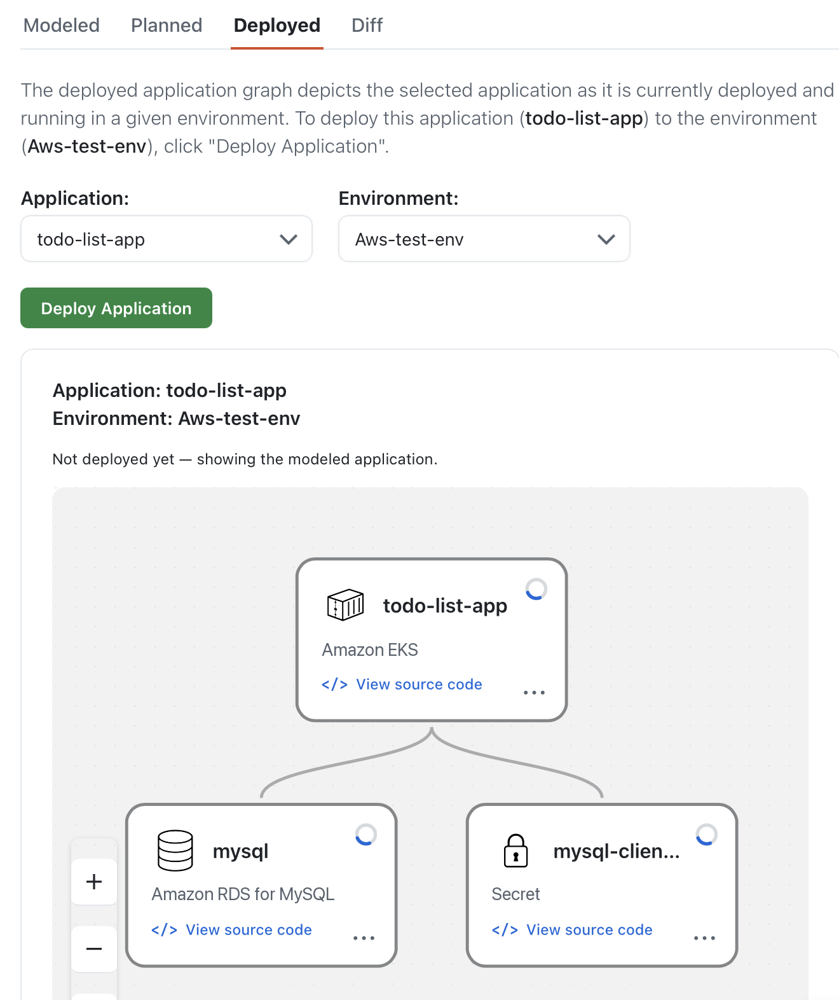

# Functional Spec : AWS support for the Radius Canvas extension

- **Author**: Reshma Abdul Rahim (@reshrahim)
- **Date**: 2026-09
- **Status**: Draft

## Overview

The Radius Canvas extension gives a developer a guided path from source code to a running application: connect a cloud account, create an environment, model the application, deploy through GitHub Actions, inspect the application graph, and tear it down. That path exists today for Azure and AKS.

This spec defines the same capability for **AWS and Amazon EKS**. A developer on AWS completes the same journey through the same screens, in AWS-native terms: an account and region instead of a subscription, an IAM role instead of an Entra app registration, an EKS cluster with a VPC and subnets instead of a resource group and AKS cluster, and AWS managed services instead of Azure ones.

Three principles shape it.

**Passwordless by default.** No AWS credential is stored in the repository or in the extension. Discovery and verification run against the developer's own `aws` CLI session. Deployments authenticate through GitHub OIDC and short-lived role assumption. This is the trust model Azure already uses.

**Recipe-driven provisioning.** AWS resources are provisioned by Radius recipes, delivered as a published AWS recipe pack. Licensing requires those recipes to be written in Bicep, which is also what the Azure pack uses.

**Parity with Azure.** Every capability the canvas offers an Azure developer has an AWS equivalent in AWS-native terms, or a recorded reason it does not. Each journey step below closes with a table setting what an Azure developer gets today against what the AWS experience requires.

## Terms and definitions

| Term | Definition |
| --- | --- |
| Deploy identity | The identity GitHub Actions assumes when deploying. On Azure an Entra app registration, which spans every subscription in its tenant; on AWS an IAM role, which cannot leave its account. |
| Recipe pack | The mapping from each Radius resource type to the recipe that provisions it. It decides whether a dependency becomes an AWS managed service or a workload on the cluster. |
| Target cluster | The cluster the developer's applications run on. |
| Tier 1 catalog | The ranked set of backing services the built-in recipe pack covers on both clouds. |

## Objectives

> **Issue Reference:** [#83 — Feature: Add support for deployment of resources to AWS](https://github.com/radius-project/ai-extensions/issues/83)

### Goals

1. **A developer reaches a first deployment without opening the AWS console.** No hand-authored IAM, whether the canvas creates the deploy role or the developer selects one their platform team already owns.
2. **What the canvas shows is what exists in AWS.** Planned and deployed graphs carry real AWS resource types, and resource nodes link to the AWS console.
3. **A developer can take it all back down.** Environments and deployments delete from the canvas, removing what Radius created and leaving alone what it did not.
4. **An application is not limited to a fixed catalog.** A dependency outside the built-in pack still deploys, through a type and recipe generated into the developer's repository.
5. **An Azure developer loses nothing.** Azure behavior, copy, and workflows are unchanged.

### Non-goals

None of the following is needed for Azure parity, so none is in scope.

- **Wiring an application to a backing service through a workload identity** rather than a returned credential. Radius supported this on `Applications.Core/containers`; the new types do not, on either cloud, so there is no Azure behavior to match.
- **Long-lived AWS access keys as a deploy credential.** Deployment authenticates over OIDC on both clouds, and a stored key would regress that.
- **Adding services beyond the Tier 1 catalog to the built-in pack.**
- **Compute outside EKS**, including ECS, Fargate, and EKS Auto Mode. Radius runs containers on Kubernetes, so there is no execution model to target.
- **Creating or reconfiguring infrastructure.** The canvas discovers EKS clusters, VPCs, and subnets; it does not create them or change how an existing cluster is configured. Azure does not create AKS clusters either.
- **Editing a saved credential profile.** Profiles are create-and-delete on Azure too.

### User scenarios

**Scenario 1 — Self-service onboarding.** Priya's team runs on EKS and she holds IAM permissions in a development account. From a repository with a Dockerfile she creates a credential profile from her CLI session, runs the environment wizard, and deploys. Radius creates the deploy role and the cluster access it needs. She never opens the AWS console.

**Scenario 2 — Platform-governed identity.** Sam works where only the platform team creates IAM roles. He picks an existing role instead of letting Radius create one, and the canvas shows the repository trust, permissions, and cluster access it will add before he confirms. The role stays with its owners.

**Scenario 3 — Decommissioning.** Priya deletes her deployment, then her environment. The confirmation names what leaves her AWS account and what stays. The role Radius created for her repository goes once no environment still uses it. The role Sam picked is never deleted; only what Radius added to it is removed.

### Dependencies

Error handling covers what the developer is told when one of these is missing.

| Dependency | Why it is needed |
| --- | --- |
| AWS CLI 2.15.3 or later, with a live session | Discovery, verification, and identity setup all run through it |
| A target EKS cluster the canvas may grant access to | Required to set up an environment on that cluster |
| A GitHub identity provider in the AWS account | Required for passwordless role assumption; one serves every repository in the account, so Radius creates it only if the account has none, and never removes it |
| A published AWS recipe pack | Provides the Tier 1 and Kubernetes catalog. The deploy workflow applies it, so only deployment depends on it and environment creation is unaffected |

## User experience

A developer arrives with source code in a repository and no environment. What follows is every screen between that and a running application on AWS, in the order they meet them.

1. **Model the application** — turn what is in the repository into an application definition.
2. **Connect an AWS account** — create and verify a credential profile.
3. **Create an environment** — name it, pick the cluster and network, name the deploy identity, and watch setup run.
4. **Review the application graph** — what the recipes will create, and what they did.
5. **Deploy** — through GitHub Actions, over OIDC.
6. **Delete** — the deployment, then the environment, with cleanup stated before it happens.

The AWS experience follows the canvas's existing information architecture. The top-level navigation remains **Applications**, **Environments**, and **Deployments**. Provider-specific behavior appears only where the underlying cloud concepts genuinely differ.

### Step 1 · Model the application

The developer starts with a repository and no environment. The canvas reads it and produces the model: the containers to run and the services they depend on.

Nothing here is AWS-specific. A dependency resolves to a **Radius resource type**, such as `Radius.Data/mySqlDatabases` rather than Amazon RDS. The environment decides later which cloud service sits behind that type. Everything generated lands in the repository beside the application definition and is reviewed in the same pull request.

| Dependency found in the application | What the developer gets |
| --- | --- |
| Core primitive: container, gateway, route, volume, secret | Standard core Radius type deployed to K8s |
| Tier 1 backing service | Standard Radius type, resolved at deploy to the cloud service in the catalog |
| A service AWS can provision | Generated custom type whose recipe provisions the managed AWS service |
| A service AWS cannot provision, but the cluster can run | Generated custom type whose recipe runs the service on the cluster |
| Anything else | Named during modeling, with nothing generated for it |

Generation is automatic rather than a path the developer chooses, and the type carries only the properties the application uses.

**Parity with Azure**

| Capability | Azure today | What AWS requires |
| --- | --- | --- |
| Dependency outside the built-in catalog | Generates a custom type, with an Azure Verified Module where one matches | The same, with a recipe declaring the AWS resource types directly, there being no verified-module equivalent |
| Service the cloud cannot provision | RabbitMQ alone resolves to a Kubernetes recipe, as a catalog entry rather than a rule | Any such service runs on the cluster, by rule rather than a per-service catalog entry |

### Step 2 · Connect an AWS account

A credential profile records the AWS account and region an environment deploys into, and confirms the developer can sign in to it.

Cloud accounts are managed on the **Credentials** sub-tab, and the same form opens from step 1 of the New Environment wizard.

A profile says where resources live, not who may create them. It carries no deploy identity; who may deploy is settled when an environment is created.

**Verify Credentials** confirms an active CLI session and names the principal it found, as `✓ Credentials verified` with `Logged in as <user>`. If that session belongs to a different account than the one typed, the developer is told at that point rather than finding out later. With no session, the canvas offers `Sign in to AWS CLI`, which runs `aws sso login` on confirmation and notes that a machine using static credentials should run `aws configure` instead.

Saving unlocks once both the cloud session and GitHub Packages access are verified. Packages access is checked because Radius keeps each repository's environment state in a private package there, and publishes the recipe pack to the same registry.

**Parity with Azure**

| Capability | Azure today | What AWS requires |
| --- | --- | --- |
| What the profile scopes to | Tenant and subscription | Account and region |
| Signing in from the canvas | Azure CLI login remediation | `Sign in to AWS CLI`, which runs `aws sso login` |
| Wrong account detected | Rejects a tenant mismatch | Reported on the form before the developer proceeds, naming both accounts |

### Step 3 · Create an environment

An environment is the deployment target: the cluster the application runs on, the network its services sit in, and the identity allowed to create them. Creating one is a two-step wizard. Wizard step 1, `Cloud credentials`, is provider-neutral. The developer selects a verified profile from the **Credential profile** menu, or creates one inline.

Wizard step 2, `Environment`, has four sections:

- **`1 · Name this environment`** — names the environment. Identical across clouds.
- **`2 · Connect GitHub to a cloud`** — states the trust model rather than offering a choice: GitHub and the cloud credentials are the two ends of one trust, not alternatives. Identical across clouds.
- **`3 · Deploy identity`** — the developer picks the AWS identity GitHub Actions is allowed to assume, and agrees to what it can do. AWS-specific.
- **`4 · Infrastructure`** — the cluster the application runs on and the network its services reach. AWS-specific.

Section 3 has a single field, **IAM role**. By default Radius creates the role and proposes the name `radius-deploy-<owner>-<repo>`. The developer can rename it, or pick a role a platform team already owns; the picker lists roles the signed-in identity can inspect and says which repositories each already trusts. Azure offers the same choice through its `use an existing application…` link. Selecting an existing role disables the name field, and the choice is reversible until the environment is created.

Section 4 reports what discovery found and offers a refresh. The selectors populate from the profile's account and region, and the namespace accepts a typed value instead. All four are required.

VPC and Subnets have no Azure counterpart, because AWS managed data and messaging services are VPC-bound where the Azure equivalents take no network input.

- **VPC and Subnets are filled in from the cluster**, which is the selection that works for workloads reaching a managed service. Another VPC can be chosen, and  reaching it needs network routing the canvas does not create.
- **A selection must span at least two availability zones.** The list states each subnet's zone, and the form rejects a selection resolving to a single zone.
- **Each subnet is labelled public or private**, derived from whether its route table reaches an internet gateway, so a database does not land in a public subnet unnoticed.
- **Subnets are limited to the selected VPC.**

#### What happens when you click Create Environment

**Create Environment** is the only action the developer takes. Everything else follows from it, and the canvas reports progress as it goes. There is no further prompt and no step completed by hand.

Progress runs through the same three stages Azure reports.

- **`Authorize deploy identity`** prepares the AWS side, naming each check as it passes.
  - The AWS CLI version is detected and confirmed against the 2.15.3 minimum.
  - The account's GitHub identity provider is checked, and created if the account has none.
  - The subject the role will trust is stated, as `Deploy identity will trust <subject>`.
  - The role is created, or an existing one reused.
  - A deploy permission policy named for the environment is attached, carrying that environment's region.
  - The cluster is checked, and the role granted access to it.
- **`Configure environment`** records the environment on GitHub and commits the deploy workflow.
- **`Verify credentials`** exercises the trust once, so the developer sees GitHub assume the role before a deploy depends on it.

**What the developer ends up with** is a role granted `PowerUserAccess`, bounded to the regions of the environments that use it, and `cluster-admin` on the target cluster. It cannot make itself or anyone else an administrator. One role serves the repository in that account, carrying a trust subject and a permission policy per environment, so adding an environment cannot narrow another and tearing one down cannot break another.

**Other setup outcomes.**

- **The repository already has a role in this account.** A second environment joins it rather than creating another, reported as `Reusing the Radius-managed IAM role radius-deploy-contoso-storefront`. Its subject is added to what the role already trusts, not substituted for it, reported as `Keeping 1 subject(s) already trusted by this role`.
- **A role of that name exists, but Radius did not create it.** Radius does not modify it. Setup stops, and the developer either renames the new role or picks that role deliberately, which is the case below.
- **The developer picked an existing role.** Radius adds this repository's trust, the environment's permissions, and cluster access to it, provided the signed-in identity may modify it.
- **The namespace is already claimed.** A namespace backs one environment, so one in use by another is rejected before anything is created.
- **Two environment names collide.** Where two environments would produce the same policy name or the same trust subject, setup stops and names both rather than overwriting, as Azure does when two environment names normalize to the same federated credential name.
- **A step cannot complete.** Setup stops there and reports a `Setup didn't finish` card showing what it created, what it left alone, and what someone else must do, with an offer to roll back what this attempt added.

**Parity with Azure**

| Capability | Azure today | What AWS requires |
| --- | --- | --- |
| What the wizard discovers for you | Resource groups, AKS clusters, namespaces | EKS clusters, namespaces, VPCs, subnets |
| What is created or changed in the cloud | App registration when needed, federated credential, and scoped role assignments | GitHub identity provider when the account has none, IAM role when needed, repository trust, regional permissions, and EKS cluster access |
| How many identities a repository gets | One per repository, spanning every subscription in the tenant | One per repository **per account**; an IAM role cannot span accounts, so an account per environment means a role per environment |
| Adding an environment | Adds a federated credential to the same app, and cannot disturb the others | Adds the environment's own permission policy and cluster access to the same shared role, and merges its subject into the role's single trust document |

### Step 4 · Review the application graph

Before deploying, a developer wants to know what will be created in their AWS account. The `Planned` view answers that for a chosen application, branch, and environment.
The same Radius type resolves differently per environment. `Radius.Data/mySqlDatabases` is `Microsoft.DBforMySQL/flexibleServers` on an Azure environment and `AWS.RDS/DBInstance` on an AWS one. The node carries the service's familiar name rather than its underlying type.
Resolution is per recipe rather than by a single rule, and each recipe resolves to the one resource the application connects to: a database to Amazon RDS, a cache to ElastiCache, a stream to MSK. A recipe with no AWS service behind it resolves to the in-cluster resource it deploys instead, as RabbitMQ does on Azure today. The supporting resources a recipe also creates, such as an RDS subnet group or security group, are not modeled and appear neither as sibling nodes nor in the node's details.

Planned nodes are drawn with a dashed border and each offers `View source code`. `The planned deployment is current.` confirms the graph reflects the branch as it stands.

**Parity with Azure**

The renderer and the icon set are provider-neutral, and the icons already cover names such as `rds`, `ecr`, and `sqs`. The AWS work is the recipe-to-service mapping that labels each node.

### Step 5 · Deploy

Deploying is the same act on either cloud. The developer deploys from the application view and sees `Deploying <app> to environment <env>` with `Track progress in the deployments list below.` Each row in that list offers `Monitor Graph`, `View Run`, and `Delete Deployment`.

On success the log closes with the completion message and `Click on deployed resources to view them in the AWS Console.`

Once a deployment finishes, the `Deployed` view shows the application as it now runs. Before a first deployment it falls back to the modeled topology under a notice saying so, rather than showing an empty panel.

The types in the fallback come from the recipe pack rather than from the account, so a database is typed `AWS.RDS/DBInstance` before any database exists. Under the notice a node shows what the recipe will create; without it, what exists in the account. A node in the fallback carries no console link.

Deployed AWS resources link to the console from both the node and the details drawer. The drawer link reads `View in AWS console` and a node's accessible label reads `Open <resource> in AWS console`, mirroring the Azure portal links available today. A recognized type links to that service's console list for the environment's region. A type the canvas does not recognize carries no link.

Failures caused by identity or cluster access name their specific cause rather than reporting a generic workflow failure.

**Parity with Azure**

Watching a run, the deployments list, and the delete controls are provider-neutral and unchanged.

| Capability | Azure today | What AWS requires |
| --- | --- | --- |
| The closing message | `🎉 Deployment complete! Application deployed to Azure.` | `🎉 Deployment complete! Application deployed to AWS.` |
| When identity has drifted | Names the federated credential or role assignment | Names the trust policy or permissions |

#### What each dependency deploys to

The recipe pack decides which AWS service stands behind each Radius type.

Ten backing services are in the first release, ranked by how often developers need them, from the ranked catalog proposed in [radius-project/radius#13122](https://github.com/radius-project/radius/pull/13122). They are where the pack starts, not the limit of what an application can use.

| Rank | Developer dependency | Radius resource type | Azure outcome | AWS outcome |
| --- | --- | --- | --- | --- |
| 1 | PostgreSQL | `Radius.Data/postgreSqlDatabases` | PostgreSQL Flexible Server | Amazon RDS PostgreSQL |
| 2 | Redis | `Radius.Data/redisCaches` | Azure Managed Redis | Amazon ElastiCache |
| 3 | Object storage | `Radius.Storage/objectStorage` | Storage Account | Amazon S3 |
| 4 | LLM inference API | `Radius.AI/models` | Azure OpenAI | Amazon Bedrock |
| 5 | MongoDB | `Radius.Data/mongoDatabases` | Cosmos DB, Mongo API | Amazon DocumentDB |
| 6 | MySQL | `Radius.Data/mySqlDatabases` | MySQL Flexible Server | Amazon RDS MySQL |
| 7 | Kafka | `Radius.Messaging/kafka` | Event Hubs, Kafka-compatible | Amazon MSK |
| 8 | Search | `Radius.AI/search` | Azure AI Search | Amazon OpenSearch |
| 9 | RabbitMQ | `Radius.Messaging/rabbitMQ` | Kubernetes recipe | Amazon MQ |
| 10 | SQL Server | `Radius.Data/sqlServerDatabases` | Azure SQL Database | Amazon RDS SQL Server |

The core primitives are `Radius.Compute/containers`, `gateways`, `routes`, `persistentVolumes`, and `Radius.Security/secrets`. These resolve through the same Kubernetes recipes on both clouds, so an application using only these types moves between AKS and EKS unchanged, subject to what each cluster provides: a route needs an ingress controller, and a volume needs a storage class.

### Step 6 · Delete

A developer tearing down work needs to know what leaves their AWS account and what stays. Deleting a deployment uses the existing three-step confirmation — intent, acknowledged effects, and typing `<app>/<environment>` to confirm — preceded by a list of resources to be deleted. It is provider-neutral and unchanged. Where resources are left in a non-terminal state, force delete remains available with its existing warning about orphaned external resources.

Deleting an environment states the AWS consequences first. It names the cluster the environment is removed from, the trust removed from the role, any region or cluster access no remaining environment needs, and whether the role itself is deleted or retained. If applications remain, deletion is blocked and names the applications to delete first.

The role is narrowed to what the environments still on it need. It is deleted only when Radius created it *and* no environment anywhere still uses it; a role selected through the picker is never deleted. The account's GitHub identity provider is always retained. Where ownership or shared use cannot be established, the object is left in place and named.

**Parity with Azure**

| Capability | Azure today | What AWS requires |
| --- | --- | --- |
| What happens to the deploy identity | Deletes the environment's federated credential | Removes what this environment added; deletes a Radius-created role only when unused, and never deletes a selected existing role |
| What you are told afterwards | Names the federated credential removed | Names what was removed and what was kept |

## Error handling

These rules hold wherever a step fails.

- **Nothing is created until every check that can fail for free has passed.**
- **What Radius cannot prove it owns, it does not touch.** It names the object and says what it could not establish.
- **A refusal hands back what it was about to do.** Where a policy would have been written, the policy is returned; where a command resolves the problem, the command is given.

Several of these are not the developer's to fix. Where a permission they do not hold is required, the message names the command and is written to be handed to whoever does. The conditions below follow the order of the journey.

| Condition | What the developer is told |
| --- | --- |
| A dependency neither AWS nor the cluster can provide | Named during modeling, with nothing generated for it, and reported as permanent rather than offered a retry |
| No AWS CLI session | Named, with the commands to sign in, alongside a `Sign in to AWS CLI` remediation that runs `aws sso login` for them |
| Account ID or region is not a valid value | Named at the field, before verification runs |
| A credential profile is deleted while environments use it | Deletion names those environments and does not proceed; deleting a profile never touches anything in AWS. Azure needs the same guard, and deletes an in-use profile today |
| AWS CLI too old, or cannot be run | The installed version, the version required, and why — granting cluster access needs EKS access entries — with the upgrade link. Where the CLI cannot be run at all, its own output is shown |
| The account has no GitHub identity provider, and the signed-in identity cannot create one | Names the account and hands over the `aws iam create-open-id-connect-provider` command for an IAM administrator to run |
| The cluster grants access through `aws-auth` | Setup stops at the cluster check, naming the cluster's authentication mode, explaining that Radius grants access through an access entry which that mode does not support, and giving the `aws eks update-cluster-config` command that enables one |
| A role of the expected name is not Radius-managed | Names the matching role, says that no change was made, and offers the two valid paths: select that role explicitly, or choose a different name |
| Role creation denied by IAM | Said plainly, with a choice to return and select an existing role, or hand the denied action to an IAM administrator |
| A selected role cannot be updated | Names the trust, permission, or cluster-access change that was denied, and leaves the role as it was before setup began |
| Discovery is denied, or returns nothing | Each list says whether it is empty because the account holds none or because the signed-in identity cannot read them; the namespace accepts a typed value meanwhile |
| The GitHub environment or workflow cannot be written | Named as the stage that failed, separately from anything created in AWS |
| A recipe fails part way through | Names the resource and leaves what was provisioned visible in the graph |
| Cleanup partly fails | What was removed and what remains are listed separately, with the remainder offered for retry |
| The role is already gone at delete | Reported as already absent, and deletion continues |

## Appendix

### Needs engineering investigation

| Area | Question |
| --- | --- |
| AWS recipe coverage | Whether the Radius AWS Bicep provider can enable modeling of all the ten backing services |
| Application credentials | Whether every recipe can return an access key as a secret, or whether workload identity is needed for an application to reach its AWS resource. |
| Deploy role breadth | Azure scopes the deploy identity's role assignments to a resource group. The `PowerUserAccess` policy in AWS, bounded by region, is account-wide within that region. Whether the role can be narrowed by tag, by permissions boundary, or by a scoped policy. |
| Concurrent setup | Two environments created at once in one account both merge a subject into the role's single trust document, which is the one object that cannot be made additive. |
| Console link mapping | Azure appends a resource ID to one portal template and lands on that resource's overview, so no per-type table exists. AWS console URLs differ by service, so every type needs its own mapping to a console list and region, and that table has to be written and kept current. |
