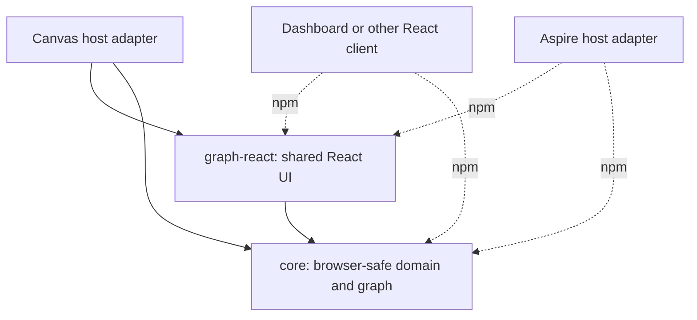
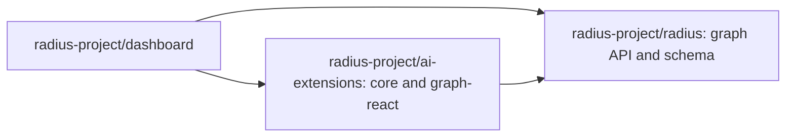

# Common Radius graph libraries

- **Author**: Nicole James (@nicolejms), with Copilot
- **Date**: 2026-09
- **Status**: Draft

## Overview

Radius clients should present the same resources and relationships consistently. Separate graph implementations allow layout, status presentation, controls, and details interactions to drift, while requiring each client to repeat fixes and accessibility work.

Introduce common graph contracts and React components owned by `ai-extensions`. Clients reuse one normalization and rendering pipeline, supplying only their data, theme, and host-specific actions. This reduces code duplication and makes a graph improvement available to every consumer through a versioned library update. Consistency means shared visual language and interaction rules, not pretending that live inventory and modeled topology contain the same information.

Potential consumers include the Copilot Canvas extension, a Headlamp plugin, Aspire, and the Radius Dashboard, whether running as a standalone application or as a plugin in an existing Backstage installation. Both dashboard modes could use the same graph libraries while retaining their host's navigation, authentication, and page composition. A Headlamp plugin mounts the shared React graph inside Headlamp's MUI shell; Headlamp is also the first real-host qualification target. An Aspire integration could consume the common contracts and mount the shared React graph through a host adapter, subject to the same compatibility and client-journey qualification.

## Terms and definitions

**Canvas** is the Radius extension for the GitHub Copilot app. **UCP** is the Radius control plane. **Live graph** means retrieved UCP inventory; **deployed projection** means workflow status over modeled topology, not live inventory.

## Objectives

> **Issue Reference:** N/A; this proposal defines the common graph-library boundary.

### Goals

- Share one graph model-to-view pipeline, layout engine, renderer, details pane, legend, and stylesheet across hosts.
- Make equivalent graph data and presentation options produce consistent resource cards, relationships, status cues, and keyboard interactions across clients.
- Keep domain contracts browser-safe and host-independent; preserve distinct graph-source semantics.
- Reduce duplicated implementation and maintenance by migrating consumers to shared behavior, not adding a library alongside existing copies.
- Preserve client behavior while producing compiled packages consumable by React 18 and React 19 hosts.

### Non-goals

Client page composition, authentication, transport, resource retrieval, and workflow orchestration remain host responsibilities. This design adds no backend service, iframe, generic Radius API client, or modeling/deployment capability. It does not require clients to adopt identical branding, page dimensions, or a new React major.

This design does not change the Radius application graph JSON schema, `rad app graph` output, or any control-plane (UCP) API. Clients continue to retrieve graph data through their existing calls; the libraries only normalize and render what those calls already return. The deployed graph is handled as a `live` graph: the host retrieves it from UCP (for example, the same response `rad app graph` uses), and live normalization maps it into the common view model without adding modeled metadata, diff hashes, or workflow status. Canvas's `deployed-projection` remains a separate variant that describes workflow status over modeled topology, so the libraries never present a projection as live inventory or vice versa. If a future control-plane change alters the graph schema, it is versioned in Radius and absorbed by core's live normalization rather than by each client.

### User scenarios (optional)

#### User story 1

A Canvas user retains graph navigation, source actions, deployment/diff presentation, and keyboard-accessible details after extraction.

#### User story 2

A developer moves between Radius Dashboard, running standalone or as a Backstage plugin, Aspire, and the Copilot Canvas extension and recognizes the same resource cards, zoom controls, and details interactions. Each client supplies its own navigation actions without copying graph code.

## User experience (if applicable)

Use a common visual language for resource types, relationships, selection, status, and details. Zoom, keyboard navigation, focus restoration, and legend meanings behave consistently across clients. Theme tokens and optional capabilities adapt the component to its host without creating independent renderers. Unsupported actions are absent rather than misleadingly enabled.

Preserve incumbent Canvas appearance and interaction during migration. The host owns loading, retrieval errors, routing, and surrounding layout. The library owns graph interaction and presentation.

**Sample input:** A normalized live graph with explicit connection, plane, and full application ID, plus theme and navigation callbacks.

**Sample output:** Resource cards, connections, and details, without fabricated deployment success or modeled source actions.

## Design

### High-level design

`packages/core` owns identity and graph semantics. `packages/graph-react` owns presentation. Each client supplies data and capabilities through a thin adapter. Canvas consumes workspace dependencies; separately built clients consume versioned packages. Neither library depends on a client.

### Architecture diagram

Arrows mean build-time dependency, not network traffic.

```mermaid
flowchart TD
    Canvas["Canvas host adapter"] --> Graph["graph-react: shared React UI"]
    Dashboard["Dashboard or other React client"] -. npm .-> Graph
    Aspire["Aspire host adapter"] -. npm .-> Graph
    Graph --> Core["core: browser-safe domain and graph"]
    Canvas --> Core
    Dashboard -. npm .-> Core
    Aspire -. npm .-> Core
```

The repository-level dependencies are one-directional. The Dashboard depends on both `radius` (graph API and schema) and `ai-extensions` (graph libraries); `ai-extensions` depends on `radius` for the graph contract. Neither `radius` nor `ai-extensions` depends on the Dashboard.

```mermaid
flowchart LR
    Dashboard["radius-project/dashboard"] --> Radius["radius-project/radius: graph API and schema"]
    Dashboard --> AIExt["radius-project/ai-extensions: core and graph-react"]
    AIExt --> Radius
```

### Detailed design

#### Option 1: Common contracts and renderer in ai-extensions

##### Advantages

Contracts, components, and the first client migration evolve atomically. Other clients adopt the same implementation through package releases, reducing visual drift and duplicated fixes.

##### Disadvantages

Requires public-package boundaries, cross-React qualification, and coordinated consumer updates. Shared regressions can affect multiple clients, making consumer-level checks essential.

#### Option 2: Share contracts but retain host-specific renderers

##### Advantages

Smaller initial extraction and fewer immediate host changes.

##### Disadvantages

Duplicates layout, styling, details, and bug fixes; fails the requirement to minimize duplication.

#### Proposed option

Choose Option 1 with a hybrid split between rendering and styling. The common library owns the primitives: normalization, Dagre layout, React Flow nodes and edges, details pane, legends, keyboard and focus behavior, and the geometry stylesheet (`base.css`). Each client owns its styling, either by keeping the default skin (`styles.css`) and overriding `--radius-graph-*` tokens, or by selecting `appearance="custom"` and supplying its own stylesheet against stable `data-radius-part` hooks. This keeps the separation of rendering and styling that Option 2 aims for without duplicating renderers. Extract reusable behavior from the existing Canvas implementation, replace its callers, and delete superseded behavior. Subsequent clients use the same renderer with explicit capabilities rather than forks. Temporary compatibility modules may only forward exports. Review attribution and licensing before transferring source from another package.

### API design (if applicable)

The public surface provides `RadiusGraph`, `RadiusGraphProps`, `GraphCallbacks`, and `mountRadiusGraph`. `RadiusGraph` accepts `graph`, presentation options, theme, and optional selection/details/navigation/external/source/retry/error callbacks. `onError` reports a render failure to the host once, when the graph shows its error state. The `presentation` subpath (graph building, layout and details helpers) is workspace-only for the Canvas adapter and is not part of the packed exports. The mount helper wraps the same React component for server-rendered shells; it is not another renderer.

Core contracts distinguish `live`, `modeled`, `planned`, `deployed-projection`, and `diff`. Live normalization requires full IDs and explicit connection/plane/application context, retains raw provisioning status, and does not require diff hashes. It accepts any resource type, so Azure, AWS and other non-`Radius.*` resources render as generic cards. Its warnings are objects with a stable `code`, a `severity` (`info` or `warning`), the owning `resourceId` and an English `message`, so hosts can filter or localize without parsing text. Canvas filtering, output expansion, diff provenance, and workflow status remain non-live capabilities. `@radius-project/core/domain` and `/graph` are deliberate browser-safe entry points; the core root is not this public browser contract.

### Implementation details

#### Core package - packages/core

Own resource-ID parsing, graph variants, and deterministic, non-mutating live normalization. The parser follows the Radius control plane's ID forms: UCP IDs (`/planes/<type>/<name>` plus scope pairs such as `resourceGroups` or AWS `accounts`/`regions`) and Azure Resource Manager IDs (`/subscriptions/...`). A resource whose ID cannot be parsed is dropped with a warning instead of failing the whole graph. Coalesce identical duplicates with diagnostics; reject conflicting duplicates. Report omitted malformed, dangling, and self-referential connections. Keep legacy gateway direction correction opt-in and source-specific.

#### Common React package - packages/graph-react

Own one Dagre implementation with per-instance state, React Flow nodes/edges, React-controlled details, legends, and styles. Accept host capabilities rather than fetching data. Preserve focus, viewport, and open details across unrelated host renders. Fill the host container; expose `.radius-graph` and `.radius-graph__viewport` as documented layout hooks. Scope custom CSS and preserve vendor control geometry.

#### Styling customization and host conflicts

The shared "core" is the non-visual contract in `packages/core` plus the rendering primitives and geometry in `packages/graph-react`. Layout is shared by construction: every host runs the same Dagre engine with the same fixed 220px node width. Styling is shared only as a default: the default skin can be kept, re-tokenized, or replaced per graph instance.

Hosts customize styling at three levels, from least to most effort:

1. Pass `theme` values (background, text, muted, accent, font, color scheme), for example derived from the host's MUI `useTheme()`.
2. Keep `styles.css` and override public `--radius-graph-*` CSS custom properties on the graph root.
3. Import only `base.css`, set `appearance="custom"`, and style the documented `data-radius-part` hooks and supported vendor hooks from a host stylesheet. The vendor hooks are React Flow class names; graph-react pins React Flow exactly, and a React Flow upgrade that removes or renames a supported hook ships as a graph-react major release.

Backstage (and Headlamp) use MUI with a global `CssBaseline` and their own theme. The library is designed not to conflict with them:

- All Radius and React Flow rules are wrapped in `@scope (.radius-graph …)`, so they cannot restyle Backstage components or another React Flow instance on the page; vendor keyframe names are prefixed.
- The library has no MUI or emotion/JSS dependency, injects no global selectors, and does not require a `ThemeProvider`; hosts map their theme into tokens instead.
- Custom appearance is per instance, so a Backstage plugin can use its own skin even if another graph on the page uses the default.

Residual risks are inbound rather than outbound. This is not Shadow DOM isolation, so host resets (for example `CssBaseline` typography or `box-sizing`) can still inherit into the graph; `base.css` resets `box-sizing` and the geometry it depends on. `@scope` requires Chromium/Edge 118+, Safari 17.4+, or Firefox 146+, and older browsers render the graph unstyled. Radius Canvas appends an unscoped copy of the scoped rules to its bundle for older macOS WebKit; other hosts must meet those browser requirements. The Backstage plugin must run the same host qualification as Headlamp: load order before and after host CSS, unchanged computed styles on sampled host elements, and a missing-stylesheet negative control.

#### Canvas adapter - packages/adapter-canvas

Own SDK lifecycle, page state, local source HTTP/fallback, and workflow integration. Mount/update/unmount the shared component. Preserve Canvas's legend placement and 450px drawing area without imposing that height on other consumers.

#### Shared adapter - packages/adapter-shared

No new responsibilities. Managed `rad` execution and process lifecycle remain outside the browser libraries.

#### Plugin - extensions/radius

Keep the Copilot distribution separate. Bundle the shared graph into the existing `com.github.copilot/extensions/radius/extension.mjs` artifact under `.artifacts/radius`; no runtime module download or second extension.

#### Build & packaging

Build core before graph-react; emit JavaScript, declarations, and CSS. Canvas uses workspace dependencies; external hosts install versioned npm artifacts and import `@radius-project/graph-react/styles.css`. React/ReactDOM remain peers, not bundled copies. Keep library Changesets/release selection separate from Copilot plugin discovery. When publishing begins, publish only from CI through npm trusted publishing (OIDC), never with a long-lived token; every published version carries npm provenance and has an SBOM attached to its release. Release compatible library versions together and record each client's resolved versions so a regression can be rolled back to a known-compatible set.

### Error handling

Hosts display fetch/authentication failures and own retry policy. Libraries reject invalid essential input, expose structured normalization warnings, report render failures through `onError`, and render explicit empty/degraded-layout states instead of success-shaped fallbacks. Callback failures must not be silently swallowed.

## Test plan

Use the repository's test layers: unit, browser component, critical journey, visual, and real-host.

- **Unit** tests, collocated as `*.test.ts`, cover identity parsing, live normalization, graph building, and layout.
- **Browser component** tests (`*.browser.test.ts`, the `graph-react-component` Vitest project) cover details, focus, lifecycle, and host styling in real Chromium.
- **Critical journey** tests cover Canvas graph pages through their host boundary.
- **Visual** checks use the canonical Canvas snapshots and thresholds, two repetitions, and no retries.
- **Real-host** qualification is described below.

Every pull request also runs the packed-artifact check (`pnpm run test:integration:libraries`), which consumes the exact packed JavaScript, declarations, and CSS with matching React 18 and React 19 peers.

Establish real-renderer behavior and visual baselines before migrating each client. Exercise equivalent fixtures across hosts to verify shared card/edge semantics, control dimensions, legend meanings, and keyboard behavior while allowing intentional theme and container differences. Include multiple instances, live graphs without modeled metadata, status-only updates, source actions, and teardown.

**Real-host** qualification installs exact candidate packages into pinned supported client revisions, currently Headlamp, and runs client-owned journeys. It needs external images and registries, so it runs on a schedule and on demand rather than on every library pull request; a passing run against the release candidate is required before any library release. Pull requests run the offline packaging, boundary, and host-styling checks that protect the same behavior. Verify transitive core resolution and stylesheet loading; deliberately missing CSS must fail the check. Do not mock the renderer or fall back to the old implementation. Run untrusted candidate code without secrets. Passing isolated library tests is necessary but insufficient to claim client compatibility.

## Security

Shared code receives data and callbacks, not credentials or arbitrary backend URLs. Hosts retain authorization and approved navigation/source-opening policy. Render resource content as text, validate link destinations, and keep Node/SDK/network implementations outside the browser dependency closure. Preserve source attribution and approve license/notice obligations before transferring code between packages.

## Compatibility (optional)

Support React 18 and React 19 through peer dependencies and matching runtime/type checks, without forcing a host upgrade. The initial target ranges are `^18.3.1 || ^19.2.8`; widening them requires evidence from the added versions. Render with React Flow 12 (`@xyflow/react`), matching the Canvas migration and the Flow 12 hosts such as Headlamp. Maintain a supported client/compiler/React matrix and qualify public declarations as well as runtime behavior. Host-specific features remain optional capabilities, not required properties of every graph.

## Monitoring and logging

Expose graph diagnostics to the host; add no telemetry service. Preserve canonical reports, traces, package receipts, and consumer revision identities to distinguish rendering regressions from host/environment failures.

## Development plan

1. Establish browser-safe contracts and a package build/pack boundary.
2. Extract the canonical React graph and migrate Canvas atomically, removing duplicated behavior.
3. Preserve visual/interaction fidelity and qualify exact packed artifacts on both React majors.
4. Establish each additional client's baseline and candidate-package CI, migrate its adapter, and remove its duplicate renderer before declaring that integration complete.

Release acceptance requires the pull-request library checks plus a passing real-host qualification run against the exact release candidate. Retaining an independent renderer after migration does not satisfy the consolidation goal.

## Open questions

- Who owns the npm publishing workflow, supported consumer pins, and cross-repository CI?
- Should the graph contracts ship as a separate package, such as `@radius-project/graph-core`, instead of the `@radius-project/core/graph` and `/domain` subpaths? Decide in the publishing change, before the first public release.
- Which client/compiler/React patch combinations must qualify, including demand for React 18.2?
- Which existing graph-package consumers need forwarding exports or a deprecation period?

## Alternatives considered

Keeping shared UI inside a client package couples other clients to that application's release process. Copying components per client preserves short-term independence but perpetuates drift. Embedding a hosted graph or iframe introduces runtime integration and accessibility costs where a build-time library is sufficient.

## Design review notes

Pending review of the common contracts, host boundaries, compatibility matrix, and release acceptance criteria.
