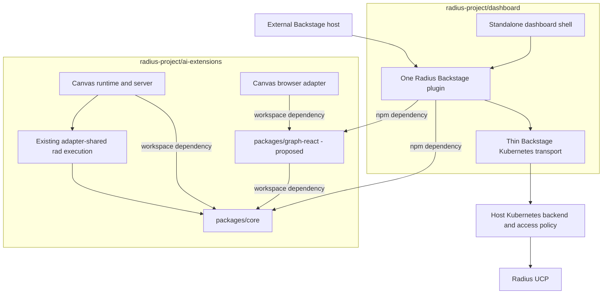

# Radius Dashboard as a distributable Backstage plugin

- **Author**: Nicole James (@nicolejms), with Copilot
- **Date**: 2026-09
- **Status**: Draft

## Overview

**Recommendation: host and publish all common Radius libraries and components in `radius-project/ai-extensions`, while productizing and releasing the existing Backstage plugin from `radius-project/dashboard`.** The dashboard is already a branded Backstage application. Its Radius pages currently live in `plugins/plugin-radius`, and its React graph currently lives in `packages/rad-components`. Consolidate that graph with Canvas's richer renderer in a new `packages/graph-react` package here; do not create a second Backstage implementation. The missing work is external-consumer readiness, common-library extraction, host configuration, compatibility, and publication, not an initial Backstage port.

Minimizing duplication is a release requirement. The standalone dashboard and an external Backstage installation must consume the same plugin. Radius Canvas and that plugin must consume common graph contracts, transformations, and rendering components where their behavior overlaps. Extraction is complete only when existing callers use the shared implementation and the superseded implementation is removed; publishing a library alongside unchanged copies does not satisfy this requirement.

This document proposes a coordinated, two-repository delivery plan. It does not implement or publish the plugin. The recommendation preserves the existing dashboard workspace and Canvas architecture rather than moving an entire application or introducing another runtime.

## Terms and definitions

| Term           | Meaning                                                                                                                                                 |
|----------------|---------------------------------------------------------------------------------------------------------------------------------------------------------|
| Dashboard      | The standalone Backstage application in `radius-project/dashboard`, including its branded shell and container deployment.                               |
| Radius plugin  | The existing Backstage-aware Radius pages, API registration, routes, and cards in the dashboard repository.                                             |
| Canvas         | The Copilot-specific adapter and packaged `radius` extension in this repository.                                                                        |
| UCP            | The Radius control-plane API reached by the dashboard through the Backstage Kubernetes proxy and Kubernetes aggregated API prefix.                      |
| Connection     | An explicit configured Kubernetes cluster plus Radius plane identity; not a browser-supplied URL or the first discovered cluster.                       |
| Shared graph   | Common resource/edge contracts and rendering primitives, with distinct live, modeled, planned, deployed-projection, and diff semantics.                 |
| Productization | Turning an internal plugin into versioned packages that unrelated Backstage hosts can install without copying source or adopting the dashboard's shell. |

## Objectives

> **Issue Reference:** No tracking issue is assigned to this proposal.

### Goals

- Deliver the current dashboard's read/inspect functionality as an installable Backstage plugin, without requiring the standalone dashboard container.
- Maintain one implementation of the Radius Backstage product pages for both standalone and embedded installations.
- Consolidate overlapping graph behavior across the dashboard and Canvas into common libraries/components owned and published by `ai-extensions`, with explicit host adapters.
- Support host-owned authentication, explicit connection selection, nested mounting, light/dark themes, and actionable failure states.
- Ship compiled packages, public contracts, installation documentation, release automation, and installed-artifact integration coverage.
- Preserve existing Canvas behavior, single-extension packaging, source-reference handling, and deployment workflows during extraction.

### Non-goals

- Porting Canvas modeling, deployment, environment creation, credential management, or deletion into the first Backstage release. These are not features of the current dashboard.
- Embedding a dashboard iframe, copying the frontend into this repository, or creating another standalone backend service.
- Rewriting all pages into a universal UI framework. Both dashboard distributions are Backstage hosts and can share Backstage-aware pages directly.
- Automatic catalog ingestion, Scaffolder actions, entity-level Radius authorization, or Red Hat Developer Hub dynamic-plugin packaging in the first release.
- Changing existing Radius control-plane APIs or treating a live graph as a source/Bicep graph.

### User scenarios (optional)

#### User story 1

A platform operator installs Radius packages into an existing Backstage deployment, configures approved Radius connections using the host's Kubernetes integration and identity policy, and mounts the plugin under `/radius`. No guest-auth override, copied page source, or separate dashboard deployment is required.

#### User story 2

A developer browses applications, environments, resources, recipes, and resource types, opens an application's live graph, and follows resource links without leaving the selected connection. A graph rendering fix is implemented once and reaches the standalone dashboard, embedded plugin, and Canvas through their shared component dependency.

## User experience (if applicable)

The plugin provides a routable Radius area containing the existing five list experiences and their detail pages. Preserve resource overview/JSON views, application resources and graph, environment metadata/recipes/resources, recipe-pack aggregation, and resource-type schema documentation. Existing home cards remain optional extensions. Host navigation, sign-in, user settings, branding, and the app-wide theme stay with the host.

Add an explicit connection selector when more than one approved connection exists. A single configured connection can be selected automatically; multiple connections must not silently select the first or last cluster. Persist filters with connection-scoped keys. Include connection identity in links and data cache keys so similarly named applications cannot collide.

**Sample input:** An operator mounts Radius at `/radius` and configures a connection named `production` referring to a host-defined Kubernetes cluster and the `radius/local` plane.

**Sample output:** A developer opens Radius, selects `production`, opens an application, and sees its live graph and linked resources. A missing connection produces setup guidance; forbidden access produces an access error; an unavailable control plane produces a retryable failure, not an empty successful list.

The current graph only supplies name/type nodes, edges, layout, and zoom controls. Canvas-specific source links, deployment badges, output-resource projection, and diff styling must remain supported in the shared graph library without being enabled by default in the dashboard.

## Design

### High-level design

Co-locate common domain logic and reusable UI in `ai-extensions`; keep Backstage-specific product code in dashboard:

- **`ai-extensions` owns shared UI-independent logic:** evolve `packages/core` into a deliberately published dependency with narrow subpath exports. It contains common resource identity, graph contracts, normalization, and extracted Radius domain use cases.
- **`ai-extensions` owns common React components:** introduce `packages/graph-react` (proposed package name `@radius-project/graph-react`) and consolidate Canvas's graph renderer with the useful parts of dashboard's existing `rad-components`. This becomes the one graph component implementation, with no Backstage or Copilot dependency.
- **`dashboard` owns the Backstage product:** keep the existing Radius plugin as the single Backstage product UI. It consumes the published core and graph packages instead of maintaining shared implementations.
- **Each host owns its integration:** dashboard app composition, Backstage authentication/Kubernetes transport, and Canvas SDK/loopback/source-opening behavior remain adapters.

Package dependencies form a directed acyclic graph: core has no adapter dependency; graph-react depends on core; the plugin depends on both; Canvas depends on both and its Node adapter. Core and components never depend on the plugin or Canvas. Canvas uses workspace dependencies so shared contracts, components, and its integration can change atomically here. Dashboard consumes versioned npm packages; `ai-extensions` has no production dependency on a dashboard-owned package.

#### Review baseline and findings

The dashboard review is pinned to [`8a04d30`](https://github.com/radius-project/dashboard/commit/8a04d30c35cd95fa4eb65a48ee1a36157f2091cb), committed September 8, 2026. This repository was inspected at [`9c86b40`](https://github.com/radius-project/ai-extensions/commit/9c86b4005f67010c5559bb24433a56fa6f4893d4). Backstage compatibility research used its official documentation and release [`v1.54.6`](https://github.com/backstage/backstage/releases/tag/v1.54.6), not a claim that either Radius application already supports that release.

| Area               | Observed implementation                                                                                                                                        | Delivery consequence                                                                                         |
|--------------------|----------------------------------------------------------------------------------------------------------------------------------------------------------------|--------------------------------------------------------------------------------------------------------------|
| Dashboard frontend | Existing `createPlugin`, API factories, routable extensions, route refs, and cards; standalone app imports the plugin's pages. [D1], [D2]                      | Release and adapt this plugin rather than build another one.                                                 |
| Dashboard backend  | Running backend registers Kubernetes/auth/catalog and other Backstage plugins. The Radius backend scaffold only has a health route and is not registered. [D3] | Do not publish a health-only backend as though it supplies Radius functionality.                             |
| Radius reads       | `RadiusApiImpl` delegates to `KubernetesApi.proxy`, supports `Applications.Core` and `Radius.Core`, and performs resource-group/resource fan-out. [D4]         | Extract common domain operations, retain a thin Kubernetes transport adapter, and bound concurrency.         |
| Graph retrieval    | `ApplicationTab` makes its own `getGraph` POST with a ten-second abort timeout. API calls choose the first cluster; graph code chooses the last. [D4], [D5]    | Move graph retrieval behind the same explicit connection-aware API as resource reads.                        |
| Graph UI           | Dashboard uses React Flow 11 and `@dagrejs/dagre`; Canvas uses React Flow 11 and `dagre`, with a richer renderer. [D6], [A1]                                   | Consolidate the actual renderer and layout, not just similarly named types.                                  |
| Duplicated code    | Dashboard has duplicate resource-ID parsers and repeated graph interfaces. Canvas also has separate graph resource/view types. [D7], [A2]                      | Establish canonical contracts with source-specific adapters; remove copies as callers migrate.               |
| Host coupling      | Hard-coded root navigation, `radius/local` assumptions, guest-auth standalone configuration, and first-cluster selection. [D2], [D4], [D8]                     | Use route refs, explicit connection context, and the host's authentication configuration.                    |
| Packaging          | Dashboard plugin manifests use private `@internal/*` names; this repo's core/shared packages are private source exports ignored by Changesets. [D9], [A3]      | Neither current packaging scheme is sufficient for public npm consumers.                                     |
| Test evidence      | Dashboard has useful API/component tests, but graph test checks attribution and browser smoke checks home cards. [D10]                                         | Add semantic graph, real host-boundary, and packed-package scenarios before claiming external compatibility. |

The products have different data sources. The dashboard reads the live Radius control plane. Canvas builds modeled graphs using `rad`, computes graph diffs, and projects deployment status from workflow artifacts onto modeled topology. [`applicationGraphToResources`](../../packages/core/src/graph/appgraph.ts) requires valid modeled diff hashes; [`projectDeployedGraph`](../../packages/core/src/graph/deployed.ts) deliberately retains modeled topology. Neither is a drop-in live-UCP graph adapter.

### Architecture diagram

This diagram shows the proposed ownership and dependencies, not packages already shipped. Arrows mean "depends on"; cross-repository package dependencies are resolved at build time, not through a new network service.



### Detailed design

#### Option 1: Common libraries in ai-extensions; Backstage plugin in dashboard

Publish core and the new graph-react component package from this repository. Consolidate both existing graph implementations here, and make Canvas a workspace consumer. Keep the existing Backstage plugin in dashboard and make it a consumer of the published common libraries.

##### Advantages

Co-locates shared domain contracts, the richer Canvas graph implementation, and Canvas integration for atomic changes. Preserves existing Backstage build, app, plugin, and container ownership. Both Backstage distributions share one UI without introducing a Backstage release toolchain here or making Canvas depend on dashboard-owned components.

##### Disadvantages

Requires moving dashboard graph code and its relevant tests/notices into a new package here, adding React component library packaging, and coordinating dashboard consumer updates. Existing rad-components consumers may need temporary forwarding exports and a deprecation period.

#### Option 2: Move the plugin and common UI into ai-extensions

Transfer canonical plugin/component ownership into new workspace packages here; change dashboard into an external package consumer and remove its former implementations.

##### Advantages

Co-locates shared core, UI, and adapters, enabling atomic graph changes. Can eventually provide one repository for all Radius integrations.

##### Disadvantages

Requires a coordinated source transfer, Backstage build/TSX tooling, a host fixture, new npm publication, and migration of existing dashboard ownership and release dependencies. The current repository's plugin discovery and publishing are designed for Copilot artifacts, not npm Backstage packages. Merely copying the plugin would directly violate the duplication requirement.

#### Proposed option

**Choose Option 1.** Common-library ownership and Backstage-plugin ownership are separate decisions. Hosting common code here lets core, graph components, and Canvas evolve together; dashboard remains a consumer through published contracts. Keeping the already implemented Backstage plugin in dashboard avoids moving its host-specific tooling. The earlier proposal to retain common components in dashboard favored migration convenience over the stronger long-term shared-library boundary and is superseded.

#### Canonical ownership and extraction map

Names of new exports below are proposals, not claims about existing APIs.

| Source today                                                                                   | Canonical destination                                                                                                 | Required consumer migration                                                                                                          |
|------------------------------------------------------------------------------------------------|-----------------------------------------------------------------------------------------------------------------------|--------------------------------------------------------------------------------------------------------------------------------------|
| Dashboard's two `resourceId.ts` files and resource/graph interfaces                            | `packages/core`, proposed Radius domain exports                                                                       | Both dashboard packages use one parser and contracts; temporary forwarding exports contain no logic.                                 |
| Radius API compatibility, recipe aggregation, schema interpretation mixed into dashboard pages | `packages/core`, proposed Radius domain use cases behind a typed transport port                                       | Plugin pages call the common use cases; UI does not import parsers from a visual package.                                            |
| Graph request in `ApplicationTab` and resource requests in `RadiusApiImpl`                     | One shared Radius client/use-case boundary plus Backstage transport adapter                                           | All reads use the same explicit connection, version policy, timeout/cancellation, and error contract.                                |
| Canvas graph model/build/layout plus dashboard graph layout                                    | `ai-extensions/packages/core` for domain semantics; proposed `packages/graph-react` here for graph view models/layout | One layout implementation and tested compatibility handling; neither host retains a separate graph builder with equivalent behavior. |
| Canvas node/view/details/legend and dashboard `AppGraph`/`ResourceNode`                        | Proposed `ai-extensions/packages/graph-react`, with typed data, callbacks, and view options                           | Dashboard plugin consumes the npm package; Canvas consumes the workspace package; shell-specific source opening stays in Canvas.     |
| Dashboard Backstage pages, tables, recipe/type detail UI                                       | Existing Radius frontend plugin                                                                                       | Standalone app and external host consume exactly the same exports.                                                                   |
| Canvas workflows, managed binaries, worktree access, local auth, SDK lifecycle                 | Existing Canvas and shared Node adapters                                                                              | No transplantation into a browser plugin or the dashboard client.                                                                    |

The graph migration is incremental but mandatory before stable release. First extract contracts and pure transformations; then consolidate the React node/edge/details renderer and layout in graph-react here; finally replace both consumers and remove the superseded implementations. If dashboard's rad-components has external consumers, retain only a temporary compatibility package forwarding to the new library, with a documented removal policy. Avoid rewriting the whole Canvas page: its existing server-rendered shell and inline browser entry simply mount the common graph with injected callbacks. Preserve Canvas behavior through the existing boundary suites.

The dashboard's module-level Dagre graph becomes per-layout/per-instance state. Choose one Dagre implementation after running both graph fixture sets; do not bundle two layout engines permanently. Preserve the legacy gateway-direction workaround only for the input shape that needs it, with a named fixture, rather than applying it to every graph.

Keep React and ReactDOM as compatible peer dependencies of the common component library. Do not bundle a second React into Backstage. Verify the same components under dashboard/Backstage React 18 and Canvas React 19 before declaring both supported. Theme tokens, node presentation, source opening, selection, and details actions are explicit inputs; no Backstage imports, Canvas globals, `/api/open-source` calls, or application-wide CSS resets in the shared graph package.

#### Shared data semantics

Use full resource identity plus connection and plane context, never bare application name, for lookup and caching. Keep live UCP graph inputs separate from modeled `rad` inputs. Model source-specific metadata through explicit variants or optional capabilities: a live graph need not contain a `diffHash`, definition file, or workflow status.

Reuse stable edge normalization and identity handling, but make product-specific projections explicit. Canvas's visualization filtering and modeled-topology deployment projection must not silently hide live dashboard resources or manufacture successful provisioning status. Preserve both application namespaces, recipe packs and legacy recipes, resource-type API versions, and raw status values through common normalization.

Do not introduce another schema engine: extract the dashboard's existing schema interpretation as pure view-model functions. Do not assume Canvas's recipe resolution and dashboard recipe listing are the same operation; share identity and compatible data transformations, not unrelated orchestration.

#### Backstage integration

Retain the current legacy frontend exports while adding a new frontend-system entry built from the same pages, API implementation, and route definitions. Use Backstage's documented `createFrontendPlugin`/extension mechanisms for the new entry; the wrappers may differ, but product logic must not. Do not force the standalone dashboard to migrate frontend systems as a prerequisite.

Replace every hard-coded internal root link and breadcrumb with route refs or routes resolved relative to the mounted plugin. Verify direct links, refresh, browser history, and a non-root app base path. Keep home cards optional. Catalog entity cards/tabs can follow as thin consumers of this same API, but annotation contracts and catalog ingestion are not prerequisites for dashboard parity.

Use the existing Kubernetes proxy path for the first release, not a new Radius backend merely for symmetry. The host installs and configures the necessary Backstage Kubernetes frontend API and backend plugin explicitly. Export `radiusApiRef`, its interface, and an override seam so hosts can supply a different authorized transport without copying pages.

### API design (if applicable)

The proposed public Radius domain surface includes resource identity/types, `RadiusConnection`, an injected `RadiusTransport` port, and client operations for listing/getting applications, environments, resources, recipes, resource types, and application graphs. Core owns Radius semantics; the adapter owns HTTP implementation, Backstage credentials, cluster access, and response decoding at the transport boundary. New public inputs must be validated rather than exporting the existing permissive Canvas `any` shapes as a stable SDK.

All operations receive explicit connection context and support cancellation. The graph operation uses the same selected cluster and plane as the application's detail request. Preserve the existing upstream graph operation, `POST /apis/api.ucp.dev/v1alpha3/{application-resource-id}/getGraph?api-version=...`; its POST method is a graph query, not deployment permission.

Retain resource-type version discovery and characterize the current `2023-10-01-preview` fallback. Unsupported namespace/version responses may permit compatibility fallback; authentication, authorization, network, and malformed-response failures must not become empty lists. If one supported namespace fails while another succeeds, return an explicitly partial result with a visible warning rather than reporting complete inventory.

Bound resource-list fan-out and support upstream continuation when available; do not claim server pagination where none exists. Add request deduplication, bounded cache lifetimes, and cancellation on connection changes. Cache keys include connection, plane, scope, API version, and authorization context; authorization must be enforced on every retrieval.

**Proposed configuration shape**, to be documented and schema-validated during implementation:

```yaml
radius:
  connections:
    - id: production
      clusterName: production-cluster
      plane:
        type: radius
        name: local
```

These fields refer to operator-controlled Kubernetes configuration; they do not contain credentials or authorize access. The final schema must be tested against the selected Backstage configuration mechanism. No new public Radius backend REST API is required by this option.

### Implementation details

#### Core package - packages/core

Add narrow domain/graph subpath exports and move the genuinely common logic with its tests. Keep core independent of React, Backstage, Node HTTP implementations, the filesystem, and Copilot. Publish compiled JavaScript and declarations for the public surface rather than requiring consumers to transpile this repository's TypeScript source. Keep unrelated modeling/workflow internals out of the new public contract.

Do not perform an unrelated core rewrite. Harden types and errors only where code becomes a shared contract or is changed by extraction, with explicit before/after behavior tests.

#### Common React components - packages/graph-react (proposed)

Create this package in `ai-extensions` as the canonical home for shared graph rendering, layout, nodes, edges, details, legends, and scoped styles. Consolidate the existing Canvas graph modules and dashboard's AppGraph/ResourceNode behavior rather than retaining one renderer per host. Move the relevant tests and preserve source attribution and license notices.

Depend on browser-safe core subpaths through a workspace dependency. Accept graph data, presentation options, theme tokens, and callbacks; do not fetch Radius data, import host APIs, or own Backstage routing or Copilot lifecycle. Use the repository's TypeScript, Vitest, and browser conventions, extending configuration for React/TSX and library packaging where needed rather than adopting a second Backstage toolchain.

Build compiled JavaScript, TypeScript declarations, and scoped CSS for npm consumption, with React/ReactDOM externalized as peer dependencies. Canvas consumes the workspace source through its existing build; dashboard consumes published artifacts. Both build paths must exercise the same implementation and exports, without requiring runtime package downloads.

#### Canvas adapter - packages/adapter-canvas

Replace duplicated graph internals with a workspace dependency on graph-react, preserving browser entry registration, initialization/teardown, page state, focus, source opening, theme behavior, and modeled/planned/deployed/diff features. Its browser build bundles the common component into the existing self-contained inline scripts.

Preserve the actual current artifact contract described in [plugin packaging and publishing](../architecture/plugin-packaging-and-publishing.md): local output under `.artifacts/radius`, with `com.github.copilot/extensions/radius/extension.mjs` as the canonical entry inside the published plugin. Do not add runtime fetches of this repository's browser modules or a second plugin bundle.

#### Shared adapter - packages/adapter-shared

No first-release Backstage dependency on managed `rad`/Bicep is needed. Keep graph compilation and process lifecycle here. A future modeled/planned Backstage view would reuse this boundary through a deliberately designed backend, not spawn tools from the frontend or import Canvas server routes.

#### Plugin - plugins/radius

The Copilot plugin remains a separate distribution. Its manifest, skills, deployment tools, and marketplace discovery do not become a Backstage package. Only the rebuilt Canvas graph implementation and any resulting dependency notices change when that migration lands.

#### Dashboard repository

Keep `plugins/plugin-radius` canonical for Backstage-specific pages and integration. Move common API/domain logic to core here and common graph components to graph-react here; remove duplicate parsers/interfaces/renderers after switching the plugin to the published packages. Centralize graph networking and make connection/navigation configurable. Retain app branding, container packaging, sign-in, and host configuration in `packages/app` and `packages/backend`.

Retire `packages/rad-components` as an implementation owner. If compatibility requires keeping its exports temporarily, make it a forwarding wrapper over graph-react with no independent layout, renderer, or domain logic. The standalone dashboard and external hosts continue to consume the same Backstage plugin.

The existing [Radius backend scaffold][D11] is not part of the initial public distribution. If later requirements need a Radius-specific authorization gateway, implement it as a thin new-backend-system adapter over the shared domain layer, with a separate approved contract.

#### Build & packaging

Proposed public names are `@radius-project/core` and `@radius-project/graph-react`, published from `ai-extensions`, and `@radius-project/backstage-plugin-radius`, published from dashboard, subject to npm scope ownership confirmation. Inventory external consumers of the existing `@radapp.io/rad-components` identity before migration; provide forwarding exports and a deprecation plan if needed. That compatibility identity must not remain the canonical shared implementation. Do not assume current registry publication merely from repository documentation.

This repository's [core manifest](../../packages/core/package.json) is private, points at source, and requires Node 24; [Changesets config](../../.changeset/config.json) ignores core and uses restricted access. Add an explicit npm library release path for selected public packages: compiled exports/declarations, public access, package file allowlists, dependency rewriting, Changesets participation, provenance, and immutable version publication. Do not route npm libraries through the Copilot-specific `scripts/plugins.mjs` discovery or generated release branches. Keep independent Copilot versioning intact and add Changesets for affected released behavior when implementation lands.

Build and publish core and graph-react through this repository's npm library release path, with independent versioning and dependency-aware Changesets. Graph-react uses core as a workspace dependency locally; packing rewrites it to a published version range. Canvas uses both as workspace dependencies and bundles them into the Copilot artifact, so it does not wait for an external graph-package release to integrate a local change.

Dashboard needs a real plugin publication job rather than only its container build. Build/pack the Backstage plugin with dependencies on the published common libraries and verify the installed tarballs. Publish in dependency order: core here, graph-react here, then the Backstage plugin in dashboard. Update dashboard's dependency lockfile to qualified versions; release Canvas through its existing pipeline after its local integration gates. Use prerelease versions first, followed by stable releases only after cross-consumer gates pass.

Use pnpm for this repository and retain dashboard's existing tooling. Published packages must be consumable without `workspace:`/`catalog:` protocols, repository source aliases, or a required consumer package manager. Verify Backstage CLI packaging and declarations in a host fixture instead of assuming this repo's esbuild output is an npm plugin.

Resolve license metadata before publishing: dashboard's plugin/repository declare Apache-2.0, while the [rad-components manifest][D12] declares ISC. Preserve applicable notices and obtain maintainer confirmation rather than silently relicensing moved code.

### Error handling

Distinguish no configured connection, invalid selection, unauthenticated, forbidden, not found, unsupported API version, malformed payload, partial inventory, timeout, and unavailable upstream. Loading, empty, partial, stale, and error are separate UI states. Never report failed discovery as "no resources."

Cancel view-owned work on unmount or connection changes and reject late responses from superseded selections. Keep layout state isolated across simultaneous graphs; if layout fails, show a usable explicitly degraded presentation rather than overlapping all nodes. Apply bounded read retries only to appropriate transient failures. Do not retry authorization failures or automatically switch clusters.

## Test plan

Use existing runner conventions in each repository: Vitest and the current browser/boundary suites here; existing dashboard tests as migration seeds there. Tests move with extracted code. Shared packages get one canonical behavior suite; consumers add only their distinct host and packaging contracts.

| Layer                                   | Required evidence                                                                                                                                                                                                                                                                                            |
|-----------------------------------------|--------------------------------------------------------------------------------------------------------------------------------------------------------------------------------------------------------------------------------------------------------------------------------------------------------------|
| Domain unit                             | Full resource identity, dual namespaces, malformed IDs/payloads, live versus modeled graphs, missing hashes, recipe aggregation, schema interpretation, version fallback, explicit partial failures, connection-scoped cache behavior, cancellation and fan-out bounds.                                      |
| Shared graph unit/component             | Deterministic edges/layout, gateway compatibility, simultaneous graphs without state leakage, output-resource handling, source/detail callbacks, all Canvas graph modes, empty/error states, and update/unmount cleanup.                                                                                     |
| Backstage integration                   | Real plugin/API registration with controlled Kubernetes responses; authenticated and forbidden requests; two clusters where the old first/last behavior would disagree; plane selection; GET and graph POST policy; nested routes and non-root app base paths.                                               |
| Browser functional and critical journey | Lists to resource/environment detail to graph; recipes and resource-type schemas; connection change during requests; visible partial failure/retry; direct-link refresh; dashboard and external-host mounting.                                                                                               |
| Accessibility and keyboard              | Light/dark material states, graph controls/details, focus restoration, loading/error announcements, keyboard-only navigation, and accessible non-graph resource information.                                                                                                                                 |
| Installed artifact                      | Install packed public dependencies into a clean Backstage fixture without source aliases; compile declarations, build frontend/backend, load CSS, register the plugin, and exercise real host routes with fake upstream data.                                                                                |
| Canvas regression                       | Existing applicable unit, runtime integration, HTTP integration, built-extension smoke, browser component, browser functional, critical journey, accessibility, and keyboard gates. Scheduled visual/reliability and real-host qualification follow the current test plan, not a newly invented gate status. |

Target 100% meaningful changed-code coverage and never lower existing repository/package baselines. Preserve the Canvas browser coverage floor and use its existing [test architecture](./2026-08-radius-canvas-test-architecture.md) and [test plan](./2026-08-radius-canvas-test-plan.md) to select the exact requirements affected by renderer extraction.

Require package-boundary rules that prohibit core importing hosts, common components importing Backstage/Canvas, and host code importing another adapter's private source. Review the extraction inventory at each phase; final acceptance requires zero remaining parallel implementations of the migrated parser, graph request policy, layout, and graph renderer. Shared runtime contracts may also be exposed by type-only re-exports; duplicated implementations are not an acceptable compatibility mechanism.

Browser consumers must import browser-safe domain/graph subpaths, not the existing core root barrel: the current [Canvas graph builder](../../packages/adapter-canvas/src/browser/graph/build.ts) already avoids the root because it re-exports workflow code that reads `process.env`. Extend the existing browser-safe build checks to the new public dependency graph, including packed consumption, rather than assuming that all core exports are browser-safe.

Pull-request tests use local fixtures, fake identities, and no live cloud or inherited credentials. Before stable publication, qualify real supported Radius versions and host configurations in a controlled release environment. Synthetic fixtures alone cannot prove Kubernetes aggregation, real authorization, or UCP version compatibility.

## Security

The plugin inherits the host's sign-in and backend authentication. Do not transplant guest sign-in, `NODE_ENV=development`, local kubectl proxy setup, or standalone service-account permissions into installation defaults.

Connection configuration and hiding UI controls are not authorization. The chosen Kubernetes backend/auth strategy must enforce each user's allowed cluster/Radius scope for both resource reads and the graph POST. The initial access model is explicitly cluster/plane-scoped inspection, not catalog-entity ownership enforcement. Prove direct proxy requests cannot bypass the intended policy. If the target host cannot enforce that model, launch is blocked until an authorized transport or narrow Radius backend gateway is implemented; do not ship browser-only checks.

Keep cluster credentials backend-only. Bind connections to operator-approved cluster identifiers and planes; never proxy arbitrary browser-provided endpoints. Derive the minimum upstream permissions from observed GET and graph-query operations rather than copying broad standalone RBAC or assuming read-only means GET-only.

Validate and safely render resource metadata, Markdown, schema descriptions, graph icons, and source links. Raw JSON views need an explicit sensitive-field policy: preserve inspection where authorized, but do not assume live resource properties contain no secrets. Use trusted asset handling and output-context escaping. Logs, diagnostics, and cached responses must not leak tokens or data across users/connections.

Distribution requires reviewed dependency/license metadata, package provenance, controlled publication credentials, and a rollback/deprecation process. A generic allow-all permission policy is not a production installation recommendation.

## Compatibility (optional)

The dashboard declares Backstage `1.49.0`, React 18, Material-UI v4, and legacy plugin construction. Backstage `v1.54.6` is a candidate compatibility target, not verified support. Its [app template][B4] uses React 18 and its [root template][B5] supports Node 22 or 24 with TypeScript 5.8, while this repo uses Node 24 and TypeScript 7. Validate emitted declarations with the target host compiler; do not leak newer TypeScript syntax or this repo's tooling into consumer requirements.

Initial qualification should cover the dashboard baseline and the selected current Backstage release, legacy and new frontend entries, and Canvas's React 19 renderer. Declare only tested peer ranges. Node 24 is a common initial build/runtime target; wider Node support is a separate qualification decision rather than an accidental `engines` promise.

Retain old dashboard exports through forwarding modules during migration. Keep standalone URLs working while making embedded mounting configurable. The existing deployed graph, resource-type schemas, and both Radius namespaces remain part of parity. Optional future modeled/planned/diff views must be labeled by data source and must not replace the live graph.

## Monitoring and logging

Record request correlation, connection ID, operation category, elapsed time, upstream status, partial-result count, and safe error codes. Measure fan-out, response size, cache hits, timeouts, and graph node/edge counts without logging raw resource bodies or credentials. Use host logging/telemetry facilities, with an explicit adapter for shared code.

Troubleshooting should distinguish a missing host Kubernetes plugin, unavailable cluster, insufficient UCP permissions, unsupported API version, and frontend registration or CSS problems. Include these cases in the installation guide.

## Development plan

Estimates below are engineering effort, including automated coverage and documentation, not calendar commitments. Maintainer review, npm ownership, and controlled-environment qualification can add elapsed time.

| Phase                               | Repository and deliverable                                                                                                                                                                                           | Dependency and exit gate                                                                                                                                                       | Estimated effort    |
|-------------------------------------|----------------------------------------------------------------------------------------------------------------------------------------------------------------------------------------------------------------------|--------------------------------------------------------------------------------------------------------------------------------------------------------------------------------|---------------------|
| 0. Agree contracts and parity       | Both: approve this design, public names/ownership, license handling, host/Radius matrix, permissions model, and extraction inventory.                                                                                | Demonstrate the existing plugin in a clean external host fixture; record unsupported behavior explicitly. No production fork.                                                  | 3-5 engineer-days   |
| 1. Publish shared domain foundation | Here: public core subpaths and library release path. Dashboard: consolidate ID/contracts, extract client/domain transformations, centralize graph retrieval, consume core prerelease.                                | One parser and graph contract; connection-consistent reads; existing dashboard uses the extracted implementation.                                                              | 7-10 engineer-days  |
| 2. Consolidate graph components     | Here: create graph-react, consolidate both renderers and tests, publish the library, and migrate Canvas through workspace dependencies. Dashboard: consume the npm package and retire rad-components implementation. | Dashboard live graph plus all Canvas graph modes retain behavior; React 18/19 and packed-package gates pass; no production dependency from ai-extensions to dashboard remains. | 10-15 engineer-days |
| 3. Productize Backstage integration | Dashboard: nested routes, public API seam, explicit connections, host auth policy, legacy/new frontend wrappers, optional existing cards.                                                                            | Complete dashboard read/inspect parity in standalone and external host; authorization and connection isolation proven.                                                         | 7-10 engineer-days  |
| 4. Publish and qualify              | Both: package publication/provenance, installation/upgrade guide, prerelease pilot, compatible consumer pins, controlled Radius qualification, stable release.                                                       | Clean install from published artifacts; no required source copying; shared implementation inventory is empty.                                                                  | 5-8 engineer-days   |

Total planning range: **32-48 engineer-days**, approximately **7-10 working weeks for one engineer**, excluding review and environment delays. Phase 3 can partially overlap graph work after the shared contracts stabilize. A preview can be available earlier, but stable release must not skip the shared-renderer migration to make a date.

### Release and rollback

Ship additive core/graph-react prereleases from `ai-extensions`, then migrate dashboard consumers on branches using exact versions. Canvas migrates with workspace dependencies in the same repository changes and is released only after its integration gates. Do not release the Backstage plugin with a hidden dependency on an unpublished workspace package. Publish stable common libraries before the Backstage plugin, and update the standalone dashboard and Canvas distributions independently after their compatibility gates.

Retain the previous known-good plugin/component/core versions and pin sets for rollback. An external host rolls back by restoring its prior dependency lockfile; the standalone dashboard can restore its prior image. Canvas follows its existing plugin release mechanism. Avoid database/state migrations in this read-only first release. If an extraction must be rolled back, revert the consumer dependency coherently rather than keeping a second implementation as a permanent fallback.

## Open questions

**Q: Who owns the public npm scopes and publication credentials?**

**A:** Confirm registry access and maintainer assignments during Phase 0. Repository ownership is decided: common core and React components live in `ai-extensions`; the Backstage plugin and standalone shell remain in dashboard. Proposed package names do not establish registry ownership.

**Q: Which Radius versions and connection authorization mechanisms are supported?**  
**A:** Define and qualify a bounded matrix. Current source compatibility with both namespaces is evidence of intent, not proof of every deployed version. The host-policy test must settle whether Kubernetes proxy reuse is sufficient for each supported installation.

**Q: Is full catalog integration required for the initial release?**  
**A:** Proposed answer: no. Ship the current dashboard parity first. Entity annotations, entity tabs, and automatic discovery require a separate identity/access contract and can reuse the same product API.

**Q: Can common graph components support both React 18 and 19 without host-specific forks?**  
**A:** This is a Phase 2 gate. Prefer compatible React APIs and host-provided peers; if a dependency prevents the matrix, resolve or upgrade that dependency in a reviewed change rather than shipping two graph implementations.

**Q: Must deployment/modeling from Canvas be available in Backstage?**  
**A:** Proposed answer: not for this deliverable. A follow-up can reuse core and shared Node adapters, but would require server authorization, durable job execution, repository identity, and explicit mutation contracts.

## Alternatives considered

- **Publish the existing private plugin with only a name change:** insufficient; connection selection, nested navigation, public contracts, publication, and access assumptions still belong to the standalone host.
- **Iframe the dashboard:** avoids an initial source copy but does not provide native host authentication/navigation or solve the shared-library requirement.
- **Build a new plugin from Canvas pages:** the wrong starting point for dashboard parity; Canvas has different data sources, workflows, and host assumptions.
- **Add a backend plugin immediately:** unnecessary for existing functionality because Backstage's Kubernetes backend already supplies transport. Add one only when a demonstrated authorization/transport requirement cannot be met safely.
- **Move every product page into a framework-neutral React package:** premature. Both dashboard hosts already use Backstage; share only components needed by non-Backstage consumers, beginning with the graph.
- **Share types but keep two renderers:** reduces superficial duplication while leaving layout, node behavior, fixes, and tests duplicated. Rejected under the explicit requirement.
- **Keep common components in dashboard:** minimizes the initial source move but makes Canvas depend on a dashboard-owned package and separates core/component changes across repositories. Superseded by co-locating common libraries in ai-extensions; moving the Backstage plugin is not necessary.

## Design review notes

On September 10, 2026, Nicole requested that common components be hosted in `ai-extensions`. The plan now places core and the proposed graph-react library here, keeps the Backstage-specific plugin in dashboard, and requires migrating and removing the old shared implementations. This supersedes the earlier proposal to publish the common graph from dashboard.

The remaining design is pending review; this update does not implement or publish packages. This documentation-only change has no released behavior change; no Changeset is required, and the proposed pull-request label is `pr:no-changeset`.

## Source references

Dashboard references are pinned to the reviewed commit. Local links describe the inspected ai-extensions source; Backstage documentation links describe integration contracts, not executed compatibility evidence.

[D1]: https://github.com/radius-project/dashboard/blob/8a04d30c35cd95fa4eb65a48ee1a36157f2091cb/plugins/plugin-radius/src/plugin.ts
[D2]: https://github.com/radius-project/dashboard/blob/8a04d30c35cd95fa4eb65a48ee1a36157f2091cb/packages/app/src/App.tsx
[D3]: https://github.com/radius-project/dashboard/blob/8a04d30c35cd95fa4eb65a48ee1a36157f2091cb/packages/backend/src/index.ts
[D4]: https://github.com/radius-project/dashboard/blob/8a04d30c35cd95fa4eb65a48ee1a36157f2091cb/plugins/plugin-radius/src/api/api.ts
[D5]: https://github.com/radius-project/dashboard/blob/8a04d30c35cd95fa4eb65a48ee1a36157f2091cb/plugins/plugin-radius/src/components/resources/ApplicationTab.tsx
[D6]: https://github.com/radius-project/dashboard/blob/8a04d30c35cd95fa4eb65a48ee1a36157f2091cb/packages/rad-components/src/components/appgraph/AppGraph.tsx
[D7]: https://github.com/radius-project/dashboard/blob/8a04d30c35cd95fa4eb65a48ee1a36157f2091cb/plugins/plugin-radius/src/resources/resourceId.ts
[D8]: https://github.com/radius-project/dashboard/blob/8a04d30c35cd95fa4eb65a48ee1a36157f2091cb/plugins/plugin-radius/src/components/resourcetypes/ResourceTypesTable.tsx
[D9]: https://github.com/radius-project/dashboard/blob/8a04d30c35cd95fa4eb65a48ee1a36157f2091cb/plugins/plugin-radius/package.json
[D10]: https://github.com/radius-project/dashboard/blob/8a04d30c35cd95fa4eb65a48ee1a36157f2091cb/packages/app/e2e-tests/app.test.ts
[D11]: https://github.com/radius-project/dashboard/blob/8a04d30c35cd95fa4eb65a48ee1a36157f2091cb/plugins/plugin-radius-backend/src/service/router.ts
[D12]: https://github.com/radius-project/dashboard/blob/8a04d30c35cd95fa4eb65a48ee1a36157f2091cb/packages/rad-components/package.json
[A1]: ../../packages/adapter-canvas/package.json
[A2]: ../../packages/adapter-canvas/src/browser/graph/model.ts
[A3]: ../../packages/core/package.json
[B4]: https://github.com/backstage/backstage/blob/0e67bc1fc88fba3a8cb716d3584cef05ecbcf9a8/packages/create-app/templates/default-app/packages/app/package.json.hbs
[B5]: https://github.com/backstage/backstage/blob/0e67bc1fc88fba3a8cb716d3584cef05ecbcf9a8/packages/create-app/templates/default-app/package.json.hbs

- [Backstage frontend plugin architecture](https://backstage.io/docs/frontend-system/architecture/plugins/)
- [Backstage backend plugin architecture](https://backstage.io/docs/backend-system/building-plugins-and-modules/index/)
- [Backstage HTTP authentication](https://backstage.io/docs/backend-system/core-services/http-auth/)
- [Backstage package metadata](https://backstage.io/docs/tooling/package-metadata/)
- [Backstage build and packaging system](https://backstage.io/docs/tooling/cli/build-system/)
