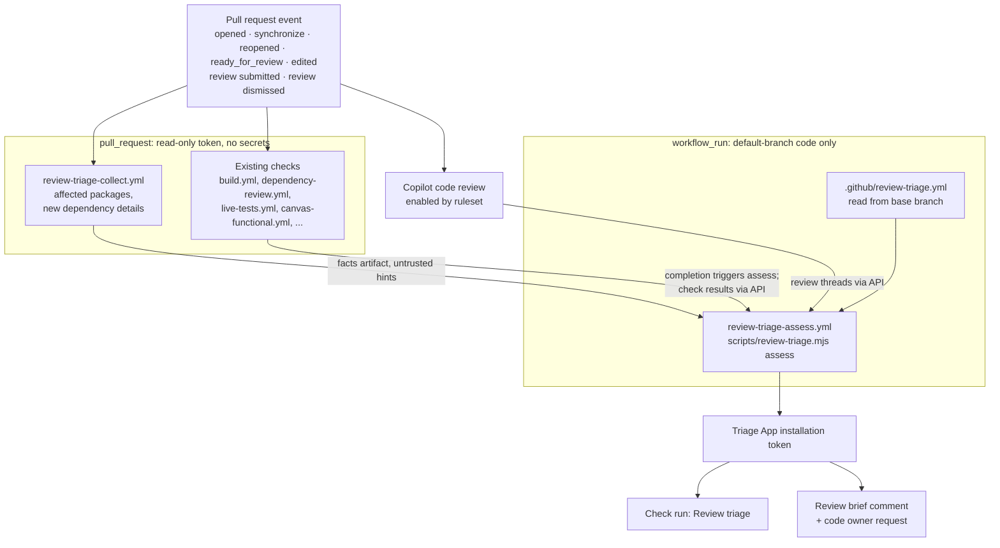

# Automated pull request review triage

- **Author**: Nell Shamrell-Harrington (@nellshamrell)
- **Date**: 2026-10

## Overview

Every pull request to this repository is reviewed by a maintainer or approver listed in [`.github/CODEOWNERS`](../../.github/CODEOWNERS). Reviewers need to answer four main questions each time: is the code functional, is it safe, is it maintainable, and does it comply with our linters and style guides. Much of the evidence for those answers is already produced by CI. The reviewer still has to collect it from a dozen checks, decide which of it applies to this change, and sometimes pull the branch down and run it locally to fill a gap.

This proposal adds an automated **review triage** step that runs whenever a pull request is opened or updated. It gathers the evidence CI already produces, adds a context-aware AI review, applies a repository-owned policy, and publishes one result: the author has something to fix, a human needs to look at something specific, or the change carries enough evidence to need no further reviewer attention. When it escalates, it tells the reviewer exactly which question it could not answer and why.

The triage step decides where reviewer attention goes. It does not approve pull requests and does not replace any existing required check.

## Terms and definitions

| Term           | Definition                                                                                                                                                                                         |
|----------------|----------------------------------------------------------------------------------------------------------------------------------------------------------------------------------------------------|
| Evidence       | A machine-verifiable result attached to a specific commit: a check conclusion, a coverage figure, a scanner finding, a dependency diff, or an AI review finding with a file location.              |
| Evidence gap   | A question the policy needs answered for this change that no evidence answers. For example, changed production code that no test exercises, or a check that applies to the change but did not run. |
| Finding        | A concrete problem with a location, a failure scenario, and a source (scanner, test, linter, or AI review).                                                                                        |
| Risk area      | A path or kind of change that the policy treats as needing human judgment regardless of evidence, such as workflow files or credential handling.                                                   |
| Triage outcome | One of `author-action`, `human-review`, or `no-reviewer-needed`. Defined in [Triage outcomes](#triage-outcomes).                                                                                   |
| Shadow mode    | Triage runs and records its outcome but blocks nothing and requests no one. Used to measure accuracy before enforcement.                                                                           |
| Review brief   | The single pull request comment triage writes when it escalates: what it checked, what it could not establish, and the specific decision it needs from a person.                                   |
| Triage App     | A dedicated GitHub App whose installation token publishes the triage check run, so branch rules can require the check from that App alone.                                                         |

## Objectives

> **Issue Reference:** N/A. No tracking issue exists yet; one should be opened when this design merges.

### Goals

1. On every pull request event that changes what would merge (`opened`, `synchronize`, `reopened`, `ready_for_review`, a base retarget, or a new push to the base branch), and on every review submitted or dismissed, produce an assessment of the four review questions for the current head commit.
2. Separate what tools can verify from what needs human judgment. Deterministic results (tests, linters, scanners) are authoritative; AI review adds context but never overrides a deterministic failure.
3. Send reproducible, mechanical problems (lint failures, failing tests, missing formatting) back to the author without consuming reviewer time.
4. Escalate to a human with a focused review brief when a change touches a risk area, when the evidence is incomplete, or when a finding needs judgment.
5. Keep untrusted pull request content away from credentials and write tokens.
6. Measure accuracy in shadow mode before triage gates anything.

### Non-goals

1. **Automatic approval or merge.** Triage never submits an approving review. Whether a `no-reviewer-needed` outcome may ever substitute for a human approval is a governance decision for maintainers, captured in [Open questions](#open-questions), and this design works either way.
2. **Replacing existing checks.** The jobs in [`build.yml`](../../.github/workflows/build.yml), [`dependency-review.yml`](../../.github/workflows/dependency-review.yml), and the other pull request workflows keep running and keep their current required status. Triage reads their results.
3. **Running the cloud end-to-end tier on pull requests.** [`cloud-e2e.yml`](../../.github/workflows/cloud-e2e.yml) deliberately avoids `pull_request_target` so fork code never reaches the Azure identity. This design keeps that decision. Triage reports when a change touches code that only that tier exercises, and escalates instead.
4. **A general code-quality score.** A single number hides which question failed and invites tuning to the number. Triage reports per-question results and named gaps.
5. **Style opinions beyond configured rules.** If a whitespace or naming choice passes ESLint, Prettier, and markdownlint as configured in [`.github/linters/`](../../.github/linters/), triage does not comment on it.

### User scenarios

#### User story 1: a mechanical problem

A contributor opens a pull request that fails `pnpm run format:check`. Today a reviewer may notice the red check, open the log, and comment. With triage, the outcome is `author-action`, the check summary names the failing rule and file, and no reviewer is requested until the author pushes a fix.

#### User story 2: a change to a risk area

A maintainer changes `.github/extension/` templates that are shipped into user repositories and bind OIDC environments. All checks pass. Triage still returns `human-review` because the path is a risk area, and its review brief lists which live contract tests ran ([`live-tests.yml`](../../.github/workflows/live-tests.yml)), which consumers it found, and what it could not test.

#### User story 3: a new dependency

A pull request adds a package to [`packages/core/package.json`](../../packages/core/package.json). Dependency review passes with no known vulnerabilities. Triage escalates anyway because a new third-party dependency is a risk area, and the brief summarizes the package's install scripts, maintainers, license, and why the AI review thinks it was added.

#### User story 4: a well-evidenced change

A pull request fixes a bug in one function in `packages/core`, adds a test that fails before the fix and passes after, keeps coverage at or above the [`coverage-baseline.json`](../../coverage-baseline.json) ratchet, and touches no risk area. The AI review raises no finding above the reporting threshold. Triage returns `no-reviewer-needed`, and the check summary shows the evidence it relied on.

## User experience

Contributors and reviewers see triage in two places.

1. **A check run named `Review triage`** on the head commit. Its conclusion maps to the outcome: `failure` for `author-action`, `action_required` for `human-review` until a code owner approves the current head, and `success` for `no-reviewer-needed`. The check summary is the full assessment.
2. **One review brief comment**, created or updated in place, only when the outcome is `human-review`. It reuses the single-comment pattern that [`scripts/canvas-visual-baselines.mjs`](../../scripts/canvas-visual-baselines.mjs) already uses for visual baseline status, with its own HTML marker.

**Sample input:** a pull request that adds a dependency and changes a workflow file.

**Sample output** (review brief):

```markdown
<!-- review-triage -->
### Review triage: human review needed

Assessed head `4f2a9c1` against `main` at `b81d3e0` with policy v3.

| Question       | Result       | Evidence                                                     |
|----------------|--------------|--------------------------------------------------------------|
| Functional     | Passed       | Build, Node tests, Chromium shards 1–2, artifact smoke tests |
| Safe: security | Needs review | New dependency `left-pad@2.0.0` has an install script        |
| Safe: context  | Needs review | `.github/workflows/build.yml` changed (risk area: CI)        |
| Maintainable   | Passed       | No unresolved Copilot threads                                |
| Lint and style | Passed       | ESLint, Prettier, markdownlint                               |

**Decisions needed**

1. Is a new runtime dependency acceptable for this change? The package runs `postinstall`.
1. The `static-checks` job now runs after `node-tests`. Is the slower critical path intended?
```

## Design

### High-level design

Triage has three stages with a deliberate privilege boundary between them.

1. **Collect (unprivileged).** A `pull_request` workflow computes facts that need the pull request's files checked out: the affected packages from the pnpm workspace graph and details of newly added dependencies, such as install scripts. It runs with `contents: read` and no secrets, exactly like the jobs in `build.yml`. It uploads those facts as an artifact. Collected facts are hints: they can add escalations but never remove one.
2. **Assess (privileged, trusted code only).** A `workflow_run` workflow, which always runs the workflow file from the default branch, runs each time the collect workflow or one of the relevant CI workflows completes. It derives everything the decision depends on from authenticated API reads it controls: the pull request's head and base SHAs, the changed-file list, check results, reviews, and Copilot review threads. It evaluates the base-branch policy against those, then folds in the collected facts as additional escalations.
3. **Publish (Triage App identity).** The assess job exchanges a Triage App credential for an installation token and writes the `Review triage` check run and, when needed, the review brief and reviewer request. Until every applicable check has completed, the check run stays `in_progress`.

The AI review is GitHub's [Copilot code review](https://docs.github.com/en/copilot/concepts/agents/code-review), enabled through a repository ruleset with **Review new pushes** turned on so every head commit is reviewed. It reviews the pull request on its own; triage reads its review threads as findings. Triage does not run its own model.

### Architecture diagram



### Detailed design

#### Assessing each question

The policy maps each question to the evidence that answers it in this repository. Every entry below names a check or script that exists today unless marked **new**.

| Question       | Evidence triage reads                                                                                                                                                                                                                                                                                                                                                              | Escalates when                                                                                                                                                                                                                                                                    |
|----------------|------------------------------------------------------------------------------------------------------------------------------------------------------------------------------------------------------------------------------------------------------------------------------------------------------------------------------------------------------------------------------------|-----------------------------------------------------------------------------------------------------------------------------------------------------------------------------------------------------------------------------------------------------------------------------------|
| Functional     | `build.yml`: `Static checks` (typecheck), `Tests, browser coverage and library candidates` (`pnpm run coverage`), `Canvas Chromium` shards, `Windows process integration`, and the per-plugin artifact smoke tests. `extension-selftests.yml` for `.github/extension/` changes. `live-tests.yml` for workflow templates. **New:** changed-line coverage from `coverage/lcov.info`. | A check that applies to the changed paths did not run or did not finish. Changed production lines have no test coverage. The change touches code exercised only by scheduled tiers ([`canvas-reliability.yml`](../../.github/workflows/canvas-reliability.yml), `cloud-e2e.yml`). |
| Safe: security | `dependency-review.yml`. **New:** CodeQL code scanning for JavaScript/TypeScript and GitHub Actions. Secret scanning push protection. New dependencies from the lockfile diff, including install scripts. Copilot review threads.                                                                                                                                                  | Any new third-party dependency. Any code scanning alert at or above `medium`. Any change in a security risk area (below). Any unresolved Copilot review thread.                                                                                                                   |
| Safe: context  | **New:** affected-package detection from the pnpm workspace graph, so a change to `packages/core` lists `adapter-shared`, `adapter-canvas`, and `graph-react` as consumers. Public contract paths. Copilot review threads about callers.                                                                                                                                           | A public contract changes (see risk areas). A shared package changes and a consumer's tests did not run. The change removes or renames an exported symbol.                                                                                                                        |
| Maintainable   | Copilot review threads. Coverage ratchet from [`coverage-baseline.json`](../../coverage-baseline.json) through [`vitest.config.ts`](../../vitest.config.ts).                                                                                                                                                                                                                       | A Copilot review thread is unresolved. Coverage regresses below the ratchet.                                                                                                                                                                                                      |
| Lint and style | `Static checks`: `pnpm run lint`, `pnpm run format:check`, `pnpm run version:check`. `extension-selftests.yml`: shellcheck. **New:** `pnpm run lint:md` on changed Markdown.                                                                                                                                                                                                       | Never escalates. Failures produce `author-action` with the rule and location.                                                                                                                                                                                                     |

Tests are evidence of behavior, not proof that the behavior is the intended one. For a bug fix, the strongest evidence is a test that fails on the base commit and passes on the head. Computing that requires running tests twice, so it is deferred to [Option 3](#option-3-on-demand-execution-agent) and listed in [Open questions](#open-questions).

#### Risk areas

Risk areas are glob patterns in the policy file. A change matching one always produces `human-review`, regardless of evidence. The initial set is chosen from code in this repository that already carries security or compatibility comments explaining why it is sensitive.

| Risk area                      | Patterns                                                                                                                       | Why                                                                                                                                                         |
|--------------------------------|--------------------------------------------------------------------------------------------------------------------------------|-------------------------------------------------------------------------------------------------------------------------------------------------------------|
| CI and release                 | `.github/workflows/**`, `.changeset/config.json`, `scripts/release-version.mjs`, `scripts/version.mjs`                         | Workflows hold tokens and decide what is published. `CODEOWNERS` already adds `@radius-project/on-call` here.                                               |
| Templates shipped to users     | `.github/extension/**`                                                                                                         | These run in user repositories with cloud OIDC credentials. `live-tests.yml` exists because a template change once broke generated deploys.                 |
| Cloud identity and credentials | `packages/adapter-canvas/src/server/routes/azure-auto-setup-application.ts` and other credential handlers listed in the policy | Creates Entra applications and federated credentials in user tenants.                                                                                       |
| Dependencies                   | `**/package.json` dependency fields, `pnpm-lock.yaml`, `pnpm-workspace.yaml`                                                   | Supply chain. `CODEOWNERS` already lists these for on-call.                                                                                                 |
| Plugin surface                 | `extensions/radius/**` manifests and skills                                                                                    | Public contract with the Copilot app and users.                                                                                                             |
| Triage itself                  | `.github/review-triage.yml`, `scripts/review-triage.mjs`, the triage workflows                                                 | A change to the policy must not approve itself. The policy is always read from the base branch, so a pull request that edits it is assessed by the old one. |

#### Triage outcomes

Triage evaluates rules in a fixed order. The first rule that matches decides the outcome.

1. A deterministic check that applies to the change failed, or a linter reported a violation: `author-action`. The summary links to the failing job and quotes the first error.
2. The change matches a risk area: `human-review`.
3. A required evidence item is missing (a check did not run, coverage is absent for changed lines, Copilot review did not complete): `human-review`, with the gap named.
4. A code scanning alert at or above the policy threshold, or a Copilot review thread, is unresolved: `human-review`.
5. The change is in the `no-reviewer-needed` allowlist and none of the above matched: `no-reviewer-needed`.
6. Otherwise: `human-review`.

Rule 6 makes the default fail closed. The allowlist starts narrow, for example documentation-only changes under `docs/` that pass markdownlint, and grows only when shadow-mode data shows triage was right for that class of change. Pull request size is not a criterion: a one-line change to authorization is not low risk.

Copilot code review comments carry no category or severity metadata, so triage does not filter them by type or threshold: any unresolved Copilot thread escalates. Thread resolution state comes from the GraphQL `reviewThreads` field, and completion is a submitted review by the Copilot reviewer for the current head SHA. A review with no comments is recorded as completed, but whether that silence counts as evidence is decided by measured precision in shadow mode, not assumed.

#### Freshness

Every assessment records the head SHA, the base SHA, and the policy version, and the assess job re-reads all three from the API immediately before publishing. If any changed while it ran, it discards the result and lets the newer run publish. Runs are serialized per pull request with a `concurrency` group.

A check run attaches to the head commit, so a new push naturally leaves the old result behind. A base change does not, because the head SHA stays the same. To cover that, collect also triggers on `edited` (which includes a retargeted base), and a separate `push` workflow on the default branch re-requests assessment for open pull requests that target it. Before reassessing, the assess job publishes the existing check run as `in_progress` so a stale `success` cannot be merged in the meantime.

A `human-review` outcome is published as `action_required`, which does not satisfy a required check. It moves to `success` only when a code owner has approved the current head. Collect also triggers on `pull_request_review` `submitted` and `dismissed`, so an approval or a dismissal starts a new assessment through the same unprivileged-to-privileged path. Collect does nothing extra for review events; it exists so the privileged step never runs on an event a pull request controls.

#### Option 1: Turn on GitHub-native features only

Enable Copilot code review on all pull requests through a ruleset, with **Review new pushes** on, enable CodeQL default setup and secret scanning, and mark the existing checks as required. Write no new code.

##### Advantages

- No code to maintain. All configuration is in repository settings.
- Contributors get AI and security feedback on every pull request 

##### Disadvantages

- Nothing decides which pull requests need a human. Every pull request still goes to a reviewer, who now has more comments to read.
- No record of which question failed or what evidence was missing, so there is nothing to measure.
- Copilot comments and check failures stay in separate places.

#### Option 2: Evidence aggregation in Actions with a Triage App identity

Implement the three-stage design above: an unprivileged collect workflow, a privileged assess workflow that runs only default-branch code, a policy file in the repository, and a dedicated GitHub App identity for the required check. Option 1's native features are inputs.

##### Advantages

- Uses infrastructure the repository already operates: pinned actions, `contents: read` defaults, artifact handoff, and the single-comment pattern from `canvas-visual-baselines.mjs`.
- The policy is versioned in the repository and reviewed like code, and is always evaluated from the base branch.
- Requiring the check from the Triage App means a pull request cannot satisfy it by adding a workflow job with the same name. Any job a pull request adds runs under the GitHub Actions identity, not the App.
- Deterministic and testable: the assessment is a pure function from facts, check results, and policy to an outcome, which fits the repository's Vitest-first testing rules.

##### Disadvantages

- `workflow_run` is a privileged trigger. GitHub's [secure use reference](https://docs.github.com/en/actions/reference/security/secure-use#mitigating-the-risks-of-untrusted-code-checkout) warns that it must never check out or execute pull request code, and that downloaded artifacts must be treated as untrusted. The design depends on following that rule exactly.
- Waiting for every applicable check adds latency. The assessment cannot finish before the slowest check.
- A GitHub App private key must be stored as a secret and rotated.

#### Option 3: On-demand execution agent

Add an agent that checks out the pull request in a disposable, network-restricted sandbox, builds it, and exercises a specific scenario: reproducing a reported bug, running the base-versus-head test comparison, or driving the Canvas through Playwright. This is the closest substitute for a reviewer pulling the branch locally.

##### Advantages

- Closes evidence gaps that static checks cannot, particularly "does this fix the reported bug" and behavior with no existing test.
- Its output is evidence (a trace, a failing-then-passing test, a screenshot) rather than opinion.

##### Disadvantages

- Executes untrusted code. It needs isolation equivalent to the unprivileged `pull_request` jobs, plus egress limits, and must never hold credentials.
- Slow and costly to run on every pull request.
- Its scenarios must be specified per change, which is itself a judgment call.

#### Option 4: Standalone GitHub App service

Run triage as a hosted service that receives webhooks, keeps state, and calls GitHub APIs, instead of running in Actions.

##### Advantages

- Can react to individual check completions without a polling or `workflow_run` fan-in.
- Natural home for cross-pull-request state such as precision metrics.

##### Disadvantages

- Requires hosting, uptime, and an on-call owner that this repository does not have today.
- Moves the policy evaluator out of the repository's normal review and test flow.

#### Proposed option

**Option 2, built on Option 1, with Option 3 deferred to a targeted follow-up.**

Option 1 is the first step regardless, because its features are inputs to everything else. Option 2 adds the missing part, a policy that decides who needs to look, with the least new infrastructure and a trust model the repository already uses. Its main risk, the privileged `workflow_run` trigger, is contained by running only default-branch code and treating the facts artifact as data. Option 3 is valuable but should be invoked only to close a named evidence gap, once shadow-mode data shows which gaps are common. Option 4 is unnecessary until Actions latency or state becomes a measured problem.

### API design

N/A. Triage adds no public API, canvas action, tool, or `packages/core` export. Its interfaces are a check run, a pull request comment, and the policy file below, all internal to this repository.

The policy file, `.github/review-triage.yml`, has this shape:

```yaml
version: 1
mode: shadow # shadow | advisory | enforce
riskAreas:
  - name: ci-and-release
    paths:
      - .github/workflows/**
      - .changeset/config.json
    reviewers: ["@radius-project/maintainers-ai-extensions"]
noReviewerNeeded:
  - name: docs-only
    paths:
      - docs/**
    requireChecks: ["Static checks"]
findings:
  codeScanningThreshold: medium
  copilotThreads: escalate-unresolved
requiredEvidence:
  - when: "packages/**/src/**"
    checks:
      - "Tests, browser coverage and library candidates"
      - "Static checks"
    changedLineCoverage: true
```

### Implementation details

#### Core package — packages/core

N/A. Triage is repository automation, not product logic, and must not ship in the plugin bundle.

#### Canvas adapter — packages/adapter-canvas

N/A. No Canvas behavior changes.

#### Shared adapter — packages/adapter-shared

N/A.

#### Plugin — extensions/radius

N/A. No skill, manifest, or marketplace change. The plugin's paths are inputs to the risk-area policy only.

#### Build & packaging

All new code lives under `scripts/` and `.github/`, following the pattern of `scripts/canvas-visual-baselines.mjs`: a dependency-free Node script with subcommands, invoked from workflows, tested from `packages/adapter-canvas/test/ci/` like the other repository scripts.

1. **`scripts/review-triage.mjs`** with subcommands:
   - `collect`: resolves affected packages from the pnpm workspace for the merge commit, using the same `git diff --name-only HEAD^1 HEAD` approach as the `changes` job in [`canvas-functional.yml`](../../.github/workflows/canvas-functional.yml). It also inspects newly added dependencies for install scripts, and writes `facts.json`.
   - `assess`: resolves the pull request from the triggering run's head repository and branch. It cannot rely on `workflow_run.pull_requests`, which is empty for fork pull requests. It reads the changed-file list, head and base SHAs, check runs, reviews, Copilot review threads, and code scanning alerts through the API. It validates `facts.json` against a strict schema (unknown keys, oversized fields, or path traversal rejected), loads the base-branch policy, and returns an outcome plus summary. The decision logic is a pure function so it can be tested without network access.
   - `publish`: writes the check run and review brief using the Triage App token.
2. **`.github/workflows/review-triage-collect.yml`**: `on: pull_request` with types `opened`, `synchronize`, `reopened`, `ready_for_review`, `edited`, and `on: pull_request_review` with types `submitted`, `dismissed`. `permissions: contents: read`, `persist-credentials: false`, no secrets. Uploads `facts.json`.
3. **`.github/workflows/review-triage-assess.yml`**: `on: workflow_run` with types `completed` for the collect workflow and for each CI workflow the policy lists (`Build`, `Dependency Review`, `Live upstream tests`, `Extension self-tests`, `Canvas Functional Tests`), so a late-finishing check triggers reassessment instead of waiting for the next push. `check_suite` cannot serve this purpose because GitHub does not trigger workflows from check suites that Actions created. Checks out the default branch only, never the pull request ref. Uses `actions/create-github-app-token` with the Triage App secret in a protected environment, and a per-pull-request `concurrency` group.
4. **`.github/workflows/review-triage-base.yml`**: `on: push` to `main`. Lists open pull requests that target `main` and dispatches a reassessment for each. It reads no pull request content.
5. **`.github/review-triage.yml`**: the policy.
6. **Repository settings**: Copilot code review ruleset with **Review new pushes** enabled and draft review disabled, CodeQL default setup, secret scanning push protection, and, at the enforce stage, `Review triage` as a required check restricted to the Triage App. Draft pull requests receive no assessment until `ready_for_review`.
7. **Changed-line coverage**: intersects `coverage/lcov.info`, which the `node-tests` job already uploads, with the diff hunks. Hunks must be computed against the merge commit that job tested, not the head commit, because `build.yml` checks out `github.sha` (the pull request merge commit). It can live in `scripts/review-triage.mjs` or extend [`scripts/coverage-summary.mjs`](../../scripts/coverage-summary.mjs).

This is repository tooling with no released package, so no Changeset is needed; such pull requests use the `pr:no-changeset` label described in [`changesets.yml`](../../.github/workflows/changesets.yml).

### Error handling

Triage fails closed: any error produces `human-review`, never `no-reviewer-needed`.

| Scenario                                                      | Behavior                                                                                                                                                                                                      |
|---------------------------------------------------------------|---------------------------------------------------------------------------------------------------------------------------------------------------------------------------------------------------------------|
| Facts artifact missing, malformed, or fails schema validation | `human-review` with gap "triage could not read change facts". The artifact is never interpreted beyond the schema.                                                                                            |
| An applicable check has not completed                         | The check run stays `in_progress`, which does not satisfy a required check. The workflow's completion triggers a new assessment. A check that never starts is an evidence gap after a policy-defined timeout. |
| Copilot code review unavailable or not completed              | Evidence gap. Copilot review is not treated as having found nothing.                                                                                                                                          |
| GitHub API rate limit or transient error                      | Retry with backoff inside the job. If retries are exhausted, publish `human-review` with the error.                                                                                                           |
| Triage App token cannot be created                            | The job fails visibly. Because the required check never reports, the pull request cannot merge, which is the fail-closed result.                                                                              |
| Policy file invalid                                           | The assess job fails before publishing. Policy changes are themselves a risk area and have a unit test that parses the committed file.                                                                        |
| Fork pull requests                                            | Collect runs with a read-only token as today. Assess runs from the default branch, so forks are handled identically without granting them anything.                                                           |

## Test plan

The repository's [code-quality rules](../../.github/instructions/code-quality.instructions.md) apply to `scripts/review-triage.mjs`, with a goal of 100% line, branch, function, and statement coverage. Its tests go in `packages/adapter-canvas/test/ci/review-triage.test.mjs`, which the `adapter-canvas` Vitest project already discovers, alongside existing script tests such as `canvas-visual-baselines.test.mjs`. The script would also be added to `coverage.include` and given per-file 100% thresholds in [`vitest.config.ts`](../../vitest.config.ts), like the existing skill scripts.

1. **Policy evaluation (unit).** Table-driven tests over the outcome rules: each rule in isolation, rule ordering, the fail-closed default, risk-area glob matching, allowlist matching, and freshness against a stale approval, a changed base, and a changed policy.
2. **Facts validation (unit).** Malformed JSON, unknown keys, oversized arrays, paths with `..` or absolute prefixes, and non-UTF-8 content are all rejected. Facts that omit a risk-area path the API reports still escalate.
3. **Collect (unit).** Changed paths to affected packages using a fixture pnpm workspace. Lockfile diffs to added dependencies, including a dependency with an install script.
4. **Changed-line coverage (unit).** LCOV fixtures intersected with diff hunks, including renamed files and deleted lines.
5. **Publish and API reads (boundary).** Injected `fetch` fakes, as the comment tests in `canvas-visual-baselines.test.mjs` use: create versus update of the single comment, check run conclusion mapping, fork pull request lookup without `workflow_run.pull_requests`, review-thread resolution, and idempotence on repeated runs for the same SHA.
6. **Policy file (configuration check).** A test parses the committed `.github/review-triage.yml` and asserts every referenced check name exists as a job name in a workflow under `.github/workflows/`, so renaming a job cannot silently create a permanent evidence gap.
7. **Workflow security (configuration check).** Extending the approach in `packages/adapter-canvas/test/ci/workflow-boundaries.test.ts`, a test asserts the assess and base workflows never check out `github.event.workflow_run.head_sha` or a pull request ref, and that the collect workflow has no `secrets` references and only `contents: read`.
8. **Shadow-mode evaluation (operational).** For at least four weeks, record every outcome alongside what human review actually found. Report misses (a human found a material defect on a `no-reviewer-needed` outcome), unnecessary escalations, and evidence-gap frequency. The enforce stage requires zero material misses in the allowlisted categories.

## Security

| Threat                                                                     | Mitigation                                                                                                                                                                                                                                                                                                                                                   |
|----------------------------------------------------------------------------|--------------------------------------------------------------------------------------------------------------------------------------------------------------------------------------------------------------------------------------------------------------------------------------------------------------------------------------------------------------|
| Pull request code runs with privileged credentials ("pwn request")         | Only the collect stage touches pull request files, and it runs under `pull_request` with `contents: read` and no secrets. The assess stage runs default-branch code from `workflow_run` and never checks out pull request content.                                                                                                                           |
| Crafted facts artifact manipulates the assessment                          | Everything the outcome depends on (changed files, SHAs, check results, reviews, threads) is read from the API by trusted code. The artifact is validated against a strict schema with size limits, and its facts can only add escalations. Omitting or falsifying a fact cannot clear a risk match, satisfy a required check, or reach `no-reviewer-needed`. |
| A pull request spoofs the `Review triage` check by adding a same-named job | The required check is restricted to the Triage App as its expected source, per GitHub's [required status checks](https://docs.github.com/en/repositories/configuring-branches-and-merges-in-your-repository/managing-protected-branches/about-protected-branches#require-status-checks-before-merging).                                                      |
| A pull request weakens the policy and is assessed by the weakened policy   | The policy is read from the base branch. Policy and triage code are a risk area, so changes to them always need human review.                                                                                                                                                                                                                                |
| Prompt injection through pull request text or code steers the AI review    | Copilot review findings can only escalate, never clear an escalation. A silent or manipulated AI review cannot produce `no-reviewer-needed` unless every deterministic rule also passes and the change is allowlisted.                                                                                                                                       |
| Script injection from pull request titles, branch names, or file names     | No `${{ github.event.* }}` value is interpolated into `run:` blocks. Values pass through `env:` and are handled as data, following the pattern in `canvas-functional.yml` and `build.yml`.                                                                                                                                                                   |
| Triage App private key leak                                                | Stored as an environment secret on a protected environment used only by the assess job. The App has only `checks: write`, `pull-requests: write`, and read permissions. Rotated on a schedule.                                                                                                                                                               |
| Third-party action compromise                                              | All actions pinned by full commit SHA, matching existing workflows. Dependabot already updates them.                                                                                                                                                                                                                                                         |

## Compatibility

No product or plugin behavior changes. Contributor-visible changes:

1. A new `Review triage` check appears on every pull request. During shadow mode it is neutral and not required.
2. Copilot code review comments appear on pull requests once the ruleset is enabled.
3. At the enforce stage, `Review triage` becomes required. Because a `human-review` outcome only clears after a code owner approves, this does not change who can merge, only when reviewers are pulled in.
4. Renaming a job in an existing workflow can create an evidence gap. The configuration check in the test plan catches this in the same pull request.

## Monitoring and logging

1. **Check summary.** Every run writes the full assessment, including head SHA, base SHA, policy version, evidence read, gaps, and the matched rule, to the check run and to `$GITHUB_STEP_SUMMARY`.
2. **Assessment artifact.** The assess job uploads `assessment.json` with a 90-day retention so outcomes can be compared against later human review.
3. **Shadow-mode report.** A scheduled job aggregates the past week's `assessment.json` artifacts against merged pull request reviews and opens or updates a tracking issue, following the open-or-update pattern in `canvas-reliability.yml`'s `notify-scheduled-result` job.
4. **Troubleshooting.** A reviewer who disagrees with an outcome reads the matched rule in the check summary. A wrong rule is fixed in `.github/review-triage.yml`; a wrong fact is fixed in `scripts/review-triage.mjs`.

## Development plan

Each step is independently mergeable and leaves the repository in a working state.

1. **Native features.** Enable Copilot code review by ruleset with **Review new pushes** on, CodeQL default setup including Actions, and secret scanning push protection. Settings only.
2. **Collect and assess in shadow mode.** Add `scripts/review-triage.mjs` (`collect`, `assess`), its tests, the two workflows, and an initial policy with risk areas and an empty allowlist. Publish a neutral check using `GITHUB_TOKEN`; no App, no comment, no reviewer request.
3. **Changed-line coverage and affected-package detection.** Add the two new evidence sources and their tests.
4. **Triage App and review brief.** Create the App, move publishing to its token, add the review brief comment and code owner request. Outcomes become visible but remain non-blocking (`mode: advisory`).
5. **Shadow-mode evaluation.** Four or more weeks of measurement and policy tuning. Populate the allowlist from evidence.
6. **Enforce.** Make `Review triage` a required check restricted to the Triage App. Maintainers decide separately whether `no-reviewer-needed` relaxes any existing approval requirement.
7. **Targeted execution (Option 3).** Design separately, scoped to the evidence gaps step 5 shows are most common.

## Open questions

1. **Q: May a `no-reviewer-needed` outcome ever replace a required human approval?** This is a governance question for the maintainers, not a technical one. The design is useful without it: triage still filters mechanical problems out of reviewer queues and focuses escalations. GitHub offers no direct mechanism for this: a ruleset bypass applies to the actor performing the merge, so granting one to the Triage App would not let a maintainer merge on its behalf. Answering yes would need a separate enforcement design.
2. **Q: Should the base-versus-head test comparison for bug fixes run on every pull request?** It doubles test time. A lighter alternative is to run only the tests added in the pull request against the base commit.
3. **Q: How should triage treat Dependabot pull requests?** [`dependabot-manager.yml`](../../.github/workflows/dependabot-manager.yml) already runs a shared manager workflow on them. They are always dependency risk-area changes, so they would always escalate unless the policy has a separate rule for patch updates with no new transitive packages.
4. **Q: Who owns the Triage App?** It needs an owner in the `radius-project` organization and a rotation schedule for its key. The [`radius-project/.github`](https://github.com/radius-project/.github) repository syncs shared workflows such as `dependency-review.yml`; triage could eventually live there for other Radius repositories.
5. **Q: How long should triage wait for a check that never starts?** Completed workflows trigger reassessment, but a workflow that is skipped by path filters or never queued produces no event. The timeout needs to exceed the slowest job, currently the 30-minute Chromium shards, without leaving pull requests pending for long.
6. **Q: Should Copilot review threads be classified before escalating?** Comments carry no category or severity, so version 1 escalates every unresolved thread. If shadow mode shows that is too noisy, classification would need its own design.

## Alternatives considered

1. **A single `pull_request_target` workflow.** Simpler than a two-workflow split, and this repository already uses that trigger safely in `changesets.yml` and `pr-author.yml` because neither executes pull request code. Triage needs facts computed from pull request files, which is exactly the case GitHub warns against. Rejected.
2. **A self-hosted LLM reviewer instead of Copilot code review.** More control over prompts and output format, but it adds model hosting, credential handling, and a second AI review on top of the one the organization already licenses. Revisit only if Copilot review output cannot be consumed reliably.
3. **Labels to signal review need.** Labels are easy to read but any user with triage permission can remove them, and they are not enforceable. The check run is the authoritative signal; a label may be added for filtering.
4. **Path-based reviewer assignment through `CODEOWNERS` alone.** `CODEOWNERS` already requests the right teams by path, but it cannot tell an evidenced change from an unevidenced one, and this repository's `CODEOWNERS` is synced from `radius-project/.github` and must not be edited locally. Triage complements it rather than replacing it.
5. **A numeric risk score with a threshold.** Rejected for the reasons in [Non-goals](#non-goals): it obscures which question failed.

## Design review notes

<!--
Record the decisions made during design review. Update this before the design is
merged/approved.
-->
