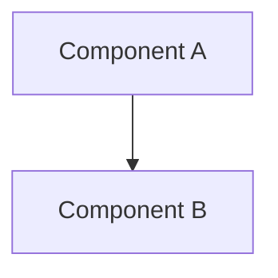

# Title

<!--
Replace "Title" with a short, descriptive title for the design. Keep the file
name in the form `YYYY-MM-short-name.md` (e.g. `2026-07-control-plane-state-ghcr.md`).
-->

- **Author**: Your name (@YourGitHubUserName)
- **Date**: YYYY-MM

## Overview

<!--
Provide a succinct high-level description of the component or feature and
where/how it fits in the big picture. One to three paragraphs, understandable
by someone outside the immediate project. Do not put design details here —
there is a dedicated Design section below.
-->

## Terms and definitions

<!--
Include any terms, definitions, or acronyms used in this document to assist the
reader. They may or may not be part of the user-facing experience once
implemented, and can be specific to this design context.
-->

## Objectives

<!--
Describe goals/non-goals and the user scenarios that motivate this work.
If this feature shares objectives with an existing design, link to that doc and
section rather than repeat context.
-->

> **Issue Reference:** <!-- (If appropriate) Link an existing issue that describes the feature or bug. -->

### Goals

<!--
Why are we doing this work, how will we make priority decisions, and how will we
determine success?
-->

### Non-goals

<!--
What are we explicitly not focusing on right now? List follow-ups and
out-of-scope items with a brief explanation of why each is a non-goal.
-->

### User scenarios (optional)

<!--
Describe the user scenarios for this design. Define the roles and personas where
API/UX design is involved. Link to an existing issue if one describes them.
-->

#### User story 1

#### User story 2

## User experience (if applicable)

<!--
If this changes the user experience, describe the expected interaction flow.
For CLI or canvas interactions, include sample inputs and outputs. Include a
Bicep/Helm sample if the proposal updates that experience. Write N/A if not
applicable.
-->

**Sample input:**

**Sample output:**

## Design

### High-level design

<!--
High-level overview of the data flow and key components. Use diagrams and
top-level explanations to convey the architecture. Treat components as black
boxes here; call out new components and dependencies. Point to a more detailed
design below.
-->

### Architecture diagram

<!--
Provide a diagram of the system architecture showing how components interact in
this proposal. Prefer a fenced ```mermaid``` block so it renders in GitHub.
Include a high-level diagram plus component-specific diagrams where useful.
-->



### Detailed design

<!--
Detailed and thorough enough that another developer could implement your design
and estimate the cost with high confidence — but not as detailed as the code.
Give each change its own section. Cover the important decisions, including names.
If the architecture is layered, align these sections with the layers.
-->

#### Option 1: TODO

##### Advantages

<!-- What is good about this option relative to the others? -->

##### Disadvantages

<!-- What is not ideal? What does it lock us into? What are the risks? -->

#### Option 2: TODO

##### Advantages

##### Disadvantages

#### Proposed option

<!-- Describe the recommended option and the reasoning behind it. -->

### API design (if applicable)

<!--
Any design that changes a public REST API, CLI arguments/commands, or Go/TS APIs
for shared components should describe it here. Include API paths and sample
request/response payloads. Write N/A if not applicable.
-->

### Implementation details

<!--
High-level description of updates to each affected component in this repository.
Delete the subsections that do not apply.
-->

#### radius-core (if applicable)

<!-- UI-agnostic product logic: modeling, graph, platforms, ports, workflows. -->

#### Canvas adapter — adapters/canvas (if applicable)

<!-- SDK wiring, canvas/tools, loopback HTTP host, pages/server, build pipeline. -->

#### Shared adapter — adapters/shared (if applicable)

#### Plugin — plugins/radius (if applicable)

<!-- Skills, canvas extension packaging, plugin.json / marketplace.json. -->

#### Build & packaging (if applicable)

<!-- esbuild bundle, artifact handling, CI, release/versioning (Changesets). -->

### Error handling

<!--
Describe the error scenarios that may occur and the corresponding recovery,
error handling, and user experience.
-->

## Test plan

<!--
Describe how the feature will be validated, including unit and functional tests.
Call out new testing challenges: new dependencies, external assets tests must
access, or features that do I/O and are hard to unit test.
-->

## Security

<!--
Describe any changes to the security model or new security challenges. For each
challenge describe the threat and its mitigation. Examples: authentication,
storing secrets/credentials, cryptography, supply-chain. If there are no new
challenges, describe how the feature uses existing security features.
-->

## Compatibility (optional)

<!--
Describe potential compatibility issues with other components, incompatibility
with older CLIs/plugins, and any breaking changes to behavior or APIs.
-->

## Monitoring and logging

<!--
List instrumentation (metrics, logs, traces) used to diagnose this feature and
how to troubleshoot it with that instrumentation.
-->

## Development plan

<!--
How will you deliver this? Align work items to features/scenarios, define what
gets checked in at each step, and estimate the cost of each item — including
unit and functional tests.
-->

## Open questions

<!--
(Q&A format) The important unknowns or things you are unsure about. Use the
review discussion to answer these with experts after people digest the design.
-->

## Alternatives considered

<!--
Describe alternative designs considered or worth considering, and justify why
they should be rejected where possible.
-->

## Design review notes

<!--
Record the decisions made during design review. Update this before the design is
merged/approved.
-->
