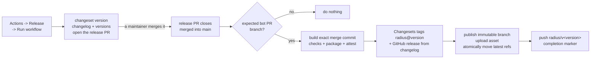

# Releasing

This is the reference: how the release works and why. If you just need to cut one, follow the [release runbook](./RELEASE_RUNBOOK.md) instead.

This repo ships exactly one artifact: the **`radius` plugin** under [`plugins/radius/`](../../plugins/radius). Everything else - the three `@radius-project/*` packages - is implementation detail that gets bundled into the plugin's `extension.mjs` and is never published to a registry.

Three things follow from that, and they are the things to understand before releasing:

1. **[Changesets v3](https://changesets.dev/) owns the release.** It decides the version, writes the changelog, opens the release pull request, and creates the canonical package tag and the GitHub release. Nothing in this repo picks a version, names a tag, or writes release notes. The flow is the standard [versioning and publishing](https://changesets.dev/guide/versioning-and-publishing) loop: the v3-compatible [Changesets GitHub Action v2](https://github.com/changesets/action) prepares the version PR, then performs [tag-only publishing](https://changesets.dev/guide/automating#publish-git-tags-only) because this repo ships a git branch rather than an npm package.
2. **There are two channels.** Every merge to `main` refreshes the rolling **edge** channel automatically. A **stable** release is cut deliberately: a maintainer runs the Release workflow, and merging the pull request it opens publishes the release.
3. **Every published bundle is attested.** Both channels record signed [build provenance](https://github.com/actions/attest), so a consumer can verify which workflow, repository and commit produced the canvas bundle.

| Channel    | Install ref                                             | Version                      | Refreshed                       |
|------------|---------------------------------------------------------|------------------------------|---------------------------------|
| **edge**   | `releases/edge` (tag `edge`)                            | `0.2.0-edge-<utc-timestamp>` | every push to `main`            |
| **stable** | `releases/latest` (tag `latest`)                        | `0.2.0`                      | every release                   |
| **pinned** | `releases/radius/v0.2.0` (artifact tag `radius/v0.2.0`) | `0.2.0`                      | never - created once, immutable |
| **source** | source commit on `main` (Changesets tag `radius@0.2.0`) | `0.2.0`                      | never - created once, immutable |

## Packages

| Package directory          | npm name                         | Role                                                |
|----------------------------|----------------------------------|-----------------------------------------------------|
| `plugins/radius/`          | `radius`                         | **The shipped artifact.** Manifest, skills, bundle. |
| `packages/core/`           | `@radius-project/core`           | UI-agnostic product core.                           |
| `packages/adapter-shared/` | `@radius-project/adapter-shared` | Shared adapter helpers.                             |
| `packages/adapter-canvas/` | `@radius-project/adapter-canvas` | Copilot canvas adapter; builds the bundle.          |

All four are `private: true` and none is published to a registry. The three `packages/*` entries are listed in `ignore` in [`.changeset/config.json`](../../.changeset/config.json), so their `version` fields are inert - nothing consumes them, and internal dependencies use `workspace:*`, which resolves by path rather than by range.

Because every package is private, [`privatePackages`](https://changesets.dev/guide/config#privatepackages) is set to `{ "version": true, "tag": true }` - the [Beyond npm](https://changesets.dev/guide/beyond-npm) setup that lets Changesets version and tag packages it will never publish to a registry. `radius` is therefore the only package that is versioned, changelogged and tagged.

## Where the version lives

[`plugins/radius/package.json`](../../plugins/radius/package.json) is the **single source of truth**. Every other version string is derived from it by [`scripts/version.mjs`](../../scripts/version.mjs):

| File                              | How it gets its version                                                                                            |
|-----------------------------------|--------------------------------------------------------------------------------------------------------------------|
| `plugins/radius/package.json`     | Bumped by `changeset version`. **Source of truth.**                                                                |
| `plugins/radius/plugin.json`      | Derived - `version`.                                                                                               |
| `.github/plugin/marketplace.json` | Derived - `metadata.version` and both plugin entries; an edge publish restamps `radius-edge` in its own workspace. |
| `packages/*/package.json`         | Not versioned - ignored by Changesets.                                                                             |

`pnpm run version` is `changeset version` followed by that sync, and it is the command the release workflow runs. CI runs `pnpm run version:check` and fails the build if the derived files drift; `pnpm run version:sync` repairs them. Never hand-edit a derived version.

The catalog on `main` is the manifest end users add, so both of its plugin entries carry the released version. The rolling `radius-edge` entry is only restamped with the snapshot version inside the edge publish workspace, which never reaches `main`.

> The marketplace's `metadata.version` currently tracks the plugin version because there is exactly one plugin. If this marketplace ever lists a second plugin, decouple that field.

## Day-to-day: add a changeset

Include one in any PR that changes behaviour:

```bash
pnpm changeset
```

Changesets offers only `radius`, because that is the only thing this repo ships. Choose `patch` / `minor` / `major` and write a summary aimed at someone who installed the plugin - not at someone reading the source. Commit the generated `.changeset/*.md`.

Describing the change in terms of the internal package that happened to change is the failure mode to avoid: those packages have no changelog, so that detail lands nowhere a user will see it.

The non-blocking Changesets workflow creates or updates a pull request comment showing whether a release changeset is present. Documentation, tests, and build-only changes may intentionally omit one or use `pnpm changeset --empty`; the release pull request itself is exempt because `changeset version` has already consumed its changesets. Labelling a pull request `pr/no-changeset` records the omission as deliberate and swaps the reminder for a note that it was waived - nothing is blocked either way, so the label is documentation for reviewers rather than an override.

## Cutting a release

Releases are deliberate. [`.github/workflows/release.yml`](../../.github/workflows/release.yml) never versions anything on its own: it prepares a release only when a maintainer asks, and publishes only once that release pull request lands.



1. Land ordinary pull requests, each carrying a changeset. Nothing ships; every merge only refreshes the [edge channel](#what-the-edge-channel-does).
2. When you want a stable release, run **Actions → Release → Run workflow** from `main`. `changeset version` applies the pending changesets, writes `plugins/radius/CHANGELOG.md`, syncs the derived manifests, and opens a pull request titled `chore(release): version packages` on the `changeset-release/main` branch. Its body lists everything that will ship.
3. Review it like any other pull request and merge it.
4. The merged event for that bot-authored `changeset-release/main` pull request builds the exact merge commit and runs the complete check suite before publishing anything. The Changesets action then tags that commit `radius@<version>` and publishes its changelog entry as the GitHub release; the workflow publishes the immutable install branch, uploads the release asset, atomically activates `releases/latest` plus `latest`, and finally pushes `radius/v<version>` as the completion marker. Newer pending changesets do not hide the prepared release.

Re-running the dispatch before step 3 updates the same pull request rather than opening a second one. To preview the changelog locally without touching `main`, run `pnpm run version` and inspect the result.

### Prerequisites and constraints

- The repository automation GitHub App identified by `DEPENDABOT_MANAGER_BOT_CLIENT_ID` and `DEPENDABOT_MANAGER_BOT_PRIVATE_KEY` must have Contents and Pull requests write permissions. Its short-lived token authors the release PR, so the normal `pull_request` build runs against the versioned branch.
- The version-only action uses the GitHub API by default, so GitHub creates and signs the version commit through the API. The publish step is the exception: it sets `push-with-git-cli: true`, because the API path tags `github.sha`, which on a `pull_request` event is the ephemeral `refs/pull/<n>/merge` commit rather than the merge commit on `main`. Over the Git CLI it pushes the tag Changesets created at the checked-out source commit.
- Only `workflow_dispatch` invokes the version action. Stable publication only accepts a merged, same-repository, bot-authored pull request from `changeset-release/main` whose commit still matches the version and changelog and carries no leftover changesets, so an ordinary version/changelog edit on `main` cannot cut a release.
- Complete workflow runs are queued with `queue: max`; a later dispatch or release-PR merge cannot cancel an earlier run. The stable build receives the pull request's explicit merge SHA, so retries never bundle later unreleased changes.
- The publish checkout does not persist its write credential. Dependency installation runs without Git authentication, and `gh auth setup-git` configures the short-lived job token only inside the final ref-publishing step.
- Neither release job compiles anything - the bundle arrives as a build artifact and the only dependency they run is the Changesets CLI - so both install with `--ignore-scripts`. Dependency lifecycle scripts therefore never execute in a job holding the GitHub App token or the ability to move published refs. `build.yml` keeps them enabled because it does build the bundle.
- `radius/v<version>` is pushed last. Until that completion tag exists, rerun the original failed workflow; it rebuilds the expected orphan tree and reuses an existing immutable branch only when every published byte matches, then restores the rolling refs and retries the asset upload. Changesets creates the tag and the GitHub release exactly once and skips both on a rerun, because the tag it would create already exists. The original run is required because signed provenance records its event SHA and cannot substitute a later push's SHA. A rerun never moves `releases/latest` or `latest` backwards: if a newer release already published them, the rerun finishes its own immutable refs and leaves the rolling ones alone.

## If a package is ever published

Publishing (say) `@radius-project/core` so third parties can build their own adapters would change the model: remove it from `ignore` in `.changeset/config.json`, flip `private` to `false`, and start naming it in changesets alongside `radius`. Nothing here has to be undone first - the `ignore` list is the only thing standing between this setup and full independent per-package versioning.

## What the edge channel does

[`.github/workflows/publish.yml`](../../.github/workflows/publish.yml) runs on every push to `main`. It typechecks, lints, tests, and builds the plugin into `plugins/radius/dist/`, attests the bundle's provenance, then:

- **force-recreates `releases/edge` as an orphan branch** whose single root commit contains nothing but the otherwise git-ignored `plugins/radius/dist/` and the marketplace catalog, and
- **force-moves the `edge` tag** onto that commit in the same atomic push.

Because Changesets owns the version, an edge build cannot claim to be a release: the build runs [`changeset version --snapshot edge`](https://changesets.dev/guide/snapshot-releases) to ask what the next release *will* be and stamps that with an `edge` prerelease tag, for example `0.1.0-edge-20260807014054`. Before running it, CI adds an ephemeral `radius` patch changeset, so documentation-only pushes and pushes containing only an empty changeset still become a Changesets-calculated snapshot of the next patch; any pending minor or major changeset takes precedence. The rewrite and synthetic changeset exist only in the CI workspace and are never committed.

`plugins/radius/dist/` is a complete, self-contained plugin: `plugin.json`, `package.json`, `README.md`, all of `skills/`, and the compiled `extension.mjs` (plus its source map). The build assembles it, so nothing is copied separately in CI.

Because the branch is an orphan, it carries **no source and no history** - a clone of `releases/edge` contains only the artifact. The commit message records the `main` SHA it was built from, which is the only link back to the source. A CI guard fails the publish if anything outside `plugins/radius/dist/` lands in the tree.

The plugin sources in [`.github/plugin/marketplace.json`](../../.github/plugin/marketplace.json) pin `path: plugins/radius/dist`: `radius-edge` follows the `edge` tag and `radius` follows `latest`. Each install therefore resolves matching skills and canvas files from one generated artifact commit. This is why the build output can stay git-ignored on `main`.

Both `releases/edge` and `edge` are replaced wholesale on every push to `main`, so superseded bundles become unreferenced objects rather than permanent repository growth. See [docs/design/2026-07-canvas-bundle-publishing.md](../design/2026-07-canvas-bundle-publishing.md) for the full design.

Complete edge workflow runs are queued FIFO with `queue: max`, including the build. Each run passes its immutable push SHA to the reusable build, preserving every `main` push and preventing a slower original run from publishing out of order. A manually rerun workflow falls outside that original queue order, so the publisher compares its SHA with the source SHA recorded by the current edge commit: same-source retries and descendants may publish, stale ancestors are skipped, and divergent histories fail. The branch and tag move atomically after that check.

## What a versioned release produces

| Artifact                               | Created by          | Mutable? | Purpose                                                                        |
|----------------------------------------|---------------------|----------|--------------------------------------------------------------------------------|
| `radius@<version>` tag                 | `changesets/action` | **no**   | Canonical Changesets tag pointing at the released source commit on `main`.     |
| GitHub release                         | `changesets/action` | no       | Body is the Changesets `CHANGELOG.md` entry; carries the attested tarball.     |
| `releases/radius/v<version>` branch    | `release.yml`       | **no**   | Pinned install target: the same orphan layout as `releases/edge`, one version. |
| `radius/v<version>` tag                | `release.yml`       | **no**   | Points at the pinned artifact branch and marks publication complete.           |
| `releases/latest` branch, `latest` tag | `release.yml`       | yes      | Stable install target: force-moved to the newest release.                      |

Everything local that can fail - checks, build, packaging and attestation - happens before the first push. Changesets then tags the source commit and publishes the release notes; the pinned branch is immutable and pushed without `--force`, and a retry constructs the expected artifact tree from its rebuilt files and reuses an existing branch only when its tree ID matches exactly. The GitHub release and its asset complete before `releases/latest` and `latest` move atomically, and the immutable `radius/v<version>` artifact tag is pushed last.

The two branches carry an identical `plugins/radius/dist/`; they differ only in the catalog's `source.ref`, which each one points at itself. So `marketplace add radius-project/ai-extensions#releases/radius/v0.1.0` pins that exact release, and `#releases/latest` tracks stable - neither redirects to edge.

> The catalog exposes `radius-edge` through the rolling `edge` tag and `radius` through `latest`. The stable entry becomes installable after the first stable release; use the explicitly named edge entry before then.

### Why there are two version tags

`radius@<version>` is Changesets' canonical format: [`changeset git-tag`](https://changesets.dev/guide/cli#git-tag) writes `<pkg-name>@<version>` for workspace repos and it is not configurable. It points to the source commit, keeping Changesets' already-tagged detection and a meaningful link into `main` history. `radius/v<version>` is this repository's artifact tag; it points to the matching orphan install commit on `releases/radius/v<version>` and doubles as the workflow's publication-complete marker.

## Verifying a published bundle

Every published `extension.mjs` - and every release tarball - carries signed provenance tying it to the workflow, repository and commit that built it:

```bash
gh release download 'radius@0.1.0' --pattern 'radius-plugin-*.tar.gz'
gh attestation verify radius-plugin-0.1.0.tar.gz --repo radius-project/ai-extensions
```

The same works for a bundle taken straight off an install target, since provenance is matched by digest:

```bash
gh attestation verify ~/.copilot/installed-plugins/radius-plugins/radius/extension.mjs \
  --repo radius-project/ai-extensions
```

A stable release publishes from the merged release pull request, so its provenance records the workflow ref as `refs/pull/<number>/merge` rather than `refs/heads/main`. Verifying by repository - as above - is unaffected; a policy written against `--signer-workflow` or a branch ref has to account for it.

## Why Changesets (vs. changie / git-cliff)

| Tool           | Model                                                                                                                                   | Fit for this repo                                                                                                                                                            |
|----------------|-----------------------------------------------------------------------------------------------------------------------------------------|------------------------------------------------------------------------------------------------------------------------------------------------------------------------------|
| **Changesets** | Developer-authored change fragments; JS/pnpm-native. Bumps versions, rewrites `workspace:*` ranges, writes changelogs, and can publish. | **Chosen.** Native to pnpm workspaces, and its `ignore` list lets one workspace package be the only versioned artifact.                                                      |
| changie        | Developer-authored fragments (YAML/TOML), language-agnostic.                                                                            | Similar dev-managed model, but not workspace-aware - it won't bump versions or rewrite internal dependency ranges, so we'd hand-roll that.                                   |
| git-cliff      | Automated changelog from [Conventional Commits](https://www.conventionalcommits.org/); no per-change files.                             | Great for single packages, but it generates changelog text only - it does not decide version bumps or update workspace deps, and quality depends entirely on commit hygiene. |

Changesets gives us the same **developer-curated** changelog quality as changie while also handling the **workspace versioning mechanics** (lockstep bumps + `workspace:*` propagation) that changie and git-cliff leave to us. If we later prefer commit-driven automation, git-cliff can be layered on without removing Changesets' version management.
