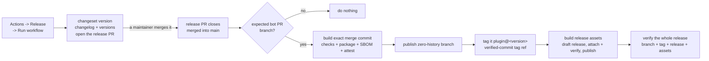

# Releasing

This is the reference: how the release works and why. If you just need to cut one, follow the [release runbook](./RELEASE_RUNBOOK.md) instead.

This repo ships **plugins** - today exactly one, the `radius` plugin, whose manifest and readme live under [`plugins/radius/`](../../plugins/radius) and whose canvas extension lives under [`extensions/radius/`](../../extensions/radius). Everything else - the three `@radius-project/*` packages - is implementation detail that gets bundled into a plugin's `extension.mjs` and is never published to a registry. The pipeline is written for the plural case throughout, so a second plugin needs no change to it.

Three things follow from that, and they are the things to understand before releasing:

1. **[Changesets v3](https://changesets.dev/) owns version selection and release notes.** It decides each plugin's version, writes its changelog, and supplies the canonical `<plugin>@<version>` tag name. The v3-compatible [Changesets GitHub Action v2](https://github.com/changesets/action) opens the version PR. After validation, the workflow creates that one tag for the released plugin only, on the orphan artifact commit rather than on the source commit; `changeset git-tag` cannot be used in a matrix leg because it scans every eligible workspace package.
2. **There are two channels.** Every merge to `main` refreshes the rolling **edge** channel automatically. A **stable** release is cut deliberately: a maintainer runs the Release workflow, and merging the pull request it opens publishes the release.
3. **Every published bundle is attested, inventoried, and pinned to its source.** Both channels record signed [build provenance](https://github.com/actions/attest) and a native SPDX inventory from [`pnpm sbom`](https://pnpm.io/cli/sbom), each generated by the build that produced the bundle. The build copies all of `.github/extension/` into the plugin, publishes the same tree at its native path on every install branch, and bakes the checked-out full source SHA into all remote template fetches and first-party action references. Stable releases publish the SBOM as a release asset; edge records it as an SBOM attestation. Every release commit and ref is created through the GitHub API as the repository automation GitHub App. GitHub signs the commits; lightweight tags are created only after their target commit is Verified. GitHub immutable releases are optional for now: draft-first assembly works in either mode, and setting repository variable `REQUIRE_IMMUTABLE_RELEASES=true` enables fail-closed enforcement later.

Every published ref is namespaced by plugin name - `releases/<plugin>/<channel>` for branches, `<plugin>@edge` for the one rolling tag, and `<plugin>@<version>` for a release - and [`scripts/plugins.mjs`](../../scripts/plugins.mjs) is the only place those names are built. Plugins are **discovered**, not configured: a directory under `plugins/` becomes a shippable plugin when `plugins/<name>/plugin.json` and `extensions/<name>/package.json` agree on its name, `plugins/<name>/README.md` exists, and that package defines a `test:artifact` script. Names are restricted to the ref-safe external-plugin form. Adding `plugins/radius-aws/` with its `extensions/radius-aws/` half needs no workflow change; each plugin versions, releases, and publishes independently.

| Channel    | Install ref                                       | Version              | Refreshed                    |
|------------|---------------------------------------------------|----------------------|------------------------------|
| **edge**   | `releases/<plugin>/edge` (tag `<plugin>@edge`)    | `0.2.0-edge-0b33186` | every push to `main`         |
| **stable** | `releases/<plugin>/latest`                        | `0.2.0`              | every release of that plugin |
| **pinned** | `releases/<plugin>/v0.2.0` (tag `<plugin>@0.2.0`) | `0.2.0`              | created once by automation   |

A stable release publishes exactly one tag, `<plugin>@<version>`, and it points at the zero-parent artifact commit on `releases/<plugin>/v<version>`. Checking that tag out, or downloading the release's generated source archive, therefore yields the installable plugin rather than monorepo source; the commit that produced it is recorded in the artifact commit message and in the build attestation. There is no completion-marker tag and no moving `<plugin>@latest`: the stable install target is the branch.

## Packages

| Directory                  | npm name                         | Role                                                  |
|----------------------------|----------------------------------|-------------------------------------------------------|
| `plugins/*/`               | -                                | **The discovery anchor.** Plugin manifest and readme. |
| `extensions/*/`            | the plugin name                  | **The shipped extension.** Package, skills, assets.   |
| `packages/core/`           | `@radius-project/core`           | UI-agnostic product core.                             |
| `packages/adapter-shared/` | `@radius-project/adapter-shared` | Shared adapter helpers.                               |
| `packages/adapter-canvas/` | `@radius-project/adapter-canvas` | Copilot canvas adapter; builds the bundle.            |

Today `plugins/` holds one entry, `radius`, paired with `extensions/radius/`. The split mirrors [`github/awesome-copilot`](https://github.com/github/awesome-copilot): `pnpm-workspace.yaml` lists `extensions/*` because that is where a plugin's `package.json` lives, while `plugins/` stays the directory the registry scans. All packages are `private: true` and none is published to a registry. The three `packages/*` entries are listed in `ignore` in [`.changeset/config.json`](../../.changeset/config.json), so their `version` fields are inert - nothing consumes them, and internal dependencies use `workspace:*`, which resolves by path rather than by range.

Because every package is private, [`privatePackages.version`](https://changesets.dev/guide/config#privatepackages) is enabled so Changesets versions plugins it will never publish to a registry. `privatePackages.tag` is deliberately disabled: the generic Changesets tag command scans every eligible package and tags the source commit, while the release workflow must create only the selected plugin's tag, on its artifact commit. The `ignore` list keeps the internal `packages/*` workspaces inert.

Each plugin package owns a `build` script that assembles its own `.artifacts/<name>/`. That is the contract CI relies on: `pnpm --filter <plugin> run build` is how any plugin is built, so a new one plugs in without touching a workflow. The output is git-ignored and never assembled in place, because on a release branch the assembled tree is published at `extensions/<name>/` - the same path its canvas source occupies on `main`.

## Where the version lives

[`extensions/<plugin>/package.json`](../../extensions/radius/package.json) is the **single source of truth** for that plugin. Every other version string is derived from it by [`scripts/version.mjs`](../../scripts/version.mjs):

| File                                           | How it gets its version                                                     |
|------------------------------------------------|-----------------------------------------------------------------------------|
| `extensions/<plugin>/package.json`             | Bumped by `changeset version`. **Source of truth.**                         |
| `plugins/<plugin>/plugin.json`                 | Derived - `version`.                                                        |
| `.github/plugin/marketplace.json` plugin entry | Derived; an edge publish retargets and restamps its generated catalog copy. |
| `.github/plugin/marketplace.json` `metadata`   | Independent marketplace version; plugin release commands preserve it.       |
| `packages/*/package.json`                      | Not versioned - ignored by Changesets.                                      |

`pnpm run version` remains the all-plugin local command. The release workflow uses `scripts/release-version.mjs`, which temporarily extends `.changeset/config.json`'s existing ignore list with every plugin outside the selected scope, invokes the Changesets CLI without `--ignore`, restores the original config bytes even when versioning fails, and then runs the same manifest synchronization. The temporary config is necessary because Changesets rejects CLI `--ignore` when the checked-in config already ignores internal packages. CI runs `pnpm run version:check`; `pnpm run version:sync` repairs drift across all plugins.

Per-plugin commands take `--plugin <name>`. It may be omitted only while the repo ships exactly one plugin; the moment a second appears, every caller must say which one it means rather than silently acting on the wrong one.

The catalog on `main` is the manifest end users add, and a release never rewrites it: both `version` and `source.ref` there are hand-managed, and every publish stamps its own generated copy instead. During the preview period an entry's `source.ref` is `<plugin>@edge`, which the edge publish restamps in a workspace that never reaches `main`. After a plugin's first stable release, changing its `source.ref` to that release's `<plugin>@<version>` makes stable the default for that plugin alone; because no stable ref moves, that field names the current stable version and is re-pointed when a newer one ships.

## Day-to-day: add a changeset

Include one in any PR that changes behaviour:

```bash
pnpm changeset
```

Changesets offers only `radius`, because that is the only thing this repo ships. Choose `patch` / `minor` / `major` and write a summary aimed at someone who installed the plugin - not at someone reading the source. Commit the generated `.changeset/*.md`.

Describing the change in terms of the internal package that happened to change is the failure mode to avoid: those packages have no changelog, so that detail lands nowhere a user will see it.

The non-blocking Changesets workflow creates or updates a pull request comment showing whether a release changeset is present. Documentation, tests, and build-only changes may intentionally omit one or use `pnpm changeset --empty`; the release pull request itself is exempt because `changeset version` has already consumed its changesets. Labelling a pull request `pr:no-changeset` records the omission as deliberate and swaps the reminder for a note that it was waived - nothing is blocked either way, so the label is documentation for reviewers rather than an override.

## Cutting a release

Releases are deliberate. [`.github/workflows/release.yml`](../../.github/workflows/release.yml) never versions anything on its own: it prepares a release only when a maintainer asks, and publishes only once that release pull request lands.



1. Land ordinary pull requests, each carrying a changeset. Nothing ships; every merge only refreshes the [edge channel](#what-the-edge-channel-does).
2. When you want a stable release, run **Actions → Release → Run workflow** from `main`. Leave **plugin** empty to release everything with a pending changeset, or name one to release just that plugin - the workflow then tells Changesets to ignore the others, so their pending changesets stay queued for their own release. `scripts/release-version.mjs` invokes Changesets with an argv array, writes each released plugin's `CHANGELOG.md`, syncs the derived manifests, and opens a scope-labelled pull request on `changeset-release/main`. A differently scoped dispatch cannot overwrite an open release PR; merge or close that PR first.
3. Review it like any other pull request and merge it.
4. The merged event for that bot-authored `changeset-release/main` pull request runs `scripts/release-plan.mjs`: a plugin is released only when its package version changed from the merge's first parent **and** the matching changelog heading was added in the same diff. Shared checks run once; plugin builds and publishes are independent matrix legs. Each leg publishes a verified zero-parent install branch, places its one `<plugin>@<version>` tag on that branch's commit, drafts the GitHub release from that tag, attaches and re-downloads every asset for comparison, and finally requires the whole release to verify.

### Prerequisites and constraints

- Immutable releases are optional. With no repository variable, stable releases may remain mutable and retries reconcile their assets. To enforce immutability later, enable GitHub immutable releases and set `REQUIRE_IMMUTABLE_RELEASES=true`; preparation and publication then fail closed if protection is absent.
- The repository automation GitHub App identified by `RADIUS_RELEASE_MANAGER_BOT_CLIENT_ID` and `RADIUS_RELEASE_MANAGER_BOT_PRIVATE_KEY` needs Contents and Pull requests write permissions. It opens the version pull request and writes every release commit and ref. Administration read is additionally required only when `REQUIRE_IMMUTABLE_RELEASES=true`.
- **Every tag resolves to a Verified commit.** A runner holds no signing key. GitHub signs commits created through the GitHub API as the App, but the Git tag-object API does not add a server signature. [`scripts/verified-git.mjs`](../../scripts/verified-git.mjs) therefore creates lightweight tag refs only after GitHub reports their target commit as verified, and checks the target again when reusing a tag. Existing cryptographically verified annotated tags remain valid when their target commit is also verified. Reusing an install branch likewise re-checks its commit. The version commit is already API-created by the Changesets action for the same reason.
- A branch and a tag can no longer move in a single atomic push. The branch every install reads lands first, then the tag; a failure in between is reconciled by the next run.
- Only `workflow_dispatch` invokes the version action. Stable publication accepts only a merged, same-repository bot pull request from `changeset-release/main`, and admission stops at that identity: whether the merge is releasable is decided from its content. The tested release-plan boundary requires each released package version and its matching changelog heading to be newly added in the merge's first-parent diff, and a merge that versions no plugin fails the run rather than skipping it. Squash the release pull request so it lands as a single commit on `main`; a rebase merge of a multi-commit release pull request leaves the version bump in the first parent and is rejected.
- Complete workflow runs are queued with `queue: max`; a later dispatch or release-PR merge cannot cancel an earlier run. The stable build receives the pull request's explicit merge SHA, so retries never bundle later unreleased changes.
- CI passes the checked-out commit to the build as `RADIUS_SOURCE_REF`, and a local build otherwise recovers it from `git rev-parse HEAD`. Only a full lowercase 40-character SHA is accepted; it is written to `package.json#radiusSourceRef` and compiled into the workflow generator. A build with no resolvable source commit - outside a checkout, for example - ships no pin at all, so `validate-plugin-dist.mjs` rejects it and it can never be published. Publishing revalidates the downloaded artifact against `GITHUB_SHA` or `SOURCE_SHA` before attestation, so generated workflows fetch templates and run first-party composite actions from the exact commit that produced their plugin.
- The publish checkout does not persist its write credential. Dependency installation runs without Git authentication, and `gh auth setup-git` configures the short-lived job token only inside the final ref-publishing step.
- Neither release job compiles anything - the bundle and its SBOM both arrive as build artifacts. The version job runs only the Changesets CLI, so it installs with `--ignore-scripts`; the publish job installs no dependencies at all, because every script it runs uses Node built-ins alone. Dependency code therefore never executes in a job holding the GitHub App token or the ability to move published refs. `build.yml` keeps lifecycle scripts enabled because it does build the bundle.
- Shared static, Node, Windows, and Chromium checks upload one gate artifact. Plugin builds run in a separate matrix and upload disjoint artifacts. Publish legs require the shared gate plus their own artifact, so failed shared validation blocks all publishing while one failed plugin does not cancel or serialize its siblings.
- The release tag is published before the GitHub release, so its presence proves nothing on its own. Completion means `verified-git.mjs verify-completion` can still prove the artifact branch, its tag, the published release, and its exact asset set together; both the prepare gate and the end of a publish leg require that. Until it holds, rerun the original workflow; it rebuilds the expected orphan tree and verifies existing refs and assets. A mutable published release's assets are reconciled with `--clobber`; an actually immutable release reuses its published native SBOM and compares protected assets without modification.
- Every generated install branch - edge, latest, and versioned - is an orphan root commit containing the assembled plugin at `extensions/<plugin>/`, `.github/extension/`, and the generated marketplace catalog. `verified-git.mjs commit` takes the locally built `.artifacts/<plugin>/` and its published path as `--path <local>=<published>`, so nothing has to be staged into a tracked source tree first. Creation and reuse both check that the commit has zero parents and that GitHub verified it. The stable `verify-artifact` and `verify-completion` checks additionally require the root extension tree to match `extensions/<plugin>/workflows/` by path and Git blob SHA, and require the package source pin to match the source recorded in the commit message.
- Nothing a stable release publishes rolls forward, so a prerelease is not a special case for refs: it gets `releases/<plugin>/v<version>` and its `<plugin>@<version>` tag like any other version, and only its GitHub release differs. GitHub stores "published but not Latest" as `prerelease: true`, so a stable release never asks for `make_latest: false`; it uses `make_latest: legacy`, which ranks on version and date so a rerun of an older release cannot take Latest from a newer one. The published `draft` and `prerelease` flags are read back and must match before the release counts as complete.
- [Immutable releases](https://docs.github.com/en/code-security/how-tos/secure-your-supply-chain/establish-provenance-and-integrity/prevent-release-changes) lock only the tag used by a published release. No release is created for `<plugin>@edge`, so that channel tag remains movable in either mode.

## Adding a plugin

Nothing in the release pipeline is keyed to `radius`, so a second plugin is a directory, not a workflow change:

1. Create `plugins/<name>/` with a `plugin.json` and a non-empty `README.md`, and `extensions/<name>/` with the `package.json`, `skills/`, and `assets/`. The manifest targets [Agent Plugins](https://agent-plugins.org) 1.0.0, so it declares `$schema` and only the fields that closed schema permits - skills load from the fixed `skills/` directory rather than a manifest path. Both manifest names must equal the lowercase, ref-safe directory name; consecutive `.` or `-` separators are rejected.
2. Give that `package.json` a `build` script that assembles `.artifacts/<name>/` and a `test:artifact` script that smoke-tests the built output.
3. Add its entry to `.github/plugin/marketplace.json` with `source.ref` of `<name>@edge`, then run `pnpm run version:sync`.

`scripts/plugins.mjs` discovers it from there: `pnpm run version:check` covers it, the publish matrix builds and ships its own `releases/<name>/edge` and `<name>@edge`, and **Actions → Release** can cut it independently of every other plugin.

## If a package is ever published

Publishing (say) `@radius-project/core` so third parties can build their own adapters would change the model: remove it from `ignore` in `.changeset/config.json`, flip `private` to `false`, and start naming it in changesets alongside the plugins. Nothing here has to be undone first - the `ignore` list is the only thing standing between this setup and full independent per-package versioning.

## What the edge channel does

[`.github/workflows/publish.yml`](../../.github/workflows/publish.yml) runs on every push to `main`, once per plugin. It typechecks, lints, tests, and builds the plugin into `.artifacts/<plugin>/`, attests the bundle's provenance and its SBOM, then:

- **force-recreates `releases/<plugin>/edge` as an orphan branch** whose single root commit contains byte-identical copies of that otherwise git-ignored tree at `extensions/<plugin>/` and `plugins/<plugin>/`, the complete `.github/extension/` workflow/action tree, and the marketplace catalog, and
- **force-moves the `<plugin>@edge` tag** onto that same commit straight afterwards.

Because Changesets owns the version, an edge build cannot claim to be a release: the build runs a **plugin-scoped** [`changeset version --snapshot edge`](https://changesets.dev/guide/snapshot-releases) to ask what that plugin's next release will be and stamps it with an `edge` prerelease plus the seven-character source SHA, for example `0.1.0-edge-0b33186`. CI adds an ephemeral patch changeset for that plugin so documentation-only pushes still get a next-patch snapshot; pending changesets for other plugins are ignored in this matrix leg.

`.artifacts/<plugin>/` is a complete, self-contained plugin: `plugin.json`, `package.json`, `README.md`, `CHANGELOG.md`, `assets/`, all of `skills/`, the compiled root `extension.mjs` (plus its source map), an `extensions/extension.mjs` compatibility re-export, and `workflows/`, a complete copy of `.github/extension/` including reusable workflows, composite actions, scripts, and their checked-in bundles. The plugin's own `build` script assembles it from the two tracked source directories, wiping and rebuilding the tree each time - and refusing to wipe it at all if `git ls-files` reports anything tracked there. `package.json#radiusSourceRef` and the compiled generator both carry the full source commit, so an installed extension never follows a mutable ref when fetching a template or generating a first-party action reference.

`assets/` is tracked extension source copied verbatim; `extension.mjs` is generated directly at the plugin root named by `package.json#main`.

A release does **not** touch `.github/plugin/marketplace.json`. Changesets owns `extensions/<plugin>/package.json`, `scripts/version.mjs` derives `plugins/<plugin>/plugin.json` from it, and each publish stamps the version and its own install ref into the throwaway catalog copy it ships — so the entry on `main` never has to be kept in step with a release.

Because the branch is an orphan, it carries **no monorepo source and no history** - a clone of `releases/<plugin>/edge` contains only the two artifact copies, root workflow/action assets, and the catalog. The complete workflow tree appears three times: once in each install root's `workflows/` directory and once at root `.github/extension/`, preserving the canonical repository paths on the self-contained branch. Generated `radius-project/ai-extensions/.github/extension/actions/...@<source-sha>` references resolve from the immutable source commit, not the orphan branch commit. Verification requires the two install roots to have identical relative paths, modes, and blob SHAs, then separately requires their bundled workflows to match root `.github/extension/`. The commit message and built package independently record the full source SHA.

The plugin source in [`.github/plugin/marketplace.json`](../../.github/plugin/marketplace.json) keeps its canonical `path: extensions/<plugin>` without changing the tracked catalog. Awesome Copilot submissions use the mirrored `plugins/<plugin>` root. Each catalog entry follows its `<plugin>@edge` tag while that plugin is in preview; changing its ref to a released `<plugin>@<version>` makes stable the default later, for that plugin alone. Generated edge and stable catalogs point their own copies at the corresponding artifact ref. Both roots resolve matching skills and canvas files from one generated artifact commit. This is why the build output can stay git-ignored on `main`.

Both `releases/<plugin>/edge` and `<plugin>@edge` are replaced wholesale on every push to `main`, so superseded bundles become unreferenced objects rather than permanent repository growth. See [docs/design/2026-07-canvas-bundle-publishing.md](../design/2026-07-canvas-bundle-publishing.md) for the full design.

Complete edge workflow runs are queued FIFO with `queue: max`, including the build. Each run passes its immutable push SHA to the reusable build, preserving every `main` push and preventing a slower original run from publishing out of order. A manually rerun workflow falls outside that original queue order, so the publisher compares its SHA with the source SHA recorded by the current edge commit: same-source retries and descendants may publish, stale ancestors are skipped, and divergent histories fail. The branch moves after that check, then the tag.

## What a versioned release produces

Each released plugin produces its own complete set:

| Artifact                              | Created by    | Mutable?                     | Purpose                                                                                                                            |
|---------------------------------------|---------------|------------------------------|------------------------------------------------------------------------------------------------------------------------------------|
| `releases/<plugin>/v<version>` branch | `release.yml` | no by workflow               | The install target: the assembled plugin, its manifest at the plugin root, root workflow assets, and catalog in one orphan commit. |
| `<plugin>@<version>` tag              | `release.yml` | no by workflow               | The one tag a stable release publishes, on that branch's verified artifact commit.                                                 |
| GitHub release                        | `release.yml` | yes by default; configurable | Cut from that tag; body is the Changesets `CHANGELOG.md` entry, plus the two assets below.                                         |

| Release asset               | Built by                  | Contents                                                       |
|-----------------------------|---------------------------|----------------------------------------------------------------|
| `<plugin>-plugin.tar.gz`    | `release.yml`             | The installable plugin, including all bundled workflow assets. |
| `<plugin>-plugin.spdx.json` | `build.yml` (`pnpm sbom`) | SPDX 2.3 SBOM of the workspace dependency graph, attested.     |

The SPDX document is written directly by [`pnpm sbom`](https://pnpm.io/cli/sbom) using `--filter <plugin>`, so pnpm supplies the selected plugin root plus its dependency, license, download, and checksum data without a repository normalization pass. The plugin declares its build adapter as a workspace `devDependency`, ensuring browser libraries inlined by esbuild appear in that native dependency graph.

It is generated by `build.yml`, in the same workspace and immediately after the same version stamp that produced the bundle, because pnpm records that version as the SBOM's root package. A publishing job working from a clean checkout would inventory the unstamped version instead - which for edge is never the version being published. Both channels therefore consume one document describing one build: stable uploads it as the asset above, and edge attests it against the published files.

Everything local that can fail - checks, manifest-driven dist validation, build, native SBOM generation, deterministic tar/zip packaging, and attestation - happens before the first published ref. Every ref a release writes is created rather than force-moved, and all install branches are GitHub-signed root commits. The GitHub release is created as a draft and receives every asset before publication. In mutable mode, retries can replace assets; in enforced immutable mode, retries reuse the published native SBOM. The workflow downloads and compares the selected asset bytes, then confirms the whole release verifies, before it reports success.

The versioned branch and its tag name the same orphan commit, so `marketplace add radius-project/ai-extensions#releases/radius/v0.1.0` and `#radius@0.1.0` install exactly the same tree, and neither redirects to edge. Its catalog points `source.ref` at that branch.

> Each catalog entry follows its own `<plugin>@edge` during preview and switches to a released `<plugin>@<version>` after that plugin's first stable release; add an explicit generated marketplace branch to pin edge or one exact version independently of that default.

### Why a stable release publishes one tag

`<plugin>@<version>` is Changesets' canonical format: [`changeset git-tag`](https://changesets.dev/guide/cli#git-tag) writes `<pkg-name>@<version>` for workspace repos and it is not configurable. The workflow reproduces that name for the released plugin only, and places it on the orphan install commit on `releases/<plugin>/v<version>` rather than on the source commit. One tag then names one thing - the artifact people install and the release ships - so there is no second version tag to keep consistent and no separate completion marker. The link back to source is not lost: the artifact commit message records the source SHA, `verify-artifact` requires it to match `package.json#radiusSourceRef`, and the build attestation records it independently. `<plugin>@edge` follows the same `<plugin>@<ref>` shape, so every name a consumer types starts with the plugin it installs.

### The canvas contract

A plugin whose `keywords` include `canvas` has separate source and served contracts because Awesome Copilot's [canvas-extension source guide](https://github.com/github/awesome-copilot/blob/main/.github/skills/create-canvas-extension/SKILL.md) and [external-plugin intake](https://github.com/github/awesome-copilot/blob/main/CONTRIBUTING.md#adding-external-plugins) currently expect different manifest shapes:

| Requirement                                                        | Where it is produced                              |
|--------------------------------------------------------------------|---------------------------------------------------|
| Source `extensions.com.github.copilot.logo` = `assets/preview.png` | tracked in `plugins/<plugin>/plugin.json`         |
| Served top-level `logo` = `assets/preview.png`                     | materialized in `.artifacts/<plugin>/plugin.json` |
| Served `extensions` = `extensions`                                 | materialized in `.artifacts/<plugin>/plugin.json` |
| `assets/preview.png`                                               | tracked in `extensions/<plugin>/assets/`          |
| Root `extension.mjs`                                               | generated by `build.mjs` for the runtime          |
| `extensions/extension.mjs`                                         | generated re-export for external intake           |

The build requires the schema-compliant source metadata before materializing the served manifest. `validate-plugin-dist.mjs` withholds the intake-required legacy `logo` and string-valued `extensions` fields from the closed schema check, requires their exact values independently, and validates the preview, root runtime entry, and compatibility re-export. Awesome Copilot reports the two legacy fields as non-blocking Agent Plugins spec warnings; its canvas-structure and install gates can still pass.

Do not add `com.github.awesome-copilot` to this repository's manifest. That namespace is source-composition metadata consumed by Awesome Copilot's own materializer: its `skills` entries resolve against that repository's top-level `skills/`, and its `extensions` entries resolve against that repository's top-level `extensions/`. Radius instead publishes an already-assembled external plugin whose five skills are discovered from the standard `skills/` directory beneath `source.path`.

The [issue #2903 intake feedback](https://github.com/github/awesome-copilot/issues/2903#issuecomment-5502058332) was generated against an old release where `source.path: plugins/radius` contained only metadata. New release branches publish the complete artifact there, including `assets/preview.png` and `extensions/extension.mjs`. Submit `source.path: plugins/<plugin>` with a newly cut immutable stable `<plugin>@<version>` tag, its full artifact commit SHA, and the matching version. Do not move or reuse an older release tag or submit the mutable `<plugin>@edge` ref. After editing the issue, comment `/rerun-intake` if the automatic rerun does not start.

## Verifying a published bundle

Every file in an edge plugin tree is a provenance subject. For stable releases, the deterministic plugin tarball carries build provenance and a second standard SBOM attestation binds that same tarball to the published SPDX predicate:

```bash
gh release download 'radius@0.1.0' --pattern 'radius-plugin-*'
gh attestation verify radius-plugin.tar.gz --repo radius-project/ai-extensions
```

The SPDX asset is pnpm's native selected-plugin document. It lists the workspace dependency closure with registry locations, licenses, integrity checksums, and pnpm's own document identity.

The same works for a bundle taken straight off an install target, since provenance is matched by digest:

```bash
gh attestation verify ~/.copilot/installed-plugins/radius-plugins/radius/extension.mjs \
  --repo radius-project/ai-extensions
```

A stable release publishes from the merged release pull request, so its provenance records the workflow ref as `refs/pull/<number>/merge` rather than `refs/heads/main`. Verifying by repository - as above - is unaffected; a policy written against `--signer-workflow` or a branch ref has to account for it.

## Why Changesets (vs. changie / git-cliff)

| Tool           | Model                                                                                                                                   | Fit for this repo                                                                                                                                                            |
|----------------|-----------------------------------------------------------------------------------------------------------------------------------------|------------------------------------------------------------------------------------------------------------------------------------------------------------------------------|
| **Changesets** | Developer-authored change fragments; JS/pnpm-native. Bumps versions, rewrites `workspace:*` ranges, writes changelogs, and can publish. | **Chosen.** Native to pnpm workspaces, and its `ignore` list lets one workspace package be the only versioned artifact.                                                      |
| changie        | Developer-authored fragments (YAML/TOML), language-agnostic.                                                                            | Similar dev-managed model, but not workspace-aware - it won't bump versions or rewrite internal dependency ranges, so we'd hand-roll that.                                   |
| git-cliff      | Automated changelog from [Conventional Commits](https://www.conventionalcommits.org/); no per-change files.                             | Great for single packages, but it generates changelog text only - it does not decide version bumps or update workspace deps, and quality depends entirely on commit hygiene. |

Changesets gives us the same **developer-curated** changelog quality as changie while also handling the **workspace versioning mechanics** (lockstep bumps + `workspace:*` propagation) that changie and git-cliff leave to us. If we later prefer commit-driven automation, git-cliff can be layered on without removing Changesets' version management.
