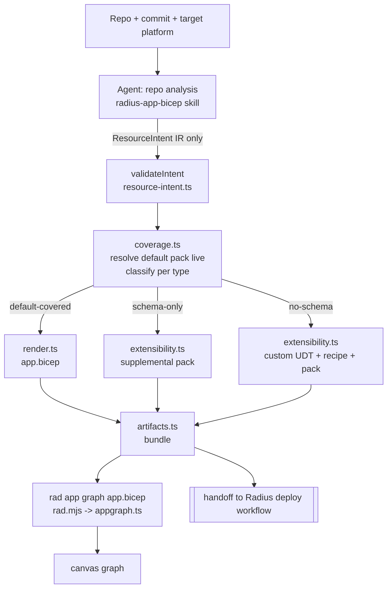
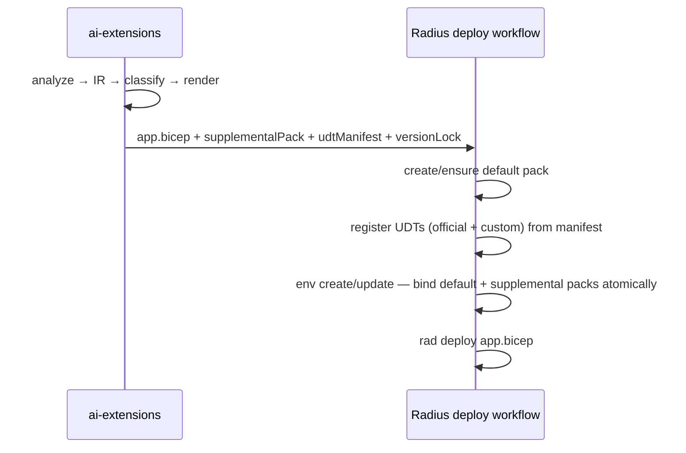

# Design Doc — Modernize Modeling to Recipe Packs + Extensibility

**Status:** Draft for review
**Author:** Copilot (with @nicolejms)
**Scope:** `radius-core/src/modeling/`, `radius-core/src/graph/`, `adapters/canvas/src/`, `adapters/shared/src/rad.mjs`
**Related:** vendored skill `.copilot/skills/radius-app-bicep/`, `radius-project/radius`, `radius-project/resource-types-contrib`

---

## 1. Context & Problem

The `modeling` subsystem turns a user's application repo into a Radius `app.bicep` (used for
deployment and for the app-graph visualization in the canvas). It was written for the *old* Radius
model and is now wrong in three ways:

1. **`recipes.ts` — `CANONICAL_RESOURCE_MAP`.** A hand-maintained map from each abstract Radius type
   to concrete cloud/K8s resources per provider. It drove a "planned graph" that guessed what infra a
   recipe would create. Radius now uses **recipe packs**, so this map is both redundant and drift-prone.

2. **`repo.ts` — `generateBicepFromRepo()`.** Builds `app.bicep` by string concatenation and
   heuristics. Output is non-deterministic in ordering/naming and can't guarantee a *compilable*,
   let alone *deployable*, file.

3. **`recipe-resolver.ts`.** Walks the *old* singular-recipe layout
   `<Category>/<typeName>/recipes/<platform>/<format>/` in `resource-types-contrib`, following mutable
   `main`. That layout and resolution model are obsolete.

Meanwhile two new things exist that we must build around:

- **Recipe packs** (`Radius.Core/recipePacks@2025-08-01-preview`): a single Bicep file whose `recipes`
  map is keyed by Radius type. A `Radius.Core/environments@2025-08-01-preview` references one or more
  packs via `recipePacks: [pack.id]`. Radius ships a **default pack per platform**
  (Azure `azure-avm`, AWS `aws-terraform`, K8s kube-recipes). **The default pack is the authoritative,
  current list of what a platform can deploy.**
- **`radius-app-bicep` skill** (vendored): deterministic rules for `app.bicep` — an allow-list of
  types, naming tables, schema resolution, secrets handling, connection conventions. This is the
  source of truth for *how* an app.bicep must look.

**Goal:** produce a **deployable** `app.bicep` as deterministically as possible, and create the
user-defined types (UDTs) + recipe packs required — using the default pack where it covers a resource,
and full Radius extensibility (custom UDT + recipe + pack) where it does not.

---

## 2. Goals / Non-Goals

### Goals

- Deterministic, repeatable `app.bicep` generation for a given repo + commit + platform.
- Automatically decide, per resource, whether the platform's **default recipe pack** already covers it.
- Register official UDTs and rely on the default pack when covered; generate custom UDT/recipe/pack
  (extensibility) when not — driven by the **live** default pack, not a hardcoded list.
- Emit a clean artifact bundle the Radius deploy workflow can consume without guesswork.
- Keep the graph visualization backed by the real `rad app graph`.

### Non-Goals

- ai-extensions does **not** create the default pack, register UDTs at runtime, create/update the
  environment, or deploy. Those remain owned by the Radius deploy workflow (the "seam", §9).
- No free-form generation of provider infrastructure/IAM/networking (fail closed instead — §7).
- Not changing the canvas rendering/diff of the graph beyond wiring.

---

## 3. Design Principles

1. **Split intent from artifacts.** The agent (LLM) is good at *semantic* analysis of a repo but is
   probabilistic. So the agent produces only a **validated data object** describing intent; all Bicep
   and pack/UDT text is produced by **deterministic code**. The agent never emits Bicep.
2. **The default pack is the source of truth for coverage.** We read it live; we never freeze a
   resource list in our repo.
3. **Uncovered resources get full extensibility — always.** For any type the default pack doesn't
   cover, generate a custom UDT + recipe + recipe pack **on-demand** via the
   `radius-extensibility-app-modeling` skill. We do **not** gate this on a pre-reviewed template
   library. "Fail closed" narrows to only the cases where the target itself is unresolvable (unknown
   platform, no resolvable environment/pack reference) — never merely because a resource type is new.
   The custom recipe body is the one probabilistic artifact; we contain that risk by compiling it and
   flagging it as unvalidated in diagnostics for human review before deploy (§7, §10).
4. **Pin tooling, not data.** Pin `rad`, the Radius bicep extension, and the contrib schema commit for
   reproducible compiles — but read the covered-type set from the live pack.

---

## 4. Target Architecture



**Data flow in one line:** `repo → IR (agent) → validate → classify vs live default pack → render
app.bicep + extensibility artifacts (code) → bundle → graph + deploy-workflow handoff`.

---

## 5. The Data Contract — `ResourceIntent` IR

**IR = Intermediate Representation:** a structured, JSON-schema-validated object (NOT Bicep text). It
is the *only* thing the agent produces. Everything downstream is deterministic code operating on it.

### 5.1 TypeScript shape (`modeling/resource-intent.ts`)

```ts
/** One backing service or compute component the agent detected in the repo. */
export interface ResourceIntent {
  /** Canonical Radius type, e.g. "Radius.Data/mySqlDatabases". MUST resolve
   *  against the live default pack or contrib schema; agent may not invent it. */
  type: string;
  /** Stable logical id used for naming + connection wiring, e.g. "mysql", "orders-postgres". */
  logicalName: string;
  /** Why the agent chose this — file paths + matched signals. Drives auditability. */
  evidence: Array<{ file: string; signal: string }>;
  /** 0..1 confidence. Low-confidence intents are surfaced, not silently dropped. */
  confidence: number;
  /** Type-specific, schema-constrained facts derived from source (never invented). */
  properties: {
    version?: string;          // e.g. "8.0" from mysql:8.0
    database?: string;         // e.g. MYSQL_DATABASE
    port?: number;
    [k: string]: unknown;      // validated against the resolved schema, not free-form
  };
  /** Container-only: how to build the image. */
  build?: { dockerfile: string; context: string };
  /** Declared dependencies on other intents (by logicalName) → become connections. */
  connections?: string[];
  /** App-level secrets the container expects (API keys, etc.). */
  expectedSecrets?: string[];
}

export interface AppIntent {
  appName: string;                 // kebab-case repo name
  platform: "azure" | "aws" | "kubernetes";
  repo: { org: string; name: string; ref: string }; // ref pinned to a commit SHA
  resources: ResourceIntent[];
}
```

### 5.2 Validation (`validateIntent`)

- JSON-schema validate the whole `AppIntent`.
- Every `resources[].type` must be on the skill allow-list **and** resolve to a contrib schema at the
  pinned commit (or to a covered type in the live default pack).
- Every `properties` key must exist in the resolved schema; unknown keys are rejected (no invented
  properties — matches skill rule "Do NOT invent properties").
- Every `connections[]` entry must reference an existing `logicalName`.
- `repo.ref` must look like a 40-char SHA (determinism: no floating tags/branches).
- On any failure → return structured errors; caller fails closed.

### 5.3 Example IR (todo-list-app, target = azure)

```json
{
  "appName": "todo-list-app",
  "platform": "azure",
  "repo": { "org": "dockersamples", "name": "todo-list-app", "ref": "a1b2c3...<sha>" },
  "resources": [
    { "type": "Radius.Compute/containers", "logicalName": "todo",
      "evidence": [{ "file": "Dockerfile", "signal": "EXPOSE 3000" }],
      "confidence": 0.98,
      "properties": { "port": 3000 },
      "build": { "dockerfile": "Dockerfile", "context": "." },
      "connections": ["mysql"], "expectedSecrets": [] },
    { "type": "Radius.Data/mySqlDatabases", "logicalName": "mysql",
      "evidence": [{ "file": "docker-compose.yml", "signal": "image: mysql:8.0" }],
      "confidence": 0.95,
      "properties": { "version": "8.0", "database": "todos" } }
  ]
}
```

---

## 6. Coverage — `modeling/coverage.ts`

**Purpose:** answer, per resource, *"does the target platform's default recipe pack already deploy
this type, or must we build it ourselves?"* — by reading the **live** default pack, never a hardcoded
list.

### 6.1 How the default pack is resolved

Per platform, the default pack reference is (in priority order):

1. Supplied by the caller / deploy environment (explicit pack OCI ref or repo path), else
2. The platform's published default pack:
   - **azure** → `resource-types-contrib/recipepack/azure/*-recipepack.bicep` (committed).
   - **aws** → the `aws-terraform` pack generated inline by `radius-project/radius`
     `.github/extension/run-rad-commands-aws.yml` (parse the pack it declares).
   - **kubernetes** → the kube-recipes default set. **Highest drift** — if no pack reference resolves,
     **fail closed** and ask for it (no guessing).

The pack source (a `Radius.Core/recipePacks` Bicep) is fetched at the pinned contrib commit and its
`recipes` map keys are parsed into the covered-type set.

### 6.2 API

```ts
export type CoverageState = "default-covered" | "schema-only" | "no-schema";

export interface DefaultPack {
  platform: "azure" | "aws" | "kubernetes";
  packId: string;                 // resolved pack identity/ref
  coveredTypes: Set<string>;      // parsed LIVE from the pack's `recipes` map keys
  source: { repo: string; path: string; ref: string }; // provenance for diagnostics
}

export async function resolveDefaultPack(
  platform: string, gh: GitHub, opts?: { packRef?: string }
): Promise<DefaultPack>;

export async function classify(
  type: string, pack: DefaultPack, gh: GitHub
): Promise<CoverageState>;
```

### 6.3 `classify()` decision table

| Contrib schema exists? | Type in `pack.coveredTypes`? | State | Downstream action |
| --- | --- | --- | --- |
| yes | yes | `default-covered` | Register official UDT; use default pack. No supplemental artifact. |
| yes | no | `schema-only` | Register official UDT; generate a **supplemental** recipe + pack for this type via the extensibility skill. |
| no | — | `no-schema` | Generate **custom** UDT schema + custom recipe + custom pack via the extensibility skill (fully autonomous). |

- "Contrib schema exists" = the type's `<Category>/<typeName>/<typeName>.yaml` resolves at the pinned
  commit (same derivation the skill uses, SKILL.md §Resource Type Resolution).
- Unresolvable platform default pack → throw → caller fails closed.

---

## 7. Extensibility — `modeling/extensibility.ts`

Handles the two non-default states. For anything the default pack doesn't cover we **always** produce
the artifacts needed to deploy it — using the `radius-extensibility-app-modeling` skill
([SKILL.md](https://github.com/nicolejms/radius/blob/nicolejms/extensibility-app-modeling-skill/.github/skills/radius-extensibility-app-modeling/SKILL.md))
to generate the custom type + recipe on-demand.

### 7.1 `schema-only` (official schema, no default recipe)

The official contrib schema registers the UDT, but the default pack has no recipe for it. We generate
a **supplemental recipe pack** containing just this type. The recipe body is produced by the
extensibility skill for the target platform.

```ts
export interface SupplementalRecipe {
  type: string;                         // Radius type
  kind: "bicep" | "terraform";
  source: string;                       // module/OCI ref or inline recipe produced by the skill
  parameters: Record<string, string>;   // templated {{context.resource.properties.*}}
  outputs: Record<string, unknown>;     // host/port/endpoint (+ secrets block)
}
```

### 7.2 `no-schema` (no contrib schema at all)

Generate a **custom UDT schema** (property set derived from the validated IR `properties`, typed
conservatively per the extensibility skill) **plus** a custom recipe for the target platform, bundled
into a custom recipe pack. This is the fully autonomous path — no reviewed-template prerequisite.

```ts
export interface CustomType {
  type: string;                         // e.g. Radius.Custom/<engine>
  schema: unknown;                      // UDT schema authored by the extensibility skill
  recipe: SupplementalRecipe;           // matching recipe for the target platform
}
```

### 7.3 What "fail closed" still covers

Only genuinely unresolvable targets abort:

- unknown/unsupported `platform`,
- no resolvable environment or default-pack reference for the platform.

A new or unusual resource **type never** triggers a fail — it goes through the extensibility skill.

### 7.4 Containing the probabilistic part

The custom recipe body is the one artifact code can't make fully deterministic. We contain it:

- **Compile gate:** every generated pack/recipe must compile under the pinned `rad` + extension; a
  recipe that doesn't compile is rejected (§10 gate 3).
- **Diagnostics flag:** each custom (skill-generated) recipe is recorded in `diagnostics` as
  `unvalidated-custom-recipe` with its provenance, so a human can review before the deploy workflow
  runs it.
- **Determinism elsewhere is unaffected:** the UDT schema, pack wrapper, naming, and app.bicep are
  still fully code-rendered; only the recipe *body* comes from the skill.

### 7.5 `modeling/recipe-templates/` (optional seed, not a gate)

Optional reviewed recipe examples the extensibility skill may use as starting points for common
`(platform, type)` combos. Their **absence never blocks generation** — they only improve quality/consistency
where present.

---

## 8. Renderer — `modeling/render.ts`

Turns a validated `AppIntent` into the exact `app.bicep` the vendored skill prescribes. **All naming,
ordering, API versions, secrets, and connections are code-owned constants/tables** — this is where
determinism is enforced.

```ts
export function renderAppBicep(intent: AppIntent, schemas: ResolvedSchemas): string;
```

Rules encoded (from `radius-app-bicep/SKILL.md` + references):

- **Resource order** (mandatory): extension → params → application → data/infra → secrets →
  containerImages → containers → routes.
- **Symbolic names** from the skill table: `todoApp`, `todoContainer`, `todoImage`, `mysqlDb`,
  `redisCache`, `<engine>Secret`, `todoRoute`. Multiple of an engine → prefix with source store name.
- **`name` values** kebab-case per the skill table.
- **Connection keys** lowercase engine+role (`mysqldb`, `postgresdb`, `rediscache`).
- **API versions** read from the resolved schema (currently `2025-08-01-preview`), never hardcoded.
- **containerImages** `build.source = git::https://github.com/<org>/<repo>.git//<subdir>?ref=<sha>`;
  `<subdir>` only when the Dockerfile isn't at repo root; `ref` is the pinned commit SHA.
- **Secrets**: inputs follow the schema (`username`/`password`, or `secretName`+secret, or none);
  password is always a `@secure() param`. Outputs (schema read-only `secrets` block) consumed via
  `valueFrom.secretKeyRef` using `<resource>.properties.secrets.name`.
- **Stable sort** within each section by `logicalName` so output is byte-identical across runs.
- **Self-contained**: no relative Bicep modules (so `rad app graph`'s single-file copy works, §11).

### 8.1 Example rendered output (from the §5.3 IR)

```bicep
extension radius

@description('The Radius environment ID.')
param environment string

@secure()
param mysqlPassword string

resource todoApp 'Radius.Core/applications@2025-08-01-preview' = {
  name: 'todo-list-app'
  properties: { environment: environment }
}

resource mysqlDb 'Radius.Data/mySqlDatabases@2025-08-01-preview' = {
  name: 'mysql'
  properties: {
    application: todoApp.id
    environment: environment
    database: 'todos'
    version: '8.0'
    username: 'myadmin'
    password: mysqlPassword
  }
}

resource todoImage 'Radius.Compute/containerImages@2025-08-01-preview' = {
  name: 'todo-list-app-image'
  properties: {
    application: todoApp.id
    build: { source: 'git::https://github.com/dockersamples/todo-list-app.git?ref=a1b2c3...' }
  }
}

resource todoContainer 'Radius.Compute/containers@2025-08-01-preview' = {
  name: 'todo-list-app'
  properties: {
    application: todoApp.id
    environment: environment
    containers: { todo: { image: todoImage.properties.imageReference, ports: { web: { containerPort: 3000 } } } }
    connections: { mysqldb: { source: mysqlDb.id } }
  }
}
```

*(Illustrative — exact schema properties come from the resolved contrib schema at render time.)*

---

## 9. Artifact Bundle & Workflow Seam

### 9.1 What ai-extensions emits — `modeling/artifacts.ts`

```ts
export interface ArtifactBundle {
  appBicep: string;                       // .radius/app.bicep
  bicepConfig: string;                    // .radius/bicepconfig.json (pinned extension ref)
  supplementalPack?: string;              // recipePacks bicep for schema-only/no-schema types
  udtManifest: UdtRegistration[];         // official + custom UDTs to register (ordered)
  versionLock: {                          // reproducibility record
    rad: string; extension: string; contribCommit: string; defaultPackId: string;
  };
  diagnostics: Diagnostic[];              // low-confidence intents, NeedsHumanInput, coverage notes
}
```

ai-extensions writes **only** these. It does **not** create the default pack, register UDTs, touch the
environment, or deploy.

### 9.2 Ownership boundary



**Watch:** `rad env update --recipe-packs` may **replace** rather than merge — the workflow must bind
default + supplemental packs in one atomic update (called out for the workflow owner, not implemented
here).

---

## 10. Determinism guarantees & validation gates

Pipeline (code side), each gate fails closed:

1. `validateIntent(AppIntent)` — JSON schema + allow-list + schema-key + connection-ref checks.
2. Canonicalize + stable-sort intents.
3. `renderAppBicep` → compile with **pinned** `rad` + extension (`rad bicep build` / `rad app graph`).
4. Static semantic checks: every emitted type is registered by the manifest; exactly one referenced
   pack covers each type; default vs supplemental coverage are disjoint; connection + secret keys
   match the resolved schemas.
5. *(CI only, optional)* ephemeral deploy + health check.

`rad app graph` proves the file **compiles**; it does not prove it **deploys** — hence gate 5.

### Determinism traps being fixed

- **Credential regeneration** (`adapters/canvas/src/bicep.mjs`): today random secrets/params are
  regenerated each run → secret rotation on reruns. Fix: stable/persisted values (`@secure() param`
  supplied by the workflow; never re-randomized in generation).
- **Version floating** (`rad.mjs`): uses `radius:latest` + latest `rad`. Fix: pin all three
  (`rad`, extension, contrib commit) in `versionLock`.
- **Relative modules**: `rad.mjs` copies a single Bicep file for graphing → keep `app.bicep`
  self-contained.

---

## 11. Graph path

Unchanged in spirit, cleaned in wiring: the planned graph is built by the real
`rad app graph <app.bicep>` (`adapters/shared/src/rad.mjs`) → `graph/appgraph.ts`
`applicationGraphToResources()` → canvas. The heuristic `CANONICAL_RESOURCE_MAP` planned-graph path is
deleted. `graph/model.ts` already skips `radius.core/recipepacks` nodes.

---

## 12. File-by-file change inventory

### CREATE — `radius-core/src/modeling/`

| File | Responsibility |
| --- | --- |
| `resource-intent.ts` | `AppIntent`/`ResourceIntent` types, JSON schema, `validateIntent()`. Agent output contract (§5). |
| `coverage.ts` | `resolveDefaultPack()` (live parse) + `classify()` 3-state (§6). No hardcoded type list. |
| `render.ts` | `renderAppBicep()` deterministic app.bicep from IR + resolved schemas (§8). |
| `extensibility.ts` | `schema-only`/`no-schema` → supplemental/custom UDT+recipe+pack generated on-demand via the `radius-extensibility-app-modeling` skill; compile-gated + flagged in diagnostics (§7). |
| `recipe-templates/` | Optional reviewed recipe seed examples the extensibility skill may reuse; absence never blocks generation. |
| `artifacts.ts` | `buildArtifacts()` → `ArtifactBundle` (app.bicep + supplemental pack + UDT manifest + versionLock + diagnostics) (§9). |

### REPLACE / GUT — `radius-core/src/modeling/`

| File | Change |
| --- | --- |
| `repo.ts` | Delete `generateBicepFromRepo` (string builder). Keep `discoverSourceCodeRefs`, `fetchBicepFromRepo`. |
| `recipes.ts` | Delete `CANONICAL_RESOURCE_MAP`, `categorizeToCanonicalType`, `resolveCanonicalResources`, `inferResourcesFromSchema`, `generateRecipeFromStaticMappings`. Keep pure helpers `formatResourceType`, `radiusTypeToContribDir`, `parseRecipeResources`, `mapFileToResourceType`. |
| `recipe-resolver.ts` | Delete `fetchRecipesFromGitHub`, `resolveRecipeOutputs`, `generateRecipeFromContrib`, `fetchRecipeFromAnyPlatform`. Keep/repoint `fetchResourceTypeSchema`, `loadRecipeResources` to the pinned commit. |

### KEEP — unchanged

| File | Why |
| --- | --- |
| `compose.ts`, `terraform.ts` | Pure evidence parsers feeding agent analysis. |
| `graph/appgraph.ts`, `graph/model.ts`, `graph/diff.ts` | Already rad-based. |

### UPDATE — barrels & adapters

| File | Change |
| --- | --- |
| `modeling/index.ts` | Drop removed exports; add `resource-intent`, `coverage`, `render`, `extensibility`, `artifacts`. |
| `radius-core/src/index.ts` | Re-export new surface; drop retired symbols. |
| `adapters/shared/src/rad.mjs` | Pin `rad` + extension (`RADIUS_BICEP_CONFIG` `radius:latest` → pinned tag) + contrib commit. |
| `adapters/canvas/src/extension.mjs` | `radius_generate_app` → point at vendored skill + `ResourceIntent` contract; remove stale external skill URL + hardcoded type table. |
| `adapters/canvas/src/server.mjs` | Rewire planned-graph + `generateBicepFromRepo` call sites to rad-graph + `artifacts.ts`. |
| `adapters/canvas/src/bicep.mjs` | Stop regenerating credentials on reruns (stable/persisted). |
| `adapters/canvas/src/deploy.mjs` | Verify supplemental-pack + UDT-manifest handoff (seam); minor wiring. |

### TESTS

| File | Change |
| --- | --- |
| `recipes_test.ts`, `recipe-resolver_test.ts`, `repo_test.ts` | Remove string-locking tests for deleted heuristics; keep tests for retained pure helpers. |
| `resource-intent_test.ts`, `coverage_test.ts`, `render_test.ts`, `extensibility_test.ts` (NEW) | IR schema validation; coverage classification (3 states + fail-closed); renderer golden + `rad bicep build` compile; extensibility template select + fail-closed. |
| `compose_test.ts`, `terraform_test.ts` | Keep as-is. |

---

## 13. Test strategy

- **IR validation:** valid/invalid fixtures; invented type → reject; unknown property → reject;
  floating ref → reject; dangling connection → reject.
- **Coverage:** mock default pack (Azure/AWS) → assert `default-covered`/`schema-only`; missing schema
  → `no-schema`; unresolvable K8s pack → throws (fail closed).
- **Renderer:** golden `app.bicep` per fixture app **and** a compile gate (`rad bicep build` with the
  pinned extension) so goldens can't drift into non-compiling output. Byte-stability across two runs.
- **Extensibility:** uncovered type → custom UDT + recipe + pack generated via the skill, compiles
  under pinned `rad`, and is flagged `unvalidated-custom-recipe` in diagnostics; unresolvable platform
  → fail closed.
- **Build/verify:** `pnpm run build`, `pnpm run typecheck`, `pnpm --filter @radius-project/core test`.

---

## 14. Open questions / assumptions to confirm

1. **K8s default pack source.** Assumption: resolve it the same way (live parse); if no committed pack
   reference resolves, fail closed and request one. Confirm the canonical K8s pack location/ref.
2. **Extensibility skill invocation** — how `extensibility.ts` calls the
   `radius-extensibility-app-modeling` skill from within generation (vendor the skill locally vs fetch
   at runtime), and how it passes platform + IR context to get a compilable recipe body back.
3. **Pack reference input** — does the deploy environment pass the default pack ref to ai-extensions,
   or do we always resolve the published default? Affects `resolveDefaultPack` priority order.
4. **UDT registration format** — exact shape the deploy workflow expects in `udtManifest` (bicep vs
   `rad resource-type create` inputs).
5. **Pinned versions** — pick the initial `rad` release tag, extension tag, and contrib commit SHA.

---

## 15. Phasing (maps to SQL todos)

0. Foundation: pin tooling + `coverage.ts` (`resolveDefaultPack` live parse + `classify`).
1. `resource-intent.ts` IR + schema + validator.
2. `render.ts` deterministic renderer.
3. `extensibility.ts` + reviewed `recipe-templates/`.
4. `artifacts.ts` bundle.
5. Graph rewire via `rad app graph`; delete `CANONICAL_RESOURCE_MAP` + resolver heuristics.
6. Adapters: `extension.mjs` skill+IR, `server.mjs` rewire, `bicep.mjs` credentials, `rad.mjs` pins.
7. Validation gates + full test suite; build/typecheck/core tests green.
